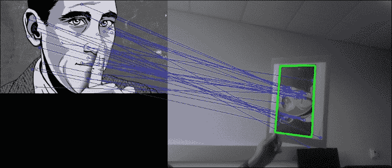
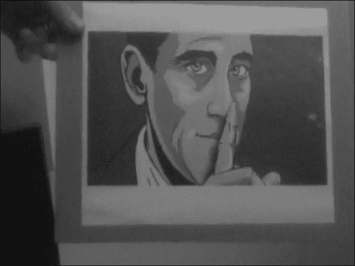
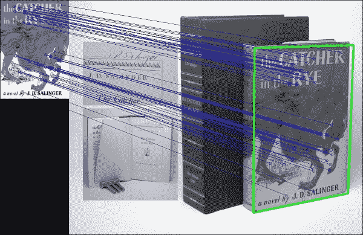
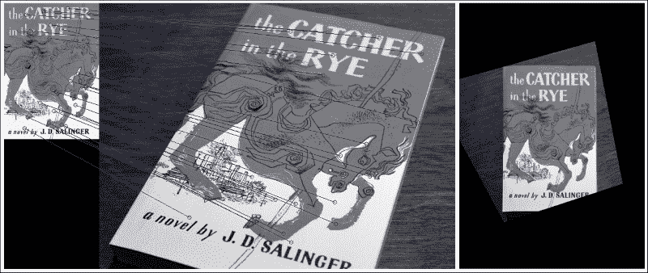
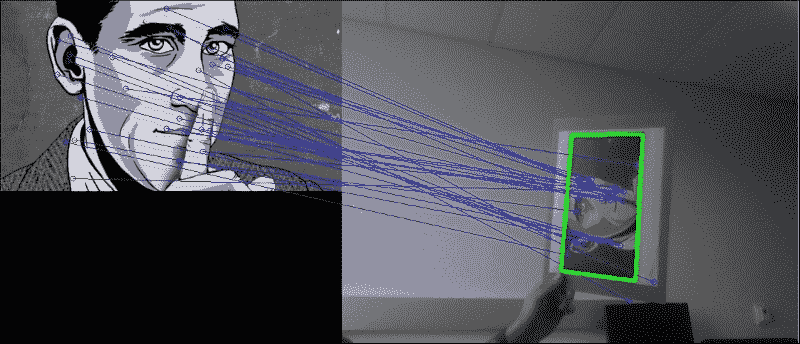

# 第 3 章。通过特征匹配和透视变换查找对象

本章的目的是开发一种应用程序，即使从不同角度或距离或在部分遮挡的情况下查看该对象，该应用程序也可以检测并跟踪网络摄像头视频流中的对象。

在本章中，我们将介绍以下主题：

*   特征提取
*   特征匹配
*   功能追踪

在上一章中，您学习了如何在受控的环境中检测和跟踪简单的对象（手的轮廓）。 更具体地说，我们指示应用程序的用户将手放在屏幕的中央区域，并假设了对象（手）的大小和形状。 但是，如果我们想检测和跟踪任意大小的物体（可能是从多个角度或部分遮挡的角度观察）怎么办？

为此，我们将使用特征描述符，这是捕获感兴趣对象的重要属性的一种方式。 我们这样做是为了即使将对象嵌入繁忙的视觉场景中也可以对其进行定位。 我们将再次将我们的算法应用于网络摄像头的实时流，并尽力保持算法的健壮性和足够的实时性。

# 应用执行的任务

该应用程序将分析每个捕获的帧以执行以下任务：

*   **特征提取**：我们将使用**加速鲁棒特征**（ **SURF** ）描述一个感兴趣的对象，这是一种用于查找与众不同的[ 图像中的 **关键点**既是比例不变的，也是旋转不变的。 这些关键点将帮助我们确保在多个帧上跟踪正确的对象。 由于对象的外观可能会不时发生变化，因此重要的是要找到关键点，即不取决于对象的观看距离或视角（因此，缩放比例和旋转不变性）。
*   **特征匹配**：我们将尝试使用**快速库（近似最近邻居）**（ **FLANN** ）在关键点之间建立对应关系，以查看帧是否包含 关键点类似于我们感兴趣的对象的关键点。 如果找到合适的匹配项，则将在每个帧中标记对象。
*   **特征跟踪**：我们将使用各种形式的**早期** **离群值检测**和 [ **离群剔除**以加快算法的速度。
*   **透视变换**：然后，我们将通过**扭曲透视图**来使对象经受过的所有平移和旋转，以使对象在屏幕中央竖直显示。 这样会产生一种很酷的效果，其中对象看起来像冻结在一个位置上，而整个周围的场景都围绕着它旋转。

下图显示了前三个步骤的示例，左图包含我们感兴趣的对象的模板图像，右图则包含我的模板图像的打印输出。 两个框架中的匹配特征用蓝线连接，并且找到的对象在右侧以绿色勾勒出轮廓：



最后一步是变换定位的对象，以便将其投影到正面（应该看起来像原始模板图像，看起来像是特写镜头，并且大致垂直），而整个场景似乎都在扭曲， 如下图所示：



### 注意

同样， GUI 将使用 wxPython 2.8 设计，可以从 [http://www.wxpython.org/download.php](http://www.wxpython.org/download.php) 获得。 本章已经过 OpenCV 2.4.9 的测试。 请注意，如果您使用的是 OpenCV 3，则可能必须从 [https://github.com/Itseez/opencv_contrib](https://github.com/Itseez/opencv_contrib) 获得所谓的*额外的*模块 3 设置`OPENCV_EXTRA_MODULES_PATH`变量以安装 SURF 和 FLANN。 另外，请注意，您可能必须获得许可才能在商业应用程序中使用 SURF。

# 规划应用

最终的应用程序将包括用于检测，匹配和跟踪图像特征的 Python 类，以及用于访问网络摄像头并显示每个处理过的帧的 wxPython GUI 应用程序。

该项目将包含以下模块和脚本：

*   `feature_matching`：模块包含用于特征提取，特征匹配和特征跟踪的算法。 我们将此算法与应用程序的其余部分分开，以便无需 GUI 即可将其用作独立模块。
*   `feature_matching.FeatureMatching`：一个类，用于实现整个功能匹配的处理流程。 它接受 RGB 相机框架并尝试在其中找到感兴趣的对象。
*   `gui`：提供 wxPython GUI 应用程序以访问捕获设备并显示视频提要的模块。 这与我们在前面各章中使用的模块相同。
*   `gui.BaseLayout`：一种通用布局，可以从中构建更复杂的布局。 本章不需要对基本布局进行任何修改。
*   `chapter3`：本章的主要脚本。
*   `chapter3.FeatureMatchingLayout`：基于`gui.BaseLayout`的自定义布局，显示网络摄像头视频供稿。 每个捕获的帧将使用前面描述的`FeatureMatching`类进行处理。
*   `chapter3.main`：主要的功能例程，用于启动 GUI 应用程序和访问深度传感器。

# 设置应用

在深入研究功能匹配算法之前，我们需要确保可以访问网络摄像头并在简单的 GUI 中显示视频流。 幸运的是，我们已经在[第 1 章](17.html "Chapter 1. Fun with Filters")和*过滤器*的使用中弄清楚了如何做到这一点。

## 运行应用

为了运行我们的应用程序，我们将需要执行访问网络摄像头，生成 GUI 并执行应用程序主循环的主函数例程：

```py
import cv2
import wx

from gui import BaseLayout
from feature_matching import FeatureMatching

def main():
    capture = cv2.VideoCapture(0)
    if not(capture.isOpened()):
        capture.open()

    capture.set(cv2.cv.CV_CAP_PROP_FRAME_WIDTH, 640)
    capture.set(cv2.cv.CV_CAP_PROP_FRAME_HEIGHT, 480)

    # start graphical user interface
    app = wx.App()

    layout = FeatureMatchingLayout(None, -1, 'Feature Matching', capture)
    layout.Show(True)
    app.MainLoop()
```

### 注意

如果使用的是 OpenCV 3，则所要查找的常量可能称为`cv3.CAP_PROP_FRAME_WIDTH`和`cv3.CAP_PROP_FRAME_HEIGHT`。

## FeatureMatching GUI

与上一章相似，为当前项目（`FeatureMatchingLayout`）选择的布局尽可能简单。 它应该仅以每秒 10 帧的舒适帧速率显示网络摄像头的视频提要。 因此，无需进一步自定义`BaseLayout`：

```py
class FeatureMatchingLayout(BaseLayout):
    def _create_custom_layout(self):
        pass
```

这次需要初始化的唯一参数是功能匹配类。 我们将描述感兴趣对象的模板（或训练）文件的路径传递给它：

```py
    def _init_custom_layout(self):
        self.matching = FeatureMatching(train_image='salinger.jpg')
```

可视化管道的其余部分由`BaseLayout`类处理。 我们只需要确保我们为提供了`_process_frame`方法。 此方法接受 RGB 彩色图像，通过`FeatureMatching`方法`match`的对其进行处理，然后将处理后的图像进行可视化。 如果在当前帧中检测到对象，则`match`方法将报告`success=True`，我们`will`返回已处理的帧。 如果 match 方法不成功，我们将简单地返回输入帧：

```py
    def _process_frame(self, frame):
        self.matching = FeatureMatching(train_image='salinger.jpg')
        # if object detected, display new frame, else old one
        success, new_frame = self.matching.match(frame)
        if success:
            return new_frame
        else:
            return frame
```

# 处理流程

通过`FeatureMatching`类，尤其是通过其公共`match`方法来提取，匹配和跟踪特征。 但是，在开始分析传入的视频流之前，我们需要做一些功课。 可能尚不清楚其中的某些含义（特别是对于 SURF 和 FLANN），但我们将在以下各节中详细讨论这些步骤。 现在，我们只需要担心初始化：

```py
class FeatureMatching:
     def __init__(self, train_image='salinger.jpg'):
```

1.  这将设置 SURF 检测器（详细信息请参见下一部分），其 Hessian 阈值在 300 到 500 之间：

    ```py
    self.min_hessian = 400
    self.SURF = cv2.SURF(self.min_hessian)
    ```

2.  我们加载了我们感兴趣的对象的模板（`self.img_obj`），或者在找不到该模板时显示错误：

    ```py
    self.img_obj = cv2.imread(train_image, cv2.CV_8UC1)
    if self.img_obj is None:
        print "Could not find train image " + train_imageraise SystemExit
    ```

3.  Also, store the shape of the image (`self.sh_train`) for convenience:

    ```py
    self.sh_train = self.img_train.shape[:2]  # rows, cols
    ```

    由于的原因很快就会清楚，我们将模板图像称为**训练图像**，并将每个传入帧称为**查询图像**。 火车图像的尺寸为 480 x 270 像素，如下所示：

    

4.  Apply SURF to the object of interest. This can be done with a convenient function call that returns both a list of keypoints and the descriptor (see the next section for details):

    ```py
    self.key_train, self.desc_train = self.SURF.detectAndCompute(self.img_obj, None)
    ```

    我们将对每个传入的帧执行相同的操作，并比较图像中的特征列表。

5.  设置一个 FLANN 对象（有关详细信息，请参阅下一节）。 这要求通过字典指定一些其他参数，例如使用哪种算法以及并行运行多少棵树：

    ```py
    FLANN_INDEX_KDTREE = 0
    index_params = dict(algorithm = FLANN_INDEX_KDTREE,trees = 5)
    search_params = dict(checks=50)
    self.flann = cv2.FlannBasedMatcher(index_params, search_params)
    ```

6.  最后，初始化一些其他簿记变量。 当我们要使功能跟踪更快，更准确时，这些工具将很方便。 例如，我们将跟踪最新的计算单应性矩阵以及已花费的帧数，而不会找到感兴趣的对象（有关详细信息，请参阅下一节）：

    ```py
    self.last_hinv = np.zeros((3,3))
    self.num_frames_no_success = 0
    self.max_frames_no_success = 5
    self.max_error_hinv = 50.
    ```

然后，大部分工作通过`FeatureMatching`方法`match`完成。 此方法遵循此处阐述的过程：

1.  它从每个传入的视频帧中提取有趣的图像特征。 这是在`FeatureMatching._extract_features`中完成的。
2.  它与模板图像和视频帧之间的功能匹配。 这是在`FeatureMatching._match_features`中完成的。 如果找不到这样的匹配项，它将跳到下一帧。
3.  它找到视频帧中模板图像的拐角点。 这是在`FeatureMatching._detect_corner_points`中完成的。 如果任何一个角位于（显着）框架外，则跳到下一帧。
4.  它计算四个角点跨越的四边形的面积。 如果该区域太小或太大，则跳至下一帧。
5.  它概述了当前帧中模板图像的拐角点。
6.  它找到将定位对象从当前帧移到`frontoparallel`平面所必需的透视变换。 这是在`FeatureMatching._warp_keypoints`中完成的。 如果结果与我们先前在较早的帧中得到的结果明显不同，则跳至下一帧。
7.  它扭曲当前帧的透视图，以使感兴趣的对象显得居中且直立。

在以下各节中，我们将详细讨论这些步骤。

# 特征提取

一般来说，特征是图像的*感兴趣区域*。 它是图像的可测量属性，对于图像所代表的内容非常有用。 通常，单个像素的灰度值（*原始数据*）不会告诉我们很多有关图像的整体信息。 相反，我们需要派生一个更具信息量的属性。

例如，知道图像中有看起来像眼睛，鼻子和嘴巴的斑点，将使我们能够推断出图像代表面部的可能性。 在这种情况下，描述数据（我们看到的是人脸的图像？）所需的资源数量大大减少了（图像中是否包含两只眼睛，鼻子或嘴巴？）。

通常，更底层的功能（例如，边缘，拐角，斑点或山脊的存在）可能会提供更多信息。 根据应用程序的不同，某些功能可能会比其他功能更好。 一旦确定了如何描述我们喜欢的功能，就需要想出一种方法来检查图像是否包含此类功能以及在何处包含这些功能。

## 功能检测

在图像中查找感兴趣区域的过程称为特征检测。 OpenCV 提供了一系列功能检测算法，例如：

*   **哈里斯角点检测**：知道边缘是在所有方向上强度都发生高强度变化的区域，因此 Harris 和 Stephens 提出了一种快速找到此类区域的方法。 该算法在 OpenCV 中实现为`cv2.cornerHarris`。
*   **Shi-Tomasi 拐角检测**：Shi 和 Tomasi 对要跟踪的好特征有自己的想法，通常通过找到最强的 *N* 来比哈里斯拐角检测做得更好。 角落。 该算法在 OpenCV 中实现为`cv2.goodFeaturesToTrack`。
*   **尺度不变特征变换**（ **SIFT** ）：当图像的尺度发生变化时，角落检测不足。 为此，Lowe 开发了一种方法来描述图像中与方向和大小无关的关键点（因此，名称为 **缩放不变式**）。该算法在 OpenCV2 中实现为`cv2.SIFT`，但是 由于其代码是专有的，因此已被移至 OpenCV3 中的*额外的*模块。
*   **加速的稳健功能**（ **SURF** ）：SIFT 已被证明是非常好的，但是对于大多数应用来说还不够快。 这就是 SURF 的用武之地，它用盒式过滤器代替了[FTG5] SIFT 中昂贵的高斯拉普拉斯算子。 算法在 OpenCV2 中实现为`cv2.SURF`，但与 SIFT 一样，由于其代码是专有的，因此已移至 OpenCV3 中的*额外*模块。

OpenCV 支持更多的特征描述符，例如**，**（来自加速段测试的特征（ **FAST** ），**二进制** **鲁棒独立 基本特征**（**简报**）和**定向的 FAST 和旋转简报**（ **ORB** ），后者是 SIFT 或 冲浪。

## 使用 SURF 检测图像中的特征

在本章的其余部分中，我们将使用 SURF 检测器。

SURF 算法可以粗略地分为两个不同的步骤：检测兴趣点和制定描述符。 SURF 依赖于 Hessian 角点检测器进行兴趣点检测，这需要设置`min_hessian`阈值。 此阈值决定了将点用作兴趣点必须使用的 Hessian 滤波器的输出大小。 值越大，则理论上的兴趣点就越少，但（理论上）就越多，而值越小，结果点的数量就越多但就越少。 随意尝试不同的值。 在本章中，我们将选择`400`的值，如先前在`FeatureMatching.__init__`中所见，我们在其中创建了具有以下代码段的 SURF 描述符：

```py
self.min_hessian = 400
self.SURF = cv2.SURF(self.min_hessian)
```

然后可以在一个步骤中，例如在输入图像`img_query`上不使用遮罩（`None`）在单个步骤中获得特征和描述符：

```py
key_query, desc_query = self.SURF.detectAndCompute(img_query, None)
```

在 OpenCV 2.4.8 或更高版本中，我们现在可以使用以下功能轻松绘制关键点：

```py
imgOut = cv2.drawKeypoints(img_query, key_query, None, (255, 0, 0), 4)
cv2.imshow(imgOut)
```

### 注意

确保先检查`len(keyQuery)`，因为 SURF 可能会返回大量功能。 如果只关心绘制关键点，请尝试将`min_hessian`设置为较大的值，直到返回的关键点数量可控。

如果我们的 OpenCV 发行版本早于该版本，则可能必须编写我们自己的函数。 注意 SURF 受专利法保护。 因此，如果您希望在商业应用中使用 SURF，则将需要获得许可证。

# 功能匹配

一旦从两个（或多个）图像中提取了特征及其描述符，就可以开始询问这些特征中的某些特征是否同时出现在两个（或所有）图像中。 例如，如果我们同时拥有我们感兴趣的对象（`self.desc_train`）和当前视频帧（`desc_query`）的描述符，则可以尝试查找当前帧中看起来像我们感兴趣的对象的区域。 这是通过以下方法完成的，其中利用**快速库来获取近似最近的邻居**（ **FLANN** ）：

```py
good_matches = self._match_features(desc_query)
```

查找帧到帧对应关系的过程可以公式化为：从一组描述符中为另一组的每个元素搜索最近的邻居。

第一组描述符通常称为训练集，因为在机器学习中，这些描述符用于训练某些模型，例如我们要检测的对象的模型。 在我们的例子中，训练集对应于模板图像（我们感兴趣的对象）的描述符。 因此，我们将模板图像称为*火车图像*（`self.img_train`）。

第二个集合通常称为查询集，因为我们不断询问它是否包含火车图像。 在我们的情况下，查询集对应于每个传入帧的描述符。 因此，我们将帧称为*查询图像*（`img_query`）。

可以通过多种方式对功能进行匹配，例如，借助蛮力匹配器（`cv2.BFMatcher`），可以通过尝试每个匹配器来查找第一组中的每个描述符和第二组中最接近的描述符。 一（详尽搜索）。

## 使用 FLANN 在图像之间进行匹配的功能

替代方法是使用近似 **k 最近邻**（ **kNN** ）算法来查找对应关系，该算法基于快速第三方库 FLANN。 使用以下代码段执行 FLANN 匹配，其中我们将 kNN 与`k=2`结合使用：

```py
def _match_features(self, desc_frame):
    matches = self.flann.knnMatch(self.desc_train, desc_frame, k=2)
```

`flann.knnMatch`的结果是两个描述符集之间的对应关系列表，两个描述符都包含在`matches`变量中。 这些是火车集，因为它对应于我们感兴趣的对象的模式图像，而查询集是因为它对应于我们正在搜索我们的感兴趣对象的图像。

## 用于离群值去除的比率测试

找到的正确匹配越多（这意味着存在更多的图案与图像对应关系），则图案出现在图像中的机会就越大。 但是，某些匹配可能是误报。

消除异常值的一种众所周知的技术称为比率测试。 由于我们执行了 k = 2 的 kNN 匹配，因此每次匹配都会返回两个最近的描述符。 第一个匹配是最接近的邻居，第二个匹配是第二个最接近的邻居。 直观地，正确的匹配将使第一个邻居比第二个邻居更近。 另一方面，两个最近的邻居与不正确匹配的距离相近。 因此，我们可以通过查看距离之间的差异来找出匹配的良好程度。 **比率测试**说，只有当第一个匹配项和第二个匹配项之间的距离比小于给定的数字（通常为 0.5 左右）时，该匹配项才是好的。 在我们的案例中，该数字选择为 0.7。 要删除所有不满足此要求的匹配项，我们过滤匹配项列表，并将好的匹配项存储在`good_matches`变量中：

```py
# discard bad matches, ratio test as per Lowe's paper
good_matches = filter(lambda x: x[0].distance<0.7*x[1].distance,matches)
```

然后，将找到的匹配项传递给`FeatureMatching.match`，以便可以对其进行进一步处理：

```py
return good_matches
```

## 可视化功能匹配

在 OpenCV 的较新版本中，我们可以轻松地使用`cv2.drawMatches`或`cv3.drawMatchesKnn`进行匹配。

在旧版本的 OpenCV 中，我们可能需要编写我们自己的函数。 目的是将感兴趣的对象和当前视频帧（我们希望将对象嵌入其中）彼此相邻绘制：

```py
def draw_good_matches(img1, kp1, img2, kp2, matches):
    # Create a new output image that concatenates the
    # two images together (a.k.a) a montage
    rows1, cols1 = img1.shape[:2]
    rows2, cols2 = img2.shape[:2]
    out = np.zeros((max([rows1, rows2]), cols1+cols2, 3), dtype='uint8')
```

为了在图像上绘制彩色线条，我们创建了一个三通道 RGB 图像：

```py
    # Place the first image to the left, copy 3x for RGB
    out[:rows1, :cols1, :] = np.dstack([img1, img1, img1])

    # Place the next image to the right of it, copy 3x for RGB
    out[:rows2, cols1:cols1 + cols2, :] = np.dstack([img2, img2,img2])
```

然后，对于两个图像之间的每对点，我们绘制一个小的蓝色圆圈，并用一条线连接两个圆圈。 为此，我们必须遍历匹配的关键点列表。 关键点在 Python 中存储为元组，其中两个条目分别用于 *x* 和 *y* 坐标。 每个匹配项`m`将索引存储在关键点列表中，其中`m.trainIdx`指向第一个关键点列表（`kp1`）中的索引，而`m.queryIdx`指向第二个关键点列表（`kp2`中的索引） ）：

```py
for m in matches:
    # Get the matching keypoints for each of the images
    c1, r1 = kp1[m.trainIdx].pt
    c2, r2 = kp2[m.queryIdx].pt
```

使用正确的索引，我们现在可以在正确的位置绘制一个圆（半径为 4，颜色为蓝色，厚度为 1），然后用一条线连接这些圆：

```py
    radius = 4
    BLUE = (255, 0, 0)
    thickness = 1
    # Draw a small circle at both co-ordinates
    cv2.circle(out, (int(c1), int(r1)), radius, BLUE, thickness)
    cv2.circle(out, (int(c2) + cols1, int(r2)), radius, BLUE, thickness

    # Draw a line in between the two points
    cv2.line(out, (int(c1), int(r1)), (int(c2) + cols1, int(r2)), BLUE, thickness)
    return out
```

然后，可以使用以下代码绘制返回的图像：

```py
cv2.imshow('imgFlann', draw_good_matches(self.img_train, self.key_train, img_query, key_query, good_matches))
```

蓝线将对象（左）的特征连接到风景（右）的特征，如下所示：


在像这样的简单示例中，这可以很好地工作，但是当场景中还有其他对象时会发生什么呢？ 由于我们的对象包含一些看起来很突出的字母，所以当出现其他单词时会发生什么？

事实证明，该算法即使在这样的条件下也可以工作，如您在此屏幕快照中所见：


有趣的是，该算法并未将作者的姓名与场景中该书旁边的黑白字母字母混淆，即使他们拼出了相同的名字。 这是，因为该算法找到了不完全依赖灰度表示的对象描述。 另一方面，进行逐像素比较的算法可能很容易混淆。

## 单应估计

由于我们假设感兴趣的对象是平面（图像）且是刚性的，因此我们可以找到两个图像的特征点之间的单应性变换。 全息术将计算将对象图像（`self.key_train`）中的所有特征点与当前图像帧（`self.key_query`）中的所有特征点置于同一平面所需的透视变换。 但是首先，我们需要找到所有匹配良好的关键点的图像坐标：

```py
def _detect_corner_points(self, key_frame, good_matches):
    src_points = [self.key_train[good_matches[i].trainIdx].pt
        for i in xrange(len(good_matches))]
    dst_points = [keyQuery[good_matches[i].queryIdx].pt
        for i in xrange(len(good_matches))]
```

为了找到正确的透视图变换（单应性矩阵`H`），`cv2.findHomography`函数将使用**随机样本共识**（ **RANSAC** ）方法进行探测 输入点的不同子集：

```py
H, _ = cv2.findHomography(np.array(src_points), np.array(dst_points), cv2.RANSAC)
```

单应矩阵`H`然后可以帮助我们将模式中的任何点转换为风景，例如将训练图像中的角点转换为查询图像中的角点。 换句话说，这意味着我们可以通过变换训练图像的拐角点在查询图像中绘制书籍封面的轮廓！ 为此，我们获取训练图像（`src_corners`）的角点列表，并通过执行透视变换来查看它们在查询图像中的投影位置：

```py
self.sh_train = self.img_train.shape[:2]  # rows, cols
src_corners = np.array([(0,0), (self.sh_train[1],0), (self.sh_train[1],self.sh_train[0]), (0,self.sh_train[0])], dtype=np.float32)
dst_corners = cv2.perspectiveTransform(src_corners[None, :, :], H)
```

`dst_corners`返回参数是图像点的列表。 我们要做的就是在`dst_corners`中的每个点与下一个点之间画一条线，然后在风景中勾画出轮廓。 但是首先，为了在正确的图像坐标处画线，我们需要将 *x* 坐标偏移图案图像的宽度（因为我们将两个图像彼此相邻显示）：

```py
dst_corners = map(tuple,dst_corners[0])
dst_corners = [(np.int(dst_corners[i][0]+self.sh_train[1]),np.int(dst_corners[i][1]))
```

然后，我们可以从列表中的*第*点到第*（i + 1）*点的位置画线（环绕到 0）：

```py
for i in xrange(0,len(dst_corners)):
    cv2.line(img_flann, dst_corners[i], dst_corners[(i+1) % 4],(0, 255, 0), 3)
```

最后，我们绘制书籍封面的轮廓，如下所示：



即使对象仅部分可见，此方法也适用，如下所示：


## 扭曲图像

我们也可以做相反的工作-从探查的风景到训练模式的坐标。 使书的封面可以放在正面，就像我们直接从上方看一样。 为此，我们可以简单地采用单应矩阵的逆来获得逆变换：

```py
Hinv = cv2.linalg.inverse(H)
```

但是，这会将书皮的左上角映射到我们新图像的原点，这将切断书皮左侧和上方的所有内容。 取而代之的是，我们要使书的封面在图像中大致居中。 因此，我们需要计算一个新的单应矩阵。 作为输入，我们将有我们的`pts_scene`风景点。 作为输出，我们需要具有与图案图像相同形状的图像：

```py
dst_size = img_in.shape[:2]  # cols, rows
```

书的封面应该大约是书本大小的一半。 我们可以提出一个比例因子和一个偏差项，以便将风景图像中的每个关键点映射到新图像中的正确坐标：

```py
scale_row = 1./src_size[0]*dst_size[0]/2.
bias_row = dst_size[0]/4.
scale_col = 1./src_size[1]*dst_size[1]/2.
bias_col = dst_size[1]/4.
```

接下来，我们只需要将此线性缩放应用于列表中的每个关键点即可。 最简单的方法是使用列表推导：

```py
src_points = [key_frame[good_matches[i].trainIdx].pt
    for i in xrange(len(good_matches))]
dst_points = [self.key_train[good_matches[i].queryIdx].pt
    for i in xrange(len(good_matches))]
dst_points = [[x*scale_row+bias_row, y*scale_col+bias_col]
    for x, y in dst_points]
```

然后，我们可以找到这些点之间的单应性矩阵（确保将列表转换为 NumPy 数组）：

```py
Hinv, _ = cv2.findHomography(np.array(src_points), np.array(dst_points), cv2.RANSAC)
```

之后，我们可以使用单应性矩阵来变换图像中的每个像素（也称为使图像变形）：

```py
img_warp = cv2.warpPerspective(img_query, Hinv, dst_size)
```

结果看起来像这样（左侧匹配，右侧图像变形）：


透视变换产生的图像可能无法与`frontoparallel`平面完全对齐，因为毕竟单应性矩阵只是近似的。 但是，在大多数情况下，我们的方法很好用，例如下图所示的示例：



# 功能跟踪

现在我们的算法适用于单帧，我们如何确保在一帧中找到的图像也会在下一帧中找到？

在`FeatureMatching.__init__`中，我们创建了一些簿记变量，我们说过这些变量将用于功能跟踪。 主要思想是在从一帧到下一帧的同时增强一些连贯性。 由于我们每秒捕获大约 10 帧，因此可以合理地假设从一帧到下一帧的变化不会太大。 因此，我们可以确保在任何给定帧中获得的结果都必须与在前一帧中获得的结果相似。 否则，我们将丢弃结果并继续进行下一帧。

但是，我们必须注意不要卡在我们认为合理但实际上是异常值的结果上。 为了解决此问题，我们一直在跟踪找到的帧数，但找不到合适的结果。 我们使用`self.num_frames_no_success`； 如果此数字小于某个阈值，例如`self.max_frames_no_success`，我们将在帧之间进行比较。 如果它大于阈值，则我们认为自从获得最后一个结果以来已经过去了太多的时间，在这种情况下，比较帧之间的结果将是不合理的。

## 早期异常值检测和拒绝

我们可以将异常排除的概念扩展到计算的每个步骤。 然后目标就变成了，从而最大程度地减少了工作量，同时最大程度地提高了我们获得的结果是好的结果的可能性。

用于早期异常值检测和拒绝的结果过程嵌入在`FeatureMatching.match`中，其外观如下：

```py
def match(self, frame):
    # create a working copy (grayscale) of the frame
    # and store its shape for convenience
    img_query = cv2.cvtColor(frame, cv2.COLOR_BGR2GRAY)
    sh_query = img_query.shape[:2]  # rows,cols
```

1.  Find good matches between the feature descriptors of the pattern and the query image:

    ```py
    key_query, desc_query = self._extract_features(img_query)
    good_matches = self._match_features(descQuery)
    ```

    为了使 RANSAC 能够在下一步工作，我们至少需要进行四次匹配。 如果发现较少的比赛，我们承认失败并立即返回`False`：

    ```py
    if len(good_matches) < 4:
        self.num_frames_no_success=self.num_frames_no_success + 1
        return False, frame
    ```

2.  Find the corner points of the pattern in the query image (`dst_corners`):

    ```py
    dst_corners = self._detect_corner_points(key_query, good_matches)
    ```

    如果这些点中的任何一个位于图像的外面（在本例中为 20 像素），则意味着我们不是在关注感兴趣的对象，或者感兴趣的对象并不完全在图像中。 在这两种情况下，我们都没有继续进行的兴趣，因此我们返回`False`：

    ```py
    if np.any(filter(lambda x: x[0] < -20 or x[1] < -20
        or x[0] > sh_query[1] + 20 or x[1] > sh_query[0] + 20,
        dst_corners)):
            self.num_frames_no_success = 
                self.num_frames_no_success + 1
            return False, frame
    ```

3.  If the four recovered corner points do not span a reasonable quadrilateral (a polygon with four sides), it means that we are probably not looking at our object of interest. The area of a quadrilateral can be calculated with this code:

    ```py
    area = 0
    for i in xrange(0, 4):
        next_i = (i + 1) % 4
        area = area + (dst_corners[i][0]*dst_corners[next_i][1]- dst_corners[i][1]*dst_corners[next_i][0])/2.
    ```

    如果区域不合理地小或不合理地大，我们将丢弃该帧并返回`False`：

    ```py
    if area < np.prod(sh_query)/16\. or area > 
        np.prod(sh_query)/2.:
            self.num_frames_no_success=self.num_frames_no_success + 1
            return False, frame
    ```

4.  If the recovered homography matrix is too different from the one that we last recovered (`self.last_hinv`), it means that we are probably looking at a different object, in which case we discard the frame and return `False`. We compare the current homography matrix to the last one by calculating the distance between the two matrices:

    ```py
    np.linalg.norm(Hinv – self.last_hinv)
    ```

    但是，我们只想考虑`self.last_hinv`是否是最近的，例如，从上一个`self.max_frames_no_success`开始。 这就是为什么我们跟踪`self.num_frames_no_success`的原因：

    ```py
    recent = self.num_frames_no_success < self.max_frames_no_success
    similar = np.linalg.norm(Hinv - self.last_hinv) < self.max_error_hinv
    if recent and not similar:
        self.num_frames_no_success = self.num_frames_no_success + 1
        return False, frame
    ```

随着时间的流逝，这将有助于我们跟踪一个相同的关注对象。 如果由于某种原因，我们失去了超过`self.max_frames_no_success`帧的图案图像的跟踪，我们将跳过此条件，并接受直至此时已恢复的所有单应性矩阵。 这确保了我们不会陷入某些实际上是异常值的`self.last_hinv`矩阵。

否则，我们可以肯定地说我们已经在当前帧中成功定位了感兴趣的对象。 在这种情况下，我们存储单应性矩阵并重置计数器：

```py
self.num_frames_no_success = 0
self.last_hinv = Hinv
```

剩下要做的就是使图像变形，并（第一次）将`True`与变形的图像一起返回，以便可以绘制图像：

```py
img_out = cv2.warpPerspective(img_query, Hinv, dst_size)
img_out = cv2.cvtColor(img_out, cv2.COLOR_GRAY2RGB)
return True, imgOut
```

# 看到实际的算法

便携式计算机的网络摄像头实时流中匹配过程的结果如下所示：



如您所见，模式图像中的大多数关键点都与右侧查询图像中的关键点正确匹配。 现在可以缓慢地移动，倾斜和旋转图案的打印输出。 只要所有拐角点都停留在当前帧中，就可以相应地更新单应性矩阵并正确绘制图案图像的轮廓。

即使打印输出上下颠倒，此功能也适用，如下所示：


在所有情况下，翘曲图像都会使图案图像到达`frontoparallel`平面上的直立居中位置。 这会产生一种很酷的效果，即将图案图像冻结在屏幕中央，而周围的环境会扭曲并围绕它旋转，如下所示：


在大多数情况下，翘曲的图像看起来相当准确，如前面的图像所示。 如果由于某种原因该算法接受了错误的单应性矩阵而导致了不合理的扭曲图像，则该算法将丢弃异常值并在半秒内恢复（即在`self.max_frames_no_success`帧内），从而确保准确高效 全程跟踪。

# 摘要

本章介绍了一种强大的功能跟踪方法，当将其应用于网络摄像头的实时流时，该方法足够快以实时运行。

首先，该算法向您展示了如何独立于透视图和大小来提取和检测图像中的重要特征，无论是在我们感兴趣的对象（训练图像）的模板中，还是在更复杂的场景中，我们希望感兴趣的对象能够 嵌入（查询图像）。 然后，通过使用最近邻居算法的快速版本对关键点进行聚类，从而找到两个图像中的特征点之间的匹配。 从那里开始，可以计算将一组特征点映射到另一组特征点的透视变换。 有了这些信息，我们可以勾勒出在查询图像中找到的火车图像，并扭曲查询图像，以使感兴趣的对象在屏幕中央垂直显示。

有了这一点，我们现在就可以设计出先进的特征跟踪，图像拼接或增强现实应用程序。

在下一章中，我们将继续研究场景的几何特征，但是这次，我们将专注于运动。 具体来说，我们将研究如何通过从摄像机运动中推断场景的几何特征来重建 3D 场景。 为此，我们必须将我们的特征匹配知识与光流和运动结构技术结合起来。