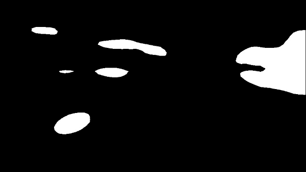
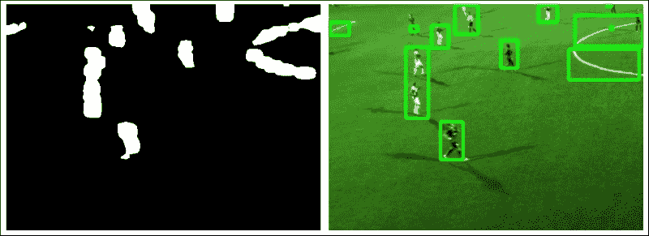

# 第 5 章。跟踪视觉上显着的对象

本章的目的是一次跟踪视频序列中的多个视觉上显着的对象。 与其自己在视频中标记感兴趣的对象，不如让算法确定视频帧的哪些区域值得跟踪。

以前，我们已经学习了如何在严格控制的场景中检测感兴趣的简单对象（例如人的手），或者如何从摄像机运动中推断出视觉场景的几何特征。 在本章中，我们将询问通过查看大量帧的**图像统计数据** ，我们可以了解视觉场景。 通过分析自然图像的**傅里叶光谱** ，我们将构建一个 **显着性图**，这使我们可以将图像的某些统计上有意义的斑块标记为（潜在或） *原型对象*。 然后，我们将所有原型对象的位置提供给**平均漂移跟踪器** ，这将使我们能够跟踪对象从一帧移动到下一帧的位置。

要构建应用，我们需要结合以下两个主要功能：

*   **显着性图**：我们将使用傅立叶分析对自然图像统计数据有一个总体了解，这将帮助我们建立一个一般图像背景外观的模型。 通过将背景模型与特定的图像帧进行比较和对比，我们可以找到*弹出其周围*的图像子区域。 理想情况下，这些子区域与图像块相对应，这些块在观看图像时会立即引起我们的注意。
*   **对象跟踪**：找到图像的所有潜在*有趣的*块之后，我们将使用一种称为均值漂移跟踪的简单而有效的方法来跟踪它们在许多帧上的运动。 由于场景中可能有多个原型对象，这些对象可能会随着时间的流逝而改变外观，因此我们需要能够区分它们并跟踪所有它们。

**视觉显着性** 是来自认知心理学的技术术语，旨在描述某些物体或物品的视觉质量，以使它们立即引起我们的注意。 我们的大脑不断将视线移向视觉场景的*重要*区域，并随着时间的推移对其进行跟踪，从而使我们能够快速扫描周围的环境以找到有趣的物体和事件，而忽略不那么重要的部分。

下图显示了一个常规 RGB 图像及其转换为显着性图的示例，其中统计上令人感兴趣的*弹出*区域显得明亮而其他区域则较暗：


传统模型可能会尝试将特定特征与每个目标相关联（非常类似于第 3 章，*通过特征匹配和透视变换*查找对象的特征匹配方法），这会将问题转换为 检测特定类别或对象。 但是，这些模型需要人工标记和培训。 但是，如果不知道要跟踪的特征或对象数量怎么办？

取而代之的是，我们将尝试模仿大脑的行为，也就是说，将算法调整为自然图像的统计数据，以便我们可以立即定位在视觉场景中“吸引我们注意力”的模式或子区域（即 是偏离这些统计规律的模式），并标记它们以进行进一步检查。 结果是一种适用于场景中任意数量的原型对象的算法，例如跟踪足球场上的所有运动员。 请参考下图：


### 注意

本章使用 OpenCV 2.4.9，以及其他软件包 [NumPy](http://www.numpy.org)， [wxPython 2.8](http://www.wxpython.org/download.php) 和 [matplotlib](http://www.matplotlib.org/downloads.html)。 尽管本章介绍的部分算法已添加到 OpenCV 3.0.0 版本的可选 Saliency 模块中，但目前尚无 Python API，因此我们将编写自己的代码。

# 规划应用

最终的应用程序将将视频序列的每个 RGB 帧转换为显着图，提取所有有趣的原型对象，并将其提供给均值漂移跟踪算法。 为此，我们需要以下组件：

*   `main`：启动应用程序的主要功能例程（在`chapter5.py`中）。
*   `Saliency`：类从 RGB 彩色图像生成显着性图。 它包括以下公共方法：
    *   `Saliency.get_saliency_map`：将 RGB 彩色图像转换为显着图的主要方法
    *   `Saliency.get_proto_objects_map`：将显着性图转换为包含所有原型对象的二进制掩码的方法
    *   `Saliency.plot_power_density`：一种用于显示 RGB 彩色图像的 2D 功率密度的方法，有助于理解傅立叶变换
    *   `Saliency.plot_power_spectrum`：一种显示 RGB 彩色图像的径向平均功率谱的方法，有助于理解自然图像统计信息
*   `MultiObjectTracker`：一个类，使用均值漂移跟踪来跟踪视频中的多个对象。 它包含以下公共方法，该方法本身包含许多私有帮助器方法：
    *   `MultiObjectTracker.advance_frame`：结合从显着图和均值漂移跟踪获得的边界框，为新帧更新跟踪信息的方法

在以下各节中，我们将详细讨论这些步骤。

# 设置应用

为了运行我们的应用程序，我们将需要执行一个主函数例程，该例程读取视频流的帧，生成显着图，提取原型对象的位置并将这些位置从一帧跟踪到 下一个。

## 主要功能例程

主要处理流程由`chapter5.py`中的主要功能处理，该函数实例化两个类（`Saliency`和`MultipleObjectTracker`）并打开一个视频文件，该文件显示了场上足球运动员的人数：

```py
import cv2
import numpy as np
from os import path

from saliency import Saliency
from tracking import MultipleObjectsTracker

def main(video_file='soccer.avi', roi=((140, 100), (500, 600))):
    if path.isfile(video_file):
        video = cv2.VideoCapture(video_file)
    else:
        print 'File "' + video_file + '" does not exist.'
        raise SystemExit

    # initialize tracker
    mot = MultipleObjectsTracker()
```

然后，该函数将逐帧读取视频，提取一些有意义的感兴趣区域（出于说明目的），并将其提供给 Saliency 模块：

```py
    while True:
        success, img = video.read()
        if success:
            if roi:
                # grab some meaningful ROI
                img = img[roi[0][0]:roi[1][0], roi[0][1]:roi[1][1]]
            # generate saliency map
            sal = Saliency(img, use_numpy_fft=False, gauss_kernel=(3, 3))
```

显着性将生成所有*有趣的*原型对象的映射，并将其提供给跟踪器模块。 跟踪器模块的输出是输入框，该输入框带有边框，如上图所示。

```py
cv2.imshow("tracker", mot.advance_frame(img, sal.get_proto_objects_map(use_otsu=False)))
```

该应用程序将在视频的所有帧中运行，直到到达文件末尾或用户按下`q`键：

```py
if cv2.waitKey(100) & 0xFF == ord('q'):
    break
```

## 显着性课程

Saliency 类的构造函数接受视频帧，该视频帧可以是灰度或 RGB，还可以使用某些选项，例如使用 NumPy 还是 OpenCV 的 Fourier 软件包：

```py
def __init__(self, img, use_numpy_fft=True, gauss_kernel=(5, 5)):
    self.use_numpy_fft = use_numpy_fft
    self.gauss_kernel = gauss_kernel
    self.frame_orig = img
```

显着图将从图像的向下采样版本生成，并且由于计算是相对耗时的，因此我们将维护一个标志`need_saliency_map`，该标志确保我们仅进行一次计算：

```py
    self.small_shape = (64, 64)
    self.frame_small = cv2.resize(img, self.small_shape[1::-1])

    # whether we need to do the math (True) or it has already
    # been done (False)
    self.need_saliency_map = True
```

从那时起，用户可以调用该类的任何公共方法，这些方法都将在同一图像上传递。

## MultiObjectTracker 类

跟踪器类的构造函数很简单。 它所做的全部工作就是设置均值漂移跟踪的终止标准，并存储在随后的计算步骤中要考虑的最小轮廓区域（`min_area`）和最小逐帧漂移（`min_shift2`）的条件：

```py
def __init__(self, min_area=400, min_shift2=5):
    self.object_roi = []
    self.object_box = []

    self.min_cnt_area = min_area
    self.min_shift2 = min_shift2

    # Setup the termination criteria, either 100 iteration or move
    # by at least 1 pt
    self.term_crit = (cv2.TERM_CRITERIA_EPS | cv2.TERM_CRITERIA_COUNT, 100, 1) 
```

从那时起，用户可以调用`advance_frame`方法将新的帧提供给跟踪器。

但是，在我们利用所有这些功能之前，我们需要了解图像统计信息以及如何生成显着性图。

# 视觉显着性

正如引言中已经提到的，视觉显着性试图描述某些物体或物品的视觉质量，从而使它们立即引起我们的注意。 我们的大脑不断将视线移向视觉场景的*重要*区域，就好像是将手电筒照在视觉世界的不同子区域上一样，从而使我们能够快速扫描周围的环境来寻找有趣的物体和 事件，而忽略次要部分。

可以认为，这是一种进化策略，用于应对在视觉丰富的环境中不断出现的**信息溢出** 。 例如，如果您在丛林中漫步，您希望能够在欣赏您前方蝴蝶翅膀上错综复杂的颜色图案之前注意到左侧灌木丛中的猛虎。 结果，视觉上显着的对象具有*突显其周围环境*的出色品质，非常类似于下图中的目标条：


弹出这些目标的视觉质量可能并不总是那么琐碎。 如果您正在查看左侧的图像，则可能会立即注意到图像中唯一的红色条。 但是，如果您以灰度查看相同的图像，则目标条将很难找到（它是顶部的第四条，左边的第五条）。 与颜色显着性相似，右侧图像中有一个视觉上显着的条。 尽管目标栏在左侧图像中具有唯一的颜色，在右侧图像中具有独特的方向，但是将这两个特征放在一起，突然间，唯一的目标栏不再弹出：


在前面的显示中，再次有一个唯一且与其他所有酒吧都不相同的酒吧。 但是，由于分散注意力项目的设计方式，引导您走向目标栏的引人注目之处很少。 相反，您发现自己似乎随机地扫描图像，寻找有趣的东西。 （提示：目标是图像中唯一的红色且几乎垂直的条，顶部第二行，左侧第三列。）

您问，这与计算机视觉有什么关系？ 实际上，很多。 人工视觉系统像您和我一样遭受信息超载的困扰，除了它们对世界的了解比我们少。 如果我们可以从生物学中汲取一些见识并将其用于教导我们的算法有关世界的知识该怎么办？ 想象一下您的汽车中的仪表板摄像头会自动聚焦在最相关的交通标志上。 想象一下一个监视摄像头，它是野生动植物观测站的一部分，它将自动检测并跟踪臭名昭著的害羞鸭嘴兽的踪迹，但会忽略其他一切。 我们如何教导算法什么是重要的而不是什么？ 我们如何使鸭嘴兽“弹出”？

## 傅立叶分析

为了找到图像的视觉显着子区域，我们需要查看其 **频谱**。 到目前为止，我们已经处理了 **空间域**中的所有图像和视频帧； 也就是说，通过分析像素或研究图像强度在图像的不同子区域中如何变化。 但是，图像也可以在 **频域**中表示； 也就是说，通过分析像素频率或研究像素在图像中出现的频率和频率。

通过应用 **傅里叶变换**，可以将图像从空间域转换到频域。 在频域中，我们不再考虑图像坐标*（x，y）*。 相反，我们旨在找到图像的光谱。 傅立叶的激进思想基本上可以归结为以下问题：如果将任何信号或图像转换成一系列圆形路径（也称为 **谐波**）怎么办？

例如，想想彩虹。 美丽，不是吗？ 在彩虹中，白色的阳光（由许多不同的颜色或光谱的一部分组成）散布在其光谱中。 当光线穿过雨滴时（类似于穿过玻璃棱镜的白光），这里的阳光光谱就会暴露出来。 傅立叶变换的目的是做同样的事情：恢复阳光中包含的光谱的所有不同部分。

对于任意图像，可以实现类似的效果。 与彩虹相反，在彩虹中，频率对应于电磁频率，对于图像，我们将其视为空间频率。 即，像素值的空间周期性。 在监狱牢房的图像中，您可以将空间频率视为两个相邻监狱钢筋之间的距离（的倒数）。

从这种观点转变中可以获得的见解非常有力。 在不赘述的情况下，让我们仅说明一下，傅立叶频谱同时具有幅度和相位。 幅度描述了图像中不同频率的数量，而相位则讨论了这些频率的空间位置。 下图在左侧显示了自然图像，在右侧显示了相应的傅立叶幅度谱（灰度版本）：


右边的幅度谱告诉我们，在左边图像的灰度版本中，哪些频率分量最突出（明亮）。 调整频谱，使图像的中心对应于 x 和 y 中的零频率。 移到图像的边界越远，频率越高。 这个特殊的频谱告诉我们，左侧图像中有很多低频分量（聚集在图像中心附近）。

在 OpenCV 中，可以使用`Saliency`类的`plot_magnitude`方法，通过**离散傅里叶变换**（**DFT**）实现此变换。 步骤如下：

1.  **如有必要，将图像转换为灰度**：因为该方法同时接受灰度和 RGB 彩色图像，所以我们需要确保对单通道图像进行操作：

    ```py
    def plot_magnitude(self):
        if len(self.frame_orig.shape)>2:
            frame = cv2.cvtColor(self.frame_orig, cv2.COLOR_BGR2GRAY)
        else:
            frame = self.frame_orig
    ```

2.  **扩展图像至最佳尺寸**：事实证明 DFT 的性能取决于图像尺寸。 对于第二个倍数的图像，它往往最快。 因此，通常最好用零填充图像：

    ```py
    rows, cols = self.frame_orig.shape[:2]
    nrows = cv2.getOptimalDFTSize(rows)
    ncols = cv2.getOptimalDFTSize(cols)
    frame = cv2.copyMakeBorder(frame, 0, ncols-cols, 0, nrows-rows, cv2.BORDER_CONSTANT, value = 0)
    ```

3.  **应用 DFT**：这是 NumPy 中的单个函数调用。 结果是复数的 2D 矩阵：

    ```py
    img_dft = np.fft.fft2(frame)
    ```

4.  **将实数和复数值转换为幅度**：复数具有实数（Re）和复数（虚数-Im）。 要提取幅度，我们取绝对值：

    ```py
    magn = np.abs(img_dft)
    ```

5.  **切换到对数刻度**：结果表明，傅立叶系数的动态范围通常太大而无法在屏幕上显示。 我们有一些小的和一些高变化的值，我们无法像这样观察到。 因此，高值将全部显示为白点，小值将全部显示为黑点。 要使用灰度值进行可视化，我们可以将线性比例转换为对数比例：

    ```py
    log_magn = np.log10(magn)
    ```

6.  **移位象限**：使光谱在图像上居中。 这样可以更容易地目视检查幅度谱：

    ```py
    spectrum = np.fft.fftshift(log_magn)
    ```

7.  **返回绘制**的结果：

    ```py
    return spectrum/np.max(spectrum)*255
    ```

## 自然场景统计

人的大脑很久以前就想出了如何聚焦于视觉上显着的物体。 我们所生活的自然世界具有一些统计规律，使其与棋盘图案或随机的公司徽标相反，具有独特的*自然*。 最常见的统计规律可能是 1 / f 定律。 它指出自然图像的整体幅度遵循 1 / f 分布，如下图所示。这有时也称为 **比例不变**。

可以使用`Saliency`类的`plot_power_spectrum`方法可视化 2D 图像的 1D 功率谱（作为频率的函数）。 我们可以使用与以前使用的幅值谱类似的方法，但是必须确保将 2D 谱正确折叠到一个轴上。

1.  如有必要，将图像转换为灰度（与之前相同）：

    ```py
    def plot_power_spectrum(self):
        if len(self.frame_orig.shape)>2:
            frame = cv2.cvtColor(self.frame_orig, cv2.COLOR_BGR2GRAY)
        else:
            frame = self.frame_orig
    ```

2.  将图像扩展到最佳尺寸（与之前相同）：

    ```py
    rows, cols = self.frame_orig.shape[:2]
    nrows = cv2.getOptimalDFTSize(rows)
    ncols = cv2.getOptimalDFTSize(cols)
    frame = cv2.copyMakeBorder(frame, 0, ncols-cols, 0, nrows-rows, cv2.BORDER_CONSTANT, value = 0)
    ```

3.  **应用 DFT 并获取对数谱**：在这里，我们为用户提供了一个选项（通过标志`use_numpy_fft`），以使用 NumPy 或 OpenCV 的傅里叶工具：

    ```py
    if self.use_numpy_fft:
        img_dft = np.fft.fft2(frame)
        spectrum = np.log10(np.real(np.abs(img_dft))**2)
    else:
        img_dft = cv2.dft(np.float32(frame), flags=cv2.DFT_COMPLEX_OUTPUT)
        spectrum = np.log10(img_dft[:,:,0]**2 + img_dft[:,:,1]**2)
    ```

4.  **进行径向平均**：这是棘手的部分。 仅在 x 或 y 方向上对 2D 光谱求平均是错误的。 我们感兴趣的是频谱与频率的关系，与确切的方向无关。 有时也称为 **径向平均功率谱**（**RAPS**），可以通过对所有频率幅值求和来实现，从图像的中心开始， 从某个频率`r`到`r+dr`进入所有可能的（径向）方向。 我们使用 NumPy 直方图的合并功能对数字求和，并将它们累加在变量`histo`中：

    ```py
    L = max(frame.shape)
    freqs = np.fft.fftfreq(L)[:L/2]
    dists = np.sqrt(np.fft.fftfreq(frame.shape[0])[:,np.newaxis]**2 + np.fft.fftfreq(frame.shape[1])**2)
    dcount = np.histogram(dists.ravel(), bins=freqs)[0]
    histo, bins = np.histogram(dists.ravel(), bins=freqs,weights=spectrum.ravel())
    ```

5.  **绘制结果**：最后，我们可以绘制历史数据中的累加数，但一定不要忘记通过 bin 大小（`dcount`）将其标准化：

    ```py
    centers = (bins[:-1] + bins[1:]) / 2
    plt.plot(centers, histo/dcount)
    plt.xlabel('frequency')
    plt.ylabel('log-spectrum')
    plt.show()
    ```

结果是与频率成反比的函数。 如果要绝对确定 1 / f 属性，则可以取所有 x 值的`np.log10`并确保曲线大致呈线性减小。 在线性`x`轴和对数`y`轴上，曲线如下所示：


此属性非常。 它指出，如果我们对自然场景拍摄的所有图像的所有光谱求平均（当然，忽略了使用奇特图像滤镜拍摄的所有光谱），我们将得到一条曲线，看起来与 前一个图像。

但是回到利马特河上一艘宁静的小船的图像，那单个图像呢？ 我们刚刚查看了此图像的功率谱，并见证了 1 / f 属性。 我们如何利用自然图像统计知识告诉算法，不要盯着左边的树，而是专注于在水里的船？


这就是我们意识到显着性真正含义的地方。

## 使用频谱残差法生成显着图

在图像中值得我们关注的事物不是遵循 1 / f 定律的图像斑块，而是从平滑曲线中伸出的斑块。 换句话说，统计异常。 这些异常称为图像的 **光谱残差**，并对应于图像（或原型物体）的潜在*有趣的*色块。 将这些统计异常显示为亮点的图称为显着图。

### 注意

此处描述的频谱残留方法基于*侯小迪*和 *Zhang Liqing* （2007）的原始科学出版物。 *显着性检测：频谱残留方法*。 IEEE 关于计算机视觉和模式识别（CVPR）的事务，第 1-8 页。 doi：10.1109 / CVPR.2007.383267。

为了基于光谱残差法生成显着图，我们需要分别处理输入图像的每个通道（在灰度输入图像的情况下为单个通道，在 RGB 输入图像的情况下为三个独立通道） 。

可以使用以下方法通过专用方法`Saliency._get_channel_sal_magn`生成单个通道的显着图：

1.  再次使用 NumPy 的`fft`模块或 OpenCV 功能，计算图像的（幅度和相位）傅里叶光谱：

    ```py
    def _get_channel_sal_magn(self, channel):
        if self.use_numpy_fft:
            img_dft = np.fft.fft2(channel)
            magnitude, angle = cv2.cartToPolar(np.real(img_dft), np.imag(img_dft))
        else:
            img_dft = cv2.dft(np.float32(channel), flags=cv2.DFT_COMPLEX_OUTPUT)
            magnitude, angle = cv2.cartToPolar(img_dft[:, :, 0], img_dft[:, :, 1])
    ```

2.  计算傅立叶光谱的对数幅度。 我们将幅度的下限裁剪为 1e-9 ，以便在计算对数时防止被零除：

    ```py
    log_ampl = np.log10(magnitude.clip(min=1e-9))
    ```

3.  通过使用局部平均滤波器对图像进行卷积来近似估计自然图像的平均光谱：

    ```py
    log_ampl_blur = cv2.blur(log_amlp, (3, 3))
    ```

4.  计算光谱残差。 频谱残差主要包含场景的非平凡（或意外）部分。

    ```py
    magn = np.exp(log_amlp – log_ampl_blur)
    ```

5.  再次通过 NumPy 中的`fft`模块或使用 OpenCV 使用傅立叶逆变换来计算显着性图：

    ```py
        if self.use_numpy_fft:
            real_part, imag_part = cv2.polarToCart(residual,
                angle)
            img_combined = np.fft.ifft2(real_part + 1j*imag_part)
            magnitude, _ = cv2.cartToPolar( np.real(img_combined), np.imag(img_combined))
        else:
            img_dft[:, :, 0], img_dft[:, :, 1] = cv2.polarToCart( residual, angle)
            img_combined = cv2.idft(img_dft)
            magnitude, _ = cv2.cartToPolar(img_combined[:, :, 0], img_combined[:, :, 1])
        return magnitude
    ```

然后将生成的单通道显着性映射（`magnitude`）返回到`Saliency.get_saliency_map`，在此对输入图像的所有通道重复此过程。 如果输入图像是灰度图像，那么我们就完成了：

```py
def get_saliency_map(self):
    if self.need_saliency_map:
        # haven't calculated saliency map for this frame yet
        num_channels = 1
        if len(self.frame_orig.shape)==2:
            # single channel
            sal = self._get_channel_sal_magn(self.frame_small)
```

但是，如果输入图像具有多个通道（例如 RGB 彩色图像），我们需要分别考虑每个通道：

```py
        else:
            # consider each channel independently
            sal = np.zeros_like(self.frame_small).astype(np.float32)
            for c in xrange(self.frame_small.shape[2]):
                sal[:, :, c] = self._get_channel_sal_magn(self.frame_small[:, :, c])
```

然后，由所有通道的平均值确定多通道图像的整体显着性：

```py
sal = np.mean(sal, 2)
```

最后，我们需要进行一些后期处理，例如可选的模糊处理，以使结果显得更平滑：

```py
        if self.gauss_kernel is not None:
            sal = cv2.GaussianBlur(sal, self.gauss_kernel, 
                sigmaX=8, sigmaY=0)
```

同样，我们需要对`sal`中的值求平方，以突出显示高显着性的区域，如原始论文的作者所概述的那样。 为了显示图像，我们将其缩放回其原始分辨率并对其值进行归一化，以使最大值为 1：

```py
        sal = sal**2
        sal = np.float32(sal)/np.max(sal)
        sal = cv2.resize(sal, self.frame_orig.shape[1::-1])
```

为了避免重做所有这些繁琐的计算，我们存储了显着性图的本地副本以供进一步参考，并确保降低标志：

```py
        self.saliency_map = sal
        self.need_saliency_map = False

    return self.saliency_map
```

然后，当用户对依赖于引擎盖下显着图的计算的类方法进行后续的调用时，我们可以简单地引用本地副本，而不必再次进行计算。

然后，所得的显着性贴图如下图所示：


现在，我们可以清楚地看到船在水中（左下角），该船似乎是图像中最突出的子区域之一。 还有其他显着区域，例如右侧的 Grossmünster（您猜猜这座城市吗？）。

### 注意

顺便说一句，图像中这两个区域是最显着的区域的原因似乎是清楚无可争辩的证据，表明该算法意识到苏黎世市中心可笑的教堂塔楼数量之多，有效地阻止了它们出现的可能性 标记为“突出”。

## 在场景中检测原型对象

从某种意义上说，显着性图已经是原型对象的明确表示形式，因为它仅包含图像的*有趣的*部分。 因此，既然我们已经完成了所有艰苦的工作，为了获得原型图，剩下要做的就是对显着图进行阈值处理。

此处要考虑的唯一开放参数是阈值。 将阈值设置得太低将导致将很多区域标记为原型对象，包括一些可能不包含任何感兴趣内容的区域（错误警报）。 另一方面，将阈值设置得太高将忽略图像中的大多数显着区域，并可能使我们根本没有原型对象。 原始光谱残留论文的作者选择仅将图像的那些区域标记为原始对象，其显着性大于图像平均显着性的三倍。 通过将输入标志`use_otsu`设置为`true`，我们为用户提供了实现此阈值或采用 Otsu 阈值的选择：

```py
def get_proto_objects_map(self, use_otsu=True):
```

然后，我们检索当前帧的显着性图，并确保将其转换为 uint8 精度，以便可以将其传递给`cv2.threshold`：

```py
    saliency = self.get_saliency_map()
    if use_otsu:
        _, img_objects = cv2.threshold(np.uint8(saliency*255), 0, 255, cv2.THRESH_BINARY + cv2.THRESH_OTSU)
```

否则，我们将使用阈值`thresh`：

```py
    else:
        thresh = np.mean(saliency)*255
        _, img_objects = cv2.threshold(np.uint8(saliency*255), thresh, 255, cv2.THRESH_BINARY)
    return img_objects
```

生成的原始对象蒙版如下图所示：



然后，原始对象蒙版用作跟踪算法的输入。

# 均值漂移跟踪

事实证明，前面讨论的显着性检测器本身已经是对原型物体的出色跟踪器。 只需将算法应用于视频序列的每一帧，就可以很好地了解对象的位置。 但是，丢失的是对应信息。 想象一下从市中心或体育馆等繁忙场景的视频片段。 尽管显着性图可以突出显示已录制视频的每个帧中的所有原始对象，但是该算法无法知道前一帧中的哪些原始对象在当前帧中仍然可见。 另外，原始对象映射可能包含一些假阳性，例如以下示例：



请注意，从原始对象映射中提取的边界框在上一个示例中犯了（至少）三个错误：错过了突出显示玩家（左上），将两个玩家合并到同一个边界框中并突出显示了一些错误 其他可以说是无趣的（尽管在视觉上很显眼）的对象。 为了改善这些结果，我们想利用跟踪算法。

为了解决对应问题，我们可以使用以前学习的方法，例如特征匹配和光流。 或者，我们可以使用另一种称为均值漂移跟踪的技术。

均值平移是一种用于跟踪任意对象的简单但非常有效的技术。 均值平移背后的直觉是考虑从最能描述一个目标的潜在概率密度函数中采样的一个较小的感兴趣区域（例如，我们要跟踪的对象的边界框）中的像素。

例如，考虑以下图像：


在这里，小的灰色点表示来自概率分布的样本。 假设点越近，它们彼此之间越相似。 直观地讲，均值偏移试图做的是在该景观中找到最密集的区域并在其周围绘制一个圆圈。 该算法可能首先将圆心定在风景完全不密集的区域上（虚线圆）。 随着时间的流逝，它将缓慢地移向最密集的区域（实心圆）并锚定在其上。 如果我们将景观设计为比点更有意义（例如，通过使点对应于图像小邻域中的颜色直方图），则可以使用均值平移跟踪通过查找来找到场景中感兴趣的对象 最接近目标对象直方图的直方图。

均值平移具有许多应用程序（例如聚类或寻找概率密度函数的模式），但它也特别适合于目标跟踪。 在 OpenCV 中，该算法在`cv2.meanShift`中实现，但需要进行一些预处理才能正确运行。 我们可以将过程概述如下：

1.  **在每个数据点**周围固定一个窗口：例如，围绕对象或感兴趣区域的边界框。
2.  **计算窗口**内的数据平均值：在跟踪的情况下，通常将其实现为关注区域中像素值的直方图。 为了在彩色图像上获得最佳性能，我们将转换为 HSV 色彩空间。
3.  **将窗口移至均值并重复直到收敛**：`cv2.meanShift`透明地处理了此问题。 通过指定终止条件，我们可以控制迭代方法的长度和准确性。

## 自动跟踪足球场上的所有球员

在本章的其余部分，我们的目标是将显着性检测器与均值漂移跟踪相结合，以自动跟踪足球场上的所有球员。 显着性检测器识别的原始对象将用作均值漂移跟踪器的输入。 具体来说，我们将关注 Alfheim 数据集的视频序列，该视频序列可以从[这个页面](http://home.ifi.uio.no/paalh/dataset/alfheim/)中免费获取。

结合两种算法（显着性图和均值漂移跟踪）的原因是为了消除误报并提高整体跟踪的准确性。 这将分两步完成：

1.  显着性检测器和均值漂移跟踪都可以为框架中的所有原始对象组装边界框列表。 显着性检测器将在当前帧上运行，而均值漂移跟踪器将尝试从当前帧中的前一帧中查找原型对象。
2.  仅保留两种算法在位置和大小上都一致的边界框。 这将消除被两种算法之一误标记为原型对象的离群值。

辛苦的工作是由先前引入的`MultiObjectTracker`类及其`advance_frame`方法完成的。 该方法依赖于一些私有工作者方法，下面将对其进行详细说明。 每当有新帧到达时，都会调用`advance_frame`方法，并接受原型对象图作为输入：

```py
def advance_frame(self, frame, proto_objects_map):
    self.tracker = copy.deepcopy(frame)
```

然后，该方法构建所有候选边界框的列表，将当前帧的显着性地图中的边界框以及从前一帧到当前帧的均值漂移跟踪结果进行组合：

```py
# build a list of all bounding boxes
box_all = []

# append to the list all bounding boxes found from the
# current proto-objects map
box_all = self._append_boxes_from_saliency(proto_objects_map,box_all)

    # find all bounding boxes extrapolated from last frame
    # via mean-shift tracking
    box_all = self._append_boxes_from_meanshift(frame, box_all)
```

然后，该方法尝试合并候选边界框以删除重复项。 这可以通过`cv2.groupRectangles`来实现，如果`group_thresh+1`或更多边界框在图像中重叠，它将返回一个边界框：

```py
# only keep those that are both salient and in mean shift
if len(self.object_roi)==0:
    group_thresh = 0    # no previous frame: keep all form 
    # saliency
else:
    group_thresh = 1 # previous frame + saliency
box_grouped,_ = cv2.groupRectangles(box_all, group_thresh, 0.1)
```

为了进行平均轮班，我们将不得不做一些簿记工作，以下各小节将对此进行详细说明：

```py
# update mean-shift bookkeeping for remaining boxes
self._update_mean_shift_bookkeeping(frame, box_grouped)
```

然后，我们可以在输入图像上绘制唯一边界框的列表，并返回该图像以进行绘制：

```py
for (x, y, w, h) in box_grouped:
    cv2.rectangle(self.tracker, (x, y), (x + w, y + h),(0, 255, 0), 2)

return self.tracker
```

## 提取原型对象的边界框

第一个私有工作者方法相对简单。 它以原型对象图和边界框（以前聚合的）列表作为输入。 在此列表中，它添加了从原型对象的轮廓中找到的所有边界框：

```py
def _append_boxes_from_saliency(self, proto_objects_map, box_all):
    box_sal = []
    cnt_sal, _ = cv2.findContours(proto_objects_map, 1, 2)
```

但是，它将丢弃小于某个阈值`self.min_cnt_area`的边界框，该阈值是在构造函数中设置的：

```py
for cnt in cnt_sal:
    # discard small contours
    if cv2.contourArea(cnt) < self.min_cnt_area:
        continue
```

结果是将附加到`box_all`列表中，并传递了进行进一步处理：

```py
    # otherwise add to list of boxes found from saliency map
    box = cv2.boundingRect(cnt)
    box_all.append(box)

return box_all
```

## 设置必要的簿记以进行均值漂移跟踪

第二种私有工作者方法与有关，它设置了执行均值平移跟踪所需的所有簿记。 该方法接受输入图像和边界框列表，为其生成簿记信息：

```py
def _update_mean_shift_bookkeeping(self, frame, box_grouped):
```

簿记主要包括计算每个原型对象边界框的 HSV 颜色值的直方图。 因此，输入的 RGB 图像立即转换为 HSV：

```py
hsv = cv2.cvtColor(frame, cv2.COLOR_BGR2HSV)
```

然后，解析`box_grouped`中的每个边界框。 我们需要存储边界框的位置和大小（`self.object_box`），以及 HSV 颜色值的直方图（`self.object_roi`）：

```py
self.object_roi = []
self.object_box = []
```

从列表中提取边界框的位置和大小，并从 HSV 图像中切出感兴趣的区域：

```py
for box in box_grouped:
    (x, y, w, h) = box
    hsv_roi = hsv[y:y + h, x:x + w]
```

然后，我们计算感兴趣区域中所有色相（H）值的直方图。 我们还通过使用遮罩忽略边界框的暗淡或微弱的区域，并最终对直方图进行归一化：

```py
mask = cv2.inRange(hsv_roi, np.array((0., 60., 32.)), np.array((180., 255., 255.)))
roi_hist = cv2.calcHist([hsv_roi], [0], mask, [180], [0, 180])
cv2.normalize(roi_hist, roi_hist, 0, 255, cv2.NORM_MINMAX)
```

然后，我们将此信息存储在相应的私有成员变量中，以便在过程循环的下一帧中可用，我们将使用均值漂移算法来定位感兴趣的区域 ：

```py
self.object_roi.append(roi_hist)
self.object_box.append(box)
```

## 使用均值漂移算法跟踪对象

最后，第三种私有工作者方法通过使用先前帧中存储的簿记信息来跟踪原型对象。 与`_append_boxes_from_meanshift`相似，我们建立了一个从均值偏移聚合的所有边界框的列表，并将其传递给进一步处理。 该方法接受输入图像和以前聚合的边界框列表：

```py
def _append_boxes_from_meanshift(self, frame, box_all):
    hsv = cv2.cvtColor(frame, cv2.COLOR_BGR2HSV)
```

然后，该方法解析所有先前存储的原型对象（来自`self.object_roi`和`self.object_box`）：

```py
for i in xrange(len(self.object_roi)):
    roi_hist = copy.deepcopy(self.object_roi[i])
    box_old = copy.deepcopy(self.object_box[i])
```

为了找到记录在先前图像帧中的感兴趣区域的新的，已移位的位置，我们将反向投影的感兴趣区域馈送到均值漂移算法。 终止标准（`self.term_crit`）将确保尝试足够的迭代次数（`100`），并寻找至少一些像素（`1`）的均值偏移：

```py
dst = cv2.calcBackProject([hsv], [0], roi_hist, [0, 180], 1)
ret, box_new = cv2.meanShift(dst, tuple(box_old), self.term_crit)
```

但是，在将新检测到的，已移动的边界框添加到列表之前，我们要确保我们实际上正在跟踪移动的对象。 不移动的对象很可能是假阳性，例如与当前任务无关的线条标记或其他视觉上显着的斑块。

为了舍弃无关的跟踪结果，我们比较了前一帧（`box_old`）和当前帧（`box_new`）对应的边界框的位置：

```py
(xo, yo, wo, ho) = box_old
(xn, yn, wn, hn) = box_new
```

如果它们的重心至少没有移位`sqrt(self.min_shift2)`像素，则我们不在列表中包括边界框：

```py
co = [xo + wo/2, yo + ho/2]
cn = [xn + wn/2, yn + hn/2]
if (co[0] - cn[0])**2 + (co[1] - cn[1])**2 >= self.min_shift2:
    box_all.append(box_new)
```

生成的边界框列表再次传递给进一步处理：

```py
        return box_all
```

# 全部放在一起

下图显示了我们应用的结果：


在整个视频序列中，该算法能够拾取玩家的位置，通过使用均值漂移跟踪成功逐帧跟踪他们，并将合成的边界框与显着性返回的边界框进行组合 探测器。

只有通过显着性图和跟踪的巧妙组合，我们才能排除假阳性，例如显着性图的线标记和伪影。 不可思议的事情发生在`cv2.groupRectangles`中，它需要一个类似的边界框在`box_all`列表中至少出现两次，否则将被丢弃。 这意味着，只有均值漂移跟踪和显着图（大致）都同意边界框的位置和大小时，才将边界框保留在列表中。

# 摘要

在本章中，我们探索了一种在视觉场景中标记潜在*有趣*对象的方法，即使它们的形状和数量未知。 我们使用傅里叶分析探索了自然图像统计数据，并实现了一种用于提取自然场景中视觉显着区域的最新方法。 此外，我们将显着性检测器的输出与跟踪算法结合在一起，可以跟踪足球比赛视频序列中形状和数量未知的多个对象。

现在将有可能扩展我们的算法，使其具有原型对象的更复杂的特征描述。 实际上，当对象快速改变大小时，均值漂移跟踪可能会失败，就像关注的对象要直接对准相机时就是这种情况。 在 OpenCV 中免费提供的更强大的跟踪器是`cv2.CamShift`。 **CAMShift** 代表连续自适应均值偏移，并在均值偏移后赋予功率以自适应地更改窗口大小。 当然，也可以用先前研究的技术（例如特征匹配或光流）简单地替换均值漂移跟踪器。

在下一章中，我们将进入机器学习的迷人领域，这将使我们能够构建功能更强大的对象描述符。 具体而言，我们将集中于检测图像中的路标（在哪里？）和识别（什么？）。 这将使我们能够训练可在您的汽车仪表盘相机中使用的分类器，并使我们熟悉机器学习和对象识别的重要概念。