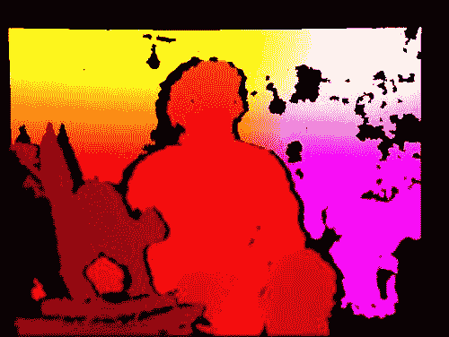
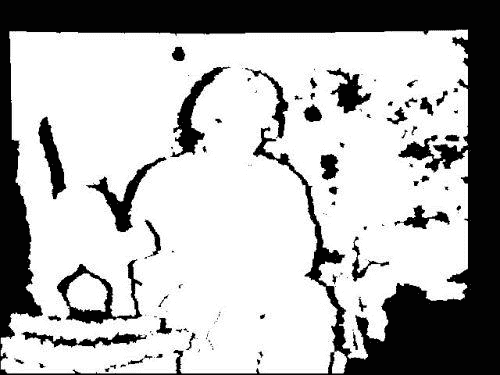
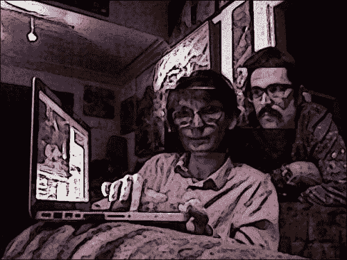

# 第 5 章。检测前景/背景区域和深度

本章介绍如何使用深度相机中的数据来识别前景和背景区域，这样我们就可以将效果限制为仅前景或背景。 作为前提条件，我们需要一个深度摄像头，例如 Microsoft Kinect，并且需要在支持深度摄像头的情况下构建 OpenCV。 有关构建说明，请参见第 1 章，“设置 OpenCV”。

# 创建模块

我们用于捕获和处理深度相机数据的代码可在`Cameo.py`外部重用。 因此，我们应该将其分成一个新模块。 让我们在与`Cameo.py`相同的目录中创建一个名为`depth.py`的文件。 我们需要在`depth.py`中使用以下`import`语句：

```py
import numpy
```

我们还需要修改我们先前存在的`rects.py`文件，以便将复制操作限制为矩形的非矩形子区域。 为了支持我们将要进行的更改，让我们在`rects.py`中添加以下导入语句：

```py
import numpy
import utils
```

最后，我们应用程序的新版本将使用与深度相关的功能。 因此，让我们在`Cameo.py`中添加以下`import`语句：

```py
import depth
```

现在，让我们更深入地研究深度主题。

# 从深度相机捕获帧

回到第 2 章，“处理文件，摄像机和 GUI”，我们讨论了计算机可以具有多个视频捕获设备，每个设备可以具有多个通道的概念。 假设给定的设备是立体声相机。 每个通道可能对应于不同的镜头和传感器。 同样，每个通道可能对应于不同种类的数据，例如正常彩色图像与深度图。 使用 OpenCV 的`VideoCapture`类或包装器`CaptureManager`时，我们可以在初始化时选择一个设备，并且可以从该设备的每一帧读取一个或多个通道。 每个设备和通道均由整数标识。 不幸的是，设备和通道的编号是不直观的。 OpenCV 的 C++ 版本为某些设备和通道的标识符定义了一些常量。 但是，这些常量未在 Python 版本中定义。 为纠正这种情况，让我们在`depth.py`中添加以下定义：

```py
# Devices.
CV_CAP_OPENNI = 900 # OpenNI (for Microsoft Kinect)
CV_CAP_OPENNI_ASUS = 910 # OpenNI (for Asus Xtion)
# Channels of an OpenNI-compatible depth generator.
CV_CAP_OPENNI_DEPTH_MAP = 0 # Depth values in mm (CV_16UC1)
CV_CAP_OPENNI_POINT_CLOUD_MAP = 1 # XYZ in meters (CV_32FC3)
CV_CAP_OPENNI_DISPARITY_MAP = 2 # Disparity in pixels (CV_8UC1)
CV_CAP_OPENNI_DISPARITY_MAP_32F = 3 # Disparity in pixels (CV_32FC1)
CV_CAP_OPENNI_VALID_DEPTH_MASK = 4 # CV_8UC1
# Channels of an OpenNI-compatible RGB image generator.
CV_CAP_OPENNI_BGR_IMAGE = 5
CV_CAP_OPENNI_GRAY_IMAGE = 6
```

与深度有关的通道需要一些解释，如以下列表所示：

*   **深度图**是灰度图像，其中每个像素值是从相机到表面的估计距离。 具体而言，来自`CV_CAP_OPENNI_DEPTH_MAP`通道的图像给出的距离为浮点数毫米。
*   **点云图**是彩色图像，其中每种颜色对应于一个空间尺寸（`x`，`y`或`z`）。 具体而言，从相机的角度来看，`CV_CAP_OPENNI_POINT_CLOUD_MAP`通道会生成 BGR 图像，其中 B 为`x`（蓝色为右），G 为`y`（绿色为上），R 为`z`（红色为深）。 值以米为单位。
*   **视差图**是灰度图像，其中每个像素值是表面的**立体视差**。 为了概念化立体视差，我们假设我们叠加了一个场景的两个图像，这些图像是从不同的角度拍摄的。 结果就像看到双重图像。 对于场景中任何一对孪生对象上的点，我们都可以以像素为单位测量距离。 该测量是立体声差异。 与远处的物体相比，附近的物体表现出更大的立体视差。 因此，附近的物体在视差图中显得更亮。
*   **有效深度掩码**显示给定像素处的深度信息是有效的（由非零值表示）还是无效的（由零值表示）。 例如，如果深度相机依靠红外照明器（红外闪光灯），则深度信息在被该光遮挡（阴影）的区域中无效。

以下屏幕截图显示了一个坐在猫雕塑后面的人的点云图：



以下屏幕截图显示了一个坐在猫雕塑后面的人的视差图：


以下屏幕截图显示了一个坐在猫雕塑后面的人的有效深度面具：



# 从视差图创建遮罩

出于`Cameo`和的目的，我们对视差图和有效的深度遮罩感兴趣。 它们可以帮助我们完善对面部区域的估计。

使用我们的`FaceTracker`函数和正常彩色图像，我们可以获得面部区域的矩形估计。 通过分析相应的视差图中的矩形区域，我们可以知道矩形中的某些像素离群值-太近或太远而不能真正成为人脸的一部分。 我们可以优化面部区域以排除这些异常值。 但是，我们仅应在有效深度掩码所指示的数据有效的地方应用此测试。

让我们编写一个函数来生成一个遮罩，该遮罩的值对于面部矩形的拒绝区域为`0`，对于接受区域为`1`。 此函数应使用视差图，有效的深度遮罩和矩形作为参数。 我们可以在`depth.py`中实现它，如下所示：

```py
def createMedianMask(disparityMap, validDepthMask, rect = None):
    """Return a mask selecting the median layer, plus shadows."""
    if rect is not None:
        x, y, w, h = rect
        disparityMap = disparityMap[y:y+h, x:x+w]
        validDepthMask = validDepthMask[y:y+h, x:x+w]
    median = numpy.median(disparityMap)
    return numpy.where((validDepthMask == 0) | \
                       (abs(disparityMap - median) < 12),
                       1.0, 0.0)
```

为了识别视差图中的离群值，我们首先使用`numpy.median()`来找到中值，它以数组作为参数。 如果数组的长度为奇数，则`median()`返回如果对数组进行排序，则该值将位于数组的中间。 如果数组的长度为偶数，则`median()`返回将最接近数组中间排序的两个值的平均值。

为了基于每个像素的布尔运算生成遮罩，我们将`numpy.where()`与三个参数一起使用。 作为第一个参数，`where()`接受一个数组，该数组的元素将评估为真还是假。 返回类似尺寸的输出数组。 只要输入数组中的元素为`true`，`where()`函数的第二个参数都将分配给输出数组中的相应元素。 相反，无论输入数组中的哪个元素是`false`，`where()`函数的第三个参数都将分配给输出数组中的相应元素。

当像素的有效视差值与中位数视差值相差 12 或更多时，我们的实现会将像素视为离群值。 我只是通过实验选择了值 12。 以后根据您使用特定相机设置运行`Cameo`时遇到的结果，随时调整此值。

# 带遮罩的复制操作

作为上一章的一部分，我们将`copyRect()`编写为一种复制操作，将其自身限制为源图像和目标图像的给定矩形。 现在，我们想对该复制操作应用更多限制。 我们要使用与源矩形具有相同尺寸的给定遮罩。 我们将仅复制源矩形中掩码值不为零的那些像素。 其他像素应保留目标图像中的旧值。 可以使用我们最近了解的`numpy.where()`函数来简洁地表达具有条件数组和两个可能的输出值数组的逻辑。

让我们打开`rects.py`并编辑`copyRect()`以添加一个新参数`mask`。 该参数可能是`None`，在这种情况下，我们将退回到`copy`操作的旧实现。 否则，我们接下来确保`mask`和图像具有相同数量的通道。 我们假设`mask`具有一个通道，但是图像可能具有三个通道（BGR）。 我们可以使用`numpy.array`的`repeat()`和`reshape()`方法向`mask`添加重复频道。 最后，我们使用`where()`执行`copy`操作。 完整的实现如下：

```py
def copyRect(src, dst, srcRect, dstRect, mask = None,
             interpolation = cv2.INTER_LINEAR):
    """Copy part of the source to part of the destination."""

    x0, y0, w0, h0 = srcRect
    x1, y1, w1, h1 = dstRect

    # Resize the contents of the source sub-rectangle.
    # Put the result in the destination sub-rectangle.
    if mask is None:
        dst[y1:y1+h1, x1:x1+w1] = \
            cv2.resize(src[y0:y0+h0, x0:x0+w0], (w1, h1),
                       interpolation = interpolation)
    else:
        if not utils.isGray(src):
            # Convert the mask to 3 channels, like the image.
            mask = mask.repeat(3).reshape(h0, w0, 3)
        # Perform the copy, with the mask applied.
        dst[y1:y1+h1, x1:x1+w1] = \
            numpy.where(cv2.resize(mask, (w1, h1),
                                   interpolation = \
                                   cv2.INTER_NEAREST),
                        cv2.resize(src[y0:y0+h0, x0:x0+w0], (w1, h1),
                                   interpolation = interpolation),
                        dst[y1:y1+h1, x1:x1+w1])
```

我们还需要修改`swapRects()`函数，该函数使用`copyRect()`执行矩形区域列表的循环交换。 对`swapRects()`的修改非常简单。 我们只需要添加一个新参数`masks`，它是一个掩码的列表，其元素将传递给相应的`copyRect()`调用。 如果给定的`masks`为`None`，则将`None`传递给每个`copyRect()`调用。 以下是完整的实现：

```py
def swapRects(src, dst, rects, masks = None,
              interpolation = cv2.INTER_LINEAR):
    """Copy the source with two or more sub-rectangles swapped."""

    if dst is not src:
        dst[:] = src

    numRects = len(rects)
    if numRects < 2:
        return

    if masks is None:
        masks = [None] * numRects

    # Copy the contents of the last rectangle into temporary storage.
    x, y, w, h = rects[numRects - 1]
    temp = src[y:y+h, x:x+w].copy()

    # Copy the contents of each rectangle into the next.
    i = numRects - 2
    while i >= 0:
        copyRect(src, dst, rects[i], rects[i+1], masks[i],
                 interpolation)
        i -= 1

    # Copy the temporarily stored content into the first rectangle.
    copyRect(temp, dst, (0, 0, w, h), rects[0], masks[numRects - 1],
             interpolation)
```

请注意，`copyRect()`中的掩码和`swapRects()`中的掩码都默认为`None`。 因此，这些功能的新版本与`Cameo`的先前版本向后兼容。

# 修改应用程序

对于`Cameo`的深度相机版本，让我们创建一个新类`CameoDepth`作为`Cameo`的子类。 初始化时， `CameoDepth`类会创建一个使用深度相机设备的`CaptureManager`类（对于 Microsoft Kinect 是`CV_CAP_OPENNI`还是对于 Asus Xtion 是`CV_CAP_OPENNI_ASUS`，这取决于我们的设置）。 在`run()`的主循环中，`CameoDepth`函数在每帧中获取视差图，有效的深度遮罩和正常的彩色图像。 正常彩色图像用于估计面部矩形，而视差图和有效深度遮罩用于使用`createMedianMask()`细化面部区域的估计。 使用`copyRect()`交换普通彩色图像中的脸部，并应用这些脸部的相应遮罩。 然后，显示目标框架，可以选择在其上方绘制调试矩形。 我们可以在`cameo.py`中实现`CameoDepth`，如下所示：

```py
class CameoDepth(Cameo):
    def __init__(self):
        self._windowManager = WindowManager('Cameo',
                                            self.onKeypress)
        device = depth.CV_CAP_OPENNI # uncomment for Microsoft Kinect
        #device = depth.CV_CAP_OPENNI_ASUS # uncomment for Asus Xtion
        self._captureManager = CaptureManager(
            cv2.VideoCapture(device), self._windowManager, True)
        self._faceTracker = FaceTracker()
        self._shouldDrawDebugRects = False
        self._curveFilter = filters.BGRPortraCurveFilter()
    def run(self):
        """Run the main loop."""
        self._windowManager.createWindow()
        while self._windowManager.isWindowCreated:
            self._captureManager.enterFrame()
            self._captureManager.channel = \
                depth.CV_CAP_OPENNI_DISPARITY_MAP
            disparityMap = self._captureManager.frame
            self._captureManager.channel = \
                depth.CV_CAP_OPENNI_VALID_DEPTH_MASK
            validDepthMask = self._captureManager.frame
            self._captureManager.channel = \
                depth.CV_CAP_OPENNI_BGR_IMAGE
            frame = self._captureManager.frame
            self._faceTracker.update(frame)
            faces = self._faceTracker.faces
            masks = [
                depth.createMedianMask(
                    disparityMap, validDepthMask, face.faceRect) \
                for face in faces
            ]
            rects.swapRects(frame, frame,
                            [face.faceRect for face in faces], masks)
            filters.strokeEdges(frame, frame)
            self._curveFilter.apply(frame, frame)
            if self._shouldDrawDebugRects:
                self._faceTracker.drawDebugRects(frame)
            self._captureManager.exitFrame()
            self._windowManager.processEvents()
```

要运行 `CameoDepth`函数而不是`Cameo`或`CameoDouble`函数，我们只需要修改`if __name__=="__main__"`块，如下所示：

```py
if __name__=="__main__":
    #Cameo().run() # uncomment for single camera
    #CameoDouble().run() # uncomment for double camera
    CameoDepth().run() # uncomment for depth camera
```

以下是显示正在运行的`CameoDepth`类的屏幕截图。 请注意，我们的遮罩会按预期为复制区域提供一些不规则的边缘。 在脸部的左侧和右侧（与背景相遇的位置）比在顶部和底部（与相似深度的头发和颈部区域相遇）更成功：



# 总结

现在，我们有了一个使用深度相机，面部跟踪，复制操作，遮罩和图像滤镜的应用程序。 通过开发此应用程序，我们获得了利用 OpenCV，NumPy 和其他库的功能的实践。 我们还练习了将此功能包装在高级，可重用且面向对象的设计中。

恭喜你！ 您现在具备使用 OpenCV 在 Python 中开发计算机视觉应用程序的技能。 尽管如此，总会有更多的东西要学习和做！ 如果您喜欢使用 NumPy 和 OpenCV，请从 Packt Publishing 查看以下其他标题：

*   《NumPy Cookbook》，伊万·伊德里斯
*   《OpenCV 2 计算机视觉应用程序设计手册》，RobertLaganière，该手册在台式机上使用 OpenCV 的 C++ API
*   《通过实用的计算机视觉项目掌握 OpenCV》，由多位作者撰写，其将 OpenCV 的 C++ API 用于多个平台
*   即将出版的书《OpenCV for iOS How-to》，使用针对 iPhone 和 iPad 的 OpenCV 的 C++ API
*   我即将出版的《OpenCV Android 应用程序编程》，使用了用于 Android 的 OpenCV 的 Java API

至此，我们结束了 OpenCV 的 Python 绑定之旅。 希望您能够将本书及其代码库用作奖励计算机视觉工作的起点。 让我知道您接下来要学习或发展的内容！