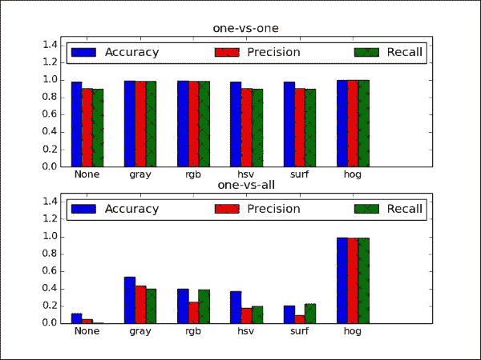

# 第 6 章。学习识别交通标志

本章的目的是训练一个多类分类器以识别交通标志。 在本章中，我们将介绍以下主题：

*   监督学习概念
*   **德国交通标志识别** **基准**（**GTSRB**）数据集特征提取
*   **支持** **向量机**（**SVM**）

先前我们已经研究了如何通过关键点和特征来描述对象，以及如何在同一物理对象的两个不同图像中找到对应点。 但是，在识别现实环境中的对象并将其分配给概念类别时，我们以前的方法相当有限。 例如，在第 2 章和*中使用 Kinect 深度传感器*进行手势识别，图像中所需的对象是手，必须将其很好地放置在手掌的中央 屏幕。 如果我们可以取消这些限制，那岂不是很好吗？

在本章中，我们将训练**支持向量机**（**SVM**）来识别各种交通标志。 尽管 SVM 是二进制分类器（也就是说，它们最多可用于学习两类：正负项，动物和非动物等），但它们可以扩展以用于**多类**分类。 为了获得良好的分类性能，我们将探索许多颜色空间以及定向梯度直方图（**HOG**）功能。 然后，将基于**精度**，**精度**和**召回**来判断分类性能。 以下各节将详细解释所有这些术语。

为了获得这样的多类分类器，我们需要执行以下步骤：

1.  **预处理数据集**：我们需要一种加载数据集，提取感兴趣区域并将数据拆分为适当的训练和测试集的方法。
2.  **提取特征**：可能是原始像素值不是数据的最有信息的表示。 我们需要一种从数据中提取有意义的特征的方法，例如基于不同颜色空间和 HOG 的特征。
3.  **训练分类器**：我们将以两种不同的方式对训练数据进行多分类器训练：**一对多**策略（我们训练单个 每个类别的 SVM，该类别的样本为阳性样本，所有其他样本为阴性），以及**与一对**策略（我们为每对类别训练一个 SVM） ，其中第一类样品为阳性样品，第二类样品为阴性样品）。
4.  **为分类器**评分：我们将通过计算不同的性能指标（例如准确性，准确性和召回率）来评估经过训练的集成分类器的质量。

最终结果将是一个整体分类器，在对 10 个不同的路牌类别进行分类时，其得分接近完美：



# 规划应用

最终的应用程序将解析数据集，训练集成分类器，评估其分类性能，并可视化结果。 这将需要以下组件：

*   `main`：用于启动应用程序的主要功能例程（在`chapter6.py`中）。
*   `datasets.gtsrb`：用于解析德国交通标志识别基准（GTSRB）数据集的脚本。 该脚本包含以下功能：
    *   `load_data`：用于加载 GTSRB 数据集，提取所选特征并将数据分为训练集和测试集的功能。
    *   `_extract_features`：`load_data`调用此函数以从数据集中提取所选特征。
*   `classifiers.Classifier`：一个抽象基类，为所有分类程序定义公共接口。
*   `classifiers.MultiClassSVM`：使用以下公共方法为多类分类实现 SVM 集成的类：
    *   `MultiClassSVM.fit`：一种用于将 SVM 的集合适合训练数据的方法。 它以训练数据矩阵作为输入，其中每一行是训练样本，列中包含特征值和标签向量。
    *   `MultiClassSVM.evaluate`：一种用于通过在训练后将 SVM 应用于某些测试数据来评估 SVM 整体的方法。 它以测试数据矩阵作为输入，其中每一行都是测试样本，各列包含特征值和标签向量。 该函数返回三种不同的性能指标：准确性，准确性和召回率。

在以下各节中，我们将详细讨论这些步骤。

# 监督学习

机器学习的重要子领域是**监督学习**。 在监督学习中，我们尝试从一组标记的培训数据中学习； 也就是说，每个数据样本都具有所需的目标值或真实的输出值。 这些目标值可以对应于函数的连续输出（例如`y = sin(x)`中的`y`），也可以对应于更抽象和离散的类别（例如*猫*或*狗*） 。 如果处理连续输出，则该过程称为**回归**；如果处理离散输出，则该过程称为**分类**。 根据房屋大小预测房价是回归的一个例子。 从鱼的颜色预测物种将是分类。 在本章中，我们将重点介绍使用 SVM 进行分类。

## 训练程序

例如，我们可能想学习猫和狗的模样。 为了使它成为有监督的学习任务，我们将必须创建一个猫和狗的图片数据库（也称为**训练集**），并在数据库中为每张图片加上相应的标签注释 ：*猫*或*狗*。 该程序的任务（在文献中，通常称为**学习者**）将为这些图片中的每张图片推断正确的标签（即，针对每张图片，预测是否正确 是猫或狗的照片）。 基于这些预测，我们得出学习者表现良好的**分数**。 分数然后用于更改学习者的参数，以便随着时间的推移提高分数。

下图概述了此过程：


训练数据由一组功能表示。 对于现实生活中的分类任务，这些功能很少是图像的原始像素值，因为它们往往无法很好地表示数据。 通常，寻找最能描述数据的特征的过程是整个学习任务的重要组成部分（也称为**特征选择**或**特征工程**）。 这就是为什么在考虑建立分类器之前深入研究正在使用的训练集的统计数据和外观始终是一个好主意的原因。

您可能已经知道，这里有整个学习者，成本函数和学习算法的动物园。 这些构成了学习过程的核心。 学习者（例如，线性分类器，支持向量机或决策树）定义如何将输入特征转换为得分或成本函数（例如，均方误差，铰链损失或熵），而学习算法 （例如，神经网络的梯度下降和反向传播）定义了学习者的参数如何随时间变化。

分类任务中的训练过程也可以认为是找到合适的**决策边界**，这是一条将训练集最好地分为两个子集的线，每个子集一个。 例如，考虑训练样本仅具有两个特征（**x** 和 **y** 值）和相应的类别标签（正 **+** 或负**） –**）。 在训练过程的开始，分类器尝试画一条线以将所有正词与所有负词分开。 随着训练的进行，分类器看到越来越多的数据样本。 这些用于更新决策边界，如下图所示：


与相比，此 SVM 试图在高维空间中找到最佳决策边界，因此决策边界可能比直线更复杂。

## 测试程序

为了使训练有素的分类器具有任何实际价值，我们需要知道将其应用于从未见过的数据样本时的表现（也称为**概括**）。 继续前面显示的示例，我们想知道分类器在向其提供先前看不见的猫或狗的图片时预测的类别。

一般而言，我们想知道**属于哪个类？ 下图中的**符号对应于我们在训练阶段中学到的决策边界：


您可以看到为什么这是一个棘手的问题。 如果问号的位置位于左侧，则可以确定相应的类别标签为 **+**。 但是，在这种情况下，有几种方法可以绘制决策边界，以使所有 **+** 符号位于其左侧，而所有 **–** 符号均位于其右侧 ，如下图所示：


**的标签？ 因此，**取决于训练过程中得出的确切决策边界。 如果**？ 上图中的**符号实际上是**-**，然后只有一个决策边界（最左边）会得到正确的答案。 一个常见的问题是，训练导致决策边界在训练集上工作得“太好”（也称为**过度拟合**），但是在应用于看不见的数据时会犯很多错误。 在那种情况下，学习者很可能在决策边界上烙印了特定于训练集的细节，而不是揭示关于数据的一般属性，这对于看不见的数据也可能适用。

### 注意

减少过拟合影响的常用技术称为**正则化**。

长话短说，问题总是回到寻找最佳分割的边界上，不仅是训练，还包括测试集。 这就是为什么分类器最重要的指标是其泛化性能（即，如何分类训练阶段未看到的数据）。

## 分类器基类

从前面的内容中获得的见解，您现在可以编写一个适用于所有可能分类器的简单**基类**。 您可以将此类视为适用于我们尚未设计的所有分类器的蓝图或配方（我们使用第 1 章，*过滤器的乐趣[ [HTG10]）。 为了在 Python 中创建**抽象基类（ABC）**](1.html "Chapter 1. Fun with Filters") ，我们需要包含`ABCMeta`模块：*

```py
from abc import ABCMeta
```

这使我们可以将类注册为`metaclass`：

```py
class Classifier:
    """Abstract base class for all classifiers"""
    __metaclass__ = ABCMeta
```

回想一下，抽象类至少具有一个抽象方法。 抽象方法类似于指定某种方法必须存在，但我们尚不确定它的外观。 我们现在知道，分类器以其最通用的形式应该包含一种训练方法，其中模型适合训练数据，以及测试方法，其中训练后的模型通过将其应用于测试数据进行评估：

```py
    @abstractmethod
    def fit(self, X_train, y_train):
        pass

    @abstractmethod
    def evaluate(self, X_test, y_test, visualize=False):
        pass
```

此处，`X_train`和`X_test`分别对应于训练和测试数据，其中每一行代表一个样本，每一列是该样本的特征值。 训练和测试标签分别作为`y_train`和`y_test`向量传递。

# GTSRB 数据集

为了将分类器应用于交通标志识别，我们需要一个合适的数据集。 一个很好的选择可能是德国交通标志识别基准（GTSRB），其中包含超过 50,000 个属于 40 多个类别的交通标志图像。 这是一个极富挑战性的数据集，专业人士在**国际神经网络联合会议**（**IJCNN**） 2011 期间进行了分类挑战。 从[这个页面](http://benchmark.ini.rub.de/?section=gtsrb&subsection=dataset)获得。

GTSRB 数据集非常大，有条理，开放源代码并带有注释，因此非常适合我们的目的。 但是，出于本书的目的，我们将分类限制为总共 10 个类别的数据样本。

尽管实际交通标志不一定在每个图像中都是正方形或居中的，但数据集附带了一个注释文件，该文件指定每个标志的边界框。

在进行任何形式的机器学习之前，一个好主意通常是对数据集，其质量和挑战有所了解。 如果数据集的所有示例都存储在列表`X`中，则可以使用以下脚本绘制一些示例，我们从中选择固定数量（`sample_size`）的随机索引（`sample_idx`）并显示 每个示例（`X[sample_idx[sp-1]]`）在单独的子图中：

```py
sample_size = 15
sample_idx = np.random.randint(len(X), size=sample_size)
sp = 1
for r in xrange(3):
    for c in xrange(5):
        ax = plt.subplot(3,5,sp)
        sample = X[sample_idx[sp-1]]
        ax.imshow(sample.reshape((32,32)), cmap=cm.Greys_r)
            ax.axis('off')
        sp += 1
plt.show()
```

以下屏幕截图显示了此数据集的一些示例：


即使从这个小的数据样本中，也很明显这对于任何种类的分类器来说都是一个挑战性的数据集。 标志的外观会根据视角（方向），观看距离（模糊）和照明条件（阴影和亮点）而发生巨大变化。 对于其中一些标志，例如第二行中最右边的标志，即使对于人类（至少对我而言），也很难立即分辨出正确的类别标签。 好东西，我们是有抱负的机器学习专家！

## 解析数据集

幸运的是，所选的数据集带有用于解析文件的脚本（更多信息可以在[这个页面](http://benchmark.ini.rub.de/?section=gtsrb&subsection=dataset#Codesnippets)）。

我们对其进行了一些调整，并针对我们的目的进行了调整。 特别是，我们需要一个不仅加载数据集，而且还提取感兴趣的特定特征的函数（通过`feature`输入参数），将样本裁剪到手工标记的**感兴趣区域**（**ROI**）仅包含样本（`cut_roi`），并自动将数据拆分为训练集和测试集（`test_split`）。 我们还允许指定随机种子数（`seed`），并绘制一些样本以进行视觉检查（`plot_samples`）：

```py
import cv2
import numpy as np
import csv

from matplotlib import cm
from matplotlib import pyplot as plt

def load_data(rootpath="datasets", feature="hog", cut_roi=True, 
    test_split=0.2, plot_samples=False, seed=113):
```

尽管完整的数据集包含超过 50,000 个属于 43 个类的示例，但出于本章的目的，我们将限于 10 个类。 为了便于访问，我们将对类标签进行硬编码以在此处使用，但是包含更多的类很简单（请注意，您必须为此下载整个数据集）：

```py
classes = np.array([0, 4, 8, 12, 16, 20, 24, 28, 32, 36])
```

然后，我们需要遍历所有类，以读取所有训练样本（存储在`X`中）及其相应的类标签（存储在`labels`中）。 每个类都有一个 CSV 文件，其中包含该类中每个样本的所有注释信息，我们将使用`csv.reader`进行解析：

```py
X = [] # images
labels =  []  # corresponding labels

# subdirectory for class
for c in xrange(len(classes)):
    prefix = rootpath + '/' + format(classes[c], '05d') + '/'

    # annotations file
    gt_file = open(prefix + 'GT-'+ format(classes[c], '05d')+ '.csv')
    gt_reader = csv.reader(gt_file, delimiter=';')
```

文件的每一行都包含一个数据样本的注释。 我们跳过第一行（标题）并提取样本的文件名（`row[0]`），以便我们可以在图像中读取：

```py
    gt_reader.next() # skip header
    # loop over all images in current annotations file
    for row in gt_reader:
        # first column is filename
        im = cv2.imread(prefix + row[0])
```

有时，这些样本中的对象没有被完美切出，而是被嵌入其周围。 如果设置了`cut_roi`输入参数，我们将忽略背景，并使用注释文件中指定的边界框将对象切出：

```py
    if cut_roi:
        im = im[np.int(row[4]):np.int(row[6]), 
            np.int(row[3]):np.int(row[5]), :]
```

然后，我们准备将图像（`im`）及其类别标签（`c`）附加到样本列表（`X`）和类别标签（`labels`）中：

```py
    X.append(im)
    labels.append(c)
    gt_file.close()
```

通常，希望执行某种形式的特征提取，因为原始图像数据很少是数据的最佳描述。 我们将把这项工作推迟到另一个功能，我们将在下一节中详细讨论：

```py
if feature is not None:
    X = _extract_feature(X, feature)
```

如前一小节所述，必须将用于训练分类器的样本与用于测试分类器的样本分开。 为此，我们将数据进行混洗并将其分成两个单独的集合，以使训练集包含所有样本的一部分（`1-test_split`），其余样本属于测试集：

```py
np.random.seed(seed)
np.random.shuffle(X)
np.random.seed(seed)
np.random.shuffle(labels)

X_train = X[:int(len(X)*(1-test_split))]
y_train = labels[:int(len(X)*(1-test_split))]
X_test = X[int(len(X)*(1-test_split)):]
y_test = labels[int(len(X)*(1-test_split)):]
```

最后，我们可以返回提取的数据：

```py
return (X_train, y_train), (X_test, y_test)
```

# 特征提取

正如我们已经在第 3 章，“通过特征匹配和透视变换查找对象”中所认识的那样，原始像素值不是表示数据的最有用的方式。 。 相反，我们需要导出数据的可测量属性，以便为分类提供更多信息。

但是，通常不清楚哪些功能会表现最佳。 取而代之的是，通常有必要试验建模者认为合适的不同功能。 毕竟，特征的选择可能在很大程度上取决于要分析的特定数据集或要执行的特定分类任务。 例如，如果您必须区分停车标志和警告标志，那么最具说服力的功能可能就是标志的形状或配色方案。 但是，如果您必须区分两个警告标志，那么颜色和形状根本无法帮助您，并且您将需要提供更复杂的功能。

为了演示功能的选择如何影响分类性能，我们将重点关注以下方面：

*   一些简单的颜色转换，例如灰度，RGB 和 HSV。 基于灰度图像的分类将为分类器提供一些基线性能。 由于某些交通标志的颜色方案不同，RGB 可能会给我们带来更好的性能。 HSV 有望提供更好的性能。 这是因为它代表的颜色甚至比 RGB 更坚固。 交通标志往往具有非常明亮，饱和的颜色（理想情况下）与周围环境完全不同。
*   **加速健壮功能**（**SURF**），现在应该对您来说非常熟悉。 我们以前已经认识到 SURF 是一种从图像中提取有意义的特征的有效且鲁棒的方法，因此我们不能在分类任务中利用这一技术来获得优势吗？
*   **定向梯度直方图**（**HOG**），它是迄今为止本章要考虑的最高级特征描述符。 该技术可以计算沿图像上排列的密集网格出现的梯度方向，非常适合与 SVM 一起使用。

特征提取由`gtsrb._extract_features`函数执行，该函数由`gtsrb.load_data`隐式调用。 它提取`feature`输入参数指定的不同功能。

最简单的情况是不提取任何特征，而只是将图像调整为合适的大小：

```py
def _extract_feature(X, feature):
    # operate on smaller image
    small_size = (32, 32)
    X = [cv2.resize(x, small_size) for x in X]
```

### 注意

对于以下大多数功能，我们将在 OpenCV 中使用（已经合适的）默认参数。 但是，这些值并不是一成不变的，即使在现实世界中的分类任务中，通常也有必要在称为**超参数探索的过程中搜索可能值的范围，以用于特征提取和学习参数。**。

## 通用预处理

共有三种预处理的常见形式，几乎总是应用于分类之前的任何数据：**平均减法**，**归一化**和**主成分 分析**（**PCA**）。 在本章中，我们将重点介绍前两个。

平均减法是最常见的预处理形式（有时也称为**零中心**或**去义**），其中每个特征维的平均值 是对数据集中的所有样本进行计算。 然后，从数据集中的每个样本中减去此按功能平均值。 您可以认为此过程将数据的*云*集中在原点上。 归一化是指数据维度的缩放比例，以便它们具有大致相同的缩放比例。 这可以通过以下方式实现：将每个维度除以其标准偏差（一旦它已为零中心），或者将每个维度缩放到 *[-1，1]* 的范围内。 仅当您有理由相信不同的输入要素具有不同的比例或单位时，才应应用此步骤。 在图像的情况下，像素的相对比例已经大约相等（并且在 *[0，255]* 的范围内），因此不必严格执行此附加预处理步骤。

在本章中，我们的想法是增强图像的局部强度对比度，以使我们不再关注图像的整体亮度：

```py
# normalize all intensities to be between 0 and 1
X = np.array(X).astype(np.float32) / 255

# subtract mean
X = [x - np.mean(x) for x in X]
```

## 灰度功能

最容易提取的特征可能是每个像素的灰度值。 通常，灰度值不能很好地表示它们描述的数据，但出于说明目的（即为了达到基准性能），我们将在此处包括它们：

```py
if feature == 'gray' or feature == 'surf':
    X = [cv2.cvtColor(x, cv2.COLOR_BGR2GRAY) for x in X]
```

## 色彩空间

或者，您可能会发现颜色包含一些原始灰度值无法捕获的信息。 交通标志通常具有不同的配色方案，并且可能表示正在尝试传递的信息（即，红色表示停车标志和禁止的行为，绿色表示信息标志，等等）。 我们可以选择使用 RGB 图像作为输入，在这种情况下我们不必做任何事情，因为数据集已经是 RGB。

但是，即使 RGB 可能也无法提供足够的信息。 例如，在光天化日之下的停车标志可能看起来非常明亮清晰，但是在下雨或有雾的日子中，其颜色可能显得不那么活跃。 更好的选择可能是 HSV 颜色空间，它沿着**色相**，**饱和度**和**的轴在圆柱坐标空间中重新排列 RGB 颜色值。 值**（或亮度）。 在这个颜色空间中，交通标志最明显的特征可能是色相（颜色或色度在感知上的相关描述），可以更好地区分不同标志类型的配色方案。 但是，饱和度和价值可能同样重要，因为交通标志往往会使用相对明亮和饱和的颜色，这些颜色通常不会出现在自然场景（即周围环境）中。

在 OpenCV 中，HSV 颜色空间仅是对`cv2.cvtColor`的一次调用：

```py
if feature == 'hsv':
    X = [cv2.cvtColor(x, cv2.COLOR_BGR2HSV) for x in X]
```

## 加快了鲁棒性

但是请稍等！ 在第 3 章，“通过特征匹配和透视变换查找对象”中，您了解了 SURF 描述符是最好和最可靠的方式来描述独立于图像的图像之一 缩放或旋转。 我们可以在分类任务中利用这一技术吗？

很高兴你问！ 为此，我们需要调整 SURF，以使每个图像返回固定数量的特征。 默认情况下，SURF 描述符仅应用于图像中一小部分*有趣的*关键点，每个关键点的数量可能有所不同。 这不适合我们当前的目的，因为我们想为每个数据样本找到固定数量的特征值。

相反，我们需要将 SURF 应用于图像上方的固定密集网格，这可以通过创建*密集*特征检测器来实现：

```py
if feature == 'surf':
    # create dense grid of keypoints
    dense = cv2.FeatureDetector_create("Dense")
    kp = dense.detect(np.zeros(small_size).astype(np.uint8))
```

然后就有可能获得网格上每个点的 SURF 描述符并将该数据样本附加到我们的特征矩阵中。 我们像以前一样使用`minHessian`值为 400 初始化 SURF，并且：

```py
surf = cv2.SURF(400)
surf.upright = True
surf.extended = True
```

然后可以通过以下代码获取关键点和描述符：

```py
kp_des = [surf.compute(x, kp) for x in X]
```

因为`surf.compute`有两个输出参数，所以`kp_des`实际上将是的关键点和描述符的串联。 `kp_des`数组中的第二个元素是我们关心的描述符。 我们从每个数据样本中选择第一个`num_surf_features`并将其添加回训练集中：

```py
num_surf_features = 36
X = [d[1][:num_surf_features, :] for d in kp_des]
```

## 定向梯度的直方图

考虑的最后一个特征描述符是定向梯度直方图（HOG）。 先前已证明 HOG 功能与 SVM 结合使用时效果特别好，尤其是在应用于行人识别等任务时。

HOG 功能背后的基本思想是，图像中对象的局部形状和外观可以通过边缘方向的分布来描述。 图像被划分为较小的连接区域，在该区域中会编译渐变方向（或边缘方向）的直方图。 然后，通过连接不同的直方图来组装描述符。 为了提高性能，可以对局部直方图进行对比度归一化，从而更好地保持照明和阴影变化的不变性。 您会看到为什么这种预处理可能恰好适合于在不同视角和光照条件下识别交通标志。

可以通过`cv2.HOGDescriptor`在 OpenCV 中完全访问 HOG 描述符，它采用检测窗口大小（32 x 32），块大小（16 x 16），像元大小（8 x 8）和像元跨度（ 8 x 8），作为输入参数。 然后，对于这些单元格中的每个单元格，HOG 描述符使用九个面元计算定向梯度的直方图：

```py
elif feature == 'hog':
    # histogram of oriented gradients
    block_size = (small_size[0] / 2, small_size[1] / 2)
    block_stride = (small_size[0] / 4, small_size[1] / 4)
    cell_size = block_stride
    num_bins = 9
    hog = cv2.HOGDescriptor(small_size, block_size, block_stride, cell_size, num_bins)
```

将 HOG 描述符应用于每个数据样本为，然后就像调用`hog.compute`一样容易：

```py
X = [hog.compute(x) for x in X]
```

提取完所需的所有功能后，我们应该记住要让`gtsrb._extract_features`返回数据样本的组合列表，以便可以将它们分为训练和测试集：

```py
X = [x.flatten() for x in X]
return X
```

现在，我们终于准备好在预处理的数据集上训练分类器了。

# 支持向量机

支持向量机（SVM）是一种用于二进制分类（和回归）的学习器，它试图通过决策边界将两个不同类标签中的示例分离开来，以使两个类之间的余量最大化。

让我们回到正负数据样本的示例，每个样本都具有两个特征（**x** 和 **y**），以及两个可能的决策边界，如下所示：


这两个决策边界都可以完成工作。 他们用零错误分类对所有正样本和负样本进行划分。 但是，其中之一似乎在直观上更好。 我们如何量化“更好”，从而学习“最佳”参数设置？

这就是 SVM 出现的地方。SVM 也被称为最大余量分类器，因为它们可以用来做这些。 他们定义了决策边界，以便使 **+** 和 **–** 的这两朵云尽可能地分开。

对于前面的示例，SVM 将找到两条穿过类边距上数据点的线（下图中的虚线），然后使穿过边距中心的线（决策边界） 下图中的黑色粗线）：


事实证明，要找到最大余量，仅考虑位于类余量上的数据点很重要。 这些点有时也称为**支持向量**。

### 注意

除了执行线性分类（即决策边界为直线时）之外，SVM 还可以使用**内核技巧**隐式映射其输入来执行非线性分类。 到高维特征空间。

## 使用 SVM 进行多类别分类

尽管某些分类算法（例如神经网络）自然可以使用两个以上的类，但 SVM 本质上是二进制分类器。 但是，它们可以变成多类分类器。

在这里，我们将考虑两种不同的策略：

*   **一对多**：一对多策略涉及每个类别训练一个分类器，该类别的样本为阳性样本，所有其他样本为阴性。 因此，对于`k`类，此策略需要训练`k`不同的 SVM。 在测试期间，所有分类器都可以通过预测未见样本属于其类别来表示“ +1”投票。 最后，合奏将看不见的样本分类为投票最多的类别。 通常，此策略与置信度分数结合使用，而不是与预测标签结合使用，以便最终可以选择置信度分数最高的课程。
*   **一对一**：一对一策略涉及每类对训练一个分类器，第一类样本为阳性样本，第二类样本为阴性样本 样品。 对于`k`类，此策略需要训练`k*(k-1)/2`分类器。 但是，分类器必须解决一个非常简单的任务，因此在考虑使用哪种策略时需要权衡取舍。 在测试期间，所有分类器都可以对第一或第二个类别表示“ +1”投票。 最后，合奏将看不见的样本分类为投票最多的类别。

用户可以通过`MutliClassSVM`类的输入参数（`mode`）由用户指定使用哪种策略：

```py
class MultiClassSVM(Classifier):
    """Multi-class classification using Support Vector Machines (SVMs) """
    def __init__(self, num_classes, mode="one-vs-all", params=None):
        self.num_classes = num_classes
        self.mode = mode
        self.params = params or dict()
```

如前所述，根据分类策略，我们将需要`k`或`k*(k-1)/2` SVM 分类器，为此我们将在`self.classifiers`中维护一个列表：

```py
        # initialize correct number of classifiers
        self.classifiers = []
        if mode == "one-vs-one":
            # k classes: need k*(k-1)/2 classifiers
            for i in xrange(numClasses*(numClasses-1)/2):
                self.classifiers.append(cv2.SVM())
        elif mode == "one-vs-all":
            # k classes: need k classifiers
            for i in xrange(numClasses):
                self.classifiers.append(cv2.SVM())
        else:
            print "Unknown mode ",mode
```

一旦正确地初始化了分类器，我们就准备好进行训练了。

## 训练 SVM

遵循`Classifier`基类定义的要求，我们需要以`fit`方法执行训练：

```py
def fit(self, X_train, y_train, params=None):
    """ fit model to data """
    if params is None:
        params = self.params
```

培训将根据所使用的分类策略而有所不同。 一对一策略要求我们为每对课程训练一个 SVM：

```py
if self.mode == "one-vs-one":
    svm_id=0
    for c1 in xrange(self.numClasses):
        for c2 in xrange(c1+1,self.numClasses):
```

在这里，我们使用`svm_id`来跟踪我们使用的 SVM 的数量。 与“一对多”策略相反，我们需要在此处训练大量的 SVM。 但是，每个 SVM 要考虑的训练样本仅包括`c1`或`c2`类别的样本：

```py
y_train_c1 = np.where(y_train==c1)[0]
y_train_c2 = np.where(y_train==c2)[0]

data_id = np.sort(np.concatenate((y_train_c1, y_train_c2), axis=0))
X_train_id = X_train[data_id,:]
y_train_id = y_train[data_id]
```

由于 SVM 是二进制分类器，因此我们需要将整数类标签转换为 0 和 1。 再次使用方便的`np.where`函数，我们将标签`1`分配给`c1`类的所有样本，并将标签`0`分配给`c2`类的所有样本：

```py
y_train_bin = np.where(y_train_id==c1, 1, 0).flatten()
```

然后我们准备训练 SVM：

```py
self.classifiers[svm_id].train(X_train_id, y_train_bin, params=self.params)
```

在这里，我们将训练参数字典`self.params`传递到 SVM。 目前，我们仅考虑（已经合适的）默认参数值，但可以尝试使用不同的设置。

不要忘记更新`svm_id`，以便您可以继续使用列表中的下一个 SVM：

```py
svm_id += 1
```

另一方面，“一对多”策略要求我们训练总数为`self.numClasses`的 SVM，这使索引编制变得容易得多：

```py
elif self.mode == "one-vs-all":
    for c in xrange(self.numClasses):
```

同样，我们需要将整数标签转换为二进制标签。 与一对一策略相反，这里的每个 SVM 都考虑所有训练样本。 我们将标签`1`分配给`c`类的所有样本，并将标签`0`分配给所有其他样本，然后将数据传递给分类器的训练方法：

```py
y_train_bin = np.where(y_train==c,1,0).flatten()
self.classifiers[c].train(X_train, y_train_bin, params=self.params)
```

OpenCV 将负责其余的工作。 实际情况是，SVM 训练使用拉格朗日乘数来优化一些约束，这些约束会导致最大利润的决策边界。 通常会执行优化过程，直到满足某些终止条件为止，这些条件可以通过 SVM 的可选参数指定：

```py
params.term_crit = (cv2.TERM_CRITERIA_EPS + cv2.TERM_CRITERIA_MAX_ITER, 100, 1e-6)
```

## 测试 SVM

评估分类器的方法有很多，但是最常见的是，我们只对准确性指标感兴趣，也就是说，对测试集中有多少数据样本进行了正确分类。

为了得出此指标，我们需要让每个单独的 SVM 预测测试数据的标签，并在 2D 投票矩阵（`Y_vote`）中组装它们的共识：

```py
def evaluate(self, X_test, y_test, visualize=False):
    """Evaluates model performance"""
    Y_vote = np.zeros((len(y_test), self.numClasses))
```

对于数据集中的每个样本，投票矩阵将包含样本被投票属于某个类别的次数。 根据分类策略，填充投票矩阵将采取略有不同的形式。 在一对一策略的情况下，我们需要遍历所有`k*(k-1)/2`分类器，并获得一个名为`y_hat`的向量，该向量包含所有属于`c1`类的测试样本的预测标签 或`c2`类：

```py
if self.mode == "one-vs-one":
    svm_id = 0
    for c1 in xrange(self.numClasses):
        for c2 in xrange(c1+  1, self.numClasses):
            data_id = np.where((y_test==c1) + (y_test==c2))[0]
            X_test_id = X_test[data_id,:],:],:] 
            y_test_id = y_test[data_id]

            # predict labels
            y_hat = self.classifiers[svm_id].predict_all( X_test_id)
```

每当分类器认为样本属于`c1`类时，`y_hat`向量将包含 1；而当分类器认为样本属于`c2`类时，`y_hat`向量将包含 0。 棘手的部分是如何为`Y_vote`矩阵中的正确单元格+1。 例如，如果`y_hat`中的*第*项是`1`（意味着我们认为第个样本属于`c1`类），我们想增加 `Y_vote`矩阵中第*行第*和第*列第*列的值。 这将表明本分类器已投票赞成将*样本和*样本归为`c1`类。**

因为我们知道属于`c1`或`c2`类（存储在`data_id`中）的所有测试样本的索引，所以我们知道要访问`Y_vote`的哪些行。 因为`data_id`用作`Y_vote`的索引，所以我们只需要在`data_id`中找到与`y_hat`为`1`的条目相对应的索引：

```py
            # we vote for c1 where y_hat is 1, and for c2 where 
            # y_hat is 0
            # np.where serves as the inner index into the 
            # data_id array, which in turn serves as index 
            # into the Y_vote matrix
            Y_vote[data_id[np.where(y_hat==1)[0]],c1] += 1
```

同样，我们可以对`c2`类表示投票：

```py
            Y_vote[data_id[np.where(y_hat==0)[0]],c2] += 1
```

然后我们增加`svm_id`并转到下一个分类器：

```py
             svm_id += 1
```

“一对多”策略提出了一个不同的问题。 在`Y_vote`矩阵中建立索引的难度较小，因为我们始终考虑所有测试数据样本。 我们为每个数据样本重复预测标签的过程：

```py
elif self.mode == "one-vs-all":
    for c in xrange(self.numClasses):
        # predict labels
        y_hat = self.classifiers[c].predict_all(X_test)
```

无论`y_hat`的值为`1`，分类器都会表示该数据样本属于`c`类的投票，我们将更新投票矩阵：

```py
        # we vote for c where y_hat is 1
        if np.any(y_hat):
            Y_vote[np.where(y_hat==1)[0], c] += 1
```

现在最棘手的部分是，“如何处理具有`0`值的`y_hat`条目？” 由于我们将“一对多”分类，因此我们只知道样本不是`c`类（也就是说，它属于“其余”），但是我们不知道确切的类标签应该是什么 。 因此，我们不能将这些样本添加到投票矩阵中。

由于我们忽略了包括始终被归类为“其余”的样本，因此`Y_vote`矩阵中的某些行可能全为 0。 在这种情况下，只需随机选择一个班级（除非您有更好的主意）：

```py
        # find all rows without votes, pick a class at random
        no_label = np.where(np.sum(y_vote,axis=1)==0)[0]
        Y_vote[no_label,np.random.randint(self.numClasses, size=len(no_label))] = 1
```

现在，我们已经准备好来计算所需的性能指标，这将在后面的部分中详细介绍。 就本章而言，我们选择计算准确性，精确度和召回率，它们以自己专用的私有方法实现：

```py
accuracy = self.__accuracy(y_test, Y_vote)
precision = self.__precision(y_test, Y_vote)
recall = self.__recall(y_test, Y_vote)

return (accuracy,precision,recall)
```

### 注意

`scikit-learn`机器学习包（ [http://scikit-learn.org](http://scikit-learn.org) ）支持即开即用的三个指标：准确性，准确性和召回率（以及其他） ，还附带了各种其他有用的工具。 出于教育目的（并最大程度地减少软件依赖性），我们将自己得出这三个指标。

### 混淆矩阵

混淆矩阵是大小为`(self.numClasses, self.numClasses)`的 2D 矩阵，其中行对应于预测的类别标签，列对应于实际的类别标签。 然后，`[r,c]`矩阵元素包含预测为具有标签`r`，但实际上具有标签`c`的样本数。 访问混淆矩阵将使我们能够计算精度和召回率。

混淆矩阵可以从真实标签（HTG0）和投票矩阵（HTG1）的向量中计算得出。 我们首先通过选择获得最多投票的列索引（即类标签）将投票矩阵转换为预测标签的向量：

```py
def __confusion(self, y_test, Y_vote):
    y_hat = np.argmax(Y_vote, axis=1)
```

然后，我们需要在所有类别上循环两次，并计算预测`c_true`真实类别的数据样本具有`c_pred`类别的次数：

```py
    conf = np.zeros((self.numClasses, self.numClasses)).astype(np.int32)
    for c_true in xrange(self.numClasses):
        # looking at all samples of a given class, c_true
        # how many were classified as c_true? how many as others?
        for c_pred in xrange(self.numClasses):
```

因此，每次迭代中所有感兴趣的元素都是在`y_test`中具有`c_true`标签和在`y_hat`中具有`c_pred`标签的样本：

```py
            y_this = np.where((y_test==c_true) * (y_hat==c_pred))
```

置信矩阵中相应的单元格就是`y_this`中非零元素的数量：

```py
            conf[c_pred,c_true] = np.count_nonzero(y_this)
```

嵌套循环完成后，我们将混淆矩阵进行进一步处理：

```py
    return conf
```

您可能已经猜到了，一个好的分类器的目标是使混淆矩阵对角线化，这意味着每个样本的真实级别（`c_true`）和预测级别（`c_pred`）相同 。

一对一策略与 HOG 功能相结合，实际上效果非常好，这从由此产生的混淆矩阵中可以明显看出，其中大多数非对角元素为零：


### 准确性

要计算的最简单的指标可能是准确性。 此度量标准仅计算已正确预测的测试样本数，然后将其返回为测试样本总数的一部分：

```py
def __accuracy(self, y_test, y_vote):
    """ Calculates the accuracy based on a vector of ground-truth labels (y_test) and a 2D voting matrix (y_vote) of size (len(y_test),numClasses). """
```

可以通过找出哪个类别获得最多投票的方式从投票矩阵中提取分类预测（`y_hat`）：

```py
    y_hat = np.argmax(y_vote, axis=1)
```

可以通过将样本的预测标签与其实际标签进行比较来验证预测的正确性：

```py
    # all cases where predicted class was correct
    mask = (y_hat == y_test)
```

然后，通过计算正确的预测数（即`mask`中的非零条目）并通过测试样本总数对该数字进行归一化来计算准确性：

```py
    return np.count_nonzero(mask)*1./len(y_test)
```

### 精度

二进制分类的精度是一种有用的度量标准，用于测量所检索的相关实例的比例（也称为**阳性预测值**）。 在分类任务中，**真实阳性**的数量定义为正确标记为属于阳性类别的项目的数量。 **精度**定义为真实阳性数除以阳性总数。 换句话说，在测试集中分类器认为包含猫的所有图片中，精度是实际包含猫的图片的比例。

阳性总数也可以计算为真阳性和**假阳性**的总和，后者是被错误地标记为属于特定类别的样本数。 这是混淆矩阵派上用场的地方，因为它将使我们能够快速计算误报的数量。

同样，我们首先将投票矩阵转换为预测标签的向量：

```py
def __precision(self, y_test, Y_vote):
    """ precision extended to multi-class classification """
    # predicted classes
    y_hat = np.argmax(Y_vote, axis=1)
```

根据分类策略，该过程将略有不同。 一对一策略要求我们使用混淆矩阵进行操作：

```py
    if True or self.mode == "one-vs-one":
        # need confusion matrix
        conf = self.__confusion(y_test, y_vote)

        # consider each class separately
        prec = np.zeros(self.numClasses)
        for c in xrange(self.numClasses):
```

由于真实阳性是被预测为实际上具有标签`c`且也具有标签`c`的样本，因此它们对应于混淆矩阵的对角元素：

```py
            # true positives: label is c, classifier predicted c
            tp = conf[c,c]
```

同样，假阳性与混淆矩阵的对角线元素相对应，它们与真阳性在同一列中。 计算该数字的最快方法是对`c`列中的所有元素求和，但减去真实的正数：

```py
            # false positives: label is c, classifier predicted 
            # not c
            fp = np.sum(conf[:,c]) - conf[c,c]
```

精度是真实肯定的数量除以真实肯定和错误肯定的总和：

```py
    if tp + fp != 0:
        prec[c] = tp*1./(tp+fp)
```

一对多策略使数学运算变得容易一些。 由于我们始终使用完整的测试集，因此只需要查找在`y_test`中具有`c`真实标签而在`y_hat`中具有`c`预测标签的样本：

```py
    elif self.mode == "one-vs-all":
        # consider each class separately
        prec = np.zeros(self.numClasses)
        for c in xrange(self.numClasses):
            # true positives: label is c, classifier predicted c
            tp = np.count_nonzero((y_test==c) * (y_hat==c))
```

同样，假阳性在`y_test`中具有`c`的真实标签，而在`y_hat`中其预测的标签不是`c`：

```py
            # false positives: label is c, classifier predicted 
            # not c
            fp = np.count_nonzero((y_test==c) * (y_hat!=c))
```

同样，精度是真实阳性的数量除以真实阳性和假阳性的总和：

```py
            if tp + fp != 0:
                prec[c] = tp*1./(tp+fp)
```

之后，我们传递精度向量以进行可视化：

```py
    return prec
```

### 召回

召回在某种意义上与精度类似，因为它会测量所检索的相关实例的比例（与所检索的相关实例的比例相对）。 在分类任务中，假阴性的数量是未标记为属于阳性类别但应标记的项目数量。 召回率是真实肯定的数量除以真实肯定和错误否定的总和。 换句话说，在世界上所有猫的图片中，召回率是被正确识别为猫的图片的一部分。

再次，我们首先将投票矩阵转换为预测标签的向量：

```py
def __recall(self, y_test, Y_vote):
    """ recall extended to multi-class classification """
    # predicted classes
    y_hat = np.argmax(Y_vote, axis=1)
```

该过程几乎与计算精度相同。 一对一策略再次需要一些涉及混淆矩阵的算法：

```py
    if True or self.mode == "one-vs-one":
        # need confusion matrix
        conf = self.__confusion(y_test, y_vote)

        # consider each class separately
        recall = np.zeros(self.numClasses)
        for c in xrange(self.numClasses):
```

真正值再次对应于混淆矩阵中的对角元素：

```py
            # true positives: label is c, classifier predicted c
            tp = conf[c,c]
```

要获得假阴性数，我们将`c`行中的所有列求和，然后减去该行的真阳性数。 这将为我们提供分类器预测其类别为`c`但实际上具有`c`以外的真实标签的样本数：

```py
            # false negatives: label is not c, classifier
            # predicted c
            fn = np.sum(conf[c,:]) - conf[c,c]
```

回想一下，是真实阳性的数量除以真实阳性和假阴性的总和：

```py
            if tp + fn != 0:
                recall[c] = tp*1./(tp+fn)
```

同样，“一对多”策略使数学运算更加容易。 由于我们始终在完整的测试集上进行操作，因此我们只需要查找那些在`y_test`中的地面标签不是`c`且在`y_hat`中的预测标签是`c`的样本：

```py
    elif self.mode == "one-vs-all":
        # consider each class separately
        recall = np.zeros(self.numClasses)
        for c in xrange(self.numClasses):
            # true positives: label is c, classifier predicted c
            tp = np.count_nonzero((y_test==c) * (y_hat==c))

            # false negatives: label is not c, classifier
            # predicted c
            fn = np.count_nonzero((y_test!=c) * (y_hat==c))

            if tp + fn != 0:
                recall[c] = tp*1./(tp+fn)
```

之后，我们传递召回向量以进行可视化：

```py
    return recall
```

# 全部放在一起

要运行我们的应用，我们需要执行主要功能例程（在`chapter6.py`中）。 它加载数据，训练分类器，评估其性能并可视化结果。

但是首先，我们需要导入所有相关模块并设置一个主要功能：

```py
import numpy as np

import matplotlib.pyplot as plt
from datasets import gtsrb
from classifiers import MultiClassSVM

def main():
```

然后，目标是比较设置和特征提取方法之间的分类性能。 这包括使用一对多和一对多两种分类策略运行任务，以及使用一系列不同的特征提取方法预处理数据：

```py
    strategies = ['one-vs-one', 'one-vs-all']features = [None, 
        'gray', 'rgb', 'hsv', 'surf', 'hog']
```

对于这些设置中的每一个，我们需要收集三个性能指标—准确性，精度和召回率：

```py
    accuracy = np.zeros((2,len(features)))
    precision = np.zeros((2,len(features)))
    recall = np.zeros((2,len(features)))
```

嵌套的`for`循环将使用所有这些设置来运行分类器，并填充性能指标矩阵。 外循环遍历`features`向量中的所有元素：

```py
    for f in xrange(len(features)):
        (X_train,y_train), (X_test,y_test) = gtsrb.load_data( "datasets/gtsrb_training", feature=features[f], test_split=0.2)
```

在将训练数据（`X_train`，`y_train`）和测试数据（`X_test`，`y_test`）传递给分类器之前，我们要确保它们符合分类器期望的格式； 也就是说，每个数据样本都存储在`X_train`或`X_test`的行中，其中的列与特征值相对应：

```py
X_train = np.squeeze(np.array(X_train)).astype(np.float32)
y_train = np.array(y_train)
X_test = np.squeeze(np.array(X_test)).astype(np.float32)
y_test = np.array(y_test)
```

我们还需要知道类标签的数量（因为我们没有加载完整的 GTSRB 数据集）。 这可以通过串联`y_train`和`y_test`并提取组合列表中的所有唯一标签来实现：

```py
labels = np.unique(np.hstack((y_train,y_test)))
```

接下来，内部循环遍历`strategies`向量中的所有元素，该向量当前包括“一对多”和“一对一”两种策略：

```py
for s in xrange(len(strategies)):
```

然后，我们使用正确数量的唯一标签和相应的分类策略实例化`MultiClassSVM`类：

```py
MCS = MultiClassSVM(len(labels),strategies[s])
```

现在我们已经准备好将集成分类器应用于训练数据并在训练后提取三个性能指标：

```py
MCS.fit(X_train, y_train)
(accuracy[s,f],precision[s,f],recall[s,f]) = MCS.evaluate(X_test, y_test)
```

这样就结束了嵌套的`for`循环。 剩下要做的就是可视化结果。 为此，我们选择 matplotlib 的条形图功能。 目标是显示提取的特征和分类策略的所有组合的三个性能指标（准确性，准确性和召回率）。 我们将为每个分类策略使用一个绘图窗口，并在堆叠的条形图中排列相应的数据：

```py
f,ax = plt.subplots(2)
for s in xrange(len(strategies)):
    x = np.arange(len(features))
    ax[s].bar(x-0.2, accuracy[s,:], width=0.2, color='b', hatch='/', align='center')
    ax[s].bar(x, precision[s,:], width=0.2, color='r', hatch='\\', align='center')
    ax[s].bar(x+0.2, recall[s,:], width=0.2, color='g', hatch='x', align='center')
```

为了可见， *y* 轴限制在相关范围内：

```py
ax[s].axis([-0.5, len(features) + 0.5, 0, 1.5])
```

最后，我们添加一些情节装饰：

```py
ax[s].legend(('Accuracy','Precision','Recall'), loc=2, ncol=3, mode="expand")
ax[s].set_xticks(np.arange(len(features)))
ax[s].set_xticklabels(features)
ax[s].set_title(strategies[s])
```

现在数据已准备好绘制！

```py
plt.show()
```


此屏幕快照包含很多信息，因此我们将其逐步分解：

*   最直接的观察是，HOG 功能似乎强大！ 无论分类策略是什么，此功能都优于其他所有功能。 同样，这凸显了特征提取的重要性，这通常需要对所研究数据集的统计数据有深刻的了解。
*   有趣的是，使用一对多策略时，所有方法的准确性都在 0.95 以北，这可能是由于二进制分类任务（带有两个可能的类别标签）有时比 10 容易学习的事实。 级分类任务。 不幸的是，对于“一对多”方法不能说相同的话。 但公平地说，“一对多”方法只能使用 10 个 SVM，而“一对多”方法只能使用 45 个 SVM。 仅当我们添加更多对象类别时，这种差距才可能增加。
*   通过将`None`的结果与`rgb`的结果进行比较，可以看到去语义的影响。 这两个设置是相同的，除了`rgb`下的样品已标准化。 成效上的差异是显而易见的，尤其是一对多策略。
*   令人失望的发现是，没有任何一种颜色转换（RGB 和 HSV）都比简单的灰度转换性能要好得多。 SURF 也没有帮助。

# 摘要

在本章中，我们训练了一个多类分类器来识别来自 GTSRB 数据库的交通标志。 我们讨论了监督学习的基础知识，探索了特征提取的复杂性，并扩展了 SVM，以便可以将它们用于多类分类。

值得注意的是，我们在此过程中遗漏了一些细节，例如尝试微调学习算法的超参数。 当我们将交通标志数据集限制为仅 10 个类别时，此过程中各种函数参数的默认值似乎足以表现出色（仅查看通过 HOG 功能获得的完美得分，以及 一种策略）。 通过此功能设置以及对基础方法的充分理解，您现在可以尝试对整个 GTSRB 数据集进行分类！ 绝对值得一看他们的网站，在这里您可以找到各种分类器的分类结果。 也许，您自己的方法很快就会添加到列表中。

在下一章（也是最后一章）中，我们将更深入地研究机器学习领域。 具体来说，我们将重点研究使用卷积神经网络识别人脸中的情感表情。 这次，我们将分类器与用于对象检测的框架相结合，这将使我们能够在图像中定位（在何处）人脸，然后着重于识别（什么？）该人脸中包含的情感表达。 这将结束我们对机器学习的深入探索，并为您提供使用计算机视觉原理和概念来开发自己的高级 OpenCV 项目所需的所有必要工具。