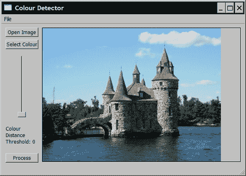

# 第 3 章使用类处理图像

在本章中，我们将介绍：

*   在算法设计中使用策略模式
*   使用控制器与处理模块通信
*   使用 Singleton 设计模式
*   使用 Model-View-Controller 体系结构设计应用程序
*   转换色彩空间

# 简介

好的计算机视觉程序始于好的编程习惯。 构建无错误的应用程序仅仅是开始。 您真正想要的是一个应用程序，您和与您一起工作的程序员将能够轻松适应新需求的发展。本章将向您展示如何充分利用一些面向对象的编程原理 为了建立高质量的软件程序。 特别是，我们将介绍一些重要的设计模式，这些模式将帮助您构建由易于测试，维护和重用的组件组成的应用程序。

设计模式是软件工程中众所周知的概念。 基本上，**设计模式**是对软件设计中经常出现的一般性问题的一种可重复使用的合理解决方案。 已经引入了许多软件模式，并有据可查。 好的程序员应该对这些现有模式有一定的了解。

本章还有第二个目标。 它将教您如何使用图像颜色。 本章中使用的示例将向您展示如何检测给定颜色的像素，最后的配方将说明如何使用不同的颜色空间。

# 在策略设计中使用策略模式

策略设计模式的目标是将算法封装到一个类中。 这样，将给定算法替换为另一个算法，或将多个算法链接在一起以构建更复杂的过程变得更加容易。 另外，该模式通过将尽可能多的复杂性隐藏在直观的编程界面后面，从而促进了算法的部署。

## 准备

假设我们要构建一种简单的算法，该算法将识别图像中具有给定颜色的所有像素。 然后，算法必须接受图像和颜色作为输入，并返回显示具有指定颜色的像素的二进制图像。 我们希望接受颜色的容差将是运行算法之前要指定的另一个参数。

## 怎么做...

该算法的核心过程很容易构建。 这是一个遍历每个像素的简单扫描循环，将其颜色与目标颜色进行比较。 使用我们在上一章中学到的知识，该循环可以写为：

```cpp
     // get the iterators
     cv::Mat_<cv::Vec3b>::const_iterator it=
                         image.begin<cv::Vec3b>();
     cv::Mat_<cv::Vec3b>::const_iterator itend=
                      image.end<cv::Vec3b>();
     cv::Mat_<uchar>::iterator itout= 
                        result.begin<uchar>();

     // for each pixel
     for ( ; it!= itend; ++it, ++itout) {

        // process each pixel ---------------------

        // compute distance from target color
        if (getDistance(*it)<minDist) {

           *itout= 255;

        } else {

           *itout= 0;
        }

        // end of pixel processing ----------------
     }
```

`cv::Mat`变量`image`表示输入图像，而`result`表示二进制输出图像。 因此，第一步包括设置所需的迭代器。 这样，即可轻松实现扫描`for`循环。 每次迭代都会检查当前像素颜色和目标颜色之间的距离是否在`minDist`定义的公差范围内。 如果是这种情况，则将值`255`（白色）分配给输出图像，如果不是，则分配`0`（黑色）。 要计算两个颜色值之间的距离，请使用`getDistance`方法。 有多种计算此距离的方法。 例如，可以计算包含 RGB 颜色值的 3 个向量之间的欧式距离。 在我们的案例中，为使计算简单有效，我们简单地将 RGB 值的绝对差求和（也称为城市街区距离）。 `getDistance`方法的定义如下：

```cpp
     // Computes the distance from target color.
     int getDistance(const cv::Vec3b& color) const {

        return abs(color[0]-target[0])+
               abs(color[1]-target[1])+
               abs(color[2]-target[2]);
     }
```

请注意，我们如何使用`cv::Vec3d`来保存代表颜色的 RGB 值的三个`unsigned chars`。 变量`target`显然是指指定的目标颜色，正如我们将要看到的，它在我们定义的类算法中被定义为类变量。 现在，让我们完成处理方法的定义。 用户将提供输入图像，图像扫描完成后将返回结果：

```cpp
cv::Mat ColorDetector::process(const cv::Mat &image) {

     // re-allocate binary map if necessary
     // same size as input image, but 1-channel
     result.create(image.rows,image.cols,CV_8U);

*processing loop above goes here*
     ...

     return result;
}
```

每次调用此方法时，检查是否需要重新分配包含结果二进制映射的输出图像以适合输入图像的大小，这一点很重要。 这就是为什么我们使用`cv::Mat`的`create`方法。 请记住，只有在指定的大小和深度与当前图像结构不符时，该图像才会继续进行重新分配。

现在我们已经定义了核心处理方法，让我们看看应该添加哪些其他方法来部署此算法。 先前我们确定了算法需要哪些输入和输出数据。 因此，我们首先定义将保存此数据的类属性：

```cpp
class ColorDetector {

  private:

     // minimum acceptable distance
     int minDist; 

     // target color
     cv::Vec3b target; 

     // image containing resulting binary map
     cv::Mat result;
```

为了创建封装我们的算法的类的实例（并命名为`ColorDetector`），我们需要定义一个构造函数。 请记住，策略设计模式的目标之一是使算法部署尽可能容易。 可以定义的最简单的构造函数是一个空的构造函数。 它将在有效状态下创建类算法的实例。 然后，我们希望构造函数将所有输入参数初始化为其默认值（或通常能带来良好结果的已知值）。 在我们的案例中，我们认为距离 100 通常是可以接受的公差。 我们还设置了默认的目标颜色。 我们没有特殊原因选择黑色。 目的是确保我们始终从可预测和有效的输入值开始：

```cpp
     // empty constructor
     ColorDetector() : minDist(100) { 

        // default parameter initialization here
        target[0]= target[1]= target[2]= 0;
     }
```

此时，创建我们的类算法实例的用户可以立即使用有效图像调用 process 方法并获得有效输出。 这是“策略”模式的另一个目标，即确保算法始终以有效参数运行。 显然，此类的用户将想要使用自己的设置。 这是通过为用户提供适当的吸气剂和吸气剂来完成的。 让我们从颜色容差参数开始：

```cpp
     // Sets the color distance threshold.
     // Threshold must be positive, 
     // otherwise distance threshold is set to 0.
     void setColorDistanceThreshold(int distance) {

        if (distance<0)
           distance=0;
        minDist= distance;
     }

     // Gets the color distance threshold
     int getColorDistanceThreshold() const {

        return minDist;
     }
```

注意我们如何首先检查输入的有效性。 同样，这是为了确保我们的算法永远不会在无效状态下运行。 可以类似地设置目标颜色：

```cpp
     // Sets the color to be detected
     void setTargetColor(unsigned char red, 
                          unsigned char green, 
                          unsigned char blue) {

        // BGR order
        target[2]= red;
        target[1]= green;
        target[0]= blue;
     }

     // Sets the color to be detected
     void setTargetColor(cv::Vec3b color) {

        target= color;
     }

     // Gets the color to be detected
     cv::Vec3b getTargetColor() const {

        return target;
     }
```

这次有趣的是，我们为用户提供了`setTagertColor`方法的两个定义。 在第一个版本中，将三个颜色分量指定为三个参数，而在第二个版本中，`cv::Vec3b`用于保存颜色值。 同样，目标是促进使用我们的类算法。 用户只需选择最适合需求的安装员即可。

## 工作原理...

一旦使用策略设计模式将算法封装到一个类中，就可以通过创建此类的实例来进行部署。 通常，实例将在程序初始化时创建。 可以读取和显示算法参数的默认值。 对于具有 GUI 的应用程序，可以使用不同的小部件（文本字段，silder 等）读取和设置参数值，以便用户可以轻松地使用它们。 但是在介绍 GUI 之前（这将在本章后面完成），让我们首先编写一个简单的 main 函数，该函数将运行我们的颜色检测算法：

```cpp
int main()
{
   // 1\. Create image processor object
   ColorDetector cdetect;

   // 2\. Read input image
   cv::Mat image= cv::imread("boldt.jpg");
   if (!image.data)
      return 0; 

   // 3\. Set input parameters
   cdetect.setTargetColor(130,190,230); // here blue sky

   cv::namedWindow("result");

   // 4\. Process the image and display the result
   cv::imshow("result",cdetect.process(image));

   cv::waitKey();

   return 0;
}
```

在上一章介绍的彩色图像上运行该程序会产生以下输出：


显然，我们在此类中封装的算法相对简单（只有一个扫描循环和一个公差参数）。 当要实施的算法更加复杂，具有多个步骤并包含多个参数时，策略设计模式将变得非常强大。

## 还有更多...

要计算两个颜色矢量之间的距离，我们使用以下简单公式：

```cpp
return abs(color[0]-target[0])+
       abs(color[1]-target[1])+
       abs(color[2]-target[2]);
```

但是，OpenCV 包含用于计算向量的欧几里得范数的函数。 因此，我们可以计算出如下距离：

```cpp
return static_cast<int>(
   cv::norm<int,3>(cv::Vec3i(color[0]-target[0],
                             color[1]-target[1],
                             color[2]-target[2])));
```

然后，使用`getDistance`方法的此定义将获得非常相似的结果。 在此，我们使用`cv::Vec3i`（整数的 3 个向量），因为相减的结果是整数值。

从第 2 章回忆起，OpenCV 矩阵和矢量数据结构包括基本算术运算符的定义，这也很有趣。 例如，如果要添加两个`cv::Vec3i`向量`a`和`b`并将结果分配给`c`，则可以简单地编写：

```cpp
c= a+b;
```

或者，可以为距离计算提出以下定义：

```cpp
return static_cast<int>(
   cv::norm<uchar,3>(color-target);
```

乍一看，这个定义可能是正确的，但是，这是错误的。 这是因为，所有这些运算符总是包含对`saturate_cast`的调用（请参阅上一章中的配方*扫描具有邻居访问权限的图像*），以确保结果保持在“ HTG0”的域内 输入类型（此处为`uchar`）。 因此，在目标值大于相应颜色值的情况下，将分配值 0 而不是预期的负值。

## 另请参见

由 *A. Alexandrescu* 引入的基于策略的类设计是策略设计模式的一个有趣变体，其中在编译时选择算法。

*Erich Gamma 等人（Addison-Wesley* ）于 1994 年出版的*设计模式：可重用的面向对象软件的元素*是关于该主题的经典书籍之一。

另请参阅*使用模型-视图-控制器模式*配方构建基于 GUI 的应用程序，以了解如何在具有 GUI 的应用程序中使用策略模式。

# 使用控制器与处理模块通信

在构建更复杂的应用程序时，您将需要创建可以组合在一起的多种算法，以完成一些高级任务。 因此，正确设置应用程序并让所有类一起通信将变得越来越复杂。 这样，将应用程序的控制集中在一个类中就变得很有利。 这是**控制器**背后的想法。 它是应用程序中的一个特定对象，起着重要的作用，我们将在本食谱中对其进行探讨。

## 准备

使用两个按钮创建一个基于对话框的简单应用程序，一个按钮用于选择图像，另一个按钮用于开始处理，如下所示：


在这里，我们使用先前配方的`ColorDetector`类。

## 怎么做...

Controller 的角色是首先创建执行应用程序所需的类。 在这里，它只是一堂课。 另外，我们需要两个成员变量，以保留对输入和输出结果的引用：

```cpp
class ColorDetectController {

  private:

   // the algorithm class
   ColorDetector *cdetect;

   cv::Mat image;   // The image to be processed
   cv::Mat result;  // The image result

  public:

   ColorDetectController() { 

        //setting up the application
        cdetect= new ColorDetector();
   }
```

然后，您需要定义用户控制应用程序所需的所有 setter 和 getter：

```cpp
     // Sets the color distance threshold
     void setColorDistanceThreshold(int distance) {

        cdetect->setColorDistanceThreshold(distance);
     }

     // Gets the color distance threshold
     int getColorDistanceThreshold() const {

        return cdetect->getColorDistanceThreshold();
     }

     // Sets the color to be detected
     void setTargetColor(unsigned char red, 
        unsigned char green, unsigned char blue) {

        cdetect->setTargetColor(red,green,blue);
     }

     // Gets the color to be detected
     void getTargetColor(unsigned char &red, 
        unsigned char &green, unsigned char &blue) const {

        cv::Vec3b color= cdetect->getTargetColor();

        red= color[2];
        green= color[1];
        blue= color[0];
     }

     // Sets the input image. Reads it from file.
     bool setInputImage(std::string filename) {

        image= cv::imread(filename);

        if (!image.data)
           return false;
        else
           return true;
     }

     // Returns the current input image.
     const cv::Mat getInputImage() const {

        return image;
     }
```

您还需要一种将被调用以启动该过程的方法：

```cpp
     // Performs image processing.
     void process() {

        result= cdetect->process(image);
     }
```

以及获得处理结果的方法：

```cpp
     // Returns the image result from the latest processing.
     const cv::Mat getLastResult() const {

        return result;
     }
```

最后，在应用程序终止（并释放控制器）时清理所有内容非常重要：

```cpp
     // Deletes processor objects created by the controller.
     ~ColorDetectController() {

        delete cdetect;
     }
```

## 工作原理...

使用上面的 Controller 类，程序员可以轻松地为将执行算法的应用程序构建接口。 程序员无需了解所有类如何连接在一起，也不必找出必须调用哪个类的方法才能使所有程序正常运行。 这全部由 Controller 类完成。 唯一的要求是创建该 Controller 类的实例。

Controller 中定义的 setter 和 getter 是您认为部署算法所需的那些。 这些方法只是在适当的类中调用相应的方法。 同样，这里的简单示例仅包含一种类算法，但是在大多数情况下，将涉及多个类实例。 因此，控制器的作用是将请求重定向到适当的类，并简化与这些类的接口。 作为这种简化的示例，请考虑方法`setTargetColor` 和`getTargetColor` 。 他们都使用`uchar`设置并获取感兴趣的颜色。 这消除了应用程序程序员了解`cv::Vec3b`类的任何知识。

在某些情况下，控制器还准备应用程序程序员提供的数据。 这是我们在`setInputImage`方法的情况下所做的，其中将与给定文件名相对应的图像加载到内存中。 该方法返回 true 或 false 取决于加载操作是否成功（也可能引发异常来处理这种情况）。

最后，方法`process` 是运行该算法的方法。 该方法不返回结果，必须调用另一个方法才能获得最新处理结果。

现在，要使用此控制器创建一个非常基本的基于对话框的应用程序，只需将`ColorDetectController`成员变量添加到对话框类（此处称为`colordetect`）。 如果是 MFC 对话框，则“打开”按钮将如下所示：

```cpp
// Callback method of "Open" button.
void OnOpen()
{
    // MFC widget to select a file of type bmp or jpg
    CFileDialog dlg(TRUE, _T("*.bmp"), NULL,
     OFN_FILEMUSTEXIST|OFN_PATHMUSTEXIST|OFN_HIDEREADONLY,
     _T("image files (*.bmp; *.jpg) 
         |*.bmp;*.jpg|All Files (*.*)|*.*||"),NULL);

    dlg.m_ofn.lpstrTitle= _T("Open Image");

    // if a filename has been selected
    if (dlg.DoModal() == IDOK) {

      // get the path of the selected filename
      std::string filename= dlg.GetPathName();  

      // set and display the input image
 colordetect.setInputImage(filename);
      cv::imshow("Input Image",colordetect.getInputImage());
    }
}
```

第二个按钮执行该过程并显示结果：

```cpp
// Callback method of "Process" button.
void OnProcess()
{
   // target color is hard-coded here
   colordetect.setTargetColor(130,190,230);

   // process the input image and display result
 colordetect.process();
   cv::imshow("Output Result",colordetect.getLastResult());
}
```

显然，一个更完整的应用程序将包括其他小部件，以允许用户设置算法参数。

## 另请参见

另请参见使用模型视图控制器模式构建基于 GUI 的应用程序的食谱*，该模式提供了由 GUI 控制的应用程序的更多扩展示例。*

# 使用 Singleton 设计模式

**单例**是另一种流行的设计模式，用于促进对类实例的访问，并确保在程序执行期间仅存在该类的一个实例。 在此配方中，我们使用 Singleton 访问 Control ler 对象。

## 准备

我们使用先前配方的`ColorDetectController`类。 为了获得 Singleton 类，将对其进行修改。

## 怎么做...

首先要做的是添加一个私有静态成员变量，该变量将保留对单个类实例的引用。 另外，为了禁止构造其他类实例，将构造函数设为私有：

```cpp
   class ColorDetectController {

     private:

      // pointer to the singleton
       static ColorDetectController *singleton; 

      ColorDetector *cdetect;

      // private constructor
      ColorDetectController() { 

        //setting up the application
        cdetect= new ColorDetector();
      }
```

此外，您还可以将副本构造函数和`operator=`设为私有，以确保没有人可以创建 Singleton 唯一实例的副本。 当类的用户要求此类的实例时，将按需创建 Singleton 对象。 这可以使用静态方法完成，该方法会创建实例（如果尚不存在），然后返回指向该实例的指针：

```cpp
     // Gets access to Singleton instance
     static ColorDetectController *getInstance() {

        // Creates the instance at first call
        if (singleton == 0)
         singleton= new ColorDetectController;

        return singleton;
     }
```

请注意，但是 Singleton 的此实现不是线程安全的。 因此，当并发​​线程需要访问 Singleton 实例时，不应使用它。

最后，由于 Singleton 实例是动态创建的，因此用户在不再需要它时必须将其删除。 同样，这是通过静态方法完成的：

```cpp
     // Releases the singleton instance of this controller.
     static void destroy() {

        if (singleton != 0) {
           delete singleton;
           singleton= 0;
        }
     }
```

由于`singleton`是静态成员变量，因此必须在`.cpp`文件中定义。 这样做如下：

```cpp
#include "colorDetectController.h"

ColorDetectController *ColorDetectController::singleton=0; 
```

## 工作原理...

由于可以通过公共静态方法获取 Singleton，因此所有包含 Singleton 类声明的类都可以访问 Singleton 对象。 这对于某些复杂 GUI 的几个小部件类可以访问的 Controller 对象特别有用。 无需前面的食谱中的任何一个 GUI 类中的成员变量。 对话框类的两个回调方法将如下编写：

```cpp
// Callback method of "Open" button.
void OnOpen()
{
    ...

    // if a filename has beed selected
    if (dlg.DoModal() == IDOK) {

      // get the path of the selected filename
      std::string filename= dlg.GetPathName(); 

      // set and display the input image
 ColorDetectController::
 getInstance()->setInputImage(filename);
       cv::imshow("Input Image",
 ColorDetectController::
 getInstance()->getInputImage());
    }
}

// Callback method of "Process" button.
OnProcess()
{
    // target color is hard-coded here
 ColorDetectController::
 getInstance()->setTargetColor(130,190,230);

    // process the input image and display result
 ColorDetectController::getInstance()->process();
   cv::imshow("Output Result",
 ColorDetectController::getInstance()->getLastResult());
}
```

当应用程序关闭时，必须释放 Singleton 实例：

```cpp
// Callback method of "Close" button.
void OnClose()
{
   // Releases the Singleton.
 ColorDetectController::getInstance()->destroy();
   OnOK();
}
```

如此处所示，将 Controller 封装在 Singleton 内时，从任何类获取对此实例的访问变得更加容易。 但是，此应用程序的更严格实现将需要更精细的 GUI。 这在下一个食谱中完成，该食谱通过介绍 Model-View-Controller 体系结构，总结了在应用程序设计中使用模式的讨论。

# 使用模型-视图-控制器体系结构设计应用程序

前面的食谱使您可以发现三种重要的设计模式：策略，控制器和单例模式。 本食谱介绍了一种架构模式，其中将这三种模式与其他类结合使用。 正是**模型视图控制器**或 **MVC** 的目的是产生一个将应用程序逻辑与用户界面清楚地分开的应用程序。 在本食谱中，我们将使用 MVC 模式使用 Qt 构建基于 GUI 的应用程序。 但是，在实际操作之前，我们先简要介绍一下该模式。

## 准备

顾名思义，MVC 模式包含三个主要组件。 现在，我们将看看它们各自的作用。

**模型**包含有关应用程序的信息。 它保存了应用程序处理的所有数据。 产生新数据时，它将通知控制器，控制器随后将要求视图显示新结果。 通常，模型会将几种算法组合在一起，可能按照策略模式实施。 所有这些算法都是模型的一部分。

**视图**对应于用户界面。 它由不同的小部件组成，这些小部件将数据呈现给用户并允许用户与应用程序进行交互。 它的作用之一是将用户发出的命令发送到控制器。 当有新数据可用时，它会刷新以显示新信息。

**控制器**是将视图和模型桥接在一起的模块。 它从 View 接收请求，并将请求中继到模型中的适当方法。 当模型更改其状态时，也会通知它，因此要求刷新视图以显示此新信息。

## 怎么做...

与前面的食谱一样，我们将使用 `ColorDetector`类。 这将是我们的模型，其中包含应用程序逻辑和基础数据。 我们还实现了一个 Controller，它是 `ColorDetectController`类。 然后，通过选择最合适的窗口小部件，可以轻松构建更复杂的 GUI。 例如，使用 Qt，可以构建以下接口：



**打开图像**按钮用于选择和打开图像。 可以通过按**选择颜色**按钮选择要检测的颜色。 这将打开一个**颜色选择器**小部件（下面以黑白打印），可轻松选择所需的颜色：


然后使用滑块选择要使用的正确阈值。 然后，通过按**处理**按钮，处理图像并显示结果。


## 工作原理...

在 MVC 架构下，用户界面仅调用 Controller 方法。 它不包含任何应用程序数据，也不实现任何应用程序逻辑。 因此，很容易用另一个接口替换一个接口。 在这里，添加了颜色选择器小部件`QColorDialog`，一旦选择了颜色，就会从 **Select Color** 插槽中调用适当的 Controller 方法：

```cpp
QColor color = QColorDialog::getColor(Qt::green, this);
if (color.isValid()) {
ColorDetectController::getInstance()
 ->setTargetColor(color.red(),color.green(),color.blue());
}
```

通过`QSlider`小部件设置阈值。 当单击 **Process** 按钮时，将读取此值，这还将触发处理并显示结果：

```cpp
ColorDetectController::getInstance()
 ->setColorDistanceThreshold(
 ui->verticalSlider_Threshold->value());
ColorDetectController::getInstance()->process();
cv::Mat resulting = 
 ColorDetectController::getInstance()->getLastResult();
if (!resulting.empty())
   displayMat(resulting);
```

实际上，Qt 的 GUI 库大量使用了 MVC 模式。 它使用信号概念的概念，以使 GUI 的所有小部件与数据模型保持同步。

## 另请参见

Qt 在线文档可以帮助您了解有关 MVC 模式的 Qt 实现的更多信息（ [http://doc.qt.nokia.com](http://doc.qt.nokia.com) ）。

配方*使用第 1 章的 Qt* 创建 GUI 应用程序，以简要介绍 Qt GUI 框架及其信号和插槽模型。

# 转换色彩空间

本章教您如何将算法封装到类中。 这样，通过简化的界面，该算法变得更易于使用。 封装还允许您修改算法的实现，而不会影响使用该算法的类。 在此配方中说明了此原理，在此配方中，我们将修改`ColorDetector`类算法以使用其他颜色空间。 因此，此食谱将是引入 OpenCV 颜色转换的机会。

## 准备

RGB 颜色空间（或 BGR，取决于存储颜色的顺序）基于红色，绿色和蓝色加法原色的使用。 之所以选择这些是因为将它们组合在一起可以产生各种颜色的色域。 实际上，人类视觉系统还基于三色感知的颜色，视锥细胞敏感度位于红色，绿色和蓝色光谱附近。 它通常是数字图像中的默认色彩空间，因为这是获取色彩的方式。 捕获的光通过红色，绿色和蓝色滤镜。 另外，在数字图像中，调节红色，绿色和蓝色通道，使得当以等量组合时，获得灰度级强度，即从黑色`(0,0,0)`到白色`(255,255,255)`。

不幸的是，使用 RGB 颜色空间计算颜色之间的距离并不是衡量两种给定颜色相似度的最佳方法。 确实，RGB 不是**在感知上均匀的色彩空间**。 这意味着给定距离处的两种颜色可能看起来非常相似，而相隔相同距离的其他两种颜色看起来会非常不同。

为了解决该问题，已经引入了具有感知上均匀的特性的其他色彩空间。 特别地，CIE L * a * b *是一种这样的色彩空间。 通过将我们的图像转换到该空间，图像像素和目标颜色之间的欧几里得距离将有意义地成为两种颜色之间视觉相似性的度量。 我们将在此食谱中展示如何修改先前的应用程序以与 CIE L * a * b *一起使用。

## 怎么做...

通过使用 OpenCV 函数`cv::cvtColor`可以轻松完成不同颜色空间之间的转换。 让我们在处理方法开始时将输入图像转换为 CIE L * a * b *颜色空间：

```cpp
cv::Mat ColorDetector::process(const cv::Mat &image) {

     // re-allocate binary map if necessary
     // same size as input image, but 1-channel
     result.create(image.rows,image.cols,CV_8U);

     // re-allocate intermediate image if necessary
     converted.create(image.rows,image.cols,image.type());

     // Converting to Lab color space 
 cv::cvtColor(image, converted, CV_BGR2Lab);

     // get the iterators of the converted image 
     cv::Mat_<cv::Vec3b>::iterator it= 
                 converted.begin<cv::Vec3b>();
     cv::Mat_<cv::Vec3b>::iterator itend= 
                 converted.end<cv::Vec3b>();
     // get the iterator of the output image 
     cv::Mat_<uchar>::iterator itout= result.begin<uchar>();

     // for each pixel
     for ( ; it!= itend; ++it, ++itout) {
     ...
```

变量`converted`包含颜色转换后的图像。 在`ColorDetector`类中，将其定义为类属性：

```cpp
class ColorDetector {

  private:
     // image containing color converted image
     cv::Mat converted;
```

我们还需要转换输入的目标颜色。 为此，我们创建了一个仅包含 1 个像素的临时图像。 请注意，您需要保持与先前配方相同的签名，即用户继续以 RGB 提供目标颜色：

```cpp
     // Sets the color to be detected
     void setTargetColor(unsigned char red, 
           unsigned char green, unsigned char blue) {

         // Temporary 1-pixel image
         cv::Mat tmp(1,1,CV_8UC3);
         tmp.at<cv::Vec3b>(0,0)[0]= blue;
         tmp.at<cv::Vec3b>(0,0)[1]= green;
         tmp.at<cv::Vec3b>(0,0)[2]= red;

           // Converting the target to Lab color space 
         cv::cvtColor(tmp, tmp, CV_BGR2Lab);

         target= tmp.at<cv::Vec3b>(0,0);
     }
```

如果使用此修改后的类编译了先前配方的应用程序，则现在它将使用 CIE L * a * b *颜色空间检测目标颜色的像素。

## 工作原理...

当图像从一种颜色空间转换为另一种颜色空间时，线性或非线性变换将应用于每个输入像素以产生输出像素。 输出图像的像素类型将与输入图像之一匹配。 即使大多数时候使用 8 位像素，也可以对浮点图像使用色彩转换（在这种情况下，通常假定像素值在`0`和`1.0`之间变化）或整数图像（ 像素通常在`0`和`65535`之间变化）。 但是像素值的确切范围取决于特定的色彩空间。 例如，对于 CIE L * a * b *颜色空间，`L`通道在`0`和`100`之间变化，而`a`和`b`色度分量在`-127`和`127`之间变化 。

可以使用最常用的色彩空间。 这只是为 OpenCV 功能提供正确的掩码的问题。 其中包括 YCrCb，它是 JPEG 压缩中使用的色彩空间。 为了从 BGR​​转换为 YCrCb，掩码应为`CV_BGR2YCrCb`。 请注意，具有三种常规原色（红色，绿色和蓝色）的表示形式按 RGB 顺序或 BRG 顺序可用。

HSV 和 HLS 颜色空间也很有趣，因为它们将颜色分解为其色相和饱和度分量以及值或亮度分量，这是人类描述颜色的一种更自然的方式。

您也可以将彩色图像转换为灰度图像。 输出将是一个 1 通道图像：

```cpp
         cv::cvtColor(color, gray, CV_BGR2Gray);
```

也可以在另一个方向上进行转换，但是最终得到的彩色图像的 3 个通道将用灰度图像中的相应值完全填充。

## 另请参见

使用平均移位算法至*的配方*在第 4 章中找到对象*，该对象使用 HSV 颜色空间在图像中找到对象。*

关于色彩空间理论，有许多很好的参考资料。 其中，以下是完整且最新的参考文献： *E. Dubois，Morgan 和 Claypool 于 2009 年 10 月发表的“色彩空间的结构和特性以及彩色图像的表示*”。