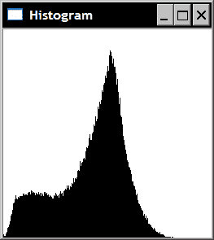
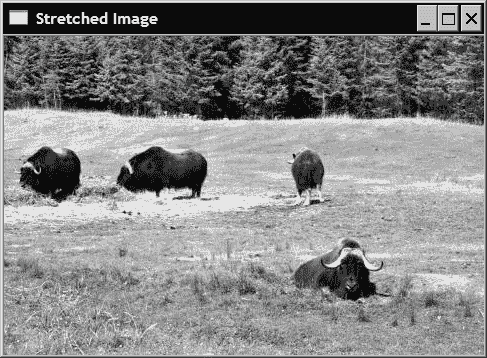
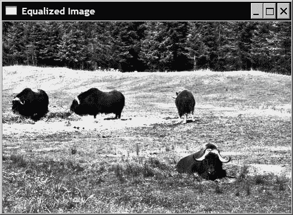
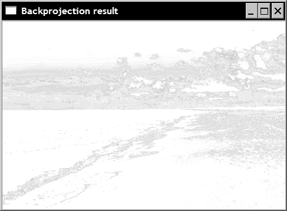
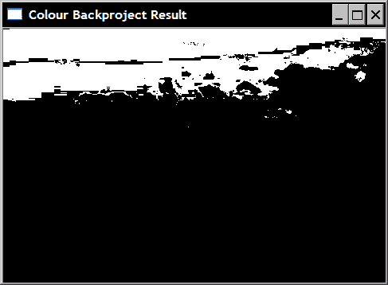
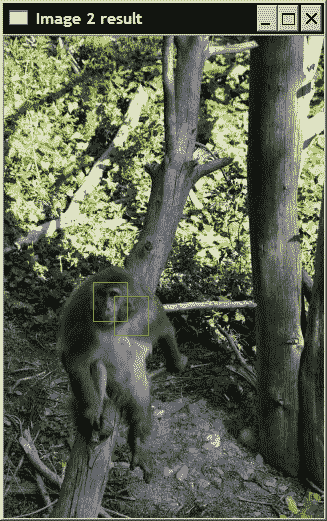
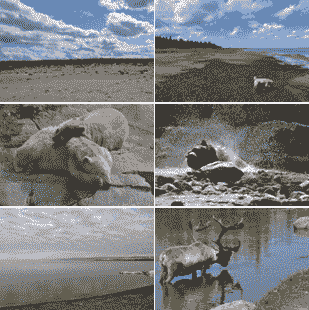

# 第 4 章。使用直方图计算像素

在本章中，我们将介绍：

*   计算图像直方图
*   应用查询表修改图像外观
*   均衡图像直方图
*   反投影直方图来检测特定图像内容
*   使用均值平移算法查找对象
*   使用直方图比较检索相似图像

# 简介

图像由具有不同值（颜色）的像素组成。 像素值在整个图像上的分布构成了此图像的重要特征。 本章介绍图像直方图的概念。 您将学习如何计算直方图以及如何使用它来修改图像的外观。 直方图还可以用于表征图像的内容并检测图像中的特定对象或纹理。 其中一些技巧将在本章中介绍。

# 计算图像直方图

图像由像素组成，每个像素具有不同的值。 例如，在 1 通道灰度图像中，每个像素的值介于 0（黑色）和 255（白色）之间。 根据图片内容，您会发现图像内部布置的每种灰色阴影的数量不同。

**直方图**是一个简单的表格，它给出了图像（或有时是一组图像）中具有给定值的像素数。 因此，灰度图像的直方图将具有 256 个条目（或**箱子**）。 箱子 0 给出值为 0 的像素数，箱子 1 给出值为 1 的像素数，依此类推。 显然，如果将直方图的所有条目相加，则应该获得像素总数。 直方图也可以归一化，以使箱子的总和等于 1。在这种情况下，每个箱子给出图像中具有该特定值的像素的百分比。

## 入门

定义一个简单的控制台项目，并准备使用如下图像：


## 操作步骤

使用`cv::calcHist`函数可以很容易地用 OpenCV 计算直方图。 这是一个通用函数，可以计算任何像素值类型的多通道图像的直方图。 通过专门针对 1 通道灰度图像的类，让它更易于使用：

```cpp
class Histogram1D {

  private:

    int histSize[1];  // number of bins
    float hranges[2]; // min and max pixel value
    const float* ranges[1];
    int channels[1];  // only 1 channel used here

  public:

   Histogram1D() {

      // Prepare arguments for 1D histogram
      histSize[0]= 256;
      hranges[0]= 0.0;
      hranges[1]= 255.0;
      ranges[0]= hranges; 
      channels[0]= 0; // by default, we look at channel 0
   }
```

使用定义的成员变量，可以使用以下方法来完成灰度直方图的计算：

```cpp
   // Computes the 1D histogram.
   cv::MatND getHistogram(const cv::Mat &image) {

      cv::MatND hist;

      // Compute histogram
 cv::calcHist(&image, 
         1,           // histogram from 1 image only
         channels,  // the channel used
         cv::Mat(), // no mask is used
         hist,        // the resulting histogram
         1,           // it is a 1D histogram
         histSize,  // number of bins
         ranges     // pixel value range
      );

      return hist;
   }
```

现在，您的程序只需要打开一个图像，创建一个`Histogram1D`实例，然后调用`getHistogram`方法：

```cpp
   // Read input image
   cv::Mat image= cv::imread("../group.jpg",
                             0); // open in b&w

   // The histogram object
   Histogram1D h;

   // Compute the histogram
 cv::MatND histo= h.getHistogram(image);

```

这里的`histo`对象是具有 256 个条目的简单一维数组。 因此，您可以通过简单地遍历此数组来读取每个箱子：

```cpp
   // Loop over each bin
   for (int i=0; i<256; i++) 
      cout << "Value " << i << " = " << 
 histo.at<float>(i) << endl; 

```

在本章开头显示的图像中，某些显示的值将显示为：

```cpp
...
Value 7 = 159
Value 8 = 208
Value 9 = 271
Value 10 = 288
Value 11 = 340
Value 12 = 418
Value 13 = 432
Value 14 = 472
Value 15 = 525
...
```

从这一系列值中提取任何直观的含义显然很困难。 因此，通常可以方便地将直方图显示为函数，例如使用条形图。 下面的方法创建这样的图：

```cpp
   // Computes the 1D histogram and returns an image of it.
   cv::Mat getHistogramImage(const cv::Mat &image){

      // Compute histogram first
      cv::MatND hist= getHistogram(image);

      // Get min and max bin values
      double maxVal=0;
      double minVal=0;
      cv::minMaxLoc(hist, &minVal, &maxVal, 0, 0);

      // Image on which to display histogram
      cv::Mat histImg(histSize[0], histSize[0], 
                      CV_8U,cv::Scalar(255));

      // set highest point at 90% of nbins
      int hpt = static_cast<int>(0.9*histSize[0]);

      // Draw a vertical line for each bin 
      for( int h = 0; h < histSize[0]; h++ ) {

         float binVal = hist.at<float>(h);
         int intensity = static_cast<int>(binVal*hpt/maxVal);

         // This function draws a line between 2 points 
         cv::line(histImg,cv::Point(h,histSize[0]),
                          cv::Point(h,histSize[0]-intensity),
                          cv::Scalar::all(0));
      }

      return histImg;
   }
```

使用此方法，您可以获得以线条绘制的条形图形式的直方图特征图像：

```cpp
   // Display a histogram as an image
   cv::namedWindow("Histogram");
   cv::imshow("Histogram",
 h.getHistogramImage(image));

```

结果如下图：



从该直方图可以看出，图像显示出中等灰度级值的大峰值和大量的较暗像素。 这两组主要分别对应于图像的背景和前景。 这可以通过在这两个组之间的过渡处对图像进行阈值化来验证。 为此可以使用方便的 OpenCV 函数，即`cv::threshold`函数 。 这是必须在图像上应用阈值以创建二进制图像时使用的函数。 在这里，我们将图像的阈值限制在直方图的高峰值（灰度值 60）增加之前的最小值：

```cpp
   cv::Mat thresholded;
   cv::threshold(image,thresholded,60,255,cv::THRESH_BINARY);
```

生成的二进制图像清楚地显示了背景/前景分割：


## 工作原理

函数`cv::calcHist`具有许多参数，可以在多种情况下使用。 大多数情况下，直方图将是单个 1 通道或 3 通道图像之一。 但是，该函数允许您指定分布在多个图像上的多通道图像。 这就是为什么要将图像数组输入此函数的原因。 第 6 个参数指定直方图的维数，例如，对于 1D 直方图为 1。 在具有指定维数的数组中列出要在直方图计算中考虑的通道。 在我们的类实现中，该单个通道默认为通道 0（第三个参数）。 直方图本身由每个维度中的仓数（第七个参数，整数数组）和每个维度中的最小值和最大值（第八个参数，2 元素数组组成的数组）描述。 也可以定义不均匀的直方图，在这种情况下，您需要指定每个箱子的限制。

对于许多 OpenCV 函数，可以指定一个掩码，指示要在计数中包括哪些像素（然后忽略掩码值为 0 的所有像素）。 可以指定两个附加的可选参数，它们都是布尔值。 第一个指示直方图是否均匀（默认为均匀）。 第二个选项使您可以累积多个直方图计算的结果。 如果最后一个参数为`true`，则图像的像素数将添加到在输入直方图中找到的当前值。 当一个人想要计算一组图像的直方图时，这很有用。

生成的直方图存储在`cv::MatND`实例中。 这是用于处理 N 维矩阵的通用类。 方便地，此类为尺寸为 1、2 和 3 的矩阵定义了`at`方法。这就是为什么我们能够这样写：

```cpp
         float binVal = hist.at<float>(h);
```

在`getHistogramImage`方法中访问 1D 直方图的每个箱子时。 注意，直方图中的值存储为`float`。

## 更多

本秘籍中介绍的类别`Histogram1D`通过将`cv::calcHist`函数限制为一维直方图来简化了函数。 这对于灰度图像很有用。 类似地，我们可以定义一个可用于计算彩色 BGR 图像直方图的类：

```cpp
class ColorHistogram {

  private:

    int histSize[3];
    float hranges[2];
    const float* ranges[3];
    int channels[3];

  public:

   ColorHistogram() {

      // Prepare arguments for a color histogram
      histSize[0]= histSize[1]= histSize[2]= 256;
      hranges[0]= 0.0;    // BRG range
      hranges[1]= 255.0;
      ranges[0]= hranges; // all channels have the same range 
      ranges[1]= hranges; 
      ranges[2]= hranges; 
      channels[0]= 0;      // the three channels 
      channels[1]= 1; 
      channels[2]= 2; 
   }
```

在这种情况下，直方图将是三维的。 因此，我们需要为三个维度中的每个维度指定一个范围。 对于 BGR 图像，这三个通道具有相同的`[0,255]`范围。 在准备好参数之后，通过以下方法计算出颜色直方图 ：

```cpp
   cv::MatND getHistogram(const cv::Mat &image) {

      cv::MatND hist;

      // Compute histogram
      cv::calcHist(&image, 
         1,            // histogram of 1 image only
         channels,   // the channel used
         cv::Mat(),   // no mask is used
         hist,         // the resulting histogram
         3,            // it is a 3D histogram
         histSize,   // number of bins
         ranges      // pixel value range
      );

      return hist;
   }
```

返回一个三维`cv::Mat`实例。 该矩阵具有`256 * 3`个元素，表示超过 1600 万个条目。 在许多应用中，最好在计算出如此大的直方图之前减少颜色的数量（请参阅第 2 章）。 或者，您也可以使用`cv::SparseMat`数据结构，该数据结构用于表示大型稀疏矩阵（即，非零元素很少的矩阵），而不会占用太多内存。 `cv::calcHist`函数具有返回一个这样的矩阵的版本。 因此，很容易修改先前的方法以使用`cv::SparseMatrix`：

```cpp
   cv::SparseMat getSparseHistogram(const cv::Mat &image) {

      cv::SparseMat hist(3,histSize,CV_32F);

      // Compute histogram
      cv::calcHist(&image, 
         1,            // histogram of 1 image only
         channels,   // the channel used
         cv::Mat(),   // no mask is used
         hist,         // the resulting histogram
         3,            // it is a 3D histogram
         histSize,   // number of bins
         ranges      // pixel value range
      );

      return hist;
   }
```

## 另见

本章稍后的秘籍“反投影直方图以检测特定的图像内容”，该方法将使用颜色直方图来检测特定的图像内容。

# 应用查询表修改图像外观

图像直方图使用可用的像素强度值捕获渲染场景的方式。 通过分析图像上像素值的分布，可以使用此信息来修改并可能改善图像。 本秘籍说明了如何使用由查找表表示的简单映射函数来修改图像的像素值。

## 操作步骤

**查找表**是简单的一对一（或多对一）函数，用于定义如何将像素值转换为新值。 对于常规灰度图像，它是一维数组，具有 256 个条目。 该表的条目`i`给出了相应灰度的新强度值，即：

```cpp
         newIntensity= lookup[oldIntensity];
```

OpenCV 中的函数`cv::LUT`将查找表应用于图像，以生成新图像。 我们可以将此函数添加到我们的`Histogram1D`类中：

```cpp
   cv::Mat applyLookUp(const cv::Mat& image, // input image
      const cv::Mat& lookup) { // 1x256 uchar matrix

      // the output image
      cv::Mat result;

      // apply lookup table
      cv::LUT(image,lookup,result);

      return result;
   }
```

## 工作原理

当将查找表应用于图像时，会生成新图像，其中像素强度值已按照查找表的规定进行了修改。 这样的简单转换如下：

```cpp
   // Create an image inversion table
   int dim(256);
   cv::Mat lut(1,  // 1 dimension
      &dim,       // 256 entries
      CV_8U);     // uchar

   for (int i=0; i<256; i++) {

      lut.at<uchar>(i)= 255-i;
   }
```

此转换仅使像素强度反转，即强度 0 变为 255，强度 1 变为 254，依此类推。 在图像上应用这样的查找表将产生原始图像的底片。 在上一个秘籍的图像上，在这里可以看到结果：


## 更多

您还可以定义一个查找表，以尝试改善图像的对比度。 例如，如果您观察到第一个秘籍中显示的上一张图像的原始直方图，则很容易注意到未使用整个范围的可能的强度值（特别是对于此图像，在图片中未使用较亮的强度值）。 因此，可以**拉伸**直方图，以产生具有扩大对比度的图像。 该程序旨在检测图像直方图中计数为非零的最低（`imin`）和最高（`imax`）强度值。 然后可以重新映射强度值，以使`imin`值重新定位为强度 0，并且为`imax`赋值 255。强度`i`之间的线性映射简单如下：

```cpp
255.0*(i-imin)/(imax-imin)+0.5);
```

因此，完整图像拉伸方法将如下所示：

```cpp
   cv::Mat stretch(const cv::Mat &image, int minValue=0) {

      // Compute histogram first
      cv::MatND hist= getHistogram(image);

      // find left extremity of the histogram
      int imin= 0;
      for( ; imin < histSize[0]; imin++ ) {
         std::cout<<hist.at<float>(imin)<<std::endl;
         if (hist.at<float>(imin) > minValue)
            break;
      }

      // find right extremity of the histogram
      int imax= histSize[0]-1;
      for( ; imax >= 0; imax-- ) {

         if (hist.at<float>(imax) > minValue)
            break;
      }

      // Create lookup table
      int dim(256);
      cv::Mat lookup(1,  // 1 dimension
            &dim,       // 256 entries
            CV_8U);     // uchar

      // Build lookup table
      for (int i=0; i<256; i++) {

         // stretch between imin and imax
         if (i < imin) lookup.at<uchar>(i)= 0;
         else if (i > imax) lookup.at<uchar>(i)= 255;
         // linear mapping
         else lookup.at<uchar>(i)= static_cast<uchar>(
                        255.0*(i-imin)/(imax-imin)+0.5);
      }

      // Apply lookup table
      cv::Mat result;
 result= applyLookUp(image,lookup);

      return result;
   }
```

一旦计算出该方法，请注意对我们的`applyLookUp`方法的调用。 同样，在实践中，不仅忽略具有 0 值的箱子，而且忽略计数。 例如，小于给定值（在此定义为`minValue`）的条目也可能是有利的。 该方法称为：

```cpp
// ignore starting and ending bins with less than 100 pixels   
cv::Mat streteched= h.stretch(image,100);
```

然后在这里看到生成的图像：



如以下屏幕快照所示，具有以下扩展的直方图：


## 另见

“均衡图像直方图”秘籍为您提供了另一种改善图像对比度的方法。

# 均衡图像直方图

在先前的秘籍中，我们展示了如何通过拉伸直方图来改善图像的对比度，使其直达所有可用强度值范围。 这种策略确实构成了可以有效改善图像的简单解决方案。 但是，在许多情况下，图像的视觉缺陷并不是其使用的强度范围太窄。 而是某些强度值比其他强度值使用得更频繁。 本章第一章中显示的直方图就是这种现象的一个很好的例子。 确实可以很好地表现出中灰色强度，而较暗和较亮的像素值却很少。 实际上，人们可以认为，高质量的图像应该平等地利用所有可用的像素强度。 这是**直方图均衡**概念的思想，即使图像直方图尽可能平坦。

## 操作步骤

OpenCV 提供了易于使用的函数，可以执行直方图均衡化。 可以这样调用：

```cpp
   cv::Mat equalize(const cv::Mat &image) {

      cv::Mat result;
 cv::equalizeHist(image,result);

      return result;
   }
```

将以下屏幕截图应用于我们的图像：



该图像具有以下直方图：


当然，直方图不能完全平坦，因为查询表是全局的多对一转换。 但是，可以看出，直方图的总体分布现在比原始分布更均匀。

## 工作原理

在完全一致的直方图中，所有面元都有相同数量的像素。 这意味着 50% 的像素强度低于 128，25% 的像素强度低于 64，依此类推。 可以使用以下规则来表达该观察结果：在均匀的直方图中，像素的`p%`的强度值必须小于或等于`255 * p%`。 这是用于均衡直方图的规则：强度`i`的映射应处于与强度值低于`i`的像素百分比相对应的强度。 因此，可以根据以下公式构建所需的查询表：

```cpp
lookup.at<uchar>(i)= static_cast<uchar>(255.0*p[i]);
```

其中`p[i]`是强度低于或等于`i`的像素数。 函数`p[i]`通常称为**累积直方图**，即它是一个直方图，其中包含小于或等于给定强度的像素数，而不包含具有特定强度值的像素。

通常，直方图均衡化可以大大改善图像的外观。 但是，视视觉内容而定，结果的质量可能因图像而异。

# 反投影直方图来检测特定图像内容

直方图是图像内容的重要特征。 如果查看显示特定纹理或特定对象的图像区域，则该区域的直方图可以看作是一个函数，给出给定像素属于该特定纹理或对象的概率。 在本秘籍中，您将学习如何将图像直方图有利地用于检测特定图像内容。

## 操作步骤

假设您有一张图片，并且希望检测其中的特定内容（例如，在下面的屏幕快照中，是天空中的云彩）。 首先要做的是选择一个兴趣区域，其中包含您要寻找的样本。 此区域是在以下测试屏幕截图上绘制的矩形内的区域：


在我们的程序中，兴趣区域的获取如下：

```cpp
   cv::Mat imageROI;
   imageROI= image(cv::Rect(360,55,40,50)); // Cloud region
```

然后，您提取此 ROI 的直方图。 使用本章第一部分中定义的`Histogram1D`类可以轻松完成此操作：

```cpp
   Histogram1D h;
   cv::MatND hist= h.getHistogram(imageROI);
```

通过对该直方图进行归一化，我们获得一个函数，该函数给出给定强度值的像素属于定义区域的概率：

```cpp
   cv::normalize(histogram,histogram,1.0);
```

对直方图进行反投影包括将输入图像中的每个像素值替换为在归一化的直方图中读取的相应像素值。

```cpp
cv::calcBackProject(&image,
      1,            // one image
      channels,     // the channels used
      histogram,    // the histogram we are backprojecting
      result,       // the resulting back projection image
      ranges,       // the range of values, for each dimension
      255.0         // a scaling factor
);
```

结果是以下概率图，具有从亮（低概率）到暗（高概率）的参考区域概率：



如果在此图像上应用阈值，我们将获得最可能的“云”像素：

```cpp
cv::threshold(result, result, 255*threshold, 
                      255, cv::THRESH_BINARY);
```


## 工作原理

前面的结果可能令人失望，因为除了云之外，还错误地检测了其他区域。 重要的是要了解，概率函数是从简单的灰度直方图中提取的。 图像中的许多其他像素与云像素共享相同的强度，并且在反投影直方图时，相同强度的像素将被相同的概率值替换。 改善检测结果的一种解决方案是使用颜色信息。 但是为此，我们需要修改对`cv::calBackProject`的调用。

函数`cv::calBackProject`与`cv::calcHist`函数相似。 第一个参数指定输入图像。 然后，您需要列出要使用的通道号。 这次传递给函数的直方图是一个输入参数。 应该对其进行规范化，并且其尺寸应与通道列表数组之一以及`ranges`参数之一匹配。 如`cv::calcHist`中所述，这是一个`float`数组，每个`float`数组指定每个通道的范围（最小和最大值）。 结果输出是图像，即计算的概率图。 由于每个像素都被在对应的箱子位置处的直方图中找到的值替换，因此所得图像的值介于 0.0 和 1.0 之间（假定已提供标准化的直方图作为输入）。 最后一个参数允许您选择将这些值乘以给定因子来重新缩放这些值。

## 更多

现在让我们看看如何在直方图反投影算法中使用颜色信息。 我们首先定义一个封装反向投影过程的类。 首先，我们定义所需的属性并初始化数据：

```cpp
class ContentFinder {

  private:

   float hranges[2];
   const float* ranges[3];
   int channels[3];

   float threshold;
   cv::MatND histogram;

  public:

   ContentFinder() : threshold(-1.0f) {

      ranges[0]= hranges; // all channels have same range 
      ranges[1]= hranges; 
      ranges[2]= hranges; 
   }
```

接下来，我们定义一个阈值参数，该参数将用于创建显示检测结果的二进制图。 如果此参数设置为负值，则将返回原始概率图：

```cpp
   // Sets the threshold on histogram values [0,1]
   void setThreshold(float t) {

      threshold= t;
   }

   // Gets the threshold
   float getThreshold() {

      return threshold;
   }
```

输入直方图必须归一化：

```cpp
   // Sets the reference histogram
   void setHistogram(const cv::MatND& h) {

      histogram= h;
      cv::normalize(histogram,histogram,1.0);
   }
```

要对直方图进行背投，您只需指定图像，范围（此处假设所有通道都具有相同的范围）以及使用的通道列表：

```cpp
   cv::Mat find(const cv::Mat& image, 
                float minValue, float maxValue, 
                int *channels, int dim) {

      cv::Mat result;

      hranges[0]= minValue;
      hranges[1]= maxValue;

      for (int i=0; i<dim; i++)
         this->channels[i]= channels[i];

       cv::calcBackProject(&image, 1, // input image
             channels,       // list of channels used
             histogram,    // the histogram we are using
             result,       // the resulting backprojection
             ranges,       // the range of values
             255.0         // the scaling factor
       );
      }

      // Threshold back projection to obtain a binary image
      if (threshold>0.0)
           cv::threshold(result, result, 
                   255*threshold, 255, cv::THRESH_BINARY);

      return result;
   }
```

现在让我们在上面使用的图像的彩色版本上使用 BGR 直方图。 这次，我们将尝试检测蓝天区域。 我们将首先加载彩色图像，使用第 2 章的色彩缩减函数减少颜色数量，然后定义关注区域：

```cpp
   ColorHistogram hc;
   // load color image
   cv::Mat color= cv::imread("../waves.jpg");
   // reduce colors
   color= hc.colorReduce(color,32);
   // blue sky area
   cv::Mat imageROI= color(cv::Rect(0,0,165,75)); 
```

接下来，您计算直方图并使用`find`方法检测图像的天空部分：

```cpp
   cv::MatND hist= hc.getHistogram(imageROI);

   ContentFinder finder;
   finder.setHistogram(hist);
   finder.setThreshold(0.05f);

   // Get back-projection of color histogram
   Cv::Mat result= finder.find(color);
```

上一部分的图像彩色版本的检测结果在此处显示：



## 另见

下一个秘籍将使用 HSV 颜色空间来检测图像中的对象。 这是可用于检测某些图像内容的许多替代解决方案中的另一个。

# 使用均值移动算法查找对象

直方图反投影的结果是一个概率图，该概率图表示在特定图像位置找到给定图像内容的概率。 假设我们现在知道图像中某个对象的大概位置，则可以使用概率图找到该对象的确切位置。 最有可能的是在给定窗口内最大化此概率的那个。 因此，如果我们从一个初始位置开始并反复移动，那么应该可以找到确切的对象位置。 这是通过均值平移算法完成的。

## 操作步骤

假设我们已经确定了一个感兴趣的对象，这里是狒狒的脸，如下面的彩色屏幕截图所示（请参见本书的网站以查看此彩色图片）：


这次，我们将通过使用 HSV 颜色空间的色相通道来描述此对象。 这意味着我们需要将图像转换为 HSV 图像，然后提取色调通道并计算已定义 ROI 的 1D 色调直方图：

```cpp
   // Read reference image
   cv::Mat image= cv::imread("../baboon1.jpg");
   // Baboon's face ROI
   cv::Mat imageROI= image(cv::Rect(110,260,35,40));
   // Get the Hue histogram
   int minSat=65;
   ColorHistogram hc;
   cv::MatND colorhist= 
            hc.getHueHistogram(imageROI,minSat);
```

可以看出，色调直方图是使用我们添加到`ColorHistogram`类中的便捷方法获得的：

```cpp
   // Computes the 1D Hue histogram with a mask.
   // BGR source image is converted to HSV
   // Pixels with low saturation are ignored
   cv::MatND getHueHistogram(const cv::Mat &image, 
                             int minSaturation=0) {

      cv::MatND hist;

      // Convert to HSV color space
      cv::Mat hsv;
      cv::cvtColor(image, hsv, CV_BGR2HSV);

      // Mask to be used (or not)
      cv::Mat mask;

      if (minSaturation>0) {

         // Spliting the 3 channels into 3 images
         std::vector<cv::Mat> v;
         cv::split(hsv,v);

         // Mask out the low saturated pixels
         cv::threshold(v[1],mask,minSaturation,255,
                                 cv::THRESH_BINARY);
      }

      // Prepare arguments for a 1D hue histogram
      hranges[0]= 0.0;
      hranges[1]= 180.0;
      channels[0]= 0; // the hue channel 

      // Compute histogram
      cv::calcHist(&hsv, 
         1,          // histogram of 1 image only
         channels,   // the channel used
         mask,       // binary mask
         hist,       // the resulting histogram
         1,          // it is a 1D histogram
         histSize,   // number of bins
         ranges      // pixel value range
      );

      return hist;
   }
```

然后将生成的直方图输入到我们的`ContentFinder`类实例中：

```cpp
   ContentFinder finder;
   finder.setHistogram(colorhist);
```

现在让我们打开第二个图像，我们要在其中定位新狒狒的脸部位置。 该图像需要转换为 HSV 空间：

```cpp
   image= cv::imread("../baboon3.jpg");

   // Display image
   cv::namedWindow("Image 2");
   cv::imshow("Image 2",image);

   // Convert to HSV space
   cv::cvtColor(image, hsv, CV_BGR2HSV);

   // Split the image
   cv::split(hsv,v);

   // Identify pixels with low saturation
   cv::threshold(v[1],v[1],minSat,255,cv::THRESH_BINARY);
```

接下来，让我们使用先前获得的直方图获得该图像的色相通道的反投影：

```cpp
   // Get back-projection of hue histogram
   result= finder.find(hsv,0.0f,180.0f,ch,1);
   // Eliminate low stauration pixels
   cv::bitwise_and(result,v[1],result);
```

现在，从初始矩形区域（即原始图像中狒狒脸的位置）开始，OpenCV 的`cv::meanShift`算法将在新的狒狒脸部位置更新`rect`对象：

```cpp
   cv::Rect rect(110,260,35,40);
   cv::rectangle(image, rect, cv::Scalar(0,0,255));

   cv::TermCriteria criteria(cv::TermCriteria::MAX_ITER,
                             10,0.01);
   cv::meanShift(result,rect,criteria);
```

初始和新面部位置显示在以下屏幕截图中：



## 工作原理

在此示例中，我们使用了 HSV 颜色空间的色相成分来表征我们要寻找的对象。 因此，必须先转换图像。 当使用`CV_BGR2HSV`标志时，色相分量是所得图像的第一通道。 这是一个 8 位分量，其中色相从 0 到 180 变化（使用`cv::cvtColor`时，转换后的图像与源图像的类型相同）。 为了提取色调图像，使用`cv::split`函数将 3 通道 HSV 图像分为三个 1 通道图像。 将这三个图像放入`std::vector`实例，并且色调图像是向量的第一项（即索引 0）。

使用颜色的色相分量时，考虑其饱和度（这是向量的第二项）总是很重要的。 实际上，当颜色的饱和度低时，色相信息变得不稳定且不可靠。 这是由于以下事实：对于低饱和色，B，G 和 R 分量几乎相等。 这使得很难确定所代表的确切颜色。 因此，我们决定忽略具有低饱和度的颜色的色相成分。 也就是说，它们不计入直方图中（使用方法`getHueHistogram`使用参数`minSat`掩盖饱和度低于此阈值的像素），并且将它们从反投影结果中消除（使用`cv::bitwise_and`运算符，可在调用`cv::meanShift`之前消除所有具有低饱和度颜色的正检测像素。

均值平移算法是定位概率函数的局部最大值的迭代过程。 它通过找到预定义窗口内数据点的质心或加权均值来实现。 然后，算法将窗口中心移动到质心位置，并重复此过程，直到窗口中心收敛到稳定点为止。 OpenCV 实现定义了两个停止条件：最大迭代次数和窗口中心位移值，在该值以下，位置被认为已收敛到稳定点。 这两个条件存储在`cv::TermCriteria`实例中。 `cv::meanShift`函数返回执行的迭代次数。 显然，结果的质量取决于所提供的概率图的质量以及给定的初始位置。

## 另见

均值漂移算法已广泛用于视觉跟踪。 第 10 章将更详细地探讨对象跟踪问题。

OpenCV 还提供了 CamShift 算法的实现，该算法是均值偏移的改进版本，其中窗口的大小和方向可以更改。

# 使用直方图比较检索相似的图像

基于内容的图像检索是计算机视觉中的重要问题。 它包括查找一组呈现类似于给定查询图像的内容的图像。 由于我们已经知道直方图是表征图像内容的有效方法，因此有理由认为直方图可用于解决基于内容的检索问题。

这里的关键是能够通过简单地比较两个图像的直方图来测量两个图像之间的相似度。 需要定义一个测量函数，该函数将估计两个直方图之间的差异或相似程度。 过去已经提出了各种这样的措施，并且 OpenCV 在`cv::compareHist`函数的实现中提出了很少的措施。

## 操作步骤

为了将参考图像与图像集合进行比较并找到与该查询图像最相似的图像，我们创建了`ImageComparator`类。 这包含对查询图像和输入图像的引用，以及它们的直方图（`cv::MatND`实例）。 另外，由于我们将使用颜色直方图进行比较，因此使用了`ColorHistogram`类：

```cpp
class ImageComparator {

  private:

   cv::Mat reference;
   cv::Mat input;
   cv::MatND refH;
   cv::MatND inputH;

   ColorHistogram hist;
   int div;

  public:

   ImageComparator() : div(32) {

   }
```

为了获得可靠的相似性度量，必须减少颜色数量。 因此，该类包括一个颜色减少因子，该因子将应用于查询和输入图像：

```cpp
   // Color reduction factor
   // The comparison will be made on images with
   // color space reduced by this factor in each dimension
   void setColorReduction( int factor) {

      div= factor;
   }

   int getColorReduction() {

      return div;
   }
```

使用适当的设置器指定查询图像，该设置器还对图像进行颜色还原：

```cpp
   void setReferenceImage(const cv::Mat& image) {

      reference= hist.colorReduce(image,div);
      refH= hist.getHistogram(reference);
   }
```

最后，`compare`方法将参考图像与给定的输入图像进行比较。 该方法返回一个分数，指示两个图像的相似程度。

```cpp
   double compare(const cv::Mat& image) {

      input= hist.colorReduce(image,div);
      inputH= hist.getHistogram(input);

      return cv::compareHist(
                     refH,inputH,CV_COMP_INTERSECT);
   }
};
```

此类可用于检索类似于给定查询图像的图像。 后者最初提供给类实例：

```cpp
   ImageComparator c;
   c.setReferenceImage(image);
```

在这里，我们使用的查询图像是本章前面的秘籍“将直方图反投影来检测特定图像内容”中显示的海滩图像的彩色版本。 将该图像与以下所示的一系列图像进行了比较。 图像从最相似到最小显示：



## 工作原理

大多数直方图比较措施都基于逐个箱比较，即在比较直方图的箱时不使用相邻箱。 因此，重要的是在测量两个颜色直方图的相似度之前减小颜色空间。 也可以使用其他色彩空间。

对`cv::compareHist`的调用非常简单。 您只需输入两个直方图，函数就会返回测得的距离。 使用标志指定要使用的特定测量方法。 在`ImageComparator`类中，使用相交方法（带有标志`CV_COMP_INTERSECT`）。 此方法仅针对每个箱子比较每个直方图中的两个值，并保持最小值。 那么，相似性度量只是这些最小值的总和。 因此，具有没有共同颜色的直方图的两个图像的相交值将为 0，而两个相同直方图的值将等于像素总数。

其他可用的方法是：对方块之间的归一化平方差求和的卡方（标志`CV_COMP_CHISQR`），基于信号中使用的归一化互相关运算符的相关方法（标志`CV_COMP_CORREL`） 处理以测量两个信号之间的相似性，以及统计中使用的 Bhattacharyya 度量（标志`CV_COMP_BHATTACHARYYA`）来估计两个概率分布之间的相似性。

## 另见

OpenCV 文档描述了不同直方图比较度量中使用的确切公式。

地球移动距离，这也是另一种流行的直方图比较方法。 此方法的主要优点是，它考虑了在相邻箱中找到的值来评估两个直方图的相似性。 在 Y.i Rubner，C. Tomasi，L. 发表的文章《地球移动者的距离作为图像检索的度量》中进行了描述。