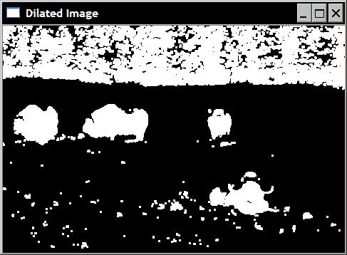
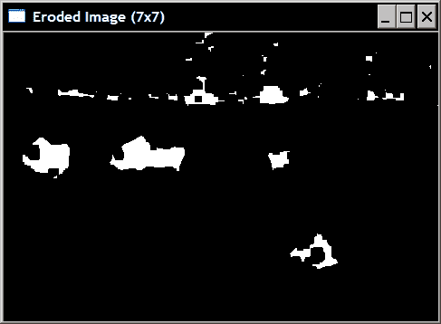
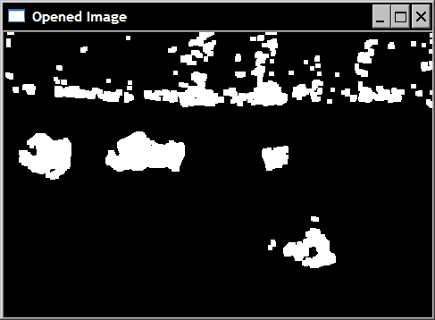
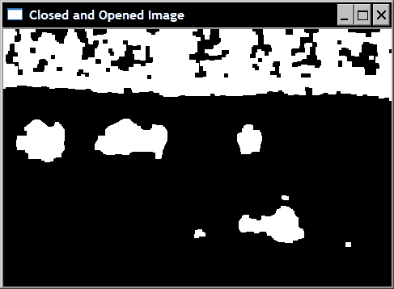
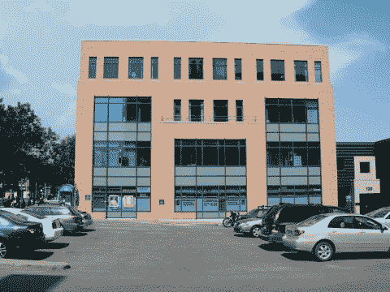
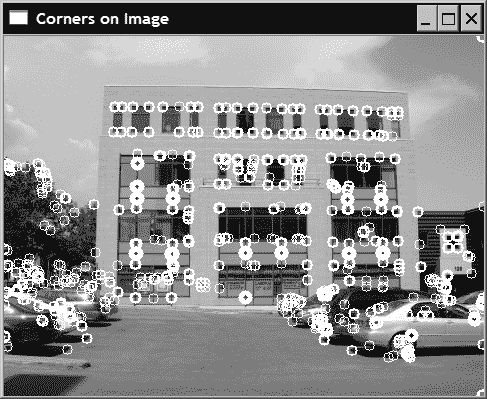
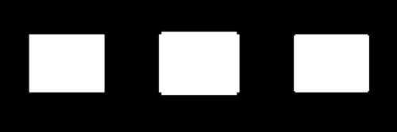
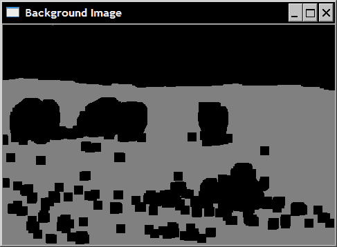
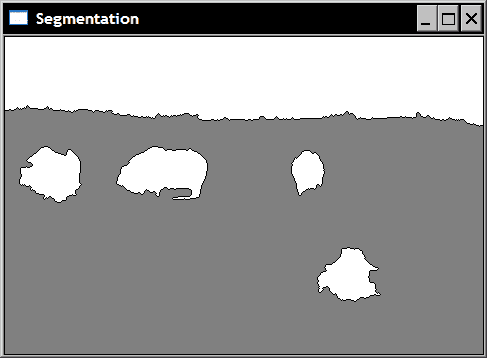
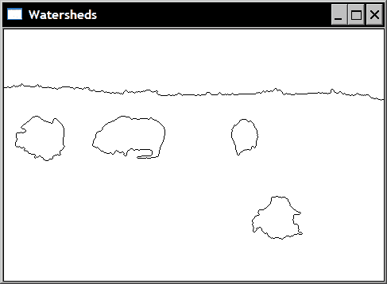

# 第 5 章。通过形态学运算转换图像

在本章中，我们将介绍：

*   使用形态学过滤器腐蚀和扩张图像
*   使用形态过滤器打开和关闭图像
*   使用形态过滤器检测边缘和角落
*   使用分水岭分割图像
*   用 GrabCut 算法提取前景对象

# 简介

形态滤波是 1960 年代开发的一种用于分析和处理离散图像的理论。 它定义了一系列运算符，这些运算符通过使用预定义的形状元素探测图像来变换图像。 该形状元素与像素邻域相交的方式决定了运算结果。 本章介绍最重要的形态算子。 它还探讨了使用处理图像形态的算法进行图像分割的问题。

# 使用形态过滤器腐蚀和扩张图像

侵蚀和膨胀是最基本的形态学操纵子。 因此，我们将在第一个食谱中介绍它们。

数学形态学的基本工具是**结构元素** 。 简单地将结构元素定义为在其上定义了原点的像素（形状）的配置（也称为 **定位点**）。 应用形态学过滤器包括使用此结构元素探测图像的每个像素。 当结构元素的原点与给定像素对齐时，其与图像的交点定义了一组像素，在这些像素上应用了特定的形态学运算。 原则上，结构元素可以是任何形状，但是最常见的是，使用简单的形状，例如以原点为中心的正方形，圆形或菱形（主要是出于效率方面的考虑）。

## 准备

由于形态过滤器通常适用于二进制图像，因此我们将使用在上一章的第一个配方中通过阈值处理生成的二进制图像。 但是，由于在形态学上，惯例是使前景对象由高（白色）像素值表示，而背景由低（黑色）像素值表示，因此我们对图像进行了否定。 用形态学术语来说，以下图像是上一章中产生的图像的**补充**：


## 怎么做...

侵蚀和膨胀在 OpenCV 中作为 `cv::erode`和`cv::dilate`的简单函数实现。 它们的用法很简单：

```cpp
   // Read input image
   cv::Mat image= cv::imread("binary.bmp");

   // Erode the image
   cv::Mat eroded;  // the destination image
   cv::erode(image,eroded,cv::Mat());

   // Display the eroded image
   cv::namedWindow("Eroded Image");");
   cv::imshow("Eroded Image",eroded);

   // Dilate the image
   cv::Mat dilated;  // the destination image
   cv::dilate(image,dilated,cv::Mat());

   // Display the dilated image
   cv::namedWindow("Dilated Image");
   cv::imshow("Dilated Image",dilated);
```

在下面的屏幕快照中可以看到这些函数调用产生的两个图像。 首先显示侵蚀：


其次是膨胀结果：



## 工作原理...

与所有其他形态滤镜一样，此配方的两个滤镜在每个像素周围的一组像素（或邻域）上运行，这由结构元素定义。 回想一下，当应用于给定像素时，结构化元素的锚点与此像素位置对齐，并且与结构化元素相交的所有像素都包含在当前集中。 **侵蚀**用定义的像素集中找到的最小像素值替换当前像素。 **膨胀** 是互补运算符，它用定义的像素集中找到的最大像素值替换当前像素。 由于输入的二进制图像仅包含黑色（0）和白色（255）像素，因此每个像素都由白色或黑色像素替换。

描绘这两个算子效果的一个好方法是根据背景（黑色）和前景（白色）对象进行思考。 对于腐蚀，如果结构化元素放置在给定像素位置时接触背景（即，相交集中的像素之一是黑色），则该像素将被发送到背景。 在散布的情况下，如果背景像素上的结构元素触摸前景对象，则将为该像素分配白色值。 这解释了为什么在侵蚀的图像中物体的尺寸减小了。 观察一些非常小的物体（可以视为“嘈杂的”背景像素）是如何被完全消除的。 类似地，膨胀的对象现在更大，并且其中的一些“孔”已被填充。

默认情况下，OpenCV 使用 3x3 正方形结构元素。 当在函数调用中将空矩阵（ `cv::Mat()`）指定为第三个参数时，将获得该默认结构元素，就像在上一个示例中所做的那样。 您还可以通过提供一个矩阵（其中非零元素定义结构元素）来指定所需大小（和形状）的结构元素。 在以下示例中，将应用 7x7 结构元素：

```cpp
    cv::Mat element(7,7,CV_8U,cv::Scalar(1));
   cv::erode(image,eroded,element);
```

在这种情况下，效果显然更具破坏性，如下所示：



获得相同结果的另一种方法是在图像上重复应用相同的结构元素。 这两个函数有一个可选参数来指定重复次数：

```cpp
   // Erode the image 3 times.
   cv::erode(image,eroded,cv::Mat(),cv::Point(-1,-1),3);
```

原点参数 `cv::Point(-1,-1)`表示原点位于矩阵的中心（默认值），可以在结构元素上的任何位置进行定义。 获得的图像将与我们使用 7x7 结构元素获得的图像相同。 确实，对图像进行两次腐蚀就好比对具有自身膨胀结构元素的图像进行腐蚀。 这也适用于扩张。

最后，由于背景/前景的概念是任意的，因此我们可以进行以下观察（这是侵蚀/膨胀算子的基本属性）。 用结构元素腐蚀前景对象可以看作是图像背景部分的扩张。 或更正式地：

*   图像的侵蚀等同于补充图像的扩张的补充。
*   图像的扩张等效于补充图像侵蚀的补充。

## 还有更多...

重要的是要注意，即使我们在这里对二进制图像应用了形态过滤器，也可以将它们应用于具有相同定义的灰度图像。

另请注意，OpenCV 形态功能支持就地处理。 这意味着您可以将输入图像用作目标图像。 所以你可以这样写：

```cpp
   cv::erode(image,image,cv::Mat());
```

OpenCV 为您创建所需的临时映像，以使其正常工作。

## 另请参见

下一个配方将级联应用腐蚀和膨胀过滤器以产生新的算子。

*使用形态学滤镜*检测边缘和角落，以将形态学滤镜应用到灰度图像上。

# 使用形态过滤器打开和关闭图像

先前的配方介绍了两个基本的形态运算符：膨胀和侵蚀。 由此，可以定义其他运算符。 接下来的两个食谱将介绍其中的一些。 此配方中介绍了打开和关闭运算符。

## 怎么做...

为了应用高级形态过滤器，需要将 `cv::morphologyEx`函数与相应的功能代码一起使用。 例如，以下调用将应用结束运算符：

```cpp
   cv::Mat element5(5,5,CV_8U,cv::Scalar(1));
   cv::Mat closed;
   cv::morphologyEx(image,closed,cv::MORPH_CLOSE,element5);
```

请注意，这里我们使用 5x5 的结构元素使滤镜的效果更加明显。 如果输入前面配方的二进制图像，则可获得：


同样，应用形态学打开算子将得到以下图像：



这是从以下代码获得的：

```cpp
   cv::Mat opened;
   cv::morphologyEx(image,opened,cv::MORPH_OPEN,element5);
```

## 工作原理...

打开和关闭过滤器仅根据基本腐蚀和膨胀操作进行定义：

*   **闭合**被定义为图像扩张的侵蚀。
*   **开口**被定义为图像腐蚀的扩张。

因此，可以使用以下调用来计算图像的关闭：

```cpp
   // dilate original image
   cv::dilate(image,result,cv::Mat()); 
   // in-place erosion of the dilated image
   cv::erode(result,result,cv::Mat()); 
```

通过反转这两个函数调用可以获得打开。

在检查关闭过滤器的结果时，可以看到白色前景对象的小孔已被填充。 过滤器还将几个相邻的对象连接在一起。 基本上，任何太小而不能完全容纳结构元素的孔或间隙都将被过滤器消除。

相反，打开过滤器消除了场景中的一些小物体。 所有太小而无法包含结构元素的元素均已删除。

这些过滤器通常用于物体检测。 关闭过滤器将错误地分成较小碎片的对象连接在一起，而打开过滤器则消除了由图像噪声引入的小斑点。 因此，顺序使用它们是有利的。 如果我们的测试二进制图像是连续关闭和打开的，则将获得仅显示场景中主要对象的图像，如下所示。 如果希望优先进行噪声过滤，也可以在关闭之前应用打开过滤器，但这会以消除一些碎片对象为代价。



应该注意的是，对图像多次应用相同的打开（和类似的关闭）操作符没有任何效果。 实际上，在孔被第一开口填充的情况下，对该相同滤镜的附加应用将不会对图像产生任何其他变化。 用数学术语来说，这些算子被认为是幂等的。

# 使用形态过滤器检测边缘和角

形态过滤器也可以用于检测图像中的特定特征。 在本食谱中，我们将学习如何检测灰度图像中的线和角。

## 入门

在此配方中，将使用以下图像：



## 怎么做...

让我们定义一个名为`MorphoFeatures` 的类，它将使我们能够检测图像特征：

```cpp
class MorphoFeatures {

  private:

     // threshold to produce binary image
     int threshold;
     // structuring elements used in corner detection
     cv::Mat cross;
     cv::Mat diamond;
     cv::Mat square;
     cv::Mat x;
```

使用 `cv::morphologyEx`功能的适当过滤器，检测线路非常容易：

```cpp
cv::Mat getEdges(const cv::Mat &image) {

   // Get the gradient image
   cv::Mat result;
   cv::morphologyEx(image,result,
                         cv::MORPH_GRADIENT,cv::Mat());

   // Apply threshold to obtain a binary image
   applyThreshold(result);

   return result;
}
```

二进制边缘图像是通过该类的简单私有方法获得的：

```cpp
void applyThreshold(cv::Mat& result) {

   // Apply threshold on result
   if (threshold>0)
      cv::threshold(result, result, 
                    threshold, 255, cv::THRESH_BINARY);
}
```

然后在主要函数中使用此类，然后按以下方式获取边缘图像：

```cpp
// Create the morphological features instance
MorphoFeatures morpho;
morpho.setThreshold(40);

// Get the edges
cv::Mat edges;
edges= morpho.getEdges(image); 
```

结果如下图：


使用形态学拐角检测拐角有点复杂，因为它不是直接在 OpenCV 中实现的。 这是使用非正方形结构元素的一个很好的例子。 实际上，它需要定义四个不同的结构元素，形状分别为正方形，菱形，十字形和 X 形。 这是在构造函数中完成的（为简单起见，所有这些结构化元素都具有固定的 5x5 尺寸）：

```cpp
MorphoFeatures() : threshold(-1), 
        cross(5,5,CV_8U,cv::Scalar(0)),
            diamond(5,5,CV_8U,cv::Scalar(1)), 
        square(5,5,CV_8U,cv::Scalar(1)),
        x(5,5,CV_8U,cv::Scalar(0)){

   // Creating the cross-shaped structuring element
   for (int i=0; i<5; i++) {

      cross.at<uchar>(2,i)= 1;
      cross.at<uchar>(i,2)= 1;                           
   }

   // Creating the diamond-shaped structuring element
   diamond.at<uchar>(0,0)= 0;
   diamond.at<uchar>(0,1)= 0;
   diamond.at<uchar>(1,0)= 0;
   diamond.at<uchar>(4,4)= 0;
   diamond.at<uchar>(3,4)= 0;
   diamond.at<uchar>(4,3)= 0;
   diamond.at<uchar>(4,0)= 0;
   diamond.at<uchar>(4,1)= 0;
   diamond.at<uchar>(3,0)= 0;
   diamond.at<uchar>(0,4)= 0;
   diamond.at<uchar>(0,3)= 0;
   diamond.at<uchar>(1,4)= 0;

   // Creating the x-shaped structuring element
   for (int i=0; i<5; i++) {

     x.at<uchar>(i,i)= 1;
     x.at<uchar>(4-i,i)= 1;                           
   }     
}
```

在检测拐角特征时，所有这些结构元素都会级联应用以获得最终的拐角贴图：

```cpp
cv::Mat getCorners(const cv::Mat &image) {

   cv::Mat result;

   // Dilate with a cross   
   cv::dilate(image,result,cross);

   // Erode with a diamond
   cv::erode(result,result,diamond);

   cv::Mat result2;
   // Dilate with a X   
   cv::dilate(image,result2,x);

   // Erode with a square
   cv::erode(result2,result2,square);

   // Corners are obtained by differencing
   // the two closed images
   cv::absdiff(result2,result,result);

   // Apply threshold to obtain a binary image
   applyThreshold(result);

   return result;
}
```

为了更好地可视化检测结果，以下方法在二进制图上每个检测到的点上在图像上绘制一个圆：

```cpp
void drawOnImage(const cv::Mat& binary, 
                   cv::Mat& image) {

   cv::Mat_<uchar>::const_iterator it= 
                        binary.begin<uchar>();
   cv::Mat_<uchar>::const_iterator itend= 
                        binary.end<uchar>();

   // for each pixel   
   for (int i=0; it!= itend; ++it,++i) {
      if (!*it)          
         cv::circle(image,
           cv::Point(i%image.step,i/image.step),
           5,cv::Scalar(255,0,0));
   }
}
```

然后，使用以下代码在图像上检测角点：

```cpp
// Get the corners
cv::Mat corners;
corners= morpho.getCorners(image);

// Display the corner on the image
morpho.drawOnImage(corners,image);
cv::namedWindow("Corners on Image");
cv::imshow("Corners on Image",image);
```

然后，检测到的角的图像如下。



## 工作原理...

帮助理解形态算子对灰度图像的影响的一种好方法是将图像视为拓扑浮雕，其中灰度对应于海拔（或海拔）。 在这种情况下，明亮的区域对应于山脉，而较暗的区域则构成地形的山谷。 同样，由于边缘对应于较暗像素和较亮像素之间的快速过渡，因此可以将其描绘为陡峭的悬崖。 如果在这样的地形上应用腐蚀算子，最终结果将是用某个邻域中的最小值替换每个像素，从而减小其高度。 结果，随着山谷的扩大，悬崖将被“侵蚀”。 扩张具有完全相反的效果，即悬崖将在山谷上空获得地形。 但是，在两种情况下，平稳度（即恒定强度的区域）将保持相对不变。

上述观察结果导致了一种检测图像边缘（或悬崖）的简单方法。 这可以通过计算膨胀图像和侵蚀图像之间的差异来完成。 由于这两个变换后的图像大部分在边缘位置不同，因此差异会突出图像的边缘。 输入`cv::MORPH_GRADIENT`自变量时，这正是 `cv::morphologyEx`函数所做的事情。 显然，结构元素越大，检测到的边缘将越厚。 该边缘检测算子也称为 **Beucher** 梯度（下一章将更详细地讨论图像梯度的概念）。 注意，也可以通过简单地从扩张后的图像中减去原始图像或从原始图像中减去侵蚀图像来获得类似的结果。 产生的边缘将更薄。

角点检测要复杂一些，因为它使用了四个不同的结构元素。 该运算符未在 OpenCV 中实现，但我们在这里展示它是为了演示如何定义和组合各种形状的结构化元素。 这个想法是通过使用两个不同的结构元素对图像进行扩张和腐蚀来封闭图像。 选择这些元素以使它们的直边保持不变，但是由于它们各自的作用，将影响拐角点的边缘。 让我们使用由单个白色正方形组成的以下简单图像更好地了解此非对称关闭操作的效果：



第一个正方形是原始图像。 当用十字形结构元素进行扩张时，方形边缘会扩大，除了在十字形不会碰到方形的拐角点处。 这是中间的方块说明的结果。 然后，这个扩张的图像被结构元素侵蚀，这次，该元素具有菱形形状。 这种侵蚀使大多数边缘恢复到其原始位置，但由于它们没有膨胀，因此将角进一步推向了另一端。 然后获得左方格，可以看到它已经失去了尖角。 使用 X 形和方形结构元素重复相同的过程。 这两个元素是先前元素的旋转版本，因此将以 45 度方向捕获角。 最后，对两个结果求差将提取角点特征。

## 另请参见

J.-F.撰写的文章*形态梯度。 Rivest，P。Soille，S。Beucher，ISET 电子成像科学与技术研讨会，SPIE，1992 年 2 月*，有关形态梯度的更多信息。

文章*由 F.Y. Shih C.-F. Chuang，V. Gaddipati，模式识别字母* *，第 26 卷，第 7 期，2005 年 5 月*，以获取有关形态学角检测的更多信息。

# 使用分水岭分割图像

分水岭变换是一种流行的图像处理算法，用于将图像快速分割为同质区域。 它依赖于这样的想法：当图像被视为拓扑浮雕时，均匀区域对应于由陡峭边缘界定的相对平坦的盆地。 由于其简单性，该算法的原始版本往往会过分分割图像，从而产生多个小区域。 这就是 OpenCV 提出该算法的变体的原因，该变体使用了一组预定义的标记来指导图像段的定义。

## 怎么做...

分水岭分割是通过使用 `cv::watershed`函数获得的。 此功能的输入是一个 32 位带符号整数标记图像，其中每个非零像素代表一个标签。 想法是标记图像的某些像素，这些像素当然属于给定区域。 根据该初始标记，分水岭算法将确定其他像素所属的区域。 在本食谱中，我们将首先将标记图像创建为灰度图像，然后将其转换为整数图像。 我们方便地将此步骤封装到`WatershedSegmenter`类中：

```cpp
class WatershedSegmenter {

  private:

     cv::Mat markers;

  public:

     void setMarkers(const cv::Mat& markerImage) {

      // Convert to image of ints
      markerImage.convertTo(markers,CV_32S);
     }

     cv::Mat process(const cv::Mat &image) {

      // Apply watershed
      cv::watershed(image,markers);

      return markers;
     }
```

获得这些标记的方式取决于应用。 例如，某些预处理步骤可能导致识别出属于感兴趣对象的某些像素。 然后，分水岭将用于从该初始检测中划定整个对象。 在本食谱中，我们将仅使用本章中使用的二进制图像来识别相应原始图像的动物（这是在[第 4 章](04.html "Chapter 4. Counting the Pixels with Histograms")开头显示的图像）。

因此，从二进制图像中，我们需要确定肯定属于前景的像素（动物）和肯定属于背景的像素（主要是草）。 在这里，我们将用标签 255 标记前景像素，并用标签 128 标记背景像素（此选择完全是任意的，除 255 以外的任何标签编号都可以使用）。 其他像素（即标记未知的像素）的赋值为 0。就目前而言，二进制图像包含太多属于图像各个部分的白色像素。 然后，我们将严重腐蚀该图像，以便仅保留属于重要对象的像素：

```cpp
   // Eliminate noise and smaller objects
   cv::Mat fg;
   cv::erode(binary,fg,cv::Mat(),cv::Point(-1,-1),6);
```

结果如下图：


请注意，仍然存在属于背景林的一些像素。 让我们简单地保留它们。 因此，它们将被认为对应于感兴趣的对象。 类似地，我们还通过对原始二进制图像进行大的扩张来选择背景的一些像素：

```cpp
   // Identify image pixels without objects
   cv::Mat bg;
   cv::dilate(binary,bg,cv::Mat(),cv::Point(-1,-1),6);
   cv::threshold(bg,bg,1,128,cv::THRESH_BINARY_INV);
```

产生的黑色像素对应于背景像素。 这就是为什么在膨胀后立即将阈值运算分配给这些像素的值 128 的原因。然后获得以下图像：



这些图像被组合以形成标记图像：

```cpp
   // Create markers image
   cv::Mat markers(binary.size(),CV_8U,cv::Scalar(0));
   markers= fg+bg;
```

请注意，我们在此处如何使用重载的`operator+`来组合图像。 这是将用作分水岭算法输入的图像：


然后按以下方式获得分段：

```cpp
   // Create watershed segmentation object
   WatershedSegmenter segmenter;

   // Set markers and process
   segmenter.setMarkers(markers);
   segmenter.process(image);
```

然后更新标记图像，以便为每个零像素分配一个输入标签之一，而属于找到的边界的像素的值为-1。 标签的结果图像如下：



边界图像为：



## 工作原理...

正如我们在前面的食谱中所做的那样，我们将在分水岭算法的描述中使用拓扑图类比。 为了创建分水岭分割，其想法是从级别 0 开始逐渐淹没图像。随着“水”级别的逐渐增加（达到级别 1、2、3 等），形成了集水盆地。 这些流域的大小也逐渐增加，因此，两个不同流域的水最终将合并。 发生这种情况时，将创建分水岭，以使两个盆地保持分离。 一旦水位达到最大水位，这些创建的盆地和集水区就构成了集水区分割。

如人们所料，洪水过程最初会形成许多小的单个盆地。 当所有这些合并时，会创建许多分水岭线，从而导致图像过度分割。 为了克服该问题，已经提出了对该算法的修改，其中，泛洪处理从预定的标记像素组开始。 由这些标记创建的盆地根据分配给初始标记的值进行标记。 当两个具有相同标签的盆地合并时，不会创建分水岭，从而防止了过度分割。

这就是调用`cv::watershed`函数时发生的情况。 输入的标记图像将更新以产生最终的分水岭分割。 用户可以输入带有任意数量标签的标记图像，其中未知标签的像素保留为 0。标记图像被选择为 32 位带符号整数的图像，以便能够定义 255 个以上的标签。 它还允许将特殊值-1 分配给与分水岭相关的像素。 这是`cv::watershed`函数返回的内容。 为方便显示结果，我们引入了两种特殊方法。 第一个返回标签的图像（分水岭的值为 0）。 这可以通过阈值轻松完成：

```cpp
     // Return result in the form of an image
     cv::Mat getSegmentation() {

      cv::Mat tmp;
      // all segment with label higher than 255
      // will be assigned value 255
      markers.convertTo(tmp,CV_8U);

      return tmp;
     }
```

类似地，第二种方法返回一个图像，其中分水岭线的值设置为 0，其余图像为 255。这一次，`cv::convertTo`方法用于实现以下结果：

```cpp
     // Return watershed in the form of an image
     cv::Mat getWatersheds() {

      cv::Mat tmp;
      // Each pixel p is transformed into
      // 255p+255 before conversion
      markers.convertTo(tmp,CV_8U,255,255);

      return tmp;
     }
```

转换之前应用的线性变换允许将-1 像素转换为 0（因为-1 * 255 + 255 = 0）。

值大于 255 的像素被分配值为 255。这是由于将有符号整数转换为无符号字符时应用了饱和操作。

## 另请参见

文章 *C. Vachier，F。Meyer 的粘性分水岭变换，《数学成像与视觉杂志》，第 22 卷，第 2 版，2005 年 5 月，*，以获取有关分水岭变换的更多信息。

下一个配方介绍了另一个图像分割算法，该算法也可以将图像分割为背景和前景对象。

# 使用 GrabCut 算法提取前景对象

OpenCV 提出了另一种流行的图像分割算法：GrabCut 算法的实现。 该算法不是基于数学形态学的，但是我们在这里介绍它，因为它显示了与前面食谱中提出的分水岭分割算法的一些相似之处。 GrabCut 在计算上比分水岭贵，但通常可以产生更准确的结果。 当一个人想要在静止图像中提取前景对象（例如，将一个对象从一张图片剪切并粘贴到另一张图片）时，这是最好的算法。

## 怎么做...

`cv::grabCut`功能易于使用。 您只需要输入图像并将其某些像素标记为属于背景或前景。 基于此部分标记，该算法将确定完整图像的前景/背景分割。

指定输入图像的部分前景/背景标签的一种方法是定义一个矩形，在其中包含前景对象：

```cpp
   // Open image
   image= cv::imread("../group.jpg");

   // define bounding rectangle
   // the pixels outside this rectangle
   // will be labeled as background 
   cv::Rect rectangle(10,100,380,180);
```

然后，此矩形之外的所有像素将被标记为背景。 除了输入图像及其分割图像之外，调用`cv::grabCut`函数还需要定义两个矩阵，其中包含该算法构建的模型：

```cpp
   cv::Mat result; // segmentation (4 possible values)
   cv::Mat bgModel,fgModel; // the models (internally used)
   // GrabCut segmentation
   cv::grabCut(image,    // input image
            result,      // segmentation result
            rectangle,   // rectangle containing foreground 
            bgModel,fgModel, // models
            5,           // number of iterations
            cv::GC_INIT_WITH_RECT); // use rectangle
```

注意我们如何使用`cv::GC_INIT_WITH_RECT`标志作为函数的最后一个参数来指定使用边界矩形模式（下一节将讨论其他可用模式）。 输入/输出分割图像可以具有四个值之一：

*   `cv::GC_BGD`，用于肯定属于背景的像素（例如，在我们的示例中，矩形外部的像素）
*   `cv::GC_FGD`，用于肯定属于前景的像素（在我们的示例中没有）
*   `cv::GC_PR_BGD`，用于可能属于背景的像素
*   `cv::GC_PR_FGD`用于可能属于前景的像素（在我们的示例中为矩形内像素的初始值）。

通过提取值等于`cv::GC_PR_FGD`的像素，我们得到了分割的二进制图像：

```cpp
   // Get the pixels marked as likely foreground
   cv::compare(result,cv::GC_PR_FGD,result,cv::CMP_EQ);
   // Generate output image
   cv::Mat foreground(image.size(),CV_8UC3,
                      cv::Scalar(255,255,255));
   image.copyTo(foreground,// bg pixels are not copied
                result);   
```

要提取所有前景像素（即，其值等于`cv::GC_PR_FGD`或`cv::GC_FGD`），可以简单地检查第一位的值：

```cpp
   // checking first bit with bitwise-and
   result= result&1; // will be 1 if FG 
```

这是可能的，因为这些常数定义为值 1 和 3，而其他两个常数定义为 0 和 2。在我们的示例中，由于分割图像不包含`cv::GC_FGD`像素（仅`cv::GC_BGD` 像素已输入）。

最后，通过以下带有遮罩的复制操作，我们获得了前景对象的图像（在白色背景上）：

```cpp
   // Generate output image
   cv::Mat foreground(image.size(),CV_8UC3,
             cv::Scalar(255,255,255)); // all white image
   image.copyTo(foreground,result); // bg pixels not copied
```

结果图像如下：


## 工作原理...

在前面的示例中，GrabCut 算法能够通过简单地指定在其中包含这些对象（四个动物）的矩形来提取前景对象。 备选地，还可以将值`cv::GC_BGD`和`cv::GC_FGD`分配给作为`cv::grabCut`函数的第二自变量提供的分割图像的某些特定像素。 然后，您可以将`GC_INIT_WITH_MASK`指定为输入模式标志。 这些输入标签可以例如通过要求用户交互式地标记图像的一些元素来获得。 也可以组合这两种输入模式。

使用此输入信息，GrabCut 通过以下步骤创建背景/前景分割。 最初，将前景标签（`cv::GC_PR_FGD`）临时分配给所有未标记的像素。 基于当前分类，该算法将像素分为相似颜色的群集（即，背景为`K`群集，前景为`K`群集）。 下一步是通过在前景像素和背景像素之间引入边界来确定背景/前景分割。 这是通过优化过程来完成的，该过程尝试将像素与相似的标签连接起来，并对在强度相对均匀的区域中放置边界施加了惩罚。 通过使用 **Graph Cuts** 算法可以有效地解决此优化问题，该方法可以通过将 表示为连接图来应用来解决问题，从而找到问题的最佳解决方案 组成最佳配置。 所获得的分割为像素产生新的标签。 然后可以重复聚类过程，并再次找到新的最佳分割，依此类推。 因此，GrabCut 是一个迭代过程，可逐步改善分割结果。 根据场景的复杂性，可以在或多或少的迭代中找到一个好的解决方案（在简单情况下，一个迭代就足够了！）。

这解释了该函数的上一个最后一个参数，用户可以在其中指定要应用的迭代次数。 算法维护的两个内部模型作为函数的参数传递（并返回），这样，如果希望通过执行其他迭代来改善细分结果，则可以再次使用上次运行的模型调用该函数。

## 另请参见

*C. Rother，V. Kolmogorov 和 A. Blake，GrabCut 撰写的文章：2004 年 8 月，第 3 卷，第 3 期，*，在图形上的 ACM 事务中使用迭代图割进行交互式前景提取， 详细介绍 GrabCut 算法。