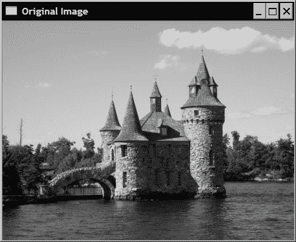
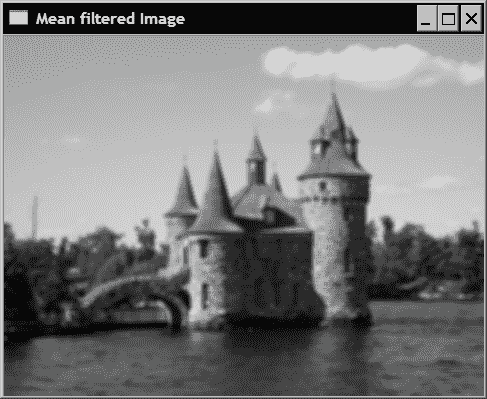
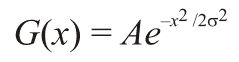
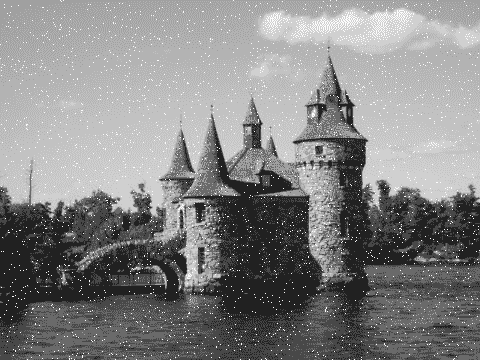
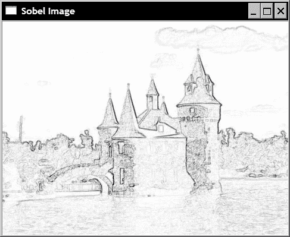
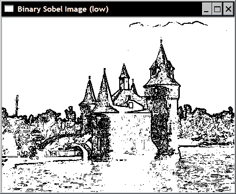
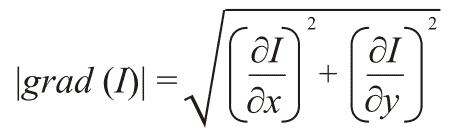
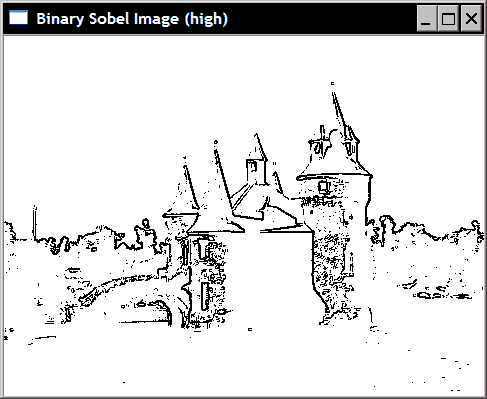
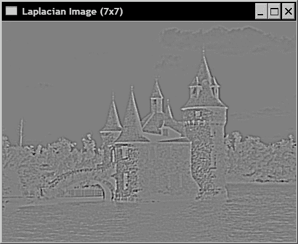
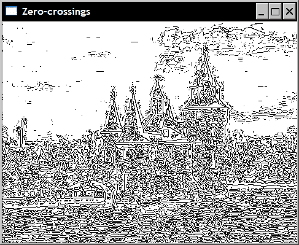

# 第 6 章。过滤图像

在本章中，我们将介绍：

*   使用低通过滤器过滤图像
*   使用中值过滤器过滤图像
*   应用方向过滤器检测边缘
*   计算图像的拉普拉斯算子

# 简介

滤波是信号和图像处理的基本任务之一。 它是一个过程，旨在有选择地提取图像的某些方面，这些方面被认为在给定应用的上下文中传达了重要信息。 过滤可以消除图像中的噪点，提取有趣的视觉特征，允许图像重采样等。 它起源于一般的**信号和系统**理论。 在此我们将不详细介绍该理论。 但是，本章将介绍一些与过滤有关的重要概念，并说明如何在图像处理应用中使用过滤器。 但首先，让我们先简要介绍一下频域分析的概念。

当我们查看图像时，我们观察到不同的灰度（或颜色）如何分布在图像上。 图像彼此不同，因为它们具有不同的灰度分布。 但是存在另一种可以分析图像的观点。 我们可以查看图像中存在的灰度变化。 一些图像包含几乎恒定强度的大区域（例如，蓝天），而在其他图像中，灰度强度在整个图像上变化很快（例如，繁忙的场景中挤满了许多小物体）。 因此，观察图像中这些变化的频率构成了表征图像的另一种方式。 这种观点被称为**频域**，而通过观察其灰度分布来表征图像的特性被称为**空间域**。

频域分析将图像分解为从最低频率到最高频率的频率内容。 低频对应于图像强度缓慢变化的区域，而高频则是由强度的快速变化产生的。 存在几种众所周知的变换，例如傅立叶变换或余弦变换，可用于显式显示图像的频率内容。 注意，由于图像是二维实体，因此它由垂直频率（即垂直方向上的变化）和水平频率（水平方向上的变化）组成。

在频域分析框架下，**过滤器**是一种操作，可放大图像的某些频段，同时阻止（或减少）其他图像频段。 因此，低通过滤器是消除了图像的高频成分的过滤器，反之，高通过滤器是消除了低通成分的过滤器。 本章将介绍一些在图像处理中经常使用的过滤器，并说明它们在应用于图像时的效果。

# 使用低通过滤器过滤图像

在第一个秘籍中，我们将介绍一些非常基本的低通过滤器。 在本章的介绍部分中，我们了解到此类过滤器的目的是减小图像变化的幅度。 实现此目标的一种简单方法是用周围像素的平均值替换每个像素。 这样，快速的强度变化将被消除，从而被更渐进的过渡所替代。

## 操作步骤

`cv::blur`函数的目的是通过将每个像素替换为在矩形邻域上计算的平均像素值来使图像平滑。 该低通过滤器的应用如下：

```cpp
   cv::blur(image,result,cv::Size(5,5));
```

这种过滤器也称为盒式过滤器。 在这里，我们通过使用`5x5`过滤器应用了该过滤器，以使过滤器的效果更加明显。 将其应用于下图时：



结果是：



在某些情况下，可能希望对像素附近的较近像素给予更多重视。 因此，可以计算加权平均值，在该加权平均值中，附近像素的权重大于远处像素的权重。 这可以通过使用遵循高斯函数（“钟形”函数）的加权方案来实现。 `cv::GaussianBlur`函数应用了这样的过滤器，其调用方式如下：

```cpp
   cv::GaussianBlur(image,result,cv::Size(5,5),1.5);
```

结果如下图所示：


## 工作原理

如果过滤器的应用对应于用相邻像素的加权和替换像素，则称该过滤器为线性的。 在盒式过滤器中就是这种情况，其中一个像素被一个矩形邻域中的所有像素之和替换，然后除以该邻域的大小（以获得平均值）。 这就像在像素总数上将每个相邻像素乘以 1，然后将所有这些值相加。 可以使用矩阵表示过滤器的不同权重，该矩阵示出与所考虑的邻域中的每个像素位置相关联的乘法因子。 矩阵的中心元素，与当前应用了过滤器的像素相对应。 这样的矩阵有时称为**核**或**掩码**。 对于`3x3`盒式过滤器，相应的核为：

| 1/9 | 1/9 | 1/9 |
| --- | --- | --- |
| 1/9 | 1/9 | 1/9 |
| 1/9 | 1/9 | 1/9 |

然后，应用线性过滤器对应于在图像的每个像素上移动核，并将每个相应像素乘以其关联的权重。 在数学上，此操作称为**卷积**。

查看此秘籍中产生的输出图像，可以观察到低通过滤器的最终效果是使图像模糊或平滑。 这并不奇怪，因为此过滤器会衰减与在对象边缘可见的快速变化相对应的高频分量。

在高斯过滤器的情况下，与像素关联的权重与其与中心像素的距离成正比。 回想一下，一维高斯函数具有以下形式：



选择归一化系数 `A`，以使不同的权重之和为 1。 `σ`值控制所得高斯函数的宽度。 该值越大，功能越平坦。 例如，如果我们计算间隔为`[-4,...,0,...4]`和`σ=0.5`的一维高斯过滤器的系数，则可以获得：

```cpp
[0.0 0.0 0.00026 0.10645 0.78657 0.10645 0.00026 0.0 0.0]
```

对于`σ=1.5`，这些系数为：

```cpp
[0.00761 0.036075 0.10959 0.21345 0.26666 
 0.21345 0.10959 0.03608 0.00761 ]
```

请注意，这些值是通过使用适当的`σ`值调用`cv::getGaussianKernel`函数获得的：

```cpp
cv::Mat gauss= cv::getGaussianKernel(9,sigma,CV_32F);
```

要在图像上应用 2D 高斯过滤器，只需先在图像行上应用 1D 高斯过滤器（它将过滤水平频率），然后在图像列上应用相同的 1D 高斯过滤器（以过滤垂直频率）。 这是可能的，因为高斯过滤器是**可分离过滤器**（即 2D 核可以分解为两个 1D 过滤器）。 函数`cv::sepFilter2D` 可用于应用通用的可分离过滤器。 也可以使用`cv::filter2D`函数直接应用 2D 核。

使用 OpenCV，通过向`cv::GaussianBlur` 提供系数的数量（第三参数，奇数）和`σ`的值（第四参数）来指定要应用于图像的高斯过滤器。 您也可以简单地设置`σ`的值，然后让 OpenCV 确定适当的系数数（然后为过滤器大小输入值 0）。 当您为`σ`输入大小和值 0 时，也可能相反。 将确定最适合给定大小的`σ`值。 但是，建议您输入两个值以更好地控制过滤器效果。

## 更多

调整图像大小时，也会使用低通过滤器。 假设您希望将图像的大小减少 2 倍。您可能会认为，只需消除图像的偶数行和列即可完成此操作。 不幸的是，生成的图像看起来不会很好。 例如，原始图像中的倾斜边缘将在缩小图像上显示为阶梯。 其他锯齿形失真也将在图像的曲线和纹理部分上可见。

这些不良伪像是由一种称为空间**混叠**的现象引起的，当您试图在图像中包含太小而无法包含高频分量时，就会出现这种现象。 实际上，较小的图像（即像素较少的图像）不能像高分辨率的图像（想像高清电视与传统电视之间的差异）一样好表现出精细的纹理和清晰的边缘。 由于图像中的精细细节对应于高频，因此我们需要在减小图像尺寸之前去除图像中那些较高频率的成分。 我们从此秘籍中学到，可以通过低通过滤器来完成此操作。 因此，要在不增加烦人的伪影的情况下将图像尺寸减小一半，必须首先对原始图像应用低通过滤器，然后将一列和两列扔掉。 这正是`cv::pyrDown`函数的作用：

```cpp
cv::Mat reducedImage;  // to contain reduced image
cv::pyrDown(image,reducedImage); // reduce image size by half
```

该相机使用`5x5`高斯过滤器对图像进行低通。 还存在使图像尺寸加倍的倒数`cv::pyrUp`函数。 当然，如果先缩小图像再放大，您将无法恢复确切的原始图像。 在缩编过程中丢失的内容无法恢复。 这两个功能用于创建**图像金字塔**。 这是一种由不同大小的图像的堆叠版本构成的数据结构（通常每个级别是前一级别的大小的一半），通常是为了进行有效的图像分析而构建的。 例如，如果希望检测图像中的物体，则可以首先在金字塔顶部的小图像上完成检测，并且在找到感兴趣的物体时，可以通过移到更低的金字塔等级来细化搜索，它包含图像高分辨率版本。

请注意，还有一个更通用的 `cv:resize`函数，可让您指定所需的结果图像尺寸。 您只需指定一个可以小于或大于原始图像的新尺寸来调用它：

```cpp
cv::Mat resizedImage;  // to contain resized image
cv::resize(image,resizedImage,
    cv::Size(image.cols/3,image.rows/3)); // 1/3 resizing
```

其他选项可用于根据比例因子指定调整大小，或选择要在重新采样过程中使用的特定插值方法。

## 另见

函数`cv::boxFilter`过滤具有仅由 1s 构成的正方形核的图像。 它类似于均值过滤器，但不将结果除以系数数量。

在第 2 章“使用访问邻居扫描图像”的“更多”部分中介绍了 `cv::filter2D`函数。 此功能可让您通过输入所选的核将线性过滤器应用于图像。

# 使用中值过滤器过滤图像

本章的第一个秘籍介绍了线性过滤器的概念。 还存在可以有利地用于图像处理中的非线性过滤器。 这样的过滤器之一就是我们在本秘籍中介绍的中值过滤器。

由于中值过滤器对于抵御椒盐噪声特别有用，因此我们将使用在第 2 章的第一个秘籍中创建的图像，该图像在此处复制：



## 操作步骤

对中值过滤函数的调用与其他过滤器类似：

```cpp
   cv::medianBlur(image,result,5);
```

生成的图像如下：


## 工作原理

由于中值过滤器不是线性过滤器，因此不能用核矩阵表示。 但是，它也可以在像素附近进行操作，以确定输出像素值。 像素及其邻域形成一组值，顾名思义，中值过滤器将仅计算该组的中值，然后将当前像素替换为该中值。

这就解释了为什么过滤器在消除盐和胡椒噪声方面如此有效。 实际上，当给定像素邻域中存在离群的黑色或白色像素时，永远不会选择该像素作为中位值（相当大或最小值），因此总是将其替换为邻近值。 相比之下，简单的均值过滤器将受到此类噪声的极大影响，因为在下图可以观察到的噪声代表了我们的椒盐图像的均值滤波版本：


显然，噪点像素会移动相邻像素的平均值。 结果，即使噪声已被均值过滤器模糊，仍然可见。

中值过滤器还具有保留边缘清晰度的优点。 但是，它会洗刷均匀区域中的纹理（例如，背景中的树木）。

# 应用方向过滤器检测边缘

本章的第一篇文章介绍了使用核矩阵进行线性过滤的思想。 所使用的过滤器具有消除或衰减高频成分而使图像模糊的效果。 在本秘籍中，我们将执行相反的变换，即放大图像的高频内容。 结果，此处介绍的高通过滤器将执行**边缘检测**。

## 操作步骤

我们将在这里使用的过滤器称为 Sobel 过滤器。 之所以称为定向过滤器，是因为它仅影响垂直或水平图像频率，具体取决于所使用的过滤器核。 OpenCV 具有将 Sobel 运算符应用于图像的功能。 水平过滤器的名称如下：

```cpp
   cv::Sobel(image,sobelX,CV_8U,1,0,3,0.4,128);
```

通过以下（和非常类似的）调用来实现垂直过滤：

```cpp
   cv::Sobel(image,sobelY,CV_8U,0,1,3,0.4,128);
```

为该函数提供了几个整数参数，这些将在下一部分中进行说明。 只需注意，已选择这些来生成输出的 8 位图像（`CV_8U`）表示。

水平 Sobel 运算符的结果如下：


在该表示中，零值对应于灰度级 128。负值由较暗的像素表示，而正值由较亮的像素表示。 垂直的 Sobel 图像为：


如果您熟悉照片编辑软件，则前面的图像可能会让您想起*图像浮雕*效果，，实际上，这种图像转换通常基于定向过滤器的使用。

由于其核包含正值和负值，因此通常在 16 位带符号整数图像（`CV_16S`）中计算 Sobel 过滤器的结果。 然后将两个结果（垂直和水平）进行组合以获得 Sobel 过滤器的范数：

```cpp
   // Compute norm of Sobel
   cv::Sobel(image,sobelX,CV_16S,1,0);
   cv::Sobel(image,sobelY,CV_16S,0,1);
   cv::Mat sobel;
   //compute the L1 norm
   sobel= abs(sobelX)+abs(sobelY);
```

使用`convertTo`方法的可选重新缩放参数，可以方便地在图像中显示 Sobel 范数，以获得零值对应于白色，较高的值分配为较深的灰色阴影的图像：

```cpp
   // Find Sobel max value
   double sobmin, sobmax;
   cv::minMaxLoc(sobel,&sobmin,&sobmax);
   // Conversion to 8-bit image
   // sobelImage = -alpha*sobel + 255
   cv::Mat sobelImage;
   sobel.convertTo(sobelImage,CV_8U,-255./sobmax,255);
```

结果可以在下图中看到：



查看此图像，现在很清楚为什么将这种运算符称为边缘检测器。 然后可以对该图像进行阈值处理以获得显示图像轮廓的二进制图。 以下代码段创建了以下图像：

```cpp
   cv::threshold(sobelImage, sobelThresholded, 
                      threshold, 255, cv::THRESH_BINARY);
```



## 工作原理

Sobel 运算符是经典的边缘检测线性过滤器，它基于简单的`3x3`核，其结构如下：

| -1 | 0 | 1 |
| --- | --- | --- |
| -2 | 0 | 2 |
| -1 | 0 | 1 |

| -1 | -2 | -1 |
| --- | --- | --- |
| 0 | 0 | 0 |
| 1 | 2 | 1 |

如果我们将图像视为二维函数，则可以将 Sobel 运算符视为图像在垂直和水平方向上变化的度量。 用数学术语来说，此度量称为**梯度**，它定义为由函数在两个正交方向上的一阶导数构成的 2D 向量：


因此，Sobel 运算符通过在水平方向和垂直方向上不同像素来给出图像梯度的近似值。 它在感兴趣像素周围的小窗口上运行，以减少噪声的影响。 `cv::Sobel`函数计算图像与 Sobel 核的卷积结果。 其完整规格如下：

```cpp
   cv::Sobel(image,  // input
             sobel,  // output
             image_depth,   // image type
             xorder,yorder, // kernel specification
             kernel_size,   // size of the square kernel 
             alpha, beta);  // scale and offset
```

因此，您可以决定是否将结果写入无符号字符，有符号整数或浮点图像中。 当然，如果结果落在图像像素域之外，则将应用饱和度。 这是最后两个参数可能有用的地方。 在将结果存储到图像中之前，可以将结果缩放（乘以`alpha`），并可以添加偏移量`beta`。 这就是我们在上一节中生成的图像的情况，该图像的 Sobel 值 0 由中间灰度级 128 表示。每个 Sobel 遮罩都对应一个方向的导数。 因此，使用两个参数来指定要应用的核，即`x`和`y`方向上的导数顺序。

例如，水平 Sobel 核是通过将`x`阶和`y`阶指定 1 和 0 来获得的，而垂直核将用 0 和 1 生成。其他组合也可以，但是这两个是最常使用的（在下一秘籍中讨论二阶导数的情况）。 最后，也可以使用大小大于`3x3`的核。 值 1、3、5 和 7 是核大小的可能选择。 大小为 1 的核对应于 1D Sobel 过滤器（`1x3`或`3x1`）。

由于梯度是 2D 向量，因此它具有范数和方向。 梯度向量的范数告诉您变化的幅度是多少，通常将其计算为欧几里得范数（也称为 *L2* 范数）：



但是，在图像处理中，我们通常将此规范计算为绝对值的总和。 这称为 *L1* 范数，它给出的值接近 *L2* 范数，但计算成本却低得多。 这就是我们在本秘籍中所做的，即：

```cpp
   //compute the L1 norm
   sobel= abs(sobelX)+abs(sobelY);
```

梯度向量始终指向最陡峭变化的方向。 对于图像，这意味着梯度方向将与边缘正交，指向从暗到亮的方向。 梯度角方向由下式给出：


通常，对于边缘检测，仅计算范数。 但是，如果您既需要规范又需要方向，那么可以使用以下 OpenCV 函数：

```cpp
   // Sobel must be computed in floating points
   cv::Sobel(image,sobelX,CV_32F,1,0);
   cv::Sobel(image,sobelY,CV_32F,0,1);
   // Compute the L2 norm and direction of the gradient
   cv::Mat norm, dir;   
   cv::cartToPolar(sobelX,sobelY,norm,dir);
```

默认情况下，方向以弧度计算。 只需添加`true`作为附加参数，以度为单位进行计算即可。

通过在梯度幅度上应用阈值获得了二进制边缘图。 选择正确的阈值并不是一项显而易见的任务。 如果阈值太低，将保留太多（较厚）边缘，而如果我们选择更严格（较高）的阈值，则将获得折断边缘。 为了说明这种折衷情况，请将前面的二进制边缘图与使用较高阈值获得的以下内容进行比较：



一种可能的替代方法是使用滞后阈值的概念。 我们将在下一章介绍 Canny 运算符的地方对此进行解释。

## 更多

还存在其他梯度运算符。 例如， Prewitt 运算符定义以下核：

| -1 | 0 | 1 |
| --- | --- | --- |
| -1 | 0 | 1 |
| -1 | 0 | 1 |

| -1 | -1 | -1 |
| --- | --- | --- |
| 0 | 0 | 0 |
| 1 | 1 | 1 |

Roberts 运算符基于以下简单的`2x2`核：

| 1 | 0 |
| --- | --- |
| 0 | -1 |

| 0 | 1 |
| --- | --- |
| -1 | 0 |

当需要更精确的梯度方向估计时，首选 Scharr 运算符：

| -3 | 0 | 3 |
| --- | --- | --- |
| -10 | 0 | 10 |
| -3 | 0 | 3 |

| -3 | -10 | -3 |
| --- | --- | --- |
| 0 | 0 | 0 |
| 3 | 10 | 3 |

请注意，可以通过使用`CV_SCHARR`参数来将 Scharr 核与`cv::Sobel`函数结合使用：

```cpp
   cv::Sobel(image,sobelX,CV_16S,1,0, CV_SCHARR);
```

或者等效地，通过调用函数 `cv::Scharr`：

```cpp
   cv::Scharr(image,scharrX,CV_16S,1,0,3);
```

所有这些定向过滤器都试图估计图像函数的一阶导数。 因此，在存在沿过滤器方向的较大强度变化的区域获得高值，而平坦区域产生较低的值。 这就是为什么计算图像导数的过滤器是高通过滤器的原因。

## 另见

第 7 章中的“使用 Canny 运算符检测边缘”，通过使用两个不同的阈值获得二进制边缘图。

# 计算图像的拉普拉斯算子

拉普拉斯算子是另一种基于图像导数计算的高通线性过滤器。 如将要解释的，它计算二阶导数以测量图像函数的曲率。

## 操作步骤

OpenCV 函数`cv::Laplacian` 计算图像的拉普拉斯算子。 它与`cv::Sobel`函数非常相似。 实际上，它使用相同的基本函数 `cv::getDerivKernels`以获得其核矩阵。 唯一的区别是没有导数阶参数，因为根据定义，这些参数是二阶导数。

对于此运算符，我们将创建一个简单的类，该类将封装一些与 Laplacian 相关的有用操作。 基本方法是：

```cpp
class LaplacianZC {

  private:

     // original image
     cv::Mat img;

     // 32-bit float image containing the Laplacian
     cv::Mat laplace;
     // Aperture size of the laplacian kernel
     int aperture;

  public:

     LaplacianZC() : aperture(3) {}

     // Set the aperture size of the kernel
     void setAperture(int a) {

        aperture= a;
     }

     // Compute the floating point Laplacian
     cv::Mat computeLaplacian(const cv::Mat& image) {

        // Compute Laplacian
        cv::Laplacian(image,laplace,CV_32F,aperture);

        // Keep local copy of the image
        // (used for zero-crossings)
        img= image.clone();

        return laplace;
     }
```

拉普拉斯算子的计算是在浮点图像上完成的。 为了获得结果的图像，我们像前面的秘籍一样执行重新缩放。 这种重新缩放基于拉普拉斯算子的最大绝对值，其中将 0 分配给灰度级 128。我们类的方法允许获取该图像表示形式：

```cpp
     // Get the Laplacian result in 8-bit image 
     // zero corresponds to gray level 128
     // if no scale is provided, then the max value will be
     // scaled to intensity 255
     // You must call computeLaplacian before calling this
     cv::Mat getLaplacianImage(double scale=-1.0) {

        if (scale<0) {

           double lapmin, lapmax;
           cv::minMaxLoc(laplace,&lapmin,&lapmax);

           scale= 127/ std::max(-lapmin,lapmax);
        }

        cv::Mat laplaceImage;
        laplace.convertTo(laplaceImage,CV_8U,scale,128);

        return laplaceImage;
     }
```

使用此类，从`7x7`核计算出的拉普拉斯图像如下：

```cpp
   // Compute Laplacian using LaplacianZC class
   LaplacianZC laplacian;
   laplacian.setAperture(7);
   cv::Mat flap= laplacian.computeLaplacian(image);
   laplace= laplacian.getLaplacianImage();
```

生成的图像如下：



## 工作原理

正式地，将 2D 函数的**拉普拉斯算子**定义为其第二个导数的和：


以其最简单的形式，它可以由以下`3x3`核近似：

| 0 | 1 | 0 |
| --- | --- | --- |
| 1 | -4 | 1 |
| 0 | 1 | 0 |

至于 Sobel 运算符，也可以使用更大的核来计算拉普拉斯算子，并且由于该运算符对图像噪声更加敏感，因此希望这样做（除非考虑到计算效率）。 请注意，拉普拉斯算子的核值总和为 0。这保证了在恒定强度的区域中拉普拉斯算子将为零。 确实，由于拉普拉斯算子测量图像函数的曲率，因此在平坦区域上它应等于 0。

乍一看，拉普拉斯算子的作用可能难以解释。 根据核的定义，很明显，运算符会放大任何孤立的像素值（该值与相邻像素值非常不同）。 这是操作人员对噪声的高度敏感性的结果。 但是，查看图像边缘周围的拉普拉斯值更有趣。 图像中存在边缘是不同灰度强度的区域之间快速过渡的结果。 随着图像功能沿边缘的演变（例如，由从暗到亮的过渡引起），人们可以观察到灰度级提升必然意味着从正曲率逐渐过渡（当强度值开始上升时） ）变为负曲率（强度即将达到其高平稳期时）。 因此，正和负拉普拉斯值之间（或相反）之间的过渡构成边缘存在的良好指示。 表达这一事实的另一种方式是说边缘将位于拉普拉斯函数的*零交叉点* 。 我们将通过在测试图像的一个小窗口中查看拉普拉斯算子的值来说明这一想法。 我们选择一个对应于由城堡之一的塔的屋顶的底部创建的边缘的边缘。 下图绘制了一个白框，以显示该兴趣区域的确切位置：


现在查看此窗口中的拉普拉斯值（`7x7`核），我们有：


如图所示，如果您仔细遵循拉普拉斯算子的零交叉点（位于不同符号的像素之间），则会获得一条与图像窗口中可见边缘相对应的曲线。 在上方，我们沿着零交叉点绘制了虚线，这些零点对应于在所选图像窗口中可见的塔架边缘。 这意味着原则上甚至可以亚像素精度检测图像边缘。

在拉普拉斯图像中遵循零交叉曲线是一项艰巨的任务。 但是，可以使用简化的算法来检测近似的零交叉位置。 这一过程如下。 扫描拉普拉斯图像，并将当前像素与其左侧的像素进行比较。 如果两个像素的符号不同，则在当前像素处声明零交叉，如果不是，则对紧接上方的像素重复相同的测试。 该算法通过以下方法实现，该方法生成零交叉的二进制图像：

```cpp
     // Get a binary image of the zero-crossings
     // if the product of the two adjascent pixels is
     // less than threshold then this zero-crossing 
     // will be ignored
     cv::Mat getZeroCrossings(float threshold=1.0) {

        // Create the iterators
        cv::Mat_<float>::const_iterator it= 
           laplace.begin<float>()+laplace.step1();
        cv::Mat_<float>::const_iterator itend= 
           laplace.end<float>();
        cv::Mat_<float>::const_iterator itup= 
           laplace.begin<float>();

        // Binary image initialize to white
        cv::Mat binary(laplace.size(),CV_8U,cv::Scalar(255));
        cv::Mat_<uchar>::iterator itout= 
           binary.begin<uchar>()+binary.step1();

        // negate the input threshold value
        threshold *= -1.0;

        for ( ; it!= itend; ++it, ++itup, ++itout) {

           // if the product of two adjascent pixel is
           // negative then there is a sign change
           if (*it * *(it-1) < threshold)
              *itout= 0; // horizontal zero-crossing
           else if (*it * *itup < threshold)
              *itout= 0; // vertical zero-crossing
        }

        return binary;
     }
```

还引入了一个附加阈值，以确保当前的拉普拉斯值足够显着，可以视为边缘。 结果是以下二进制映射：



如您所见，拉普拉斯算子的零交叉点检测所有边缘。 在强边缘和弱边缘之间没有区别。 我们还提到拉普拉斯算子对噪声非常敏感。 这两个事实解释了为什么运算符会检测到如此多的边缘。

## 更多

可以通过从图像中减去拉普拉斯算子来增强图像的对比度。 这是我们在第 2 章“通过访问邻居扫描图像”秘籍中的方法，我们在其中介绍了核：

| 0 | -1 | 0 |
| --- | --- | --- |
| -1 | 5 | -1 |
| 0 | -1 | 0 |

等于 1 减去 Laplacian 核（即原始图像减去其 Laplacian）。

## 另见

第 8 章中的方法“检测尺度不变特征 SURF”，使用拉普拉斯算子进行尺度不变特征的检测。