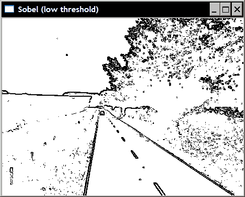
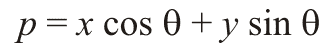
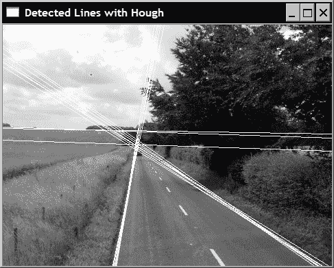
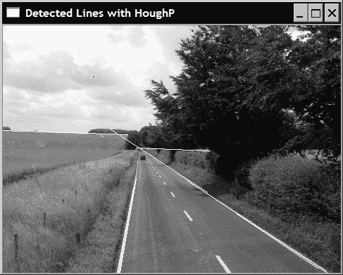
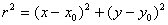
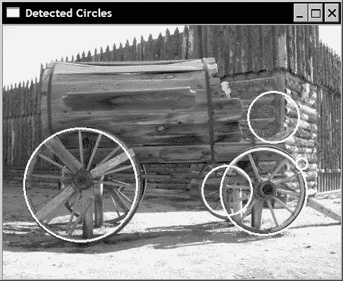
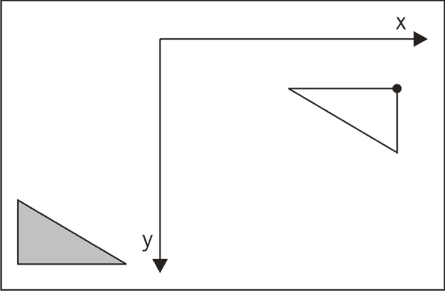

# 第 7 章。提取直线，轮廓和零件

在本章中，我们将介绍：

*   使用 Canny 运算符检测图像轮廓
*   使用霍夫变换检测图像中的直线
*   将线拟合到一组点
*   提取组件的轮廓
*   计算组件的形状描述符

# 简介

为了对图像执行基于内容的分析，必须从构成图像的像素集合中提取有意义的特征。 轮廓，线条，斑点等是定义图像内容的基本图像元素。 本章将教您如何提取其中一些重要的图像功能。

# 使用 Canny 运算符检测图像轮廓

在上一章中，我们了解了如何检测图像的边缘。 特别是，我们表明，通过对梯度幅度应用阈值，可以获得图像主要边缘的二值映射。 边缘具有重要的视觉信息，因为它们描绘了图像元素。 因此，它们可以用于例如对象识别。 然而，简单的二进制边缘图具有两个主要缺点。 首先，检测到的边缘过厚。 这意味着无法精确定位对象限制。 第二，也是更重要的是，很难找到一个阈值，该阈值足够低以检测图像的所有重要图像边缘，而同时又足够高而不会包含太多无关紧要的边缘。 这是 Canny 算法试图解决的折衷问题。

## 操作步骤

Canny 算法在 OpenCV 中通过函数`cv::Canny`实现。 如将要解释的，该算法需要指定两个阈值。 因此，对该函数的调用如下：

```cpp
   // Apply Canny algorithm
   cv::Mat contours;
   cv::Canny(image,    // gray-level image
             contours, // output contours
             125,      // low threshold
             350);     // high threshold
```

当应用于下图时：


结果如下：


请注意，要获得如前面的屏幕快照中所示的图像，我们必须反转黑白值，因为正常结果以非零像素表示轮廓。 倒置表示形式更易于在页面上打印，其生成方式如下：

```cpp
   cv::Mat contoursInv; // inverted image
   cv::threshold(contours,contoursInv,
                 128,   // values below this
                 255,   // becomes this
                 cv::THRESH_BINARY_INV);
```

## 工作原理

尽管可以使用其他梯度运算符，但 Canny 运算符通常基于 Sobel 运算符。 此处的关键思想是使用两个不同的阈值以确定哪个点应属于轮廓：一个低阈值和一个高阈值。

选择低阈值的方式应使其包括被认为属于重要图像轮廓的所有边缘像素。 例如，使用上一部分示例中指定的低阈值，并将其应用于 Sobel 运算符的结果，可获得以下边缘图：



可以看出，描绘道路的边缘非常清晰。 但是，由于使用了允许阈值，因此还检测到了比理想情况更多的边缘。 然后，第二个阈值的作用是定义属于所有重要轮廓的边缘。 它应排除所有被视为离群值的边缘。 例如，与我们的示例中使用的高阈值相对应的 Sobel 边缘图为：


现在，我们有一个包含断边的图像，但是可见的断点当然属于场景的重要轮廓。 Canny 算法将这两个边缘图组合在一起，以生成轮廓的“最佳”图。 它仅通过保留低阈值边缘图的边缘点（存在连续的边缘路径）并将该边缘点链接到属于高阈值边缘图的边缘来进行操作。 因此，保留了高阈值图的所有边缘点，同时移除了低阈值图中的所有孤立的边缘点链。 所获得的解决方案构成了良好的折衷，只要指定了适当的阈值，就可以获取高质量的轮廓。 基于使用两个阈值以获得二进制图的该策略称为**滞后阈值**，可用于需要从阈值操作获得二进制图的任何上下文中。 但是，这是以较高的计算复杂度为代价的。

另外，Canny 算法使用额外的策略来改善边缘图的质量。 在应用滞后阈值之前，应去除所有梯度幅度在梯度方向上不是最大的边缘点。 回想一下，梯度方向始终垂直于边缘。 因此，在该方向上的梯度的局部最大值对应于轮廓的最大强度点。 这解释了为什么在 Canny 等高线图中获得细边的原因。

## 另见

```cpp
The classic article by J. Canny, A computational approach to edge detection, IEEE Transactions on Pattern Analysis and Image Understanding, vol. 18, issue 6, 1986.
```

# 使用霍夫变换检测图像中的直线

在我们的人造世界中，平面和线性结构比比皆是。 结果，在图像中经常可见直线。 这些有意义的功能在对象识别和图像理解中起着重要作用。 因此，检测图像中的这些特定特征很有用。 **霍夫变换**是实现此目标的经典算法。 它最初是为检测图像中的线条而开发的，并且正如我们将看到的，它也可以扩展为检测其他简单图像结构。

## 准备

使用霍夫变换时，使用以下公式表示线：



参数`ρ`是线与图像原点之间的距离（左上角），`θ`是垂直于线的角度。 在此表示下，图像中可见的线在`0`和`π`弧度之间具有`θ`角，而半径`ρ`可以具有等于图像对角线长度的最大值。 例如，考虑以下几行：


像线 1 一样的垂直线的`θ`角度值等于零，而水平线（例如，线 5）的`θ`值等于`π / 2`。 因此，线 3 具有等于`π / 4`的角度`θ`，并且线 4 大约为`0.7π`。 为了能够在间隔`[0, π]`中用`θ`表示所有可能的线，可以将半径值设为负数。 第 2 行的情况是`θ`值等于`0.8π`，而`ρ`的值为负。

## 操作步骤

OpenCV 为行检测提供了霍夫变换的两种实现。 基本版本是`cv::HoughLines`。 它的输入是一个二进制映射，其中包含一组点（用非零像素表示），其中一些点对齐形成线。 通常，它是例如从 Canny 运算符获得的边缘图。 `cv::HoughLines`函数的输出是 `cv::Vec2f`元素的向量，每个元素都是一对浮点值，它们代表检测到的线的参数`(ρ, θ)`。 这是使用此函数的示例，其中我们首先应用 Canny 运算符来获取图像轮廓，然后使用霍夫变换检测线：

```cpp
   // Apply Canny algorithm
   cv::Mat contours;
   cv::Canny(image,contours,125,350);
   // Hough tranform for line detection
   std::vector<cv::Vec2f> lines;
   cv::HoughLines(test,lines,
        1,PI/180,  // step size
        80);       // minimum number of votes
```

参数 3 和 4 对应于行搜索的步长。 在我们的示例中，该函数将按`1`搜索所有可能半径的线，并按`π/180`搜索所有可能角度的线。 下一部分将说明最后一个参数的作用。 通过这种特殊的参数值选择，可以在先前配方的道路图像上检测到 15 条线。 为了可视化检测结果，有趣的是在原始图像上绘制这些线。 但是，重要的是要注意该算法检测图像中的线，而不是线段，因为未给出每条线的终点。 因此，我们将绘制横贯整个图像的线。 为此，对于一条几乎垂直的线，我们计算其与图像的水平界限的交点（即第一行和最后一行），并在这两点之间绘制一条线。 我们几乎以水平线进行类似处理，但使用第一列和最后一列。 使用`cv::line`功能绘制线。 请注意，即使点坐标超出图像限制，此功能也可以正常使用。 因此，不需要检查计算出的交点是否落在图像内。 然后通过如下迭代线向量来绘制线：

```cpp
   std::vector<cv::Vec2f>::const_iterator it= lines.begin();
   while (it!=lines.end()) {

      float rho= (*it)[0];   // first element is distance rho
      float theta= (*it)[1]; // second element is angle theta

      if (theta < PI/4\. 
           || theta > 3.*PI/4.) { // ~vertical line

         // point of intersection of the line with first row
         cv::Point pt1(rho/cos(theta),0);        
         // point of intersection of the line with last row
         cv::Point pt2((rho-result.rows*sin(theta))/
                                  cos(theta),result.rows);
         // draw a white line
         cv::line( image, pt1, pt2, cv::Scalar(255), 1); 

      } else { // ~horizontal line

         // point of intersection of the 
         // line with first column
         cv::Point pt1(0,rho/sin(theta));        
         // point of intersection of the line with last column
         cv::Point pt2(result.cols,
                 (rho-result.cols*cos(theta))/sin(theta));
         // draw a white line
         cv::line(image, pt1, pt2, cv::Scalar(255), 1); 
      }

      ++it;
   }
```

然后获得以下结果：



可以看出，霍夫变换只是在寻找图像中边缘像素的对齐方式。 由于偶发的像素对齐，这可能会产生一些错误的检测，或者当几条线穿过像素的相同对齐时，可能会导致多次检测。

为了克服这些问题中的某些问题，并允许检测线段（即带有端点），提出了一种变换形式。 这是概率霍夫变换，在 OpenCV 中作为函数 `cv::HoughLinesP`实现。 我们在这里使用它来创建封装函数参数的`LineFinder`类：

```cpp
class LineFinder {

  private:

     // original image
     cv::Mat img;

     // vector containing the end points 
     // of the detected lines
     std::vector<cv::Vec4i> lines;

     // accumulator resolution parameters
     double deltaRho;
     double deltaTheta;

     // minimum number of votes that a line 
     // must receive before being considered
     int minVote;

     // min length for a line
     double minLength;

     // max allowed gap along the line
     double maxGap;

  public:

     // Default accumulator resolution is 1 pixel by 1 degree
     // no gap, no mimimum length
     LineFinder() : deltaRho(1), deltaTheta(PI/180), 
                    minVote(10), minLength(0.), maxGap(0.) {}
```

使用相应的设置器方法：

```cpp
     // Set the resolution of the accumulator
     void setAccResolution(double dRho, double dTheta) {

        deltaRho= dRho;
        deltaTheta= dTheta;
     }

     // Set the minimum number of votes
     void setMinVote(int minv) {

        minVote= minv;
     }

     // Set line length and gap
     void setLineLengthAndGap(double length, double gap) {

        minLength= length;
        maxGap= gap;
     }
```

然后，执行霍夫线段检测的方法很简单：

```cpp
     // Apply probabilistic Hough Transform
     std::vector<cv::Vec4i> findLines(cv::Mat& binary) {

        lines.clear();
        cv::HoughLinesP(binary,lines,
                        deltaRho, deltaTheta, minVote, 
                        minLength, maxGap);

        return lines;
     }
```

此方法返回`cv::Vec4i` 的向量，每个向量都包含每个检测到的片段的起点和终点坐标。 然后可以通过以下方法将检测到的线条绘制在图像上：

```cpp
     // Draw the detected lines on an image
     void drawDetectedLines(cv::Mat &image, 
                cv::Scalar color=cv::Scalar(255,255,255)) {

        // Draw the lines
        std::vector<cv::Vec4i>::const_iterator it2= 
                                           lines.begin();

        while (it2!=lines.end()) {

           cv::Point pt1((*it2)[0],(*it2)[1]);        
           cv::Point pt2((*it2)[2],(*it2)[3]);

           cv::line( image, pt1, pt2, color);

           ++it2;   
        }
     }
```

现在，使用相同的输入图像，可以按以下顺序检测线条：

```cpp
   // Create LineFinder instance
   LineFinder finder;

   // Set probabilistic Hough parameters
   finder.setLineLengthAndGap(100,20);
   finder.setMinVote(80);

   // Detect lines and draw them
   std::vector<cv::Vec4i> lines= finder.findLines(contours);
   finder.drawDetectedLines(image);
   cv::namedWindow("Detected Lines with HoughP");
   cv::imshow("Detected Lines with HoughP",image);
```

得到以下结果：



## 工作原理

霍夫变换的目的是找到二进制图像中经过足够数量点的所有线。 它通过考虑输入二进制图中的每个像素点并标识通过它的所有可能的行来进行。 当同一条线穿过许多点时，这意味着该条线的重要性足以考虑。

霍夫变换使用二维累加器，以便计算识别给定行的次数。 该累加器的大小由所采用的线表示形式的`[ρ, θ]`参数的指定步长（如前一节所述）定义。 为了说明转换的功能，让我们通过`200`矩阵创建`180`（`θ`对应`π / 180`步长，`ρ`对应`1`）：

```cpp
   // Create a Hough accumulator
   // here a uchar image; in practice should be ints
   cv::Mat acc(200,180,CV_8U,cv::Scalar(0));
```

该累加器是不同`(ρ, θ)`值的映射。 因此，该矩阵的每个条目对应于一条特定的行。 现在，如果我们考虑一个点，例如在坐标`(50, 30)`处，则可以通过遍历所有可能的`θ`角度（步长为`π / 180`）来识别通过此点的所有线，然后计算相应的（四舍五入的）`ρ`值：

```cpp
   // Choose a point
   int x=50, y=30;

   // loop over all angles
   for (int i=0; i<180; i++) {

      double theta= i*PI/180.;

      // find corresponding rho value 
      double rho= x*cos(theta)+y*sin(theta);
      // j corresponds to rho from -100 to 100
      int j= static_cast<int>(rho+100.5);

      std::cout << i << "," << j << std::endl;

      // increment accumulator
      acc.at<uchar>(j,i)++;
   }
```

然后，累加器对应于计算出的（`ρ, θ`对）的条目增加，表示所有这些行都通过图像的一个点（或者换句话说，每个点都通过投票） 对于一组可能的候选行）。 如果将累加器显示为图像（乘以`100`以使计数 1 可见），我们将获得：


该曲线表示通过考虑点的所有线的集合。 现在，如果我们重复相同的练习，比方说`(30, 10)`，那么我们现在有了以下累加器：


可以看出，两条结果曲线在一个点处相交。 对应于经过这两个点的线的点。 累加器的相应条目将获得两票，表明有两分通过这条线。 如果对二进制图的所有点重复相同的过程，则沿给定线对齐的点将多次增加累加器的公共项。 最后，只需要在此累加器中标识出获得大量票数的局部最大值即可检测图像中的线（即点对齐）。 在 `cv::HoughLines`函数中指定的最后一个参数对应于必须将行视为被检测到的最小投票数。 例如，如果我们将此值降低为 60，即：

```cpp
   cv::HoughLines(test,lines,1,PI/180,60);
```

然后，前面部分的示例将接受更多行，如下所示：


概率霍夫变换对基本算法没有多大修改。 首先，不是系统地逐行扫描图像，而是在二进制映射图中以随机顺序选择点。 每当累加器的输入达到指定的最小值时，就会沿着相应的线扫描图像，并删除通过该图像的所有点（即使尚未投票）。 该扫描还确定了将被接受的片段的长度。 为此，算法定义了两个附加参数。 一个是要接受的段的最小长度，另一个是允许形成连续段的最大像素间隙。 这个额外的步骤增加了算法的复杂性，但是由于以下事实这一事实可以部分弥补这一点：投票过程中涉及的点更少，因为其中一些点被线扫描过程消除了。

## 更多

霍夫变换还可以用于检测其他几何实体。 实际上，可以由参数方程式表示的任何实体都是霍夫变换的良好候选者。

### 检测圆形

对于圆形，相应的参数方程为：



该方程式包含三个参数（圆半径和中心坐标），这意味着将需要一个 3 维累加器。 但是，通常发现，随着其累加器维数的增加，霍夫变换的可靠性降低。 实际上，在这种情况下，对于每个点，累加器的大量条目将增加，因此，局部峰的精确定位变得更加困难。 因此，已经提出了不同的策略以克服该问题。 在霍夫圆检测的 OpenCV 实现中使用的一个使用两次通过。 在第一遍过程中，使用二维累加器查找候选圆的位置。 由于圆圆周上的点的坡度应指向半径方向，因此，对于每个点，仅累加器中沿坡度方向的条目会增加（基于预定义的最小和最大半径值）。 一旦检测到可能的圆心（即已收到预定义数量的选票），便会在第二遍过程中建立可能半径的一维直方图。 该直方图中的峰值对应于检测到的圆的半径。

实现上述策略的功能`cv::HoughCircles`集成了 Canny 检测和霍夫变换。 它被称为如下：

```cpp
   cv::GaussianBlur(image,image,cv::Size(5,5),1.5);
   std::vector<cv::Vec3f> circles;
   cv::HoughCircles(image, circles, CV_HOUGH_GRADIENT, 
      2,   // accumulator resolution (size of the image / 2) 
      50,  // minimum distance between two circles
      200, // Canny high threshold 
      100, // minimum number of votes 
      25, 100); // min and max radius
```

请注意，始终建议在调用 `cv::HoughCircles`函数之前先对图像进行平滑处理，以减少可能导致多次假圆检测的图像噪声。 检测结果在`cv::Vec3f`实例的向量中给出。 前两个值是圆心，第三个值是半径。 在撰写本书时， `CV_HOUGH_GRADIENT`是唯一可用的选项。 它对应于两遍圆检测方法。 第四个参数定义累加器分辨率。 它是一个除法因子，例如，将值指定为 2 将使累加器的大小为图像大小的一半。 下一个参数是两个检测到的圆之间的最小距离（以像素为单位）。 另一个参数对应于 Canny 边缘检测器的高阈值。 下阈值设置为该值的一半。 第七个参数是中心位置在第一遍过程中必须获得的最小投票数，才能被视为第二遍的候选圈子。 最后，最后两个参数是要检测的圆的最小和最大半径值。 可以看出，该函数包含许多参数，这些参数使其难以调整。

获得检测到的圆的向量后，可以通过在向量上进行迭代并使用找到的参数调用`cv::circle` 绘制函数，将其绘制在图像上：

```cpp
   std::vector<cv::Vec3f>::
          const_iterator itc= circles.begin();

   while (itc!=circles.end()) {

     cv::circle(image, 
        cv::Point((*itc)[0], (*itc)[1]), // circle centre
        (*itc)[2],       // circle radius
        cv::Scalar(255), // color 
        2);              // thickness

     ++itc;   
   }
```

这是在带有所选参数的测试图像上获得的结果：



### 广义霍夫变换

对于某些形状，很难找到紧凑的参数表示形式，例如三角形，八边形，多边形，对象轮廓等。 但是，仍然可以使用霍夫变换在图像中定位这些形状。 原理保持不变。 创建一个二维累加器，它代表目标形状的所有可能位置。 因此，必须在形状上定义一个参考点，并且图像上的每个特征点都会为可能的参考点位置投票。 由于点可以在形状轮廓上的任何位置，因此所有可能的参考位置的轨迹都将跟踪累加器中的形状，该形状是目标形状的镜像。 同样，图像中属于相同形状的点将在累加器中与该形状位置相对应的交点处产生一个峰值。

下图中对此进行了说明，其中感兴趣的形状是一个三角形（如右图所示），在该三角形的左下角定义了参考。 在累加器上显示了一个特征点，该特征点将增加绘制位置处的所有条目，因为它们对应于穿过该特征点的三角形参考点的可能位置：



这种方法通常称为**广义霍夫变换**。 显然，它没有考虑可能的比例变化或形状旋转。 这将需要在更高维度上进行搜索。

## 另见

```cpp
The article Gradient-based Progressive Probabilistic Hough Transform by C. Galambos, J. Kittler, and J. Matas, IEE Vision Image and Signal Processing, vol. 148 no 3, pp. 158-165, 2002. It is one of the numerous reference on the Hough transform and describes the probabilistic algorithm implemented in OpenCV.

The article by H.K. Yuen, J. Princen, J. Illingworth, and J Kittler, Comparative Study of Hough Transform Methods for Circle Finding, Image and Vision Computing, vol. 8 no 1, pp. 71-77, 1990 that describes different strategies for circle detection using the Hough transform.
```

# 将直线拟合到一组点

在某些应用中，重要的是不仅要检测图像中的线条，而且要获得线条位置和方向的准确估计。 此食谱将向您展示如何找到最适合给定点集的线。

## 操作步骤

首先要做的是识别图像中似乎沿直线对齐的点。 然后，让我们使用在前面的配方中检测到的行之一。 假设使用`cv::HoughLinesP` 检测到的行包含在称为`lines`的`std::vector`中。 例如，要提取看似属于的那组点，我们可以按以下步骤进行。 我们在黑色图像上绘制一条白线，并将其与用于检测线条的轮廓的 Canny 图像相交。 只需通过以下语句即可实现：

```cpp
   int n=0; // we select line 0 
   // black image
   cv::Mat oneline(contours.size(),CV_8U,cv::Scalar(0));
   // white line
   cv::line(oneline, 
            cv::Point(lines[n][0],lines[n][1]),
            cv::Point(lines[n][2],lines[n][3]),
            cv::Scalar(255),
            5);
   // contours AND white line
   cv::bitwise_and(contours,oneline,oneline);
```

结果是仅包含可能与指定线关联的点的图像。 为了引入一些公差，我们绘制了一定厚度的线（此处为 5）。 因此，将接受所定义邻域内的所有点。 这是获得的图像（为了更好地观看，将其反转）：


然后可以通过以下双重循环将此集合中点的坐标插入`cv::Point`的`std::vector`中（也可以使用浮点坐标，即`cv::Point2f`）：

```cpp
   std::vector<cv::Point> points;

   // Iterate over the pixels to obtain all point positions
   for( int y = 0; y < oneline.rows; y++ ) {    
      // row y

      uchar* rowPtr = oneline.ptr<uchar>(y);

      for( int x = 0; x < oneline.cols; x++ ) {
         // column x 

         // if on a contour
         if (rowPtr[x]) {

            points.push_back(cv::Point(x,y));
         }
      }
    }
```

通过调用 OpenCV 函数 `cv::fitLine`可以轻松找到最合适的线：

```cpp
   cv::Vec4f line;
   cv::fitLine(cv::Mat(points),line,
               CV_DIST_L2, // distance type
               0,          // not used with L2 distance 
               0.01,0.01); // accuracy
```

这为我们提供了线方程的参数，其形式为单位方向向量（`cv::Vec4f`的前两个值）和线上一个点的坐标（`cv::Vec4f`的后两个值）。 对于我们的示例，这些值对于方向矢量是`(0.83, 0.55)`，对于点坐标是`(366.1, 289.1)`。 最后两个参数指定线参数的要求精度。 注意，`std::vector`中包含的输入点根据功能需要在`cv::Mat`中传输。

通常，线方程将用于某些属性的计算中（在需要精确参数表示的情况下，校准是一个很好的例子）。 作为说明，并确保我们计算出正确的线，让我们在图像上绘制估计的线。 在这里，我们简单地绘制一个任意的黑色段，长度为 200 像素，厚度为 3 像素：

```cpp
   int x0= line[2];        // a point on the line
   int y0= line[3];
   int x1= x0-200*line[0]; // add a vector of length 200
   int y1= y0-200*line[1]; // using the unit vector
   image= cv::imread("../road.jpg",0);
   cv::line(image,cv::Point(x0,y0),cv::Point(x1,y1),
            cv::Scalar(0),3);
```

结果如下图所示：


## 工作原理

将线拟合到一组点是数学中的经典问题。 OpenCV 的实现通过最小化每个点到线的距离之和来进行。 提出了几种距离函数，最快的选择是使用由`CV_DIST_L2` 指定的欧几里德距离。 此选择对应于标准最小二乘法线拟合。 当离群点（即不属于该线的点）可能包括在点集中时，可以选择对远点影响较小的其他距离函数。 最小化基于 M 估计器技术，该技术迭代解决权重与距线的距离成反比的加权最小二乘问题。

使用此功能，还可以将线拟合到 3D 点集。 在这种情况下，输入为`cv::Point3i`或`cv::Point3f`的集合，而输出为`std::Vec6f`。

## 更多

函数`cv::fitEllipse` 使椭圆适合一组 2D 点。 它返回一个旋转的矩形（一个`cv::RotatedRect`实例），在该矩形内刻有椭圆。 在这种情况下，您将编写：

```cpp
   cv::RotatedRect rrect= cv::fitEllipse(cv::Mat(points));
   cv::ellipse(image,rrect,cv::Scalar(0));
```

函数`cv::ellipse`是用于绘制计算的椭圆的函数。

# 提取组件的轮廓

图像通常包含对象的表示。 图像分析的目标之一是识别并提取这些对象。 在对象检测/识别应用程序中，第一步是生成一个二进制图像，该图像显示某些感兴趣的物体可能位于何处。 无论如何获得此二进制映射（例如，可以像我们在第 4 章中所做的那样从直方图反向投影中获得，或者从运动分析中获得（如我们将在第 10 章中学习的一样） ），下一步是提取此 1 和 0 集合中包含的对象。 例如，考虑一下我们在第 5 章中处理过的二进制形式的水牛图像，如下所示：


我们从一个简单的阈值操作中获得了这张图像，接着是打开和关闭形态过滤器的应用。 此食谱将向您展示如何提取此类图像的对象。 更具体地说，我们将提取**连通分量**，即由二进制图像中一组连接的像素组成的形状。

## 操作步骤

OpenCV 提供了一个简单的功能，可以提取图像的已连接组件的轮廓。 它是 `cv::findContours`功能：

```cpp
   std::vector<std::vector<cv::Point>> contours;
   cv::findContours(image, 
      contours, // a vector of contours 
      CV_RETR_EXTERNAL, // retrieve the external contours
      CV_CHAIN_APPROX_NONE); // all pixels of each contours
```

输入显然是二进制图像。 输出是轮廓的矢量，每个轮廓由`cv::Points`的矢量表示。 这解释了为什么将输出参数定义为`std::vectors`的`std::vector`的原因。 另外，指定了两个标志。 第一个表示仅需要外部轮廓，也就是说，将忽略对象中的孔； （“更多”部分将讨论其他选项）。 那里的第二个标志指定轮廓的格式。 使用当前选项，矢量将列出轮廓中的所有点。 使用标记`CV_CHAIN_APPROX_SIMPLE`，时，水平，垂直或对角线轮廓仅包含端点。 其他标记将给出轮廓的更复杂的链近似，以获得更紧凑的表示。 对于前面的图像，获得了`contours.size()`给出的九个轮廓。 幸运的是，有一个非常方便的功能可以在图像（这里是白色图像）上绘制这些轮廓：

```cpp
   // Draw black contours on a white image
   cv::Mat result(image.size(),CV_8U,cv::Scalar(255));
   cv::drawContours(result,contours,
      -1, // draw all contours
      cv::Scalar(0), // in black
      2); // with a thickness of 2
```

如果此功能的第三个参数为负值，则绘制所有轮廓。 否则，可以指定要绘制轮廓的索引。 结果显示在以下屏幕截图中：


## 工作原理

轮廓是通过简单的算法提取的，该算法包括系统扫描图像直到命中组件。 从组件的此起点开始，遵循其轮廓，在其边界上标记像素。 轮廓完成后，扫描将在最后一个位置继续进行，直到找到新的零件。

然后可以分别分析识别出的连接组件。 例如，如果可以获得有关感兴趣对象的预期大小的一些先验知识，则可以消除某些组件。 然后让我们为组件的周长使用最小值和最大值。 这是通过迭代轮廓矢量并消除无效分量来完成的：

```cpp
   // Eliminate too short or too long contours
   int cmin= 100;  // minimum contour length
   int cmax= 1000; // maximum contour length
   std::vector<std::vector<cv::Point>>::
              const_iterator itc= contours.begin();
   while (itc!=contours.end()) {

      if (itc->size() < cmin || itc->size() > cmax)
         itc= contours.erase(itc);
      else 
         ++itc;
   }
```

注意，由于`std::vector`中的每个擦除操作均为`O(N)`，因此可以更有效地进行此循环。 但是考虑到此向量的大小，此操作并不太昂贵。 这次我们在原始图像上绘制其余轮廓，并获得以下结果：


我们很幸运地找到了一个简单的标准，该标准使我们能够识别出该图像中所有感兴趣的物体。 在更复杂的情况下，需要对组件的属性进行更精细的分析。 这是下一个配方的对象。

## 更多

使用`cv::findContours`功能，还可以将所有闭合轮廓包括在二进制图中，包括由零件中的孔形成的轮廓。 这可以通过在函数调用中指定另一个标志来完成：

```cpp
   cv::findContours(image, 
      contours, // a vector of contours 
      CV_RETR_LIST, // retrieve all contours
      CV_CHAIN_APPROX_NONE); // all pixels of each contours
```

通过此调用，可获得以下轮廓：


注意在背景林中添加的额外轮廓。 也可以将这些轮廓组织成一个层次。 主要组件是父组件，其中的孔是其子组件，如果这些孔中有组件，它们将成为先前子组件的子组件，依此类推。 通过使用标志`CV_RETR_TREE`和如下获得此层次结构：

```cpp
   std::vector<cv::Vec4i> hierarchy;
cv::findContours(image, 
      contours, // a vector of contours
      hierarchy, // hierarchical representation 
      CV_RETR_TREE, // retrieve all contours in tree format
      CV_CHAIN_APPROX_NONE); // all pixels of each contours
```

在这种情况下，每个轮廓在由四个整数组成的相同索引处具有一个相应的层次结构元素。 前两个整数给出相同级别的下一个和上一个轮廓的索引，后两个整数给出该轮廓的第一个子级和父级的索引。 负索引指示轮廓列表的结尾。 标志`CV_RETR_CCOMP` 类似，但将层次结构限制在两个级别。

# 计算组件的形状描述符

连通组件通常对应于所描绘场景中某些对象的图像。 为了识别该对象或将其与其他图像元素进行比较，对组件执行一些测量以提取其某些特性可能很有用。 在本食谱中，我们将看一下 OpenCV 中可用的一些形状描述符，这些描述符可用于描述连接组件的形状。

## 操作步骤

关于形状描述，许多 OpenCV 功能都可用。 我们将其中一些应用在前面的食谱中提取的组件上。 特别地，我们将使用四个轮廓的向量，它们对应于我们先前确定的四个水牛。 在以下代码段中，我们在轮廓（`contours[0]`至`contours[3]`）上计算形状描述符，然后在轮廓（厚度为 1）的图像上绘制结果（厚度为 2）。 此图像显示在本节的末尾。

第一个是边界框，应用于右下角的组件：

```cpp
   // testing the bounding box 
   cv::Rect r0= cv::boundingRect(cv::Mat(contours[0]));
   cv::rectangle(result,r0,cv::Scalar(0),2);
```

最小包围圈类似。 它应用于右上角的组件：

```cpp
   // testing the enclosing circle 
   float radius;
   cv::Point2f center;
   cv::minEnclosingCircle(cv::Mat(contours[1]),center,radius);
   cv::circle(result,cv::Point(center),
              static_cast<int>(radius),cv::Scalar(0),2);
```

组件轮廓的多边形近似计算如下（在左侧组件上）：

```cpp
   // testing the approximate polygon
   std::vector<cv::Point> poly;
   cv::approxPolyDP(cv::Mat(contours[2]),poly,
                    5,     // accuracy of the approximation
                    true); // yes it is a closed shape
```

在图像上绘制结果需要做更多的工作：

```cpp
   // Iterate over each segment and draw it
   std::vector<cv::Point>::const_iterator itp= poly.begin();
   while (itp!=(poly.end()-1)) {
      cv::line(result,*itp,*(itp+1),cv::Scalar(0),2);
      ++itp;
   }
   // last point linked to first point
   cv::line(result,
            *(poly.begin()),
            *(poly.end()-1),cv::Scalar(20),2);
```

凸包是多边形近似的另一种形式：

```cpp
   // testing the convex hull
   std::vector<cv::Point> hull;
   cv::convexHull(cv::Mat(contours[3]),hull);
```

最后，矩的计算是另一个强大的描述符：

```cpp
   // testing the moments

   // iterate over all contours
   itc= contours.begin();
   while (itc!=contours.end()) {

      // compute all moments
      cv::Moments mom= cv::moments(cv::Mat(*itc++));

      // draw mass center
      cv::circle(result,
         // position of mass center converted to integer
         cv::Point(mom.m10/mom.m00,mom.m01/mom.m00),
         2,cv::Scalar(0),2); // draw black dot
   }
```

生成的图像如下：


## 工作原理

组件的**边界框**可能是在图像中表示和定位组件的最紧凑的方式。 定义为完全包含形状的最小尺寸的直立矩形。 比较盒子的高度和宽度会给出有关对象垂直或水平方向的指示（例如，将汽车的图像与行人的图像区分开）。 当仅需要组件尺寸和位置时，通常使用最小包围圈。

当人们想要操纵类似于组件形状的更紧凑的表示形式时，组件的多边形近似很有用。 通过指定精度参数创建该参数，该精度参数给出了形状与其简化的多边形之间的最大可接受距离。 它是`cv::approxPolyDP`函数中的第四个参数。 结果是对应于多边形顶点的`cv::Point`向量。 要绘制此多边形，我们需要遍历向量，并通过在它们之间画一条线将每个点与下一个点链接。

形状的**凸包**或凸包络是包含形状的最小凸多边形。 可以将其可视化为松紧带在组件周围放置时的形状。

矩是形状结构分析中常用的数学实体。 OpenCV 定义了一个数据结构，该数据结构封装了形状的所有计算矩。 它是 `cv::moments`函数返回的对象。 我们简单地使用这种结构来获得每个分量的质心，这里是从前三个空间矩计算得出的。

## 更多

其他结构特性可以使用可用的 OpenCV 函数来计算。 函数`cv::minAreaRect` 计算最小的封闭旋转矩形。 函数 `cv::contourArea`估计轮廓的面积（内部像素数）。 功能`cv::pointPolygonTest` 确定一个点在轮廓内部还是外部，`cv::matchShapes` 测量两个轮廓之间的相似度。