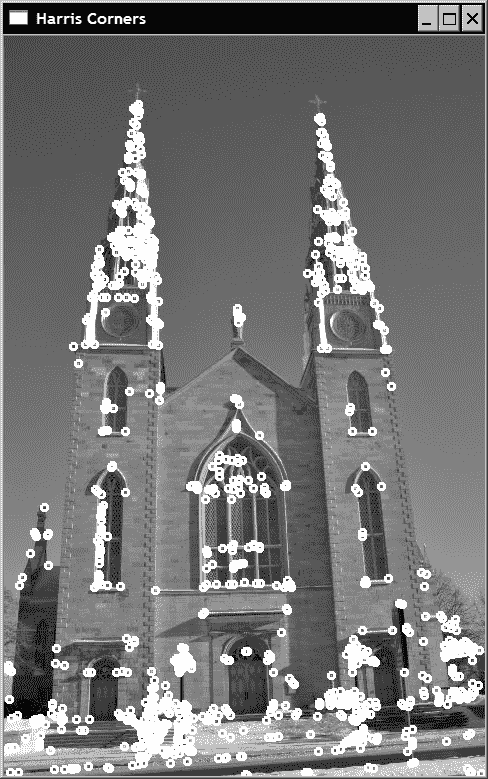
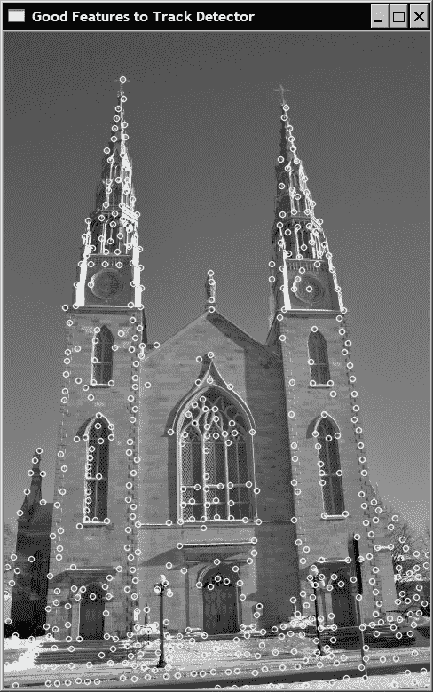
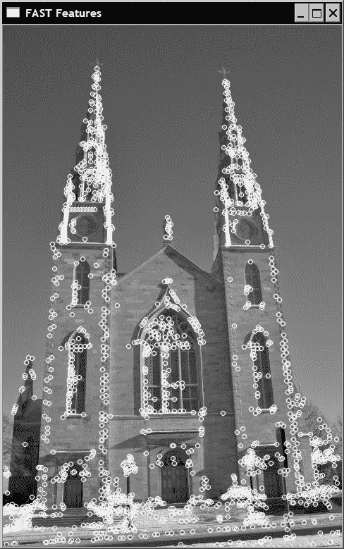
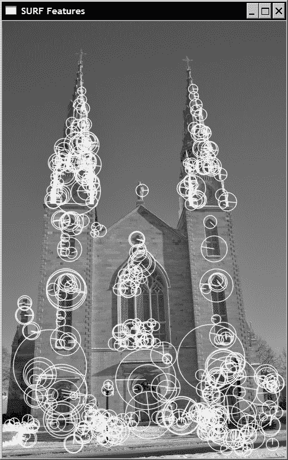
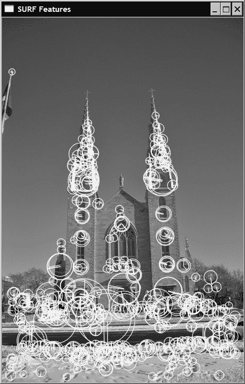
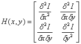
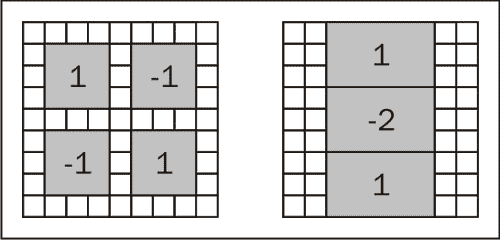
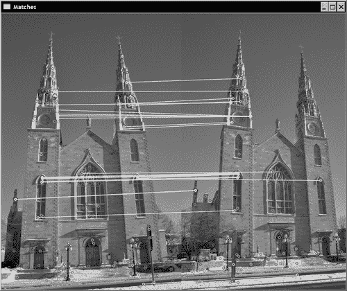
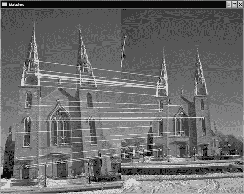

# 第 8 章。检测和匹配兴趣点

在本章中，我们将介绍：

*   检测哈里斯角点
*   检测 FAST 特征
*   检测尺度不变的 SURF 特征
*   描述 SURF 特征

# 简介

在计算机视觉中，**兴趣点**的概念也被称为**关键点**或**特征点**， 在对象识别，图像配准，视觉跟踪，3D 重建等方面存在许多问题。 它依赖于这样的想法：与其在整体上查看图像，不如在图像中选择一些特殊点并对这些点执行局部分析可能会比较有利。 只要在感兴趣的图像中检测到足够数量的此类点并且这些点是可以准确定位的独特且稳定的特征，这些方法就可以很好地工作。 本章将介绍一些兴趣点检测器，并向您展示如何在图像匹配中使用它们。

# 检测哈里斯角点

在图像中搜索有趣的特征点时，出现角点是一个有趣的解决方案。 它们确实是可以轻松定位在图像中的局部特征，此外，它们应在人造对象的场景中比比皆是（它们是由墙，门，窗户，桌子等产生的）。 角点也很有趣，因为它们是二维特征，因为它们位于两个边缘的交界处，所以可以准确地定位（即使以亚像素精度）。 这与位于物体的均匀区域或轮廓上的点相反，并且很难将其精确地重复定位在同一物体的其他图像上。

哈里斯特征检测器是检测图像角点的经典方法。 我们将在本秘籍中探讨该运算符。

## 操作步骤

用于检测哈里斯角点的基本 OpenCV 函数称为`cv::cornerHarris` ，易于使用。 您在输入图像上调用它，结果是浮点图像，该图像给出了每个像素位置的角点强度。 然后按顺序将阈值应用于此输出图像，以获得一组检测到的角点。 这是通过以下代码完成的：

```cpp
   // Detect Harris Corners
   cv::Mat cornerStrength;
   cv::cornerHarris(image,cornerStrength,
                3,     // neighborhood size
                3,     // aperture size
                0.01); // Harris parameter

   // threshold the corner strengths
   cv::Mat harrisCorners;
   double threshold= 0.0001; 
   cv::threshold(cornerStrength,harrisCorners,
                 threshold,255,cv::THRESH_BINARY);
```

这是原始图片：


结果是下面的屏幕快照中显示的二进制映射图像，该图像被反转以更好地查看（也就是说，我们使用`cv::THRESH_BINARY_INV` 而不是`cv::THRESH_BINARY` 将检测到的角变成黑色）：


从前面的函数调用中，我们观察到该兴趣点检测器需要几个参数（这些参数将在下一节中进行说明），这可能会使调整变得困难。 另外，所获得的角图包含许多角像素群集，这与我们希望检测定位良好的点的事实相矛盾。 因此，我们将尝试通过定义自己的类来检测哈里斯角点来改进角点检测方法。

该类使用其默认值以及相应的获取器和设置器方法（此处未显示）封装哈里斯参数。

```cpp
class HarrisDetector {

  private:

     // 32-bit float image of corner strength
     cv::Mat cornerStrength;
     // 32-bit float image of thresholded corners
     cv::Mat cornerTh;
     // image of local maxima (internal)
     cv::Mat localMax;
     // size of neighborhood for derivatives smoothing
     int neighbourhood; 
     // aperture for gradient computation
     int aperture; 
     // Harris parameter
     double k;
     // maximum strength for threshold computation
     double maxStrength;
     // calculated threshold (internal)
     double threshold;
     // size of neighborhood for non-max suppression
     int nonMaxSize; 
     // kernel for non-max suppression
     cv::Mat kernel;

  public:

     HarrisDetector() : neighbourhood(3), aperture(3), 
                        k(0.01), maxStrength(0.0), 
                        threshold(0.01), nonMaxSize(3) {

        // create kernel used in non-maxima suppression
        setLocalMaxWindowSize(nonMaxSize);
     }
```

为了检测图像上的哈里斯角，我们执行两个步骤。 首先，计算每个像素的哈里斯值：

```cpp
     // Compute Harris corners
     void detect(const cv::Mat& image) {

        // Harris computation
        cv::cornerHarris(image,cornerStrength,
                neighbourhood,// neighborhood size
                aperture,     // aperture size
                k);           // Harris parameter

        // internal threshold computation
        double minStrength; // not used
        cv::minMaxLoc(cornerStrength,
             &minStrength,&maxStrength);

        // local maxima detection
        cv::Mat dilated;  // temporary image
        cv::dilate(cornerStrength,dilated,cv::Mat());
        cv::compare(cornerStrength,dilated,
                    localMax,cv::CMP_EQ);
     }
```

接下来，基于指定的阈值获得特征点。 由于哈里斯的可能值范围取决于其参数的特定选择，因此将阈值指定为质量级别，该质量级别定义为图像中计算出的最大哈里斯值的一部分：

```cpp
     // Get the corner map from the computed Harris values
     cv::Mat getCornerMap(double qualityLevel) {

        cv::Mat cornerMap;

        // thresholding the corner strength
        threshold= qualityLevel*maxStrength;
        cv::threshold(cornerStrength,cornerTh,
                      threshold,255,cv::THRESH_BINARY);

        // convert to 8-bit image
        cornerTh.convertTo(cornerMap,CV_8U);

        // non-maxima suppression
        cv::bitwise_and(cornerMap,localMax,cornerMap);

        return cornerMap;
     }
```

此方法返回检测到的特征的二进制角图。 哈里斯特征的检测已被分成两种方法，这一事实使我们能够以不同的阈值（直到获得适当数量的特征点）测试检测，而无需重复进行昂贵的计算。 也可能以`cv::Point`的`std::vector`形式获得哈里斯特征：

```cpp
     // Get the feature points from the computed Harris values
     void getCorners(std::vector<cv::Point> &points, 
                     double qualityLevel) {

        // Get the corner map
        cv::Mat cornerMap= getCornerMap(qualityLevel);
        // Get the corners
        getCorners(points, cornerMap);
     }

     // Get the feature points from the computed corner map
     void getCorners(std::vector<cv::Point> &points, 
                     const cv::Mat& cornerMap) {

        // Iterate over the pixels to obtain all features
        for( int y = 0; y < cornerMap.rows; y++ ) {

           const uchar* rowPtr = cornerMap.ptr<uchar>(y);

           for( int x = 0; x < cornerMap.cols; x++ ) {

              // if it is a feature point
              if (rowPtr[x]) {

                 points.push_back(cv::Point(x,y));
              }
           } 
        }
     }
```

此类通过添加非最大值抑制步骤来改进哈里斯角的检测，这将在下一部分中进行说明。 现在可以使用`cv::circle`函数将检测到的点绘制在图像上，如以下方法所示：

```cpp
     // Draw circles at feature point locations on an image
     void drawOnImage(cv::Mat &image, 
        const std::vector<cv::Point> &points, 
        cv::Scalar color= cv::Scalar(255,255,255), 
        int radius=3, int thickness=2) {

        std::vector<cv::Point>::const_iterator it= 
                                       points.begin();

        // for all corners
        while (it!=points.end()) {

           // draw a circle at each corner location
           cv::circle(image,*it,radius,color,thickness);
           ++it;
        }
     }
```

使用此类，哈里斯点的检测如下完成：

```cpp
   // Create Harris detector instance
   HarrisDetector harris;
    // Compute Harris values
   harris.detect(image);
    // Detect Harris corners
   std::vector<cv::Point> pts;
   harris.getCorners(pts,0.01);
   // Draw Harris corners
   harris.drawOnImage(image,pts);
```

结果如下图：



## 工作原理

为了定义图像中角点的概念，哈里斯在假定的兴趣点周围的小窗口中查看了平均方向强度变化。 如果我们考虑位移向量`(u, v)`，则平均强度变化由下式给出：


该求和是在所考虑像素周围的定义邻域上进行的（该邻域的大小对应于`cv::cornerHarris`函数中的第三个参数）。 然后可以在所有可能的方向上计算该平均强度变化，这导致将角定义为在多个方向上平均变化高的点。 根据这个定义，哈里斯检验如下进行。 我们首先获得最大平均强度变化的方向。 接下来，检查正交方向上的平均强度变化是否也很高。 如果是这样，那么我们有一个角落。

从数学上讲，可以使用泰勒展开式通过使用前面公式的近似值来测试此条件：


然后以矩阵形式重写：


该矩阵是协方差矩阵，它描述了各个方向上强度变化的速率。 此定义涉及通常使用 Sobel 运算符计算的图像的一阶导数。 这是 OpenCV 实现的情况，函数的第四个参数与用于计算 Sobel 过滤器的孔径相对应。 可以看出，协方差矩阵的两个特征值给出了最大的平均强度变化和正交方向的平均强度变化。 然后得出结论，如果这两个特征值较低，则我们处于相对同质的区域。 如果一个特征值高而另一个特征值低，则我们必须处于边缘。 最后，如果两个特征值都很高，那么我们将处于角点位置。 因此，要被接受为角点的条件是协方差矩阵的最小特征值高于给定阈值。

哈里斯角点算法的原始定义使用了特征分解理论的某些属性，以避免显式计算特征值的成本。 这些属性是：

*   矩阵特征值的乘积等于其行列式
*   矩阵的特征值之和等于矩阵对角线的总和（也称为矩阵的**迹线**）

然后，我们可以通过计算以下分数来验证两个特征值是否较高：


仅当两个特征值也都很高时，才能轻松验证该分数确实很高。 这是由`cv::cornerHarris`函数在每个像素位置计算的分数。 `k`的值被指定为函数的第五个参数。 可能很难确定此参数的最佳值。 然而，实际上，已经表明，在 0.05 至 0.5 范围内的值通常给出良好的结果。

为了提高检测结果，上一节中描述的类添加了一个附加的非最大值抑制步骤。 这里的目标是排除与他人相邻的哈里斯角。 因此，要被接受，哈里斯角不仅必须具有高于指定阈值的分数，而且还必须是局部最大值。 通过使用一个简单的技巧来测试这种情况，该技巧包括通过我们的`detect`方法扩展哈里斯评分图像：

```cpp
        cv::dilate(cornerStrength,dilated,cv::Mat());
```

由于膨胀将每个像素值替换为所定义邻域中的最大值，因此，唯一不会被修改的点就是局部最大值，这是通过以下相等性测试验证的：

```cpp
        cv::compare(cornerStrength,dilated, 
                    localMax,cv::CMP_EQ);
```

因此，`localMax`矩阵仅在局部最大值位置为真（即非零）。 然后，在`getCornerMap`方法中使用它来抑制所有非最大特征（使用`cv::bitwise_and`函数的 ）。

## 更多

可以对原始的哈里斯角点算法进行其他改进。 本节描述了 OpenCV 中的另一个角检测器，该角检测器扩展了哈里斯检测器，以使其角更均匀地分布在整个图像上。 正如我们将看到的，该运算符在新的 OpenCV 2 通用接口中用于特征检测器。

### 值得跟踪的良好特征

随着浮点处理器的出现，为避免特征值分解而引入的数学简化变得可以忽略不计，因此，可以基于显式计算的特征值进行哈里斯的检测。 原则上，此修改不应显着影响检测结果，但应避免使用任意`k`参数。

第二修改解决了特征点聚类的问题。 实际上，尽管引入了局部极大值条件，兴趣点仍倾向于在整个图像上分布不均，从而在高度纹理化的位置显示出浓度。 该问题的解决方案是在两个兴趣点之间施加最小距离。 这可以通过以下算法来实现。 从具有最强哈里斯分数的点（即具有最大最小特征值）开始，仅当兴趣点至少位于距已接受点的给定距离处时，才接受它们。 此解决方案在 OpenCV 中通过函数 `cv::goodFeaturesToTrack`来实现，因为它检测到的功能可以用作视觉跟踪应用中的良好起点。 它被称为如下：

```cpp
   // Compute good features to track
   std::vector<cv::Point2f> corners;
   cv::goodFeaturesToTrack(image,corners,
      500,   // maximum number of corners to be returned
      0.01,   // quality level
      10);   // minimum allowed distance between points
```

除了质量级别阈值和兴趣点之间的最小容许距离外，该函数还使用要返回的最大点数（这是可能的，因为按强度顺序接受点）。 前面的函数调用产生以下结果：



这种方法增加了检测的复杂性，因为它要求按照兴趣点的哈里斯分数对兴趣点进行排序，但同时也明显改善了兴趣点在图像上的分布。 请注意，此函数还包括一个可选标志，以请求使用经典角点分数定义（使用协方差矩阵的行列式和轨迹）检测哈里斯角。

### 特征检测器通用接口

OpenCV 2 已为其不同的兴趣点检测器引入了新的通用接口。 该接口可轻松测试同一应用中的不同兴趣点检测器。

该接口定义了一个`Keypoint`类，该类封装了每个检测到的特征点的属性。 对于哈里斯角点，仅关键点的位置相关。 秘籍“检测尺度不变的 SURF 点”将讨论可能与关键点相关的其他属性。

`cv::FeatureDetector` 抽象类基本上强加了具有以下签名的`detect`操作的存在：

```cpp
   void detect( const Mat& image, vector<KeyPoint>& keypoints,
                const Mat& mask=Mat() ) const;

   void detect( const vector<Mat>& images,
                vector<vector<KeyPoint> >& keypoints,
                const vector<Mat>& masks=
                                   vector<Mat>() ) const;
```

第二种方法允许在图像向量中检测兴趣点。 该类还包括其他方法来在文件中读取和写入检测到的点。

`cv::goodFeaturesToTrack`函数具有一个名为`cv::GoodFeatureToTrackDetector` 的包装类，该包装类继承自`cv::FeatureDetector`类。 它的使用方式类似于我们对哈里斯`Corners`类所做的方式，即：

```cpp
   // vector of keypoints
   std::vector<cv::KeyPoint> keypoints;
   // Construction of the Good Feature to Track detector 
   cv::GoodFeaturesToTrackDetector gftt(
      500,   // maximum number of corners to be returned
      0.01,   // quality level
      10);   // minimum allowed distance between points
   // point detection using FeatureDetector method
   gftt.detect(image,keypoints);
```

结果与之前获得的结果相同，因为包装器最终会调用相同的函数。

## 另见

```cpp
The classical article describing the Harris operator: C. Harris and M.J. Stephens, A combined corner and edge detector, by Alvey Vision Conference, pp. 147–152, 1988.

The article by J. Shi and C. Tomasi, Good features to track, Int. Conference on Computer Vision and Pattern Recognition, pp. 593-600, 1994 which introduced these features.

The article by K. Mikolajczyk and C. Schmid, Scale and Affine invariant interest point detectors, International Journal of Computer Vision, vol 60, no 1, pp. 63-86, 2004, which proposes a multi-scale and affine-invariant Harris operator.
```

# 检测 FAST 特征

哈里斯运算符基于两个垂直方向上的强度变化率，为角（或更一般地为兴趣点）提出了一个正式的数学定义。 尽管这构成了一个良好的定义，但它需要计算图像导数，这是一项昂贵的操作，尤其是考虑到兴趣点检测通常只是更复杂算法中的第一步这一事实。

在本秘籍中，我们介绍了另一个特征点运算符。 经过专门设计的该工具可以快速检测图像中的兴趣点。 接受或不接受关键点的决定仅基于几个像素比较。

## 操作步骤

使用 OpenCV 2 通用接口进行特征点检测可轻松部署任何特征点检测器。 本秘籍中介绍的一种是 FAST 检测器。 顾名思义，它旨在快速计算：

```cpp
   // vector of keypoints
   std::vector<cv::KeyPoint> keypoints;
   // Construction of the Fast feature detector object 
   cv::FastFeatureDetector fast(
           40); // threshold for detection  
   // feature point detection 
   fast.detect(image,keypoints);
```

请注意，OpenCV 还建议使用通用函数在图像上绘制关键点：

```cpp
   cv::drawKeypoints(image,    // original image
      keypoints,                // vector of keypoints
      image,                   // the output image
      cv::Scalar(255,255,255), // keypoint color
      cv::DrawMatchesFlags::DRAW_OVER_OUTIMG); //drawing flag
```

通过指定所选的绘制标记，可以在输出图像上绘制关键点，从而产生以下结果：



一个有趣的选项是为关键点颜色指定一个负值。 在这种情况下，将为每个绘制的圆选择不同的随机颜色。

## 工作原理

与哈里斯点的情况一样，FAST（加速分段测试的特征）特征算法从构成“角点”的定义中得出。 这次，此定义基于假定特征点周围的图像强度。 接受关键点的决定是通过检查以候选点为中心的像素圆来完成的。 如果发现长度大于圆周长 3/4 的连续点弧，其中所有像素均与中心点的强度明显不同，则声明关键点。

这是一个可以快速计算的简单测试。 此外，该算法使用了其他技巧来进一步加快处理速度。 确实，如果我们首先测试圆上相隔 90o 的四个点（例如，顶部，底部，右侧和左侧点），则可以很容易地证明，要满足上述条件，这些点中的至少三个必须都比中央像素更亮或更暗。 如果不是这种情况，则可以立即拒绝该点，而无需检查圆周上的其他点。 这是一种非常有效的测试，因为在实践中，大多数图像点将被此简单的 4 比较测试所拒绝。

原则上，检查像素圆的半径应该是该方法的参数。 但是，已经发现，实际上，半径为 3 既可以得到良好的结果，又可以得到很高的效率。 然后，在圆的圆周上要考虑 16 个像素，如下所示：

|   |   | 16 | 1 | 2 |   |   |
| --- | --- | --- | --- | --- | --- | --- |
|   | 15 |   |   |   | 3 |   |
| 14 |   |   |   |   |   | 4 |
| 13 |   |   | 0 |   |   | 5 |
| 12 |   |   |   |   |   | 6 |
|   | 11 |   |   |   | 7 |   |
|   |   | 10 | 9 | 8 |   |   |

用于预测试的四个点是像素 1、5、9 和 13。

至于哈里斯特征，通常最好在发现的角点处执行非最大值抑制。 因此，需要定义角点强度度量。 可以考虑几种替代方法，以下是保留的一种方法。 角点的强度由中心像素与所标识的连续弧上的像素之间的绝对差之和得出。

该算法可实现非常快的兴趣点检测，因此在考虑速度时应使用该算法。 例如，在视觉跟踪应用中经常是这种情况，在视觉跟踪应用中，必须在具有高帧速率的视频序列中跟踪几个点。

## 另见

```cpp
The article by E. Rosten and T. Drummond, Machine learning for high-speed corner detection, in In European Conference on Computer Vision, pp. 430-443, 2006 that describes the FAST feature algorithm in detail.
```

# 检测尺度不变的 SURF 特征

当尝试在不同图像上匹配特征时，我们经常会遇到缩放比例变化的问题。 即，可以在距感兴趣对象不同距离处拍摄要分析的不同图像，因此，将以不同大小对这些对象进行拍照。 如果我们尝试使用固定大小的邻域匹配来自两个图像的相同特征，则由于缩放比例的变化，它们的强度模式将不匹配。

为了解决这个问题，计算机视觉中引入了尺度不变特征的概念。 这里的主要思想是使比例因子与每个检测到的特征点相关。 近年来，已经提出了几种尺度不变的特征，该秘籍提出了其中之一，即 SURF 特征。 SURF 代表加速鲁棒特征，正如我们将看到的那样，它们不仅是尺度不变的特征，而且还具有非常高效地进行计算的优势。

## 操作步骤

SURF 特征的 OpenCV 实现也使用`cv::FeatureDetector`接口。 因此，这些功能的检测与我们在本章前面的秘籍中展示的类似：

```cpp
   // vector of keypoints
   std::vector<cv::KeyPoint> keypoints;
   // Construct the SURF feature detector object
   cv::SurfFeatureDetector surf(
       2500.); // threshold 
   // Detect the SURF features
   surf.detect(image,keypoints);
```

要绘制这些特征，我们再次使用`cv::drawKeypoints` OpenCV 函数，但这一次使用另一个遮罩，因为我们还想显示与每个特征相关的比例因子：

```cpp
   // Draw the keypoints with scale and orientation information
   cv::drawKeypoints(image,      // original image
      keypoints,               // vector of keypoints
      featureImage,            // the resulting image
      cv::Scalar(255,255,255),   // color of the points
      cv::DrawMatchesFlags::DRAW_RICH_KEYPOINTS); //flag
```

通过绘图功能生成的具有检测到的特征的最终图像为：



从前面的屏幕截图中可以看出，由于使用`DRAW_RICH_KEYPOINTS`标志而产生的关键点圆的大小与每个特征的计算比例成比例。 SURF 算法还将方向与每个特征相关联，以使它们旋转不变。 该方向由每个绘制的圆内的径向线表示。

如果我们以相同比例但以不同比例拍摄另一张照片，则特征检测将导致：



通过仔细观察检测到的关键点，可以看出相应圆的大小变化与比例变化成比例。 例如，考虑右上方窗口的底部。 在两幅图像中，在该位置均检测到 SURF 特征，并且两个相应的圆圈（大小不同）包含相同的视觉元素。 当然，并非所有功能都如此，但是正如我们将在下一章中发现的那样，重复率足够高，可以在两个图像之间实现良好的匹配。

## 工作原理

在第 6 章中，我们了解了可以使用高斯过滤器来估计图像的图像导数。 这些过滤器使用`σ`参数来定义核的孔径（大小）。 如我们所见，此`σ`对应于用于构造过滤器的高斯函数的方差，然后隐式定义了评估导数的标度。 实际上，具有较大`σ`值的过滤器可以平滑图像的精细细节。 这就是为什么我们可以说它的运行规模更大的原因。

现在，如果我们使用不同比例的高斯过滤器计算给定图像点的拉普拉斯，那么将获得不同的值。 查看不同比例因子的过滤器响应的演变，我们获得了一条曲线，该曲线最终在`σ`值处达到最大值。 如果我们针对以两个不同比例拍摄的同一物体的两个图像提取该最大值，则这两个`σ`最大值的比率将对应于拍摄图像的比例。 这一重要观察是尺度不变特征提取过程的核心。 也就是说，应将尺度不变特征检测为空间空间（图像中）和尺度空间（从不同尺度应用的导数过滤器获得）的局部最大值。

SURF 通过以下步骤来实现此想法。 首先，为了检测特征，在每个像素处计算 Hessian 矩阵。 该矩阵测量函数的局部曲率，并定义为：



该矩阵的行列式给出了该曲率的强度。 因此，该想法是将角定义为具有高局部曲率（即，在一个以上方向上的高变化）的图像点。 由于它是由二阶导数组成的，因此可以使用不同比例`σ`的拉普拉斯高斯核来计算该矩阵。 然后，该 Hessian 成为三个变量的函数：`H(x, y, σ)`。 因此，当该 Hessian 的行列式在空间和尺度空间均达到局部最大值时（即需要执行 3x3x3 非极大值抑制），便声明了尺度不变特征。 但是，该行列式必须具有`cv::SurfFeatureDetector`类类的构造器中第一个参数所指定的最小值。

所有这些导数在不同尺度下的计算在计算上是昂贵的。 SURF 算法的目标是使此过程尽可能高效。 这是通过使用仅包含少量整数加法的近似高斯核来实现的。 它们具有以下结构：



左侧的核用于估计混合的二阶导数，而右侧的核用于估计垂直方向的二阶导数。 该第二核的旋转形式估计水平方向的二阶导数。 最小的核的大小为`9x9`像素，对应于`σ≈1.2`。 逐渐增加了大小的核。 可以通过 SURF 类的其他参数指定所应用的确切过滤器数量。 默认情况下，使用 12 种不同大小的核（最大大小为`99x99`）。 请注意，使用积分图像的事实保证了可以通过仅使用 3 个加法来计算每个瓣内的和，而与过滤器的大小无关。

一旦确定了局部最大值，就可以通过比例尺和图像空间中的插值获得每个检测到的兴趣点的精确位置。 然后，结果是一组以亚像素精度定位的特征点，并且与之关联了比例值。

## 更多

SURF 算法已被开发为另一种著名的尺度不变特征检测器 SIFT（用于尺度不变特征变换）的有效变体。 SIFT 还可以将特征检测为图像和比例尺空间中的局部最大值，但使用 Laplacian 过滤器响应而不是 Hessian 行列式。 使用不同的高斯过滤器来计算不同比例的拉普拉斯算子。 OpenCV 有一个包装器类，用于检测这些功能，并且其调用方式与 SURF 特征类似：

```cpp
   // vector of keypoints
   std::vector<cv::KeyPoint> keypoints;
   // Construct the SURF feature detector object
   cv::SiftFeatureDetector sift(
      0.03,  // feature threshold
      10.);  // threshold to reduce
              // sensitivity to lines
   // Detect the SURF features
   sift.detect(image,keypoints);
```

结果也非常相似：


但是，由于特征点的计算基于浮点核，因此通常认为在空间和比例尺上的特征定位方面更准确。 尽管出于同样的原因，它在计算上也更加昂贵。

## 另见

```cpp
The article SURF: Speeded Up Robust Features by H. Bay, A. Ess, T. Tuytelaars and L. Van Gool in Computer Vision and Image Understanding, vol. 110, No. 3, pp. 346--359, 2008 that describes the SURF features.

The pioneer work by D. Lowe, Distinctive Image Features from Scale Invariant Features in International Journal of Computer Vision, Vol. 60, No. 2, 2004, pp. 91-110, describing the SIFT algorithm.
```

# 描述 SURF 特征

在前面的秘籍中讨论的 SURF 算法为每个检测到的特征定义位置和比例。 该比例因子可用于定义特征点周围的窗口大小，以使定义的邻域将包含相同的视觉信息，而不管特征所属的对象已被描绘成什么比例。 另外，包含在该邻域中的视觉信息可用于表征特征点，以使其与其他特征区分开。

本秘籍将向您展示如何使用紧凑的描述符来描述特征点的邻域。 在特征匹配中，**特征描述符**通常是描述特征点的 N 维向量，理想情况下以不变的方式改变光照和较小的透视变形。 另外，可以使用简单的距离度量（例如，欧几里得距离）来比较好的描述符。 因此，它们构成了用于特征匹配算法的强大工具。

## 操作步骤

以下代码是一种类似于用于特征检测的模式。 OpenCV 2 提出了一个通用类，该通用类定义了一个公共接口，用于提取可用的各种特征点描述符。 为了遵循前面的方法，这里我们使用 SURF 算法中提出的方法。 根据从特征检测获得的`cv::Keypoint`实例的`std::vector`，获得以下描述符：

```cpp
   // Construction of the SURF descriptor extractor 
   cv::SurfDescriptorExtractor surfDesc;
   // Extraction of the SURF descriptors
   cv::Mat descriptors1;
   surfDesc.compute(image1,keypoints1,descriptors1);
```

结果是一个矩阵（即`cv::Mat`实例），它将包含与关键点向量中的元素数量一样多的行。 这些行中的每行都是一个 N 维描述符向量。 对于 SURF 描述符，默认情况下，其大小为 64。此向量表示特征点周围的强度模式。 两个特征点越相似，它们的描述符向量应该越接近。

这些描述符在图像匹配中特别有用。 例如，假设要对同一场景的两个图像进行匹配。 这可以通过首先检测每个图像上的特征，然后提取这些特征的描述符来完成。 然后将第一图像中的每个特征描述符向量与第二图像中的所有特征描述符进行比较。 然后将获得最佳分数（即，两个向量之间的最小距离）的对作为该特征的最佳匹配。 对第一张图片中的所有功能重复此过程。 这是已在 OpenCV 中实现为`cv::BruteForceMatcher` 的最基本方案。 它的用法如下：

```cpp
   // Construction of the matcher 
   cv::BruteForceMatcher<cv::L2<float>> matcher;
   // Match the two image descriptors
   std::vector<cv::DMatch> matches;
   matcher.match(descriptors1,descriptors2, matches);
```

此类是`cv::DescriptorMatcher` 类的子类，为不同的匹配策略定义了公共接口。 结果是`cv::DMatch`实例的向量，该向量是用来表示匹配对的结构。 本质上，`cv::DMatch`数据结构包含一个第一索引，该索引指向描述符的第一向量中的元素，以及一个第二索引，其指向描述符第二向量中的匹配特征。 它还包含一个表示两个匹配描述符之间距离的实数值。 此距离值用于比较两个`cv::DMatch`实例的`operator<`定义。

为了可视化匹配操作的结果，OpenCV 提供了一种绘制功能，该功能可以生成由两个输入图像连接而成的图像，并且在其上的匹配点由一条线链接。 在前面的秘籍中，我们为第一个图像获得了 340 个 SURF 点。 然后，暴力破解方法将产生相同数量的比赛。 在图像上绘制所有这些线会使结果不可读。 因此，我们将仅显示距离最小的 25 个匹配项。 通过使用`std::nth_element`可以轻松实现此目的，该工具将按排序顺序将第`n`个元素放置在第`n`个位置，而所有较小的元素都放置在该元素之前。 完成此操作后，将清除载体的剩余元素：

```cpp
   std::nth_element(matches.begin(),    // initial position
       matches.begin()+24, // position of the sorted element
       matches.end());     // end position
   // remove all elements after the 25th
   matches.erase(matches.begin()+25, matches.end()); 
```

回想一下前面的代码是有效的，因为在`cv::DMatch`类中定义了`operator<`。 然后，可以通过以下调用将这 25 个匹配项可视化：

```cpp
   cv::Mat imageMatches;
   cv::drawMatches(
     image1,keypoints1, // 1st image and its keypoints
     image2,keypoints2, // 2nd image and its keypoints
     matches,            // the matches
     imageMatches,      // the image produced
     cv::Scalar(255,255,255)); // color of the lines
```

产生以下图像：



可以看出，大多数匹配正确地将左侧的点与右侧的相应图像点链接在一起。 由于观察到的建筑物具有对称的立面，这使得某些局部匹配不明确（最上面的匹配是特征不正确的示例之一），因此人们可能会注意到一些错误。

## 工作原理

好的特征描述符必须对光照的微小变化，视点以及图像噪声的存在保持不变。 因此，它们通常基于局部强度差异。 SURF 描述符就是这种情况，它在关键点周围的较大邻域内应用以下简单核：


第一个简单地测量水平方向上的局部强度差异（称为`dx`），第二个简单地测量垂直方向上的局部强度差异（称为`dy`）。 用于提取描述符向量的邻域的大小定义为特征比例因子的 20 倍（即`20σ`）。 然后将这个正方形区域分成`4x4`个较小的正方形子区域。 对于每个子区域，在`5x5`规则间隔的位置（核大小为`2σ`）计算核响应`dx`和`dy`。 将所有这些响应汇总如下，以便为每个子区域提取四个描述符值：


由于存在`4x4 = 16`子区域，因此我们总共有 64 个描述符值。 注意，为了更加重视靠近关键点的相邻像素值，核响应由以关键点位置为中心的高斯加权（`σ = 3.3`）。

`dx`和`dy`响应也用于估计特征的方向。 这些值是在半径为`6σ`的圆形邻域中，以规则的`σ`间隔定期计算的（核尺寸为`4σ`）。 对于给定的方向，将某个角度间隔（`π / 3`）内的响应求和，并将给出最长向量的方向定义为主导方向。

利用 SURF 特征和描述符，可以实现尺度不变的匹配。 以下示例显示了包含两张不同比例图像的匹配对中的 25 个最佳匹配：



## 更多

SIFT 算法还定义了自己的描述符。 它基于在考虑的关键点的尺度上计算出的梯度大小和方向。 对于 SURF 描述符，将关键点的缩放邻域划分为`4x4`子区域。 对于这些区域中的每个区域，都将构建一个 8 方向梯度直方图（由其大小和以关键点为中心的全局高斯窗口加权）。 因此，描述符向量由这些直方图的条目组成。 每个直方图有`4x4`区域和 8 个箱子，这导致长度为 128 的描述符。

对于特征检测，SURF 和 SIFT 描述符之间的差异主要是速度和准确率。 由于 SURF 描述符主要基于强度差异，因此它们的计算速度更快。 但是，通常认为 SIFT 描述符在找到正确的匹配特征时更为准确。

## 另见

有关 SURF 和 SIFT 功能的更多信息，请参考前面的秘籍。