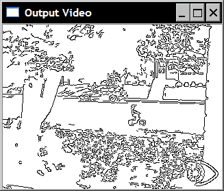
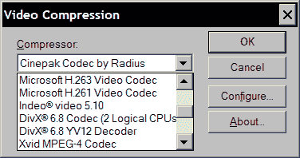
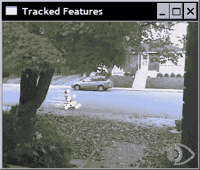
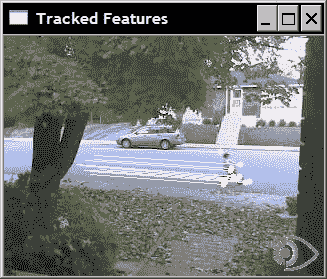
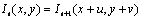
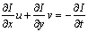

# 第 10 章。处理视频序列

在本章中，我们将介绍：

*   读取视频序列
*   处理视频帧
*   编写视频序列
*   跟踪视频中的特征点
*   提取视频中的前景对象

# 简介

视频信号构成了丰富的视觉信息源。 它们由一系列图像组成，这些图像称为**帧**，以固定的时间间隔（指定为**帧频**）拍摄，并显示运动场景。 随着功能强大的计算机的出现，现在可以对视频序列进行高级视觉分析，并且有时以接近或什至比实际视频帧速率更快的速率进行。 本章将向您展示如何读取，处理和存储视频序列。

我们将看到，一旦提取了视频序列的各个帧，就可以将本书中介绍的不同图像处理功能应用于它们中的每个。 此外，我们还将研究一些算法，这些算法对视频序列进行时间分析，比较相邻帧以跟踪对象，或者随着时间的推移累积图像统计信息以提取前景对象。

# 读取视频序列

要处理视频序列，我们需要能够读取其每个帧。 OpenCV 建立了一个易于使用的框架，可以从视频文件甚至从 USB 摄像机执行帧提取。 此秘籍向您展示如何使用它。

## 操作步骤

基本上，要读取视频序列的帧，您要做的就是创建`cv::VideoCapture`类的实例。 然后，您创建一个循环，该循环将提取并读取每个视频帧。 这是一个基本的`main`函数，可以简单地显示视频序列的帧：

```cpp
int main()
{
   // Open the video file
   cv::VideoCapture capture("../bike.avi");
   // check if video successfully opened
   if (!capture.isOpened())
      return 1;

   // Get the frame rate
   double rate= capture.get(CV_CAP_PROP_FPS);

   bool stop(false);
   cv::Mat frame; // current video frame
   cv::namedWindow("Extracted Frame");

   // Delay between each frame in ms
   // corresponds to video frame rate
   int delay= 1000/rate;

   // for all frames in video
   while (!stop) {

      // read next frame if any
      if (!capture.read(frame))
         break;

      cv::imshow("Extracted Frame",frame);

      // introduce a delay
      // or press key to stop
      if (cv::waitKey(delay)>=0)
            stop= true;
   }

   // Close the video file.
   // Not required since called by destructor
   capture.release();
 }
```

将显示一个窗口，视频将在该窗口上播放，如下所示：


## 工作原理

要打开视频，您只需要指定视频文件名。 这可以通过在`cv::VideoCapture`对象的构造器中提供文件名来完成。 如果已经创建了`cv::VideoCapture`，也可以使用`open`方法。 视频成功打开后（可以通过`isOpened`方法验证），就可以开始提取帧了。 通过使用带有适当标志的`get`方法，也可以在`cv::VideoCapture`对象中查询与视频文件关联的信息。 在前面的示例中，我们使用`CV_CAP_PROP_FPS`标志获得了帧速率。 由于它是泛型函数，因此即使在某些情况下会期望使用其他类型，它也总是返回`double`。 例如，将获得视频文件中的帧总数（作为整数），如下所示：

```cpp
long t= static_cast<long>(
              capture.get(CV_CAP_PROP_FRAME_COUNT));
```

查看 OpenCV 文档中可用的不同标志，以了解可以从视频中获取哪些信息。

还有`set`方法，允许您向`cv::VideoCapture`实例实例输入一些参数。 例如，可以使用`CV_CAP_PROP_POS_FRAMES`请求移至特定帧：

```cpp
// goto frame 100
double position= 100.0; 
capture.set(CV_CAP_PROP_POS_FRAMES, position);
```

您还可以使用`CV_CAP_PROP_POS_MSEC`指定位置（以毫秒为单位），或使用`CV_CAP_PROP_POS_AVI_RATIO`指定视频内部的相对位置（其中 0.0 对应于视频的开头，而 1.0 对应于视频的结尾）。 如果请求的参数设置成功，则该方法返回`true`。 请注意，获取或设置特定视频参数的可能性在很大程度上取决于用于压缩和存储视频序列的编解码器。 如果您无法使用某些参数，则可能仅仅是由于您使用的是特定的编解码器。

一旦成功打开捕获的视频（通过`isOpened`方法验证），就可以像上一节中的示例一样，通过重复调用`read`方法依次获取帧。 可以等效地调用重载的读取运算符：

```cpp
capture >> frame;
```

也可以调用两个基本方法：

```cpp
capture.grab();
capture.retrieve(frame);
```

还请注意，在我们的示例中，如何在显示每一帧时引入延迟。 使用`cv::waitKey`函数完成此操作。 在这里，我们将延迟设置为与输入视频帧速率相对应的值（如果`fps`是每秒的帧数，则 1000/fps 是两帧之间的延迟，以 ms 为单位）。 您显然可以更改此值以较慢或较快的速度显示视频。 但是，如果要显示视频帧，则要确保窗口有足够的刷新时间，插入这样的延迟很重要（由于这是低优先级的过程，因此，如果 CPU 太忙）。 `cv::waitKey`函数还允许我们通过按任意键来中断读取过程。 在这种情况下，函数将返回所按下键的 ASCII 码。 请注意，如果指定给`cv::waitKey`函数的延迟为 0，则它​​将无限期地等待用户按下某个键。 当某人想通过逐帧检查结果来跟踪过程时，此函数非常有用。

最后一条语句调用`release`方法，该方法将关闭视频文件。 但是，由于`release`也由`cv::VideoCapture`析构器调用，因此不需要此调用。

重要的是要注意，为了打开指定的视频文件，您的计算机必须安装相应的编解码器，否则`cv::VideoCapture`将无法理解输入文件。 通常，如果您能够使用计算机上的视频播放器（例如 Windows Media Player）打开视频文件，则 OpenCV 也应该能够读取此文件。

## 更多

您还可以读取连接到计算机的相机（例如 USB 相机）的视频流捕获。 在这种情况下，您只需为打开函数指定一个 ID 号（一个整数）而不是一个文件名即可。 为 ID 指定 0 将打开已安装的默认摄像机。 在这种情况下， `cv::waitKey`函数停止处理的作用变得至关重要，因为将无限次读取来自摄像机的视频流。

## 另见

本章中的秘籍“编写视频序列”具有有关视频编解码器的更多信息。

`ffmpeg.org`网站提供了一个完整的开源和跨平台解决方案，用于音频/视频读取，记录，转换和流传输。 用于操纵视频文件的 OpenCV 类是在此库之上构建的。

`Xvid.org`网站提供了一个基于 MPEG-4 标准的开源视频编解码器库，用于视频压缩。 Xvid 还有一个竞争对手 DivX ，它提供专有但免费的编解码器和软件工具。

# 处理视频帧

在本秘籍中，我们的目标是对视频序列的每个帧应用某种处理函数。 为此，我们将 OpenCV 视频捕获框架封装到我们自己的类中。 除其他事项外，此类可让我们指定每次提取新帧时都会调用的函数。

## 操作步骤

我们想要的是能够指定在视频序列的每个帧处调用的处理函数（*回调*函数）。 可以将此函数定义为接收`cv::Mat`实例并输出已处理的帧。 因此，我们将其设计为具有以下签名：

```cpp
void processFrame(cv::Mat& img, cv::Mat& out);
```

作为此类处理函数的示例，请考虑以下用于计算输入图像的 Canny 边缘的简单函数：

```cpp
void canny(cv::Mat& img, cv::Mat& out) {

   // Convert to gray
   if (img.channels()==3)
      cv::cvtColor(img,out,CV_BGR2GRAY);
   // Compute Canny edges
   cv::Canny(out,out,100,200);
   // Invert the image
   cv::threshold(out,out,128,255,cv::THRESH_BINARY_INV);
}
```

然后，让我们定义可以与回调函数相关联的视频处理类。 使用此类，过程将是创建一个类实例，指定一个输入视频文件，将回调函数附加到它，然后启动该过程。 以编程方式，这些步骤将使用我们建议的类来完成，如下所示：

```cpp
   // Create instance
   VideoProcessor processor;
   // Open video file
   processor.setInput("../bike.avi");
   // Declare a window to display the video
   processor.displayInput("Current Frame");
   processor.displayOutput("Output Frame");
   // Play the video at the original frame rate
   processor.setDelay(1000./processor.getFrameRate());
   // Set the frame processor callback function
   processor.setFrameProcessor(canny);
   // Start the process
   processor.run();
```

既然我们已经定义了如何使用此类，那么让我们描述一下它的实现。 正如人们可能期望的那样，该类包含几个成员变量，这些成员变量控制视频帧处理的不同方面：

```cpp
class VideoProcessor {

  private:

     // the OpenCV video capture object
     cv::VideoCapture capture;
     // the callback function to be called 
     // for the processing of each frame
     void (*process)(cv::Mat&, cv::Mat&);
     // a bool to determine if the 
     // process callback will be called
     bool callIt;
     // Input display window name
     std::string windowNameInput;
     // Output display window name
     std::string windowNameOutput;
     // delay between each frame processing
     int delay;
     // number of processed frames 
     long fnumber;
     // stop at this frame number
     long frameToStop;
     // to stop the processing
     bool stop;

  public:

     VideoProcessor() : callIt(true), delay(0), 
             fnumber(0), stop(false), frameToStop(-1) {}
```

第一个成员变量是`cv::VideoCapture`对象，第二个成员变量是`process`函数指针，它将指向回调函数。 可以使用相应的设置器方法指定：

```cpp
     // set the callback function that 
     // will be called for each frame
     void setFrameProcessor(
         void (*frameProcessingCallback)
                        (cv::Mat&, cv::Mat&)) {

        process= frameProcessingCallback;
     }
```

并且以下方法是打开视频文件：

```cpp
     // set the name of the video file
     bool setInput(std::string filename) {

      fnumber= 0;
      // In case a resource was already 
      // associated with the VideoCapture instance
      capture.release();
      images.clear();

      // Open the video file
      return capture.open(filename);
     }
```

在处理帧时显示它们通常很有趣。 因此，使用两种方法来创建显示窗口：

```cpp
     // to display the processed frames
     void displayInput(std::string wn) {

        windowNameInput= wn;
        cv::namedWindow(windowNameInput);
     }

     // to display the processed frames
     void displayOutput(std::string wn) {

        windowNameOutput= wn;
        cv::namedWindow(windowNameOutput);
     }

     // do not display the processed frames
     void dontDisplay() {

        cv::destroyWindow(windowNameInput);
        cv::destroyWindow(windowNameOutput);
        windowNameInput.clear();
        windowNameOutput.clear();
     }
```

如果未调用这两种方法中的任何一种，则将不会显示相应的帧。 主要方法称为`run`，它是一种包含帧提取循环的方法：

```cpp
     // to grab (and process) the frames of the sequence
     void run() {

        // current frame
        cv::Mat frame;
        // output frame
        cv::Mat output;

        // if no capture device has been set
        if (!isOpened())
           return;

        stop= false;

        while (!isStopped()) {

           // read next frame if any
           if (!readNextFrame(frame))
              break;

           // display input frame
           if (windowNameInput.length()!=0) 
              cv::imshow(windowNameInput,frame);

            // calling the process function
           if (callIt) {

            // process the frame
            process(frame, output);        
            // increment frame number
             fnumber++;

           } else {

            output= frame;
           }

           // display output frame
           if (windowNameOutput.length()!=0) 
              cv::imshow(windowNameOutput,output);

           // introduce a delay
           if (delay>=0 && cv::waitKey(delay)>=0)
            stopIt();

           // check if we should stop
           if (frameToStop>=0 && 
                 getFrameNumber()==frameToStop)
              stopIt();
        }
     }

     // Stop the processing
     void stopIt() {

        stop= true;
     }

     // Is the process stopped?
     bool isStopped() {

        return stop;
     }

     // Is a capture device opened?
     bool isOpened() {

        capture.isOpened();
     }

     // set a delay between each frame
     // 0 means wait at each frame
     // negative means no delay
     void setDelay(int d) {

        delay= d;
     }
```

此方法使用读取帧的私有方法：

```cpp
     // to get the next frame 
     // could be: video file or camera
     bool readNextFrame(cv::Mat& frame) {

           return capture.read(frame);
     }
```

人们可能还希望简单地打开并播放视频文件（而无需调用回调函数）。 因此，我们有两种方法可以指定是否要调用回调函数：

```cpp
     // process callback to be called
     void callProcess() {

        callIt= true;
     }

     // do not call process callback
     void dontCallProcess() {

        callIt= false;
     }
```

最后，该类还提供了在特定帧号处停止的可能性：

```cpp
     void stopAtFrameNo(long frame) {

        frameToStop= frame;
     }

     // return the frame number of the next frame
     long getFrameNumber() {

         // get info of from the capture device
           long fnumber= static_cast<long>(
                   capture.get(CV_CAP_PROP_POS_FRAMES));
          return fnumber; 
     }
```

如果使用此类运行本节开头介绍的代码段，则两个窗口将以原始帧速率（由`setDelay`方法引入的延迟的后果）播放输入视频和输出结果。 ），如以下两个示例所示。 这是输入视频的一帧：


相应的输出帧如下：



## 工作原理

正如我们在其他秘籍中所做的那样，我们的目标是创建一个封装视频处理算法的通用功能的类。 在此类中，视频捕获循环是通过`run`方法实现的。 它包含帧提取循环，该循环首先调用`cv::VideoCapture` OpenCV 类的`read`方法。 执行了一系列操作，但是在调用每个操作之前，将进行检查以确定是否已请求该操作。 仅当指定了输入窗口名称（使用`displayInput`方法）时，才会显示输入窗口。 仅当已指定回调函数（使用`setFrameProcessor`）时，才调用该回调函数。 仅当定义了输出窗口名称（使用`displayOutput` ）时，才会显示输出窗口。 仅当指定了延迟时才引入延迟（使用`setDelay`方法）。 最后，检查当前帧号是否已定义停止帧（使用`stopAtFrameNo` ）。

该类还包含许多获取器和设置器方法，它们基本上只是`cv::VideoCapture`框架的常规`set`和`get`方法的包装。

## 更多

我们的`VideoProcessor`类用于促进视频处理模块的部署。 几乎没有其他改进。

### 处理图像序列

有时，输入序列由一系列分别存储在不同文件中的图像组成。 我们的班级可以很容易地修改以适应这种输入。 您只需要添加一个成员变量，该变量将包含图像文件名的向量及其相应的迭代器：

```cpp
     // vector of image filename to be used as input
     std::vector<std::string> images; 
     // image vector iterator
     std::vector<std::string>::const_iterator itImg;
```

新的`setInput`方法用于指定要读取的文件名：

```cpp
     // set the vector of input images
     bool setInput(const std::vector<std::string>& imgs) {

      fnumber= 0;
      // In case a resource was already 
      // associated with the VideoCapture instance
      capture.release();

      // the input will be this vector of images
      images= imgs;
      itImg= images.begin();

      return true;
     }
```

`isOpened`方法变为：

```cpp
     // Is a capture device opened?
     bool isOpened() {

        return capture.isOpened() || !images.empty();
     }
```

最后一个需要修改的方法是专用`readNextFrame`方法，该方法将从视频或文件名的向量中读取，具体取决于已指定的输入。 测试是如果图像文件名的向量不为空，那是因为输入是图像序列。 调用带有视频文件名的`setInput`会清除此引导程序：

```cpp
     // to get the next frame 
     // could be: video file; camera; vector of images
     bool readNextFrame(cv::Mat& frame) {

        if (images.size()==0)
           return capture.read(frame);

        else {

           if (itImg != images.end()) {

              frame= cv::imread(*itImg);
              itImg++;
              return frame.data != 0;

           } else {

              return false;
           }
        }
     }
```

### 使用帧处理器类

在面向对象的上下文中，使用框架处理类代替框架处理函数可能更有意义。 实际上，一个类将使程序员在定义视频处理算法时具有更大的灵活性。 因此，我们可以定义一个接口，希望在`VideoProcessor`内部使用的任何类都需要实现：

```cpp
// The frame processor interface
class FrameProcessor {

  public:
   // processing method
   virtual void process(cv:: Mat &input, cv:: Mat &output)= 0;
};
```

设置器方法允许您输入指向`VideoProcessor`框架的`FrameProcessor`实例的指针：

```cpp
     // set the instance of the class that 
     // implements the FrameProcessor interface
     void setFrameProcessor(FrameProcessor* frameProcessorPtr)
     {

        // invalidate callback function
        process= 0;
        // this is the frame processor instance 
        // that will be called
        frameProcessor= frameProcessorPtr;
        callProcess();
     }
```

指定帧处理器类实例后，它将使之前可能已经设置的任何帧处理函数失效。 现在，如果指定了帧处理函数，则同样适用：

```cpp
     // set the callback function that will 
     // be called for each frame
     void setFrameProcessor(
        void (*frameProcessingCallback)(cv::Mat&, cv::Mat&)) {

        // invalidate frame processor class instance
        frameProcessor= 0;
        // this is the frame processor function that 
        // will be called
        process= frameProcessingCallback;
        callProcess();
     }
```

并修改了`run`方法的`while`循环以考虑到此修改：

```cpp
        while (!isStopped()) {

           // read next frame if any
           if (!readNextFrame(frame))
              break;

           // display input frame
           if (windowNameInput.length()!=0) 
              cv::imshow(windowNameInput,frame);

 // ** calling the process function or method **
 if (callIt) {

 // process the frame
 if (process) // if call back function
 process(frame, output);
 else if (frameProcessor) 
 // if class interface instance
 frameProcessor->process(frame,output);
 // increment frame number
 fnumber++;

 } else {

 output= frame;
 }

           // display output frame
           if (windowNameOutput.length()!=0) 
              cv::imshow(windowNameOutput,output);

           // introduce a delay
           if (delay>=0 && cv::waitKey(delay)>=0)
            stopIt();

           // check if we should stop
           if (frameToStop>=0 && 
                getFrameNumber()==frameToStop)
              stopIt();
        }
```

## 另见

本章视频中的秘籍“跟踪特征点”说明了如何使用`FrameProcessor`类接口。

# 编写视频序列

在先前的秘籍中，我们学习了如何读取视频文件并提取其帧。 此秘籍将向您展示如何编写帧并因此创建视频文件。 这将使我们能够完成典型的视频处理链：读取输入的视频流，处理其帧，然后将结果存储在视频文件中。

## 操作步骤

让我们扩展`VideoProcessor`类，以使其具有写入视频文件的能力。 这是使用 OpenCV `cv::VideoWriter`类完成的。 因此，它的一个实例被添加为我们的类的成员（加上其他一些成员变量）：

```cpp
class VideoProcessor {

  private:

...
     // the OpenCV video writer object
     cv::VideoWriter writer;
     // output filename
     std::string outputFile;
     // current index for output images
     int currentIndex;
     // number of digits in output image filename
     int digits;
     // extension of output images
     std::string extension;
```

一种额外的方法用于指定（并打开）输出视频文件：

```cpp
     // set the output video file
     // by default the same parameters than 
     // input video will be used
     bool setOutput(const std::string &filename, 
                    int codec=0, double framerate=0.0, 
                    bool isColor=true) {

        outputFile= filename;
        extension.clear();

        if (framerate==0.0) 
           framerate= getFrameRate(); // same as input

        char c[4];
        // use same codec as input
        if (codec==0) { 
           codec= getCodec(c);
        }

        // Open output video
        return writer.open(outputFile, // filename
           codec,          // codec to be used 
           framerate,      // frame rate of the video
           getFrameSize(), // frame size
           isColor);       // color video?
     }
```

打开视频文件后，可以通过重复调用`cv::VideoWriter`类的`write`方法来向其中添加帧。 与前面的秘籍一样，我们还希望为用户提供将帧写为单独图像的可能性。 因此，专用`writeNextFrame`方法处理以下两种可能的情况：

```cpp
     // to write the output frame 
     // could be: video file or images
     void writeNextFrame(cv::Mat& frame) {

        if (extension.length()) { // then we write images

           std::stringstream ss;
           // compose the output filename
           ss << outputFile << std::setfill('0') 
               << std::setw(digits) 
               << currentIndex++ << extension;
           cv::imwrite(ss.str(),frame);

        } else { // then write to video file

           writer.write(frame);
        }
     }
```

对于输出由单个图像文件组成的情况，我们需要一个附加的设置器方法：

```cpp
     // set the output as a series of image files
     // extension must be ".jpg", ".bmp" ...
     bool setOutput(const std::string &filename, // prefix
        const std::string &ext, // image file extension 
        int numberOfDigits=3,   // number of digits
        int startIndex=0) {     // start index

        // number of digits must be positive
        if (numberOfDigits<0)
           return false;

        // filenames and their common extension
        outputFile= filename;
        extension= ext;

        // number of digits in the file numbering scheme
        digits= numberOfDigits;
        // start numbering at this index
        currentIndex= startIndex;

        return true;
     }
```

然后，将新步骤添加到`run`方法的视频捕获循环中：

```cpp
        while (!isStopped()) {

           // read next frame if any
           if (!readNextFrame(frame))
              break;

           // display input frame
           if (windowNameInput.length()!=0) 
              cv::imshow(windowNameInput,frame);

            // calling the process function or method
           if (callIt) {

            // process the frame
            if (process)
                process(frame, output);
            else if (frameProcessor) 
               frameProcessor->process(frame,output);
            // increment frame number
            fnumber++;

           } else {

            output= frame;
           }

 // ** write output sequence **
 if (outputFile.length()!=0)
 writeNextFrame(output);

           // display output frame
           if (windowNameOutput.length()!=0) 
              cv::imshow(windowNameOutput,output);

           // introduce a delay
           if (delay>=0 && cv::waitKey(delay)>=0)
            stopIt();

           // check if we should stop
           if (frameToStop>=0 &&
                  getFrameNumber()==frameToStop)
              stopIt();
        }
     }
```

然后，将编写一个简单的程序来读取视频，对其进行处理并将结果写入视频文件：

```cpp
   // Create instance
   VideoProcessor processor;

   // Open video file
   processor.setInput("../bike.avi");
   processor.setFrameProcessor(canny);
   processor.setOutput("../bikeOut.avi");
   // Start the process
   processor.run();
```

如果要将结果另存为一系列图像，则可以通过以下命令更改前面的语句：

```cpp
   processor.setOutput("../bikeOut",".jpg");
```

使用默认数字位数（3）和起始索引（0），这将创建文件`bikeOut000.jpg`，`bikeOut001.jpg`和`bikeOut002.jpg`，依此类推。

## 工作原理

将视频写入文件后，将使用编解码器将其保存。 **编解码器**是一种能够对视频流进行编码和解码的软件模块。 编解码器同时定义了文件格式和用于存储信息的压缩方案。 显然，已使用给定编解码器编码的视频必须使用相同的编解码器进行解码。 因此，已将四字符代码引入唯一标识的编解码器。 这样，当软件工具需要编写视频文件时，它将通过读取指定的四字符代码来确定要使用的编解码器。

顾名思义，四字符代码由四个 ASCII 字符组成，也可以通过将它们附加在一起将其转换为整数。 使用打开的`cv::VideoCapture`实例的`get`方法的`CV_CAP_PROP_FOURCC`标志，可以获得打开的视频文件的此代码。 我们可以在`VideoProcessor`类中定义一个方法，以返回输入视频的四字符代码：

```cpp
     // get the codec of input video
     int getCodec(char codec[4]) {

        // undefined for vector of images
        if (images.size()!=0) return -1;

        union { // data structure for the 4-char code
           int value;
           char code[4]; } returned;

        // get the code
        returned.value= static_cast<int>(
                           capture.get(CV_CAP_PROP_FOURCC));

        // get the 4 characters
        codec[0]= returned.code[0];
        codec[1]= returned.code[1];
        codec[2]= returned.code[2];
        codec[3]= returned.code[3];

        // return the int value corresponding to the code
        return returned.value;
     }
```

`get`方法始终返回`double`，然后将其转换为整数。 该整数表示可使用`union`数据结构从中提取四个字符的代码。 如果我们打开测试视频序列，则从以下语句开始：

```cpp
   char codec[4];
   processor.getCodec(codec);
   std::cout << "Codec: " << codec[0] << codec[1] 
             << codec[2] << codec[3] << std::endl;
```

我们获得：

```cpp
Codec : XVID
```

写入视频文件时，必须使用其四个字符的代码指定编解码器。 这是`cv::VideoWriter`类的`open`方法中的第二个参数。 例如，您可以使用与输入视频相同的视频（这是`setOutput`方法中的默认选项）。 您还可以传递值 -1，该方法将弹出一个窗口，要求您从可用编解码器列表中选择一个，如下所示：



您将在此窗口中看到的列表与计算机上已安装的编解码器的列表相对应。 然后，所选编解码器的代码将自动发送到`open`方法。

# 跟踪视频中的特征点

本章是关于读取，写入和处理视频序列的。 目的是能够分析完整的视频序列。 例如，在本秘籍中，您将学习如何对序列进行时间分析，以便跟踪特征点在帧之间移动的情况。

## 操作步骤

要开始跟踪过程，首先要做的是检测初始帧中的特征点。 然后，您尝试在下一帧中跟踪这些点。 您必须找到这些点现在在此新框架中的位置。 显然，由于我们正在处理视频序列，因此很有可能在其上找到了特征点的对象已经移动（该运动也可能是由于摄像机的运动引起的）。 因此，必须在一个点的先前位置附近搜索，以便在下一帧中找到它的新位置。 这就是完成`cv::calcOpticalFlowPyrLK`函数的功能。 您在第一张图像中输入两个连续的帧和一个特征点向量，该函数将返回新点位置的向量。 要跟踪完整序列上的点，请逐帧重复此过程。 请注意，当您沿着序列中的点进行跟踪时，不可避免地会失去对其中某些点的跟踪，从而跟踪的特征点的数量将逐渐减少。 因此，不时检测新特征可能是一个好主意。

现在，我们将利用先前秘籍中定义的框架，并定义一个类，该类实现在本章“处理视频帧”秘籍中引入的`FrameProcessor`接口。 此类的数据属性包括执行特征点检测及其跟踪所需的变量：

```cpp
class FeatureTracker : public FrameProcessor {

   cv::Mat gray;         // current gray-level image
   cv::Mat gray_prev;      // previous gray-level image
   // tracked features from 0->1
   std::vector<cv::Point2f> points[2]; 
   // initial position of tracked points
   std::vector<cv::Point2f> initial;   
   std::vector<cv::Point2f> features;  // detected features
   int max_count;     // maximum number of features to detect
   double qlevel;    // quality level for feature detection
   double minDist;   // min distance between two points
   std::vector<uchar> status; // status of tracked features
   std::vector<float> err;    // error in tracking

  public:

   FeatureTracker() : max_count(500), 
                      qlevel(0.01), minDist(10.) {}
```

接下来，我们定义`process`方法，该方法将为序列的每个帧调用。 基本上，我们需要进行如下操作。 首先，必要时检测特征点。 接下来，跟踪这些点。 您拒绝无法追踪或不再想要追踪的点。 现在您可以处理成功跟踪的点了。 最后，当前帧及其点成为前一帧，并为下一次迭代提供点。 这是操作方法：

```cpp
   void process(cv:: Mat &frame, cv:: Mat &output) {

      // convert to gray-level image
      cv::cvtColor(frame, gray, CV_BGR2GRAY); 
      frame.copyTo(output);

      // 1\. if new feature points must be added
      if(addNewPoints())
      {
         // detect feature points
         detectFeaturePoints();
         // add the detected features to 
         // the currently tracked features
         points[0].insert(points[0].end(),
                          features.begin(),features.end());
         initial.insert(initial.end(),
                        features.begin(),features.end());
      }

      // for first image of the sequence
      if(gray_prev.empty())
           gray.copyTo(gray_prev);

      // 2\. track features
      cv::calcOpticalFlowPyrLK(
         gray_prev, gray, // 2 consecutive images
         points[0], // input point positions in first image
         points[1], // output point positions in the 2nd image
         status,    // tracking success
         err);      // tracking error

      // 2\. loop over the tracked points to reject some
      int k=0;
      for( int i= 0; i < points[1].size(); i++ ) {

         // do we keep this point?
         if (acceptTrackedPoint(i)) {

            // keep this point in vector
            initial[k]= initial[i];
            points[1][k++] = points[1][i];
         }
      }

      // eliminate unsuccesful points
        points[1].resize(k);
      initial.resize(k);

      // 3\. handle the accepted tracked points
      handleTrackedPoints(frame, output);

      // 4\. current points and image become previous ones
      std::swap(points[1], points[0]);
      cv::swap(gray_prev, gray);
   }
```

该方法利用了其他四个工具方法。 您应该很容易地更改任何这些方法，以便为自己的跟踪器定义新的行为。 这些方法中的第一个检测特征点。 请注意，我们已经在第 8 章的第一个秘籍中讨论了`cv::goodFeatureToTrack`函数：

```cpp
   // feature point detection
   void detectFeaturePoints() {

      // detect the features
      cv::goodFeaturesToTrack(gray, // the image 
         features,   // the output detected features
         max_count,  // the maximum number of features 
         qlevel,     // quality level
         minDist);   // min distance between two features
   }
```

第二个确定是否应检测到新的特征点：

```cpp
   // determine if new points should be added
   bool addNewPoints() {

      // if too few points
      return points[0].size()<=10;
   }
```

第三个基于应用定义的标准拒绝某些跟踪点。 在这里，我们决定拒绝不移动的点（除了`cv::calcOpticalFlowPyrLK`函数无法跟踪的点）：

```cpp
   // determine which tracked point should be accepted
   bool acceptTrackedPoint(int i) {

      return status[i] &&
         // if point has moved
         (abs(points[0][i].x-points[1][i].x)+
         (abs(points[0][i].y-points[1][i].y))>2);
   }
```

最后，第四种方法通过在当前帧上绘制所有被跟踪的点，并用一条线将它们连接到其初始位置（即第一次检测到它们的位置）来处理被跟踪的特征点：

```cpp
   // handle the currently tracked points
   void handleTrackedPoints(cv:: Mat &frame, 
                            cv:: Mat &output) {

      // for all tracked points
      for(int i= 0; i < points[1].size(); i++ ) {

         // draw line and circle
         cv::line(output, 
                  initial[i],  // initial position 
                  points[1][i],// new position 
                  cv::Scalar(255,255,255));
         cv::circle(output, points[1][i], 3, 
                    cv::Scalar(255,255,255),-1);
      }
   }
```

然后将编写一个简单的`main`函数来跟踪视频序列中的特征点，如下所示：

```cpp
int main()
{
   // Create video procesor instance
   VideoProcessor processor;

   // Create feature tracker instance
   FeatureTracker tracker;

   // Open video file
   processor.setInput("../bike.avi");

   // set frame processor
   processor.setFrameProcessor(&tracker);

   // Declare a window to display the video
   processor.displayOutput("Tracked Features");

   // Play the video at the original frame rate
   processor.etDelayetDelay(1000./processor.getFrameRate());

   // Start the process
   processor.run();
}
```

生成的程序将显示跟踪的特征随时间的变化。 例如，这是两个不同时刻的两个这样的帧。 在此视频中，摄像机是固定的。 因此，年轻的自行车手是唯一的运动对象。 这是视频开头的一帧：



几秒钟后，我们得到以下帧：



## 工作原理

要从一帧到另一帧跟踪特征点，我们必须在下一帧中找到特征点的新位置。 如果我们假设特征点的强度从一帧到下一帧都没有变化，那么我们正在寻找位移`(u, v)`使得：



其中`It`和`It + 1`分别是当前帧和下一瞬间的帧。 这种恒定强度的假设通常适用于两个接近瞬间拍摄的图像中的小位移。 然后，我们可以使用泰勒展开来通过包含图像导数的方程式近似该方程式：


后面的方程式将我们引到另一个方程式（由于恒定强度假设的结果）：



这个众所周知的约束是基本的**光流**约束方程。 所谓的 Lukas-Kanade 特征跟踪算法通过进行额外的假设来利用它。 特征点附近的所有点的位移都相同。 因此，我们可以对所有这些点施加唯一的`(u, v)`未知位移的光流约束。 与未知数（2）相比，这给了我们更多的方程式，因此我们可以在均方意义上求解该方程式。 在实践中，它是迭代解决的，并且 OpenCV 实现还提供了以不同分辨率执行此估计的可能性，以使搜索更有效且更能容忍更大的位移。 默认情况下，图像级别数为 3，窗口大小为 15。显然，可以更改这些参数。 您还可以指定终止条件，该条件定义了停止迭代搜索的条件。 `cv::calcOpticalFlowPyrLK`的第六个参数包含可用于评估跟踪质量的残留均方误差。 第五个参数包含二进制标志，这些标志告诉我们跟踪相应点是否被视为成功。

上面的描述代表了 Lukas-Kanade 跟踪器背后的基本原理。 当前的实现包含其他优化和改进，以使该算法在计算大量特征点的位移时更加高效。

## 另见

本书的第 8 章讨论了特征点检测。

```cpp
The classic article by B. Lucas and T. Kanade, An iterative image registration technique with an application to stereo vision in Int. Joint Conference in Artificial Intelligence, pp. 674-679, 1981, that describes the original feature point tracking algorithm.

The article by J. Shi and C. Tomasi, Good Features to Track in IEEE Conference on Computer Vision and Pattern Recognition, pp. 593-600, 1994, that describes an improved version of the original feature point tracking algorithm.
```

# 提取视频中的前景对象

当固定摄像机观察到场景时，背景大部分保持不变。 在这种情况下，有趣的元素是在此场景内演化的运动对象。 为了提取这些前景对象，我们需要构建背景模型，然后将该模型与当前帧进行比较以检测任何前景对象。 这就是我们在本秘籍中要做的。 前景提取是智能监控应用中的基本步骤。

## 操作步骤

如果我们可以使用场景背景的图像（即一个不包含前景对象的帧），那么通过一个简单的图像差异就可以很容易地提取当前帧的前景：

```cpp
   // compute difference between current image and background
   cv::absdiff(backgroundImage,currentImage,foreground);
```

然后，将其差异足够大的每个像素声明为前景像素。 但是，在大多数情况下，此背景图片并不容易获得。 确实，要保证给定图像和繁忙场景中不存在前景物体可能很困难，因此这种情况很少发生。 此外，背景场景通常随时间变化，例如因为照明条件可能发生变化（例如，从日出到日落），或者因为可以在背景中添加或移除新对象。

因此，有必要动态建立背景场景的模型。 这可以通过观察场景一段时间来完成。 如果我们假设大多数情况下背景在每个像素位置都是可见的，那么简单地计算所有观测值的平均值可能是一个很好的策略。 但这由于许多原因是不可行的。 首先，这将需要在计算背景之前存储大量图像。 其次，当我们累积图像以计算平均图像时，将不会进行前景提取。 该解决方案还提出了应累积何时和多少图像以计算可接受的背景模型的问题。 另外，给定像素正在观察前景对象的图像将对平均背景的计算产生影响。

更好的策略是通过定期更新来动态构建背景模型。 这可以通过计算所谓的移动平均值（也称为**滑动平均值**）来实现。 这是一种计算时间信号平均值的方法，该方法考虑了收到的最新值。 如果`pt`是给定时间`t`的像素值，而`μt-1`是当前平均值，则使用以下公式更新该平均值：


参数α称为学习率，它定义了当前值对当前估计平均值的影响。 该值越大，移动平均值将越快地适应观测值的变化。 要建立背景模型，只需计算输入帧中每个像素的移动平均值。 然后，仅基于当前图像和背景模型之间的差异来决定是否声明前景像素。

然后让我们构建一个实现此想法的类：

```cpp
class BGFGSegmentor : public FrameProcessor {

   cv::Mat gray;         // current gray-level image
   cv::Mat background;      // accumulated background
   cv::Mat backImage;      // background image
   cv::Mat foreground;      // foreground image
   // learning rate in background accumulation
   double learningRate;    
   int threshold;         // threshold for foreground extraction

  public:

   BGFGSegmentor() : threshold(10), learningRate(0.01) {}
```

然后，主要过程包括将当前帧与背景模型进行比较，然后更新此模型：

```cpp
   // processing method
   void process(cv:: Mat &frame, cv:: Mat &output) {

      // convert to gray-level image
      cv::cvtColor(frame, gray, CV_BGR2GRAY); 

      // initialize background to 1st frame
      if (background.empty())
         gray.convertTo(background, CV_32F);

      // convert background to 8U
      background.convertTo(backImage,CV_8U);

      // compute difference between image and background
      cv::absdiff(backImage,gray,foreground);

      // apply threshold to foreground image        
      cv::threshold(foreground,output,
                    threshold,255,cv::THRESH_BINARY_INV);

      // accumulate background
      cv::accumulateWeighted(gray, background, 
                             learningRate, output);
   }
```

使用我们的视频处理框架，前景提取程序将按以下方式构建：

```cpp
int main()
{
   // Create video procesor instance
   VideoProcessor processor;

   // Create background/foreground segmentor 
   BGFGSegmentor segmentor;
   segmentor.setThreshold(25);

   // Open video file
   processor.setInput("../bike.avi");

   // set frame processor
   processor.setFrameProcessor(&segmentor);

   // Declare a window to display the video
   processor.displayOutput("Extracted Foreground");

   // Play the video at the original frame rate
   processor.setDelay(1000./processor.getFrameRate());

   // Start the process
   processor.run();
}
```

将显示的结果二进制前景图像之一是：


## 工作原理

通过`cv::accumulateWeighted`函数可以轻松地计算图像的运行平均值，该函数将运行平均值公式应用于图像的每个像素。 请注意，生成的图像必须是浮点图像。 这就是为什么我们必须先将背景模型转换为背景图像，然后再将其与当前帧进行比较。 一个简单的阈值绝对差（由`cv::absdiff` ，然后由`cv::threshold`计算）提取前景图像。 请注意，然后我们将前景图像用作`cv::accumulateWeighted`的遮罩，以避免更新声明为前景的像素。 之所以可行，是因为我们的前景图像在前景像素处被定义为假（即 0）（这也解释了为什么前景对象在结果图像中显示为黑色像素）。

最后，应注意，为简单起见，由我们的程序构建的背景模型是基于提取帧的灰度版本的。 维持彩色背景将需要计算每个像素每个通道的移动平均值。 通常，这种额外的计算不会显着改善结果。 而是，主要困难是确定阈值的适当值，该阈值将为给定视频提供良好的结果。

## 更多

前面提取场景中前景对象的简单方法非常适合显示相对稳定背景的简单场景。 但是，在许多情况下，背景场景可能在某些区域中的不同值之间波动，从而导致频繁的虚假前景检测。 例如，这可能是由于移动的背景对象（例如，树叶）或炫耀效果（例如，在水面上）引起的。 为了解决这个问题，已经引入了更复杂的背景建模方法。

### 高斯方法的混合

这些算法之一是高斯方法的混合。 它以与本秘籍中介绍的方法类似的方式进行，但有以下补充：

首先，该方法每个像素维护一个以上的模型（即，多个运行平均值）。 这样，如果背景像素在两个值之间波动，那么将存储两个移动平均值。 仅当新像素值不属于任何维护的模型时，才将其声明为前景。

其次，不仅要维护每个模型的运行平均值，还要维护运行方差。 这一计算如下：


计算的平均值和方差形成高斯模型，从中可以估计给定像素值属于该高斯模型的概率。 由于现在将阈值表示为概率而不是绝对差，因此这使确定合适的阈值更加容易。 另外，在背景值具有较大波动的区域中，将需要更大的差异来声明前景对象。

实际上，当给定的高斯模型没有足够频繁地命中时，它被排除为背景模型的一部分。 相反，当发现像素值不在当前维护的背景模型之外（即，它是前景像素）时，将创建一个新的高斯模型。 如果将来，如果此新模型频繁使用，那么它将与背景相关联。

这种更复杂的算法显然比我们简单的背景/前景分割器更复杂。 幸运的是，存在一个称为`cv::BackgroundSubtractorMOG`的 OpenCV 实现，它被定义为更通用的`cv::BackgroundSubtractor`类的子类。 与默认参数一起使用时，此类非常易于使用：

```cpp
int main()
{
   // Open the video file
    cv::VideoCapture capture("../bike.avi");
   // check if video successfully opened
   if (!capture.isOpened())
      return 0;

   // current video frame
   cv::Mat frame; 
   // foreground binary image
   cv::Mat foreground;

   cv::namedWindow("Extracted Foreground");

   // The Mixture of Gaussian object
   // used with all default parameters
   cv::BackgroundSubtractorMOG mog;

   bool stop(false);
   // for all frames in video
   while (!stop) {

      // read next frame if any
      if (!capture.read(frame))
         break;

      // update the background
      // and return the foreground
      mog(frame,foreground,0.01);

      // Complement the image        
      cv::threshold(foreground,foreground,
                    128,255,cv::THRESH_BINARY_INV);

      // show foreground
      cv::imshow("Extracted Foreground",foreground);

      // introduce a delay
      // or press key to stop
      if (cv::waitKey(10)>=0)
            stop= true;
   }
}
```

可以看出，只需创建类实例并调用同时更新背景并返回前景图像的方法即可（额外的参数是学习率）。 显示的细分之一将是：


每个像素可能的高斯模型的数量构成此类的参数之一。

## 另见

```cpp
The article by C. Stauffer and W.E.L. Grimson, Adaptive background mixture models for real-time tracking, in Conf. on Computer Vision and Pattern Recognition, 1999, for a more complete description of the Mixture of Gaussian algorithm.
```