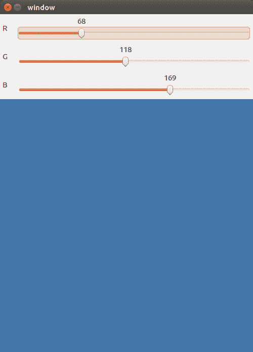
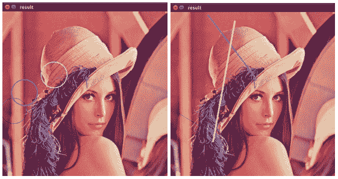
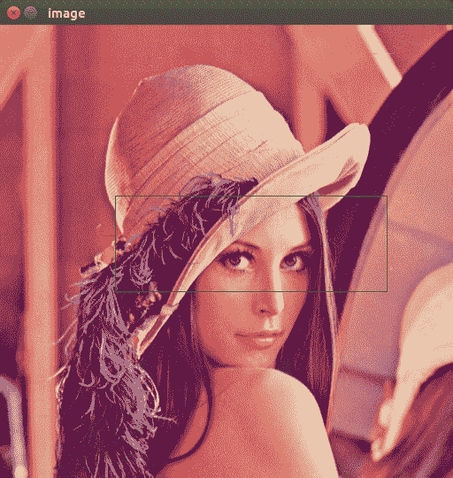
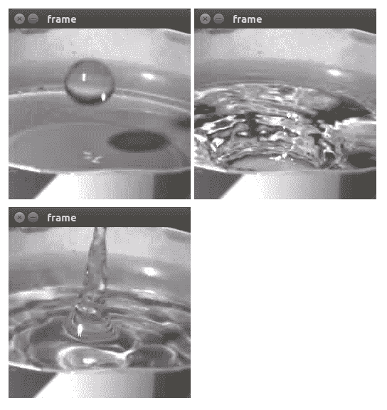
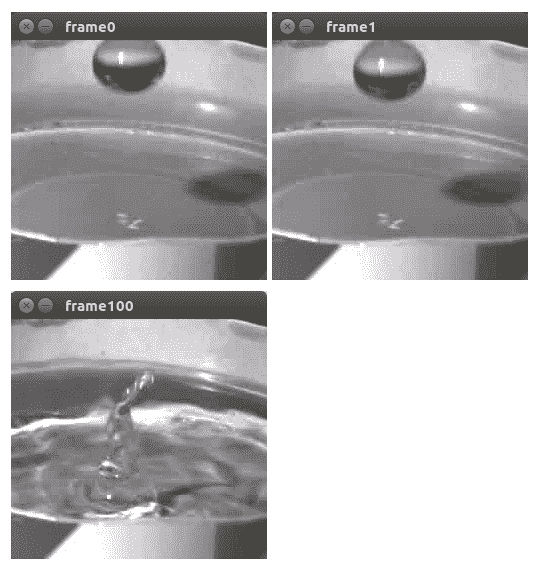

# I/O 和 GUI

在本章中，我们将介绍以下秘籍：

*   从文件读取图像
*   简单的图像转换 - 调整大小和翻转
*   使用有损和无损压缩保存图像
*   在 OpenCV 窗口中显示图像
*   在 OpenCV 窗口中使用 UI 元素，例如按钮和轨迹栏
*   绘制 2D 基本体-标记，直线，椭圆，矩形和文本
*   处理来自键盘的用户输入
*   通过处理鼠标的用户输入来使您的应用具有交互性
*   从相机捕获并显示帧
*   播放视频中的帧流
*   获取帧流属性
*   将帧流写入视频
*   在视频文件的帧之间跳转

# 介绍

计算机视觉算法消耗并产生数据-它们通常将图像作为输入并生成输入的特征，例如轮廓，感兴趣的点或区域，对象的边界框或其他图像。 因此，处理图形信息的输入和输出是任何计算机视觉算法的重要组成部分。 这不仅意味着要读取和保存图像，还要显示有关其功能的其他信息。

在本章中，我们将介绍与 I/O 功能相关的基本 OpenCV 功能。 从秘籍中，您将学习如何从不同来源（文件系统或照相机）获取图像，显示它们以及保存图像和视频。 此外，本章还涉及使用 OpenCV UI 系统的主题。 例如，在创建窗口和跟踪栏时。

# 从文件读取图像

在本秘籍中，我们将学习如何从文件中读取图像。 OpenCV 支持读取不同格式的图像，例如 PNG，JPEG 和 TIFF。 让我们编写一个程序，该程序将图像的路径作为第一个参数，读取图像并打印其形状和大小。

# 准备

您需要安装带有 Python API 支持的 OpenCV3.x。

# 操作步骤

对于此秘籍，您需要执行以下步骤：

1.  您可以使用`cv2.imread`函数轻松读取图像，该功能带有图像路径和可选标志：

```py
import argparse
import cv2
parser = argparse.ArgumentParser()
parser.add_argument('--path', default='../data/Lena.png', help='Image path.')
params = parser.parse_args()
img = cv2.imread(params.path)
```

2.  有时检查图像是否成功加载很有用：

```py
assert img is not None  # check if the image was successfully loaded
print('read {}'.format(params.path))
print('shape:', img.shape)
print('dtype:', img.dtype)
```

3.  加载图像并将其转换为灰度，即使它最初具有许多颜色通道也是如此：

```py
img = cv2.imread(params.path, cv2.IMREAD_GRAYSCALE)
assert img is not None
print('read {} as grayscale'.format(params.path))
print('shape:', img.shape)
print('dtype:', img.dtype)
```

# 工作原理

加载的图像表示为 NumPy 数组。 在 OpenCV 中，矩阵使用相同的表示形式。 NumPy 数组具有诸如`shape`（它是图像的大小和颜色通道数）和`dtype`（它是基础数据类型（例如`uint8`或`float32`））的属性。 请注意，OpenCV 以 BGR 而非 RGB 格式加载图像。

在这种情况下，`shape`元组应解释为：图像高度，图像宽度，颜色通道数。

`cv.imread`函数还支持可选标志，用户可以在其中指定是否应执行向`uint8`类型的转换以及图像是灰度还是彩色的。

使用默认参数运行代码后，您应该看到以下输出：

```py
read ../data/Lena.png
shape: (512, 512, 3)
dtype: uint8

read ../data/Lena.png as grayscale
shape: (512, 512)
dtype: uint8
```

# 简单的图像转换 - 调整大小和翻转

现在我们可以加载图像了，该进行一些简单的图像处理了。 我们要检查的操作（调整大小和翻转）是基本操作，通常用作复杂的计算机视觉算法的预备步骤。

# 准备

您需要安装带有 Python API 支持的 OpenCV3.x。

# 操作步骤

对于此秘籍，我们需要执行以下步骤：

1.  加载图像并打印其原始尺寸：

```py
img = cv2.imread('../data/Lena.png')
print('original image shape:', img.shape)
```

2.  OpenCV 提供了几种使用`cv2.resize`函数的方法。 我们可以将以像素为单位的目标大小（`width`，`height`）设置为第二个参数：

```py
width, height = 128, 256
resized_img = cv2.resize(img, (width, height))
print('resized to 128x256 image shape:', resized_img.shape)
```

3.  通过设置图像原始宽度和高度的倍数来调整大小：

```py
w_mult, h_mult = 0.25, 0.5
resized_img = cv2.resize(img, (0, 0), resized_img, w_mult, h_mult)
print('image shape:', resized_img.shape)
```

4.  使用最近邻插值而不是默认插值来调整大小：

```py
w_mult, h_mult = 2, 4
resized_img = cv2.resize(img, (0, 0), resized_img, w_mult, h_mult, cv2.INTER_NEAREST)
print('half sized image shape:', resized_img.shape)
```

5.  沿其水平`x`轴反射图像。 为此，我们应该将`0`作为`cv2.flip`函数的最后一个参数传递：

```py
img_flip_along_x = cv2.flip(img, 0)
```

6.  当然，可以沿垂直`y`轴翻转图像-只要传递大于`0`的任何值即可：

```py
img_flip_along_y = cv2.flip(img, 1)
```

7.  通过将任何负值传递给函数，我们可以同时翻转`x`和`y`：

```py
img_flipped_xy = cv2.flip(img, -1)
```

# 工作原理

我们可以在`cv2.resize`中使用插值模式-它定义如何计算像素之间的值。 有很多类型的插值，每种插值都有不同的结果。 该参数可以作为最后一个参数传递，并且不影响结果的大小-仅影响输出的质量和平滑度。

默认情况下，使用双线性插值（`cv2.INTER_LINEAR`）。 但是在某些情况下，可能有必要应用其他更复杂的选项。

`cv2.flip`函数用于镜像图像。 它不会更改图像的大小，而是会交换像素。

# 使用有损和无损压缩保存图像

此秘籍将教您如何保存图像。 有时您想从计算机视觉算法中获取反馈。 一种方法是将结果存储在磁盘上。 反馈可能是最终图像，带有其他信息（例如轮廓，度量，值等）的图片，或者是复杂管道中各个步骤的结果。

# 准备

您需要安装带有 Python API 支持的 OpenCV3.x。

# 操作步骤

这是此秘籍的步骤：

1.  首先，读取图片：

```py
img = cv2.imread('../data/Lena.png')
```

2.  将图像保存为 PNG 格式而不会降低质量，然后再次读取以检查在写入磁盘期间是否已保留所有信息：

```py
# save image with lower compression—bigger file size but faster decoding
cv2.imwrite('../data/Lena_compressed.png', img, [cv2.IMWRITE_PNG_COMPRESSION, 0])

# check that image saved and loaded again image is the same as original one
saved_img = cv2.imread(params.out_png)
assert saved_img.all() == img.all()
```

3.  将图像保存为 JPEG 格式：

```py
# save image with lower quality—smaller file size
cv2.imwrite('../data/Lena_compressed.jpg', img, [cv2.IMWRITE_JPEG_QUALITY, 0])
```

# 工作原理

要保存图像，应使用`cv2.imwrite`函数。 文件的格式由此功能确定，可以在文件名中看到（支持 JPEG，PNG 等）。 保存图像有两个主要选项：保存时是否丢失某些信息。

`cv2.imwrite`函数采用三个参数：输出文件的路径，图像本身以及保存的参数。 将图像保存为 PNG 格式时，我们可以指定压缩级别。 `IMWRITE_PNG_COMPRESSION`的值必须在`(0, 9)`间隔中-数字越大，磁盘上的文件越小，但是解码过程越慢。

保存为 JPEG 格式时，我们可以通过设置`IMWRITE_JPEG_QUALITY`的值来管理压缩过程。 我们可以将其设置为 0 到 100 之间的任何值。但是，在这种情况下，越大越好。 较大的值导致较高的结果质量和较少的 JPEG 伪影。

# 在 OpenCV 窗口中显示图像

OpenCV 的众多出色功能之一是您可以非常轻松地可视化图像。 在这里，我们将学习有关在 OpenCV 中显示图像的所有信息。

# 准备

您需要安装带有 Python API 支持的 OpenCV3.x。

# 操作步骤

步骤如下：

1.  加载图像以使用某些东西并获取其大小：

```py
orig = cv2.imread('../data/Lena.png')
orig_size = orig.shape[0:2]
```

2.  现在让我们显示图像。 为此，我们需要调用`cv2.imshow`和`cv2.waitKey`函数：

```py
cv2.imshow("Original image", orig)
cv2.waitKey(2000)
```

# 工作原理

现在，让我们了解一下这些功能。 需要`cv2.imshow`函数来显示图像-它的第一个参数是窗口的名称（请参见下面的屏幕快照中的窗口标题），第二个参数是我们要显示的图像。 `cv2.waitKey`函数对于控制窗口的显示时间是必需的。

请注意，必须明确控制显示时间，否则您将看不到任何窗口。 该功能以毫秒为单位显示窗口显示时间的持续时间。 但是，如果您按键盘上的任意键，则窗口将在指定时间之前消失。 我们将在以下秘籍之一中回顾此功能。

上面的代码导致以下结果：


# 在 OpenCV 窗口中使用 UI 元素，例如按钮和轨迹栏

在本秘籍中，我们将学习如何将 UI 元素（例如按钮和轨迹栏）添加到 OpenCV 窗口中以及如何使用它们。 跟踪栏是有用的 UI 元素，它们可以：

*   显示整数变量的值（假设该值在预定义范围内）
*   让我们通过更改轨迹栏位置以交互方式更改值

让我们创建一个程序，该程序允许用户通过交互更改每个**红色**，**绿色**，**蓝色**（**RGB**）来指定图像的填充色 ）通道值。

# 准备

您需要安装带有 Python API 支持的 OpenCV3.x。

# 操作步骤

要完成此秘籍，步骤如下：

1.  首先创建一个名为`window`的 OpenCV 窗口：

```py
import cv2, numpy as np

cv2.namedWindow('window')
```

2.  创建一个变量，其中将包含图像的填充颜色值。 该变量是一个 NumPy 数组，具有三个值，这些值将被解释为`[0, 255]`范围内的蓝色，绿色和红色颜色分量（按此顺序）：

```py
fill_val = np.array([255, 255, 255], np.uint8)
```

3.  添加一个辅助函数以从每个`trackbar_callback`函数中调用。 该功能将颜色成分索引和新值用作设置：

```py
def trackbar_callback(idx, value):
    fill_val[idx] = value
```

4.  在`window`中添加三个跟踪栏，然后使用 Python `lambda`函数将每个跟踪栏回调绑定到特定的颜色组件：

```py
cv2.createTrackbar('R', 'window', 255, 255, lambda v: trackbar_callback(2, v))
cv2.createTrackbar('G', 'window', 255, 255, lambda v: trackbar_callback(1, v))
cv2.createTrackbar('B', 'window', 255, 255, lambda v: trackbar_callback(0, v))
```

5.  在一个循环中，在具有三个轨迹栏的窗口中显示图像，并同时处理键盘输入：

```py
while True:
    image = np.full((500, 500, 3), fill_val)
    cv2.imshow('window', image)
    key = cv2.waitKey(3)
    if key == 27: 
        break
cv2.destroyAllWindows()
```

# 工作原理

可能会显示如下所示的窗口，尽管它可能会有所不同，具体取决于 OpenCV 的版本及其构建方式：



# 绘制 2D 基本体 - 标记，直线，椭圆，矩形和文本

在实现第一个计算机视觉算法之后，您将希望看到其结果。 OpenCV 具有大量绘图功能，可让您突出显示图像中的任何功能。

# 准备

您需要安装带有 Python API 支持的 OpenCV3.x。

# 操作步骤

1.  打开图像并获取其宽度和高度。 另外，定义一个简单的函数，该函数将在图像内返回一个随机点：

```py
import cv2, random

image = cv2.imread('../data/Lena.png')
w, h = image.shape[1], image.shape[0]

def rand_pt(mult=1.):
    return (random.randrange(int(w*mult)),
            random.randrange(int(h*mult)))
```

2.  让我们画点东西！ 让我们画个圆圈：

```py
cv2.circle(image, rand_pt(), 40, (255, 0, 0))
cv2.circle(image, rand_pt(), 5, (255, 0, 0), cv2.FILLED)
cv2.circle(image, rand_pt(), 40, (255, 85, 85), 2)
cv2.circle(image, rand_pt(), 40, (255, 170, 170), 2, cv2.LINE_AA)
```

3.  现在让我们尝试画线：

```py
cv2.line(image, rand_pt(), rand_pt(), (0, 255, 0))
cv2.line(image, rand_pt(), rand_pt(), (85, 255, 85), 3)
cv2.line(image, rand_pt(), rand_pt(), (170, 255, 170), 3, cv2.LINE_AA)
```

4.  如果要绘制箭头，请使用`arrowedLine()`函数：

```py
cv2.arrowedLine(image, rand_pt(), rand_pt(), (0, 0, 255), 3, cv2.LINE_AA)
```

5.  要绘制矩形，OpenCV 具有`rectangle()`函数：

```py
cv2.rectangle(image, rand_pt(), rand_pt(), (255, 255, 0), 3)
```

6.  另外，OpenCV 包括绘制椭圆的功能。 让我们画一下：

```py
cv2.ellipse(image, rand_pt(), rand_pt(0.3), random.randrange(360), 0, 360, (255, 255, 255), 3)
```

7.  我们与绘图相关的最终功能是在图像上放置文本：

```py
cv2.putText(image, 'OpenCV', rand_pt(), cv2.FONT_HERSHEY_SIMPLEX, 1, (0, 0, 0), 3)
```

# 工作原理

首先，`cv2.circle`给出最薄和最暗的蓝色图元。 第二次调用绘制了一个深蓝色的点。 第三次调用会产生带有尖锐边缘的淡蓝色圆圈。 最后一个呼叫`cv2.circle`揭示了最浅的蓝色圆圈，带有平滑的边框。

`cv2.circle`函数将图像作为第一个参数，并且以（`x`，`y`）格式的中心位置，圆弧的半径和颜色作为强制参数。 您还可以指定线的粗细（`FILLED`的值提供一个实心圆）和线的类型（`LINE_AA`的提供无锯齿的边框）。

`cv2.line`函数可拍摄图像，起点和终点以及图像颜色（与第一次调用一样）。 （可选）您可以传递线的粗细和线的类型（同样，禁止混叠）。

我们将得到如下信息（位置可能因随机性而有所不同）：



`cv2.arrowedLine`函数的参数与`cv2.line`的参数相同。

`cv2.rectangle`所采用的参数是要绘制的图像，左上角，右下角和颜色。 另外，可以指定厚度（或用`FILLED`值填充矩形）。

`cv2.ellipse`拍摄图像，中心位置为（`x`，`y`）格式，半轴长度为（`a`，`b`）格式，旋转角度，绘图的起始角度，绘图的终止角度以及线条的颜色和粗细（也可以绘制填充的椭圆）作为参数。

`cv2.putText`函数的参数包括图像，所放置的文本，文本左下角的位置，字体名称，符号比例以及颜色和粗细。

# 处理来自键盘的用户输入

OpenCV 具有简单明了的方式来处理键盘输入。 此功能内置在`cv2.waitKey`函数中。 让我们看看如何使用它。

# 准备

您需要安装带有 Python API 支持的 OpenCV3.x。

# 操作步骤

您将需要针对此秘籍执行以下步骤：

1.  如前所述，打开图像并获取其宽度和高度。 另外，制作原始图像的副本，并定义一个简单函数，该函数将返回一个随机点，其图像内的坐标为：

```py
import cv2, numpy as np, random

image = cv2.imread('../data/Lena.png')
w, h = image.shape[1], image.shape[0]
image_to_show = np.copy(image)

def rand_pt():
 return (random.randrange(w),
 random.randrange(h))
```

2.  现在，当用户按下`P`，`L`，`R`，`E`或`T`绘制点，线时， 矩形，椭圆形或文本。 另外，当用户按下`C`时，我们将清除图像，并在按下`Esc`键时关闭应用：

```py
finish = False
while not finish:
    cv2.imshow("result", image_to_show)
    key = cv2.waitKey(0)
    if key == ord('p'):
        for pt in [rand_pt() for _ in range(10)]:
            cv2.circle(image_to_show, pt, 3, (255, 0, 0), -1)
    elif key == ord('l'):
        cv2.line(image_to_show, rand_pt(), rand_pt(), (0, 255, 0), 3)
    elif key == ord('r'):
        cv2.rectangle(image_to_show, rand_pt(), rand_pt(), (0, 0, 255), 3)
    elif key == ord('e'):
        cv2.ellipse(image_to_show, rand_pt(), rand_pt(), random.randrange(360), 0, 360, (255, 255, 0), 3)
    elif key == ord('t'):
        cv2.putText(image_to_show, 'OpenCV', rand_pt(), cv2.FONT_HERSHEY_SIMPLEX, 1, (0, 0, 0), 3)
    elif key == ord('c'):
        image_to_show = np.copy(image)
    elif key == 27:
        finish = True
```

# 工作原理

如您所见，我们只分析`waitKey()`返回值。 如果我们设置了持续时间并且没有按下任何键，则`waitKey()`将返回`-1`。

启动代码并按下`P`，`L`，`R`，`E`和`T`键后， 次，您将获得接近以下图像：


# 通过处理鼠标的用户输入来使您的应用具有交互性

在本秘籍中，我们将学习如何在 OpenCV 应用中启用鼠标输入的处理。 从鼠标获取事件的实例是窗口，因此我们需要使用`cv2.imshow`。 但是我们还需要添加鼠标事件的处理程序。 让我们详细了解如何通过鼠标选择图像区域来实现裁剪功能。

# 准备

您需要安装带有 Python API 支持的 OpenCV3.x。

# 操作步骤

此秘籍的步骤如下：

1.  首先，加载图像并进行复制：

```py
import cv2, numpy as np

image = cv2.imread('../data/Lena.png')
image_to_show = np.copy(image)
```

2.  现在，定义一些变量来存储鼠标状态：

```py
mouse_pressed = False
s_x = s_y = e_x = e_y = -1
```

3.  让我们实现鼠标事件的处理程序。 这应该是一个带有四个参数的函数，如下所示：

```py
def mouse_callback(event, x, y, flags, param):
    global image_to_show, s_x, s_y, e_x, e_y, mouse_pressed

    if event == cv2.EVENT_LBUTTONDOWN:
        mouse_pressed = True
        s_x, s_y = x, y
        image_to_show = np.copy(image)

    elif event == cv2.EVENT_MOUSEMOVE:
        if mouse_pressed:
            image_to_show = np.copy(image)
            cv2.rectangle(image_to_show, (s_x, s_y),
                          (x, y), (0, 255, 0), 1)

    elif event == cv2.EVENT_LBUTTONUP:
        mouse_pressed = False
        e_x, e_y = x, y
```

4.  让我们创建一个窗口实例，该实例将捕获鼠标事件并将其转换为我们先前定义的处理程序函数：

```py
cv2.namedWindow('image')
cv2.setMouseCallback('image', mouse_callback)
```

5.  现在，让我们实现应用的其余部分，它应该对按钮的按下做出反应并裁剪原始图像：

```py
while True:
    cv2.imshow('image', image_to_show)
    k = cv2.waitKey(1)

    if k == ord('c'):
        if s_y > e_y:
            s_y, e_y = e_y, s_y
        if s_x > e_x:
            s_x, e_x = e_x, s_x

        if e_y - s_y > 1 and e_x - s_x > 0:
            image = image[s_y:e_y, s_x:e_x]
            image_to_show = np.copy(image)
    elif k == 27:
        break

cv2.destroyAllWindows()
```

# 工作原理

在`cv2.setMouseCallback`中，我们将鼠标事件处理程序`mouse_callback`分配给了名为`image`的窗口。

启动后，我们可以通过以下方式选择一个区域：在图像中的某个位置按鼠标左键，将鼠标拖动到终点，然后松开鼠标按钮以确认我们的选择已完成。 我们可以通过单击一个新的位置来重复该过程-先前的选择会消失：



通过点击键盘上的`C`按钮，我们可以在选定区域内切割一个区域，如下所示：


# 从相机捕获并显示帧

在本秘籍中，您将学习如何连接到 USB 摄像机并使用 OpenCV 实时捕获帧。

# 准备

您需要安装带有 Python API 支持的 OpenCV3.x。

# 操作步骤

对于此秘籍，步骤如下：

1.  创建一个`VideoCapture`对象：

```py
import cv2

capture = cv2.VideoCapture(0)
```

2.  使用`capture.read`方法从相机读取帧，该方法返回一对：读取成功标志和`frame`本身：

```py
while True:
    has_frame, frame = capture.read()
    if not has_frame:
        print('Can\'t get frame')
        break

    cv2.imshow('frame', frame)
    key = cv2.waitKey(3)
    if key == 27:
        print('Pressed Esc')
        break
```

3.  通常建议您释放视频设备（在我们的情况下为摄像机）并销毁所有创建的窗口：

```py
capture.release()
cv2.destroyAllWindows()
```

# 工作原理

通过`cv2.VideoCapture` 类在 OpenCV 中使用摄像机。 实际上，当同时使用摄像机和视频文件时，它提供了支持。 要实例化代表来自摄像机的帧流的对象，只需指定其编号（从零开始的设备索引）。 如果 OpenCV 不支持您的摄像机，您可以尝试重新编译 OpenCV，打开其他工业摄像机类型的可选支持。

# 播放视频中的帧流

在本秘籍中，您将学习如何使用 OpenCV 打开现有的视频文件。 您还将学习如何从打开的视频中重播帧。

# 准备

您需要安装带有 Python API 支持的 OpenCV3.x。

# 操作步骤

以下是此秘籍的步骤：

1.  为视频文件创建一个`VideoCapture`对象：

```py
import cv2

capture = cv2.VideoCapture('../data/drop.avi')
```

2.  重播视频中的所有帧：

```py
while True:
    has_frame, frame = capture.read()
    if not has_frame:
        print('Reached the end of the video')
        break

    cv2.imshow('frame', frame)
    key = cv2.waitKey(50)
    if key == 27:
        print('Pressed Esc')
        break

cv2.destroyAllWindows()
```

# 工作原理

使用视频文件实际上与使用相机相同，都是通过相同的`cv2.VideoCapture`类完成的。 但是，这一次，您应该指定要打开的视频文件的路径，而不是摄像机设备的索引。 根据可用的操作系统和视频编解码器，OpenCV 可能不支持某些视频格式。

在无限`while`循环中打开视频文件后，我们使用`capture.read`方法获取帧。 该函数返回一对：布尔帧读取成功标志，以及帧本身。 请注意，将以最大可能的速率读取帧，这意味着如果要以特定的 FPS 回放视频，则应自行实现。 在前面的代码中，调用`cv2.imshow`函数后，我们在`cv2.waitKey`函数中等待 50 毫秒。 假设在显示图像和解码视频上花费的时间可以忽略不计，则视频将以不超过 20 FPS 的速率重播。

可以看到以下框架：



# 获取帧流属性

在本秘籍中，您将学习如何获取`VideoCapture`属性，例如帧高和宽度，视频文件的帧数以及相机帧频。

# 准备

您需要安装带有 Python API 支持的 OpenCV3.x。

# 操作步骤

执行以下步骤：

1.  让我们创建一个辅助函数，该函数将使用`VideoCapture` ID（摄像设备是视频设备还是视频路径），创建`VideoCapture`对象，并请求帧的高度和宽度，计数和速率：

```py
import numpy
import cv2

def print_capture_properties(*args):
    capture = cv2.VideoCapture(*args)
    print('Created capture:', ' '.join(map(str, args)))
    print('Frame count:', int(capture.get(cv2.CAP_PROP_FRAME_COUNT)))
    print('Frame width:', int(capture.get(cv2.CAP_PROP_FRAME_WIDTH)))
    print('Frame height:', int(capture.get(cv2.CAP_PROP_FRAME_HEIGHT)))
    print('Frame rate:', capture.get(cv2.CAP_PROP_FPS))
```

2.  让我们对视频文件调用这个函数：

```py
print_capture_properties('../data/drop.avi')
```

3.  现在，让我们请求相机捕获对象的属性：

```py
print_capture_properties(0)
```

# 工作原理

与早期的秘籍一样，通过`cv2.VideoCapture` 类可以处理摄像机和视频帧流。 您可以使用`capture.get`函数获取属性，该函数获取属性 ID 并将其值作为浮点值返回。

请注意，根据所使用的操作系统和视频后端，并非可以访问所有请求的属性。

预期会有以下输出（可能会因 OS 和编译 OpenCV 的视频后端而异）：

```py
Created capture: ../data/drop.avi
Frame count: 182
Frame width: 256
Frame height: 240
Frame rate: 30.0

Created capture: 0 
Frame count: -1 
Frame width: 640 
Frame height: 480 
Frame rate: 30.0
```

# 将帧流写入视频

在本秘籍中，您将学习如何从 USB 摄像机实时捕获帧，以及如何使用指定的视频编解码器将帧同时写入视频文件。

# 准备

您需要安装带有 Python API 支持的 OpenCV3.x。

# 操作步骤

这是我们需要执行以完成此秘籍的步骤：

1.  首先，像前面的秘籍一样，我们创建一个相机捕获对象，并获取框架的高度和宽度：

```py
import cv2
capture = cv2.VideoCapture(0)
frame_width = int(capture.get(cv2.CAP_PROP_FRAME_WIDTH))
frame_height = int(capture.get(cv2.CAP_PROP_FRAME_HEIGHT))
print('Frame width:', frame_width)
print('Frame height:', frame_height)
```

2.  创建视频写入器：

```py
video = cv2.VideoWriter('../data/captured_video.avi', cv2.VideoWriter_fourcc(*'X264'),
                        25, (frame_width, frame_height))
```

3.  然后，在无限`while`循环中，捕获帧并使用`video.write` 方法将其写入：

```py
while True:
    has_frame, frame = capture.read()
    if not has_frame:
        print('Can\'t get frame')
        break

    video.write(frame)

    cv2.imshow('frame', frame)
    key = cv2.waitKey(3)
    if key == 27:
        print('Pressed Esc')
        break
```

4.  释放所有创建的`VideoCapture`和`VideoWriter`对象，并销毁窗口：

```py
capture.release()
writer.release()
cv2.destroyAllWindows()
```

# 工作原理

使用`cv2.VideoWriter`类执行视频编写。 构造器采用输出视频路径**四字符代码**（**FOURCC**），指定视频代码，所需的帧速率和帧大小。 编解码器代码的示例包括用于 MPEG-1 的`P`，`I`，`M`和`1`； 用于 Motion-JPEG 的`M`，`J`，`P`和`G`； 用于 XVID MPEG-4 的`X`，`V`，`I`和`D`； 和 H.264 的`H`，`2`，`6`和`4`。

# 在视频文件的帧之间跳转

在本秘籍中，您将学习如何将`VideoCapture`对象放置在不同的帧位置。

# 准备

您需要安装带有 Python API 支持的 OpenCV3.x。

# 操作步骤

此秘籍的步骤为：

1.  首先，让我们创建一个`VideoCapture`对象并获取总帧数：

```py
import cv2
capture = cv2.VideoCapture('../data/drop.avi')
frame_count = int(capture.get(cv2.CAP_PROP_FRAME_COUNT))
print('Frame count:', frame_count)
```

2.  获取总帧数：

```py
print('Position:', int(capture.get(cv2.CAP_PROP_POS_FRAMES)))
_, frame = capture.read()
cv2.imshow('frame0', frame)
```

3.  请注意，`capture.read`方法会将当前视频位置向前移动一帧。 获取下一帧：

```py
print('Position:', capture.get(cv2.CAP_PROP_POS_FRAMES))
_, frame = capture.read()
cv2.imshow('frame1', frame)
```

4.  让我们跳到帧位置`100`：

```py
capture.set(cv2.CAP_PROP_POS_FRAMES, 100)
print('Position:', int(capture.get(cv2.CAP_PROP_POS_FRAMES)))
_, frame = capture.read()
cv2.imshow('frame100', frame)

cv2.waitKey()
cv2.destroyAllWindows()
```

# 工作原理

使用`cv2.CAP_PROP_POS_FRAMES`属性获取并设置视频位置。 根据视频的编码方式，设置属性可能不会导致设置请求的确切帧索引。 要设置的值必须在有效范围内。

运行该程序后，您应该看到以下输出：

```py
Frame count: 182
Position: 0
Position: 1
Position: 100
```

应显示以下框架：

