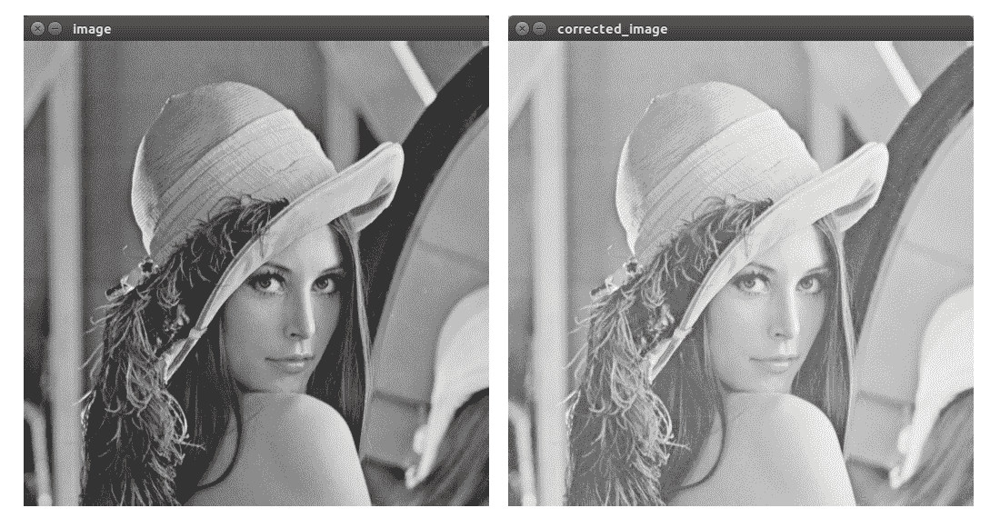
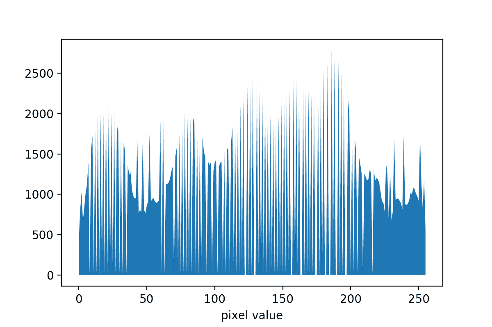
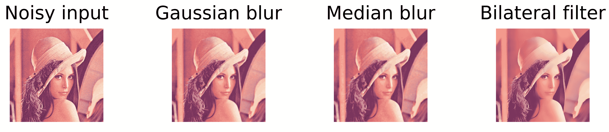
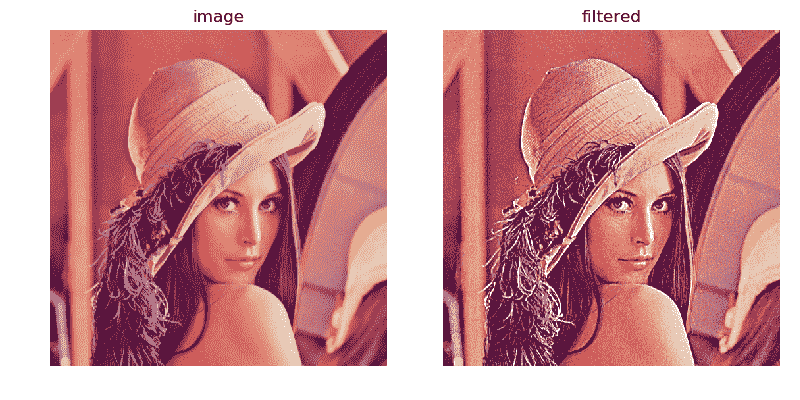
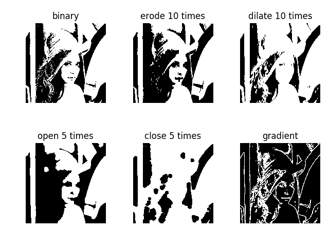

# 矩阵，颜色和滤镜

在本章中，我们将介绍以下食谱：

*   处理矩阵的创建，填充，访问元素和 ROI
*   在不同的数据类型和缩放值之间转换
*   使用 NumPy 的非图像数据持久性
*   操纵图像通道
*   将图像从一种色彩空间转换为另一种色彩空间
*   伽玛校正和逐元素数学
*   均值/方差图像归一化
*   计算图像直方图
*   均衡图像直方图
*   使用高斯，中值和双边过滤器消除噪声
*   使用 Sobel 滤镜计算梯度图像
*   创建和应用自己的过滤器
*   使用实值 Gabor 过滤器处理图像
*   使用离散傅里叶变换从空间域转到频域（并返回）
*   操纵图像频率进行图像过滤
*   处理具有不同阈值的图像
*   形态运算符
*   二进制图像-图像遮罩和二进制操作

# 介绍

在本章中，我们将了解如何处理矩阵。 我们将学习如何在像素级别使用矩阵，以及可以应用于整个矩阵的操作和图像处理程序。 您将了解如何访问任何像素，如何更改矩阵的数据类型和颜色空间，如何应用内置的 OpenCV 滤镜以及如何创建和使用自己的线性滤镜。

# 处理矩阵的创建，填充，访问元素和 ROI

本食谱介绍了矩阵的创建和初始化，对元素的访问，像素的访问以及如何处理矩阵的一部分。

# 做好准备

您需要安装带有 Python API 支持的 OpenCV3.x。

# 怎么做...

要获得结果，必须执行几个步骤：

1.  导入所有必要的模块：

```py
import cv2, numpy as np
```

2.  创建一个特定形状的矩阵，并将其填充为`255`作为值，该矩阵应显示以下内容：

```py
image = np.full((480, 640, 3), 255, np.uint8)
cv2.imshow('white', image)
cv2.waitKey()
cv2.destroyAllWindows()
```

3.  创建一个矩阵并为每个像素的颜色设置单独的值，以将我们的矩阵变为红色：

```py
image = np.full((480, 640, 3), (0, 0, 255), np.uint8)
cv2.imshow('red', image)
cv2.waitKey()
cv2.destroyAllWindows()
```

4.  用零填充矩阵以使其为黑色：

```py
image.fill(0)
cv2.imshow('black', image)
cv2.waitKey()
cv2.destroyAllWindows()
```

5.  接下来，将某些单个像素的值设置为白色：

```py
image[240, 160] = image[240, 320] = image[240, 480] = (255, 255, 255)
cv2.imshow('black with white pixels', image)
cv2.waitKey()
cv2.destroyAllWindows()
```

6.  现在，让我们将所有像素的第一个通道设置为`255`，以使黑色像素变为蓝色：

```py
image[:, :, 0] = 255
cv2.imshow('blue with white pixels', image)
cv2.waitKey()
cv2.destroyAllWindows()
```

7.  现在，将图像中间垂直线上的像素设置为白色：

```py
image[:, 320, :] = 255
cv2.imshow('blue with white line', image)
cv2.waitKey()
cv2.destroyAllWindows()
```

8.  最后，将特定区域内所有像素的第二个通道设置为`255`：

```py
image[100:600, 100:200, 2] = 255
cv2.imshow('image', image)
cv2.waitKey()
cv2.destroyAllWindows()
```

# 这个怎么运作...

OpenCV 的 Python 界面中的矩阵与 NumPy 数组一起显示。 NumPy 提供了强大而清晰的工具来处理多维矩阵（也称为张量）。 而且，当然，NumPy 支持纯二维矩阵。 这就是为什么我们需要导入其模块。 这就是为什么我们在此配方中使用大量 np 函数的原因。

在这里，有必要对矩阵的尺寸和类型说几句话。 矩阵具有两个独立的特征-形状类型和元素类型。 首先，让我们谈谈形状。 形状描述矩阵的所有尺寸。 矩阵通常具有三个空间维度：宽度（也称为列数），高度（也称为行数）和通道数。 通常以高度，宽度，频道格式进行订阅。 OpenCV 适用于全彩色或灰度矩阵。 这意味着 OpenCV 例程只能处理 3 通道或 1 通道。 可以将灰度矩阵想象成数字的平面表，其中每个元素（像素）仅存储一个值。 全彩色的可以视为表，其中每个元素连续存储三个值而不是一个。 全彩色矩阵的一个示例是分别具有红色，绿色和蓝色通道的矩阵-这意味着每个元素都存储红色，绿色和蓝色分量的值。 但是出于历史原因，OpenCV 会以 BGR 格式存储 RGB 表示的颜色值-请务必小心。

矩阵的另一个特征是其元素类型。 元素类型定义了用于表示元素值的数据类型。 例如，每个像素可以存储`[0-255]`范围内的值-在这种情况下为`np.uint8`。 或者，它可以存储 float（`np.float32`）或 double（`np.float64`）值。

`np.full`用于创建矩阵。 它采用以下参数：（高度，宽度，通道）格式的矩阵形状，每个像素（或像素的每个组成部分）的初始值以及像素值的类型。 可以将单个数字作为第二个参数传递-在这种情况下，所有像素值都使用该数字初始化。 同样，我们可以为每个像素元素传递初始编号。

`np.fill`可帮助您为所有像素分配相同的值-只需传递一个值即可分配为参数。 `np.fill`和`np.full`之间的区别在于，第一个不是创建矩阵，而是为现有元素分配值。

要访问单个像素，可以使用`[]`运算符并指定所需元素的索引； 例如，`image[240, 160]`使您可以访问高度`240`和宽度`160`的像素。 索引的顺序与矩阵形状中维的顺序相对应-第一个索引沿第一维，第二个索引沿第二维，依此类推。 如果只为某些尺寸指定索引，则将得到一个切片（具有较小尺寸编号的张量）。 可以通过使用冒号（`:`）而不是索引来处理沿维度的所有像素。 例如，`image[:, 320, :]`实际上意味着-提供沿高度的所有像素和沿宽度的具有索引 320 的尺寸和所有通道。

`:`符号还有助于指定矩阵内的某些区域-我们只需要在`:`之前添加索引，在`:`之后添加索引（范围的末尾不包含索引）。 例如，`image[100:600, 100:200, 2]`为我们提供了具有`[100, 600]`范围内的高度索引，`[100, 200]`范围内的宽度索引和通道索引`2`的所有像素。

# 在不同的数据类型和缩放值之间转换

此食谱告诉您如何将矩阵元素的数据类型从`uint8`更改为`float32`并执行算术运算而无需担心钳位值（然后将所有内容转换回`uint8`）。

# 做好准备

您需要安装带有 Python API 支持的 OpenCV3.x。

# 怎么做...

此食谱需要执行以下步骤：

1.  导入所有必需的模块，打开图像，打印其形状和数据类型，然后在屏幕上显示：

```py
import cv2, numpy as np
image = cv2.imread('../data/Lena.png')
print('Shape:', image.shape)
print('Data type:', image.dtype)
cv2.imshow('image', image)
cv2.waitKey()
cv2.destroyAllWindows()
```

2.  使用浮动数据类型元素将我们的图片转换为一张图片：

```py
image = image.astype(np.float32) / 255
print('Shape:', image.shape)
print('Data type:', image.dtype)
```

3.  通过`2`缩放图像元素，并裁剪值以将其保持在`[0, 1]`范围内：

```py
cv2.imshow('image', np.clip(image*2, 0, 1))
cv2.waitKey()
cv2.destroyAllWindows()
```

4.  将图像的元素缩放回`[0, 255]`范围，并将元素类型转换为 8 位无符号`int`：

```py
image = (image * 255).astype(np.uint8)
print('Shape:', image.shape)
print('Data type:', image.dtype)

cv2.imshow('image', image)
cv2.waitKey()
cv2.destroyAllWindows()
```

# 这个怎么运作...

要转换矩阵的数据类型，必须使用 NumPy Array 的`astype`函数。 该函数将所需的类型作为输入并返回转换后的数组。

要缩放矩阵的值，可以对矩阵本身使用代数运算：例如，只需将矩阵除以某个值（在前面的代码中为`255`），即可将矩阵的每个元素除以指定的值 。 缩放输入图像的值的结果应显示如下（左侧图像为原始图像，右侧图像为缩放版本）：


# 使用 NumPy 的非图像数据持久性

以前，我们仅使用 OpenCV 的`cv2.imwrite`和`cv2.imread`功能分别保存和加载图像。 但是可以使用 NumPy 的数据持久性保存任何类型和形状的任何矩阵（不仅包含图像内容）。 在本食谱中，我们将回顾如何做。

# 做好准备

您需要安装带有 Python API 支持的 OpenCV3.x。

# 怎么做...

执行以下步骤：

1.  导入所有必要的模块：

```py
import cv2, numpy as np
```

2.  创建一个具有随机值初始化的矩阵，并打印其属性：

```py
mat = np.random.rand(100, 100).astype(np.float32)
print('Shape:', mat.shape)
print('Data type:', mat.dtype)
```

3.  使用`np.savetxt`函数将随机矩阵保存到文件中：

```py
np.savetxt('mat.csv', mat)
```

4.  现在，从我们刚刚编写的文件中加载它，并打印其形状和类型：

```py
mat = np.loadtxt('mat.csv').astype(np.float32)
print('Shape:', mat.shape)
print('Data type:', mat.dtype)
```

# 这个怎么运作...

NumPy 的`savetxt`和`loadtxt`函数使您可以存储和加载任何矩阵。 它们使用文本格式，因此您可以在文本编辑器中查看文件的内容。

# 操纵图像通道

本食谱是关于处理矩阵通道的。 这里介绍了如何访问各个通道，交换它们以及执行代数运算。

# 做好准备

您需要安装带有 Python API 支持的 OpenCV3.x。

# 怎么做...

执行以下步骤：

1.  导入所有必需的模块，打开图像，然后输出其形状：

```py
import cv2, numpy as np
image = cv2.imread('../data/Lena.png').astype(np.float32) / 255
print('Shape:', image.shape)
```

2.  交换红色和蓝色通道并显示结果：

```py
image[:, :, [0, 2]] = image[:, :, [2, 0]]
cv2.imshow('blue_and_red_swapped', image)
```

```py
cv2.waitKey()
cv2.destroyAllWindows()
```

3.  向后交换通道，并按不同比例缩放它们以更改图像的色彩：

```py
image[:, :, [0, 2]] = image[:, :, [2, 0]]
image[:, :, 0] = (image[:, :, 0] * 0.9).clip(0, 1) 
image[:, :, 1] = (image[:, :, 1] * 1.1).clip(0, 1)
cv2.imshow('image', image)
cv2.waitKey()
cv2.destroyAllWindows()
```

# 这个怎么运作...

矩阵的最后一个维度负责通道。 这就是为什么我们在代码中进行操作。

要交换频道，我们应该可以访问矩阵的相应切片。 但是切片不是原始矩阵的副本，它们只是同一数据的不同视图。 这意味着我们不能像普通类型那样通过临时变量执行交换。 这里我们需要更复杂的东西，而 NumPy 不仅使我们可以获取一个切片，而且还可以获取一堆切片作为数据的新视图。 为此，我们应该以所需顺序枚举所有所需切片的索引，而不是单个索引。

当我们使用单个索引时，我们可以访问相应的通道，并且可以在切片上执行一些代数运算。

结果应如下所示：


# 将图像从一种色彩空间转换为另一种色彩空间

此食谱告诉您有关色彩空间转换的信息。 默认情况下，OpenCV 中的全彩色图像以 RGB 颜色空间显示。 但是在某些情况下，有必要转向其他颜色表示形式。 例如，有一个单独的强度通道。 这里我们考虑改变图像色彩空间的方法。

# 做好准备

您需要安装带有 Python API 支持的 OpenCV3.x。

# 怎么做...

使用以下步骤：

1.  导入所有必要的模块：

```py
import cv2
import numpy as np
```

2.  加载图像并打印其形状和类型：

```py
image = cv2.imread('../data/Lena.png').astype(np.float32) / 255
print('Shape:', image.shape)
print('Data type:', image.dtype)
```

3.  将图像转换为灰度：

```py
gray = cv2.cvtColor(image, cv2.COLOR_BGR2GRAY)
print('Converted to grayscale')
print('Shape:', gray.shape)
print('Data type:', gray.dtype)
cv2.imshow('gray', gray)
cv2.waitKey()
cv2.destroyAllWindows()
```

4.  将图像转换为 HSV 颜色空间：

```py
hsv = cv2.cvtColor(image, cv2.COLOR_BGR2HSV)
print('Converted to HSV')
print('Shape:', hsv.shape)
print('Data type:', hsv.dtype)
cv2.imshow('hsv', hsv)
cv2.waitKey()
cv2.destroyAllWindows()
```

5.  通过将`V`通道乘以某个值来增加图像的亮度。 然后将图像转换为 RGB 颜色空间：

```py
hsv[:, :, 2] *= 2
from_hsv = cv2.cvtColor(hsv, cv2.COLOR_HSV2BGR)
print('Converted back to BGR from HSV')
print('Shape:', from_hsv.shape)
print('Data type:', from_hsv.dtype)
cv2.imshow('from_hsv', from_hsv)
cv2.waitKey()
cv2.destroyAllWindows()
```

# 这个怎么运作...

要使用 OpenCV 更改图像的色彩空间，应使用`cvtColor`功能。 它获取源图像和特殊值，该特殊值对源进行编码并以色彩空间为目标。 该函数的返回值是转换后的图像。 OpenCV 支持 200 多种转换类型。 代码执行的结果应如下所示：


# 伽玛校正和逐元素数学

伽玛校正用于以非线性方式倾斜像素，值分布。 借助伽玛校正，可以调整图像的发光度，使其更容易看清。 在本食谱中，您将学习如何将伽玛校正应用于图像。

# 做好准备

您需要安装带有 Python API 支持的 OpenCV3.x。

# 怎么做...

此食谱的步骤如下：

1.  将图像加载为灰度并将每个像素值转换为`[0, 1]`范围内的`np.float32`数据类型：

```py
import cv2
import numpy as np

image = cv2.imread('../data/Lena.png', 0).astype(np.float32) / 255
```

2.  使用指定的指数值`gamma`应用每个元素的指数：

```py
gamma = 0.5
corrected_image = np.power(image, gamma)
```

3.  显示源图像和结果图像：

```py
cv2.imshow('image', image)
cv2.imshow('corrected_image', corrected_image)
cv2.waitKey()
cv2.destroyAllWindows()
```

# 这个怎么运作...

伽玛校正是调整图像像素强度的非线性操作。 通过输入和输出像素值`V_out = V_in^γ`之间的幂律关系来表示该操作。 指数系数大于 1 的值会使图像变暗，而小于 1 的值会使图像变亮。

预期上面的代码输出如下：



# 均值/方差图像归一化

有时有必要将某些值设置为像素值的统计矩。 当我们将`0`设置为平均值，将`1`设置为方差时，该操作称为标准化。 这在计算机视觉算法中用于处理具有特定范围和特定统计值的值可能很有用。 在这里，我们将检查图像归一化。

# 做好准备

您需要安装带有 Python API 支持的 OpenCV3.x。

# 怎么做...

执行以下步骤：

1.  导入所有必要的模块：

```py
import cv2
import numpy as np
```

2.  加载图像并将其转换为包含`[0,1]`范围内的浮点元素的图像：

```py
image = cv2.imread('../data/Lena.png').astype(np.float32) / 255
```

3.  从每个图像像素中减去平均值以获得零均值矩阵。 然后，将每个像素值除以其标准偏差即可得到单位方差矩阵：

```py
image -= image.mean()
image /= image.std()
```

# 这个怎么运作...

矩阵带有 NumPy 数组类。 这些数组具有计算平均值和标准偏差的方法。 为了对矩阵进行归一化（即，获得零均值和单位方差的矩阵），我们需要减去平均值，这可以通过调用`mean`并将矩阵除以其标准偏差来获得。 您还可以使用`cv2.meanStdDev`函数，该函数同时计算平均值和标准偏差。

# 计算图像直方图

直方图显示一组值的水平分布； 例如，在图像中。 在本食谱中，我们了解如何计算直方图。

# 做好准备

您需要安装带有 Python API 支持的 OpenCV3.x。

# 怎么做...

按着这些次序：

1.  导入所有必要的模块：

```py
import cv2
import numpy as np
import matplotlib.pyplot as plt
```

2.  加载图像并显示它：

```py
grey = cv2.imread('../data/Lena.png', 0)
cv2.imshow('original grey', grey)
cv2.waitKey()
cv2.destroyAllWindows()
```

3.  计算`histogram`函数：

```py
hist, bins = np.histogram(grey, 256, [0, 255])
```

4.  绘制`histogram`并显示：

```py
plt.fill(hist)
plt.xlabel('pixel value')
plt.show()
```

# 这个怎么运作...

OpenCV 具有其自己的通用功能来计算直方图`cv2.calcHist`。 但是，在本食谱中，我们将使用 NumPy，因为在这种特殊情况下，它使代码更简洁。 NumPy 具有特殊功能来计算直方图`np.histogram`。 例程的参数是输入图像，箱数和箱范围。 它返回一个带有直方图值和 bin 边值的数组。

要将直方图绘制为图形，我们需要使用 matplotlib 模块中的功能。 输出图应如下所示：


# 均衡图像直方图

图像直方图用于反映强度分布。 直方图的属性取决于图像属性。 例如，低对比度图像具有直方图，其中 bin 聚集在某个值附近：大多数像素的值都在狭窄范围内。 低对比度的图像较难处理，因为小的细节表达不佳。 有一种技术可以解决此问题。 这称为直方图均衡。 本食谱介绍了 OpenCV 中该方法的用法。 我们研究了如何对灰度图像和全彩色图像执行直方图均衡化。

# 做好准备

您需要安装带有 Python API 支持的 OpenCV3.x。

# 怎么做...

使用以下步骤：

1.  导入所有必要的模块：

```py
import cv2
import numpy as np
import matplotlib.pyplot as plt
```

2.  将图像加载为灰度并显示：

```py
grey = cv2.imread('../data/Lena.png', 0)
cv2.imshow('original grey', grey)
cv2.waitKey()
cv2.destroyAllWindows()
```

3.  均衡灰度图像的直方图：

```py
grey_eq = cv2.equalizeHist(grey)
```

4.  计算均衡图像的直方图并显示：

```py
hist, bins = np.histogram(grey_eq, 256, [0, 255])
plt.fill_between(range(256), hist, 0)
plt.xlabel('pixel value')
plt.show()
```

5.  显示均等的图像：

```py
cv2.imshow('equalized grey', grey_eq)
cv2.waitKey()
cv2.destroyAllWindows()
```

6.  将图像加载为 BGR 并将其转换为 HSV 颜色空间：

```py
color = cv2.imread('../data/Lena.png')
hsv = cv2.cvtColor(color, cv2.COLOR_BGR2HSV)
```

7.  均衡 HSV 图像的`V`通道，并将其转换回 RGB 颜色空间：

```py
hsv[..., 2] = cv2.equalizeHist(hsv[..., 2])
color_eq = cv2.cvtColor(hsv, cv2.COLOR_HSV2BGR)
cv2.imshow('original color', color)
```

8.  显示均衡的全彩图像：

```py
cv2.imshow('equalized color', color_eq)
cv2.waitKey()
cv2.destroyAllWindows()
```

# 这个怎么运作...

为了均衡直方图，可以应用 OpenCV 的特殊功能。 它称为`equalizeHist`，它会拍摄需要增强其对比度的图像。 请注意，它仅拍摄单通道图像，因此我们只能将此功能直接用于灰度图像。 该例程的返回值是一个单通道均衡图像。

要将此功能应用于全彩色图像，我们需要对其进行转换，以便在一个通道中具有强度信息，而在其他通道中具有颜色信息。 HSV 色彩空间完全符合此要求，因为最后一个`V`通道编码亮度。 通过将输入图像转换为 HSV 颜色空间，将`equalizeHist`应用于`V`通道，并将结果转换回 RGB，我们可以均衡全色图像的直方图。

按照此食谱中的步骤操作后，结果应如下所示：



# 使用高斯，中值和双边过滤器消除噪声

所有真实图像都嘈杂。 噪声不仅破坏了图像的外观，而且使算法很难将其作为输入来处理。 在本食谱中，我们将考虑如何消除噪音或大幅降低噪音。

# 做好准备

安装 OpenCV 3.x Python API 软件包和`matplotlib`软件包。

# 怎么做...

执行以下步骤：

1.  导入软件包：

```py
import cv2
import numpy as np
import matplotlib.pyplot as plt
```

2.  加载图像，将其转换为浮点，然后将其缩小到`[0, 1]`范围：

```py
image = cv2.imread('../data/Lena.png').astype(np.float32) / 255
```

3.  通过向每个像素添加随机值来在图像中创建噪点并显示它：

```py
noised = (image + 0.2 * np.random.rand(*image.shape).astype(np.float32))
noised = noised.clip(0, 1)
plt.imshow(noised[:,:,[2,1,0]])
plt.show()
```

4.  将`GaussianBlur`应用于噪点图像并显示结果：

```py
gauss_blur = cv2.GaussianBlur(noised, (7, 7), 0)
plt.imshow(gauss_blur[:, :, [2, 1, 0]])
plt.show()
```

5.  应用`median`过滤：

```py
median_blur = cv2.medianBlur((noised * 255).astype(np.uint8), 7)
plt.imshow(median_blur[:, :, [2, 1, 0]])
plt.show()
```

6.  对我们的图像执行`median`过滤，并产生噪声：

```py
bilat = cv2.bilateralFilter(noised, -1, 0.3, 10)
plt.imshow(bilat[:, :, [2, 1, 0]])
plt.show()
```

# 这个怎么运作...

`cv2.GaussianBlur`用于将`Gaussian`滤镜应用于图像。 此函数获取输入图像，内核大小（内核宽度，内核高度）格式以及沿宽度和高度的标准偏差。 内核大小应为正，奇数。

如果未指定沿高度的标准偏差或将其设置为零，则将`X`标准偏差的值用于两个方向。 如果我们将`X`标准偏差更改为零，也可以根据内核大小计算标准偏差。

要应用`median`模糊，需要使用`cv2.medianBlur`功能。 它接受输入图像作为第一个参数，并接受内核大小作为第二个参数。 内核大小必须为正，奇数。

`cv2.bilateralFilter`功能提供了双边过滤。 它获取输入图像，窗口大小和颜色以及空间 sigma 值。 如果窗口大小为负，则根据空间 sigma 值计算得出。

前面代码的各种输出应显示如下：



# 使用 Sobel 运算符计算梯度

在本食谱中，您将学习如何使用`Sobel`过滤器来计算图像梯度的近似值。

# 做好准备

安装 OpenCV 3.x Python API 软件包和`matplotlib`软件包。

# 怎么做...

执行以下步骤：

1.  导入软件包：

```py
import cv2
import numpy as np
import matplotlib.pyplot as plt
```

2.  以灰度读取图像：

```py
image = cv2.imread('../data/Lena.png', 0)
```

3.  使用`Sobel`运算符计算梯度近似值：

```py
dx = cv2.Sobel(image, cv2.CV_32F, 1, 0)
dy = cv2.Sobel(image, cv2.CV_32F, 0, 1)
```

4.  可视化结果：

```py
plt.figure(figsize=(8,3))
plt.subplot(131)
plt.axis('off')
plt.title('image')
plt.imshow(image, cmap='gray')
plt.subplot(132)
plt.axis('off')
plt.imshow(dx, cmap='gray')
plt.title(r'$\frac{dI}{dx}$')
plt.subplot(133)
plt.axis('off')
plt.title(r'$\frac{dI}{dy}$')
plt.imshow(dy, cmap='gray')
plt.tight_layout()
plt.show()
```

# 这个怎么运作...

OpenCV 的`cv2.Sobel`函数使用指定大小的线性过滤器来计算图像梯度近似值。 通过函数参数，您可以确切指定需要计算的导数，应使用的内核以及输出图像的数据类型。

预期上面的代码输出如下：


# 创建和应用自己的过滤器

在本食谱中，您将学习如何创建自己的线性过滤器并将其应用于图像。

# 做好准备

安装 OpenCV 3.x Python API 软件包和`matplotlib`软件包。

# 怎么做...

执行以下步骤：

1.  导入软件包：

```py
import math
import cv2
import numpy as np
import matplotlib.pyplot as plt
```

2.  阅读测试图像：

```py
image = cv2.imread('../data/Lena.png')
```

3.  创建一个 11x11 锐化内核：

```py
KSIZE = 11
ALPHA = 2

kernel = cv2.getGaussianKernel(KSIZE, 0)
kernel = -ALPHA * kernel @ kernel.T
kernel[KSIZE//2, KSIZE//2] += 1 + ALPHA
```

4.  使用我们刚创建的内核过滤图像：

```py
filtered = cv2.filter2D(image, -1, kernel)
```

5.  可视化结果：

```py
plt.figure(figsize=(8,4))
plt.subplot(121)
plt.axis('off')
plt.title('image')
plt.imshow(image[:, :, [2, 1, 0]])
plt.subplot(122)
plt.axis('off')
plt.title('filtered')
plt.imshow(filtered[:, :, [2, 1, 0]])
plt.tight_layout(True)
plt.show()
```

# 这个怎么运作...

OpenCV 的`cv2.filter2d`函数获取输入图像，输出结果数据类型，OpenCV ID（如果要保留输入图像数据类型，则为-1）和过滤器内核； 然后，对图像进行线性过滤。

在此配方中，我们构建了一个锐化的内核，该内核应强调源图像中的高频。 预期输出如下：



# 使用实值 Gabor 过滤器处理图像

在本食谱中，您将学习如何构造`Gabor`过滤器内核（用于检测图像中的边缘）并将其应用于图像。

# 做好准备

安装 OpenCV 3.x Python API 软件包和`matplotlib`软件包。

# 怎么做...

执行以下步骤：

1.  导入软件包：

```py
import math
import cv2
import numpy as np
import matplotlib.pyplot as plt
```

2.  读取测试图像为灰度并将其转换为`np.float32`：

```py
image = cv2.imread('../data/Lena.png', 0).astype(np.float32) / 255
```

3.  构造实值`Gabor`过滤器内核。 规范内核，使其具有 L2 单位规范：

```py
kernel = cv2.getGaborKernel((21, 21), 5, 1, 10, 1, 0, cv2.CV_32F)
kernel /= math.sqrt((kernel * kernel).sum())
```

4.  过滤图像：

```py
filtered = cv2.filter2D(image, -1, kernel)
```

5.  可视化结果：

```py
plt.figure(figsize=(8,3))
plt.subplot(131)
plt.axis('off')
plt.title('image')
plt.imshow(image, cmap='gray')
plt.subplot(132)
plt.title('kernel')
plt.imshow(kernel, cmap='gray')
plt.subplot(133)
plt.axis('off')
plt.title('filtered')
plt.imshow(filtered, cmap='gray')
plt.tight_layout()
plt.show()
```

# 这个怎么运作...

`Gabor`过滤器是线性过滤器，其内核是用余弦波调制的 2D 高斯调制。 可以使用`cv2.getGaborKernel`函数获得内核，该函数采用诸如内核大小，高斯标准偏差，波方向，波长，空间比和相位之类的参数。 `Gabor`过滤器有用的领域之一是检测已知方向的边缘。

预期输出如下：


# 使用离散傅里叶变换从空间域到频域（以及返回）

在本食谱中，您将学习如何使用离散傅立叶变换将灰度图像从空间表示转换为频率表示，然后再转换回去。

# 做好准备

安装 OpenCV 3.x Python 软件包和`matplotlib`软件包。

# 怎么做...

必须执行以下步骤：

1.  导入所需的软件包：

```py
import cv2
import numpy as np
import matplotlib.pyplot as plt
```

2.  以灰度读取图像并将其转换为`np.float32`数据类型：

```py
image = cv2.imread('../data/Lena.png', 0).astype(np.float32) / 255
```

3.  应用离散傅立叶变换：

```py
fft = cv2.dft(image, flags=cv2.DFT_COMPLEX_OUTPUT)
```

4.  可视化光谱图：

```py
shifted = np.fft.fftshift(fft, axes=[0, 1])
magnitude = cv2.magnitude(shifted[:, :, 0], shifted[:, :, 1])
magnitude = np.log(magnitude)

plt.axis('off')
plt.imshow(magnitude, cmap='gray')
plt.tight_layout()
plt.show()
```

5.  将图像从频谱转换回空间表示形式：

```py
restored = cv2.idft(fft, flags=cv2.DFT_SCALE | cv2.DFT_REAL_OUTPUT)
```

# 这个怎么运作...

OpenCV 使用快速傅立叶变换算法（由`cv2.dft`函数实现）来计算离散傅立叶变换，并将其用于其反向版本（`cv2.idft`函数）。 这些函数支持可选标志，这些标志指定输出是实数还是复数（分别为标志`cv2.DFT_REAL_OUTPUT`和`cv2.DFT_COMPLEX_OUTPUT`），以及是否应缩放输出值（使用`cv2.DFT_SCALE`标志）。 `np.fft.fftshift`功能以这样的方式移动频谱，即对应于零频率的振幅位于阵列的中心，并且更易于解释和进一步使用。

预期输出如下：


# 操纵图像频率进行图像过滤

在本食谱中，您将学习如何在频域中操作图像。

# 做好准备

安装 OpenCV 3.x Python API 软件包和`matplotlib`软件包。

# 怎么做...

执行以下步骤：

1.  导入软件包：

```py
import cv2
import numpy as np
import matplotlib.pyplot as plt
```

2.  读取图像为灰度并将其转换为`np.float32`数据类型：

```py
image = cv2.imread('../data/Lena.png', 0).astype(np.float32) / 255
```

3.  使用离散傅立叶变换将图像从空间域转换为频域：

```py
fft = cv2.dft(image, flags=cv2.DFT_COMPLEX_OUTPUT)
```

4.  移位 FFT 结果的方式应使低频位于阵列的中心：

```py
fft_shift = np.fft.fftshift(fft, axes=[0, 1])
```

5.  将高频的振幅设置为零，而其他振幅保持不变：

```py
sz = 25
mask = np.zeros(fft_shift.shape, np.uint8)
mask[mask.shape[0]//2-sz:mask.shape[0]//2+sz,
     mask.shape[1]//2-sz:mask.shape[1]//2+sz, :] = 1
fft_shift *= mask
```

6.  将 DFT 结果移回：

```py
fft = np.fft.ifftshift(fft_shift, axes=[0, 1])
```

7.  使用逆离散傅里叶逆变换将滤波后的图像从频域转换回空间域：

```py
filtered = cv2.idft(fft, flags=cv2.DFT_SCALE | cv2.DFT_REAL_OUTPUT)
```

8.  可视化原始图像和过滤后的图像：

```py
plt.figure()
plt.subplot(121)
plt.axis('off')
plt.title('original')
plt.imshow(image, cmap='gray')
plt.subplot(122)
plt.axis('off')
plt.title('no high frequencies')
plt.imshow(filtered, cmap='gray')
plt.tight_layout()
plt.show()
```

# 这个怎么运作...

使用快速傅立叶变换，我们将图像从空间域转换到频域。 然后，我们创建一个遮罩，该遮罩的各处都为零，但中心处的矩形除外。 使用该遮罩，我们将高频的振幅设置为零，然后将图像转换回空间表示形式。

预期输出如下：


对于对频域滤波技术的更多应用感兴趣的读者，请参考第 6 章，[“使用运动放大相机查看心跳”](https://www.packtpub.com/application-development/opencv-secret-agents)。

# 处理具有不同阈值的图像

在本食谱中，您将学习如何使用不同的阈值方法将灰度图像转换为二进制图像。

# 做好准备

安装 OpenCV 3.x Python API 软件包和`matplotlib`软件包。

# 怎么做...

执行以下步骤：

1.  导入软件包：

```py
import cv2
import numpy as np
import matplotlib.pyplot as plt
```

2.  阅读测试图像：

```py
image = cv2.imread('../data/Lena.png', 0)
```

3.  应用一个简单的二进制阈值：

```py
thr, mask = cv2.threshold(image, 200, 1, cv2.THRESH_BINARY)
print('Threshold used:', thr)
```

4.  应用自适应阈值：

```py
adapt_mask = cv2.adaptiveThreshold(image, 255, cv2.ADAPTIVE_THRESH_MEAN_C,
                                   cv2.THRESH_BINARY_INV, 11, 10)
```

5.  可视化结果：

```py
plt.figure(figsize=(10,3))
plt.subplot(131)
plt.axis('off')
plt.title('original')
plt.imshow(image, cmap='gray')
plt.subplot(132)
plt.axis('off')
plt.title('binary threshold')
plt.imshow(mask, cmap='gray')
plt.subplot(133)
plt.axis('off')
plt.title('adaptive threshold')
plt.imshow(adapt_mask, cmap='gray')
plt.tight_layout()
plt.show()
```

# 这个怎么运作...

OpenCV 具有许多不同类型的阈值和阈值化方法。 您可以将所有方法分为两类：全局（对所有像素使用相同的阈值）和自适应（对阈值依赖于像素的自适应）。

可以通过`cv2.threshold`函数使用第一组中的方法，该函数除其他参数外还采用阈值类型（例如`cv2.THRESH_BINARY`和`cv.THRESH_BINARY_INV`）。

自适应阈值方法可通过`cv2.adaptiveThreshold`功能获得。 在自适应方法中，每个像素都有其自己的阈值，该阈值取决于周围的像素值。 在前面的代码中，我们使用`cv2.ADAPTIVE_THRESH_MEAN_C`方法进行阈值估计，该方法计算周围像素的平均值，并将该值减去用户指定的偏差（在我们的情况下为 10）用作逐像素阈值。

前面代码的各种输出应如下所示：


# 形态运算符

在本食谱中，您将学习如何将基本形态学运算应用于二进制图像。

# 做好准备

安装 OpenCV Python API 软件包和`matplotlib`软件包。

# 怎么做...

按着这些次序：

1.  导入软件包：

```py
import cv2
import numpy as np
import matplotlib.pyplot as plt
```

2.  读取测试图像并使用 Otsu 的方法构建二进制图像：

```py
image = cv2.imread('../data/Lena.png', 0)
_, binary = cv2.threshold(image, -1, 1, cv2.THRESH_BINARY | cv2.THRESH_OTSU)
```

3.  使用 3x3 矩形遮罩施加腐蚀和膨胀 10 次：

```py
eroded = cv2.morphologyEx(binary, cv2.MORPH_ERODE, (3, 3), iterations=10)
dilated = cv2.morphologyEx(binary, cv2.MORPH_DILATE, (3, 3), iterations=10)
```

4.  使用类似椭圆的 5x5 结构元素进行 5 次形态学打开和关闭操作：

```py
opened = cv2.morphologyEx(binary, cv2.MORPH_OPEN,
                          cv2.getStructuringElement(cv2.MORPH_ELLIPSE, (5, 5)),
                          iterations=5)
closed = cv2.morphologyEx(binary, cv2.MORPH_CLOSE,
                          cv2.getStructuringElement(cv2.MORPH_ELLIPSE, (5, 5)),
                          iterations=5)
```

5.  计算形态梯度：

```py
grad = cv2.morphologyEx(binary, cv2.MORPH_GRADIENT,
                          cv2.getStructuringElement(cv2.MORPH_ELLIPSE, (5, 5)))
```

6.  可视化结果：

```py
plt.figure(figsize=(10,10))
plt.subplot(231)
plt.axis('off')
plt.title('binary')
plt.imshow(binary, cmap='gray')
plt.subplot(232)
plt.axis('off')
plt.title('erode 10 times')
plt.imshow(eroded, cmap='gray')
plt.subplot(233)
plt.axis('off')
plt.title('dilate 10 times')
plt.imshow(dilated, cmap='gray')
plt.subplot(234)
plt.axis('off')
plt.title('open 5 times')
plt.imshow(opened, cmap='gray')
plt.subplot(235)
plt.axis('off')
plt.title('close 5 times')
plt.imshow(closed, cmap='gray')
plt.subplot(236)
plt.axis('off')
plt.title('gradient')
plt.imshow(grad, cmap='gray')
plt.tight_layout()
plt.show()
```

# 这个怎么运作...

预期输出如下：



# 图像遮罩和二进制操作

在本食谱中，您将学习如何使用二进制图像，包括如何应用二进制逐元素操作。

# 做好准备

您需要安装带有 Python API 支持的 OpenCV 3.x，以及 matplotlib 软件包。

# 怎么做...

此食谱的步骤如下：

1.  导入所有软件包：

```py
import cv2
import numpy as np
import matplotlib.pyplot as plt
```

2.  创建带有圆形遮罩的二进制图像：

```py
circle_image = np.zeros((500, 500), np.uint8)
cv2.circle(circle_image, (250, 250), 100, 255, -1)
```

3.  创建一个带有矩形遮罩的二进制图像：

```py
rect_image = np.zeros((500, 500), np.uint8)
cv2.rectangle(rect_image, (100, 100), (400, 250), 255, -1)
```

4.  使用按位 AND 运算符组合圆形和矩形遮罩：

```py
circle_and_rect_image = circle_image & rect_image
```

5.  使用按位或运算符组合圆形和矩形遮罩：

```py
circle_or_rect_image = circle_image | rect_image
```

6.  可视化结果：

```py
plt.figure(figsize=(10,10))
plt.subplot(221)
plt.axis('off')
plt.title('circle')
plt.imshow(circle_image, cmap='gray')
plt.subplot(222)
plt.axis('off')
plt.title('rectangle')
plt.imshow(rect_image, cmap='gray')
plt.subplot(223)
plt.axis('off')
plt.title('circle & rectangle')
plt.imshow(circle_and_rect_image, cmap='gray')
plt.subplot(224)
plt.axis('off')
plt.title('circle | rectangle')
plt.imshow(circle_or_rect_image, cmap='gray')
plt.tight_layout()
plt.show()
```

# 这个怎么运作...

使用`np.uint8`数组分别对应具有`0`和`255`值来表示二进制图像（仅包含黑白像素的图像）很方便。 OpenCV 和 NumPy 都支持所有常用的二进制运算符：`NOT`，`AND`，`OR`和`XOR`。 它们可通过别名（例如`~`，`&`，`|`，`^`）以及通过诸如`cv2.bitwise_not/np.bitwise_not`和`cv2.bitwise_and/np.bitwise_and`之类的功能使用。

运行前面的代码后，预期输出如下：

