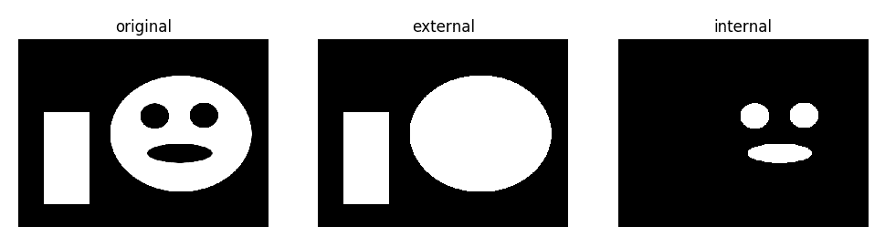
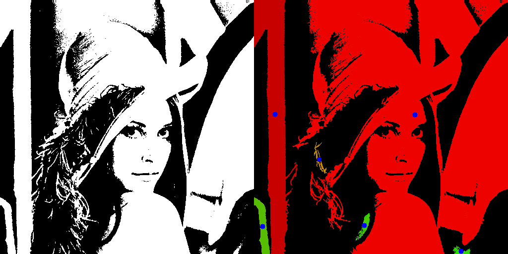
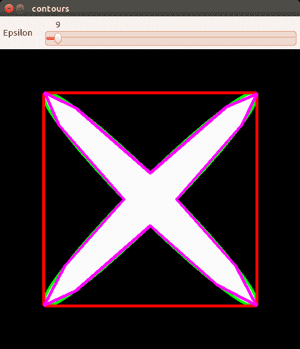
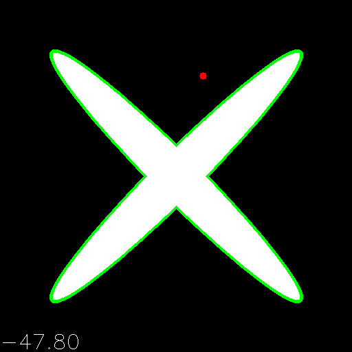
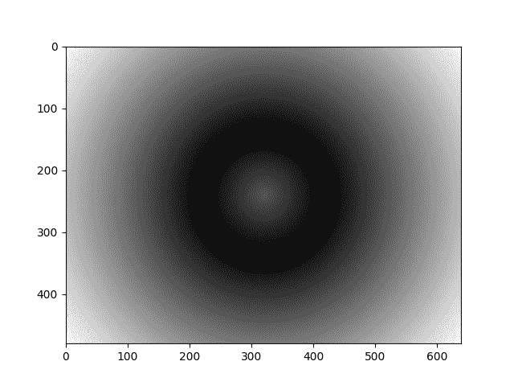

# 轮廓和分割

在本章中，我们将介绍以下秘籍：

*   使用大津算法将灰度图像二值化
*   在二进制图像中查找外部和内部轮廓
*   从二进制图像中提取连通组件
*   将线和圆拟合为二维点集
*   计算图像矩
*   使用曲线 - 近似值，长度和面积
*   检查点是否在轮廓内
*   计算从每个像素到二维点集的距离
*   使用 K 均值算法的图像分割
*   使用分割种子的图像分割，分水岭算法

# 介绍

像素存储值。 值本身是图像的良好功能-它们可以告诉您有关图像统计信息的信息，但几乎没有其他内容。 值根据图像内容分组在一起-暗到浅的过渡形成边界，边界将场景划分为不同的对象。 边界连接在一起并显示轮廓。 轮廓在许多计算机视觉算法中起着重要作用。 它们帮助找到对象，将某事物的一个实例与另一个实例分开，最后帮助您了解整个场景。

本章阐明了与 OpenCV 中轮廓相关的所有内容。 我们将讨论查找，使用和显示它们的方法，并考虑基本的分割方法。

# 使用大津算法将灰度图像二值化

当输入图像中只有两个类并且想要在不进行任何手动阈值调整的情况下提取它们时，使用大津的方法将灰度图像转换为二进制图像非常有用。 在本秘籍中，您将学习如何做。

# 准备

在继续此秘籍之前，您将需要安装 OpenCV 3.x Python API 包和`matplotlib`包。

# 操作步骤

要完成此秘籍，我们需要执行以下步骤：

1.  导入模块：

```py
import cv2
import numpy as np
import matplotlib.pyplot as plt
```

2.  读取测试图像：

```py
image = cv2.imread('../data/Lena.png', 0)
```

3.  使用大津法估算阈值：

```py
otsu_thr, otsu_mask = cv2.threshold(image, -1, 1, cv2.THRESH_BINARY | cv2.THRESH_OTSU)
print('Estimated threshold (Otsu):', otsu_thr)
```

4.  可视化结果：

```py
plt.figure()
plt.subplot(121)
plt.axis('off')
plt.title('original')
plt.imshow(image, cmap='gray')
plt.subplot(122)
plt.axis('off')
plt.title('Otsu threshold')
plt.imshow(otsu_mask, cmap='gray')
plt.tight_layout()
plt.show()
```

# 工作原理

大津的方法以这样一种方式估计灰度图像的阈值：在二值化并将原始图像转换为二进制遮罩之后，两类的总类内差异最小。大津的方法可以在`cv2.threshold`函数的帮助下使用，它已指定了标志`cv2.THRESH_OTSU`。

预期从前面的代码输出以下内容：

```py
Estimated threshold (Otsu): 116.0
```


# 在二进制图像中查找外部和内部轮廓

从二值图像中提取轮廓可以为您提供替代的图像表示，并允许您应用特定于轮廓的图像分析方法。 在本秘籍中，您将学习如何在二进制图像中找到轮廓。

# 准备

对于此秘籍，请确保已安装 OpenCV 3.x Python API 包和`matplotlib`包。

# 操作步骤

1.  导入模块：

```py
import cv2
import numpy as np
import matplotlib.pyplot as plt
```

2.  加载测试二进制图像：

```py
image = cv2.imread('../data/BnW.png', 0)
```

3.  找到外部和内部轮廓。 将它们分为两级：

```py
_, contours, hierarchy = cv2.findContours(image, cv2.RETR_CCOMP, cv2.CHAIN_APPROX_SIMPLE)
```

4.  准备外部轮廓二进制掩码：

```py
image_external = np.zeros(image.shape, image.dtype)
for i in range(len(contours)):
    if hierarchy[0][i][3] == -1:
        cv2.drawContours(image_external, contours, i, 
        255, -1)
```

5.  准备内部轮廓二进制掩码：

```py
image_internal = np.zeros(image.shape, image.dtype)
for i in range(len(contours)):
    if hierarchy[0][i][3] != -1:
        cv2.drawContours(image_internal, contours, i, 
        255, -1)
```

6.  可视化结果：

```py
plt.figure(figsize=(10,3))
plt.subplot(131)
plt.axis('off')
plt.title('original')
plt.imshow(image, cmap='gray')
plt.subplot(132)
plt.axis('off')
plt.title('external')
plt.imshow(image_external, cmap='gray')
plt.subplot(133)
plt.axis('off')
plt.title('internal')
plt.imshow(image_internal, cmap='gray')
plt.tight_layout()
plt.show()
```

# 工作原理

使用 OpenCV 函数`cv2.findContours`提取轮廓。 它支持不同的轮廓提取模式：

*   `cv2.RETR_EXTERNAL`：仅提取外部轮廓
*   `cv2.RETR_CCOMP`：用于提取内部和外部轮廓，并将它们组织为两级层次结构
*   `cv2.RETR_TREE`：用于提取内部和外部轮廓，并将它们组织成树状图
*   `cv2.RETR_LIST`：用于在不建立任何关系的情况下提取所有轮廓

此外，您可以指定是否需要轮廓压缩（使用`cv2.CHAIN_APPROX_SIMPLE`将轮廓的垂直和水平部分折叠到各自的端​​点中）（`cv2.CHAIN_APPROX_NONE`）。

该函数返回三个元素的元组，即修改后的图像，轮廓列表和轮廓层次结构属性列表。 层次结构属性描述了图像轮廓拓扑，每个列表元素是一个四元素元组，包含相同层次结构级别的下一个和上一个轮廓的从零开始的索引，然后分别是第一个子轮廓和第一个父轮廓。 如果没有轮廓，则对应的索引为`-1`。

预期输出如下：



# 从二进制图像中提取连通组件

二进制图像中的已连接组件是非零值的区域。 每个连通组件的每个元素都被来自同一组件的至少一个其他元素包围。 而且不同的组件不会互相接触，每个组件周围都为零。

连接组件分析可能是图像处理的重要组成部分。 通常（在 OpenCV 中是事实），在图像中查找连通组件比查找所有轮廓要快得多。 因此，可以根据连通组件特征（例如区域，质心位置等）快速排除图像的所有不相关部分，以继续处理其余区域。

此秘籍向您展示如何使用 OpenCV 在二进制图像上查找连通组件。

# 准备

您需要安装具有 Python API 支持的 OpenCV3.x。

# 操作步骤

为了执行此秘籍，我们将执行以下步骤：

1.  首先，我们导入所需的所有模块：

```py
import cv2
import numpy as np
```

2.  打开图像并在其中找到连通组件：

```py
img = cv2.imread('../data/BnW.png', cv2.IMREAD_GRAYSCALE)

connectivity = 8
num_labels, labelmap = cv2.connectedComponents(img, connectivity, cv2.CV_32S)
```

3.  显示原始图像和带有标签的缩放图像：

```py
img = np.hstack((img, labelmap.astype(np.float32)/(num_labels - 1)))
cv2.imshow('Connected components', img)
cv2.waitKey()
cv2.destroyAllWindows()
```

4.  打开另一个图像，找到其大津遮罩，并获得连通组件及其统计信息：

```py
img = cv2.imread('../data/Lena.png', cv2.IMREAD_GRAYSCALE)
otsu_thr, otsu_mask = cv2.threshold(img, -1, 1, cv2.THRESH_BINARY | cv2.THRESH_OTSU)

output = cv2.connectedComponentsWithStats(otsu_mask, connectivity, cv2.CV_32S)
```

5.  过滤出面积较小的组件并创建彩色图像，在该图像上绘制具有单独颜色的其余组件以及每个组件的中心。 然后，显示结果：

```py
num_labels, labelmap, stats, centers = output

colored = np.full((img.shape[0], img.shape[1], 3), 0, np.uint8)

for l in range(1, num_labels):
    if stats[l][4] > 200:
        colored[labelmap == l] = (0, 255*l/num_labels, 255*num_labels/l)
        cv2.circle(colored, 
                   (int(centers[l][0]), int(centers[l][1])), 5, (255, 0, 0), cv2.FILLED)

img = cv2.cvtColor(otsu_mask*255, cv2.COLOR_GRAY2BGR)

cv2.imshow('Connected components', np.hstack((img, colored)))
cv2.waitKey()
cv2.destroyAllWindows()
```

# 工作原理

OpenCV 中有两个函数可用于查找连通组件：`cv2.connectedComponents`和`cv2.connectedComponentsWithStats`。 两者都采用相同的参数：要查找其组件的二进制图像，连接类型和输出图像的深度，以及组件的标签。 返回值会有所不同。

`cv2.connectedComponents`更简单，它返回一个组件编号的元组和一个带有组件标签的图像（`labelmap`）。 除了前一个函数的输出外，`cv2.connectedComponentsWithStats`还返回有关每个组件及其组件质心位置的统计信息。

标签图具有与输入图像相同的尺寸，并且其每个像素具有根据像素所属的成分在[0，组件编号]范围内的值。 统计量由形状的 Numpy 数组表示（组件编号 5）。 这五个元素对应于（`x0`，`y0`，宽度，高度，面积）结构。 前四个元素是组件元素的边框的参数，最后一个参数是相应连通组件的面积。 重心的位置也是 Numpy 数组，但是具有形状（组件编号 2），其中每一行代表组件中心的（`x`，`y`）坐标。

执行代码后，您将获得类似于以下内容的图像：



# 将直线和圆形拟合为二维点集

许多计算机视觉算法都处理点。 它们可能是轮廓点，关键点或其他东西。 而且，在某些情况下，我们知道所有这些点都应位于同一条曲线上，并具有已知的数学形状。 查找曲线参数的过程（在嘈杂数据的情况下）称为近似。 在这里，我们将回顾来自 OpenCV 的两个函数，它们可以找到一组点的椭圆和直线的近似值。

# 准备

您需要安装具有 Python API 支持的 OpenCV3.x。

# 操作步骤

1.  首先，导入所有模块：

```py
import cv2
import numpy as np
import random
```

2.  在要绘制的图像上创建图像，并随机生成椭圆的参数，例如半轴长度和旋转角度：

```py
img = np.full((512, 512, 3), 255, np.uint8)

axes = (int(256*random.uniform(0, 1)), int(256*random.uniform(0, 1)))
angle = int(180*random.uniform(0, 1))
center = (256, 256)
```

3.  使用找到的参数为椭圆生成点，并向它们添加随机噪声：

```py
pts = cv2.ellipse2Poly(center, axes, angle, 0, 360, 1)
pts += np.random.uniform(-10, 10, pts.shape).astype(np.int32)
```

4.  在图像上绘制椭圆和生成的点，然后显示图像：

```py
cv2.ellipse(img, center, axes, angle, 0, 360, (0, 255, 0), 3)

for pt in pts:
    cv2.circle(img, (int(pt[0]), int(pt[1])), 3, (0, 0, 255))

cv2.imshow('Fit ellipse', img)
cv2.waitKey()
cv2.destroyAllWindows()
```

5.  找到最适合我们的噪点的椭圆参数，在图像上绘制结果椭圆，然后显示它：

```py
ellipse = cv2.fitEllipse(pts)
cv2.ellipse(img, ellipse, (0, 0, 0), 3)

cv2.imshow('Fit ellipse', img)
cv2.waitKey()
cv2.destroyAllWindows()
```

6.  创建清晰的图像，为`y = x`函数生成点，并向它们添加随机噪声：

```py
img = np.full((512, 512, 3), 255, np.uint8)

pts = np.arange(512).reshape(-1, 1)
pts = np.hstack((pts, pts))
pts += np.random.uniform(-10, 10, pts.shape).astype(np.int32)
```

7.  绘制`y = x`函数并生成点； 然后，显示图像：

```py
cv2.line(img, (0,0), (512, 512), (0, 255, 0), 3)

for pt in pts:
    cv2.circle(img, (int(pt[0]), int(pt[1])), 3, (0, 0, 255))

cv2.imshow('Fit line', img)
cv2.waitKey()
cv2.destroyAllWindows()
```

8.  找到噪声点的直线参数，绘制结果并显示图像：

```py
vx,vy,x,y = cv2.fitLine(pts, cv2.DIST_L2, 0, 0.01, 0.01)
y0 = int(y - x*vy/vx)
y1 = int((512 - x)*vy/vx + y)
cv2.line(img, (0, y0), (512, y1), (0, 0, 0), 3)

cv2.imshow('Fit line', img)
cv2.waitKey()
cv2.destroyAllWindows()
```

# 工作原理

在 OpenCV 中，不同的功能旨在寻找不同类型曲线的近似值：`cv2.fitEllipse`表示椭圆，`cv2.fitLine`表示直线。 两者都执行类似的动作，最小化我们要拟合的曲线到所得曲线的点之间的距离，并且需要一些最小的点数才能拟合（`cv2.fitEllipse`为 5 点，`cv2.fitLine`为 2 点）。

`cv2.fitEllipse`仅接受一组二维点的参数，我们需要为其找到曲线参数，然后返回找到的参数，中心点，半轴长度和旋转角度。 当我们要显示结果时，这些参数可以直接传递到`cv2.ellipse`绘图函数。

另一个函数`cv2.line`具有更多参数。 如前所述，它将点设置为第一个参数，同时将最小化的距离函数的类型，控制距离函数的值以及`(x0, y0)`点和`(vx, vy)`线系数。 `(x0, y0)`确定线穿过的点。 该函数返回最适合设定点的线参数的`(x0, y0, vx, vy)`值。 值得一提的是，`cv2.line`不仅可以处理二维点，而且还可以处理三维点，并且算法本身对设置点的异常值具有鲁棒性，这是巨大的噪音或错误的结果 。 这两个事实使例程对于实际使用非常方便。 如果我们将三维点传递给`cv2.line`，那么我们当然会获得三维线的参数。

# 计算图像的矩

图像矩是根据图像计算出的统计值。 它们使我们能够分析整个图像。 请注意，通常首先要提取轮廓，然后才分别计算和处理每个分量矩，这通常很有用。 在本秘籍中，您将学习如何计算二进制/灰度图像的矩。

# 准备

您需要安装具有 Python API 支持的 OpenCV3.x。

# 操作步骤

1.  导入模块：

```py
import cv2
import numpy as np
import matplotlib.pyplot as plt
```

2.  在黑色背景上绘制一个测试图像-以点（`320`，`240`）为中心的白色椭圆：

```py
image = np.zeros((480, 640), np.uint8)
cv2.ellipse(image, (320, 240), (200, 100), 0, 0, 360, 255, -1)
```

3.  计算矩并打印其值：

```py
m = cv2.moments(image)
for name, val in m.items():
    print(name, '\t', val)
```

4.  执行一个简单的测试，以检查计算出的矩是否有意义，并使用图像的第一个矩来计算图像质心。 它必须靠近我们在上面指定的椭圆的中心：

```py
print('Center X estimated:', m['m10'] / m['m00'])
print('Center Y estimated:', m['m01'] / m['m00'])
```

# 工作原理

对于二进制或灰度图像，使用 OpenCV 函数`cv2.moments`计算图像矩。 它返回计算出的矩的字典，并带有各自的名称。

目前，预期以下输出：

```py
nu11     -2.809466679966455e-13
mu12     -422443285.20703125
mu21     -420182048.71875
m11      1237939564800.0
mu20     161575917357.31616
m10      5158101240.0
nu03     1.013174855849065e-10
nu12     -4.049505150683136e-10
nu21     -4.0278291313762605e-10
mu03     105694127.71875
nu30     1.618061841335058e-09
m30      683285449618080.0
nu02     0.00015660970937729079
m20      1812142855350.0
m00      16119315.0
mu02     40692263506.42969
nu20     0.0006218468887998859
m02      969157708320.0
m21      434912202354750.0
m01      3868620810.0
m03      252129278267070.0
mu11     -72.9990234375
mu30     1687957749.125
m12      310125260718570.0
```

估计的重心如下：

```py
Center X estimated: 319.9950643063927
Center Y estimated: 239.999082467214
```

可以在[这个页面](https://en.wikipedia.org/wiki/Image_moment)上找到不同图像矩类型的定义。

# 使用曲线 - 近似值，长度和面积

本秘籍涵盖与曲线特征相关的 OpenCV 功能。 我们将回顾计算曲线长度和面积，获取凸包以及检查曲线是否凸的例程。 另外，我们将研究如何用较少的点数近似轮廓。 当您开发基于轮廓处理的算法时，所有这些事情都将很有用。 通过找到轮廓的不同特征，您可以构建启发式方法以滤除错误的轮廓。 因此，让我们开始吧。

# 准备

您需要安装具有 Python API 支持的 OpenCV3.x。

# 操作步骤

1.  导入所有必需的模块，打开一个图像，然后在屏幕上显示它：

```py
import cv2, random
import numpy as np
img = cv2.imread('bw.png', cv2.IMREAD_GRAYSCALE)
```

2.  找到加载的图像的轮廓，绘制它们，然后显示结果：

```py
im2, contours, hierarchy = cv2.findContours(img, cv2.RETR_TREE, cv2.CHAIN_APPROX_SIMPLE)

color = cv2.cvtColor(img, cv2.COLOR_GRAY2BGR)
cv2.drawContours(color, contours, -1, (0,255,0), 3)

cv2.imshow('contours', color)
cv2.waitKey()
cv2.destroyAllWindows()
```

3.  取第一个轮廓，在各种情况下找到其面积，并输出结果数字：

```py
contour = contours[0]

print('Area of contour is %.2f' % cv2.contourArea(contour))
print('Signed area of contour is %.2f' % cv2.contourArea(contour, True))
print('Signed area of contour is %.2f' % cv2.contourArea(contour[::-1], True))
```

4.  找到轮廓的长度，然后打印：

```py
print('Length of closed contour is %.2f' % cv2.arcLength(contour, True))
print('Length of open contour is %.2f' % cv2.arcLength(contour, False))
```

5.  找到轮廓的凸包，在图像上绘制并显示：

```py
hull = cv2.convexHull(contour)
cv2.drawContours(color, [hull], -1, (0,0,255), 3)

cv2.imshow('contours', color)
cv2.waitKey()
cv2.destroyAllWindows()
```

6.  检查轮廓及其外壳的凸度：

```py
print('Convex status of contour is %s' % cv2.isContourConvex(contour))
print('Convex status of its hull is %s' % cv2.isContourConvex(hull))
```

7.  创建一个带有轨迹栏的窗口，以控制轮廓近似的质量，找到轮廓近似并显示结果：

```py
cv2.namedWindow('contours')

img = np.copy(color)

def trackbar_callback(value):
    global img
    epsilon = value*cv2.arcLength(contour, True)*0.1/255
    approx = cv2.approxPolyDP(contour, epsilon, True)
    img = np.copy(color)
    cv2.drawContours(img, [approx], -1, (255,0,255), 3)

cv2.createTrackbar('Epsilon', 'contours', 1, 255, lambda v: trackbar_callback(v))
while True:
    cv2.imshow('contours', img)
    key = cv2.waitKey(3)
    if key == 27: 
        break

cv2.destroyAllWindows()
```

# 工作原理

`cv2.contourArea`计算轮廓的面积，顾名思义。 它以一个表示轮廓的点集作为其第一个参数，并使用一个布尔标志作为其第二个参数。 该例程返回轮廓的浮点面积。 该标志允许我们计算有符号（当`True`时）或无符号（当`False`时）区域，其中符号代表轮廓中点的顺时针或逆时针顺序。 关于`cv2.contourArea`的重要说明是，不能保证该区域对于具有自相交的轮廓是正确的。

获得曲线长度的函数是`cv2.arcLength`。 它接受两个参数，轮廓是第一个参数，标志是第二个参数。 该标志控制轮廓的闭合性，`True`意味着轮廓中的第一个点和最后一个点应被视为已连接，因此轮廓被闭合。 否则，第一个点和最后一个点之间的距离不会考虑所得的轮廓周长。

`cv2.convexHull`可帮助您找到轮廓的凸包。 它以轮廓为参数，并返回其凸包（也是轮廓）。 另外，您可以使用`cv2.isContourConvex`函数检查轮廓的凸度，只需将轮廓作为参数传递，当传递的轮廓为凸形时，返回值为`True`。

要获得轮廓近似值，应使用`cv2.approxPolyDP`函数。 该功能实现了 *Ramer–Douglas–Peucker* 算法，该算法查找具有较少点和一定公差的轮廓。 它具有一个轮廓（应该近似），公差（它是原始轮廓与其近似之间的最大距离）和一个布尔标志（告诉函数是否将近似轮廓视为闭合）。 公差越大，近似值越粗糙，但是保留在结果轮廓中的点越少。 该函数返回指定参数的输入轮廓的近似值。

由于执行代码，您将看到一张紧随其后的图像：



# 检查点是否在轮廓内

在本秘籍中，我们将发现一种检查点是否在轮廓内或是否属于轮廓边界的方法。

# 准备

您需要安装具有 Python API 支持的 OpenCV3.x。

# 操作步骤

1.  导入所有必需的模块，打开一个图像，然后在屏幕上显示它：

```py
import cv2, random
import numpy as np
img = cv2.imread('bw.png', cv2.IMREAD_GRAYSCALE)
```

2.  找到图像的轮廓并显示它们：

```py
im2, contours, hierarchy = cv2.findContours(img, cv2.RETR_TREE, cv2.CHAIN_APPROX_SIMPLE)

color = cv2.cvtColor(img, cv2.COLOR_GRAY2BGR)
cv2.drawContours(color, contours, -1, (0,255,0), 3)

cv2.imshow('contours', color)
cv2.waitKey()
cv2.destroyAllWindows()
```

3.  定义一个回调函数来处理用户单击图像。 此函数在发生点击的地方绘制一个小圆圈，圆圈的颜色取决于点击是在轮廓内部还是外部：

```py
contour = contours[0]
image_to_show = np.copy(color)
measure = True

def mouse_callback(event, x, y, flags, param): 
    global contour, image_to_show

    if event == cv2.EVENT_LBUTTONUP:
        distance = cv2.pointPolygonTest(contour, (x,y), measure)
        image_to_show = np.copy(color)
        if distance > 0:
            pt_color = (0, 255, 0)
        elif distance < 0:
            pt_color = (0, 0, 255) 
        else:
            pt_color = (128, 0, 128)
        cv2.circle(image_to_show, (x,y), 5, pt_color, -1)
        cv2.putText(image_to_show, '%.2f' % distance, (0, image_to_show.shape[1] - 5), 
                    cv2.FONT_HERSHEY_SIMPLEX, 1, (255, 255, 255))
```

4.  使用我们的鼠标单击处理器显示图像。 另外，让我们跟踪`M`按钮的按下，以切换由于`cv2.pointPolygonTest`函数而得到的结果的模式：

```py
cv2.namedWindow('contours')
cv2.setMouseCallback('contours', mouse_callback)

while(True):
 cv2.imshow('contours', image_to_show)
 k = cv2.waitKey(1)

 if k == ord('m'):
     measure = not measure
 elif k == 27:
     break

cv2.destroyAllWindows()
```

# 工作原理

OpenCV 中有一个特殊功能，可测量从点到轮廓的最小距离。 称为`cv2.pointPolygonTest`。 它接受三个参数，并返回测得的距离。 参数是轮廓，点和布尔标志，我们将在稍后讨论它们的目的。 结果距离可以为正，负或等于零，分别对应于轮廓内部，轮廓外部或轮廓点位置。 最后一个布尔参数确定我们的函数返回的是精确距离还是仅返回具有值的指示符（`+1`; `0`; `-1`）。 指示器的符号与计算精确距离的模式具有相同的含义。

作为代码的结果，您将获得与此图像相似的内容：



# 计算图像的距离

在本秘籍中，您将学习如何计算距每个图像像素最接近的非零像素的距离。 此功能可用于以自适应方式执行图像处理，例如，根据到最近边缘的距离模糊具有不同强度的图像。

# 准备

安装 OpenCV 3.x Python API 包和`matplotlib`包。

# 操作步骤

1.  导入模块：

```py
import cv2
import numpy as np
import matplotlib.pyplot as plt
```

2.  在白色背景上绘制测试图像-黑色圆圈（无填充）：

```py
image = np.full((480, 640), 255, np.uint8)
cv2.circle(image, (320, 240), 100, 0)
```

3.  计算从每个点到圆的距离：

```py
distmap = cv2.distanceTransform(image, cv2.DIST_L2, cv2.DIST_MASK_PRECISE)
```

4.  可视化结果：

```py
plt.figure()
plt.imshow(distmap, cmap='gray')
plt.show()
```

# 工作原理

可以使用 OpenCV `cv2.distanceTransform`函数来计算距离图。 它计算到最接近的零像素的指定距离类型（`cv2.DIST_L1`，`cv2.DIST_L2`或`cv2.DIST_C`）。 您还可以更改用于计算近似距离的遮罩大小（可用选项为`cv2.DIST_MASK_3`和`cv2.DIST_MASK_5`）。 您还可以使用`cv2.DIST_MASK_PRECISE`标志，这将导致计算的不是近似的，而是精确的距离。

预期输出如下：



# 使用 K 均值算法的图像分割

有时，图像中像素的颜色可以帮助确定语义上相邻区域的位置。 例如，在某些情况下，路面可能具有几乎相同的颜色。 通过颜色，我们可以找到所有道路像素。 但是，如果我们不知道道路的颜色怎么办？ 在这里，K 均值聚类算法开始起作用。 该算法只需要知道一个图像中有多少个群集，或者换句话说，我们想要一个图像中有多少个群集。 有了这些信息，它可以自动找到最佳的群集。 在本秘籍中，我们将考虑如何使用 OpenCV 应用 K 均值图像分割。

# 准备

安装 OpenCV 3.x Python API 包和`matplotlib`包。

# 操作步骤

1.  导入必要的模块：

```py
import cv2
import numpy as np
import matplotlib.pyplot as plt
```

2.  打开图像并将其转换为 Lab 颜色空间：

```py
image = cv2.imread('../data/Lena.png').astype(np.float32) / 255.
image_lab = cv2.cvtColor(image, cv2.COLOR_BGR2Lab)
```

3.  将图像重塑为向量：

```py
data = image_lab.reshape((-1, 3))
```

4.  定义聚类数和完成分割过程的条件。 然后，执行 K 均值聚类：

```py
num_classes = 4
criteria = (cv2.TERM_CRITERIA_EPS + cv2.TERM_CRITERIA_MAX_ITER, 50, 0.1)
_, labels, centers = cv2.kmeans(data, num_classes, None, criteria, 10, cv2.KMEANS_RANDOM_CENTERS)
```

5.  将质心的颜色应用于与这些质心相关的所有像素。 然后，将分割后的图像重新成形为原始形状。 然后，将其转换为 RGB 颜色空间：

```py
segmented_lab = centers[labels.flatten()].reshape(image.shape)
segmented = cv2.cvtColor(segmented_lab, cv2.COLOR_Lab2RGB)
```

6.  一起显示原始图像和分段图像：

```py
plt.subplot(121)
plt.axis('off')
plt.title('original')
plt.imshow(image[:, :, [2, 1, 0]])
plt.subplot(122)
plt.axis('off')
plt.title('segmented')
plt.imshow(segmented)
plt.show()
```

# 工作原理

要执行 K 均值聚类，我们应该使用`cv2.kmeans`函数。 它分别接受以下参数，输入数据，集群数量，带有标签的输入/输出数组（可以设置为`None`），停止过程标准，尝试次数以及用于控制集群过程的标志 。

让我们讨论每个论点。 输入数据必须是具有浮点值的点的向量，在本例中，我们具有三维点。 簇的数量决定了我们将在结果中得到多少簇，值越大，簇的数量越大，但是噪声的影响越大。 带有标签的输入/输出数组既可以用于确定聚类的初始位置，也可以用于获取结果聚类。 如果我们不想指定集群中心初始化，则应将此参数设置为`None`。 停止过程标准确定了尝试找到最佳聚类位置时分段过程的工作时间。 尝试次数定义了从不同的群集初始化启动群集过程的次数，以便以后选择最佳尝试。 这些标志确定集群初始化的类型； 可以使用`cv2.KMEANS_RANDOM_CENTERS`进行随机初始化，使用`cv2.KMEANS_PP_CENTERS`进行更复杂的初始化（kmeans ++算法），以及使用`cv2.KMEANS_USE_INITIAL_LABELS`传递用户指定的集群中心（在这种情况下，第三个参数不能为`None`）。

该函数为每个聚类返回紧凑性的双精度值，带有标签的向量以及每个标签的值。 簇的紧密度是每个簇点到相应中心的平方距离的总和。 带标签的向量的长度与输入数据向量的长度相同，并且其每个元素表示一个输出群集，该群集已设置为输入数据中的相应位置。 每个标签的值是聚类中心的值。

在此秘籍中，由于其将颜色信息和亮度信息分开的特性，因此使用了 Lab 颜色空间。 在 RGB 空间中，颜色和亮度在所有通道中混合在一起，但这会对分割过程产生负面影响。

请注意，在处理`uint8`图像时，OpenCV 将线性处理应用于 Lab 颜色空间值。 因此，在色彩空间之间进行转换时必须小心。 对于`float32`图像，像素值必须保持不变。 参见[这里](https://docs.opencv.org/master/de/d25/imgproc_color_conversions.html)。

启动代码后，您将获得类似于以下内容的图像：


# 使用分割种子的图像分割 - 分水岭算法

当我们有初始的分割点并想用相同的分割类自动填充周围区域时，将使用图像分割的分水岭算法。 这些初始的分割点称为种子，应该手动设置它们，但是在某些情况下，可以自动分配它们。 此秘籍展示了如何在 OpenCV 中实现分水岭分割算法。

# 准备

安装 OpenCV 3.x Python API 包和`matplotlib`包。

# 操作步骤

1.  导入必要的模块和功能：

```py
import cv2, random
import numpy as np
from random import randint
```

2.  加载图像以进行分段并创建其副本，并创建其他图像以存储种子和分段结果：

```py
img = cv2.imread('../data/Lena.png')
show_img = np.copy(img)

seeds = np.full(img.shape[0:2], 0, np.int32)
segmentation = np.full(img.shape, 0, np.uint8)
```

3.  定义种子类型的数量，每种种子类型的颜色以及一些与鼠标事件一起使用的变量：

```py
n_seeds = 9

colors = []
for m in range(n_seeds):
    colors.append((255 * m / n_seeds, randint(0, 255), randint(0, 255)))

mouse_pressed = False
current_seed = 1
seeds_updated = False
```

4.  实现鼠标回调函数以处理鼠标事件； 让我们通过按下按钮拖动鼠标在图像上绘制种子：

```py
def mouse_callback(event, x, y, flags, param):
    global mouse_pressed, seeds_updated

    if event == cv2.EVENT_LBUTTONDOWN:
        mouse_pressed = True
        cv2.circle(seeds, (x, y), 5, (current_seed), cv2.FILLED)
        cv2.circle(show_img, (x, y), 5, colors[current_seed - 1], 
        cv2.FILLED)
        seeds_updated = True

    elif event == cv2.EVENT_MOUSEMOVE:
        if mouse_pressed:
            cv2.circle(seeds, (x, y), 5, (current_seed), cv2.FILLED)
            cv2.circle(show_img, (x, y), 5, colors[current_seed - 
            1], cv2.FILLED)
            seeds_updated = True

    elif event == cv2.EVENT_LBUTTONUP:
        mouse_pressed = False
```

5.  创建所有必要的窗口，设置回调，显示图像，并跟踪循环中按下的键盘按钮。 让我们通过按数字来更改当前种子以进行绘制。 并且，在完成种子更改过程后，使用分水岭算法对图像进行分割：

```py
cv2.namedWindow('image')
cv2.setMouseCallback('image', mouse_callback)

while True:
    cv2.imshow('segmentation', segmentation)
    cv2.imshow('image', show_img)

    k = cv2.waitKey(1)

    if k == 27:
        break
    elif k == ord('c'):
        show_img = np.copy(img)
        seeds = np.full(img.shape[0:2], 0, np.int32)
        segmentation = np.full(img.shape, 0, np.uint8)
    elif k > 0 and chr(k).isdigit():
        n = int(chr(k))
        if 1 <= n <= n_seeds and not mouse_pressed:
            current_seed = n

    if seeds_updated and not mouse_pressed: 
        seeds_copy = np.copy(seeds)
        cv2.watershed(img, seeds_copy)
        segmentation = np.full(img.shape, 0, np.uint8)
        for m in range(n_seeds):
            segmentation[seeds_copy == (m + 1)] = colors[m]

        seeds_updated = False

cv2.destroyAllWindows()
```

# 工作原理

`cv2.watershed`函数实现该算法，并接受两个参数，即要分割的图像和初始种子。 分割的图像应为彩色和 8 位。 种子应以与分割后的图像相同的空间大小存储在图像中，但只有一个通道和不同的深度`int32`。 第二个参数中应使用不同的数字表示不同的种子，其他像素应设置为零。 该例程用相关的邻近种子填充种子图像中的零值。

从该秘籍启动代码后，您将看到类似于以下图像：

