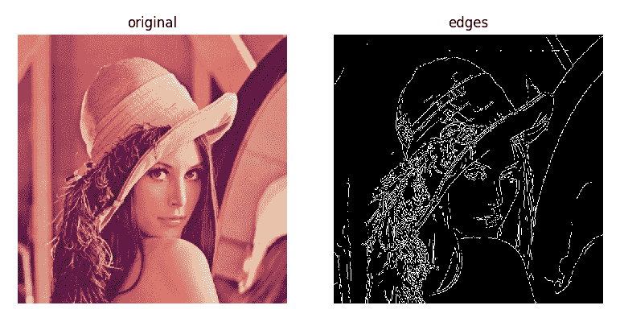
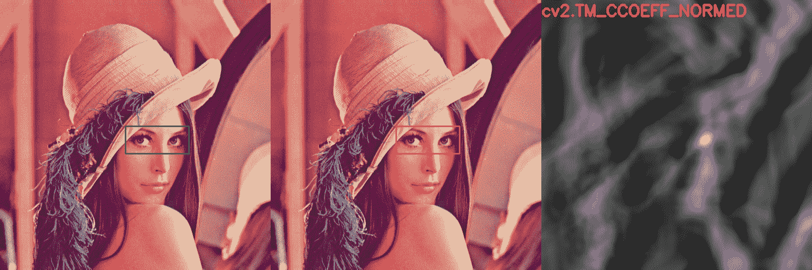
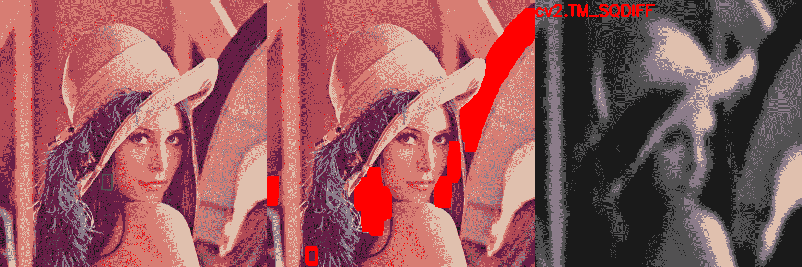
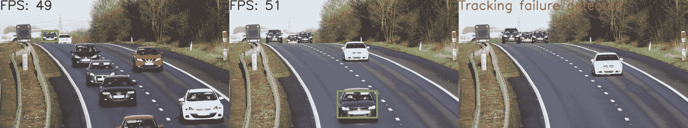
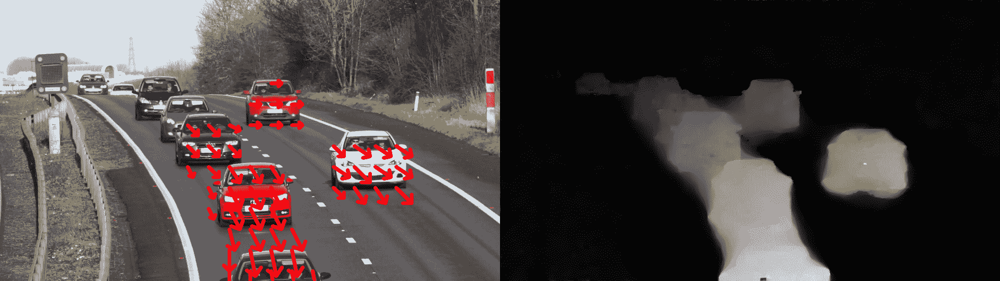
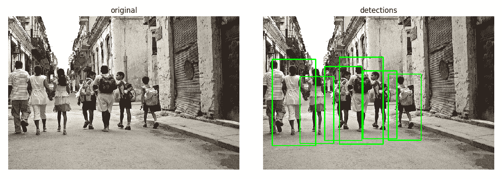
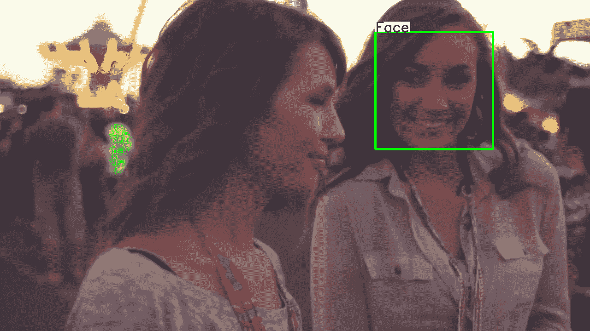
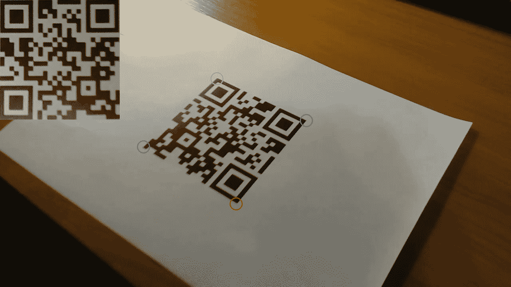

# 目标检测与机器学习

在本章中，我们将介绍以下秘籍：

*   使用 GrabCut 算法获取对象遮罩
*   使用 Canny 算法查找边缘
*   使用霍夫变换检测直线和圆
*   通过模板匹配查找对象
*   实时中值流对象跟踪器
*   通过跟踪 API 使用不同的算法跟踪对象
*   计算两个帧之间的密集光流
*   检测棋盘和圆形网格图案
*   使用 SVM 模型的简单行人探测器
*   使用不同的机器学习模型进行光学字符识别
*   使用 Haar/LBP 级联检测人脸
*   为 AR 应用检测 AruCo 模式
*   在自然场景中检测文字
*   QR 码检测器和识别器

# 介绍

我们的世界包含许多物体。 每种类型的对象都有其自己的特征，这些特征使它与某些类型区别开来，同时又使其与其他类型相似。 通过其中的对象了解场景是计算机视觉的关键任务。 能够查找和跟踪各种对象，检测基本模式和复杂结构以及识别文本是具有挑战性和有用的技能，本章讨论有关如何通过 OpenCV 功能实现和使用它们的问题。

我们将回顾对几何图元（如直线，圆和棋盘）以及更复杂的对象（如行人，人脸，AruCo 和 QR 码图案）的检测。 我们还将执行对象跟踪任务。

# 使用 GrabCut 算法获取对象遮罩

在某些情况下，我们希望将对象与场景的其他部分分开； 换句话说，我们要为前景和背景创建遮罩。 这项工作由 GrabCut 算法解决。 它可以在半自动模式下构建对象遮罩。 它所需要的只是关于对象位置的初始假设。 基于这些假设，该算法执行多步迭代过程，以对前景像素和背景像素的统计分布进行建模，并根据这些分布找到最佳划分。 这听起来很复杂，但是用法非常简单。 让我们找出在 OpenCV 中应用这种复杂算法的难易程度。

# 准备

在继续此秘籍之前，您需要安装 OpenCV 3.x Python API 包。

# 操作步骤

1.  导入模块：

```py
import cv2
import numpy as np
```

2.  打开图像并定义鼠标回调函数以在图像上绘制一个矩形：

```py
img = cv2.imread('../data/Lena.png', cv2.IMREAD_COLOR)
show_img = np.copy(img)

mouse_pressed = False
y = x = w = h = 0

def mouse_callback(event, _x, _y, flags, param):
    global show_img, x, y, w, h, mouse_pressed

    if event == cv2.EVENT_LBUTTONDOWN:
        mouse_pressed = True
        x, y = _x, _y
        show_img = np.copy(img)

    elif event == cv2.EVENT_MOUSEMOVE:
        if mouse_pressed:
            show_img = np.copy(img)
            cv2.rectangle(show_img, (x, y),
                          (_x, _y), (0, 255, 0), 3)

    elif event == cv2.EVENT_LBUTTONUP:
        mouse_pressed = False
        w, h = _x - x, _y - y
```

3.  显示图像，并在完成矩形并按下键盘上的`A`按钮之后，使用以下代码关闭窗口：

```py
cv2.namedWindow('image')
cv2.setMouseCallback('image', mouse_callback)

while True:
    cv2.imshow('image', show_img)
    k = cv2.waitKey(1)

    if k == ord('a') and not mouse_pressed:
        if w*h > 0:
            break

cv2.destroyAllWindows()
```

4.  调用`cv2.grabCut`基于绘制的矩形创建对象遮罩。 然后，创建对象掩码并将其定义为：

```py
labels = np.zeros(img.shape[:2],np.uint8)

labels, bgdModel, fgdModel = cv2.grabCut(img, labels, (x, y, w, h), None, None, 5, cv2.GC_INIT_WITH_RECT)

show_img = np.copy(img)
show_img[(labels == cv2.GC_PR_BGD)|(labels == cv2.GC_BGD)] //= 3

cv2.imshow('image', show_img)
cv2.waitKey()
cv2.destroyAllWindows()
```

5.  定义鼠标回调以在图像上绘制遮罩。 有必要修复先前的`cv2.grabCut`调用中的错误：

```py
label = cv2.GC_BGD
lbl_clrs = {cv2.GC_BGD: (0,0,0), cv2.GC_FGD: (255,255,255)}

def mouse_callback(event, x, y, flags, param):
    global mouse_pressed

    if event == cv2.EVENT_LBUTTONDOWN:
        mouse_pressed = True
        cv2.circle(labels, (x, y), 5, label, cv2.FILLED)
        cv2.circle(show_img, (x, y), 5, lbl_clrs[label], cv2.FILLED)

    elif event == cv2.EVENT_MOUSEMOVE:
        if mouse_pressed:
            cv2.circle(labels, (x, y), 5, label, cv2.FILLED)
            cv2.circle(show_img, (x, y), 5, lbl_clrs[label], cv2.FILLED)

    elif event == cv2.EVENT_LBUTTONUP:
        mouse_pressed = False
```

6.  带遮罩显示图像； 使用白色绘制将对象像素标记为背景的位置，使用黑色绘制将背景区域标记为对象的位置。 然后，再次调用`cv2.grabCut`以获取固定的掩码。 最后，更新图像上的遮罩，并显示它：

```py
cv2.namedWindow('image')
cv2.setMouseCallback('image', mouse_callback)

while True:
    cv2.imshow('image', show_img)
    k = cv2.waitKey(1)

    if k == ord('a') and not mouse_pressed:
        break
    elif k == ord('l'):
        label = cv2.GC_FGD - label

cv2.destroyAllWindows()

labels, bgdModel, fgdModel = cv2.grabCut(img, labels, None, bgdModel, fgdModel, 5, cv2.GC_INIT_WITH_MASK)

show_img = np.copy(img)
show_img[(labels == cv2.GC_PR_BGD)|(labels == cv2.GC_BGD)] //= 3

cv2.imshow('image', show_img)
cv2.waitKey()
cv2.destroyAllWindows()
```

# 工作原理

OpenCV 的`cv2.grabCut`实现了 GrabCut 算法。 此功能可以在多种模式下工作，并采用以下参数：输入 3 通道图像，带有像素初始标签的矩阵，（`x`，`y`，`w`，`h`）格式来定义标签初始化，两个用于存储进程状态的矩阵，多次迭代以及我们希望函数启动的模式。

该函数返回带有过程状态的标签矩阵和两个矩阵。 标签矩阵是单通道的，并且在每个像素中存储以下值之一：`cv2.GC_BGD`（这意味着像素绝对属于背景），`cv2.GC_PR_BGD`（这意味着像素可能位于背景中） ，`cv2.GC_PR_FGD`（对于可能是前景的像素），`cv2.GC_FGD`（对于肯定是前景的像素）。 如果我们要继续进行几次迭代，则需要两个状态矩阵。

该功能有三种可能的模式：`cv2.GC_INIT_WITH_RECT`，`cv2.GC_INIT_WITH_MASK`和`cv2.GC_EVAL`。 当我们想通过第三个参数中的矩形定义标签初始化时，使用第一个。 在这种情况下，将矩形外部的像素设置为`cv2.GC_BGD`值，将矩形内部的像素设置为`cv2.GC_PR_FGD`值。

当我们要使用第二个参数矩阵的值作为标签的初始化时，使用函数的第二种模式`cv2.GC_INIT_WITH_MASK`。 在这种情况下，这些值应设置为以下四个值之一：`cv2.GC_BGD`，`cv2.GC_PR_BGD`，`cv2.GC_PR_FGD`或`cv2.GC_FGD`。

第三种模式`cv2.GC_EVAL`用于以相同状态调用该函数进行另一次迭代。

在代码中，我们将背景变暗以可视化对象遮罩。 当我们要分割的对象具有与图像其他部分相似的亮度时，它可以很好地工作。 但是，在明亮的场景中有深色物体的情况下，它将不起作用。 因此，您可能需要在自己的项目中应用另一种可视化技术。

启动该代码的结果是，您将获得类似于以下内容的图片：


# 使用 Canny 算法查找边缘

边缘是一种有用的图像特征，可以在许多计算机视觉应用中使用。 在本秘籍中，您将学习如何使用 Canny 算法检测图像中的边缘。

# 准备

安装 OpenCV 3.x Python API 包和`matplotlib`包。

# 操作步骤

这是完成此秘籍所需的步骤：

1.  导入模块：

```py
import cv2
import matplotlib.pyplot as plt
```

2.  加载测试图像：

```py
image = cv2.imread('../data/Lena.png')
```

3.  使用 Canny 算法检测边缘：

```py
edges = cv2.Canny(image, 200, 100)
```

4.  可视化结果：

```py
plt.figure(figsize=(8,5))
plt.subplot(121)
plt.axis('off')
plt.title('original')
plt.imshow(image[:,:,[2,1,0]])
plt.subplot(122)
plt.axis('off')
plt.title('edges')
plt.imshow(edges, cmap='gray')
plt.tight_layout()
plt.show()
```

# 工作原理

Canny 边缘检测是计算机视觉中非常强大且流行的工具。 它以 John F. Canny 的名字命名，他于 1986 年提出了该算法。OpenCV 在函数`cv2.Canny`中实现了该算法。 您必须在此函数中为梯度幅度指定两个阈值：第一个阈值用于检测强边缘，第二个阈值用于滞后过程，在该过程中将生长强边缘。

预期输出如下：



# 使用霍夫变换检测直线和圆

在本秘籍中，您将学习如何应用霍夫变换来检测直线和圆。 当您需要执行基本图像分析并在图像中查找图元时，这是一种有用的技术。

# 准备

在继续此秘籍之前，您需要安装 OpenCV 3.x Python API 包和`matplotlib`包。

# 操作步骤

1.  导入模块：

```py
import cv2
import numpy as np
```

2.  绘制测试图像：

```py
img = np.zeros((500, 500), np.uint8)
cv2.circle(img, (200, 200), 50, 255, 3)
cv2.line(img, (100, 400), (400, 350), 255, 3)
```

3.  使用概率霍夫变换检测线：

```py
lines = cv2.HoughLinesP(img, 1, np.pi/180, 100, 100, 10)[0]
```

4.  使用霍夫变换检测圆：

```py
circles = cv2.HoughCircles(img, cv2.HOUGH_GRADIENT, 1, 15, param1=200, param2=30)[0]
```

5.  绘制检测到的直线和圆：

```py
dbg_img = np.zeros((img.shape[0], img.shape[1], 3), np.uint8) 
for x1, y1, x2, y2 in lines:
    print('Detected line: ({} {}) ({} {})'.format(x1, y1, x2, y2))
    cv2.line(dbg_img, (x1, y1), (x2, y2), (0, 255, 0), 2) 

for c in circles:
    print('Detected circle: center=({} {}), radius={}'.format(c[0], c[1], c[2]))
    cv2.circle(dbg_img, (c[0], c[1]), c[2], (0, 255, 0), 2)
```

6.  可视化结果：

```py
plt.figure(figsize=(8,4))
plt.subplot(121)
plt.title('original')
plt.axis('off')
plt.imshow(img, cmap='gray')
plt.subplot(122)
plt.title('detected primitives')
plt.axis('off')
plt.imshow(dbg_img)
plt.show()
```

# 工作原理

霍夫变换是一种用于检测参数化并以方便的数学形式表示的任何形状的技术。 基本上，对于源图像中的每个像素，霍夫变换都会找到一组满足观察结果的模型参数并将其存储在表中。 每个像素为可能模型的子集投票。 输出检测通过投票程序获得。

线的检测在功能`cv2.HoughLineP`中实现。 实际上，它没有实现原始的 Hough 变换，而是实现了优化的概率版本。 该函数采用诸如源图像，投票空间空间分辨率，投票空间角分辨率，最小投票阈值，最小行长和同一行上的点之间最大允许间隙之类的参数来链接它们，并返回检测到的行的列表，格式为`start_point`和`end_point`。

圆的检测在功能`cv2.HoughCircles`中实现。 它采用输入源图像，检测方法（目前仅支持`cv2.HOUGH_GRADIENT`），逆投票空间分辨率，检测到的圆心之间的最小距离以及两个可选参数：第一个是 Canny 边缘检测程序的较高阈值，第二个是票数阈值。

预期上面的代码输出如下：

```py
Detected line: (99 401) (372 353)
Detected circle: center=(201.5 198.5), radius=50.400001525878906
```

输出如下：


# 通过模板匹配查找对象

在图像中找到对象并不是一件容易的事，由于各种表示形式，同一实例看起来可能有很大的不同，乍一看，需要一些复杂的计算机视觉算法。 但是，如果我们限制此问题，则可以通过相对简单的方法成功解决该任务。 在本秘籍中，我们考虑在图像上查找与某些模板相对应的对象的方法。

# 准备

在继续此秘籍之前，您需要安装 OpenCV 3.x Python API 包。

# 操作步骤

执行以下步骤：

1.  导入模块：

```py
import cv2
import numpy as np
```

2.  加载图像并定义鼠标回调函数以选择图像 ROI。 所绘制矩形的内部将是我们用于匹配的模板：

```py
img = cv2.imread('../data/Lena.png', cv2.IMREAD_COLOR)
show_img = np.copy(img)

mouse_pressed = False
y = x = w = h = 0

def mouse_callback(event, _x, _y, flags, param):
    global show_img, x, y, w, h, mouse_pressed

    if event == cv2.EVENT_LBUTTONDOWN:
        mouse_pressed = True
        x, y = _x, _y
        show_img = np.copy(img)

    elif event == cv2.EVENT_MOUSEMOVE:
        if mouse_pressed:
            show_img = np.copy(img)
            cv2.rectangle(show_img, (x, y),
                          (_x, _y), (0, 255, 0), 2)

    elif event == cv2.EVENT_LBUTTONUP:
        mouse_pressed = False
        w, h = _x - x, _y - y
```

3.  显示图像，用鼠标选择要查找的对象，然后按`A`按钮完成该过程并获取模板：

```py
cv2.namedWindow('image')
cv2.setMouseCallback('image', mouse_callback)

while True:
    cv2.imshow('image', show_img)
    k = cv2.waitKey(1)

    if k == ord('a') and not mouse_pressed:
        if w*h > 0:
            break

cv2.destroyAllWindows()

template = np.copy(img[y:y+h, x:x+w])
```

4.  显示图像并处理按钮按下事件。 从 0 到 5 的数字决定了我们用来在图像上查找与模板相似的区域的方法。 匹配通过`cv2.matchTemplate`功能执行。 匹配完成后，我们将找到具有最高（或最低）相似性度量的点，并得出检测结果：

```py
methods = ['cv2.TM_CCOEFF', 'cv2.TM_CCOEFF_NORMED', 'cv2.TM_CCORR',
            'cv2.TM_CCORR_NORMED', 'cv2.TM_SQDIFF', 'cv2.TM_SQDIFF_NORMED']

show_img = np.copy(img)

while True:
    cv2.imshow('image', show_img)
    k = cv2.waitKey()

    if k == 27:
        break
    elif k > 0 and chr(k).isdigit():
        index = int(chr(k))
        if 0 <= index < len(methods):
            method = methods[index]

            res = cv2.matchTemplate(img, template, eval(method))

            res = cv2.normalize(res, None, 0, 1, cv2.NORM_MINMAX)

            if index >= methods.index('cv2.TM_SQDIFF'):
                loc = np.where(res < 0.01)
            else:
                loc = np.where(res > 0.99)

            show_img = np.copy(img)
            for pt in zip(*loc[::-1]):
                cv2.rectangle(show_img, pt, (pt[0] + w, pt[1] + h), 
                              (0, 0, 255), 2)

            res = cv2.resize(res, show_img.shape[:2])*255
            res = cv2.cvtColor(res, cv2.COLOR_GRAY2BGR).astype(np.uint8)
            cv2.putText(res, method, (0, 30), cv2.FONT_HERSHEY_SIMPLEX, 
                        1, (0, 0, 255), 3)

            show_img = np.hstack((show_img, res))

cv2.destroyAllWindows()
```

# 工作原理

`cv2.matchTemplate`用于查找与模板相似的图像区域。 可以使用不同的方法（通过不同的数学运算来确定模板和图像上的色块之间的差异）来确定相似性。 但是，这些方法都无法找到具有不同比例或方向的模板。

此功能获取源图像，搜索模板以及补丁和模板比较的方法。 该方法由以下值确定：`cv2.TM_CCOEFF`，`cv2.TM_CCOEFF_NORMED`，`cv2.TM_CCORR`，`cv2.TM_CCORR_NORMED`，`cv2.TM_SQDIFF`或`cv2.TM_SQDIFF_NORMED`。 名称中带有`CCOEFF`的方法使用相关系数计算，就像相似性度量一样-值越大，区域越相似。 使用`CCORR`的方法使用互相关计算来比较色块，使用`SQDIFF`的方法找到区域之间的平方差以进行比较。

该函数返回输入图像中所选相似性度量的分布。 返回的图像是一个单通道浮点，具有空间大小（`W-w+1`，`H-h+1`），其中大写字母代表输入图像尺寸，小写字母代表模板尺寸。 返回图像的内容取决于我们使用的方法，对于具有相关性计算的方法，值越大表示匹配越好。 并且，顾名思义，具有平方差用法的方法具有最小的值作为完美匹配。

使用相关系数计算的方法给出的失配最少，但需要更多的计算。 平方差方法需要较少的计算，但结果却不太可靠。 如下图所示，这可能适用于小的和/或无特征的补丁。

执行代码后，您将获得类似于以下图像的图像（取决于模板和所选的方法）：





# Median Flow 跟踪器

在本秘籍中，我们将应用 Median Flow 对象跟踪器来跟踪视频中的对象。 该跟踪器可以实时工作（在现代硬件上甚至更快），并且可以准确，稳定地完成其工作。 另外，该跟踪器具有不错的功能，可以确定跟踪失败。 让我们看看如何在应用中使用它。

# 准备

在继续此秘籍之前，您需要安装带有 OpenCV Contrib 模块的 OpenCV 3.x Python API 包。

# 操作步骤

此秘籍的步骤为：

1.  导入所有必要的模块：

```py
import cv2
import numpy as np
```

2.  打开视频文件，读取其框架，然后选择要跟踪的对象：

```py
cap = cv2.VideoCapture("../data/traffic.mp4")

_, frame = cap.read()

bbox = cv2.selectROI(frame, False, True)

cv2.destroyAllWindows()
```

3.  创建 Median Flow 跟踪器，并使用视频中的第一帧和我们选择的边界框对其进行初始化。 然后，一一读取剩余的帧，将它们输入到跟踪器中，并为每个帧获得一个新的边框。 显示边界框，以及“中值流”算法每秒能够处理的帧数：

```py
tracker = cv2.TrackerMedianFlow_create()
status_tracker = tracker.init(frame, bbox)
fps = 0

while True:
    status_cap, frame = cap.read()
    if not status_cap:
        break

    if status_tracker:
        timer = cv2.getTickCount()
        status_tracker, bbox = tracker.update(frame)

    if status_tracker:
        x, y, w, h = [int(i) for i in bbox]
        cv2.rectangle(frame, (x, y), (x + w, y + h), (0, 255, 0), 15)
        fps = cv2.getTickFrequency() / (cv2.getTickCount() - timer);
        cv2.putText(frame, "FPS: %.0f" % fps, (0, 80), cv2.FONT_HERSHEY_SIMPLEX, 3.5, (0, 0, 0), 8);
    else:
        cv2.putText(frame, "Tracking failure detected", (0, 80), cv2.FONT_HERSHEY_SIMPLEX, 3.5, (0,0,255), 8)

    cv2.imshow("MedianFlow tracker", frame)

    k = cv2.waitKey(1)

    if k == 27: 
        break

cv2.destroyAllWindows()
```

# 工作原理

要创建中位数流跟踪器，我们需要使用`cv2.TrackerMedianFlow_create`。 此函数返回跟踪器的实例。 接下来，应该使用要跟踪的对象来初始化跟踪器。 这可以通过`init`函数调用来完成。 对于跟踪器实例，应使用以下参数调用此函数：具有要跟踪的对象的框架和（[`x`，`y`，宽度，高度的对象的边界框 ）格式。 如果初始化成功完成，则函数返回`True`。

当我们有一个新框架时，我们想要为该对象获得一个新的边界框。 为此，我们需要使用新框架作为参数来调用跟踪器实例的`update`函数。 从该例程返回的值是跟踪器状态和新的边界框，格式仍为（`x`，`y`，宽度，高度）。 跟踪器的状态是布尔变量，它显示跟踪器是否继续跟踪对象或跟踪过程是否失败。

值得一提的是`cv2.selectROI`功能。 它可以帮助您使用鼠标和键盘轻松选择图像上的区域。 它接受我们要选择 ROI 的图像，标志表示我们是否要网格化，标志指定 ROI 选择模式（从左上角或从中心）。 调用此函数后，图像将出现在屏幕上，您将能够单击并拖动鼠标以绘制一个矩形。 选择过程完成后，只需按键盘上的空格键，您将获得所选矩形的参数作为返回值。

启动前面的代码并选择一个对象后，您将看到如何在视频中跟踪该对象。 以下显示了几帧，并带有跟踪结果：



如您所见，此跟踪器成功处理了对象比例的更改，并在丢失跟踪对象时报告。

# 使用跟踪 API 和不同的算法跟踪对象

在本秘籍中，您将学习如何使用 OpenCV 跟踪贡献模块中实现的不同跟踪算法。 不同的跟踪算法在准确性，可靠性和速度方面具有不同的属性。 使用跟踪 API，您可以尝试找到最适合您的需求的 API。

# 准备

在继续此秘籍之前，您需要安装 OpenCV 3.x Python API 包和 matplotlib 包。 OpenCV 必须使用 Contrib 模块构建，因为跟踪 API 并非主要 OpenCV 存储库的一部分。

# 操作步骤

要完成此秘籍，请执行以下步骤：

1.  导入模块：

```py
import cv2
```

2.  创建主窗口并在不同的跟踪器上循环：

```py
cv2.namedWindow('frame')

for name, tracker in (('KCF', cv2.TrackerKCF_create), 
                      ('MIL', cv2.TrackerMIL_create), 
                      ('TLD', cv2.TrackerTLD_create)):
    tracker = tracker()
    initialized = False
```

3.  打开测试视频文件，然后选择一个对象：

```py
video = cv2.VideoCapture('../data/traffic.mp4')
bbox = (878, 266, 1153-878, 475-266)
```

4.  跟踪直到视频结束或按下`Esc`，并可视化当前跟踪的对象：

```py
    while True:
        t0 = time.time()
        ok, frame = video.read()
        if not ok: 
            break

        if initialized:
            tracked, bbox = tracker.update(frame)
        else:
            cv2.imwrite('/tmp/frame.png', frame)
            tracked = tracker.init(frame, bbox)
            initialized = True

        fps = 1 / (time.time() - t0)
        cv2.putText(frame, 'tracker: {}, fps: {:.1f}'.format(name, fps),
                    (10, 50), cv2.FONT_HERSHEY_SIMPLEX, 1, (255, 0, 0), 2) 
        if tracked:
            bbox = tuple(map(int, bbox))
            cv2.rectangle(frame, (bbox[0], bbox[1]), 
                          (bbox[0]+bbox[2], bbox[1]+bbox[3]), 
                          (0, 255, 0), 3)
        cv2.imshow('frame', frame)
        if cv2.waitKey(3) == 27:
            break
```

5.  关闭窗口：

```py
cv2.destroyAllWindows()
```

# 工作原理

OpenCV 跟踪 API 提供对许多不同跟踪算法的访问，例如中位数流，**核化相关过滤器**（**KCF**），**跟踪学习检测**（**TLD**）等。 可以通过`cv2.TrackerKCF_create`方法实例化跟踪器（可以代替 KCF 来指定任何其他受支持的跟踪算法名称）。 必须为第一帧初始化跟踪模型，并使用方法`tracker.init`指定初始对象位置。 之后，必须使用`tracker.update`方法处理每个帧，该方法将返回跟踪状态和被跟踪对象的当前位置。

经过几个步骤，预计会得到以下输出（帧速率数字显然取决于硬件）：


# 计算两个帧之间的密集光流

光流是一系列算法，用于解决在两个图像（通常是视频中的后续帧）之间寻找点的运动的问题。 密集光流算法可以找到一帧中所有像素的运动。 密集的光流可用于查找在一系列帧中移动的对象，或检测相机的移动。 在本秘籍中，我们将发现如何使用 OpenCV 功能以几种方式计算和显示密集的光流。

# 准备

在继续此秘籍之前，您需要安装 OpenCV 3.x Python API 包。

# 操作步骤

您需要执行以下步骤：

1.  导入我们将要使用的模块：

```py
import cv2
import numpy as np
```

2.  定义函数以显示光流：

```py
def display_flow(img, flow, stride=40): 
    for index in np.ndindex(flow[::stride, ::stride].shape[:2]):
        pt1 = tuple(i*stride for i in index)
        delta = flow[pt1].astype(np.int32)[::-1]
        pt2 = tuple(pt1 + 10*delta)
        if 2 <= cv2.norm(delta) <= 10:
            cv2.arrowedLine(img, pt1[::-1], pt2[::-1], (0,0,255), 5, cv2.LINE_AA, 0, 0.4)

    norm_opt_flow = np.linalg.norm(flow, axis=2)
    norm_opt_flow = cv2.normalize(norm_opt_flow, None, 0, 1, cv2.NORM_MINMAX)

    cv2.imshow('optical flow', img)
    cv2.imshow('optical flow magnitude', norm_opt_flow)
    k = cv2.waitKey(1)

    if k == 27:
        return 1
    else:
        return 0
```

3.  打开视频并获取其第一帧。 接下来，逐帧读取帧，并使用 Gunnar Farneback 的算法计算密集的光流。 然后，显示结果：

```py
cap = cv2.VideoCapture("../data/traffic.mp4")
_, prev_frame = cap.read()

prev_frame = cv2.cvtColor(prev_frame, cv2.COLOR_BGR2GRAY)
prev_frame = cv2.resize(prev_frame, (0,0), None, 0.5, 0.5)
init_flow = True

while True:
    status_cap, frame = cap.read()
    frame = cv2.resize(frame, (0,0), None, 0.5, 0.5)
    if not status_cap:
        break
    gray = cv2.cvtColor(frame, cv2.COLOR_BGR2GRAY)

    if init_flow:
        opt_flow = cv2.calcOpticalFlowFarneback(prev_frame, gray, None, 
                                                0.5, 5, 13, 10, 5, 1.1, 
                                                cv2.OPTFLOW_FARNEBACK_GAUSSIAN)
        init_flow = False
    else:
        opt_flow = cv2.calcOpticalFlowFarneback(prev_frame, gray, opt_flow, 
                                                0.5, 5, 13, 10, 5, 1.1, 
                                                cv2.OPTFLOW_USE_INITIAL_FLOW)

    prev_frame = np.copy(gray)

    if display_flow(frame, opt_flow):
        break;

cv2.destroyAllWindows()
```

4.  将视频捕获的位置设置为开始，然后读取第一帧。 创建一个可计算 Dual TV L1 光流的类的实例。 然后，一帧一帧地读取帧，并获取随后每对帧的光通量； 显示结果：

```py
cap.set(cv2.CAP_PROP_POS_FRAMES, 0)
_, prev_frame = cap.read()

prev_frame = cv2.cvtColor(prev_frame, cv2.COLOR_BGR2GRAY)
prev_frame = cv2.resize(prev_frame, (0,0), None, 0.5, 0.5)

flow_DualTVL1 = cv2.createOptFlow_DualTVL1()

while True:
    status_cap, frame = cap.read()
    frame = cv2.resize(frame, (0,0), None, 0.5, 0.5)
    if not status_cap:
        break
    gray = cv2.cvtColor(frame, cv2.COLOR_BGR2GRAY)

    if not flow_DualTVL1.getUseInitialFlow():
        opt_flow = flow_DualTVL1.calc(prev_frame, gray, None)
        flow_DualTVL1.setUseInitialFlow(True)
    else:
        opt_flow = flow_DualTVL1.calc(prev_frame, gray, opt_flow)

    prev_frame = np.copy(gray)

    if display_flow(frame, opt_flow):
        break;

cv2.destroyAllWindows()
```

# 工作原理

要计算光流，您需要两个图像（通常是视频中的连续帧）。 我们在代码中使用的两种方法都接受 8 位灰度图像作为帧。

首先，让我们讨论`cv2.calcOpticalFlowFarneback`函数的用法。 它使用以下参数，前一帧，当前帧，光流初始化，金字塔层之间的缩放比例，金字塔中的层数，平滑步骤的窗口大小，迭代次数，要查找的多项式的参数的邻域像素数，高斯的标准偏差（用于平滑多项式的导数），最后是标志。

最后一个参数管理光流过程，如果使用`cv2.OPTFLOW_FARNEBACK_GAUSSIAN`，则使用高斯过滤器对输入图像进行模糊处理，并且窗口的大小等于第六个参数的值； 如果使用`cv2.OPTFLOW_USE_INITIAL_FLOW`，则该算法将第三个参数视为光流的初始化-使用该参数，然后处理帧直到视频，并事先计算光流。 可以使用逻辑或运算来组合标志。

参考其余的参数，代码中使用的值被认为对算法有利，因此可以原样使用它们。 在大多数情况下，它们运行良好。

应用 Dual TV L1 光流算法是不同的。 我们需要通过调用`cv2.createOptFlow_DualTVL1`函数来创建`cv2.DualTVL1OpticalFlow`类的实例。 然后，我们可以通过调用创建实例的`calc`函数来获取光流。 该函数将前一帧，当前帧和光流初始化作为参数。

要获取或设置算法参数的值，您需要使用类函数。 如前所述，大多数参数都是使用在许多情况下都能正常工作的值初始化的。 您需要更改的是光流初始化的参数。 可以使用`setUseInitialFlow`功能来完成。

这两个函数作为计算结果都返回光流。 它表示为 2 通道的浮点值矩阵，并且具有与输入帧相同的空间大小。 第一个通道由每个帧像素的运动向量的`X`（水平）投影组成； 第二个通道用于运动向量的`Y`（垂直）投影。 因此，我们能够知道每个像素的运动方向以及幅度。

由于前面的代码，您将获得以下图像。 第一张图片用于 Farneback 的算法：


第二张图片用于 Dual TV L1：



如您所见，与 Farneback 的算法相比，Dual TV L1 提供了无孔的光流。 但是它要花费计算时间，Dual TV L1 算法要慢得多。

# 检测棋盘和圆形网格图案

在本秘籍中，您将学习如何检测棋盘和圆形网格图案。 这些模式在计算机视觉中非常有用，并且通常用于估计相机参数。

# 准备

在继续此秘籍之前，您需要安装 OpenCV 3.x Python API 包和`matplotlib`包。

# 操作步骤

1.  导入模块：

```py
import cv2
import matplotlib.pyplot as plt
```

2.  用棋盘加载测试图像：

```py
image_chess = cv2.imread('../data/chessboard.png')
```

3.  检测棋盘图案：

```py
found, corners = cv2.findChessboardCorners(image_chess, (6, 9))
assert found == True, "can't find chessboard pattern"
```

4.  绘制检测到的图案：

```py
dbg_image_chess = image_chess.copy()
cv2.drawChessboardCorners(dbg_image_chess, (6, 9), corners, found);
```

5.  使用圆形网格图案加载测试图像：

```py
image_circles = cv2.imread('../data/circlesgrid.png')
```

6.  检测圆形网格图案：

```py
found, corners = cv2.findCirclesGrid(image_circles, (6, 6), cv2.CALIB_CB_SYMMETRIC_GRID)
assert found == True, "can't find circles grid pattern"
```

7.  绘制检测到的图案：

```py
dbg_image_circles = image_circles.copy()
cv2.drawChessboardCorners(dbg_image_circles, (6, 6), corners, found);
```

8.  可视化结果：

```py
plt.figure(figsize=(8,8))
plt.subplot(221)
plt.title('original')
plt.axis('off')
plt.imshow(image_chess)
plt.subplot(222)
plt.title('detected pattern')
plt.axis('off')
plt.imshow(dbg_image_chess)
plt.show()
plt.subplot(223)
plt.title('original')
plt.axis('off')
plt.imshow(image_circles)
plt.subplot(224)
plt.title('detected pattern')
plt.axis('off')
plt.imshow(dbg_image_circles)
plt.tight_layout()
plt.show()
```

# 工作原理

校准模式检测通过两个 OpenCV 功能实现：`cv2.findChessboardCorners`和`cv2.findCirclesGrid`。 这两个函数都返回布尔标志，指示是否找到了图案以及角点（如果找到）。

预期输出如下：


# 使用 SVM 模型的简单行人探测器

在本秘籍中，您将学习如何使用具有 HOG 特征的预训练 SVM 模型来检测行人。 行人检测是许多**高级驾驶员辅助解决方案**（**ADAS**）的重要组成部分。 行人检测还用于视频监视系统和许多其他计算机视觉应用中。

# 准备

在继续此秘籍之前，您需要安装 OpenCV 3.x Python API 包和`matplotlib`包。

# 操作步骤

1.  导入模块：

```py
import cv2
import matplotlib.pyplot as plt
```

2.  加载测试图像：

```py
image = cv2.imread('../data/people.jpg')
```

3.  创建 HOG 特征计算机和检测器：

```py
hog = cv2.HOGDescriptor()
hog.setSVMDetector(cv2.HOGDescriptor_getDefaultPeopleDetector())
```

4.  检测图像中的人：

```py
locations, weights = hog.detectMultiScale(image)
```

5.  绘制检测到的人物边界框：

```py
dbg_image = image.copy()
for loc in locations:
    cv2.rectangle(dbg_image, (loc[0], loc[1]), 
                  (loc[0]+loc[2], loc[1]+loc[3]), (0, 255, 0), 2)
```

6.  可视化结果：

```py
plt.figure(figsize=(12,6))
plt.subplot(121)
plt.title('original')
plt.axis('off')
plt.imshow(image[:,:,[2,1,0]])
plt.subplot(122)
plt.title('detections')
plt.axis('off')
plt.imshow(dbg_image[:,:,[2,1,0]])
plt.tight_layout()
plt.show()
```

# 工作原理

OpenCV 在类`cv2.HOGDescriptor`中实现**定向直方图**（**HOG**）描述符计算功能。 可以使用线性 SVM 模型将同一类用于对象检测。 实际上，它已经具有带有权重的预训练行人检测器模型。 可以通过`cv2.HOGDescriptor.getDefaultPeopleDetector`方法获得模型。 使用`hog.detectMultiScale`方法，使用滑动窗口方法以多个比例检测对象。 该函数返回检测到的人的位置列表以及每个检测分数。 要了解更多信息，请访问[这里](https://en.wikipedia.org/wiki/Histogram_of_oriented_gradients)。

预期输出如下：



# 使用不同的机器学习模型的光学字符识别

在本秘籍中，您将学习如何训练基于 KNN 和 SVM 的数字识别模型。 这是一个简单的**光学字符识别**（**OCR**）系统，也可以扩展为其他字符。 OCR 是一种功能强大的工具，可用于许多实际应用中，用于识别文本文档，自动阅读交通标志消息等。

# 准备

在继续此秘籍之前，您将需要安装 OpenCV 3.x Python API 包和`matplotlib`包。

# 操作步骤

1.  导入模块：

```py
import cv2
import numpy as np
```

2.  指定一些常量：

```py
CELL_SIZE = 20     # Digit image size. 
NCLASSES = 10      # Number of digits.
TRAIN_RATIO = 0.8  # Part of all samples used for training.
```

3.  读取数字图像并准备标签：

```py
digits_img = cv2.imread('../data/digits.png', 0)
digits = [np.hsplit(r, digits_img.shape[1] // CELL_SIZE) 
          for r in np.vsplit(digits_img, digits_img.shape[0] // CELL_SIZE)]
digits = np.array(digits).reshape(-1, CELL_SIZE, CELL_SIZE)
nsamples = digits.shape[0]
labels = np.repeat(np.arange(NCLASSES), nsamples // NCLASSES)
```

4.  执行几何归一化，计算图像矩并对齐每个样本：

```py
for i in range(nsamples):
    m = cv2.moments(digits[i])
    if m['mu02'] > 1e-3:
        s = m['mu11'] / m['mu02']
        M = np.float32([[1, -s, 0.5*CELL_SIZE*s], 
                        [0, 1, 0]])
        digits[i] = cv2.warpAffine(digits[i], M, (CELL_SIZE, CELL_SIZE))
```

5.  随机排列样本：

```py
perm = np.random.permutation(nsamples)
digits = digits[perm]
labels = labels[perm]
```

6.  定义用于计算 HOG 描述符的函数：

```py
def calc_hog(digits):
    win_size = (20, 20)
    block_size = (10, 10)
    block_stride = (10, 10)
    cell_size = (10, 10)
    nbins = 9
    hog = cv2.HOGDescriptor(win_size, block_size, block_stride, cell_size, nbins)
    samples = []
    for d in digits: samples.append(hog.compute(d))
    return np.array(samples, np.float32)
```

7.  准备训练和测试数据（功能和标签）：

```py
ntrain = int(TRAIN_RATIO * nsamples)
fea_hog_train = calc_hog(digits[:ntrain])
fea_hog_test = calc_hog(digits[ntrain:])
labels_train, labels_test = labels[:ntrain], labels[ntrain:]
```

8.  创建一个 KNN 模型：

```py
K = 3
knn_model = cv2.ml.KNearest_create()
knn_model.train(fea_hog_train, cv2.ml.ROW_SAMPLE, labels_train)
```

9.  创建一个 SVM 模型：

```py
svm_model = cv2.ml.SVM_create()
svm_model.setGamma(2)
svm_model.setC(1)
svm_model.setKernel(cv2.ml.SVM_RBF)
svm_model.setType(cv2.ml.SVM_C_SVC)
svm_model.train(fea_hog_train, cv2.ml.ROW_SAMPLE, labels_train)
```

10.  定义评估模型的函数：

```py
def eval_model(fea, labels, fpred):
    pred = fpred(fea).astype(np.int32)
    acc = (pred.T == labels).mean()*100

    conf_mat = np.zeros((NCLASSES, NCLASSES), np.int32)
    for c_gt, c_pred in zip(labels, pred):
        conf_mat[c_gt, c_pred] += 1

    return acc, conf_mat
```

11.  评估 KNN 和 SVM 模型：

```py
knn_acc, knn_conf_mat = eval_model(fea_hog_test, labels_test, lambda fea: knn_model.findNearest(fea, K)[1])
print('KNN accuracy (%):', knn_acc)
print('KNN confusion matrix:')
print(knn_conf_mat)

svm_acc, svm_conf_mat = eval_model(fea_hog_test, labels_test, lambda fea: svm_model.predict(fea)[1])
print('SVM accuracy (%):', svm_acc)
print('SVM confusion matrix:')
print(svm_conf_mat)
```

# 工作原理

在本秘籍中，我们应用了许多不同的 OpenCV 函数来构建用于识别数字的应用。 我们使用`cv2.moment`估计图像偏斜，然后使用`cv2.warpAffine`对其进行归一化。 使用`cv2.ml.KNearest_create`和`cv2.ml.SVM_create`方法创建 KNN 和 SVM 模型。 我们随机地整理所有可用数据，然后将其分为训练/测试子集。 函数`eval_model`计算整体模型的准确性和混淆矩阵。 在结果中，我们可以看到，基于 SVM 的模型比 KNN 模型的结果要好一些。

预期输出如下：

```py
KNN accuracy (%): 91.1
KNN confusion matrix:
[[101   0   0   0   0   0   1   0   0   2]
 [  0 112   3   0   0   0   0   0   0   0]
 [  0   1  93   1   0   0   0   0   2   0]
 [  1   0   3 100   0   3   0   0   1   1]
 [  1   0   2   8  78   3   4   0   1   5]
 [  0   0   0   5   0  82   1   0   4   1]
 [  0   0   0   0   1   0  92   0   0   0]
 [  0   0   3   6   2   1   0  76   1   2]
 [  0   0   0   1   0   2   0   1  80   2]
 [  2   1   1   1   0   0   0   4   4  97]]

SVM accuracy (%): 93.5
SVM confusion matrix:
[[100   0   1   0   0   0   1   0   0   2]
 [  0 112   2   0   0   0   0   1   0   0]
 [  0   0  93   0   1   0   0   1   2   0]
 [  1   0   2 100   0   2   0   1   2   1]
 [  1   0   1   2  93   2   0   1   0   2]
 [  0   0   0   3   1  85   1   1   2   0]
 [  0   0   0   0   1   0  92   0   0   0]
 [  0   0   1   3   3   2   0  82   0   0]
 [  2   0   0   1   0   2   0   0  79   2]
 [  1   1   1   1   1   1   0   4   1  99]]
```

混淆矩阵显示出一个模型产生了多少错误。 每行对应一个基本事实类别标签，每列对应一个预测的类别标签。 所有非对角线元素都是分类错误，而每个对角线元素都是适当分类的数量。

# 使用 Haar/LBP 级联检测人脸

当检测到照片上的面部时，您对手机或数码相机的印象如何？ 毫无疑问，您想自己实现类似的功能，或者将人脸检测功能集成到算法中。 此秘籍展示了如何使用 OpenCV 轻松重复此操作。 让我们开始吧。

# 准备

在继续此秘籍之前，您需要安装 OpenCV 3.x Python API 包。

# 操作步骤

此秘籍的步骤为：

1.  导入我们需要的模块：

```py
import cv2
import numpy as np
```

2.  定义打开视频文件，调用检测器以查找图像中所有面部并显示结果的函数：

```py
def detect_faces(video_file, detector, win_title):
    cap = cv2.VideoCapture(video_file)

    while True:
        status_cap, frame = cap.read()
        if not status_cap:
            break

        gray = cv2.cvtColor(frame, cv2.COLOR_BGR2GRAY)

        faces = detector.detectMultiScale(gray, 1.3, 5)

        for x, y, w, h in faces:
            cv2.rectangle(frame, (x, y), (x + w, y + h), (0, 255, 0), 3)
            text_size, _ = cv2.getTextSize('Face', cv2.FONT_HERSHEY_SIMPLEX, 1, 2)
            cv2.rectangle(frame, (x, y - text_size[1]), (x + text_size[0], y), (255, 255, 255), cv2.FILLED)
            cv2.putText(frame, 'Face', (x, y), cv2.FONT_HERSHEY_SIMPLEX, 1, (0, 0, 0), 2)
        cv2.imshow(win_title, frame)

        if cv2.waitKey(1) == 27: 
            break

    cv2.destroyAllWindows()
```

3.  从 OpenCV 加载经过预训练的 Haar 级联，然后调用我们的检测函数：

```py
haar_face_cascade = cv2.CascadeClassifier('../data/haarcascade_frontalface_default.xml')

detect_faces('../data/faces.mp4', haar_face_cascade, 'Haar cascade face detector')
```

4.  以略有不同的方式加载预训练的 LBP 级联，然后再次调用该函数以查找和显示面部：

```py
lbp_face_cascade = cv2.CascadeClassifier()
lbp_face_cascade.load('../data/lbpcascade_frontalface.xml')

detect_faces(0, lbp_face_cascade, 'LBP cascade face detector')
```

# 工作原理

对象检测器是一种能够在图像中找到对象的算法，它可以计算其中存在对象的边界框的参数，还可以确定对象属于哪个类别（或类）。 在本秘籍中，我们仅使用一种类别的检测器，即正面正面。

检测器可以基于各种技术，并且通常涉及机器学习。 此秘籍告诉您如何使用基于级联的检测器。 这种检测器的主要优点之一是它的工作时间，它在现代硬件上以比实时更快的速度处理图像，这就是为什么它仍然很受欢迎。

OpenCV 包含许多用于不同目的的经过预先训练的检测器，您可以找到猫，眼睛，车牌，身体，当然还有人脸的边界框。 所有这些检测器都可以在 [OpenCV 主存储库的`/data`子目录](https://github.com/opencv/opencv/tree/master/data)中找到。 所有检测器均以`.xml`文件表示，该文件包含检测器的所有参数。

要创建检测器，您需要使用`cv2.CascadeClassifier`类构造器。 您可以将带有级联参数的 XML 文件的路径传递给构造器-然后从文件中检测到它的加载。 另外，您可以稍后使用`load`函数加载参数，如前面的代码所示。

要使用加载的分类器，您需要调用其实例的`detectMultiScale`函数。 它接受以下参数：8 位灰度图像，您可以在其中找到对象，比例因子，邻居数，标志以及最小和最大对象大小。 比例因子决定了我们如何缩放图像以查找不同大小的对象。 值越大，计算速度越快，但拒绝中间尺寸的面的可能性也更高。 邻居号的调用增加了算法的健壮性，该号确定了当前对象应将其检测为真实对象的重叠检测次数。 标志用于先前创建的分类器，并且对于向后兼容是必需的。 最小和最大尺寸显然是我们要检测的对象尺寸的边界。 `detectMultiScale`返回输入图像中对象的边界框列表； 每个框的格式为（`x`，`y`，宽度，高度）。

启动代码的结果是，您将看到如下图像：



如果您有兴趣训练自己的级联分类器，OpenCV 会提供有关此主题的出色教程。 可以在[这里](https://docs.opencv.org/3.3.0/dc/d88/tutorial_traincascade.html)找到该教程。

# 为 AR 应用检测 AruCo 模式

了解相机在周围 3D 空间中的位置是一项非常具有挑战性且难以解决的任务。 专门设计的模式（称为 AruCo 标记）被调用以解决此问题。 每个标记都有足够的信息来确定相机的位置，并且还包含有关其自身的信息。 因此可以区分不同的标记，从而了解场景。 在本秘籍中，我们将介绍如何使用 OpenCV 创建和检测 AruCo 标记。

# 准备

在继续此秘籍之前，您需要安装带有 OpenCV Contrib 模块的 OpenCV 3.x Python API 包。

# 操作步骤

1.  导入模块：

```py
import cv2
import cv2.aruco as aruco
import numpy as np
```

2.  使用不同的 AruCo 标记创建图像，对其进行模糊处理，然后显示它：

```py
aruco_dict = aruco.getPredefinedDictionary(aruco.DICT_6X6_250)

img = np.full((700, 700), 255, np.uint8)

img[100:300, 100:300] = aruco.drawMarker(aruco_dict, 2, 200)
img[100:300, 400:600] = aruco.drawMarker(aruco_dict, 76, 200)
img[400:600, 100:300] = aruco.drawMarker(aruco_dict, 42, 200)
img[400:600, 400:600] = aruco.drawMarker(aruco_dict, 123, 200)

img = cv2.GaussianBlur(img, (11, 11), 0)

cv2.imshow('Created AruCo markers', img)
cv2.waitKey(0)
cv2.destroyAllWindows()
```

3.  检测模糊图像上的标记。 绘制检测到的标记并显示结果：

```py
aruco_dict = aruco.getPredefinedDictionary(aruco.DICT_6X6_250)

corners, ids, _ = aruco.detectMarkers(img, aruco_dict)

img_color = cv2.cvtColor(img, cv2.COLOR_GRAY2BGR)
aruco.drawDetectedMarkers(img_color, corners, ids)

cv2.imshow('Detected AruCo markers', img_color)
cv2.waitKey(0)
cv2.destroyAllWindows()
```

# 工作原理

如前所述，AruCo 标记具有特殊的设计，并在内部的黑色和白色正方形中编码标识符。 因此，要创建适当的标记，必须遵循规则，并还要设置参数，例如标记大小和标识符。 所有这些都可以通过`cv2.aruco.drawMarker`功能来完成。 它接受标记的字典，标记的标识符和图像大小。 词典确定标记的外观和标记的 ID 之间的对应关系，并返回带有绘制标记的图像。 OpenCV 包含预定义的词典，可以使用`cv2.aruco.getPredefinedDictionary`函数（将字典名称作为参数）来检索。 在前面的代码中，使用`cv2.aruco.DICT_6X6_250`，并且该词典的名称意味着该词典由`6x6`标记（黑色和白色正方形内部网格的大小）组成，并且包含从 0 到 249 的标识符。

要检测图像中的 AruCo 标记，您需要使用`cv2.aruco.detectMarkers`例程。 此功能获取输入图像和需要从中查找标记的字典。 此功能的工作结果是，所有找到的标记均包含四个角的列表，标记 ID 的列表（顺序与角的列表相对应）和拒绝角的列表，这对于调试目的很有用。

为了方便快捷地得出检测结果，使用`cv2.aruco.drawDetectedMarkers`是合理的。 它接受图像以绘制检测到的角点列表和标识符列表。

代码启动的结果是，您将获得如下图像：


# 在自然场景中检测文字

在本秘籍中，您将学习如何使用预训练的卷积神经网络模型检测自然图像中的文本。 在自然环境中检测文本在读取交通标志消息，理解广告消息和阅读标语等应用中非常重要。

# 准备

在继续此秘籍之前，您将需要安装 OpenCV 3.x Python API 包和 matplotlib 包。 OpenCV 必须使用 Contrib 模块构建，因为高级文本识别功能不是 OpenCV 主存储库的一部分。

可以在`opencv_contrib/modules/text/samples/textbox.prototxt`找到修改后的`.prototxt`文件，其中包含此秘籍的模型描述。

模型权重可以从[这里](https://www.dropbox.com/s/g8pjzv2de9gty8g/TextBoxes_icdar13.caffemodel?dl=0)下载。

# 操作步骤

为了完成此秘籍，您需要执行以下步骤：

1.  导入模块：

```py
import cv2
```

2.  加载文字图片：

```py
img = cv2.imread('../data/scenetext01.jpg')
```

3.  加载预训练的卷积神经网络并检测文本消息：

```py
det = cv2.text.TextDetectorCNN_create(
       "../data/textbox.prototxt", "../data/TextBoxes_icdar13.caffemodel")
rects, probs = det.detect(img)
```

4.  绘制置信度高于阈值的检测到的文本边界框：

```py
THR = 0.3
for i, r in enumerate(rects):
    if probs[i] > THR:
        cv2.rectangle(img, (r[0], r[1]), (r[0]+r[2], r[1]+r[3]), (0, 255, 0), 2)
```

5.  可视化结果：

```py
plt.figure(figsize=(10,8))
plt.axis('off')
plt.imshow(img[:,:,[2,1,0]])
plt.tight_layout()
plt.show()
```

# 工作原理

OpenCV 中实现了许多不同的文本检测方法。 在本秘籍中，您学习了如何使用最新的深度学习方法来检测文本边界框。 OpenCV 类`cv2.TextDetectorCNN_create`创建一个 CNN（卷积神经网络）模型，并从指定的文件加载其预先训练的权重。 在那之后，您只需要调用`det.detect`方法，该方法将返回一个矩形列表以及包含文本的矩形的相关概率。

预期输出如下：


# QR 码检测器

像 AruCo 标记一样，QR 码是另一种经过特殊设计的对象，用于存储信息和描述 3D 空间。 从食品包装到博物馆和机器人工厂，几乎到处都可以找到 QR 码。

在本秘籍中，我们将了解如何检测 QR 码并消除透视畸变以获得规范的代码视图。 这个任务听起来很容易完成，但是它需要很多 OpenCV 功能。 让我们找出如何做。

# 准备

在继续此秘籍之前，您将需要安装 OpenCV 3.x Python API 包。

# 操作步骤

1.  导入我们需要的模块：

```py
import cv2
import numpy as np
```

2.  实现一个找到两条线的交点的函数：

```py
def intersect(l1, l2):
    delta = np.array([l1[1] - l1[0], l2[1] - l2[0]]).astype(np.float32)

    delta = 1 / delta
    delta[:, 0] *= -1

    b = np.matmul(delta, np.array([l1[0], l2[0]]).transpose())
    b = np.diagonal(b).astype(np.float32)

    res = cv2.solve(delta, b)
    return res[0], tuple(res[1].astype(np.int32).reshape((2)))
```

3.  定义一个函数，该函数通过计算四对变形点和非变形点之间的对应关系来消除透视变形：

```py
def rectify(image, corners, out_size):
    rect = np.zeros((4, 2), dtype = "float32")
    rect[0] = corners[0]
    rect[1] = corners[1]
    rect[2] = corners[2]
    rect[3] = corners[3]

    dst = np.array([
        [0, 0],
        [out_size[1] - 1, 0],
        [out_size[1] - 1, out_size[0] - 1],
        [0, out_size[0] - 1]], dtype = "float32")

    M = cv2.getPerspectiveTransform(rect, dst)
    rectified = cv2.warpPerspective(image, M, out_size)
    return rectified
```

4.  创建一个查找 QR 码外角的函数：

```py
def qr_code_outer_corners(image):
    outer_corners_found = False
    outer_corners = []

    gray = cv2.cvtColor(image, cv2.COLOR_BGR2GRAY)
    _, th = cv2.threshold(gray, 0, 255, cv2.THRESH_BINARY + cv2.THRESH_OTSU)

    _, contours, hierarchy = \
            cv2.findContours(th, cv2.RETR_TREE, cv2.CHAIN_APPROX_SIMPLE)

    cnts = []
    centers = []

    hierarchy = hierarchy.reshape((-1, 4))
    for i in range(hierarchy.shape[0]):
        i_next, i_prev, i_child, i_par = hierarchy[i]
        if all(v == -1 for v in hierarchy[i][:3]):
            if all(v == -1 for v in hierarchy[i_par][:2]):
                ids = [i, i_par, hierarchy[i_par][3]]
                corner_cnts = []
                for id_ in ids:
                    cnt = contours[id_]
                    apprx = \
                        cv2.approxPolyDP(cnt, cv2.arcLength(cnt, True) * 0.02, True)
                    if len(apprx) == 4:
                        corner_cnts.append(apprx.reshape((4, -1)))
                if len(corner_cnts) == 3:
                    cnts.append(corner_cnts)
                    all_pts = np.array(corner_cnts).reshape(-1, 2)

                    centers.append(np.mean(all_pts, 0))

    if len(centers) == 3: 
        distances_between_pts = np.linalg.norm(np.roll(centers, 1, 0) - centers, axis=1)
        max_dist_id = np.argmax(distances_between_pts)

        index_diag_pt_1 = max_dist_id
        index_diag_pt_2 = (max_dist_id - 1) % len(centers)
        index_corner_pt = (len(centers) - 1)*len(centers) // 2 - index_diag_pt_1 - index_diag_pt_2

        middle_pt = 0.5 * (centers[index_diag_pt_1] + centers[index_diag_pt_2])

        i_ul_pt = np.argmax(np.linalg.norm(cnts[index_corner_pt][-1] - middle_pt, axis=1))
        ul_pt = cnts[index_corner_pt][-1][i_ul_pt]

        for i in [index_diag_pt_1, index_diag_pt_2]:
            corner_cnts = cnts[i]
            outer_cnt = corner_cnts[-1]

            distances_to_mp = np.linalg.norm(outer_cnt - middle_pt, axis=1)
            max_dist_id = np.argmax(distances_to_mp) 

            vec_from_mid_to_diag = outer_cnt[max_dist_id] - middle_pt
            vec_from_mid_to_corner = ul_pt - middle_pt
            cross_prod = np.cross(vec_from_mid_to_corner, vec_from_mid_to_diag)

            diff_idx = 0

            if cross_prod > 0:
                ur_pt = outer_cnt[max_dist_id]
                ur_pt_2 = outer_cnt[(max_dist_id + 1) % len(outer_cnt)]
            else:
                bl_pt = outer_cnt[max_dist_id]
                bl_pt_2 = outer_cnt[(max_dist_id - 1) % len(outer_cnt)]

        ret, br_pt = intersect((bl_pt, bl_pt_2), (ur_pt, ur_pt_2))

        if ret == True:
            outer_corners_found = True
            outer_corners = [ul_pt, ur_pt, br_pt, bl_pt]

    return outer_corners_found, outer_corners
```

5.  打开带有 QR 码的视频，在每个帧上找到 QR 码，如果成功，则显示代码角并取消扭曲代码以获取规范视图：

```py
cap = cv2.VideoCapture('../data/qr.mp4')

while True:
    ret, frame = cap.read()
    if ret == False:
        break

    result, corners = qr_code_outer_corners(frame)

    qr_code_size = 300

    if result:
        if all((0, 0) < tuple(c) < (frame.shape[1], frame.shape[0]) for c in corners):
            rectified = rectify(frame, corners, (qr_code_size, qr_code_size))

            cv2.circle(frame, tuple(corners[0]), 15, (0, 255, 0), 2)
            cv2.circle(frame, tuple(corners[1]), 15, (0, 0, 255), 2)
            cv2.circle(frame, tuple(corners[2]), 15, (255, 0, 0), 2)
            cv2.circle(frame, tuple(corners[3]), 15, (255, 255, 0), 2)

            frame[0:qr_code_size, 0:qr_code_size] = rectified

    cv2.imshow('QR code detection', frame)

    k = cv2.waitKey(100)

    if k == 27:
        break

cap.release()
cv2.destroyAllWindows()
```

# 工作原理

如果您查看任何 QR 码，就会发现它的每个角点都有特殊标记。 这些标记只是彼此之间的白色和黑色方块。 因此，要检测和定位 QR 码，我们需要检测这三个特殊标记。 我们可以使用`cv2.findContours`来做到这一点。 我们需要利用中央黑色正方形内部的信息； 没有其他物体，因此也没有其他轮廓。 下一个白色正方形仅包含一个轮廓。 同样，下一个黑色正方形仅包含两个轮廓。 您可能还记得`cv2.findContours`可以返回图像上的轮廓层次结构。 我们只需要找到所描述的嵌套轮廓的结构。 此外，我们的标记具有正方形形状，我们可以使用此信息进一步排除误报。 使用`cv2.approxPolyDP`功能，我们可以用更少的点来近似轮廓。 我们的轮廓可以高精度地用四个顶点多边形近似。

找到标记及其轮廓后，我们应该确定它们的相互位置。 换句话说，我们应该找出是否有左下标记和右上标记，以及是否有左上标记。 左下和右上标记位于对角线上，因此它们之间的距离最大。 利用这一事实，我们可以选择对角标记和左上角的标记。 然后，我们需要找出我们的对角标记在左下角。 为此，我们找到 QR 码的中点，然后看看应该执行什么旋转（顺时针或逆时针）以匹配从中点到左上角的向量以及从中点到左上角的向量。 对角标记之一。 这可以通过找到向量叉积的`Z`投影的符号来完成。

现在我们知道了三个标记的角，并且我们需要找到 QR 码的最后一个角。 为此，我们找到了由对角线标记的外部正方形的边形成的线之间的交点。 这些事实为我们提供了两个带有两个变量的线性方程，交点的`x`和`y`坐标。 `cv2.solve`可以解决这个问题，找到我们线性系统的解决方案。

至此，我们已经有了 QR 码的所有四个外角，我们需要消除透视变换并获得规范的代码视图。 这可以通过应用`cv2.warpPerspective`来完成。

启动代码后，您将获得类似于下图的内容：

