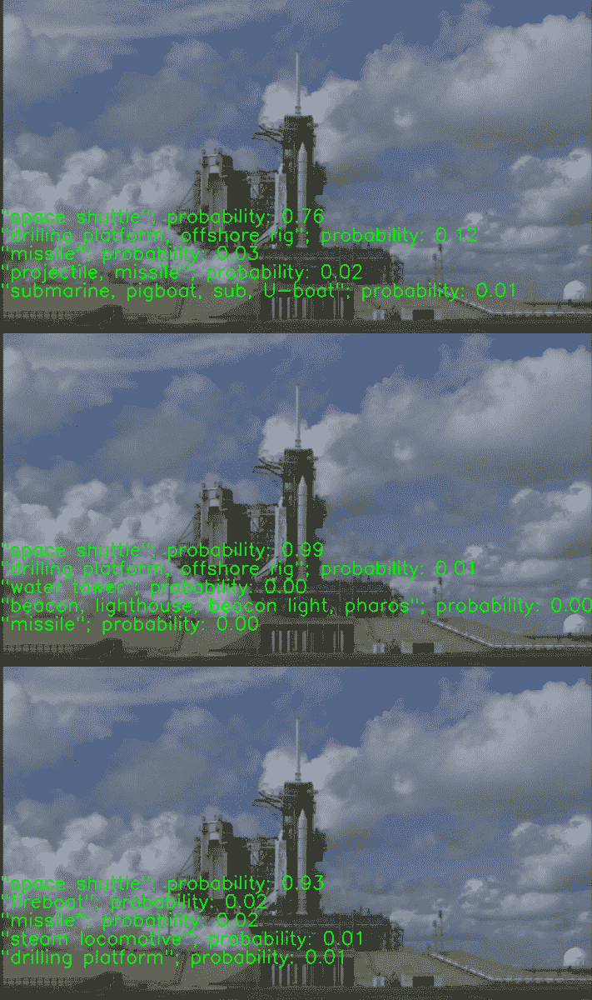
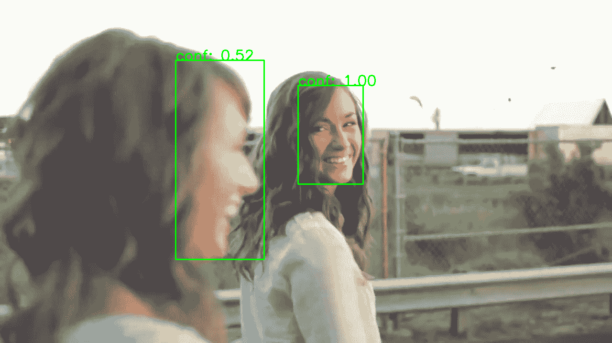
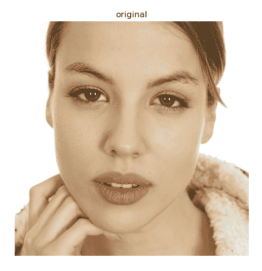

# 深度学习

本章包含以下方面的秘籍：

*   将图像表示为张量/BLOB
*   从 Caffe，Torch 和 TensorFlow 格式加载深度学习模型
*   获取所有层的输入和输出张量的形状
*   卷积网络中的图像预处理和推理
*   测量推理时间以及每个层对其的贡献
*   使用 GoogleNet / Inception 和 ResNet 模型对图像进行分类
*   使用单发检测（SSD）模型检测物体
*   使用全卷积网络（FCN）模型分割场景
*   使用单发检测（SSD）和 ResNet 模型进行人脸检测
*   预测年龄和性别

# 介绍

深度学习让一切都变得更好。 还是？ 似乎时间会证明一切。 但是毫无疑问的事实是，深度学习模型可以解决越来越多的问题。 深度学习现在在许多科学中扮演着重要的角色，计算机视觉也不例外。 OpenCV 最近从三种流行的框架`Caffe`，`Torch`和`Tensorflow`中获得了加载和推断训练后的模型的能力。 本章告诉您如何使用 OpenCV 的此功能。 本章还包含分类，语义分割，对象检测和其他问题的不同现有模型的一些有用的实际应用。

# 将图像表示为张量/BLOB

用于计算机视觉的深度学习模型通常将图像作为输入。 但是，它们不使用图像，而是使用张量。 张量比图像更笼统。 它不受两空间和一通道尺寸的限制。 在本秘籍中，我们将学习如何将图像转换为多维张量。

# 准备

在继续此秘籍之前，您需要安装 OpenCV 3.3（或更高版本）Python API 包。

# 操作步骤

您需要完成以下步骤：

1.  导入模块：

```py
import cv2
import numpy as np
```

2.  打开输入图像并打印其形状：

```py
image_bgr = cv2.imread('../data/Lena.png', cv2.IMREAD_COLOR)
print(image_bgr.shape)
```

3.  将图像转换为四维浮点张量：

```py
image_bgr_float = image_bgr.astype(np.float32)
image_rgb = image_bgr_float[..., ::-1]
tensor_chw = np.transpose(image_rgb, (2, 0, 1))
tensor_nchw = tensor_chw[np.newaxis, ...]

print(tensor_nchw.shape)
```

# 工作原理

如您所知，OpenCV Python 包中的矩阵和图像与 NumPy 数组一起显示。 例如，先前代码中的`cv2.imread`给出了彩色图像，它是一个三维数组，其中所有三个维度分别对应于高度，宽度和通道。 可以将其想象为一个二维矩阵，其中的元素具有按高度乘以宽度的元素，并且每个元素为每个红色，绿色和蓝色通道存储三个值。 可以将此维度顺序编码为字母**高度，宽度和通道**（**HWC**），并且沿着通道维度的数据以蓝色，绿色，红色的顺序存储。

张量是多维矩阵。 许多深度学习模型都接受用于高度，宽度和通道的三维浮点张量三个。 还有一个。 通常，模型不会一次处理一张图像，而是一次处理许多图像。 这堆图像称为批处理，第四维处理该批处理中的单个图像。

OpenCV 深度学习功能以 NCHW 维度顺序操作四维浮点张量：`N`表示批处理中的图像数量，C 表示通道数，H 和 W 分别表示高度和宽度。

因此，要将图像转换为张量，我们需要执行以下步骤：

1.  将图像转换为浮点数
2.  如有必要，将通道的 BGR 顺序更改为 RGB
3.  将 HWC 图像转换为 CHW 张量
4.  在 CHW 张量中添加新尺寸以使其成为 NCHW

如您所见，这很容易。 但是每个步骤都非常重要，仅省略一个步骤可能会导致许多小时的调试，而这正是您试图了解和定位错误的原因。 例如，为什么以及何时需要重新排列 BGR 图像？ 答案与模型训练中使用的通道顺序有关。 如果该模型用于处理 RGB 图像，则很有可能在 BGR 图像上表现不佳。 错过的这个小细节可能会花费您很多时间。

# 从 Caffe，Torch 和 TensorFlow 格式加载深度学习模型

OpenCV 的`dnn`模块的一大功能是能够从三个非常流行的框架中加载经过训练的模型：`Caffe`，`Torch`和`TensorFlow`。 它不仅使`dnn`模块非常有用，而且为将来自不同框架的模型组合到单个管道中提供了可能性。 在本秘籍中，我们将从这三个框架中学习如何使用网络。

# 准备

在继续此秘籍之前，您需要安装 OpenCV 3.3.1（或更高版本）Python API 包。

# 操作步骤

请执行以下步骤：

1.  导入模块：

```py
import cv2
import numpy as np
```

2.  加载`Caffe`模型：

```py
net_caffe = cv2.dnn.readNetFromCaffe('../data/bvlc_googlenet.prototxt', 
                                     '../data/bvlc_googlenet.caffemodel')
```

3.  从`Torch`加载模型：

```py
net_torch = cv2.dnn.readNetFromTorch('../data/torch_enet_model.net')
```

4.  读取并解析经过训练的`TensorFlow`模型：

```py
net_tensorflow = cv2.dnn.readNetFromTensorflow('../data/tensorflow_inception_graph.pb')
```

# 工作原理

要从框架中加载经过预训练的模型，您需要分别对`Caffe`，`Torch`和`TensorFlow`网络使用`readNetFromCaffe`，`readNetFromTorch`或`readNetFromTensorflow`函数。 所有这些函数都返回`cv2.dnn_Net`对象，该对象是来自模型文件的图形的已解析版本。

值得一提的是，在加载具有复杂架构的模型或没有广泛分布的层的模型（例如，您最近添加或开发和实现的具有新型层的模型）时，可能会遇到问题。 OpenCV 的`dnn`模块仍在开发中，可能不包括深度学习框架的最新功能。 但是尽管如此，`dnn`模块还是有很多受支持的层类型来加载处理复杂任务的模型，这就是我们将在本章进一步介绍的内容。

在哪里可以找到预训练的深度学习模型？ 在一些特殊的网页上，您可以找到预先训练的模型本身，以及有关训练过程的有用信息。 由于历史原因，这些模型列表称为**模型动物园**。 [在`Caffe`框架中创建的模型有这样一个列表](https://github.com/BVLC/caffe/wiki/Model-Zoo)； [可以在这里找到`Tensorflow`模型](https://github.com/tensorflow/models)。

# 获取所有层的输入和输出张量的形状

有时，有必要获取有关深度神经网络中的前向传递过程中数据形状发生了什么的信息。 例如，某些模型允许使用各种输入空间大小，在这种情况下，您可能想知道输出张量的形状。 OpenCV 可以选择不推论地获取所有张量（包括中间张量）的所有形状。 本秘籍回顾了使用此类功能以及与神经网络相关的其他有用例程的方式。

# 准备

在继续此秘籍之前，您需要安装 OpenCV 3.3.1（或更高版本）Python API 包。

# 操作步骤

您需要完成以下步骤：

1.  导入模块：

```py
import cv2
import numpy as np
```

2.  从`Caffe`加载模型并打印有关模型中使用的层类型的信息：

```py
net = cv2.dnn.readNetFromCaffe('../data/bvlc_googlenet.prototxt', 
                               '../data/bvlc_googlenet.caffemodel')

if not net.empty():
    print('Net loaded successfully\n')

print('Net contains:')
for t in net.getLayerTypes():
    print('\t%d layers of type %s' % (net.getLayersCount(t), t))
```

3.  获取已加载模型的张量形状和指定的输入形状。 然后打印所有信息：

```py
layers_ids, in_shapes, out_shapes = net.getLayersShapes([1, 3, 224, 224])

layers_names = net.getLayerNames()

print('Net layers shapes:')
for l in range(len(layers_names)):
    in_num, out_num = len(in_shapes[l]), len(out_shapes[l])
    print('Layer "%s" has %d input(s) and %d output(s)' 
          % (layers_names[l], in_num, out_num))
    for i in range(in_num):
        print('\tinput #%d has shape' % i, in_shapes[l][i].flatten())

    for i in range(out_num):
        print('\toutput #%d has shape' % i, out_shapes[l][i].flatten())
```

# 工作原理

`cv2.dnn`模块中`Net`类的`getLayersShapes`函数计算所有张量形状。 它接受形状作为输入，它是四个整数的列表。 列表中的元素是示例数，通道数，输入张量的宽度和高度。 该函数返回三个元素的元组：模型中的层标识符列表，每层的输入张量形状列表以及每层的输出张量形状列表。 当我们想获取有关层的其他信息时，层标识符列表是必需的，因为`cv2.dnn_Net`的某些功能会接受该列表中的标识符。 输入和输出形状的返回列表包含层所有输出的所有形状。 由于每一层可以具有多个输入和输出，所以这些返回的列表包含长度为`4`的 NumPy 整数数组的列表。

另外，我们在先前的代码中使用了其他一些功能。 让我们也讨论它们。 如果网络不包含任何层，则`cv2.dnn_Net`的`empty`函数返回`True`。 它可用于检查是否已加载模型。

`getLayerTypes`函数返回模型中使用的所有层类型。 这些信息可以帮助您获得有关模型的基本概念。 `getLayersCount`函数获取层类型，并返回具有指定类型的多个层。 `getLayerNames`函数为您提供了模型中各层的所有名称。 基本上，神经网络模型包含这些层的名称，并且在加载和解析期间会保留它们。 这些名称由`getLayerNames`函数返回。

# 卷积网络中的图像预处理和推理

我们训练人工神经网络以用于我们的任务。 在这里，出现了一些条件。 首先，我们需要以网络可以处理的格式和范围准备输入数据。 其次，我们需要将数据正确地传递到网络。 OpenCV 帮助我们执行两个步骤，在本秘籍中，我们研究如何使用 OpenCV 的`dnn`模块轻松地将图像转换为张量并进行推理。

# 准备

在继续此秘籍之前，您需要安装 OpenCV 3.3.1（或更高版本）Python API 包。

# 操作步骤

对于此秘籍，您需要完成以下步骤：

1.  导入我们将要使用的模块：

```py
import cv2
import numpy as np
```

2.  打开输入图像，对其进行预处理，然后将其转换为张量：

```py
image = cv2.imread('../data/Lena.png', cv2.IMREAD_COLOR)
tensor = cv2.dnn.blobFromImage(image, 1.0, (224, 224),
                               (104, 117, 123), False, False);
```

3.  通过初步预处理将两个图像转换为张量：

```py
tensor = cv2.dnn.blobFromImages([image, image], 1.0, (224, 224),
                                (104, 117, 123), False, True);
```

4.  加载经过训练的神经网络模型：

```py
net = cv2.dnn.readNetFromCaffe('../data/bvlc_googlenet.prototxt', 
                               '../data/bvlc_googlenet.caffemodel')
```

5.  设置加载模型的输入并执行推断：

```py
net.setInput(tensor);
prob = net.forward();
```

6.  重复设置输入并使用指定的层名称执行推理：

```py
net.setInput(tensor, 'data');
prob = net.forward('prob');
```

# 工作原理

OpenCV `dnn`模块包含一个方便的功能，可通过预处理`blobFromImage`将图像转换为张量。 该函数的参数是输入图像（具有一个或三个通道），比例因子，以（宽度，高度）格式输出的空间大小，要减去的平均值，是否交换红色和蓝色通道的布尔标志，以及在调整大小之前是否从中心裁剪图像以保存对象在图像中的长宽比的布尔标记，还是只是在不保留对象比例的情况下调整大小。 `blobFromImage`函数在将图像转换为张量时经历以下步骤：

1.  该功能调整图像大小。 如果裁切标记为`True`，则在保留宽高比的同时调整输入图像的大小。 图像的一个尺寸（宽度或高度）设置为所需的值，另一个尺寸设置为等于或大于`size`参数中的相应值。 然后，从中心得到的图像被裁剪为所需的尺寸。 如果裁剪标记为`False`，则该函数将调整为目标空间大小。
2.  如有必要，该函数可将调整大小后的图像的值转换为浮点类型。
3.  如果相应的参数为`True`，则该函数交换第一个和最后一个通道。 这是必要的，因为 OpenCV 加载后会以 BGR 通道顺序提供图像，但是某些深度学习模型可能会针对 RGB 通道顺序进行图像训练。
4.  然后，该函数从图像的每个像素中减去平均值。 相应的参数可以是三值元组，也可以只是一值元组。 如果它是三值元组，则在交换通道后从相应的通道中减去每个值。 如果是单个值，则从每个通道中减去它。
5.  将生成的图像乘以比例因子（第二个参数）。
6.  将三维图像转换为具有 NCHW 尺寸顺序的三维张量。

`blobFromImage`函数返回执行了所有预处理的四维浮点张量。

重要的是，预处理必须与训练模型时的预处理相同。 否则，该模型可能无法正常工作甚至根本无法工作。 如果您自己训练了模型，则将了解所有参数。 但是，如果您已经在互联网上找到了模型，则需要检查模型的描述或训练脚本以获取必要的信息。

如果要从多个图像创建张量，则需要使用`blobFromImages`例程。 它具有与上一个函数相同的参数，但第一个参数除外，第一个参数应该是要从中创建张量的图像列表。 图像按照第一个参数中列出的顺序转换为张量。

要进行推断，您必须使用`cv2.dnn_Net.setInput`将张量设置为模型的输入，然后调用`cv2.dnn_Net.forward`以获取网络的输出。 `setInput`接受要设置的张量，还可以接受输入的名称。 当模型具有多个输入时，输入的名称将确定我们要设置的输入。

`forward`函数逐层执行从输入到输出的所有计算，并返回结果张量。 另外，您可以通过传递层名称作为参数来指定需要返回哪个层的输出。

出现一个问题，如何解释模型的输出？ 解释取决于模型本身。 输入图像，分割图或某些更复杂的结构的类的可能性可能很大。 确切了解的唯一方法是检查有关模型的架构和训练过程的信息。

# 测量推理时间以及每个层对其的贡献

在本秘籍中，您将学习如何计算网络中以正向传播方式执行的浮点运算的总数，以及消耗的内存量。 当您想了解模型的局限性并揭示瓶颈的确切位置以进行优化时，这很有用。

# 准备

在继续此秘籍之前，您需要安装具有 Python API 支持的 OpenCV3.x。

# 操作步骤

您需要执行以下步骤：

1.  导入模块：

```py
import cv2
import numpy as np
```

2.  导入`Caffe`模型：

```py
model = cv2.dnn.readNetFromCaffe('../data/bvlc_googlenet.prototxt',
                                 '../data/bvlc_googlenet.caffemodel')
```

3.  计算在推理阶段执行的 FLOP 数量：

```py
print('gflops:', model.getFLOPS((1,3,224,224))*1e-9)
```

4.  报告存储权重和中间张量所消耗的内存量：

```py
w,b = model.getMemoryConsumption((1,3,224,224))
print('weights (mb):', w*1e-6, ', blobs (mb):', b*1e-6)
```

5.  对模拟输入执行正向传播：

```py
blob = cv2.dnn.blobFromImage(np.zeros((224,224,3), np.uint8), 1, (224,224))
model.setInput(blob)
model.forward()
```

6.  报告总时间：

```py
total,timings = model.getPerfProfile()
tick2ms = 1e3/cv2.getTickFrequency()
print('inference (ms): {:2f}'.format(total*tick2ms))
```

7.  报告每层推理时间：

```py
layer_names = model.getLayerNames()
print('{: <30} {}'.format('LAYER', 'TIME (ms)'))
for (i,t) in enumerate(timings):
    print('{: <30} {:.2f}'.format(layer_names[i], t[0]*tick2ms))
```

# 工作原理

您可以使用`model.getFLOPs`和`model.getMemoryConsumption`方法获得模型 FLOP 计数和消耗的内存量。 两种方法都将指定的 BLOB 形状作为输入。 每层推理时间统计信息在执行前向传递之后可用，并且可以通过`model.getPerfProfile`方法获得，该方法返回总推理时间和每层计时，所有信息均以滴答为单位。

预期输出如下：

```py
gflops: 3.1904431360000003
weights (mb): 27.994208 , blobs (mb): 45.92096
inference (ms): 83.478832
LAYER TIME (ms)
conv1/7x7_s2 4.57
conv1/relu_7x7 0.00
pool1/3x3_s2 0.74
pool1/norm1 1.49
conv2/3x3_reduce 0.57
conv2/relu_3x3_reduce 0.00
conv2/3x3 11.53
conv2/relu_3x3 0.00
conv2/norm2 3.35
pool2/3x3_s2 0.90
inception_3a/1x1 0.55
...
inception_5b/relu_pool_proj 0.00
inception_5b/output 0.00
pool5/7x7_s1 0.07
pool5/drop_7x7_s1 0.00
loss3/classifier 0.30
prob 0.02
```

# 使用 GoogleNet/Inception 和 ResNet 模型的图像分类

在计算机视觉中，分类任务是对输入图像属于特定类别的概率的估计。 换句话说，算法必须确定图像的类别，主要目标是创建具有最少错误数量的分类器。 分类任务首先使深度学习算法比其他算法更具优势。 从那以后，深度学习引起了许多科学家和工程师的极大兴趣。 在本秘籍中，我们将将具有不同架构的三个模型应用于分类任务。

# 准备

在继续此秘籍之前，您需要安装 OpenCV 3.3.1 Python API 包。

# 操作步骤

您需要按照以下步骤操作：

1.  导入模块：

```py
import cv2
import numpy as np
```

2.  定义一个`classify`函数，该函数从视频中获取帧，将其转换为张量，将其馈送到神经网络，并选择概率最高的五个类别：

```py
def classify(video_src, net, in_layer, out_layer, 
             mean_val, category_names, swap_channels=False):
    cap = cv2.VideoCapture(video_src)

    t = 0

    while True:
        status_cap, frame = cap.read()
        if not status_cap:
            break

        if isinstance(mean_val, np.ndarray):
            tensor = cv2.dnn.blobFromImage(frame, 1.0, (224, 224),
                       1.0, False);
            tensor -= mean_val
        else:
            tensor = cv2.dnn.blobFromImage(frame, 1.0, (224, 224),
                                   mean_val, swap_channels);
        net.setInput(tensor, in_layer);
        prob = net.forward(out_layer);

        prob = prob.flatten()

        r = 1
        for i in np.argsort(prob)[-5:]:
            txt = '"%s"; probability: %.2f' % (category_names[i], prob[i])
            cv2.putText(frame, txt, (0, frame.shape[0] - r*40), 
                        cv2.FONT_HERSHEY_SIMPLEX, 1, (0, 255, 0), 2);
            r += 1

        cv2.imshow('classification', frame)
        if cv2.waitKey(1) == 27:
            break

    cv2.destroyAllWindows()
    cap.release()
```

3.  打开一个文件，其中包含以下类别的名称：

```py
with open('../data/synset_words.txt') as f:
    class_names = [' '.join(l.split(' ')[1: ]).rstrip() for l in f.readlines()]
```

4.  从`Caffe`加载`GoogleNet`模型并调用我们在“步骤 2”中定义的`classify`函数：

```py
googlenet_caffe = cv2.dnn.readNetFromCaffe('../data/bvlc_googlenet.prototxt', 
                                           '../data/bvlc_googlenet.caffemodel')

classify('../data/shuttle.mp4', googlenet_caffe, 'data', 'prob', (104, 117, 123), class_names)
```

5.  再次从`Caffe`打开 ResNet-50 模型，加载带有平均值的张量，然后再次调用`classify`：

```py
resnet_caffe = cv2.dnn.readNetFromCaffe('../data/resnet_50.prototxt', 
                                           '../data/resnet_50.caffemodel')
mean = np.load('../data/resnet_50_mean.npy')

classify('../data/shuttle.mp4', resnet_caffe, 'data', 'prob', mean, class_names)
```

6.  加载已经训练了`TensorFlow`中的`GoogleNet`模型的类别名称，从`TensorFlow`中加载该模型，并对视频中的帧进行分类：

```py
with open('../data/imagenet_comp_graph_label_strings.txt') as f:
    class_names = [l.rstrip() for l in f.readlines()]

googlenet_tf = cv2.dnn.readNetFromTensorflow('../data/tensorflow_inception_graph.pb')

classify('../data/shuttle.mp4', googlenet_tf, 
         'input', 'softmax2', 117, class_names, True)
```

# 工作原理

用于分类的神经网络模型通常接受三通道图像，并产生具有跨类别概率的向量。 要使用经过训练的模型，您需要了解以下几点：

*   在训练中使用了什么输入图像的预处理
*   哪些层是输入，哪些层是输出
*   输出张量中数据的组织方式
*   输出张量中的值有什么含义

在我们的案例中，每个模型都需要自己的预处理。 此外，模型需要不同的通道顺序。 如果没有这两件事，模型将无法正常工作（有时会略微起作用，有时甚至会非常严重）。 此外，模型的输入和输出层名称不同。

分类中的输出向量包含所有类别的概率。 输出中最大值的索引是类别的索引。 要将此类索引转换为名称，您需要解析一个特殊文件，其中类别索引及其名称之间具有匹配项。 对于不同的模型，这些文件可能不同（在我们的情况下也不同）。

执行代码后，您将获得类似于以下内容的图像：



# 使用单发检测（SSD）模型检测对象

在本秘籍中，您将学习如何通过预训练的 MobileNet 网络使用**单发检测**（**SSD**）方法来检测物体。 该模型支持 20 个类别，可用于需要在场景中查找对象的许多计算机视觉应用中，例如车辆碰撞警告。 要了解更多信息，请访问[这里](https://arxiv.org/abs/1512.02325)。

# 准备

在继续此秘籍之前，您需要安装 OpenCV 3.x Python API 包。

# 操作步骤

您需要完成以下步骤：

1.  导入模块：

```py
import cv2
import numpy as np
```

2.  导入`Caffe`模型：

```py
model = cv2.dnn.readNetFromCaffe('../data/MobileNetSSD_deploy.prototxt',
                                 '../data/MobileNetSSD_deploy.caffemodel')
```

3.  设置置信度阈值并指定模型支持的类：

```py
CONF_THR = 0.3
LABELS = {1: 'aeroplane', 2: 'bicycle', 3: 'bird', 4: 'boat',
          5: 'bottle', 6: 'bus', 7: 'car', 8: 'cat', 9: 'chair',
          10: 'cow', 11: 'diningtable', 12: 'dog', 13: 'horse',
          14: 'motorbike', 15: 'person', 16: 'pottedplant',
          17: 'sheep', 18: 'sofa', 19: 'train', 20: 'tvmonitor'}
```

4.  打开道路交通视频：

```py
video = cv2.VideoCapture('../data/traffic.mp4')
while True:
    ret, frame = video.read()
    if not ret: break
```

5.  检测对象：

```py
    h, w = frame.shape[0:2]
    blob = cv2.dnn.blobFromImage(frame, 1/127.5, (300*w//h,300),
                                 (127.5,127.5,127.5), False)
    model.setInput(blob)
    output = model.forward()
```

6.  绘制检测到的对象：

```py
    for i in range(output.shape[2]):
        conf = output[0,0,i,2]
        if conf > CONF_THR:
            label = output[0,0,i,1]
            x0,y0,x1,y1 = (output[0,0,i,3:7] * [w,h,w,h]).astype(int)
            cv2.rectangle(frame, (x0,y0), (x1,y1), (0,255,0), 2)
            cv2.putText(frame, '{}: {:.2f}'.format(LABELS[label], conf), 
                        (x0,y0), cv2.FONT_HERSHEY_SIMPLEX, 1, (0,255,0), 2)

    cv2.imshow('frame', frame)
    key = cv2.waitKey(3)
    if key == 27: break

cv2.destroyAllWindows() 
```

# 工作原理

在本秘籍中，我们使用 SSD 方法进行车辆检测，该方法使用 MobileNet 作为骨干网络。 该模型由 MS COCO 数据集进行了预训练，并支持许多通用类，例如人，汽车和鸟类。

在代码中，我们指定了检测成功所需的最低置信度（`CONF_THR=0.3`）。

预期输出如下：


# 使用全卷积网络（FCN）模型分割场景

在本秘籍中，您将学习如何将任意图像进行语义分割，分为 21 类，例如人，汽车和鸟。 当需要了解场景时，此功能非常有用。 例如，在增强现实应用中以及为驾驶员提供帮助。 要了解更多信息，请访问[这里](https://arxiv.org/abs/1605.06211)。

# 准备

在继续此秘籍之前，您需要安装 OpenCV 3.x Python API 包。

从[这里](http://dl.caffe.berkeleyvision.org/fcn8s-heavy-pascal.caffemodel)下载模型权重并将文件保存到数据文件夹中。

# 操作步骤

您需要完成以下步骤：

1.  导入模块：

```py
import cv2
import numpy as np
```

2.  导入`Caffe`模型：

```py
model = cv2.dnn.readNetFromCaffe('../data/fcn8s-heavy-pascal.prototxt',
                                 '../data/fcn8s-heavy-pascal.caffemodel')
```

3.  加载图像并进行推断：

```py
frame = cv2.imread('../data/scenetext01.jpg')
blob = cv2.dnn.blobFromImage(frame, 1, (frame.shape[1],frame.shape[0]))
model.setInput(blob)
output = model.forward()
```

4.  使用每像素类标签计算图像：

```py
labels = output[0].argmax(0)
```

5.  可视化结果：

```py
plt.figure(figsize=(14,10))
plt.subplot(121)
plt.axis('off')
plt.title('original')
plt.imshow(frame[:,:,[2,1,0]])
plt.subplot(122)
plt.axis('off')
plt.title('segmentation')
plt.imshow(labels)
plt.tight_layout()
plt.show()
```

# 工作原理

我们使用基于 VGG 的全卷积网络方法对每个像素进行场景分割。 该模型支持 21 个类。 该模型非常耗时，推理可能会占用大量 CPU 时间，因此请耐心等待。

预期结果如下：


# 使用单发检测（SSD）和 ResNet 模型的人脸检测

在本秘籍中，您将学习如何使用卷积神经网络模型检测面部。 在各种计算机视觉应用（例如面部增强）中都使用了在不同条件下准确检测面部的能力。

# 准备

在继续此秘籍之前，您需要安装 OpenCV 3.x Python API 包。

# 操作步骤

您需要完成以下步骤：

1.  导入模块：

```py
import cv2
import numpy as np
```

2.  加载模型并设置置信度阈值：

```py
model = cv2.dnn.readNetFromCaffe('../data/face_detector/deploy.prototxt', 
                                 '../data/face_detector/res10_300x300_ssd_iter_140000.caffemodel')
CONF_THR = 0.5
```

3.  打开视频：

```py
video = cv2.VideoCapture('../data/faces.mp4')
while True:
    ret, frame = video.read()
    if not ret: break
```

4.  检测当前帧中的人脸：

```py
    h, w = frame.shape[0:2]
    blob = cv2.dnn.blobFromImage(frame, 1, (300*w//h,300), (104,177,123), False)
    model.setInput(blob)
    output = model.forward()
```

5.  可视化结果：

```py
    for i in range(output.shape[2]):
        conf = output[0,0,i,2]
        if conf > CONF_THR:
            label = output[0,0,i,1]
            x0,y0,x1,y1 = (output[0,0,i,3:7] * [w,h,w,h]).astype(int)
            cv2.rectangle(frame, (x0,y0), (x1,y1), (0,255,0), 2)
            cv2.putText(frame, 'conf: {:.2f}'.format(conf), (x0,y0),
                        cv2.FONT_HERSHEY_SIMPLEX, 1, (0,255,0), 2)

    cv2.imshow('frame', frame)
    key = cv2.waitKey(3)
    if key == 27: break

cv2.destroyAllWindows()
```

# 工作原理

我们对 ResNet-10 模型使用单发检测方法。 送入输入帧时，请注意指定平均颜色。

预期输出如下：



# 年龄和性别预测

在本秘籍中，您将学习如何通过图像预测一个人的年龄和性别。 一种可能的应用是例如收集有关人们在数字标牌显示器中查看内容的统计信息。

# 准备

在继续此秘籍之前，您需要安装 OpenCV 3.x Python API 包。

# 操作步骤

您需要完成以下步骤：

1.  导入模块：

```py
import cv2
import numpy as np
import matplotlib.pyplot as plt
```

2.  加载模型：

```py
age_model = cv2.dnn.readNetFromCaffe('../data/age_gender/age_net_deploy.prototxt',
                                     '../data/age_gender/age_net.caffemodel')
gender_model = cv2.dnn.readNetFromCaffe('../data/age_gender/gender_net_deploy.prototxt',
                                        '../data/age_gender/gender_net.caffemodel')
```

3.  加载并裁剪源图像：

```py
orig_frame = cv2.imread('../data/face.jpeg')
dx = (orig_frame.shape[1]-orig_frame.shape[0]) // 2
orig_frame = orig_frame[:,dx:dx+orig_frame.shape[0]]
```

4.  可视化图像：

```py
plt.figure(figsize=(6,6))
plt.title('original')
plt.axis('off')
plt.imshow(orig_frame[:,:,[2,1,0]])
plt.show()
```

5.  用平均像素值加载图像，然后从源图像中减去它们：

```py
mean_blob = np.load('../data/age_gender/mean.npy')
frame = cv2.resize(orig_frame, (256,256)).astype(np.float32)
frame -= np.transpose(mean_blob[0], (1,2,0))
```

6.  设置年龄和性别列表：

```py
AGE_LIST = ['(0, 2)','(4, 6)','(8, 12)','(15, 20)',
            '(25, 32)','(38, 43)','(48, 53)','(60, 100)']
GENDER_LIST = ['male','female']
```

7.  分类性别：

```py
blob = cv2.dnn.blobFromImage(frame, 1, (256,256))
gender_model.setInput(blob)
gender_prob = gender_model.forward()
gender_id = np.argmax(gender_prob)
print('Gender: {} with prob: {}'.format(GENDER_LIST[gender_id], gender_prob[0, gender_id]))
```

8.  分类年龄段：

```py
age_model.setInput(blob)
age_prob = age_model.forward()
age_id = np.argmax(age_prob)
print('Age group: {} with prob: {}'.format(AGE_LIST[age_id], age_prob[0, age_id]))
```

# 工作原理

在本秘籍中，我们使用了两种不同的模型：一种用于性别分类，另一种用于年龄组分类。 请注意，在此秘籍中，与其他秘籍相比，我们从源图像中减去每个像素的平均值，而不是每个通道的值。 您实际上可以将平均值可视化并看到平均的人脸。

这是输入图像：



预期输出如下：

```py
Gender: female with prob: 0.9362890720367432
Age group: (25, 32) with prob: 0.9811384081840515
```