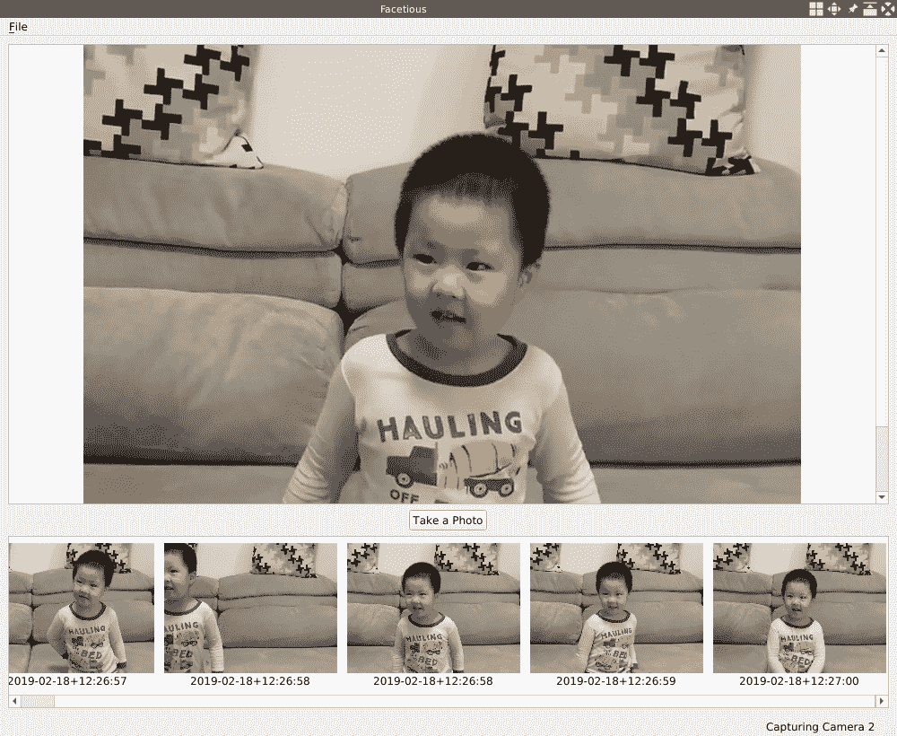
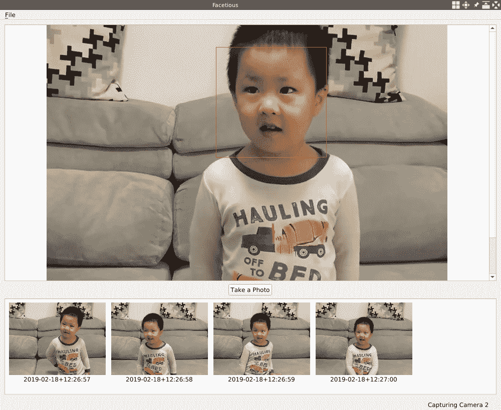
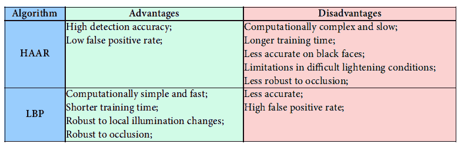
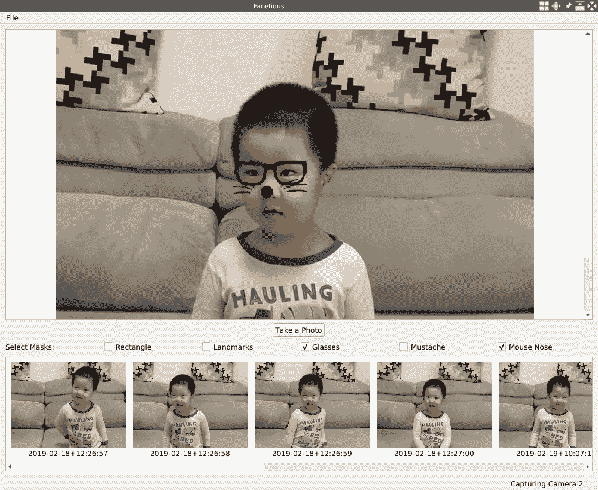

# 脸上的乐趣

在 第 3 章，“家庭安全应用”中，我们创建了一个名为 **Gazer** 的新应用程序，利用该应用程序，我们可以捕获视频并从连接的网络摄像头中检测运动 到我们的计算机。 在本章中，我们将继续使用网络摄像头-代替检测运动，我们将创建一个新应用程序，该应用程序能够使用相机检测面部。 首先，我们将检测网络摄像头中的面部。 然后，我们将在检测到的面部上检测面部标志。 通过这些面部标志，我们可以知道每个检测到的脸上的眼睛，鼻子，嘴巴和脸颊在哪里，因此我们可以在脸上应用一些有趣的面具。

本章将涵盖以下主题：

*   从网络摄像头拍照
*   使用 OpenCV 检测人脸
*   使用 OpenCV 检测面部标志
*   Qt 库的资源系统
*   在脸上涂上口罩

# 技术要求

正如我们在前几章中所看到的，要求用户至少安装 Qt 版本 5 并具有 C ++和 Qt 编程的基本知识。 另外，应正确安装最新版本的 OpenCV 4.0。 另外，除了`core`和`imgproc`模块外，本章还将使用 OpenCV 的`video`和`videoio`模块。 如果您已经阅读了前面的章节，那么这些要求将已经得到满足。

我们将使用 OpenCV 提供的一些经过预训练的机器学习模型来检测面部和面部标志，因此，如果您具有一些机器学习技术的基础知识，那就更好了。 其中一些机器学习模型来自 OpenCV 库的其他模块，因此 OpenCV 的其他模块也必须与核心模块一起安装。 如果不确定这一点，请放心，我们将逐步安装额外的 OpenCV 模块，然后在本章中使用它们。

本章的所有代码都可以在我们的代码库中找到，网址为 [https://github.com/PacktPublishing/Qt-5-and-OpenCV-4-Computer-Vision-Projects/tree/master/Chapter-04](https://github.com/PacktPublishing/Qt-5-and-OpenCV-4-Computer-Vision-Projects/tree/master/Chapter-04) 。

[观看以下视频，查看运行中的代码](http://bit.ly/2FfQOmr)

# Facetious 应用程序

由于我们将在本章中创建的应用程序会通过将有趣的蒙版实时应用于检测到的面部而为我们带来很多乐趣，因此我将应用程序命名为 **Facetious** 。 Facetious 应用程序可以做的第一件事是打开一个网络摄像头，然后播放其中的视频。 这就是我们在上一章中由我们构建的 Gazer 应用程序中所做的工作。 因此，在这里，我将借用 Gazer 应用程序的框架作为新应用程序的基础。 该计划是，首先，我们复制 Gazer，将其重命名为`Facetious`，删除有关运动检测的功能，并将视频记录功能更改为新的照相功能。 这样，我们将获得一个简单干净的应用程序，可以在其中添加面部和面部标志检测的新功能。

# 从盖泽到风趣

让我们从复制 Gazer 应用程序的源代码开始：

```cpp
 $ mkdir Chapter-04
 $ cp -r Chapter-03/Gazer Chapter-04/Facetious
 $ ls Chapter-04
 Facetious
 $ cd Chapter-04/Facetious
 $ make clean
 $ rm -f Gazer
 $ rm -f Makefile
```

使用这些命令，我​​们将`Chapter-03`目录下的`Gazer`目录复制到`Chapter-04/Facetious`。 然后，我们进入该目录，运行`make clean`清除编译过程中生成的所有中间文件，并使用`rm -f Gazer`删除旧的目标可执行文件。

现在，让我们按文件重命名并清除项目文件。

首先是`Gazer.pro`项目文件。 我们将其重命名为`Facetious.pro`，然后使用编辑器将其打开以编辑其内容。 在编辑器中，我们将`TARGET`键的值从`Gazer`更改为`Facetious`，并从`QT`的值中删除了我们将在此新应用程序中不使用的 Qt 模块，网络和并发。 ]键，然后删除文件末尾的相关`GAZER_USE_QT_CAMERA`行。 `Facetious.pro`中更改的行列出如下：

```cpp
     TARGET = Facetious
     # ...
     QT += core gui multimedia
     # ...
     # the below lines are deleted in this update:
     # Using OpenCV or QCamera
     # DEFINES += GAZER_USE_QT_CAMERA=1
     # QT += multimediawidgets
```

接下来是`main.cpp`文件。 这个文件很简单，因为我们只是将窗口标题从`Gazer`更改为`Facetious`：

```cpp
     window.setWindowTitle("Facetious");
```

接下来是`capture_thread.h`文件。 在此文件中，我们从`CaptureThread`类中删除了许多字段和方法。 将要删除的字段包括：

```cpp
         // FPS calculating
         bool fps_calculating;
         int fps;

         // video saving
         // int frame_width, frame_height; // notice: we keep this line
         VideoSavingStatus video_saving_status;
         QString saved_video_name;
         cv::VideoWriter *video_writer;

         // motion analysis
         bool motion_detecting_status;
         bool motion_detected;
         cv::Ptr<cv::BackgroundSubtractorMOG2> segmentor;
```

此类中将要删除的方法如下：

```cpp
         void startCalcFPS() {...};
         void setVideoSavingStatus(VideoSavingStatus status) {...};
         void setMotionDetectingStatus(bool status) {...};
     // ...
     signals:
         // ...
         void fpsChanged(int fps);
         void videoSaved(QString name);

     private:
         void calculateFPS(cv::VideoCapture &cap);
         void startSavingVideo(cv::Mat &firstFrame);
         void stopSavingVideo();
         void motionDetect(cv::Mat &frame);
```

不再需要`enum VideoSavingStatus`类型，因此我们也将其删除。

OK，`capture_thread.h`文件已清除，让我们继续进行`capture_thread.cpp`文件。 根据头文件中的更改，我们应该首先执行以下操作：

*   在构造函数中，删除头文件中已删除字段的初始化。
*   删除我们在头文件中删除的方法（包括插槽）的实现。
*   在`run`方法的实现中，删除所有有关视频保存，运动检测和每秒帧（**FPS**）计算的代码。

好的，有关视频保存，运动检测和 FPS 计算的所有代码将从捕获线程中删除。 现在让我们看下一个文件`mainwindow.h`。 在本章中，我们仍将使用 OpenCV 进行视频捕获，因此，首先，我们删除`#ifdef GAZER_USE_QT_CAMERA`和`#endif`行之间的代码。 这种代码有两个块，我们将它们都删除了。 然后，我们删除了许多方法和字段，其中大多数也与视频保存，运动检测和 FPS 计算有关。 这些字段和方法如下：

```cpp
         void calculateFPS();
         void updateFPS(int);
         void recordingStartStop();
         void appendSavedVideo(QString name);
         void updateMonitorStatus(int status);

     private:
         // ...
         QAction *calcFPSAction;
         // ...
         QCheckBox *monitorCheckBox;
         QPushButton *recordButton;
```

请注意，`appendSavedVideo`方法和`QPushButton *recordButton`字段并未真正删除。 我们将它们分别重命名为`appendSavedPhoto`和`QPushButton *shutterButton`：

```cpp
         void appendSavedPhoto(QString name);
         // ...
         QPushButton *shutterButton;
```

这是在新应用程序中拍照的准备-正如我们所说的，在 Facetious 中，我们不录制视频，而仅拍照。

然后，在`mainwindow.cpp`文件中，类似于对其头文件进行的操作，首先，我们删除`#ifdef GAZER_USE_QT_CAMERA`和`#else`行之间的代码。 也有两个此类块需要移除； 不要忘记为每个这些块删除`#endif`行。 之后，我们删除了五个已删除方法的实现：

*   `void calculateFPS();`
*   `void updateFPS(int);`
*   `void recordingStartStop();`
*   `void appendSavedVideo(QString name);`
*   `void updateMonitorStatus(int status);`

大部分删除操作都已完成，但是`MainWindow`类仍有很多工作要做。 让我们从用户界面开始。 在`MainWindow::initUI`方法中，我们删除有关监视器状态复选框，记录按钮和记录按钮旁边的占位符的代码，然后创建新的快门按钮：

```cpp
         shutterButton = new QPushButton(this);
         shutterButton->setText("Take a Photo");
         tools_layout->addWidget(shutterButton, 0, 0, Qt::AlignHCenter);
```

使用前面的代码，我们将快门按钮设为`tools_layout`的唯一子窗口小部件，并确保按钮居中对齐。

然后，在创建状态栏之后，我们将状态栏上的启动消息更改为`Facetious is Ready`：

```cpp
         mainStatusLabel->setText("Facetious is Ready");
```

接下来是`MainWindow::createActions`方法。 在此方法中，我们应该执行的更改是删除有关`calcFPSAction`操作的代码，包括创建和信号插槽连接。

然后，在`MainWindow::openCamera`方法中，我们删除有关 FPS 计算和视频保存的所有代码，其中大多数是信号槽连接和断开连接。 此方法末尾有关复选框和按钮的代码也应删除。

关于此文件，我们要做的最后一件事是为新添加的`appendSavedPhoto`方法提供空实现，并清空`populateSavedList`方法的主体。 我们将在以下小节中为他们提供新的实现：

```cpp
     void MainWindow::populateSavedList()
     {
         // TODO
     }

     void MainWindow::appendSavedPhoto(QString name)
     {
         // TODO
     }
```

现在轮到`utilities.h`和`utilities.cpp`文件了。 在头文件中，我们删除`notifyMobile`方法，并将`newSavedVideoName`和`getSavedVideoPath`方法分别重命名为`newPhotoName`和`getPhotoPath`：

```cpp
     public:
         static QString getDataPath();
         static QString newPhotoName();
         static QString getPhotoPath(QString name, QString postfix);
```

在`utilities.cpp`文件中，除了根据头文件中的更改重命名和删除之外，我们还更改了`getDataPath`方法的实现：

```cpp
     QString Utilities::getDataPath()
     {
         QString user_pictures_path = QStandardPaths::standardLocations(QStandardPaths::PicturesLocation)[0];
         QDir pictures_dir(user_pictures_path);
         pictures_dir.mkpath("Facetious");
         return pictures_dir.absoluteFilePath("Facetious");
     }
```

最重要的变化是，现在我们使用`QStandardPaths::PicturesLocation`而不是`QStandardPaths::MoviesLocation`来获取照片而不是视频的标准目录。

现在，通过简化 Gazer 应用程序，我们已经成功地获得了我们新 Facetious 应用程序的基础。 让我们尝试编译并运行它：

```cpp
 $ qmake -makefile
 $ make
 g++ -c #...
 # output truncated
 $ export LD_LIBRARY_PATH=/home/kdr2/programs/opencv/lib
 $ ./Facetious
```

如果一切顺利，您将看到一个与 Gazer 主窗口非常相似的空白窗口。 该小节的所有代码更改都可以在[的单个 Git 提交中找到 https://github.com/PacktPublishing/Qt-5-and-OpenCV-4-Computer-Vision-Projects/commit/0587c55e4e8e175b70f8046ddd4d67039b431b54](https://github.com/PacktPublishing/Qt-5-and-OpenCV-4-Computer-Vision-Projects/commit/0587c55e4e8e175b70f8046ddd4d67039b431b54) 。 如果您在完成本小节时遇到困难，请随时参考该提交。

# 拍照

在前面的小节中，我们通过从 Gazer 应用程序中删除了视频保存和运动检测功能，为新应用程序 Facetious 建立了基础。 我们还在新应用程序中放置了一些存根照片。 在本小节中，我们将完成拍照功能。

与视频录制功能相比，拍照要简单得多。 首先，在`capture_thread.h`头文件中，向`CaptureThread`类添加一个字段和许多方法：

```cpp
     public:
         // ...
         void takePhoto() {taking_photo = true; }
         // ...
     signals:
         // ...
         void photoTaken(QString name);

     private:
         void takePhoto(cv::Mat &frame);

     private:
         // ...
         // take photos
         bool taking_photo;
```

`bool taking_photo`字段是指示捕获线程是否应将当前帧作为照片保存在硬盘上的标志，`void takePhoto()`公共内联方法用于将该标志设置为 true。 当用户单击主窗口上的快门按钮时，我们将在主线程中调用此方法。 每次拍摄照片后都会发出`void photoTaken(QString name)`信号，并且 Qt 元对象系统将负责其实现。 `void takePhoto(cv::Mat &frame)`私有方法是负责将帧作为照片保存在磁盘上的方法，它是我们唯一需要在`capture_thread.cpp`源文件中实现的方法。 让我们看一下它的实现：

```cpp
     void CaptureThread::takePhoto(cv::Mat &frame)
     {
         QString photo_name = Utilities::newPhotoName();
         QString photo_path = Utilities::getPhotoPath(photo_name, "jpg");
         cv::imwrite(photo_path.toStdString(), frame);
         emit photoTaken(photo_name);
         taking_photo = false;
     }
```

在方法的主体中，我们使用在`Utilities`类中编写的函数来生成新名称，并使用生成的名称和`jpg`作为扩展名来获取要保存的照片的路径。 然后，我们使用 OpenCV 的`imgcodecs`模块中的`imwrite`函数将帧作为 JPEG 图像文件写入具有指定路径的磁盘上。 保存照片后，我们发出带有照片名称的`photoTaken`信号。 如果有人对此信号感兴趣，则必须将一个插槽连接到该插槽，并在发出信号时立即调用该插槽。 在方法主体的末尾，我们将`taking_photo`标志设置回`false`。

在实现`CaptureThread::takePhoto(cv::Mat &frame)`方法之后，让我们在`CaptureThread::run()`方法的捕获无限循环中将其称为：

```cpp
             if(taking_photo) {
                 takePhoto(tmp_frame);
             }
```

在这段代码中，我们检查`taking_photo`标志以查看是否应该拍照。 如果是真的，我们调用`takePhoto(cv::Mat &frame)`方法将当前帧保存为照片。 必须在`tmp_frame`通过非空检查之后以及该帧的颜色顺序从 BGR 转换为 RGB 之前放置这段代码，以确保它是具有正确颜色顺序的正确帧，然后可以将其传递给 `imwrite`功能。

关于`CaptureThread`类的最后一件事是在其构造函数中将`taking_photo`标志初始化为`false`。

现在，让我们进入用户界面。 首先，我们向`mainwindow.h`中的`MainWindow`类添加一个新的专用插槽：

```cpp
     private slots:
         // ...
         void takePhoto();
```

该插槽将连接到快门按钮的信号。 让我们在`mainwindow.cpp`源文件中查看其实现：

```cpp
     void MainWindow::takePhoto()
     {
         if(capturer != nullptr) {
             capturer->takePhoto();
         }
     }
```

这很简单。 在此方法中，我们调用`CaptureThread`实例`capturer`的`void takePhoto()`方法，以告知它拍照（如果不为空）。 然后，在`MainWindow::initUI()`方法中，在创建快门按钮之后，将此插槽连接到`shutterButton`的`clicked`信号：

```cpp
         connect(shutterButton, SIGNAL(clicked(bool)), this, SLOT(takePhoto()));
```

通过我们之前完成的工作，现在我们可以告诉捕获线程拍照。 但是，在拍摄照片时，主窗口如何知道呢？ 这是通过`CaptureThread::photoTaken`信号与`MainWindow::appendSavedPhoto`插槽之间的连接完成的。 我们在`MainWindow::openCamera()`方法中创建捕获线程实例后建立此连接：

```cpp
         connect(capturer, &CaptureThread::photoTaken, this, &MainWindow::appendSavedPhoto);
```

另外，不要忘记在以相同方法关闭的捕获线程实例之前断开它们的连接：

```cpp
             disconnect(capturer, &CaptureThread::photoTaken, this, &MainWindow::appendSavedPhoto);
```

现在，让我们看看`MainWindow::appendSavedPhoto(QString name)`插槽的作用。 在前面的小节中，我们只是给了它一个空的主体。 现在它必须承担责任：

```cpp
     void MainWindow::appendSavedPhoto(QString name)
     {
         QString photo_path = Utilities::getPhotoPath(name, "jpg");
         QStandardItem *item = new QStandardItem();
         list_model->appendRow(item);
         QModelIndex index = list_model->indexFromItem(item);
         list_model->setData(index, QPixmap(photo_path).scaledToHeight(145), Qt::DecorationRole);
         list_model->setData(index, name, Qt::DisplayRole);
         saved_list->scrollTo(index);
     }
```

它所做的工作与在第 3 章，“家庭安全应用”中将新录制的视频的封面图像附加到 Gazer 应用程序中保存的视频列表中时的操作非常相似。 因此，我将不在这里逐行解释这段代码。

还有另一种方法`MainWindow::populateSavedList()`，该方法用于在应用程序启动时填充保存在照片列表中的所有照片。 这种方法也非常类似于我们用于在 Gazer 应用程序中填充已保存的视频的方法，因此我将由您自己实施。 如果有任何问题，可以在 GitHub 上参考本书随附的代码存储库。 本小节中的所有更改都可以在以下提交中找到： [https://github.com/PacktPublishing/Qt-5-and-OpenCV-4-Computer-Vision-Projects/commit/744d445ad4c834cd52660a85a224e48279ac2cf4](https://github.com/PacktPublishing/Qt-5-and-OpenCV-4-Computer-Vision-Projects/commit/744d445ad4c834cd52660a85a224e48279ac2cf4) 。

现在，让我们再次编译并运行我们的应用程序。 应用程序显示其主窗口后，我们可以单击“文件”菜单下的“打开相机”操作以打开相机，然后单击“快门”按钮拍照。 完成这些操作后，我的主窗口如下图所示：



在本节中，我们设置新应用程序的基本功能。 在下一节中，我们将使用 OpenCV 实时检测捕获的帧中的人脸。

# 使用级联分类器检测人脸

在上一节中，我们创建了一个新的应用程序 Facetious，可以使用它来播放相机中的视频供稿并拍照。 在本节中，我们将为其添加一个新功能-使用 OpenCV 库实时检测视频中的人脸。

我们将使用 OpenCV 提供的称为**级联分类器**的某些功能来检测人脸。 级联分类器不仅用于检测人脸，还用于检测对象。 作为分类器，它告诉我们图像中特定的关注区域是否是特定类型的对象。 分类器包含几个较简单的分类器或阶段，然后将这些较简单的分类器应用于感兴趣的区域。 如果有任何简单的分类器给出否定结果，则可以说感兴趣区域不包含任何感兴趣的对象。 否则，如果所有阶段都通过了，我们说我们在那个区域找到了物体。 这就是层叠这个词的意思。

在准备使用级联分类器之前，必须先对其进行培训。 在训练过程中，我们为分类器提供了某种对象的许多示例视图（称为正例和负例），其中许多图像不包含此类对象。 例如，如果我们希望级联分类器帮助我们检测人脸，则必须准备许多包含人脸的图像和许多不包含人脸的图像以对其进行训练。 通过这些给定的肯定示例和否定示例，级联分类器将学习如何判断图像的给定区域是否包含某种对象。

训练过程很复杂，但是幸运的是，OpenCV 随其发布提供了许多预训练的层叠分类器。 以 **Haar 分类器**为例，我们稍后将使用它。 如果我们检查已安装的 OpenCV 库的数据目录，则会在其中找到许多经过预训练的分类器数据：

```cpp
 # if you use a system provided OpenCV, the path is /usr/share/opencv/haarcascades
 $ ls /home/kdr2/programs/opencv/share/opencv4/haarcascades/
 haarcascade_eye_tree_eyeglasses.xml haarcascade_lefteye_2splits.xml
 haarcascade_eye.xml haarcascade_licence_plate_rus_16stages.xml
 haarcascade_frontalcatface_extended.xml haarcascade_lowerbody.xml
 haarcascade_frontalcatface.xml haarcascade_profileface.xml
 haarcascade_frontalface_alt2.xml haarcascade_righteye_2splits.xml
 haarcascade_frontalface_alt_tree.xml haarcascade_russian_plate_number.xml
 haarcascade_frontalface_alt.xml haarcascade_smile.xml
 haarcascade_frontalface_default.xml haarcascade_upperbody.xml
 haarcascade_fullbody.xml
```

我们可以通过名称轻松区分预训练的数据文件。 面部检测需要包含`frontalface`的文件名。

有了有关对象检测（尤其是面部检测）的知识，现在让我们回到应用程序以从视频提要中检测面部。

首先，我们应该更新我们的`Facetious.pro`项目文件：

```cpp
    # ...
    unix: !mac {
        INCLUDEPATH += /home/kdr2/programs/opencv/include/opencv4
        LIBS += -L/home/kdr2/programs/opencv/lib -lopencv_core -lopencv_imgproc -lopencv_imgcodecs -lopencv_video -lopencv_videoio -lopencv_objdetect
    }

    # ...
    DEFINES += OPENCV_DATA_DIR=\\\"/home/kdr2/programs/opencv/share/opencv4/\\\"
    #...
```

在`LIBS`键的配置中，我们将`opencv_objdetect` OpenCV 模块附加到其值，因为此 OpenCV 核心模块提供了将要使用的对象检测功能（包括面部检测）。 更改的第二部分是一个宏定义，该定义定义了我们的 OpenCV 安装的数据目录。 我们将使用此宏将预训练的分类器数据加载到我们的代码中。

然后，转到`capture_thread.h`头文件。 我们在此文件的`CaptureThread`类中添加一个私有方法和一个私有成员字段：

```cpp
    #include "opencv2/objdetect.hpp"
    //...

    private:
        // ...
        void detectFaces(cv::Mat &frame);

    private:
        // ...

        // face detection
        cv::CascadeClassifier *classifier;
```

显然，成员字段是用于检测人脸的级联分类器，并且人脸检测的工作将通过新添加的`detectFaces`方法完成。

现在，让我们转到`capture_thread.cpp`源文件，看看我们将如何在其中使用级联分类器。 首先，我们更新`CaptureThread::run`方法的主体：

```cpp
        classifier = new cv::CascadeClassifier(OPENCV_DATA_DIR "haarcascades/haarcascade_frontalface_default.xml");

        while(running) {
            cap >> tmp_frame;
            if (tmp_frame.empty()) {
                break;
            }

            detectFaces(tmp_frame);
            // ...
        }
        cap.release();
        delete classifier;
        classifier = nullptr;
```

输入此方法并打开网络摄像头后，我们创建一个`cv::CascadeClassifier`实例并将其分配给`classifier`成员字段。 创建实例时，我们将预训练的分类器数据路径传递给构造函数。 路径由`OPENCV_DATA_DIR`宏构建，该宏由我们在项目文件中定义。 此外，我们使用 OpenCV 数据目录下的`haarcascades/haarcascade_frontalface_default.xml`文件创建用于面部检测的分类器。

在`run`方法的无限循环中，我们使用刚从打开的摄像头捕获的帧调用新添加的`detectFaces`方法。

在无限循环结束之后，在捕获线程退出之前，我们要进行清理工作，释放打开的相机，删除分类器，并将其设置为 null。

最后，让我们看一下`detectFaces`方法的实现：

```cpp
    void CaptureThread::detectFaces(cv::Mat &frame)
    {
        vector<cv::Rect> faces;
        cv::Mat gray_frame;
        cv::cvtColor(frame, gray_frame, cv::COLOR_BGR2GRAY);
        classifier->detectMultiScale(gray_frame, faces, 1.3, 5);

        cv::Scalar color = cv::Scalar(0, 0, 255); // red
        for(size_t i = 0; i < faces.size(); i++) {
            cv::rectangle(frame, faces[i], color, 1);
        }
    }
```

在此方法的主体中，我们首先声明一个`cv::Rect`向量，用于保存将要检测的人脸的外接矩形。 接下来，我们将输入帧转换为灰度图像，因为人脸检测过程与 RGB 颜色的特征无关。 然后，我们称为分类器的`detectMultiScale`方法。 该方法的第一个参数是我们要在其中检测面部的灰度输入框。 第二个参数是对矩形向量的引用，该矩形向量用于保存我们刚刚定义的检测到的脸部的外接矩形。 第三个参数用于指定在每个图像比例下将图像尺寸缩小多少，这是为了补偿对一个面部由于仅仅靠近相机而显得比另一个更大时出现的尺寸错误认识。 。 这种检测算法使用移动窗口来检测对象； 第四个参数用于定义在可以声明要查找的人脸之前在当前对象附近找到多少个对象。

`detectMultiScale`方法返回后，我们将在`faces`向量中获取检测到的面部的所有区域，然后在捕获的帧上绘制这些矩形，并用一像素的红色边框。

好的，人脸检测功能现已完成，因此让我们编译并运行我们的项目。 当有人进入打开的网络摄像头的视野时，您会在他们的脸部周围看到一个红色矩形：



在我们的代码中，当我们创建级联分类器时，我们使用了`haarcascade_frontalface_default.xml`文件。 但是您可能会注意到，当我们列出 OpenCV 安装的数据目录时，有多个文件，其名称指示该文件用于正面检测，例如`haarcascade_frontalface_alt.xml`，`haarcascade_frontalface_alt2.xml`或`haarcascade_frontalface_alt_tree.xml`。 为什么我们选择`haarcascade_frontalface.xml`，而不选择其他？ 在不同的数据集上或在不同的配置下训练该预训练的模型数据。 这些文件的详细信息在每个文件的开头都以注释形式记录在文件中，因此您可以根据需要参考该文件。 选择模型文件的另一种直接方法是尝试所有模型文件，在数据集上对其进行测试，计算精度和召回率，然后为您的案例选择最佳模型。

除 Haar 级联分类器外，还有一个称为 **l** **ocal 二进制模式**（**LBP**）级联分类器的级联分类器，随 OpenCV 版本一起提供 默认。 您可以在 OpenCV 安装的数据路径的`lbpcascades`目录下找到其训练有素的模型数据。 LBP 级联分类器比 Haar 更快，但精度也较低。 我们可以将它们与下表进行比较：



请随意尝试这些算法和预先训练的模型数据，以找到适合您情况的最佳算法。

# 检测面部标志

在上一节中，通过使用 OpenCV 提供的级联分类器检测面部，我们知道哪些区域是图像中的面部。 但是只有矩形区域，我们不知道有关脸部的许多细节：脸部的眼睛，眉毛和鼻子在哪里？ 在面部识别技术中，我们将这些细节称为**面部标志**。 在本节中，我们将尝试找到一种检测这些面部标志的方法。

不幸的是，OpenCV 核心模块没有提供检测面部标志的算法，因此我们应该诉诸于人脸模块，这是一个额外的 OpenCV 模块。

在使用额外的面部模块之前，我们必须确保已在计算机上安装了该模块。 在第 2 章，*中，像 Pro* 一样编辑图像，在*中从源代码*部分构建和安装 OpenCV，我们从源代码构建并安装了 OpenCV v4.0.0。 没有额外的模块。 现在，让我们使用包含的其他模块重建并重新安装它。

我们下载并解压缩了 OpenCV 的源代码，并在上次构建它时将其放置到了某个目录中。 现在，让我们从其发布页面 [https://github.com/opencv/opencv_contrib/releases](https://github.com/opencv/opencv_contrib/releases) 下载 OpenCV 额外模块的源代码。 由于我们下载并使用的核心模块的版本为 v4.0.0，因此我们从 [https://github.com/opencv/opencv_contrib/archive/4.0.0.zip 下载了相同版本的额外模块。 ]。 下载源代码后，我们将其解压缩，将其放在解压缩的核心模块源所在的目录中，并在我们的终端中进行构建：](https://github.com/opencv/opencv_contrib/archive/4.0.0.zip)

```cpp
 $ ls ~
 opencv-4.0.0 opencv_contrib-4.0.0 # ... other files
 $ cd ~/opencv-4.0.0 # path to the unzipped source of core modules
 $ mkdir release # create the separate dir
 $ cd release
 $ cmake -D OPENCV_EXTRA_MODULES_PATH=../../opencv_contrib-4.0.0/modules \
 -D CMAKE_BUILD_TYPE=RELEASE \
 -D CMAKE_INSTALL_PREFIX=$HOME/programs/opencv ..
 # ... output of cmake ...
 # rm ../CMakeCache.txt if it tells you are not in a separate dir
 $ make
 # ... output of make ...
 $ make install
```

如您所见，与上次安装相反，我们在`cmake`命令中添加了`-D OPENCV_EXTRA_MODULES_PATH=../../opencv_contrib-4.0.0/modules`选项，以告诉它额外模块的源位于何处。 这些命令完成后，我们可以检查面部模块是否正确安装：

```cpp
 $ ls ~/programs/opencv/include/opencv4/opencv2/face
 bif.hpp facemark.hpp facerec.hpp
 face_alignment.hpp facemarkLBF.hpp mace.hpp
 facemarkAAM.hpp facemark_train.hpp predict_collector.hpp
 $ ls ~/programs/opencv/lib/libopencv_face*
 /home/kdr2/programs/opencv/lib/libopencv_face.so
 /home/kdr2/programs/opencv/lib/libopencv_face.so.4.0
 /home/kdr2/programs/opencv/lib/libopencv_face.so.4.0.0
 $
```

如果头文件和共享对象位于 OpenCV 安装的路径中，如先前的 shell 命令所示，则您已成功安装了 OpenCV 附加模块。

安装面部模块后，让我们通过在网络浏览器中打开 [https://docs.opencv.org/4.0.0/d4/d48/namespacecv_1_1face.html](https://docs.opencv.org/4.0.0/d4/d48/namespacecv_1_1face.html) 来打开其文档，以查看其提供的功能 。

`FacemarkKazemi`，`FacemarkAAM`和`FacemarkLBF`类是用于检测面部标志的算法。 这些算法都是基于机器学习的方法，因此还有许多用于数据集处理和模型训练的工具。 训练机器学习模型超出了本章的范围，因此在本节中，我们仍将使用预训练的模型。

在我们的应用程序中，我们将使用`FacemarkLBF`类实现的算法。 可以从 [https://raw.githubusercontent.com/kurnianggoro/GSOC2017/master/data/lbfmodel.yaml](https://raw.githubusercontent.com/kurnianggoro/GSOC2017/master/data/lbfmodel.yaml) 下载预训练的模型数据文件。 让我们下载它并将其放在项目根目录中名为`data`的子目录中：

```cpp
 $ mkdir -p data
 $ cd data/
 $ pwd
 /home/kdr2/Work/Books/Qt-5-and-OpenCV-4-Computer-Vision-Projects/Chapter-04/Facetious/data
 $ curl -O https://raw.githubusercontent.com/kurnianggoro/GSOC2017/master/data/lbfmodel.yaml
 % Total % Received % Xferd Average Speed Time Time Time Current
 Dload Upload Total Spent Left Speed
 0 53.7M 0 53.7k 0 0 15893 0 0:59:07 0:59:07 0:00:00 0
 $ ls
 lbfmodel.yaml
```

现在所有准备工作都已完成，因此让我们回到项目的代码源，以完成面部标志检测功能的开发。 在`capture_thread.h`文件中，我们为`CaptureThread`类添加了一个新的`include`伪指令和一个新的私有成员字段：

```cpp
    // ...
    #include "opencv2/face/facemark.hpp"
    // ...
    class CaptureThread : public QThread
    {
        // ...
    private:
        // ...
        cv::Ptr<cv::face::Facemark> mark_detector;
    };
```

`mark_detector`类型的`mark_detector`成员字段是我们将用来检测面部标志的精确检测器。 让我们在`capture_thread.cpp`源文件的`CaptureThread::run`方法中实例化它：

```cpp
        classifier = new cv::CascadeClassifier(OPENCV_DATA_DIR "haarcascades/haarcascade_frontalface_default.xml");
        mark_detector = cv::face::createFacemarkLBF();
        QString model_data = QApplication::instance()->applicationDirPath() + "/data/lbfmodel.yaml";
        mark_detector->loadModel(model_data.toStdString());
```

如下面的代码所示，在`run`方法中，创建用于面部检测的分类器后，我们通过调用`cv::face::createFacemarkLBF()`创建`FacemarkLBF`的实例并将其分配给`mark_detector`成员字段 。 然后，我们构造一个字符串来保存到我们下载的预训练模型数据文件的路径。 最后，我们使用模型数据文件的路径调用`loadModel`方法，以将数据加载到`mark_detector`中。 此时，检测器可以使用了。 让我们看看如何在`CaptureThread::detectFaces`方法中使用它：

```cpp
        vector< vector<cv::Point2f> > shapes;
        if (mark_detector->fit(frame, faces, shapes)) {
            // draw facial land marks
            for (unsigned long i=0; i<faces.size(); i++) {
                for(unsigned long k=0; k<shapes[i].size(); k++) {
                    cv::circle(frame, shapes[i][k], 2, color, cv::FILLED);
                }
            }
        }
```

在`CaptureThread::detectFaces`方法的结尾，我们声明一个向量类型的变量，其元素类型为`cv::Point2f`的向量。 一个人脸的面部标志是由`vector<cv::Point2f>`类型表示的一系列点，并且在单个帧中可能检测到多个人脸，因此我们应该使用这种复杂的数据类型来表示它们。 然后，关键部分出现了-我们调用`mark_detector`成员字段的`fit`方法来检测面部标志。 在此调用中，我们传递输入帧，使用级联分类器检测到的脸部矩形以及用于将输出界标保存到该方法的变量。 如果`fit`方法返回非零值，则说明成功获得了界标。 获得面部地标后，我们遍历检测到的脸部，然后遍历每张脸部的地标点，以便为每个点绘制一个 2 像素的圆圈以显示地标。

如前所述，如果您使用的是 macOS，则编译后的应用程序实际上是名为`Facetious.app`的目录，而`QApplication::instance()->applicationDirPath()` express 的值将为`Facetious.app/Contents/MacOS`。 因此，在 macOS 上，应将`lbfmodel.yaml`模型数据放置在`Facetious.app/Contents/MacOS/data`目录下。

除了项目文件以外，几乎所有事情都已完成。 让我们在该文件中添加用于`LIBS`配置的额外面部模块：

```cpp
    unix: !mac {
        INCLUDEPATH += /home/kdr2/programs/opencv/include/opencv4
        LIBS += -L/home/kdr2/programs/opencv/lib -lopencv_core -lopencv_imgproc -lopencv_imgcodecs -lopencv_video -lopencv_videoio -lopencv_objdetect -lopencv_face
    }
```

好的，现在该编译并运行我们的应用程序了。 在应用程序运行时，这些界标如下所示：


如您所见，我们在眼睛，眉毛，鼻子，嘴巴和下巴上有很多标志。 但是我们仍然无法分辨出哪些点代表哪些面部特征。 考虑到每个面部的地标中的点的顺序是固定的，我们可以使用这些点的索引来确定某个点是否适合某个面部特征。 为了清楚起见，我们绘制每个点的索引号而不是 2 像素的圆，以查看其分布：

```cpp
    // cv::circle(frame, shapes[i][k], 2, color, cv::FILLED);
    QString index = QString("%1").arg(k);
    cv::putText(frame, index.toStdString(), shapes[i][k], cv::FONT_HERSHEY_SIMPLEX, 0.4, color, 2);
```

然后，当我们检测并绘制人脸上的面部标志时，它看起来像这样：


如我们所见，由其索引号表示的点在脸部上具有固定位置，因此我们可以通过以下点的索引来访问这些面部特征：

*   可以通过点[48，68]进入嘴。
*   右眉通过点[17，22]。
*   左眉通过点[22，27]。
*   右眼用[36，42]。
*   左眼带有[42，48]。
*   鼻子使用[27，35]。
*   钳口通过[0，17]。

在下一部分中，我们将使用此位置信息在检测到的面部上应用蒙版。

# 在脸上涂上口罩

在本章的前面各节中，我们成功地在视频提要中检测到了面部和面部标志。 在本节中，我们将做一些更有趣的事情-我在这里有三个面具或**装饰物**。 让我们尝试将它们实时应用于检测到的面部：


这些装饰物是磁盘上的图像。 与来自用户的数据不同，例如我们在第 1 章，“构建图像查看器”中查看的图像，在 第 2 章“像高手一样编辑图像”中编辑的图像，以及我们在第 3 章，“家庭安全应用”中录制的视频，这些装饰物并非来自用户的数据； 它们像代码源文件一样，是我们应用程序的一部分。 我们必须以某种方式将它们绑定到我们的应用程序，尤其是当我们将应用程序交付给用户时。 您可以简单地将这些资源打包到已编译的二进制文件中，让用户对其进行解压缩，然后将这些资源放在特定的路径上。 但这可能给用户带来困难，尤其是当用户在不同平台上运行应用程序时。 幸运的是，Qt 库提供了一种资源系统来应对这种情况。 该资源系统是与平台无关的机制。 它可以存储我们在应用程序的可执行文件中使用的资源文件。 如果您的应用程序使用了某些静态文件集（例如，图标，图像，翻译文件，级联样式表等），并且您不希望在运输应用程序时遇到麻烦，也不会有丢失文件的风险，那么 Qt 资源系统适合您。

让我们看看如何使用此资源系统来管理和加载装饰物的图像。

# 使用 Qt 资源系统加载图像

Qt 资源系统要求我们在应用程序中使用的资源文件必须是应用程序源代码树的一部分。 因此，首先，我们将提到的每个装饰物另存为 JPEG 图像，并将其放置在项目根目录的名为`images`的子目录中：

```cpp
 $ pwd
 /home/kdr2/Work/Books/Qt-5-and-OpenCV-4-Computer-Vision-Projects/Chapter-04/Facetious
 $ ls images
 glasses.jpg mouse-nose.jpg mustache.jpg
```

我们将这些装饰物叠加到视频供稿的框架上。 为了简化此叠加，将这些装饰图像保存为 3 通道 JPEG 图像，其前景色为黑色，背景色为白色，形状为正方形。 稍后我们将解释为什么这样做可以使 Ornaments 应用程序变得简单。

准备好图像后，我们将创建一个 Qt 资源收集文件来描述它们。 Qt 资源文件是基于 XML 的文件格式，其扩展名是`.qrc`（Qt 资源收集的缩写）。 我们将资源文件命名为`images.qrc`，并将其放置在项目的根目录中。 让我们看看它的内容：

```cpp
<!DOCTYPE RCC>
<RCC version="1.0">
  <qresource>
    <file>images/glasses.jpg</file>
    <file>images/mustache.jpg</file>
    <file>images/mouse-nose.jpg</file>
  </qresource>
</RCC>
```

非常简单。 我们将资源映像的所有路径都列为 Qt 资源收集文件中的`file`节点。 指定的路径是相对于包含`.qrc`文件的目录的，该文件是此处项目的根目录。 请注意，列出的资源文件必须与`.qrc`文件或其子目录之一位于同一目录中，此处我们使用子目录。

然后，我们将此资源收集文件添加到`Facetious.pro`项目文件中，以告诉`qmake`处理该文件：

```cpp
RESOURCES = images.qrc
```

这样，当我们用`qmake -makefile`和`make`编译项目时，将调用`rcc`的命令放在`Makefile`中，然后执行。 结果，将生成一个名为`qrc_images.cpp`的 C ++源文件。 该文件由 Qt 资源编译器`rcc`生成。 同样，`.qrc`文件中列出的所有图像都作为字节数组嵌入到此生成的 C ++源文件中，并且在编译项目时将被编译到应用程序的可执行文件中。

好的，我们成功将装饰图像嵌入到应用程序的可执行文件中。 但是，我们如何访问它们？ 这很容易; 这些资源可以在我们的代码中以与源树中带有`:/`前缀的相同文件名进行访问，也可以通过具有`qrc`方案的 URL 进行访问。 例如，img/glasses.jpg`文件路径或`qrc:img/glasses.jpg` URL 将允许访问`glasses.jpg`文件，该文件在应用程序源代码树中的位置为`images/glasses.jpg`。

有了有关 Qt 资源系统的知识，让我们将装饰物作为`cv::Mat`的实例加载到我们的应用程序中。 首先是`capture_thread.h`头文件的更改：

```cpp
     // ...
     private:
         // ...
         void loadOrnaments();
     // ...
     private:
         // ...
         // mask ornaments
         cv::Mat glasses;
         cv::Mat mustache;
         cv::Mat mouse_nose;
         // ...
```

如您所见，我们添加了三个`cv::Mat`类型的私有成员字段来保存已加载的装饰品，并添加了一个私有方法来加载它们。 新添加的方法的实现在`capture_thread.cpp`源文件中：

```cpp
     void CaptureThread::loadOrnaments()
     {
         QImage image;
         image.load(img/glasses.jpg");
         image = image.convertToFormat(QImage::Format_RGB888);
         glasses = cv::Mat(
             image.height(), image.width(), CV_8UC3,
             image.bits(), image.bytesPerLine()).clone();

         image.load(img/mustache.jpg");
         image = image.convertToFormat(QImage::Format_RGB888);
         mustache = cv::Mat(
             image.height(), image.width(), CV_8UC3,
             image.bits(), image.bytesPerLine()).clone();

         image.load(img/mouse-nose.jpg");
         image = image.convertToFormat(QImage::Format_RGB888);
         mouse_nose = cv::Mat(
             image.height(), image.width(), CV_8UC3,
             image.bits(), image.bytesPerLine()).clone();
     }
```

在此方法中，我们首先定义一个以`QImage`作为其类型的对象，然后调用其`load`方法以加载图像。 在调用`load`方法时，我们使用img/glasses.jpg`字符串作为其参数。 这是一个以`:/`开头的字符串，并且如上所述，这是从 Qt 资源系统加载资源的方式。 在这里，使用`qrc:img/glasses.jpg`字符串也可以。

加载图像后，我们将其转换为 3 通道和 8 深度格式，以便我们可以将`CV_8UC3`作为其数据类型来构建`cv::Mat`实例。 转换后，我们像先前项目中所做的那样，从`QImage`构造了一个`cv::Mat`对象。 值得注意的是，我们调用了`clone`方法以对刚刚构造的`Mat`实例进行深层复制，然后将其分配给类成员字段。 因此，刚构建的`Mat`对象与`QImage`对象共享基础数据缓冲区。 当我们重新加载`QImage`或方法返回且`QImage`销毁时，该数据缓冲区将被删除。

然后，以相同的方式加载胡子和鼠标鼻子的装饰物。 然后，我们将这种新添加的`loadOrnaments`方法称为`CaptureThread`类的构造函数。

此时，由于有了 Qt 资源系统，我们可以将所有三个装饰图像编译到应用程序可执行文件中，并方便地将它们加载到我们的代码中。 实际上，Qt 资源系统可以做的比我们在本章中使用的要多。 例如，它可以根据应用程序运行的环境选择要使用的不同资源文件。 它还可以将所有资源文件编译为单个`rcc`二进制文件，而不是将它们嵌入到应用程序可执行文件中，然后使用`QResource` API 进行注册和加载。 有关这些详细信息，您可以在 [https://doc.qt.io/qt-5/resources.html](https://doc.qt.io/qt-5/resources.html) 上参考 Qt 资源系统的正式文档。

# 在脸上画面具

在前面的小节中，我们将准备好的装饰品作为`cv::Mat`的实例加载到我们的应用程序中。 现在，让我们将它们绘制到在本小节中从相机检测到的面部上。

现在，让我们看看眼镜的装饰。 在将眼镜戴在脸上之前，有很多事情要做。 首先，我们在装饰图像中的眼镜具有固定的宽度，但是在视频中检测到的脸部可以是任意宽度，因此我们应调整眼镜的大小以根据宽度匹配这些脸部。 然后，将我们的眼镜水平放置，但是视频中的面部可能会倾斜，甚至旋转 90 度，因此我们必须旋转眼镜以适应面部的倾斜。 最后，我们应该找到合适的位置来画眼镜。

让我们看看如何在代码中执行这些操作。 在`capture_thread.h`头文件中，我们在类中添加新的方法声明：

```cpp
     private:
         // ...
         void drawGlasses(cv::Mat &frame, vector<cv::Point2f> &marks);
```

此方法的第一个参数是我们要在其上绘制眼镜的框架，第二个参数是我们在此框架中检测到的特定面部的面部标志。 然后，在`capture_thread.cpp`源文件中给出其实现：

```cpp
     void CaptureThread::drawGlasses(cv::Mat &frame, vector<cv::Point2f> &marks)
     {
         // resize
         cv::Mat ornament;
         double distance = cv::norm(marks[45] - marks[36]) * 1.5;
         cv::resize(glasses, ornament, cv::Size(0, 0), distance / glasses.cols, distance / glasses.cols, cv::INTER_NEAREST);

         // rotate
         double angle = -atan((marks[45].y - marks[36].y) / (marks[45].x - marks[36].x));
         cv::Point2f center = cv::Point(ornament.cols/2, ornament.rows/2);
         cv::Mat rotateMatrix = cv::getRotationMatrix2D(center, angle * 180 / 3.14, 1.0);

         cv::Mat rotated;
         cv::warpAffine(
             ornament, rotated, rotateMatrix, ornament.size(),
             cv::INTER_LINEAR, cv::BORDER_CONSTANT, cv::Scalar(255, 255, 255));

         // paint
         center = cv::Point((marks[45].x + marks[36].x) / 2, (marks[45].y + marks[36].y) / 2);
         cv::Rect rec(center.x - rotated.cols / 2, center.y - rotated.rows / 2, rotated.cols, rotated.rows);
         frame(rec) &= rotated;
     }
```

如您在前面的代码中所见，此方法的第一部分是调整眼镜的大小。 我们通过调用`cv::norm`函数来计算点`marks[45]`和`marks[36]`之间的距离。 这两点是什么，为什么要选择它们？ 还记得本章的*检测面部标志*部分中，我们使用图片演示了脸上 69 个面部标志的位置吗？ 在该图片中，我们发现`marks[45]`是左眼的最外点，而`marks[36]`是右眼的最外点。 通常，眼镜的宽度略大于这两个点之间的距离，因此我们将距离乘以 1.5 作为合适的眼镜宽度，然后将眼镜装饰图像调整为合适的尺寸。 请注意，调整图像大小时，宽度和高度以相同的比例缩放。

第二部分是旋转装饰品。 我们将垂直距离除以两个选定点的水平距离，然后将结果传递到`atan`函数以计算面部倾斜的角度。 请注意，生成的角度以弧度表示，当使用 OpenCV 旋转角度时，应将其转换为度。 然后，我们使用第 2 章，*编辑 Pro 之类的图像*中使用的`cv::warpAffine`函数。 旋转装饰品。 旋转图像时，除非我们为旋转的图像计算适当的大小而不是使用输入图像的大小，否则可能会对其进行裁剪。 但是，当输入图像为正方形并且其中对象的最大宽度和高度均小于正方形的边长时，我们可以使用输入图像的大小作为输出大小来安全旋转它，而无需 裁剪。 这就是为什么我们在前面的小节中将装饰图像准备为正方形的原因； 这确实使我们的旋转变得简单和容易。

最后一部分是将调整大小和旋转的眼镜绘制到脸上。 我们使用选定的两个点的中心点作为眼镜图像的中心点，以计算应放置眼镜图像的矩形。 然后，使用`frame(rec) &= rotated;`语句绘制装饰。 该声明可能需要一些解释。 `frame`变量为`cv::Mat`类型，`frame(rec)`调用其`Mat cv::Mat::operator()(const Rect &roi) const`运算符方法。 此方法返回一个新的`cv::Mat`类型，该类型由`Rect`参数确定，并与原始`cv::Mat`类型共享数据缓冲区。 因此，对该矩阵的任何运算实际上都将应用于原始矩阵的相应区域。 由于我们的装饰图像以白色为背景色，以黑色为前景色，因此我们可以简单地使用**按位 AND** 操作进行绘制。

现在，该方法的实现已完成，我们将其命名为`detectFaces`，以便在从它们获得面部标志后将其绘制在我们检测到的每个面孔上：

```cpp
             // ...
             for (unsigned long i=0; i<faces.size(); i++) {
                 for(unsigned long k=0; k<shapes[i].size(); k++) {
                     // cv::circle(frame, shapes[i][k], 2, color, cv::FILLED);
                 }
                 drawGlasses(frame, shapes[i]);
             }
             // ...
```

为了使视频清晰，我们还注释掉了用于绘制面部标志的语句。 现在，让我们编译并运行该应用程序以查看其运行情况：


哈，还不错！ 让我们继续。 我们仍然需要绘制两个装饰物，但是可以通过与绘制眼镜几乎相同的方式来完成：

*   对于胡须，我们使用`marks[54]`（它是嘴的左上角）和`marks[48]`（它是嘴的右上角）来计算宽度和倾斜度。 用`marks[33]`和`marks[51]`确定中心点。
*   对于鼠标鼻子，我们使用`marks[13]`和`marks[3]`确定宽度，使用`marks[16]`和`marks[0]`计算倾斜度，并使用`marks[30]`和鼻尖作为中心点。

利用前面的信息，您可以自己实现`drawMustache`和`drawMouseNose`方法，或在我们的代码库中引用代码。 下图显示了我们的应用程序如何完成所有这些装饰：


我的男孩好可爱，不是吗？

# 在 UI 上选择蒙版

在本章的前面各节中，我们做了很多工作来实时检测来自网络摄像头的视频提要中的面部和面部标志。 在此过程中，我们在脸部周围绘制外接矩形，在脸部上将脸部界标绘制为 2 像素圆，然后在脸部上应用 3 种不同的蒙版。 这样可以教会我们很多有关使用 OpenCV 进行人脸识别的知识，但是从用户的角度来看，要画在人脸上实在太多了。 因此，在本节中，我们将为用户提供机会，通过用户界面上的复选框选择在检测到的面部上绘制哪些标记或遮罩-我们将在主窗口的快门按钮下方添加五个复选框。

在更改用户界面之前，我们必须使`CaptureThread`类具有选择首先绘制哪些标记或蒙版的功能。 因此，我们打开`capture_thread.h`文件向类中添加一些内容：

```cpp
     public:
         // ...
         enum MASK_TYPE{
                        RECTANGLE = 0,
                        LANDMARKS,
                        GLASSES,
                        MUSTACHE,
                        MOUSE_NOSE,
                        MASK_COUNT,
         };

         void updateMasksFlag(MASK_TYPE type, bool on_or_off) {
             uint8_t bit = 1 << type;
             if(on_or_off) {
                 masks_flag |= bit;
             } else {
                 masks_flag &= ~bit;
             }
         };

     // ...
     private:
         // ...
         bool isMaskOn(MASK_TYPE type) {return (masks_flag & (1 << type)) != 0; };
     private:
         // ...
         uint8_t masks_flag;
         // ...
```

首先，我们添加一个枚举`MASK_TYPE`类型以指示标记或掩码的类型：

*   `RECTANGLE`的值`0`用于面孔周围的外接矩形。
*   `LANDMARKS`的值`1`用于面孔上的面部标志。
*   `GLASSES`的值`2`用于眼镜装饰（或蒙版）。
*   `MUSTACHE`用于胡须装饰品，值`3`。
*   `MOUSE_NOSE`用于鼠标鼻子装饰，其值为`4`。
*   `MASK_COUNT`不适用于任何标记或掩膜，它具有`5`值（前一个值加 1），为方便起见，它用于标记和掩膜的总数。

然后，我们添加一个新的`uint8_t masks_flag`专用字段，以保存这些标记和掩码是打开还是关闭的状态。 该字段用作位图-如果打开一种标记或掩码，则相应的位将设置为`1`，否则，该位将设置为`0`。 这是通过新添加的`updateMasksFlag`公共内联方法完成的。 我们还提供`isMaskOn`专用内联方法来测试某个标记或遮罩是否已打开。 现在，让我们在`capture_thread.cpp`源文件中使用这些工具。

首先，在`CaptureThread::run`方法中，在我们称为`detectFaces`方法的位置，添加条件检查：

```cpp
             // detectFaces(tmp_frame);
             if(masks_flag > 0)
                 detectFaces(tmp_frame);
```

如果`masks_flag`位图为零，则说明没有打开任何标记或掩码，因此无需调用`detectFaces`方法。 但是，如果该位图大于零，则必须调用并输入该方法以检测人脸。 让我们在这里看看如何进行条件检查：

```cpp
    // ...
         if (isMaskOn(RECTANGLE)) {
             for(size_t i = 0; i < faces.size(); i++) {
                 cv::rectangle(frame, faces[i], color, 1);
             }
         }
     // ...

                 if (isMaskOn(LANDMARKS)) {
                     for(unsigned long k=0; k<shapes[i].size(); k++) {
                         cv::circle(frame, shapes[i][k], 2, color, cv::FILLED);
                     }
                 }
     // ...
                 if (isMaskOn(GLASSES))
                     drawGlasses(frame, shapes[i]);
                 if (isMaskOn(MUSTACHE))
                     drawMustache(frame, shapes[i]);
                 if (isMaskOn(MOUSE_NOSE))
                     drawMouseNose(frame, shapes[i]);
     // ...
```

它们简单明了。 我们使用`isMaskOn`方法检查每种蒙版类型的标志，然后确定是否要绘制该类型的标记或蒙版。

`CaptureThread`类的最后一件事是不要忘记在构造函数中将`masks_flag`初始化为零。 完成`CaptureThread`类的所有这些操作之后，让我们继续进行主窗口以更改用户界面。

在`mainwindow.h`头文件中，我们添加了一个新的专用插槽和一系列复选框：

```cpp
     private slots:
         // ...
         void updateMasks(int status);

     // ...
     private:
         // ...
         QCheckBox *mask_checkboxes[CaptureThread::MASK_COUNT];
```

如前所述，前面的数组具有`CaptureThread::MASK_COUNT`元素，即`5`。 `updateMasks`插槽用于这些复选框。 让我们在`mainwindow.cpp`源文件的`initUI`方法中创建和排列这些复选框：

```cpp
         // masks
         QGridLayout *masks_layout = new QGridLayout();
         main_layout->addLayout(masks_layout, 13, 0, 1, 1);
         masks_layout->addWidget(new QLabel("Select Masks:", this));
         for (int i = 0; i < CaptureThread::MASK_COUNT; i++){
             mask_checkboxes[i] = new QCheckBox(this);
             masks_layout->addWidget(mask_checkboxes[i], 0, i + 1);
             connect(mask_checkboxes[i], SIGNAL(stateChanged(int)), this, SLOT(updateMasks(int)));
         }
         mask_checkboxes[0]->setText("Rectangle");
         mask_checkboxes[1]->setText("Landmarks");
         mask_checkboxes[2]->setText("Glasses");
         mask_checkboxes[3]->setText("Mustache");
         mask_checkboxes[4]->setText("Mouse Nose");
```

在`initUI`方法中，我们将前面的代码添加到创建快门按钮的以下行中，以便为复选框创建新的网格布局。 该网格布局占据主布局的第一行，即第 14 行。 然后，我们在新创建的网格布局中添加一个新标签，并将其文本设置为`Select Masks:`，以介绍该区域的功能。 之后，在`for`循环中，我们为每种类型的蒙版创建一个复选框，将其添加到网格布局中，然后将其`stateChanged(int)`信号连接到新添加的`updateMasks(int)`插槽。 在`for`循环之后，我们为刚创建的每个复选框设置了适当的文本。

考虑到新添加的区域占据了主布局的第 14 行，我们必须使用相同的方法将已保存照片的列表区域向下移动一行：

```cpp
         // main_layout->addWidget(saved_list, 13, 0, 4, 1);
         main_layout->addWidget(saved_list, 14, 0, 4, 1);
```

以下是`updateMasks`插槽的实现，现在让我们看一下：

```cpp
    void MainWindow::updateMasks(int status)
     {
         if(capturer == nullptr) {
             return;
         }

         QCheckBox *box = qobject_cast<QCheckBox*>(sender());
         for (int i = 0; i < CaptureThread::MASK_COUNT; i++){
             if (mask_checkboxes[i] == box) {
                 capturer->updateMasksFlag(static_cast<CaptureThread::MASK_TYPE>(i), status != 0);
             }
         }
     }
```

在插槽中，我们首先检查捕获线程是否为空。 如果不为 null，则找到信号发送者，即单击哪个复选框，以便通过从 Qt 库调用`sender`函数来调用此插槽。 然后，我们在`mask_checkboxes`复选框数组中找到发送者的索引。 我们刚刚发现的索引恰好是`MASK_TYPE`枚举中相应掩码的类型的值，所以接下来，我们根据状态调用捕获线程实例的`updateMasksFlag`方法来打开或关闭掩码 发件人复选框。

关于用户界面更改的最后一件事是，在`MainWindow::openCamera`方法中创建并启动捕获线程的新实例之后，我们将所有`checkboxes`都设置为未选中：

```cpp
         for (int i = 0; i < CaptureThread::MASK_COUNT; i++){
             mask_checkboxes[i]->setCheckState(Qt::Unchecked);
         }
```

好的，最后，我们新应用程序 Facetious 的所有工作都完成了！ 让我们编译并运行它以查看其外观：



现在，用户可以利用快门按钮下方的复选框选择要显示的标记或遮罩。

# 概要

在本章中，我们通过缩短上一章中构建的 Gazer 应用程序创建了一个名为 Facetious 的新应用程序。 在缩短过程中，删除了视频保存和运动检测的功能，并添加了新的照相功能。 结果，我们得到了一个干净的应用程序，它使我们可以专注于面部识别。 然后，在该应用程序中，我们开发了使用预训练的叶栅分类器进行人脸检测的功能，以及使用其他预训练的机器学习模型进行人脸标志检测的功能。 最后，这是有趣的部分，我们借助检测到的地标在检测到的面部上应用了许多装饰。

在下一章中，我们将讨论**光学字符识别**（**OCR**）技术，并使用该技术从图像或扫描的文档中提取文本。

# 问题

尝试这些问题，以测试您对本章的了解：

1.  尝试使用 LBP 级联分类器自己检测人脸。
2.  还有一些其他算法可用于检测 OpenCV 库中的人脸界标，并且大多数算法可在 [https://docs.opencv.org/4.0.0/db/dd8/classcv_1_1face_1_1Facemark.html [](https://docs.opencv.org/4.0.0/db/dd8/classcv_1_1face_1_1Facemark.html) 。 请自己尝试。
3.  如何将彩色装饰物应用到脸上？