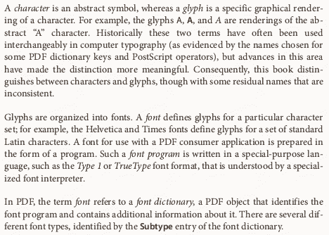
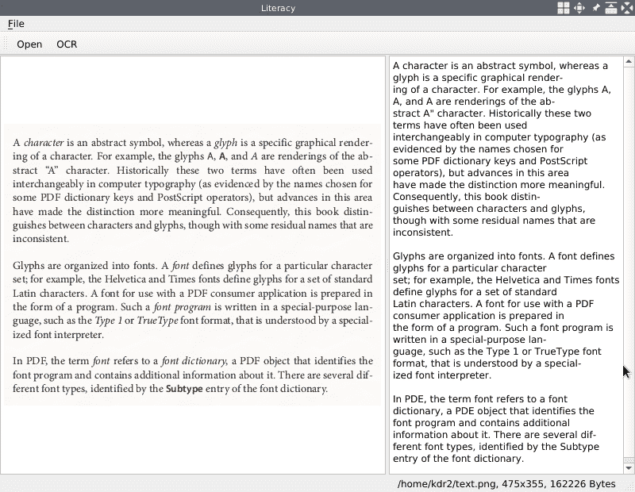
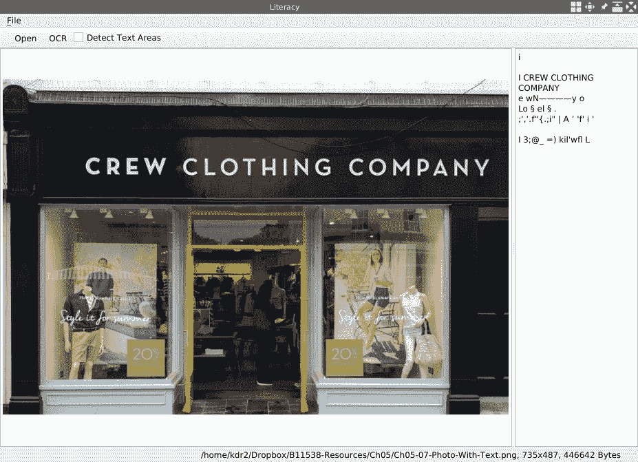
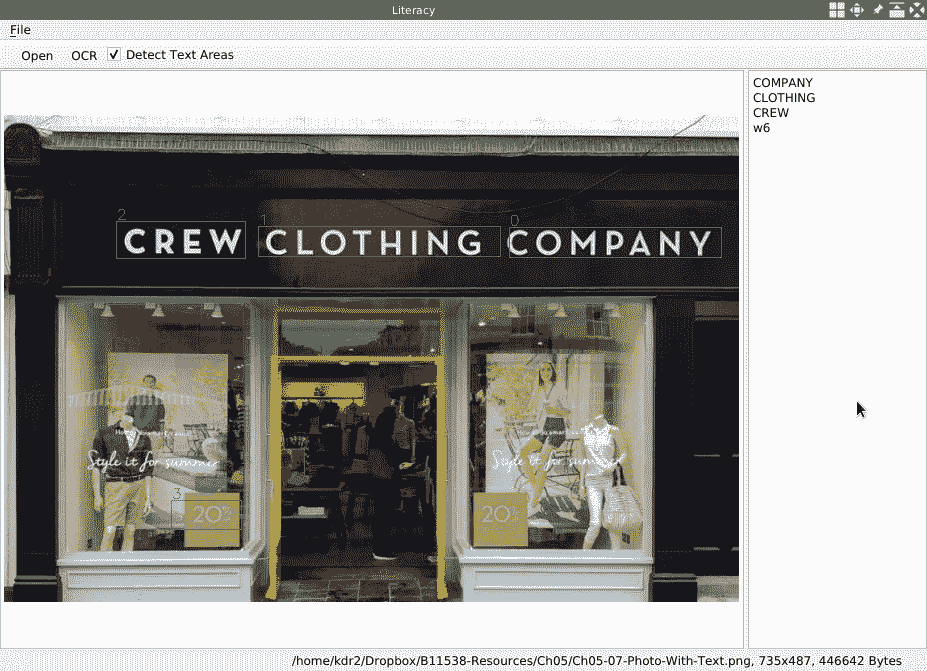

# 光学字符识别

在前面的章节中，我们对视频和摄像机做了很多工作。 我们创建了应用程序（**Gazer** 和 **Facetious**），通过它们可以播放连接到计算机的网络摄像头中的视频。 我们还可以使用这些应用程序实时记录视频，拍照，检测动作和面部，以及将遮罩应用于在视频供稿中检测到的面部。

现在，我们将重点转移到图像中的文本上。 在许多情况下，我们要从图像中提取文本或字符。 在计算机视觉领域，有一种称为**光学字符识别**（**OCR**）的技术可以自动执行这种工作，而不是手动转录文本。 在本章中，我们将构建一个新的应用程序，以使用 Qt 和许多 OCR 库从图像和扫描的文档中提取文本。

我们将在本章介绍以下主题：

*   从图像中提取文本
*   检测图像中的文本区域
*   访问屏幕内容
*   在窗口小部件上绘制并裁剪屏幕的某些部分

# 技术要求

从前面的章节中可以看到，要求用户至少安装 Qt 版本 5 并具有 C++ 和 Qt 编程的一些基本知识。 另外，应该正确安装最新版本的 Tesseract 4.0 版，因为在本章中我们将使用此库作为 OCR 工具。 对于 Windows，可以在[这个页面](https://github.com/UB-Mannheim/tesseract/wiki)中找到预构建的 Tesseract 二进制软件包。 对于类似 UNIX 的系统，我们将在使用它之前逐步从源代码构建 Tesseract。

深度学习的一些知识也将对理解本章的内容有很大帮助。

[本章的所有代码都可以在我们的代码库中找到](https://github.com/PacktPublishing/Qt-5-and-OpenCV-4-Computer-Vision-Projects/tree/master/Chapter-05)。

[观看以下视频，查看运行中的代码](http://bit.ly/2FhuTvq)

# 创造素养

如前所述，我们将创建一个新的应用程序以从图像或扫描的文档中提取文本，因此其名称为 Literacy。 首先是要弄清楚应用程序打算做什么。 主要功能是从图像中提取文本，但是，为了方便用户，我们应该提供多种指定图像的方法：

*   该图像可能来自本地硬盘。
*   可以从屏幕上捕获图像。

在明确了此要求之后，现在让我们设计 UI。

# 设计 UI

绘制以下线框，作为我们应用程序的 UI 设计：


如您所见，我们将主区域垂直分为两部分-左侧部分用于显示打开的或捕获的图像，而右侧部分用于提取的文本。 窗口的其他部分，例如菜单栏，工具栏和状态栏，都是我们非常熟悉的方面。

[您可以从 GitHub 上的代码存储库中找到此设计的源文件](https://github.com/PacktPublishing/Qt-5-and-OpenCV-4-Computer-Vision-Projects)。 该文件位于存储库的根目录中，名为`WireFrames.epgz`，而本章的线框位于第三页上。 不要忘记应该使用 Pencil 应用程序将其打开。

# 设置 UI

在上一节中，我们设计了新应用程序 Literacy 的 UI。 现在，让我们为其创建 Qt 项目，并在 Qt 主窗口中设置其完整的 UI。

首先，让我们在终端中创建项目：

```cpp
 $ mkdir Literacy/
 $ cd Literacy/
 $ touch main.cpp
 $ ls
 main.cpp
 $ qmake -project
 $ ls
 Literacy.pro main.cpp
 $
```

然后，我们打开项目文件`Literacy.pro`，并用以下内容填充它：

```cpp
     TEMPLATE = app
     TARGET = Literacy

     QT += core gui
     greaterThan(QT_MAJOR_VERSION, 4): QT += widgets

     INCLUDEPATH += .

     # Input
     HEADERS += mainwindow.h
     SOURCES += main.cpp mainwindow.cpp
```

这很简单，因为我们已经做了很多次了。 但是，仍然值得注意的是，我们在此项目文件中指定了一个头文件和两个源文件，而此时，我们只有一个空的源文件`main.cpp`。 不用担心 在编译项目之前，我们将完成提到的所有这些源文件。

`main.cpp`文件也非常简单：

```cpp
     #include <QApplication>
     #include "mainwindow.h"

     int main(int argc, char *argv[])
     {
         QApplication app(argc, argv);
         MainWindow window;
         window.setWindowTitle("Literacy");
         window.show();
         return app.exec();
     }
```

与我们在其他项目中所做的相似，我们创建`QApplication`的实例和`MainWindow`的实例，然后调用窗口的`show`方法和应用程序的`exec`方法来启动应用程序。 但是，`MainWindow`类尚不存在，所以让我们现在创建它。

在项目的根目录中，我们创建一个名为`mainwindow.h`的新文件来容纳`MainWindow`类。 忽略`ifndef/define`惯用语和`include`伪指令，该类如下所示：

```cpp
     class MainWindow : public QMainWindow
     {
         Q_OBJECT

     public:
         explicit MainWindow(QWidget *parent=nullptr);
         ~MainWindow();

     private:
         void initUI();
         void createActions();
         void setupShortcuts();

     private:
         QMenu *fileMenu;

         QToolBar *fileToolBar;

         QGraphicsScene *imageScene;
         QGraphicsView *imageView;

         QTextEdit *editor;

         QStatusBar *mainStatusBar;
         QLabel *mainStatusLabel;

         QAction *openAction;
         QAction *saveImageAsAction;
         QAction *saveTextAsAction;
         QAction *exitAction;
     };
```

显然，它是`QMainWindow`的子类，因此，它的主体开头具有`Q_OBJECT`宏。 最重要的方面是我们在专用部分声明的小部件，包括文件菜单`fileMenu`； 工具栏`fileToolBar`； `QGraphicsScene`和`QGraphicsView`显示目标图像； `QTextEditor`在其上放置识别的文本，状态栏和标签； 最后是四个`QAction`指针。

除了这些小部件声明之外，我们还提供了三种私有方法来实例化这些小部件并将它们安排在我们设计的主窗口中：

*   `initUI`：实例化除动作以外的所有小部件。
*   `createActions`：创建所有动作； 这由`initUI`方法调用。
*   `setupShortcuts`：设置一些热键，使我们的应用程序更易于使用。 这由`createActions`方法调用。

现在是时候实现这些方法了。 我们在项目的根目录中创建一个名为`mainwindow.cpp`的新源文件，以适应这些实现。 首先，让我们看一下`initUI`方法：

```cpp
     void MainWindow::initUI()
     {
         this->resize(800, 600);
         // setup menubar
         fileMenu = menuBar()->addMenu("&File");

         // setup toolbar
         fileToolBar = addToolBar("File");

         // main area
         QSplitter *splitter = new QSplitter(Qt::Horizontal, this);

         imageScene = new QGraphicsScene(this);
         imageView = new QGraphicsView(imageScene);
         splitter->addWidget(imageView);

         editor = new QTextEdit(this);
         splitter->addWidget(editor);

         QList<int> sizes = {400, 400};
         splitter->setSizes(sizes);

         setCentralWidget(splitter);

         // setup status bar
         mainStatusBar = statusBar();
         mainStatusLabel = new QLabel(mainStatusBar);
         mainStatusBar->addPermanentWidget(mainStatusLabel);
         mainStatusLabel->setText("Application Information will be here!");

         createActions();
     }
```

在这种方法中，我们首先设置窗口大小，创建文件菜单，然后将其添加到菜单栏，创建文件工具栏，最后，我们创建状态栏，然后在其上放置标签。 所有这些工作与我们在先前项目中所做的相同。 与先前项目不同的重要部分是主区域的创建，该主区域是方法主体的中间部分。 在本部分中，我们将创建一个水平方向的`QSplitter`对象，而不是一个`QGridLayout`实例来容纳图形视图和编辑器。

使用`QSplitter`使我们能够通过拖动其分隔条自由地更改其子窗口小部件的宽度，这是`QGridLayout`无法实现的。 此后，我们创建图形场景以及图形视图，然后编辑器将它们有序地添加到拆分器中。 通过使用列表`int`调用`setSizes`方法来设置拆分器的子级的宽度； 我们让每个孩子占据 400 像素的相等宽度。 最后，我们将分割器设置为主窗口的中央小部件。

以下代码与`createActions`方法有关：

```cpp
     void MainWindow::createActions()
     {
         // create actions, add them to menus
         openAction = new QAction("&Open", this);
         fileMenu->addAction(openAction);
         saveImageAsAction = new QAction("Save &Image as", this);
         fileMenu->addAction(saveImageAsAction);
         saveTextAsAction = new QAction("Save &Text as", this);
         fileMenu->addAction(saveTextAsAction);
         exitAction = new QAction("E&xit", this);
         fileMenu->addAction(exitAction);

         // add actions to toolbars
         fileToolBar->addAction(openAction);

         setupShortcuts();
     }
```

在这里，我们创建所有声明的动作，并将它们添加到文件菜单和工具栏。 在此方法的结尾，我们调用`setupShortcuts`。 现在，让我们看看我们在其中设置了哪些快捷方式：

```cpp
     void MainWindow::setupShortcuts()
     {
         QList<QKeySequence> shortcuts;
         shortcuts << (Qt::CTRL + Qt::Key_O);
         openAction->setShortcuts(shortcuts);

         shortcuts.clear();
         shortcuts << (Qt::CTRL + Qt::Key_Q);
         exitAction->setShortcuts(shortcuts);
     }
```

如您所见，我们使用`Ctrl-O`触发`openAction`，并使用`Ctrl-Q`触发`exitAction`。

最后，有构造函数和析构函数：

```cpp
     MainWindow::MainWindow(QWidget *parent) :
         QMainWindow(parent)
     {
         initUI();
     }

     MainWindow::~MainWindow()
     {
     }
```

这些都非常简单，因此我们在这里不再赘述。 现在，我们可以编译并运行 Literacy 应用程序：

```cpp
 $ qmake -makefile
 $ make
 g++ -c -pipe -O2 -Wall -W # ...
 # output trucated
 $ ./Literacy
```

运行应用程序后，桌面上将出现一个如下所示的窗口：


因此，我们设置了没有任何交互功能的完整 UI。 接下来，我们将向我们的应用程序添加许多交互式功能，包括以下内容：

*   从本地磁盘打开映像
*   将当前图像作为文件保存到本地磁盘上
*   将编辑器小部件中的文本另存为文本文件到本地磁盘上

为了实现这些目标，我们应该在`mainwindow.h`头文件中的`MainWindow`类中添加一些方法，插槽和成员字段：

```cpp
     private:
         // ...
         void showImage(QString);
         // ...
     private slots:
         void openImage();
         void saveImageAs();
         void saveTextAs();

     private:
         // ...
         QString currentImagePath;
         QGraphicsPixmapItem *currentImage;
```

`showImage`方法和`openImage`插槽的实现与我们在 ImageViewer 应用程序中编写的`MainWindow::showImage`和`MainWindow::openImage`方法的实现相同（请参阅第 1 章， *图像查看器*）。 同样，`saveImageAs`插槽与该 ImageViewer 应用程序中的`MainWindow::saveAs`方法具有完全相同的实现。 由于我们应该在新应用程序中保存图像和文本，因此我们在此处仅使用一个不同的名称，并且此方法仅用于保存图像。 因此，我们只需将这些实现复制到我们的新项目中。 为了使本章保持简短，我们在这里不再赘述。

我们尚未介绍的唯一方法是`saveTextAs`插槽。 现在，让我们看一下它的实现：

```cpp
     void MainWindow::saveTextAs()
     {
         QFileDialog dialog(this);
         dialog.setWindowTitle("Save Text As ...");
         dialog.setFileMode(QFileDialog::AnyFile);
         dialog.setAcceptMode(QFileDialog::AcceptSave);
         dialog.setNameFilter(tr("Text files (*.txt)"));
         QStringList fileNames;
         if (dialog.exec()) {
             fileNames = dialog.selectedFiles();
             if(QRegExp(".+\\.(txt)").exactMatch(fileNames.at(0))) {
                 QFile file(fileNames.at(0));
                 if (!file.open(QIODevice::WriteOnly | QIODevice::Text)) {
                     QMessageBox::information(this, "Error", "Can't save text.");
                     return;
                 }
                 QTextStream out(&file);
                 out << editor->toPlainText() << "\n";
             } else {
                 QMessageBox::information(this, "Error", "Save error: bad format or filename.");
             }
         }
     }
```

它与`saveImageAs`方法非常相似。 区别如下：

*   在文件对话框中，我们使用扩展名`txt`设置名称过滤器，以确保只能选择文本文件。
*   保存文本时，我们使用所选文件名创建一个`QFile`实例，然后使用可以写入的`QFile`实例创建一个`QTextStream`实例。 最后，我们通过调用文本编辑器的`toPlainText()`方法获取文本编辑器的内容，并将其写入刚刚创建的流中。

现在，所有方法和插槽都已完成，因此让我们在`createActions`方法中连接信号和这些插槽：

```cpp
         // connect the signals and slots
         connect(exitAction, SIGNAL(triggered(bool)), QApplication::instance(), SLOT(quit()));
         connect(openAction, SIGNAL(triggered(bool)), this, SLOT(openImage()));
         connect(saveImageAsAction, SIGNAL(triggered(bool)), this, SLOT(saveImageAs()));
         connect(saveTextAsAction, SIGNAL(triggered(bool)), this, SLOT(saveTextAs()));
```

最后，我们在构造函数中将`currentImage`成员字段初始化为`nullptr`：

```cpp
     MainWindow::MainWindow(QWidget *parent) :
         QMainWindow(parent), currentImage(nullptr)
     {
         initUI();
     }
```

现在，我们再次编译并运行我们的应用程序，以测试这些新添加的交互式功能。 单击操作，打开图像，在编辑器中键入一些单词，拖动分隔条以调整列的宽度，然后将图像或文本另存为文件。 我们正在与之交互的主窗口如下所示：


正如您在图中所看到的，我们打开一个包含许多字符的图像，并在右侧的编辑器中键入一些文本。 在下一部分中，我们将从图像中提取文本，然后通过单击工具栏上的按钮自动将提取的文本填充到编辑器中。

[在此提交中可以找到本节中所有代码的更改](https://github.com/PacktPublishing/Qt-5-and-OpenCV-4-Computer-Vision-Projects/commit/bc1548b97cf79ddae5184f8009badb278c2750b2)。

# OCR 与 Tesseract

在本节中，我们将使用 Tesseract 从图像中提取文本。 如前所述，要在 Windows 上安装 Tesseract，我们可以使用预构建的二进制软件包。 在类似 UNIX 的系统上，我们可以使用系统软件包管理器进行安装，例如，在 Debian 上安装`apt-get`，在 macOS 上安装`brew`。 以 Debian 为例-我们可以安装`libtesseract-dev`和`tesseract-ocr-all`软件包来安装所需的所有库和数据文件。 无论如何安装，请确保已安装正确的版本 4.0.0。

尽管有预构建的软件包，但出于教学目的，我们将从 Linux 系统上的源代码构建它，以查看其中包含哪些组件以及如何使用其命令行工具。

# 从源头建造 Tesseract

我们将从源代码构建版本 4.0.0，因此，首先，在[发行页面](https://github.com/tesseract-ocr/tesseract/releases)上，选择 **4.0.0 Release** 下的 zip 文件，进行下载。 下载`.zip`文件后，我们将其解压缩并输入构建目录：

```cpp
$ curl -L https://github.com/tesseract-ocr/tesseract/archive/4.0.0.zip -o tesseract-4.0.0.zip
 % Total % Received % Xferd Average Speed Time Time Time Current
 Dload Upload Total Spent Left Speed
100 127 0 127 0 0 159 0 --:--:-- --:--:-- --:--:-- 159
100 2487k 0 2487k 0 0 407k 0 --:--:-- 0:00:06 --:--:-- 571k
$ unzip tesseract-4.0.0.zip
# output omitted
$ cd tesseract-4.0.0/
$ ./configure --prefix=/home/kdr2/programs/tesseract
# output omitted
$ make && make install
# output omitted
```

Tesseract 使用`autotools`来构建其构建系统，因此其构建过程非常容易。 我们首先运行`configure`脚本，然后运行`make && make install`。 我们提供一个参数`--prefix=/home/kdr2/programs/tesseract`，以在运行`configure`脚本时指定安装前缀，因此，如果一切按计划进行，则 Tesseract 库，包括头文件，静态库，动态库以及许多其他 文件，将安装在该指定目录下。

Tesseract 4 中引入了一种基于**长短期记忆**（**LSTM**）神经网络的新型 OCR 引擎，该引擎专注于行识别。 还保留了通过识别字符样式起作用的 Tesseract 3。 因此，我们可以选择在 Tesseract 4 中自由使用哪个引擎。要使用新的 OCR 引擎，我们必须在该引擎中下载 LSTM AI 模型的预训练数据。 [可以在 GitHub 存储库中](https://github.com/tesseract-ocr/tessdata)中找到这些经过预训练的数据。 我们下载该存储库的内容并将其放置在我们的 Tesseract 安装目录下：

```cpp
$ curl -O -L https://github.com/tesseract-ocr/tessdata/archive/master.zip
# output omitted
$ unzip master.zip
Archive: master.zip
590567f20dc044f6948a8e2c61afc714c360ad0e
 creating: tessdata-master/
 inflating: tessdata-master/COPYING
 inflating: tessdata-master/README.md
 inflating: tessdata-master/afr.traineddata
 ...
$ mv tessdata-master/* /home/kdr2/programs/tesseract/share/tessdata/
$ ls /home/kdr2/programs/tesseract/share/tessdata/ -l |head
total 1041388
-rw-r--r-- 1 kdr2 kdr2 7851157 May 10 2018 afr.traineddata
-rw-r--r-- 1 kdr2 kdr2 8423467 May 10 2018 amh.traineddata
-rw-r--r-- 1 kdr2 kdr2 2494806 May 10 2018 ara.traineddata
-rw-r--r-- 1 kdr2 kdr2 2045457 May 10 2018 asm.traineddata
-rw-r--r-- 1 kdr2 kdr2 4726411 May 10 2018 aze_cyrl.traineddata
-rw-r--r-- 1 kdr2 kdr2 10139884 May 10 2018 aze.traineddata
-rw-r--r-- 1 kdr2 kdr2 11185811 May 10 2018 bel.traineddata
-rw-r--r-- 1 kdr2 kdr2 1789439 May 10 2018 ben.traineddata
-rw-r--r-- 1 kdr2 kdr2 1966470 May 10 2018 bod.traineddata
```

如您所见，在此步骤中，我们得到许多扩展名为`traineddata`的文件。 这些文件是针对不同语言的预训练数据文件； 语言名称用作基本文件名。 例如，`eng.traineddata`用于识别英文字符。

实际上，您不必将此受过训练的数据放在 Tesseract 安装数据目录下。 您可以将这些文件放在任意位置，然后将环境变量`TESSDATA_PREFIX`设置到该目录。 Tesseract 将通过遵循此环境变量来找到它们。

Tesseract 提供了一个命令行工具来从图像中提取文本。 让我们使用此工具来检查 Tesseract 库是否正确安装：

```cpp
$ ~/programs/tesseract/bin/tesseract -v
tesseract 4.0.0
 leptonica-1.76.0
 libgif 5.1.4 : libjpeg 6b (libjpeg-turbo 1.5.2) : libpng 1.6.36 : libtiff 4.0.9 : zlib 1.2.11 : libwebp 0.6.1 : libopenjp2 2.3.0
 Found AVX
 Found SSE
```

`-v`选项告诉`tesseract`工具除了打印版本信息外什么也不做。 我们可以看到已经安装了 Tesseract 4.0.0。 此消息中的单词`leptonica`是另一个图像处理库，被 Tesseract 用作默认图像处理库。 在我们的项目中，我们已经有了 Qt 和 OpenCV 来处理图像，因此我们可以忽略这些信息。

现在，让我们尝试使用此命令行工具从图像中提取文本。 下图准备作为输入：



这是图表上命令行工具性能的结果：


如您所见，在这种情况下，我们为命令行工具提供了许多参数：

*   第一个是输入图像。
*   第二个是输出。 我们使用`stdout`告诉命令行工具将结果写入终端的标准输出。 我们可以在此处指定基本文件名； 例如，使用`text-out`将告诉工具将结果写入文本文件`text-out.txt`。
*   其余参数是选项。 我们使用`-l eng`告诉我们要提取的文本是英语。

您可以看到 Tesseract 在我们的图中很好地识别了文本。

除了`-l`选项之外，Tesseract 命令行工具还有两个更重要的选项：`--oem`和`--psm`。

我们可以从其名称中猜测`--oem`选项，用于选择 OCR 引擎模式。 通过运行以下命令，我们可以列出 Tesseract 支持的所有 OCR 引擎模式：

```cpp
$ ~/programs/tesseract/bin/tesseract --help-oem
OCR Engine modes:
 0 Legacy engine only.
 1 Neural nets LSTM engine only.
 2 Legacy + LSTM engines.
 3 Default, based on what is available.
```

在 Tesseract 4.0 中默认使用 LSTM 模式，并且在大多数情况下，它的性能都很好。 您可以通过在我们运行的命令末尾附加`--oem 0`来尝试使用旧版引擎以提取文本，您会发现旧版引擎在我们的图表上表现不佳。

`--psm`选项用于指定页面分割模式。 如果运行`tesseract --help-psm`，我们会发现 Tesseract 中有许多页面分割模式：

```cpp
$ ~/programs/tesseract/bin/tesseract --help-psm
Page segmentation modes:
 0 Orientation and script detection (OSD) only.
 1 Automatic page segmentation with OSD.
 2 Automatic page segmentation, but no OSD, or OCR.
 3 Fully automatic page segmentation, but no OSD. (Default)
 4 Assume a single column of text of variable sizes.
 5 Assume a single uniform block of vertically aligned text.
 6 Assume a single uniform block of text.
 7 Treat the image as a single text line.
 8 Treat the image as a single word.
 9 Treat the image as a single word in a circle.
 10 Treat the image as a single character.
 11 Sparse text. Find as much text as possible in no particular order.
 12 Sparse text with OSD.
 13 Raw line. Treat the image as a single text line,
 bypassing hacks that are Tesseract-specific.
```

如果要处理具有复杂排版的扫描文档，也许应该为其选择页面分割模式。 但是由于我们现在正在处理一个简单的图像，因此我们将忽略此选项。

到目前为止，我们已经成功安装了 Tesseract 库，并学习了如何使用其命令行工具从图像中提取文本。 在下一个小节中，我们将将此库集成到我们的应用程序 Literacy 中，以促进文本识别功能。

# 识字识字

我们的 Tesseract 库已经准备就绪，因此让我们使用它来识别 Literacy 应用程序中的字符。

我们应该做的第一件事是更新项目文件以合并与 Tesseract 库有关的信息：

```cpp
# use your own path in the following config
unix: {
    INCLUDEPATH += /home/kdr2/programs/tesseract/include
    LIBS += -L/home/kdr2/programs/tesseract/lib -ltesseract
}

win32 {
    INCLUDEPATH += c:/path/to/tesseract/include
    LIBS += -lc:/path/to/opencv/lib/tesseract
}

DEFINES += TESSDATA_PREFIX=\\\"/home/kdr2/programs/tesseract/share/tessdata/\\\"
```

在前面的变更集中，我们为不同平台添加了 Tesseract 库的 include 路径和库路径，然后定义了一个宏`TESSDATA_PREFIX`，其值是 Tesseract 库的数据路径的路径。 稍后，我们将使用此宏将预训练的数据加载到我们的代码中。

然后，我们打开`mainwindow.h`头文件以添加一些新行：

```cpp
     #include "tesseract/baseapi.h"

     class MainWindow : public QMainWindow
     {
         // ...
     private slots:
         // ...
         void extractText();

     private:
         // ...
         QAction *ocrAction;
         // ...
         tesseract::TessBaseAPI *tesseractAPI;
     };
```

在此变更集中，我们首先添加`include`指令以包含 Tesseract 库的基本 API 头文件，然后向`MainWindow`类添加一个插槽和两个成员。

`QAction *ocrAction`成员将出现在主窗口的工具栏上。 触发此操作后，将调用新添加的插槽`extractText`，该插槽将使用`tesseract::TessBaseAPI *tesseractAPI`成员来识别已打开的图像中的字符。

现在，让我们看看这些事情在源文件`mainwindow.cpp`中如何发生。

在`MainWindow`类的构造函数中，将成员字段`tesseractAPI`初始化为`nullptr`：

```cpp
     MainWindow::MainWindow(QWidget *parent) :
         QMainWindow(parent)
         , currentImage(nullptr)
         , tesseractAPI(nullptr)
     {
         initUI();
     }
```

在`createActions`方法中，我们创建`ocrAction`操作，将其添加到工具栏，然后将其`triggered`信号连接到新添加的`extractText`插槽：

```cpp
     void MainWindow::createActions()
     {
         // ...
         ocrAction = new QAction("OCR", this);
         fileToolBar->addAction(ocrAction);

         // ...
         connect(ocrAction, SIGNAL(triggered(bool)), this, SLOT(extractText()));
         // ...
     }
```

现在，剩下的就是最复杂，最重要的部分。 `extractText`插槽的实现：

```cpp
     void MainWindow::extractText()
     {
         if (currentImage == nullptr) {
             QMessageBox::information(this, "Information", "No opened image.");
             return;
         }

         char *old_ctype = strdup(setlocale(LC_ALL, NULL));
         setlocale(LC_ALL, "C");
         tesseractAPI = new tesseract::TessBaseAPI();
         // Initialize tesseract-ocr with English, with specifying tessdata path
         if (tesseractAPI->Init(TESSDATA_PREFIX, "eng")) {
             QMessageBox::information(this, "Error", "Could not initialize tesseract.");
             return;
         }

         QPixmap pixmap = currentImage->pixmap();
         QImage image = pixmap.toImage();
         image = image.convertToFormat(QImage::Format_RGB888);

         tesseractAPI->SetImage(image.bits(), image.width(), image.height(),
             3, image.bytesPerLine());
         char *outText = tesseractAPI->GetUTF8Text();
         editor->setPlainText(outText);
         // Destroy used object and release memory
         tesseractAPI->End();
         delete tesseractAPI;
         tesseractAPI = nullptr;
         delete [] outText;
         setlocale(LC_ALL, old_ctype);
         free(old_ctype);
     }
```

在方法主体的开头，我们检查`currentImage`成员字段是否为空。 如果为 null，则在我们的应用程序中没有打开任何图像，因此我们在显示消息框后立即返回。

如果它不为 null，那么我们将创建 Tesseract API 实例。 Tesseract 要求我们必须将语言环境设置为`C`，因此，首先，我们使用`LC_ALL`类别和空值调用`setlocale`函数，以获取并保存当前的语言环境设置，然后再次使用 使用相同的类别和值`C`来设置 Tesseract 所需的语言环境。 OCR 工作完成后，我们将使用保存的`LC_ALL`值恢复语言环境设置。

在将区域设置设置为`C`之后，现在，我们可以创建 Tesseract API 实例。 我们使用表达式`new tesseract::TessBaseAPI()`创建它。 新创建的 API 实例必须在使用前进行初始化。 通过调用`Init`方法执行初始化。 `Init`方法有很多版本（重载）：

```cpp
// 1
int Init(const char* datapath, const char* language, OcrEngineMode mode,
         char **configs, int configs_size,
         const GenericVector<STRING> *vars_vec,
         const GenericVector<STRING> *vars_values,
         bool set_only_non_debug_params);
// 2
int Init(const char* datapath, const char* language, OcrEngineMode oem) {
  return Init(datapath, language, oem, nullptr, 0, nullptr, nullptr, false);
}
// 3
int Init(const char* datapath, const char* language) {
  return Init(datapath, language, OEM_DEFAULT, nullptr, 0, nullptr, nullptr, false);
}
// 4
int Init(const char* data, int data_size, const char* language,
         OcrEngineMode mode, char** configs, int configs_size,
         const GenericVector<STRING>* vars_vec,
         const GenericVector<STRING>* vars_values,
         bool set_only_non_debug_params, FileReader reader);
```

在其中一些版本中，我们可以指定预训练的数据路径，语言名称，OCR 引擎模式，页面分段模式以及许多其他配置。 为了简化代码，我们使用此方法的最简单版本（第三个版本）来初始化 API 实例。 在此调用中，我们仅传递数据路径和语言名称。 值得注意的是，数据路径由我们在项目文件中定义的宏表示。 初始化过程可能会失败，因此如果初始化失败，我们会在显示简短消息后检查其结果并立即返回。

准备好 Tesseract API 实例后，我们将获得当前打开的图像，并将其转换为`QImage::Format_RGB888`格式的图像，就像在先前项目中所做的那样。

获得具有`RGB888`格式的图像后，可以通过调用其`SetImage`方法将其提供给 Tesseract API 实例。 `SetImage`方法还具有许多不同的重载版本：

```cpp
// 1
void SetImage(const unsigned char* imagedata, int width, int height,
              int bytes_per_pixel, int bytes_per_line);
// 2
void SetImage(Pix* pix);
```

可以使用给定图像的数据格式信息调用第一个。 它不限于任何库定义的类，例如 Qt 中的`QImage`或 OpenCV 中的`Mat`。 第二个版本接受`Pix`指针作为输入图像。 `Pix`类由图像处理库 Leptonica 定义。 显然，这是最适合这种情况的第一个版本。 它需要的所有信息都可以从`QImage`实例中检索到，该实例具有 3 个通道，深度为 8 位。 因此，它为每个像素使用`3`字节：

```cpp
         tesseractAPI->SetImage(image.bits(), image.width(), image.height(),
             3, image.bytesPerLine());
```

Tesseract API 实例获取图像后，我们可以调用其`GetUTF8Text()`方法来获取其从图像中识别的文本。 在这里值得注意的是，调用者有责任释放此方法的结果数据缓冲区。

剩下的任务是将提取的文本设置到编辑器小部件，销毁 Tesseract API 实例，删除`GetUTF8Text`调用的结果数据缓冲区，并恢复语言环境设置。

好。 让我们编译并重新启动我们的应用程序。 应用程序启动后，我们打开其中包含文本的图像，然后单击工具栏上的 OCR 操作。 然后，应用程序将使用从左侧图像中提取的文本填充编辑器：



如果对结果满意，可以通过单击文件菜单下的“将文本另存为”项将文本另存为文件。

到目前为止，我们的应用程序已经能够从作为书本或扫描文档的照片的图像中识别和提取文本。 对于这些图像，它们中仅包含具有良好排版的文本。 如果我们给应用程序提供包含许多不同元素的照片，而文字仅占据其中的一小部分，例如店面的照片或道路上的交通标志，则很可能无法 识别字符。 我们可以用以下照片进行测试：


就像我们猜到的那样，我们的应用程序无法提取其中的文本。 为了处理这类图像，我们不应该只是将整个图像传递给 Tesseract。 我们还必须告诉 Tesseract，图像的哪个区域包含文本。 因此，在从此类图像中提取文本之前，我们必须首先检测该图像中的文本区域。 我们将在下一部分中使用 OpenCV 进行此操作。

# 使用 OpenCV 检测文本区域

在上一节中，我们成功地从带有排版好的文本的图像中提取了文本； 例如，扫描的文档。 但是，对于常见场景照片中的文字，我们的应用程序无法正常运行。 在本节中，我们将解决此应用程序问题。

在本节中，我们将使用带有 OpenCV 的 EAST 文本检测器来检测图像中是否存在文本。 **EAST** 是**有效且准确的场景文本**检测器的缩写，其描述可以在[这个页面](https://arxiv.org/abs/1704.03155)上找到。 它是基于神经网络的算法，但是其神经网络模型的体系结构和训练过程不在本章范围之内。 在本节中，我们将重点介绍如何使用 OpenCV 的 EAST 文本检测器的预训练模型。

在开始编写代码之前，让我们先准备好预训练的模型。 可以从[这里](http://depot.kdr2.com/books/Qt-5-and-OpenCV-4-Computer-Vision-Projects/trained-model/frozen_east_text_detection.pb)下载 EAST 模型的预训练模型文件。。 让我们下载它并将其放置在我们项目的根目录中：

```cpp
$ curl -O http://depot.kdr2.com/books/Qt-5-and-OpenCV-4-Computer-Vision-Projects/trained-model/frozen_east_text_detection.pb
# output omitted
$ ls -l
total 95176
-rw-r--r-- 1 kdr2 kdr2 96662756 Mar 22 17:03 frozen_east_text_detection.pb
-rwxr-xr-x 1 kdr2 kdr2 131776 Mar 22 17:30 Literacy
-rw-r--r-- 1 kdr2 kdr2 988 Mar 23 21:13 Literacy.pro
-rw-r--r-- 1 kdr2 kdr2 224 Mar 7 15:32 main.cpp
-rw-r--r-- 1 kdr2 kdr2 11062 Mar 23 21:13 mainwindow.cpp
-rw-r--r-- 1 kdr2 kdr2 1538 Mar 23 21:13 mainwindow.h
# output truncated
```

这很简单。 神经网络模式的准备工作已经完成。 现在，让我们继续进行代码。

需要更新的第一个文件是项目文件`Literacy.pro`。 就像前面的章节中一样，我们需要合并 OpenCV 库的设置：

```cpp
# opencv config
unix: !mac {
    INCLUDEPATH += /home/kdr2/programs/opencv/include/opencv4
    LIBS += -L/home/kdr2/programs/opencv/lib -lopencv_core -lopencv_imgproc -lopencv_dnn
}

unix: mac {
    INCLUDEPATH += /path/to/opencv/include/opencv4
    LIBS += -L/path/to/opencv/lib -lopencv_world
}

win32 {
    INCLUDEPATH += c:/path/to/opencv/include/opencv4
    LIBS += -lc:/path/to/opencv/lib/opencv_world
}
```

值得注意的是，我们将`opencv_dnn`模块添加到`LIBS`设置中。 因此，该模块中实际上是一个深度神经网络的 EAST 算法的实现。

我们要更新的下一个文件是头文件`mainwindow.h`。 我们在其中包含两个 OpenCV 头文件，然后在此文件的`MainWindow`类中添加一些字段和方法：

```cpp
    // ...
    #include <QCheckBox>
    // ...
    #include "opencv2/opencv.hpp"
    #include "opencv2/dnn.hpp"

    class MainWindow : public QMainWindow
    {
        // ...
    private:
        // ...
        void showImage(cv::Mat);
        // ...
        void decode(const cv::Mat& scores, const cv::Mat& geometry, float scoreThresh,
            std::vector<cv::RotatedRect>& detections, std::vector<float>& confidences);
        cv::Mat detectTextAreas(QImage &image, std::vector<cv::Rect>&);

        // ...
    private:
        // ...
        QCheckBox *detectAreaCheckBox;
        // ...
        cv::dnn::Net net;
    };
```

让我们首先检查新添加的私有字段。 成员字段`cv::dnn::Net net`是一个深层神经网络实例，将用于检测文本区域。 `detectAreaCheckBox`字段是一个出现在工具栏上的复选框，允许用户向我们提供一个指示器，以确定在执行 Tesseract 的 OCR 工作之前是否应该检测文本区域。

`detectTextAreas`方法用于通过 OpenCV 检测区域，而`decode`方法构成辅助方法。 在检测到图像上的文本区域后，我们将为该图像上的每个文本区域绘制一个矩形。 所有这些步骤都是使用 OpenCV 完成的。 因此，该图像将表示为`cv::Mat`的实例，因此我们重载了`showImage`方法的另一个版本，该方法将`cv::Mat`的实例作为其唯一参数，以在 UI 上显示更新的图像。

现在，让我们转到`mainwindow.cpp`源文件以查看更改。

首先，让我们看看最重要的方法`MainWindow::detectTextAreas`。 按照预期，此方法将`QImage`对象作为输入图像作为其第一个参数。 它的第二个参数是对`cv::Rect`向量的引用，该向量用于保存检测到的文本区域。 该方法的返回值为`cv::Mat`，它表示在其上绘制了检测到的矩形的输入图像。 让我们在以下代码片段中查看其实现：

```cpp
    cv::Mat MainWindow::detectTextAreas(QImage &image, std::vector<cv::Rect> &areas)
    {
        float confThreshold = 0.5;
        float nmsThreshold = 0.4;
        int inputWidth = 320;
        int inputHeight = 320;
        std::string model = "./frozen_east_text_detection.pb";
        // Load DNN network.
        if (net.empty()) {
            net = cv::dnn::readNet(model);
        }

        // more ...
    }
```

代码是方法主体的第一部分。 在这一部分中，我们定义许多变量并创建一个深度神经网络。 前两个阈值用于置信度和非最大抑制。 我们将使用它们来过滤 AI 模型的检测结果。 EAST 模型要求图像的宽度和高度必须是 32 的倍数，因此我们定义了两个`int`变量，其值均为`320`。 在将输入图像发送到 DNN 模型之前，我们将其调整为这两个变量描述的尺寸，在这种情况下为 320 x 320。

然后，使用已下载的预训练模型数据文件的路径定义一个字符串，并在类成员`net`为空的情况下调用`cv::dnn::readNet`函数来加载它。 OpenCV 的 DNN 支持多种预训练的模型数据文件：

*   `*.caffemodel`（[Caffe](http://caffe.berkeleyvision.org/)）
*   `*.pb`（[TensorFlow](https://www.tensorflow.org/)）
*   `*.t7`或`*.net`（[Torch](http://torch.ch/)）
*   `*.weights`（[Darknet](https://pjreddie.com/darknet/)）
*   `*.bin`（[DLDT](https://software.intel.com/openvino-toolkit)）

从前面的列表中，您可以确定我们使用的预训练模型是使用 TensorFlow 框架构建和训练的。

因此，将加载 DNN 模型。 现在，让我们将输入图像发送到模型以执行文本检测：

```cpp
        std::vector<cv::Mat> outs;
        std::vector<std::string> layerNames(2);
        layerNames[0] = "feature_fusion/Conv_7/Sigmoid";
        layerNames[1] = "feature_fusion/concat_3";

        cv::Mat frame = cv::Mat(
            image.height(),
            image.width(),
            CV_8UC3,
            image.bits(),
            image.bytesPerLine()).clone();
        cv::Mat blob;

        cv::dnn::blobFromImage(
            frame, blob,
            1.0, cv::Size(inputWidth, inputHeight),
            cv::Scalar(123.68, 116.78, 103.94), true, false
```

```cpp
        );
        net.setInput(blob);
        net.forward(outs, layerNames);
```

在这段代码中，我们定义了一个`cv::Mat`向量，以保存模型的输出层。 然后，将需要从 DNN 模型中提取的两层的名称放入字符串向量，即`layerNames`变量。 这两个层包含我们想要的信息：

1.  第一层`feature_fusion/Conv_7/Sigmoid`是 Sigmoid 激活的输出层。 该层中的数据包含给定区域是否包含文本的概率。
2.  第二层`feature_fusion/concat_3`是特征图的输出层。 该层中的数据包含图像的几何形状。 通过稍后在此层中解码数据，我们将获得许多边界框。

之后，我们将输入图像从`QImage`转换为`cv::Mat`，然后将矩阵转换为另一个矩阵，该矩阵是一个 4 维斑点，可以用作 DNN 模型的输入，换句话说， 输入层。 后一种转换是通过在 OpenCV 库的`cv::dnn`名称空间中调用`blobFromImage`函数来实现的。 在此转换中执行许多操作，例如从中心调整大小和裁剪图像，减去平均值，通过比例因子缩放值以及交换 R 和 B 通道。 在对`blobFromImage`函数的调用中，我们有很多参数。 现在让我们一一解释：

1.  第一个参数是输入图像。
2.  第二个参数是输出图像。
3.  第三个参数是每个像素值的比例因子。 我们使用 1.0，因为我们不需要在此处缩放像素。
4.  第四个参数是输出图像的空间大小。 我们说过，此尺寸的宽度和高度必须是 32 的倍数，此处我们将 320 x 320 与我们定义的变量一起使用。
5.  第五个参数是应该从每个图像中减去的平均值，因为在训练模型时已使用了该平均值。 在此，使用的平均值为`(123.68, 116.78, 103.94)`。
6.  下一个参数是我们是否要交换 R 和 B 通道。 这是必需的，因为 OpenCV 使用 BGR 格式，而 TensorFlow 使用 RGB 格式。
7.  最后一个参数是我们是否要裁剪图像并进行中心裁剪。 在这种情况下，我们指定`false`。

在该调用返回之后，我们得到了可用作 DNN 模型输入的 Blob。 然后，将其传递给神经网络，并通过调用模型的`setInput`方法和`forward`方法执行一轮转发以获取输出层。 转发完成后，我们想要的两个输出层将存储在我们定义的`outs`向量中。 下一步是处理这些输出层以获取文本区域：

```cpp
        cv::Mat scores = outs[0];
        cv::Mat geometry = outs[1];

        std::vector<cv::RotatedRect> boxes;
        std::vector<float> confidences;
        decode(scores, geometry, confThreshold, boxes, confidences);

        std::vector<int> indices;
        cv::dnn::NMSBoxes(boxes, confidences, confThreshold, nmsThreshold, indices);
```

`outs`向量的第一个元素是得分，而第二个元素是几何形状。 然后，我们调用`MainWindow`类的另一种方法`decode`，以解码文本框的位置及其方向。 通过此解码过程，我们将候选文本区域作为`cv::RotatedRect`并将其存储在`boxes`变量中。 这些框的相应置信度存储在`confidences`变量中。

由于我们可能会为文本框找到许多候选对象，因此我们需要过滤掉外观最好的文本框。 这是使用非最大抑制来完成的，即对`NMSBoxes`方法的调用。 在此调用中，我们给出解码后的框，置信度以及置信度和非最大值抑制的阈值，未消除的框的索引将存储在最后一个参数`indices`中。

`decode`方法用于从输出层提取置信度和框信息。 可以在[这个页面](https://github.com/opencv/opencv/blob/master/samples/dnn/text_detection.cpp#L119)中找到其实现。 要理解它，您应该了解 DNN 模型中的数据结构，尤其是输出层中的数据结构。 但是，这超出了本书的范围。 如果您对此感兴趣，可以在[这个页面](https://arxiv.org/abs/1704.03155v2)上参阅与 EAST 有关的论文，并在[这个页面](https://github.com/argman/EAST)上使用 Tensorflow 来实现它的一种实现。

现在，我们将所有文本区域作为`cv::RotatedRect`的实例，并且这些区域用于调整大小的图像，因此我们应该将它们映射到原始输入图像上：

```cpp
        cv::Point2f ratio((float)frame.cols / inputWidth, (float)frame.rows / inputHeight);
        cv::Scalar green = cv::Scalar(0, 255, 0);

        for (size_t i = 0; i < indices.size(); ++i) {
            cv::RotatedRect& box = boxes[indices[i]];
            cv::Rect area = box.boundingRect();
            area.x *= ratio.x;
            area.width *= ratio.x;
            area.y *= ratio.y;
            area.height *= ratio.y;
            areas.push_back(area);
            cv::rectangle(frame, area, green, 1);
            QString index = QString("%1").arg(i);
            cv::putText(
                frame, index.toStdString(), cv::Point2f(area.x, area.y - 2),
                cv::FONT_HERSHEY_SIMPLEX, 0.5, green, 1
            );
        }
        return frame;
```

为了将文本区域映射到原始图像，我们应该知道在将图像发送到 DNN 模型之前如何调整图像大小，然后逆转文本区域的大小调整过程。 因此，我们根据宽度和高度方面计算尺寸调整率，然后将它们保存到`cv::Point2f ratio`中。 然后，我们迭代保留的索引，并获得每个索引指示的每个`cv::RotatedRect`对象。 为了降低代码的复杂性，我们无需将`cv::RotatedRect`及其内容旋转为规则矩形，而是简单地获取其边界矩形。 然后，我们对矩形进行反向调整大小，然后将其推入`areas`向量。 为了演示这些区域的显示方式，我们还将它们绘制在原始图像上，并在每个矩形的右上角插入一个数字，以指示它们将被处理的顺序。

在方法的最后，我们返回更新的原始图像。

现在我们已经完成了文本区域检测方法，让我们将其集成到我们的应用程序中。

首先，在`initUI`方法中，我们创建用于确定在执行 OCR 之前是否应该检测文本区域的复选框，并将其添加到文件工具栏中：

```cpp
        detectAreaCheckBox = new QCheckBox("Detect Text Areas", this);
        fileToolBar->addWidget(detectAreaCheckBox);
```

然后，在`MainWindow::extractText`方法中，将整个图像设置为 Tesseract API 之后，我们检查该复选框的状态：

```cpp
        tesseractAPI->SetImage(image.bits(), image.width(), image.height(),
            3, image.bytesPerLine());

        if (detectAreaCheckBox->checkState() == Qt::Checked) {
            std::vector<cv::Rect> areas;
            cv::Mat newImage = detectTextAreas(image, areas);
            showImage(newImage);
            editor->setPlainText("");
            for(cv::Rect &rect : areas) {
                tesseractAPI->SetRectangle(rect.x, rect.y, rect.width, rect.height);
                char *outText = tesseractAPI->GetUTF8Text();
                editor->setPlainText(editor->toPlainText() + outText);
                delete [] outText;
            }
        } else {
            char *outText = tesseractAPI->GetUTF8Text();
            editor->setPlainText(outText);
            delete [] outText;
        }
```

如您所见，如果选中此复选框，我们将调用`detextTextAreas`方法来检测文本区域。 调用返回该图像作为`cv::Mat`的实例，并在其上绘制了文本区域和索引，然后调用带有该图像的`showImage`方法以将其显示在窗口上。 然后，我们遍历文本区域，并通过调用其`SetRectangle`方法将其发送到 Tesseract API，以告知它仅尝试识别此矩形内的字符。 然后，我们获得识别的文本，将其添加到编辑器中，并释放文本的存储空间。

如果未选中该复选框，则我们将应用长期存在的逻辑。 让 Tesseract 识别整个图像中的文本。

我们还在这里对我们的代码进行了小的优化。 由于 Tesseract API 实例可以重复使用，因此我们只需创建和初始化一次即可：

```cpp
        if (tesseractAPI == nullptr) {
            tesseractAPI = new tesseract::TessBaseAPI();
            // Initialize tesseract-ocr with English, with specifying tessdata path
            if (tesseractAPI->Init(TESSDATA_PREFIX, "eng")) {
                QMessageBox::information(this, "Error", "Could not initialize tesseract.");
                return;
            }
        }
```

然后在`MainWindow`类的析构函数中销毁它：

```cpp
    MainWindow::~MainWindow()
    {
        // Destroy used object and release memory
        if(tesseractAPI != nullptr) {
            tesseractAPI->End();
            delete tesseractAPI;
        }
    }
```

因此，剩下要做的最后一件事就是实现重载的`showImage`方法。 由于我们已经在图像格式转换和使用 Qt 显示图像方面做了很多工作，这对我们来说确实是小菜一碟：

```cpp
    void MainWindow::showImage(cv::Mat mat)
    {
        QImage image(
            mat.data,
            mat.cols,
            mat.rows,
            mat.step,
            QImage::Format_RGB888);

        QPixmap pixmap = QPixmap::fromImage(image);
        imageScene->clear();
        imageView->resetMatrix();
        currentImage = imageScene->addPixmap(pixmap);
        imageScene->update();
        imageView->setSceneRect(pixmap.rect());
    }
```

好。 最后，我们可以编译并运行我们的应用程序以对其进行测试：

```cpp
$ make
# output omitted
$ export LD_LIBRARY_PATH=/home/kdr2/programs/opencv/lib:/home/kdr2/programs/tesseract/lib
$ ./Literacy
```

让我们使用应用程序打开包含文本的照片，取消选中“检测文本区域”复选框，然后单击“ OCR”按钮。 将看到以下不良结果：



然后，我们选中该复选框并再次单击 OCR 按钮，看看会发生什么：



正确检测到四个文本区域，并且正确识别了其中三个文本。 不错！

# 识别屏幕上的字符

在前面的部分中，我们结束了对 Literacy 应用程序几乎所有功能的讨论。 在本节中，为了改善应用程序的用户体验，我们将添加一项功能，以允许用户抓住屏幕的一部分作为应用程序的输入图像。 使用此功能，用户可以单击鼠标按钮，然后将其拖动以选择屏幕的矩形区域作为图像。 然后，他们可以将图像另存为文件或对其执行 OCR。

我们将创建一个新类来实现此功能。 新类称为`ScreenCapturer`，并且在头文件`screencapturer.h`中定义：

```cpp
    class ScreenCapturer : public QWidget {
        Q_OBJECT

    public:
        explicit ScreenCapturer(MainWindow *w);
        ~ScreenCapturer();

    protected:
        void paintEvent(QPaintEvent *event) override;
        void mouseMoveEvent(QMouseEvent *event) override;
        void mousePressEvent(QMouseEvent *event) override;
        void mouseReleaseEvent(QMouseEvent *event) override;

    private slots:
        void closeMe();
        void confirmCapture();

    private:
        void initShortcuts();
        QPixmap captureDesktop();

    private:
        MainWindow *window;
        QPixmap screen;
        QPoint p1, p2;
        bool mouseDown;
    };
```

省略`include`指令后，类定义非常清晰。 它是`QWidget`的子类，并且在类主体的开头具有`Q_OBJECT`宏。 我们在此类中定义了许多成员字段：

*   `MainWindow *window`是一个指向我们应用程序主窗口对象的指针。 抓取图像时，我们将调用其`showImage`方法以显示抓取的图像。
*   `QPixmap screen`用于存储整个屏幕或多个屏幕的图像。
*   `QPoint p1, p2`是所选矩形的右上角和左下角点。
*   `bool mouseDown`是用于指示是否按下鼠标按钮的标志； 也就是说，如果用户正在拖动或移动鼠标。

该类中还有许多方法。 让我们先来看一下它的构造函数和析构函数。 其构造函数将指向主窗口对象的指针作为其参数：

```cpp
    ScreenCapturer::ScreenCapturer(MainWindow *w):
        QWidget(nullptr), window(w)
    {
        setWindowFlags(
            Qt::BypassWindowManagerHint
            | Qt::WindowStaysOnTopHint
            | Qt::FramelessWindowHint
            | Qt::Tool
        );

        setAttribute(Qt::WA_DeleteOnClose);

        screen = captureDesktop();
        resize(screen.size());
        initShortcuts();
    }
```

在构造函数的实现中，我们使用空指针调用其父类构造函数，并使用唯一参数初始化`window`成员。 在方法主体中，我们为小部件设置了许多标志：

*   `Qt::BypassWindowManagerHint`告诉它忽略窗口管理器的布置。
*   `Qt::WindowStaysOnTopHint`告诉它保持在桌面的最顶层。
*   `Qt::FramelessWindowHint`使窗口小部件没有标题栏或窗口边框。
*   `Qt::Tool`指示窗口小部件是工具窗口。

有了这些标志，我们的小部件将成为一个无边界的工具窗口，始终位于桌面的顶层。

`Qt::WA_DeleteOnClose`属性可确保在关闭小部件实例后将其删除。

设置完所有标志和属性后，我们调用`captureDesktop()`方法将整个桌面作为一个大映像捕获，并将其分配给`screen`成员字段。 然后，我们将小部件的大小调整为大图像的大小，并调用`initShortcuts`设置一些热键。

我们在这里省略了析构函数，因为它无关紧要。 因此，它只有一个空的方法主体。 现在，让我们转到`captureDesktop`方法，看看如何将整个桌面作为一个大图像来抓取：

```cpp
    QPixmap ScreenCapturer::captureDesktop() {
        QRect geometry;
        for (QScreen *const screen : QGuiApplication::screens()) {
            geometry = geometry.united(screen->geometry());
        }

        QPixmap pixmap(QApplication::primaryScreen()->grabWindow(
                      QApplication::desktop()->winId(),
                      geometry.x(),
                      geometry.y(),
                      geometry.width(),
                      geometry.height()
            ));
        pixmap.setDevicePixelRatio(QApplication::desktop()->devicePixelRatio());
        return pixmap;
    }
```

一个桌面可能有多个屏幕，因此我们可以通过`QGuiApplication::screens()`获得所有这些屏幕，并将它们的几何形状组合成一个大矩形。 然后，我们通过`QApplication::desktop()->winId()`获得桌面小部件的 ID（也称为根窗口），并将桌面根窗口作为`QPixmap`的实例。 由于我们将组合矩形的位置和大小传递给`grabWIndow`函数，因此将抓取包括所有屏幕在内的整个桌面。 最后，我们将图像的设备像素比率设置为适合本地设备的像素比率，然后将其返回。

现在我们知道了小部件的构造方式以及在构造过程中如何抓取桌面，接下来的事情是在小部件上显示抓取的图像。 这是通过覆盖其`paintEvent`方法来完成的：

```cpp
    void ScreenCapturer::paintEvent(QPaintEvent*) {
        QPainter painter(this);
        painter.drawPixmap(0, 0, screen);

        QRegion grey(rect());
        painter.setClipRegion(grey);
        QColor overlayColor(20, 20, 20, 50);
        painter.fillRect(rect(), overlayColor);
        painter.setClipRect(rect());
    }
```

每当小部件需要更新自身时，都会调用此方法`paintEvent`； 例如，当它打开，调整大小或移动时。 在此方法中，我们定义了`QPainter`方法，然后使用它在小部件上绘制抓取的图像。 由于抓取的图像看起来与桌面完全相同，因此用户可能没有意识到我们正在显示抓取的图像。 为了告诉用户他们面对的只是一个抓取的图像而不是桌面，我们在抓取的图像的顶部绘制了一个半透明的灰色覆盖层。

然后，我们应该找出一种方法，允许用户选择所抓取图像的区域。 这是通过重写三个鼠标事件处理程序来完成的：

*   `mousePressEvent`，当按下鼠标按钮时调用
*   `mouseMoveEvent`，当鼠标移动时调用
*   `mouseReleaseEvent`，当释放按下的鼠标按钮时调用

当按下鼠标按钮时，我们会将其按下的位置保存到成员`p1`和`p2`中，将`mouseDown`标志标记为 true，然后调用`update`告诉小部件重新绘制自身：

```cpp
    void ScreenCapturer::mousePressEvent(QMouseEvent *event)
    {
        mouseDown = true;
        p1 = event->pos();
        p2 = event->pos();
        update();
    }
```

当鼠标移动时，我们检查`mouseDown`标志。 如果为 true，则用户正在拖动鼠标，因此我们将鼠标的当前位置更新为成员字段`p2`，然后调用`update`重新绘制小部件：

```cpp
    void ScreenCapturer::mouseMoveEvent(QMouseEvent *event)
    {
        if(!mouseDown) return;
        p2 = event->pos();
        update();
    }
```

释放按下的鼠标按钮时，事情很简单：

```cpp
    void ScreenCapturer::mouseReleaseEvent(QMouseEvent *event)
    {
        mouseDown = false;
        p2 = event->pos();
        update();
    }
```

我们将`mouseDown`标志标记为`false`，将事件位置保存到`p2`，然后更新小部件。

使用这三个事件处理程序，当用户拖动鼠标时，我们可以得到一个由连续更新的点`p1`和`p2`确定的矩形。 该矩形是选择区域。 现在，让我们在`paintEvent`方法中将此矩形绘制到小部件：

```cpp
    void ScreenCapturer::paintEvent(QPaintEvent*) {
        QPainter painter(this);
        painter.drawPixmap(0, 0, screen);

        QRegion grey(rect());
        if(p1.x() != p2.x() && p1.y() != p2.y()) {
            painter.setPen(QColor(200, 100, 50, 255));
            painter.drawRect(QRect(p1, p2));
            grey = grey.subtracted(QRect(p1, p2));
        }
        painter.setClipRegion(grey);
        QColor overlayColor(20, 20, 20, 50);
        painter.fillRect(rect(), overlayColor);
        painter.setClipRect(rect());
    }
```

如您所见，在方法主体中，我们添加了四行代码。 我们检查`p1`和`p2`是否相同。 如果不是，则绘制由`p1`和`p2`确定的矩形的边界，并从绘制半透明灰色叠加层的区域中减去该矩形。 现在，如果用户拖动鼠标，他们将看到选定的矩形。

现在，用户可以打开全屏窗口小部件并选择从整个桌面获取的图像区域。 之后，用户将要使用选择或放弃操作。 这些由插槽`confirmCapture`和`closeMe`实现：

```cpp
    void ScreenCapturer::confirmCapture()
    {
        QPixmap image = screen.copy(QRect(p1, p2));
        window->showImage(image);
        closeMe();
    }

    void ScreenCapturer::closeMe()
    {
        this->close();
        window->showNormal();
        window->activateWindow();
    }
```

在`confirmCapture`插槽中，我们将选定的矩形复制到整个桌面的抓取图像中作为新图像，然后使用它调用主窗口的`showImage`方法来显示并使用它。 最后，我们调用`closeMe`关闭窗口小部件窗口。

在`closeMe`插槽中，除了关闭当前窗口小部件窗口并恢复主窗口的状态外，我们什么也不做。

然后，我们将这些插槽连接到`initShortcuts`方法中的一些热键：

```cpp
    void ScreenCapturer::initShortcuts() {
        new QShortcut(Qt::Key_Escape, this, SLOT(closeMe()));
        new QShortcut(Qt::Key_Return, this, SLOT(confirmCapture()));
    }
```

如您所见，如果用户按下键盘上的 *Esc* 键，我们将关闭小部件，如果用户按下 *Enter* 键，我们将使用用户的选择作为 输入应用程序的图像并关闭捕获窗口小部件。

现在，屏幕捕获小部件已完成，因此让我们将其集成到主窗口中。 让我们看一下头文件`mainwindow.h`中的更改：

```cpp
    class MainWindow : public QMainWindow
    {
        // ...
    public:
        // ...
        void showImage(QPixmap);
        // ...
    private slots:
        // ...
        void captureScreen();
        void startCapture();

    private:
        // ..
        QAction *captureAction;
        // ...
    };
```

首先，我们添加采用`QPixmap`对象的`showImage`方法的另一个版本。 屏幕捕获窗口小部件使用它。 由于我们已经有很多此方法的版本，因此留给读者来实现。 如有必要，您可以参考随附的代码存储库。

然后，我们添加两个插槽和一个操作。 我们创建动作并将其添加到`createActions`方法中的工具栏中：

```cpp
        captureAction = new QAction("Capture Screen", this);
        fileToolBar->addAction(captureAction);
        // ...
        connect(captureAction, SIGNAL(triggered(bool)), this, SLOT(captureScreen()));
```

在前面的代码中，我们将新添加的动作连接到`captureScreen`插槽，因此让我们看一下该插槽的实现：

```cpp
    void MainWindow::captureScreen()
    {
        this->setWindowState(this->windowState() | Qt::WindowMinimized);
        QTimer::singleShot(500, this, SLOT(startCapture()));
    }
```

在此时隙中，我们最小化主窗口，然后在 0.5 秒后安排对`startCapture`时隙的调用。 在`startCapture`插槽中，我们将创建一个屏幕截图小部件实例，将其打开，然后将其激活：

```cpp
    void MainWindow::startCapture()
    {
        ScreenCapturer *cap = new ScreenCapturer(this);
        cap->show();
        cap->activateWindow();
    }
```

在这里，我们使用另一个插槽并将其安排在较短的时间后，因为如果立即执行此操作，则在捕获屏幕时不会完成主窗口的最小化。

现在，只有一件事要做，我们可以编译和运行我们的项目。 更新项目文件并合并新的源文件：

```cpp
    HEADERS += mainwindow.h screencapturer.h
    SOURCES += main.cpp mainwindow.cpp screencapturer.cpp
```

现在，让我们编译并启动我们的应用程序。 单击工具栏上的“捕获屏幕”按钮，然后拖动鼠标以选择如下区域：


此时，您可以按 *Esc* 键取消选择，或按`Enter`键确认选择。 如果按`Enter`键，然后单击工具栏上的 OCR 按钮，我们的应用程序将显示如下：


好！ 它完全按照我们的期望工作，我们的应用程序终于完成了。

# 总结

在本章中，我们创建了一个名为 Literacy 的新应用程序。 在此应用程序中，我们使用 Tesseract 库识别图像上的字符。 对于具有良好排版字符的图像，Tesseract 效果很好； 但是对于日常生活中照片中的人物，它无法识别它们。 为了解决此问题，我们使用带有 OpenCV 的 EAST 模型。 使用预先训练的 EAST 模型，我们首先检测照片中的文本区域，然后指示 Tesseract 库仅识别检测到的区域中的字符。 此时，Tesseract 再次表现良好。 在上一节中，我们学习了如何将桌面作为图像获取，以及如何通过拖动鼠标在桌面上选择区域。

在本章，前几章中，我们使用了几个预训练的神经网络模型。 在下一章中，我们将进一步了解它们。 例如，如何使用预训练的分类器或模型来检测对象以及如何训练模型。

# 问题

尝试这些问题以测试您对本章的了解：

1.  Tesseract 如何识别非英语语言的字符？
2.  当我们使用 EAST 模型检测文本区域时，检测到的区域实际上是旋转的矩形，而我们只是使用它们的边界矩形。 这总是对的吗？ 如果没有，如何解决？
3.  是否可以找到一种方法，允许用户在从屏幕上捕获图像时拖动鼠标后调整所选区域？