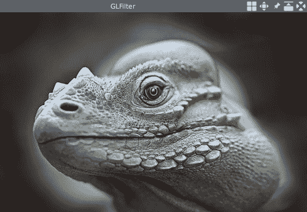
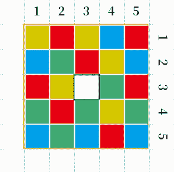
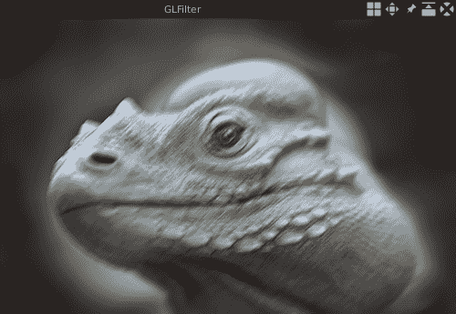

# 使用 OpenGL 进行图像的高速过滤

在前面的章节中，我们学到了很多有关如何使用 OpenCV 处理图像和视频的知识。 这些过程大多数由 CPU 完成。 在本章中，我们将探索另一种处理图像的方法，即使用 OpenGL 将图像过滤从 CPU 移至**图形处理单元**（**GPU**）。

在许多类型的软件（例如 Google Chrome 浏览器）中，您可能会在“设置”页面上看到用于硬件加速或类似功能的选项。 通常，这些设置意味着将图形卡（或 GPU）用于渲染或计算。 这种使用另一个处理器而不是 CPU 进行计算或渲染的方法称为**异构计算**。 进行异构计算的方法有很多，包括 OpenCL，我们在第 6 章，“实时对象检测”中提到了这一点，而我们是在使用 OpenCV 及其 OpenCL 后端运行深度学习模型时 。 我们将在本章中介绍的 OpenGL 也是一种异构计算的方法，尽管它主要用于 3D 图形渲染。 在这里，我们将使用它来过滤 GPU 上的图像，而不是渲染 3D 图形。

本章将涵盖以下主题：

*   OpenGL 简介
*   在 Qt 中使用 OpenGL
*   使用 OpenGL 在 GPU 上过滤图像
*   在 OpenCV 中使用 OpenGL

# 技术要求

必须具备 C 和 C++ 编程语言的基本知识才能遵循本章。 由于 OpenGL 将是本章的主要部分，因此对 OpenGL 的深入了解也将是一个很大的优势。

考虑到我们将 Qt 和 OpenCV 与 OpenGL 一起使用，至少要求读者以与前面各章相同的方式安装 Qt 5 和 OpenCV 4.0.0。

[本章的所有代码都可以在我们的代码库中找到](https://github.com/PacktPublishing/Qt-5-and-OpenCV-4-Computer-Vision-Projects/tree/master/Chapter-08)。

[您可以观看以下视频以查看运行中的代码](http://bit.ly/2Fj4z3Y)

# 你好 OpenGL

OpenGL 不是像 OpenCV 或 Qt 这样的典型编程库。 它的维护者 Khronos 组仅设计和定义 OpenGL 的 API 作为规范。 但是，它不负责执行。 相反，图形卡制造商应负责提供实现。 大多数制造商，例如英特尔，AMD 和 Nvidia，都在其显卡驱动程序中提供了实现。 在 Linux 上，有一个称为 Mesa 的 OpenGL 实现，如果图形卡驱动正确，它可以进行软件渲染，同时也支持硬件渲染。

如今，OpenGL 的学习曲线非常陡峭。 这是因为您需要了解异构体系结构和另一种编程语言，称为 OpenGL Shading Language，以及 C 和 C++。 在本章中，我们将使用新样式的 API 来渲染和过滤图像，该 API 是 OpenGL V4.0 中引入的，并已反向移植到 V3.3。 我们将从一个简单的示例开始，向 OpenGL 说“Hello”。

在开始示例之前，我们应该确保在我们的计算机上安装了 OpenGL 和一些帮助程序库。 在 Windows 上，如果您安装了用于图形卡的最新驱动程序，则还将安装 OpenGL 库。 在现代 MacOS 上，预先安装了 Apple 实现的 OpenGL 库。 在 Linux 上，我们可以使用 Mesa 实现或已安装图形卡的专有硬件驱动程序。 使用 Mesa 更容易，因为一旦安装了 Mesa 的运行时和开发包，我们将获得有效的 OpenGL 安装。

在使用 OpenGL 进行任何操作之前，我们必须创建一个 OpenGL 上下文进行操作，并创建一个与该上下文关联的窗口以显示渲染的图形。 这项工作通常取决于平台。 幸运的是，有许多库可以隐藏这些与平台有关的细节，并包装用于该用途的通用 API。 在这里，我们将使用 [GLFW](https://www.glfw.org/) 和 [GLEW](http://glew.sourceforge.net/) 库。 GLFW 库将帮助我们创建 OpenGL 上下文和一个窗口来显示渲染的图形，而 GLEW 库将处理 OpenGL 标头和扩展名。 在类似 UNIX 的系统上，我们可以从源代码构建它们，也可以使用系统软件包管理器轻松地安装它们。 在 Windows 上，我们可以下载两个帮助程序库的官方网站上提供的二进制程序包以进行安装。

最后，在安装所有必备组件之后，我们可以启动`Hello OpenGL`示例。 编写 OpenGL 程序通常涉及以下步骤，如下所示：

1.  创建上下文和窗口。
2.  准备要绘制的对象的数据（以 3D 形式）。
3.  通过调用一些 OpenGL API 将数据传递给 GPU。
4.  调用绘图指令以告诉 GPU 绘制对象。 在绘制过程中，GPU 将对数据进行许多操作，并且可以通过使用 OpenGL 着色语言编写着色器来自定义这些操作。
5.  编写将在 GPU 上运行的着色器，以操纵 GPU 上的数据。

让我们看一下如何在代码中执行这些步骤。 首先，我们创建一个名为`main.c`的源文件，然后添加基本的`include`指令和`main`函数，如下所示：

```cpp
    #include <stdio.h>

    #include <GL/glew.h>
    #include <GLFW/glfw3.h>

    int main() {
        return 0;
    }
```

然后，正如我们提到的，第一步是创建 OpenGL 上下文和用于显示图形的窗口：

```cpp
        // init glfw and GL context
        if (!glfwInit()) {
            fprintf(stderr, "ERROR: could not start GLFW3\n");
            return 1;
        }
        glfwWindowHint(GLFW_CONTEXT_VERSION_MAJOR, 3); // 3.3 or 4.x
        glfwWindowHint(GLFW_CONTEXT_VERSION_MINOR, 3);
        glfwWindowHint(GLFW_OPENGL_FORWARD_COMPAT, GL_TRUE);
        glfwWindowHint(GLFW_OPENGL_PROFILE, GLFW_OPENGL_CORE_PROFILE);

        GLFWwindow *window = NULL;
        window = glfwCreateWindow(640, 480, "Hello OpenGL", NULL, NULL);
        if (!window) {
            fprintf(stderr, "ERROR: could not open window with GLFW3\n");
            glfwTerminate();
            return 1;
        }
        glfwMakeContextCurrent(window);
```

在这段代码中，我们首先通过调用其`glfwInit`函数来初始化 GLFW 库。 然后，我们使用`glfwWindowHint`函数设置一些提示，如下所示：

*   `GLFW_CONTEXT_VERSION_MAJOR`和`GLFW_CONTEXT_VERSION_MINOR`用于指定 OpenGL 版本； 正如我们提到的，我们使用的是新样式的 API，该 API 是在 V4.0 中引入的，并已反向移植到 V3.3，因此，这里至少应使用 V3.3。
*   `GLFW_OPENGL_FORWARD_COMPAT`将 OpenGL 前向兼容性设置为`true`。
*   `GLFW_OPENGL_PROFILE`用于设置用于创建 OpenGL 上下文的配置文件。 通常，我们可以选择两个配置文件：核心配置文件和兼容性配置文件。 使用核心配置文件，只能使用新样式的 API，而使用兼容性配置文件，制造商可以提供对旧 API 和新 API 的支持。 但是，使用兼容性配置文件时，在某些实现上运行新版本的着色器时可能会出现一些故障。 因此，在这里，我们使用核心配置文件。

设置提示后，我们声明并创建窗口。 从`glfwCreateWindow`函数的参数中可以看到，新创建的窗口的宽度为 640 像素，高度为 480 像素，并以`Hello OpenGL`字符串作为标题。

与该窗口关联的 OpenGL 上下文也随该窗口一起创建。 我们调用`glfwMakeContextCurrent`函数将上下文设置为当前上下文。

之后，`GLEW`库也需要初始化：

```cpp
        // start GLEW extension handler
        GLenum ret = glewInit();
        if ( ret != GLEW_OK) {
            fprintf(stderr, "Error: %s\n", glewGetErrorString(ret));
        }
```

接下来，让我们转到第二步，准备要绘制的对象的数据。 我们在这里画一个三角形。 三角形是 OpenGL 中最原始的形状，因为我们在 OpenGL 中绘制的几乎所有东西都是由三角形组成的。 以下是三角形的数据：

```cpp
        GLfloat points[] = {+0.0f, +0.5f, +0.0f,
                            +0.5f, -0.5f, +0.0f,
                            -0.5f, -0.5f, +0.0f };
```

如您所见，数据是一个由 9 个元素组成的浮点数组。 也就是说，我们使用三个浮点数来描述 3D 空间中三角形的每个顶点，并且每个三角形有三个顶点。 在本书中，我们不会过多关注 3D 渲染，因此我们将每个顶点的`z`坐标设置为 0.0，以将三角形绘制为 2D 形状。

OpenGL 使用称为**规范化设备坐标**（**NDC**）的坐标系。 在该坐标系中，所有坐标都限制在 -1.0 和 1.0 的范围内。 如果对象的坐标超出此范围，则它们将不会显示在 OpenGL 视口中。 通过省略`z`轴，可以通过下图演示 OpenGL 的视口和给出的点（形成三角形）：


顶点数据已准备就绪，现在我们应该将其传递到 GPU。 这是通过**顶点缓冲对象**（**VBO**）和**顶点数组对象**（**VAO**）完成的； 让我们看下面的代码：

```cpp
        // vbo
        GLuint vbo;
        glGenBuffers(1, &vbo);
        glBindBuffer(GL_ARRAY_BUFFER, vbo);
        glBufferData(GL_ARRAY_BUFFER, 9 * sizeof(GLfloat), points, GL_STATIC_DRAW);
```

在前面的代码中，对`glGenBuffers`函数的调用将生成一个顶点缓冲区对象（第一个参数），并将对象的名称存储到`vbo`变量（第二个参数）中。 然后，我们调用`glBindBuffer`函数将顶点缓冲区对象绑定为`GL_ARRAY_BUFFER`类型的当前 OpenGL 上下文，这意味着该对象用于顶点属性的数据。 最后，我们调用`glBufferData`函数来创建数据存储，并使用当前绑定缓冲区的顶点数据对其进行初始化。 函数调用的最后一个参数告诉 OpenGL 我们的数据不会更改，这是优化的提示。

现在，我们已经将数据填充到顶点缓冲区对象中，但是该缓冲区在 GPU 上不可见。 为了使它在 GPU 上可见，我们应该引入一个顶点数组对象并放置一个指向其中缓冲区的指针：

```cpp
        GLuint vao;
        glGenVertexArrays(1, &vao);
        glBindVertexArray(vao);
        glEnableVertexAttribArray(0);
        glVertexAttribPointer(0, 3, GL_FLOAT, GL_FALSE, 0, NULL);
```

与顶点缓冲区对象一样，顶点数组对象应在使用前生成并绑定。 之后，我们调用`glEnableVertexAttribArray`函数启用索引为`0`的通用顶点属性数组指针； 在顶点数组对象中。 您可以认为这是为我们在顶点数组对象中创建的顶点缓冲对象保留席位，席位号为`0`。 然后，我们调用`glVertexAttribPointer`函数，以使当前绑定的顶点缓冲对象位于相反的位置。 该函数接受许多参数，其签名如下：

```cpp
    void glVertexAttribPointer(
        GLuint index,
        GLint size,
        GLenum type,
        GLboolean normalized,
        GLsizei stride,
```

```cpp
        const GLvoid * pointer
    );
```

让我们一一探讨它们，如下所示：

*   `index`指定索引（或座位号）。
*   `size`指定每个顶点属性的组件数； 每个顶点（或点）有三个浮点数，因此我们在此处使用`3`。
*   `type`是缓冲区的元素类型或顶点属性的组成部分的数据类型。
*   `normalized`指定在 GPU 上访问数据之前是否应通过 OpenGL 对我们的数据进行规范化。 在我们的例子中，我们使用规范化的数据（介于-1.0 和 1.0 之间），因此不需要再次进行规范化。
*   `stride`是连续的通用顶点属性之间的偏移量。 我们在这里使用`0`来告诉 OpenGL 我们的数据紧密包装并且没有偏移量。
*   `pointer`是缓冲区中第一个通用顶点属性的第一部分的偏移量。 我们使用`NULL`表示零偏移。

至此，我们已经通过使用顶点缓冲对象和顶点数组对象将顶点数据成功传递到了 GPU 上。 然后，数据将被发送到 OpenGL 的图形管道。 OpenGL 图形管线有几个阶段：接受我们的 3D 顶点，数据和一些其他数据，将它们转换为 2D 图形中的彩色像素，并将其显示在屏幕上。 GPU 具有大量处理器，可以在这些处理器上并行完成顶点的转换。 因此，通过使用 GPU，我们可以在处理图像或进行可并行化的数值计算时提高性能。

在继续之前，让我们先看一下 OpenGL 图形管线的各个阶段。 我们可以将其大致分为六个阶段，如下所示：

*   **顶点着色器**：此阶段将顶点属性数据（在我们的情况下，我们已经传递给 GPU）作为其输入，并给出每个顶点的位置作为其输出。 OpenGL 在此阶段没有提供默认的着色器程序，因此我们应该自己编写一个。
*   **形状组装**：此阶段用于组装形状；此阶段用于组装形状。 例如，生成顶点并将其定位。 这是一个可选阶段，对于我们来说，我们将忽略它。
*   **几何着色器**：此阶段用于生成或删除几何，它也是一个可选阶段，我们无需编写着色器程序。
*   **栅格化**：此阶段将 3D 形状（在 OpenGL 中主要是三角形）转换为 2D 像素。 此阶段不需要任何着色器程序。
*   **片段着色器**：此阶段用于着色光栅化阶段中的片段。 像顶点着色器阶段一样，OpenGL 在此阶段不提供默认的着色器程序，因此我们应该自己编写一个。
*   **混合**：此阶段在屏幕或帧缓冲区上渲染 2D 图形。

这六个阶段中的每个阶段都将其前一级的输出作为输入，并将输出提供给下一级。 此外，在某些阶段，我们可以或需要编写着色器程序来参与这项工作。 着色器程序是一段用 OpenGL 着色语言编写并在 GPU 上运行的代码。 它由 OpenGL 实现在我们的应用程序运行时中编译。 在前面的阶段列表中可以看到，至少有两个阶段，即顶点着色器和片段着色器，即使在最小的 OpenGL 应用程序中，也需要我们提供着色器程序。 这是 OpenGL 学习曲线中最陡峭的部分。 让我们检查一下这些着色器程序的外观：

```cpp
        // shader and shader program
        GLuint vert_shader, frag_shader;
        GLuint shader_prog;
        const char *vertex_shader_code = "#version 330\n"
            "layout (location = 0) in vec3 vp;"
            "void main () {"
            " gl_Position = vec4(vp, 1.0);"
            "}";

        const char *fragment_shader_code = "#version 330\n"
            "out vec4 frag_colour;"
            "void main () {"
            " frag_colour = vec4(0.5, 1.0, 0.5, 1.0);"
            "}";

        vert_shader = glCreateShader(GL_VERTEX_SHADER);
        glShaderSource(vert_shader, 1, &vertex_shader_code, NULL);
        glCompileShader(vert_shader);

        frag_shader = glCreateShader(GL_FRAGMENT_SHADER);
        glShaderSource(frag_shader, 1, &fragment_shader_code, NULL);
        glCompileShader(frag_shader);

        shader_prog = glCreateProgram();
        glAttachShader(shader_prog, frag_shader);
        glAttachShader(shader_prog, vert_shader);
        glLinkProgram(shader_prog);
```

在这段代码中，我们首先定义三个变量：`vert_shader`和`frag_shader`用于相应阶段所需的着色器程序，`shader_prog`用于整个着色器程序，它将包含所有着色器程序的所有着色器程序。 阶段。 然后，将着色器程序作为字符串编写在代码中，我们将在后面解释。 接下来，我们通过调用`glCreateShader`函数并向其附加源字符串来创建每个着色器程序，然后对其进行编译。

准备好阶段的着色器程序之后，我们将创建整个着色器程序对象，将阶段着色器程序附加到该对象，然后链接该程序。 至此，整个着色器程序就可以使用了，我们可以调用`glUseProgram`来使用它。 我们将在解释着色器程序的代码之后再做。

现在，让我们看一下顶点着色器：

```cpp
    #version 330
    layout (location = 0) in vec3 vp;
    void main() {
        gl_Position = vec4(vp, 1.0);
    }
```

前面代码的第一行是版本提示，即，它指定 OpenGL 着色语言的版本。 在这里，我们使用版本 330，它对应于我们使用的 OpenGL 版本。

然后，在第二行中，声明输入数据的变量。 `layout (location = 0)`限定符指示此输入数据与当前绑定的顶点数组对象的索引`0`（或编号为`0`的座位）相关联。 另外，`in`关键字表示它是输入变量。 代表`3`浮点数向量的单词`vec3`是数据类型，`vp`是变量名。 在我们的例子中，`vp`将是我们存储在`points`变量中的一个顶点的坐标，并且这三个顶点将被分派到 GPU 上的三个不同处理器，因此这段代码的每个顶点将在这些处理器上并行运行。 如果只有一个输入数组，则可以在此着色器中省略`layout`限定符。

正确描述输入数据之后，我们定义`main`函数，该函数是程序的入口点，就像使用 C 编程语言一样。 在`main`函数中，我们从输入构造一个包含四个浮点数的向量，然后将其分配给`gl_Position`变量。 `gl_Position`变量是预定义的变量，它是下一阶段的输出，并表示顶点的位置。

该变量的类型为`vec4`，但不是`vec3`； 第四个组件名为`w`，而前三个组件为`x`，`y`和`z`，我们可以猜测。 `w`成分是一个因子，用于分解其他向量成分以使其均一； 在本例中，我们使用 1.0，因为我们的值已经是标准化值。

总而言之，我们的顶点着色器从顶点数组对象获取输入，并保持不变。

现在，让我们看一下片段着色器：

```cpp
    #version 330
    out vec4 frag_colour;
    void main () {
        frag_colour = vec4(0.5, 1.0, 0.5, 1.0);
    }
```

在此着色器中，我们使用`vec4`类型的`out`关键字定义一个输出变量，它以 RGBA 格式表示颜色。 然后，在`main`函数中，我们为输出变量分配恒定的颜色，即浅绿色。

现在，着色器程序已经准备就绪，让我们开始图形管道：

```cpp
        while (!glfwWindowShouldClose(window)) {
            glClear(GL_COLOR_BUFFER_BIT | GL_DEPTH_BUFFER_BIT);
            glUseProgram(shader_prog);
            glBindVertexArray(vao);
            glDrawArrays(GL_TRIANGLES, 0, 3);
            // update other events like input handling
            glfwPollEvents();
            // put the stuff we've been drawing onto the display
            glfwSwapBuffers(window);
        }

        glfwTerminate();
```

在前面的代码中，除非关闭应用程序窗口，否则我们将连续运行代码块。 在代码块中，我们清除窗口上的位平面区域，然后使用我们创建的着色器程序并绑定顶点数组对象。 此操作将着色器程序和数组或缓冲区与当前 OpenGL 上下文连接。 接下来，我们调用`glDrawArrays`启动图形管道以绘制对象。 `glDrawArrays`函数的第一个参数是原始类型。 在这里，我们要绘制一个三角形，因此使用`GL_TRIANGLES`。 第二个参数是我们为顶点缓冲区对象启用的缓冲区索引，最后一个参数是我们要使用的顶点数。

至此，绘制三角形的工作已经完成，但是我们还有更多工作要做：我们调用`glfwPollEvents`函数以捕获发生在窗口上的事件，并通过窗口对象调用`glfwSwapBuffers`函数来显示我们绘制的图形。 我们需要后一个函数调用，因为 GLFW 库使用双缓冲区优化。

当用户关闭窗口时，我们将跳出代码块并启动对`glfwTerminate`函数的调用，以释放 GLFW 库分​​配的所有资源。 然后应用程序退出。

好的，让我们编译并运行该应用程序：

```cpp
gcc -Wall -std=c99 -o main.exe main.c -lGLEW -lglfw -lGL -lm
./main.exe
```

您将看到以下绿色三角形：


如果使用 Windows，则可以使用`gcc -Wall -std=c99 -o main.exe main.c libglew32.dll.a glfw3dll.a -lOpenGL32 -lglew32 -lglfw3 -lm`命令在 MinGW 上编译应用程序。 不要忘记使用`-I`和`-L`选项指定 GLFW 和 GLEW 库的包含路径和库路径。

好的，我们的第一个 OpenGL 应用程序完成了。 但是，正如您所看到的，GLFW 并不是完整的 GUI 库，尤其是当我们将其与 Qt 库进行比较时，在本书中我们经常使用它。 GLFW 库可以创建窗口并捕获和响应 UI 事件，但是它没有很多小部件。 那么，如果我们在应用程序中同时需要 OpenGL 和一些小部件，会发生什么情况？ 我们可以在 Qt 中使用 OpenGL 吗？ 答案是肯定的，我们将在下一节中演示如何做到这一点。

# Qt 中的 OpenGL

在早期，Qt 有一个名为`OpenGL`的模块，但是在 Qt 5.x 中，该模块已被弃用。 `gui`模块中加入了新版本的 OpenGL 支持功能。 如果您在 Qt 文档中搜索名称以`QOpenGL`开头的类，则会找到它们。 除了`gui`模块中的功能外，`widgets`模块中还有一个重要的类，名为`QOpenGLWidget`。 在本节中，我们将使用其中一些功能在 Qt 中使用 OpenGL 绘制一个三角形。

首先，让我们创建所需的 Qt 项目：

```cpp
$ pwd
/home/kdr2/Work/Books/Qt5-And-OpenCV4-Computer-Vision-Projects/Chapter-08
$ mkdir QtGL
$ cd QtGL/
$ touch main.cpp
$ qmake -project
$ ls
QtGL.pro main.cpp
$
```

然后，我们将`QtGL.pro`项目文件的内容更改为以下内容：

```cpp
TEMPLATE = app
TARGET = QtGL

QT += core gui widgets

INCLUDEPATH += .

DEFINES += QT_DEPRECATED_WARNINGS

# Input
HEADERS += glpanel.h
SOURCES += main.cpp glpanel.cpp

RESOURCES = shaders.qrc
```

这是指许多目前尚不存在的文件，但请不要担心-我们将在编译项目之前创建所有文件。

首先，我们将创建一个名为`GLPanel`的小部件类，以显示将在 OpenGL 上下文中绘制的图形。 我们用于准备数据以及绘制图形的代码也将在此类中。 让我们检查一下`glpanel.h`头文件中的`GLPanel`类的声明：

```cpp
    class GLPanel : public QOpenGLWidget, protected QOpenGLFunctions_4_2_Core
    {
        Q_OBJECT

    public:
        GLPanel(QWidget *parent = nullptr);
        ~GLPanel();

    protected:
        void initializeGL() override;
        void paintGL() override;
        void resizeGL(int w, int h) override;
    private:
        GLuint vbo;
        GLuint vao;
        GLuint shaderProg;
    };
```

该类派生自两个类：`QOpenGLWidget`类和`QOpenGLFunctions_4_2_Core`类。

`QOpenGLWidget`类提供了三个必须在我们的类中实现的受保护的方法，如下所示：

*   `initializeGL`方法用于初始化； 例如，准备顶点数据，顶点缓冲区对象，数组缓冲区对象和着色器程序。
*   `paintGL`方法用于绘图工作； 例如，在其中我们将调用`glDrawArrays`函数。
*   `resizeGL`方法是在调整窗口小部件大小时将调用的函数。

`QOpenGLFunctions_4_2_Core`类包含许多功能，它们的名称与 Khronos 的 OpenGL V4.2 API 相似。 类名称中的`4_2`字符串指示我们正在使用的 OpenGL 版本，`Core`字符串告诉我们已使用 OpenGL 的核心配置文件。 我们从该类派生我们的类，以便我们可以使用具有相同名称的所有 OpenGL 函数，而在我们的类中没有任何前缀，尽管这些函数实际上是 Qt 提供的包装器。

让我们转到`glpanel.cpp`源文件以查看实现。 构造函数和析构函数非常简单，因此在此不再赘述。 首先，让我们看一下初始化方法`void GLPanel::initializeGL()`：

```cpp
    void GLPanel::initializeGL()
    {
        initializeOpenGLFunctions();
        // ... omit many lines
        std::string vertex_shader_str = textContent(":/shaders/vertex.shader");
        const char *vertex_shader_code = vertex_shader_str.data();

        std::string fragment_shader_str = textContent(":/shaders/fragment.shader");
        const char *fragment_shader_code = fragment_shader_str.data();
        // ... omit many lines
    }
```

此方法中的大多数代码是从上一部分的`main`函数复制而来的； 因此，我在这里省略了很多行，仅说明了相同点和不同点。 在这种方法中，我们准备了顶点数据，顶点缓冲对象和顶点数组对象。 将数据传递给 GPU； 并编写，编译和链接着色器程序。 除了`vao`，`vbo`和`shaderProg`是类成员而不是局部变量之外，该过程与前面的应用程序相同。

除此之外，我们在一开始就调用`initializeOpenGLFunctions`方法来初始化 OpenGL 函数包装器。 另一个区别是我们将着色器代码移到单独的文件中，以提高着色器程序的可维护性。 我们将文件放在名为`shaders`的子目录下，并在`shaders.qrc` Qt 资源文件中引用它们：

```cpp
    <!DOCTYPE RCC>
    <RCC version="1.0">
      <qresource>
        <file>shaders/vertex.shader</file>
        <file>shaders/fragment.shader</file>
      </qresource>
    </RCC>
```

然后，我们使用`textContent`函数加载这些文件的内容。 此功能也在`glpanel.cpp`文件中定义：

```cpp
    std::string textContent(QString path) {
        QFile file(path);
        file.open(QFile::ReadOnly | QFile::Text);
        QTextStream in(&file);
        return in.readAll().toStdString();
    }
```

现在初始化已完成，让我们继续进行`paintGL`方法：

```cpp
    void GLPanel::paintGL()
    {
        glClear(GL_COLOR_BUFFER_BIT | GL_DEPTH_BUFFER_BIT | GL_STENCIL_BUFFER_BIT);
        glUseProgram(shaderProg);
        glBindVertexArray(vao);
        glDrawArrays(GL_TRIANGLES, 0, 3);
        glFlush();
    }
```

如您所见，在此方法中绘制三角形的所有操作与先前应用程序中的最后一个代码块完全相同。

最后，当调整窗口小部件的大小时，我们调整 OpenGL 视口的大小：

```cpp
    void GLPanel::resizeGL(int w, int h)
    {
        glViewport(0, 0, (GLsizei)w, (GLsizei)h);
    }
```

至此，我们已经完成了`GLPanel` OpenGL 小部件，因此让我们在`main.cpp`文件中使用它：

```cpp
    int main(int argc, char *argv[])
    {
        QApplication app(argc, argv);

        QSurfaceFormat format = QSurfaceFormat::defaultFormat();
        format.setProfile(QSurfaceFormat::CoreProfile);
        format.setVersion(4, 2);
        QSurfaceFormat::setDefaultFormat(format);

        QMainWindow window;
        window.setWindowTitle("QtGL");
        window.resize(800, 600);
        GLPanel *panel = new GLPanel(&window);
        window.setCentralWidget(panel);
        window.show();
        return app.exec();
    }
```

在主要功能中，我们获取默认的`QSurefaceFormat`类型并更新与 OpenGL 相关的一些关键设置，如下所示：

*   将配置文件设置为核心配置文件。
*   由于我们使用`QOpenGLFunctions_4_2_Core`类，因此将版本设置为 V4.2。

然后，我们创建主窗口和`GLPanel`类的实例，将`GLPanel`实例设置为主窗口的中央小部件，显示该窗口并执行该应用程序。 我们在 OpenGL 中的第一个 Qt 应用程序已经完成，因此您现在可以编译并运行它。 但是，您可能会发现与前面的示例中的窗口没有什么不同。 是的，我们向您展示了如何在 Qt 项目中使用 OpenGL，但没有向您展示如何制作具有许多小部件的复杂应用程序。 由于在前几章中我们已经学到了很多有关如何使用 Qt 构建复杂的 GUI 应用程序的知识，并且现在有了 OpenGL 小部件，因此您可以尝试自己开发具有 OpenGL 功能的复杂 Qt 应用程序。 在下一节中，我们将更深入地研究 OpenGL，以探索如何使用 OpenGL 过滤图像。

除了`QOpenGLFunctions_*`类中的 OpenGL API 函数外，Qt 还为 OpenGL 中的概念包装了许多其他类。 例如，`QOpenGLBuffer`类用于顶点缓冲区对象，`QOpenGLShaderProgram`类型用于着色器程序，等等。 这些类的使用也非常方便，但与最新版本的 OpenGL 相比可能会（或将会）落后一些。

# 使用 OpenGL 过滤图像

到目前为止，我们已经学习了如何在 OpenGL 中绘制一个简单的三角形。 在本节中，我们将学习如何绘制图像并使用 OpenGL 对其进行过滤。

我们将在 QtGL 项目的副本（即名为`GLFilter`的新项目）中进行此工作。 就像我们在前几章中所做的那样，该项目的创建仅涉及直接复制和一点重命名。 我在这里不再重复，所以请自己复制。

# 使用 OpenGL 绘制图像

为了在 OpenGL 视口上绘制图像，我们应该引入 OpenGL 的另一个概念-纹理。 OpenGL 中的纹理通常是 2D 图像，通常用于向对象（主要是三角形）添加视觉细节。

由于任何类型的数字图像通常都是矩形，因此我们应绘制两个三角形以组成图像的矩形，然后将图像加载为纹理并将其映射到矩形。

纹理使用的坐标系与绘制三角形时使用的 NDC 不同。 纹理坐标系的`x`和`y`（轴）都在`0`和`1`之间，即，左下角是`(0, 0)`，右上角是`(1, 1)`。 因此，我们的顶点和坐标映射如下所示：


上图显示了我们将绘制的两个三角形之一，即右下角的三角形。 括号中的坐标为三角形顶点的坐标，方括号中的坐标为纹理的坐标。

如图所示，我们定义顶点属性数据如下：

```cpp
         GLfloat points[] = {
                     // first triangle
                     +1.0f, +1.0f, +0.0f, +1.0f, +1.0f, // top-right
                     +1.0f, -1.0f, +0.0f, +1.0f, +0.0f, // bottom-right
                     -1.0f, -1.0f, +0.0f, +0.0f, +0.0f, // bottom-left
                     // second triangle
                     -1.0f, -1.0f, +0.0f, +0.0f, +0.0f, // bottom-left
                     -1.0f, +1.0f, +0.0f, +0.0f, +1.0f, // top-left
                     +1.0f, +1.0f, +0.0f, +1.0f, +1.0f // top-right
         };
```

如您所见，我们为两个三角形定义了六个顶点。 此外，每个顶点有五个浮点数-前三个是三角形顶点的坐标，而后两个是与顶点对应的纹理的坐标。

现在，让我们将数据传递到 GPU：

```cpp
         // VBA & VAO
         glGenBuffers(1, &vbo);
         glBindBuffer(GL_ARRAY_BUFFER, vbo);
         glBufferData(GL_ARRAY_BUFFER, sizeof(points), points, GL_STATIC_DRAW);

         glGenVertexArrays(1, &vao);
         glBindVertexArray(vao);
         glEnableVertexAttribArray(0);
         glVertexAttribPointer(0, 3, GL_FLOAT, GL_FALSE, 5 * sizeof(float), NULL);
         glEnableVertexAttribArray(1);
         glVertexAttribPointer(1, 2, GL_FLOAT, GL_FALSE, 5 * sizeof(float), (void*)(3 * sizeof(float)));
```

在前面的代码中，我们创建顶点缓冲区对象，将浮点数填充到其中，然后创建顶点数组对象。 在这里，与上一次在`Hello OpenGL`示例中绘制单个三角形时，将顶点缓冲区对象绑定到顶点数组对象相比，我们在顶点数组对象中启用了两个指针，但没有一个； 也就是说，我们在那里预留了两个席位。 第一个索引为`0`，用于三角形顶点的坐标。 第二个索引是`1`，用于将纹理坐标映射到顶点。

下图显示了缓冲区中三个顶点的数据布局以及我们如何在顶点数组对象中使用它：


我们将顶点的坐标用作索引为 0 的指针，如图所示，每个顶点的元素计数为 3，步幅为 20（`5 * sizeof(float)`），其偏移量为 0。这些是我们第一次调用`glVertexAttribPointer`函数时传递的参数。 对于纹理的坐标，元素数为 2，步幅为 20，偏移量为 12。使用这些数字，我们再次调用`glVertexAttribPointer`函数来设置数组指针。

好的，因此将顶点属性的数据传递到 GPU； 现在让我们演示如何将图像（或纹理）加载到 GPU 上：

```cpp
         // texture
         glEnable(GL_TEXTURE_2D);
         // 1\. read the image data
         QImage img(img/lizard.jpg");
         img = img.convertToFormat(QImage::Format_RGB888).mirrored(false, true);
         // 2\. generate texture
         glGenTextures(1, &texture);
         glBindTexture(GL_TEXTURE_2D, texture);
         glTexImage2D(
             GL_TEXTURE_2D, 0, GL_RGB,
             img.width(), img.height(), 0, GL_RGB, GL_UNSIGNED_BYTE, img.bits());
         glGenerateMipmap(GL_TEXTURE_2D);
```

在这段代码中，我们启用 OpenGL 的 2D 纹理功能，从 Qt 资源系统加载图像，然后将图像转换为 RGB 格式。 您可能会注意到，我们通过调用`mirrored`方法在垂直方向翻转图像。 这是因为 Qt 中的图像和 OpenGL 中的纹理使用不同的坐标系：`(0, 0)`是 Qt 图像中的左上角，而它是 OpenGL 纹理中的左下角。 换句话说，它们的`y`轴方向相反。

加载图像后，我们生成一个纹理对象，并将其名称保存到`texture`类成员，并将其绑定到当前 OpenGL 上下文。 然后，我们调用`glTexImage2D`函数将图像数据复制到 GPU 的纹理内存中。 这是此功能的签名：

```cpp
     void glTexImage2D(
         GLenum target,
         GLint level,
         GLint internalformat,
         GLsizei width,
         GLsizei height,
         GLint border,
         GLenum format,
         GLenum type,
         const GLvoid * data
     );
```

让我们检查一下此函数的参数，如下所示：

*   以`GL_TEXTURE_2D`作为其值的`target`指定纹理目标。 OpenGL 还支持 1D 和 3D 纹理，因此我们使用此值来确保它是我们正在操作的当前绑定的 2D 纹理。
*   `level`是 mipmap 级别。 在 OpenGL 中，mipmap 是通过调整原始图像大小而生成的一系列不同大小的图像。 在该系列中，每个后续图像都是前一个图像的两倍。 自动选择了 mipmap 中的图像，以用于不同的对象大小，或特定对象位于不同位置时使用。 例如，如果物体在我们看来不远，则将使用较小的图像。 与动态调整纹理大小到适当大小相比，使用 mipmap 中预先计算的纹理可以减少计算并提高图像质量。 如果要手动操作 mipmap，则应使用非零值。 在这里，我们将使用 OpenGL 提供的函数来生成 mipmap，因此我们只需使用`0`即可。
*   `internalformat`告诉 OpenGL 我们想以哪种格式存储纹理。我们的图像只有 RGB 值，因此我们也将存储带有 RGB 值的纹理。
*   `width`和`height`是目标纹理的宽度和高度。 我们在这里使用图像的尺寸。
*   `border`是没有意义的传统参数，应始终为`0`。
*   `format`和`type`是源图像的格式和数据类型。
*   `data`是指向实际图像数据的指针。

调用返回后，纹理数据已在 GPU 上准备就绪，然后调用`glGenerateMipmap(GL_TEXTURE_2D)`为当前绑定的 2D 纹理生成 mipmap。

至此，纹理已经准备就绪，让我们看一下着色器程序。 首先是顶点着色器，如下所示：

```cpp
     #version 420

     layout (location = 0) in vec3 vertex;
     layout (location = 1) in vec2 inTexCoord;

     out vec2 texCoord;

     void main()
     {
         gl_Position = vec4(vertex, 1.0);
         texCoord = inTexCoord;
     }
```

在此着色器中，两个输入变量（其位置为`0`和`1`）对应于我们在顶点数组对象中启用的两个指针，它们表示三角形顶点的坐标和纹理映射坐标。 在主函数中，我们通过将顶点分配给预定义变量`gl_Position`来设置顶点的位置。 然后，我们将纹理坐标传递给使用`out`关键字声明的输出变量。 这个输出变量将被传递给下一个着色器，即片段着色器。 以下是我们的片段着色器：

```cpp
     #version 420

     in vec2 texCoord;
     out vec4 frag_color;
     uniform sampler2D theTexture;

     void main()
     {
         frag_color = texture(theTexture, texCoord);
     }
```

此片段着色器中有三个变量，如下所示：

*   `in vec2 texCoord`是来自顶点着色器的纹理坐标。
*   `out vec4 frag_color`是输出变量，我们将对其进行更新以传递片段的颜色。
*   `uniform sampler2D theTexture`是纹理。 它是`uniform`变量； 与`in`和`out`变量不同，可以在 OpenGL 图形管线的任何阶段的任何着色器中看到`uniform`变量。

在主函数中，我们使用内置的`texture`函数获取与给定纹理坐标`texCoord`对应的颜色，并将其分配给输出变量。 从纹理中选择颜色的过程在 OpenGL 术语中称为纹理采样。

现在，着色器已准备就绪。 我们在初始化函数中要做的最后一件事是调整主窗口的大小以适合图像大小：

```cpp
         ((QMainWindow*)this->parent())->resize(img.width(), img.height());
```

好的，现在让我们在`GLPanel::paintGL`方法中绘制对象：

```cpp
         glClear(GL_COLOR_BUFFER_BIT | GL_DEPTH_BUFFER_BIT | GL_STENCIL_BUFFER_BIT);

         glUseProgram(shaderProg);
         glBindVertexArray(vao);
         glBindTexture(GL_TEXTURE_2D, texture);
         glDrawArrays(GL_TRIANGLES, 0, 6);
         glFlush();
```

与上次绘制三角形相比，这里我们向`glBindTexture`添加了一个新函数调用，以将新创建​​的纹理绑定到当前 OpenGL 上下文，并使用`6`作为`glDrawArrays`函数的第三个参数， 因为我们要绘制两个三角形。

现在，该编译并运行我们的应用程序了。 如果一切顺利，您将看到 OpenGL 渲染的图像：



尽管在我们的代码中，我们从 Qt 资源系统加载了映像，但是我们可以在本地磁盘上加载任何映像-只需更改路径即可。

# 在片段着色器中过滤图像

在前面的小节中，我们使用 OpenGL 绘制了图像。 绘制图像时，我们从片段着色器的纹理（与原始图像具有相同的数据）中选择了颜色。 因此，如果我们在片段着色器中根据特定规则更改颜色，然后再将其散发出去，我们会得到修改后的图像吗？

按照这种想法，让我们在片段着色器程序中尝试一个简单的线性模糊滤镜。 下图显示了线性模糊滤镜的原理：



对于给定的像素，我们根据其周围像素的颜色确定其颜色。 在上图中，对于给定的像素，我们在其周围绘制`5 x 5`的正方形，并确保它是正方形的中心像素。 然后，我们对正方形中除中心像素本身以外的所有像素的颜色求和，求出平均值（通过将总和除以`5 x 5 - 1`），然后将平均值用作给定像素的颜色。 在这里，我们将平方称为过滤器内核及其边长，即内核大小`5`。

但是，我们这里有一个问题。 `texCoord`变量中存储的坐标是 0 到 1 之间的浮点数，而不是像素数。 在这样的范围内，我们无法直接确定内核大小，因此我们需要知道纹理坐标系中一个像素代表多长时间。 这可以通过将 1.0 除以图像的宽度和高度来解决。 这样，我们将获得两个浮点数，它们在纹理坐标系中分别代表一个像素的宽度和一个像素的高度。 稍后，我们将两个数字存储在统一的两个元素向量中。 让我们更新片段着色器，如下所示：

```cpp
     #version 420

     in vec2 texCoord;
     out vec4 frag_color;
     uniform sampler2D theTexture;
     uniform vec2 pixelScale;

     void main()
     {
         int kernel_size = 5;
         vec4 color = vec4(0.0, 0.0, 0.0, 0.0);
         for(int i = -(kernel_size / 2); i <= kernel_size / 2; i++) {
             for(int j = -(kernel_size / 2); j <= kernel_size / 2; j++) {
                 if(i == 0 && j == 0) continue;
                 vec2 coord = vec2(texCoord.x + i * pixelScale.x, texCoord.y + i * pixelScale.y);
                 color = color + texture(theTexture, coord);
             }
         }
         frag_color = color / (kernel_size * kernel_size - 1);
     }
```

前面代码中的`uniform vec2 pixelScale`变量是我们刚刚讨论的比率数。 在主函数中，我们使用`5`作为内核大小，计算出内核正方形中像素的纹理坐标，拾取颜色，然后将它们汇总为两级嵌套`for`循环。 循环后，我们计算平均值并将其分配给输出变量。

下一步是将值设置为`uniform vec2 pixelScale`变量。 链接着色器程序后，可以通过`GLPanel::initializeGL`方法完成此操作：

```cpp
         // ...
         glLinkProgram(shaderProg);
         // scale ration
         glUseProgram(shaderProg);
         int pixel_scale_loc = glGetUniformLocation(shaderProg, "pixelScale");
         glUniform2f(pixel_scale_loc, 1.0f / img.width(), 1.0f / img.height());
```

链接着色器程序后，我们在当前 OpenGL 上下文中激活（即使用）着色器程序，然后使用着色器程序和统一变量名称作为其参数调用`glGetUniformLocation`。 该调用将返回统一变量的位置。 在此位置，我们可以调用`glUniform2f`设置其值。 函数名称中的`2f`后缀表示两个浮点数，因此，我们将两个缩放比例传递给它。

至此，除一种情况外，我们的过滤器已基本完成。 考虑如果我们正在计算其颜色的给定像素位于图像边缘，将会发生什么情况。 换句话说，我们如何处理图像的边缘？ 解决方法如下：

```cpp
         glTexParameteri(GL_TEXTURE_2D, GL_TEXTURE_WRAP_S, GL_MIRRORED_REPEAT);
         glTexParameteri(GL_TEXTURE_2D, GL_TEXTURE_WRAP_T, GL_MIRRORED_REPEAT);
```

在`GLPanel::initializeGL`方法中将这两行添加到生成和绑定纹理的行旁边。 这些行设置纹理环绕的行为：`GL_TEXTURE_WRAP_S`用于水平方向，`GL_TEXTURE_WRAP_T`用于垂直方向。 我们将它们都设置为`GL_MIRRORED_REPEAT`，因此，如果我们使用小于 0 或大于 1 的坐标，则纹理图像的镜像重复将在那里进行采样。 换句话说，它具有与 OpenCV 库中的`BORDER_REFLECT`相同的效果，当我们调用`cv::warpAffine`函数时，该库将内插为`fedcba|abcdefgh|hgfedcb`。 例如，当我们访问坐标为`(1, 1 + y)`的点时，它返回点`(x, 1 - y)`的颜色。

现在，我们的线性模糊过滤器已经完成，因此让我们重新编译并运行我们的应用程序以查看效果：



好吧，它按预期工作。 为了更清楚地看到其效果，我们甚至可以仅模糊图像的一部分。 这是更新的片段着色器的主要功能：

```cpp
     void main()
     {
         int kernel_size = 7;
         vec4 color = vec4(0.0, 0.0, 0.0, 0.0);
         if(texCoord.x > 0.5) {
             for(int i = -(kernel_size / 2); i <= kernel_size / 2; i++) {
                 for(int j = -(kernel_size / 2); j <= kernel_size / 2; j++) {
                     if(i == 0 && j == 0) continue;
                     vec2 coord = vec2(texCoord.x + i * pixelScale.x, texCoord.y + i * pixelScale.y);
                     color = color + texture(theTexture, coord);
                 }
             }
             frag_color = color / (kernel_size * kernel_size - 1);
         } else {
             frag_color = texture(theTexture, texCoord);
         }
     }
```

在此版本中，我们仅模糊图像的右侧（即`texCoord.x > 0.5`的部分）； 效果如下：


由于我们将所有资源都编译为可执行文件，因此我们需要在更新资源文件（包括着色器）后重新编译应用程序。

在本节中，我们在 GPU 上运行的片段着色器中实现一个简单的线性模糊滤镜。 如果您拥有不错的 GPU 并将其应用于大图像，则与在 CPU 上运行类似的过滤器相比，您将获得较大的性能提升。

由于我们可以访问纹理（或图像）的所有像素并确定片段着色器中渲染图像的所有像素的颜色，因此我们可以在着色器程序中实现任何滤镜。 您可以自己尝试使用高斯模糊滤镜。

# 保存过滤的图像

在前面的小节中，我们实现了模糊滤镜并成功地对其进行了模糊处理-模糊的图像在 OpenGL 视口上呈现。 那么，我们可以将生成的图像另存为本地磁盘上的文件吗？ 当然; 让我们这样做如下：

```cpp
     void GLPanel::saveOutputImage(QString path)
     {
         QImage output(img.width(), img.height(), QImage::Format_RGB888);
         glReadPixels(
             0, 0, img.width(), img.height(), GL_RGB, GL_UNSIGNED_BYTE, output.bits());
         output = output.mirrored(false, true);
         output.save(path);
     }
```

我们添加了一个新的`GLPanel::saveOutputImage`方法，该方法接受文件路径作为其参数来保存图像。 另一点值得注意的是，我们将原始图像`QImage img`从`initializeGL`方法中的局部变量更改为类成员，因为我们将在类范围内使用它。

在此新添加的方法中，我们定义了一个与原始图像具有相同尺寸的新`QImage`对象，然后调用`glReadPixels`函数以读取图像对象的前四个参数所描述的矩形中的数据。 然后，由于前面提到的坐标系不同，我们在垂直方向上翻转了图像。 最后，我们将映像保存到磁盘。

如果在`paintGL`方法的末尾调用此方法，则在屏幕上看到图像后将找到已保存的图像。

# 在 OpenCV 中使用 OpenGL

在上一节中，当我们加载源图像并将其翻转时，我们使用 Qt 进行工作。 也可以使用 OpenCV 库完成此工作：

```cpp
        img = cv::imread(img/lizard.jpg");
        cv::Mat tmp;
        cv::flip(img, tmp, 0);
        cvtColor(tmp, img, cv::COLOR_BGR2RGB);
        // ...
        glTexImage2D(
            GL_TEXTURE_2D, 0, GL_RGB,
            img.cols, img.rows, 0, GL_RGB, GL_UNSIGNED_BYTE, img.data);
        // ...
```

同样，当保存结果图像时，我们可以这样做：

```cpp
        cv::Mat output(img.rows, img.cols, CV_8UC3);
        glReadPixels(
            0, 0, img.cols, img.rows, GL_RGB, GL_UNSIGNED_BYTE, output.data);
        cv::Mat tmp;
        cv::flip(output, tmp, 0);
        cvtColor(tmp, output, cv::COLOR_RGB2BGR);
        cv::imwrite(path.toStdString(), output);
```

`QImage`和`cv::Mat`都代表图像，因此很容易来回交换它们。

除了简单地使用`cv::Mat`类与纹理交换数据外，OpenCV 还具有创建 OpenGL 上下文的能力。 从源代码构建库时，需要使用`-D WITH_OPENGL=on`选项配置库。 启用 OpenGL 支持后，我们可以创建一个窗口（使用`highgui`模块），该窗口具有与之关联的 OpenGL 上下文：

```cpp
        cv::namedWindow("OpenGL", cv::WINDOW_OPENGL);
        cv::resizeWindow("OpenGL", 640, 480);
```

这里的关键是`cv::WINDOW_OPENGL`标志； 设置此标志后，将创建一个 OpenGL 上下文并将其设置为当前上下文。 但是 OpenCV 没有提供选择我们要使用的 OpenGL 版本的方法，并且它并不总是使用计算机上可用的最新版本。

我在代码库的`Chapter-08/CVGLContext`目录中提供了一个绘制带有 OpenGL 上下文和 OpenCV `highgui`模块的三角形的示例，您可以参考它以了解更多信息。 OpenCV 库的核心模块提供了一个名称空间`cv::ogl`，其中包括许多用于与 OpenGL 进行互操作的功能。

但是，这些功能与 Qt 提供的 OpenGL 相关类具有相同的问题，也就是说，它们可能远远落后于最新的 OpenGL。 因此，在这里，我建议，如果要使用 OpenGL，请仅使用原始 OpenGL API，而不要使用任何包装。 大多数 OpenGL 实现都足够灵活，可以轻松地与通用库集成，并且您始终可以以这种方式使用最新的 API。

# 总结

OpenGL 是用于开发 2D 和 3D 图形应用程序的规范，并且具有许多实现。 在本章中，我们学到了很多东西，包括绘制诸如三角形的图元，将其与 Qt 库集成，使用纹理渲染图像以及在片段着色器中过滤图像。 此外，我们以非典型方式使用 OpenGL，也就是说，我们并未将其用于图形渲染，而是用于并行计算和处理 GPU 上的图像。

最后，我们学习了如何集成 OpenCV 和 OpenGL，并且在我看来，通过将这种方法与使用原始 OpenGL API 进行比较，这不是生产应用程序的推荐方法，但是可以在尝试时随意使用它。

在本章的最后，我们完成了本书。 我希望我们使用 Qt，OpenCV，Tesseract，许多 DNN 模型和 OpenGL 开发的所有项目都能使您更接近计算机视觉世界。

# 进一步阅读

OpenGL 除了本章介绍的内容以外，还有很多其他内容。 由于我们在本书中主要关注图像处理，因此仅展示了如何使用它来过滤图像。 如果您对 OpenGL 感兴趣，可以在其[官方网站](https://www.opengl.org)上找到更多资源。 互联网上也有许多很棒的教程，例如[这里](https://learnopengl.com)和[这里](https://open.gl/)。

如果您对主要用于 2D 和 3D 图形开发的 OpenGL 不太感兴趣，但是对异构计算感兴趣，则可以参考 OpenCL 或 CUDA。 OpenCL 与 OpenGL 非常相似； 它是 Khronos 组维护的规范。 此外，下一代 OpenGL 和 OpenCL 现在已合并为一个名为 Vulkan 的规范，因此 Vulkan 也是一个不错的选择。 CUDA 是 Nvidia 的异构计算专有解决方案，并且是该领域中最成熟的解决方案，因此，如果您拥有 Nvidia 显卡，则使用 CUDA 进行异构计算是最佳选择。