# 第 1 章：计算机视觉和 Raspberry Pi 简介

OpenCV 是用于计算机视觉的简单而强大的编程框架。 计算机视觉领域的新手和专家都喜欢它。 通过使用 Python 3 作为编程语言编写 OpenCV 程序，我们可以轻松地学习计算机视觉。 Raspberry Pi 单板计算机家族使用 Python 作为其首选开发语言。 使用 Raspberry Pi 开发板和 Python 3 学习 OpenCV 编程是我们可以遵循的最佳方法之一，可以开始我们的奇妙旅程，进入计算机视觉编程的惊人领域。 在本章中，您将熟悉开始使用 Raspberry Pi 和计算机视觉所需的所有重要概念。 在本章结束时，您将能够在各种 Raspberry Pi 主板型号上设置 Raspbian **操作系统**（**OS**）。 您还将学习如何将这些板连接到互联网。

在本章中，我们将介绍以下主题：

*   了解计算机视觉
*   单板计算机
*   Raspberry Pi 系列单板计算机
*   在 Raspberry Pi 上设置 Raspbian OS
*   通过 LAN 或 Wi-Fi 将各种 Pi 板型号连接到 Internet

在本章结束时，您将能够设置自己的 Raspberry Pi 板。

# 了解计算机视觉

计算机视觉领域是不同领域的结合，包括（但不限于）计算机科学，数学和电气工程。 它包括捕获，处理和分析来自现实世界的图像和视频以帮助决策的方法。 计算机视觉意味着模仿生物（即人类和非人类）视觉。 大多数计算机视觉系统的最终目标是从静止图像和视频（包括预先录制的视频和实时提要）中提取有用的信息，以用于决策。 生物视觉系统的工作方式与此类似。 另外，与生物视觉不同，计算机视觉还可以从生物实体不可见的可见光谱中获取图像并进行处理，例如红外图像和深度图像。

计算机视觉还涉及领域，该领域从捕获的图像和视频中提取信息。 计算机视觉系统可以接受各种类型的数据（例如图像，视频和实时视频流）作为输入，以进一步处理，分析和提取有意义的信息，从而做出重要决策。

人工智能，机器视觉和计算机视觉的领域重叠并且共享许多主题，例如图像处理，模式识别和机器学习，如下图所示：

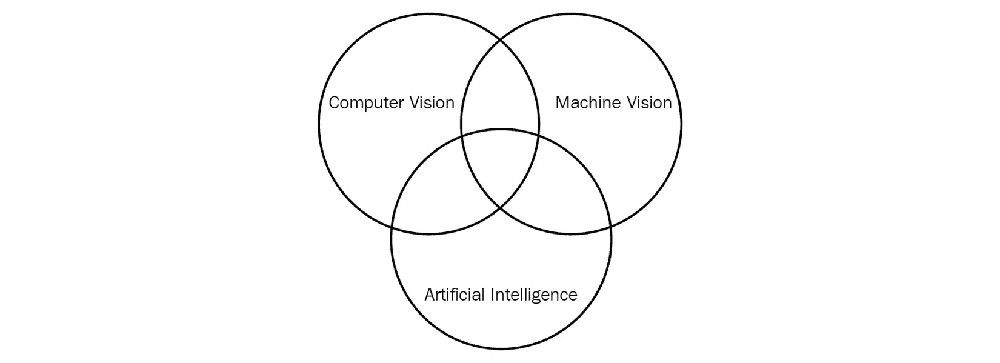

图 1.1 –不同科学领域之间的关系

为了成为计算机视觉领域的研究人员，您需要具有扎实的背景和对数学的理解。 但是，要使用 OpenCV 和 Python 3 编写用于计算机视觉的程序，您不需要了解很多数学。 请注意，在本书中，您将学习入门图像处理和计算机视觉所需的所有数学和理论概念。

计算机视觉系统的典型目标可能是以下一项或多项：

*   物体的识别，视觉检测的分类以及运动分析
*   使用图像重建场景
*   图像降噪和还原

如果您不熟悉这些关键术语，请不要感到压力。 在整个旅程中，我们将探索并实施许多这样的概念。

## OpenCV

**OpenCV**（也称为**开源计算机视觉**）是用于计算机视觉和机器学习的开源库。 它具有用于图像处理和计算机视觉的许多功能。 它是一个跨平台的库，可与许多编程语言和 OS 一起使用。 它具有大量的计算机视觉和与机器学习相关的功能。 它还具有几个**图形用户界面**（**GUI**）和事件处理功能。

OpenCV 已获得**伯克利软件发行**（**BSD**）许可，可免费用于学术和商业用途。 它是用 C++ 编程语言编写的。 它具有适用于大多数流行编程语言的接口，包括（但不限于）C/C++，Python 和 Java。 它可以在各种操作系统上运行，包括 Windows，Android，Linux，macOS 和其他类似 Unix 的操作系统。 在本书中，我们将使用 OpenCV 和 Python 3 编写与计算机视觉相关的程序。

该库具有 2500 多种针对机器学习和计算机视觉任务的优化算法。 它拥有超过 47,000 名计算机视觉专业人员的社区，并且已被下载超过 1800 万次。 OpenCV 广泛用于教学，研究组织，政府组织和各个行业领域的学术界。 诸如 Google，Yahoo，Microsoft，Intel，IBM，Sony，Honda 和 Toyota 之类的知名组织都使用 OpenCV。

让我们看一下 OpenCV 的历史。 OpenCV 最初是 Intel Research 的一项内部计划，被用来开发一个处理图像和视频的框架。 最初由 *Willow Garage* 和，然后是 *Itseez* 支持。

注意

您可以在[这个页面](http://www.willowgarage.com/)上访问 Willow Garage 的网站。

2012 年 8 月，一个独立的非营利组织 OpenCV.org 承担了进一步开发和支持 OpenCV 的责任。 它维护 OpenCV 的网站。 2016 年 5 月，英特尔收购了 Itseez。 以下 URL 具有 Intel 和 OpenCV.org 的新闻发布：

*   <https://newsroom.intel.com/editorials/intel-acquires-computer-vision-for-iot-automotive/>
*   <https://opencv.org/intel-acquires-itseez/>

这是与 OpenCV 相关的发展的简要时间表：


图 1.2 – OpenCV 的时间表

您可以在[这个页面](https://opencv.org/)上找到所有详细信息，包括不同的版本和 OpenCV 库的新闻发布。

由于我们将以 Raspberry Pi 为平台编写计算机视觉程序，因此我们将详细研究单板计算机和 Raspberry Pi。 我们将学习如何在 Raspberry Pi 单板计算机的各种型号上设置 Raspbian OS。

# 单板计算机

**单板计算机**（缩写为 **SBC**）是在单个**印刷电路板**（缩写为 **PCB**）上的完整计算机系统。 。 该板通常具有处理器，RAM，**输入/输出**（**I/O**），用于联网的以太网端口和用于接口的 USB 端口 USB 设备。 一些单板计算机也具有 Wi-Fi 和蓝牙。 SBC 运行 OS 发行版，例如 Ubuntu，Windows，Debian 等。 这些 OS 发行版具有专门用于这些 SBC 的定制版本。

与传统计算机不同，单板计算机不是模块化的，其硬件也无法升级，因为所有组件（例如 CPU，RAM，GPU 和接口端口）都集成在单个 PCB 本身上。 SBC 在学术界，研究和其他各种行业中用作低成本计算机。 SBC 在嵌入式系统中的使用非常广泛，许多个人，研究组织和公司已经开发并发布了基于 SBC 的功能齐全且可用的产品。 这些产品很多都是众筹的。 SBC 的主要优势是板载**通用输入/输出**（**GPIO**）引脚。 这些引脚提供的功能包括各种总线（**串行外围设备接口**（**SPI**），I2C 和 SMBus），数字 I/O，模拟输入和**脉宽调制**（**PWM**）输出。 尽量不要让淹没所有这些技术词汇。 在实验的帮助下，我们将更详细地学习其中的大多数概念。 几乎所有流行的 SBC 都具有某种形式的 GPIO。 由于它们的外形小巧和板载 GPIO，它们在学校，大学，培训中心，新兵训练营和制造商场所都很流行。 它们经常用于传感器网络的领域和**物联网**（**IoT**）。

总而言之，SBC 的优点如下：

*   低成本
*   小尺寸
*   低功耗
*   提供板载网络和 I/O

但是，SBC 具有其自身的缺点。 由于 SBC 的所有组件都在同一 PCB 上，如果由于机械或电气原因损坏了某个组件，可能很难修理。 出于同样的原因，我们甚至无法升级 SBC 上的任何内容。 这些是 SBC 的唯一主要缺点。

约翰 Titus 在 1976 年设计的微型计算机培训器 MMD-1 是第一台基于英特尔微处理器 C8080A 的真正的单板微型计算机。 在原型开发阶段将其称为**动态微型**，而生产单元称为 **MMD-1**（**Mini-Micro Designer 1** 的缩写）。

现在，我们将详细介绍 Raspberry Pi 系列。 但是，在此之前，我们将结识其他受欢迎的 SBC 家庭。

## Beagleboard 家族

BeagleBoard.org 基金会是位于美国的组织。 它是一个非营利性实体，其目标是围绕嵌入式系统领域的设计，开发，测试和使用开源硬件和软件提供教育和协作。 他们开发了各种以小猎犬（家犬的流行犬种）命名的单板细胞。 您可以在[这个页面](http://beagleboard.org/boards)上找到他们开发的当前 SBC 的列表，它们是正在生产的。 您也可以在同一 URL 上找到 Beagle 板的相关产品和配件。

在写作时，他们的最新产品是 [PacketBeagle](http://beagleboard.org/pocket)。

## 华硕 Tinkerboard

华硕 Tinkerboard 是由台湾华硕（ASUS）设计制造的。 其尺寸，布局和引脚与第二代和第三代 Raspberry Pi 板兼容。 您可以在[这个页面](https://www.asus.com/us/Single-Board-Computer/)上找到有关 ASUS Tinkerboard 所有版本的更多详细信息。 下图显示了华硕 Tinkerboard 的俯视图：


图 1.3 –华硕 Tinkerboard

## NVIDIA Jetson

NVIDIA Jetson 是系列模块，[用于计算机视觉，AI 和语音处理任务](https://developer.nvidia.com/embedded/develop/hardware)。 对于初学者来说，最好的成员是 Jetson Nano。 最好的起点是 [**Jetson Nano Developer Kit** 的网页](https://developer.nvidia.com/embedded/jetson-nano-developer-kit)。 这是开发者套件的侧视图：


图 1.4 – Nvidia Jetson Nano

## 英特尔主板

英特尔公司还生产许多可以称为 SBC 的板。 您可以在[这个页面](https://software.intel.com/en-us/iot/hardware/all)上找到有关当前生产的模块的详细信息。 我们拥有特权，可以使用几个出色的 Intel SBC 和模块。 其中许多产品已停产，您可以在[这个页面](https://software.intel.com/en-us/iot/hardware/discontinued)中找到它们的完整列表和支持文档。 请注意，您也许能够从英特尔获得大量二手板和停产板。 它们也非常适合学习。 对于计算机视觉的初学者，我喜欢推荐 **Intel Up Squared Kit**。 您可以在[这个页面](https://software.intel.com/en-us/iot/hardware/up-squared-ai-vision-dev-kit)中找到更多信息。

# Raspberry Pi

Raspberry Pi 是由英国 Raspberry Pi 基金会开发的一系列低成本和信用卡大小的 SBC 。 开发 Raspberry Pi 的目的是在学校中推广基本的计算机技能和编程教学，在此方面，它发挥了很好的作用。 Raspberry Pi 通过在嵌入式系统市场以及学术界和工业应用中的计算机科学研究方面赢得关注，已大大超出了其预期的用途。

Raspberry Pi Foundation 为许多流行的 OS 发行版提供下载。 我们可以在 Raspberry Pi 中使用多种编程语言，例如 Python，C，C++ 和 Java。 您可以在 [Raspberry Pi Foundation 网站](https://www.raspberrypi.org/)上找到更多信息。

## Raspberry Pi 型号

Raspberry Pi 板有多种型号。 此外，这些型号还有很多相关的附件。 您可以在 Raspberry Pi Foundation 的[产品页面](https://www.raspberrypi.org/products/)上找到生产中的当前型号列表。 不幸的是，页面上没有 Raspberry Pi 系列停产产品板上的任何信息。

此外，Raspberry Pi 还以更灵活的形式提供，适用于工业和嵌入式应用。 这被称为**计算模块**。 计算模块也有许多迭代。 基金会还提供了计算模块原型套件。 您可以在我们之前讨论的同一 Raspberry Pi 产品页面上找到有关计算模块和原型套件的更多信息。

正如我们已经讨论过的，有许多型号的 Raspberry Pi 开发板可用。 尽管很想详细讨论所有这些板的技术规格，但很难简单地实现。 在本书的第一版中，我详细讨论了所有可用的 Raspberry Pi 电路板型号的规格，因为型号数量少得多，我们可以指望它们。 自编写本书第二版以来，已有十几种 Raspberry Pi 模型。 因此，我们将只讨论 Raspberry Pi 的几种板型号的技术规格。

对于我们的计算机视觉示例，我们将使用带有标头模型的 Raspberry Pi 4B 4 GB 和 Raspberry Pi ZeroW。 但是，这些示例也可以在 Raspberry Pi 的其他主板型号上运行。 这是因为我们使用的所有软件（操作系统，编程语言和 OpenCV 库）都完全向后兼容。

### 树莓派型号 4B

您可以在[这个页面](https://www.raspberrypi.org/products/raspberry-pi-4-model-b/specifications/)上找到 Raspberry Pi 4B 的产品规格。

下表详细说明产品规格：


图 1.5 – Raspberry Pi 4B 型的产品规格列表

下图显示了 Raspberry Pi 板上的所有重要连接器和组件：

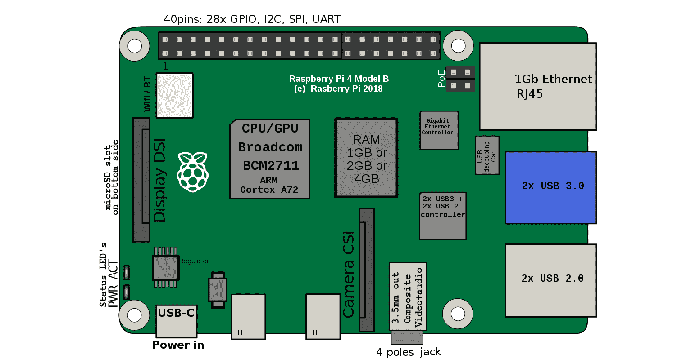

图 1.6 – Raspberry Pi 4B 顶视图

下图显示了 Raspberry Pi 4B 型的俯视图：


图 1.7 – Raspberry Pi 4B 的俯视图

这是模型的一个角度照片：


图 1.8 – Raspberry Pi 4B 倾斜

我们将使用此模型的 4GB 变体。

### Raspberry Pi 零 W

您可以在[这个页面](https://www.raspberrypi.org/products/raspberry-pi-zero-w/)找到 Raspberry Pi Zero W 的规格。

下表更详细地说明了该型号的规格：

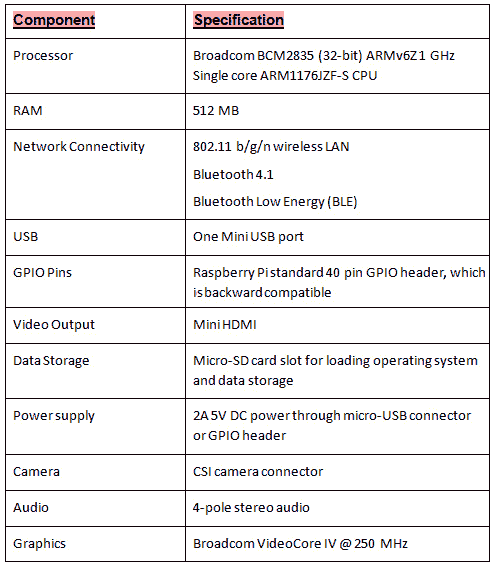

图 1.9 – Raspberry Pi Zero W 的产品规格列表

### 在哪里可以买到这些型号？

您可以在 RPi 网站的产品页面上找到在哪里购买 Raspberry Pi 板及其配件。 这是屏幕截图：


图 1.10 –购买 Raspberry Pi

您还可以在 Amazon 上找到 Raspberry Pi 板及其配件。 如果您生活在大城市，那么您会发现很多业余爱好电子产品商店都在销售 Raspberry Pi 板和相关产品。

# Raspberry Pi 的操作系统

许多操作系统都为 Raspberry Pi 板量身定制了操作系统版本。 但是，早期的主板型号不支持所有操作系统。 最新的模型板 [Raspberry Pi 4B 支持](https://www.raspberrypi.org/downloads/)提到的的所有操作系统。

Raspbian 操作系统支持 Raspberry Pi 板的所有型号，它是初学者最推荐的操作系统。 我们将在下一节中演示如何安装它。

Raspbian 是基于 Debian 的免费操作系统，它是 Linux 的流行发行版。 Raspbian 已针对 Raspberry Pi 硬件进行了优化。 您可以在[其主页](http://raspbian.org/)上找到有关 Raspbian 项目的更多信息。

注意

Raspbian 的主页提到它不隶属于 Raspberry Pi 基金会，由 Raspberry Pi 和 Debian 项目的粉丝管理。

Raspbian 网页在[这个页面](http://raspbian.org/RaspbianImages)上提供了推荐的 Raspbian 图像列表。 OS 映像是可以将写入 SD 卡的文件，然后可以使用该 SD 卡来启动 Raspberry Pi 板。 这是 RPi 入门的最简单方法。 从现在开始，我们将尝试使用它。 RPi Foundation 的下载页面上提供的图像是 Raspbian 最推荐的图像。 在下一部分中，我们将学习如何使用该图像来开始使用 RPi。

# 在 Raspberry Pi 上设置 Raspbian

设置是通常阻止许多新手爱好者开始使用 SBC 的一件事。 很多时候，这些指令是非常通用的，并未涵盖各种类型的硬件组件的所有情况。 这就是为什么我将整个部分专门介绍 RPi 上 Raspbian 的设置的原因。 在本节中，我们将详细介绍安装过的所有电路板模型的设置，计算模块除外。

我们需要以下组件进行设置：

*   任何型号的 Raspberry Pi 板。
*   如果您有 Raspberry Pi 4B 板，则需要具有 USB Type-C 引脚的 5V 3A 电源。 这是 USB Type-C 引脚的照片：

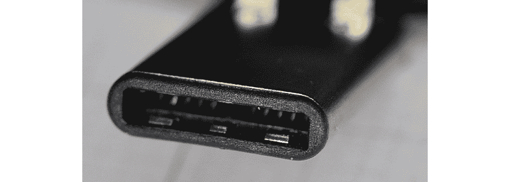

图 1.11 – USB Type-C 引脚

*   为了安全起见，您可能需要由 Raspberry Pi Foundation 购买官方的 **Raspberry Pi 15.3W USB-C 电源**。 该产品的 URL 为[这个页面](https://www.raspberrypi.org/products/type-c-power-supply/)。
*   对于其他所有 Raspberry Pi 型号，应兼容具有 Micro-USB 型引脚的 5V 2.5A 电源。 这是 Micro-USB 引脚的照片：

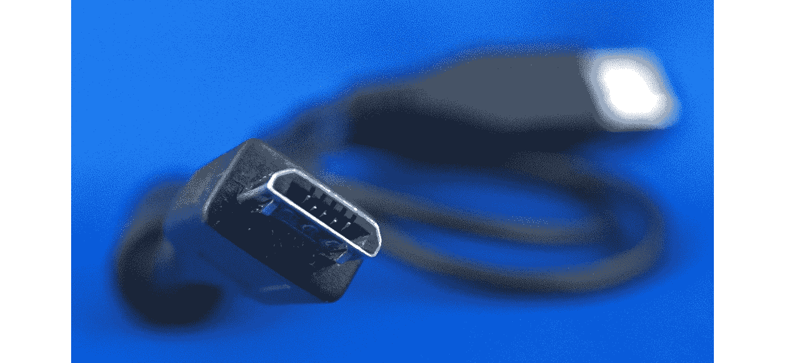

图 1.12 –微型 USB 引脚

*   您可能想为这个目的购买 [**Raspberry Pi 通用电源**](https://www.raspberrypi.org/products/raspberry-pi-universal-power-supply/)。
*   USB 键盘和鼠标：购买带有集成鼠标垫的 USB 键盘是的一个好主意，如下所示：

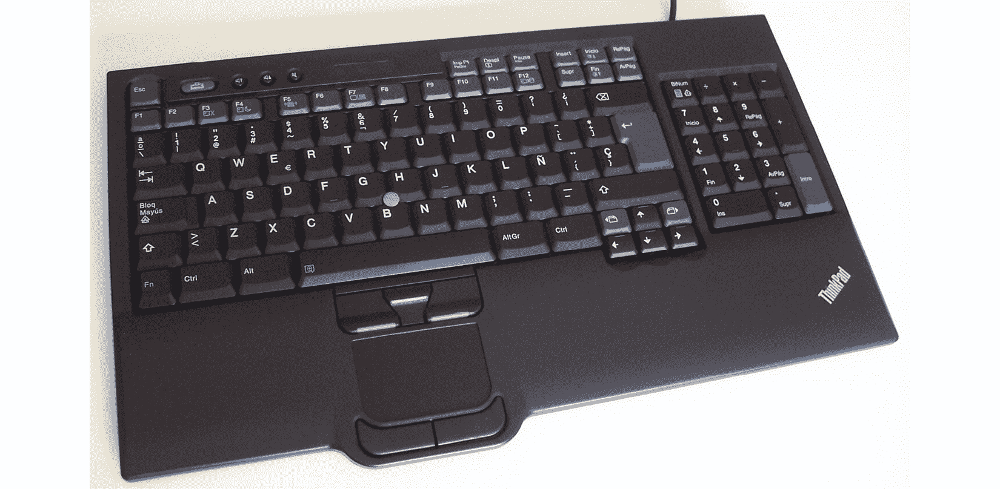

图 1.13 –带有集成鼠标垫的键盘

*   对于 RPi Zero 和 RPi Zero W，必须使用带鼠标垫的键盘，因为这些板型号仅具有到外围设备接口的一种 Micro-USB 类型的连接器。 此外，对于 RPi Zero 和 RPi Zero W，我们需要一个 USB 到 Micro-USB OTG 转换器，如下所示：


图 1.14 – USB OTG 电缆

*   任何型号的 Raspberry Pi 板均可与任何 microSD 卡配合使用。 该准则指出，我们应使用至少 16 GB 的 10 级 microSD 卡。 您可能需要访问[这个页面](https://www.raspberrypi.org/documentation/installation/sd-cards.md)获取指导，并访问[这个页面](https://elinux.org/RPi_SD_cards)获得 兼容性列表。 RPi 1 Model A 和 RPi 1 Model B 使用 SD 卡。 因此，最好使用 microSD 到 SD 卡的适配器，如下所示：

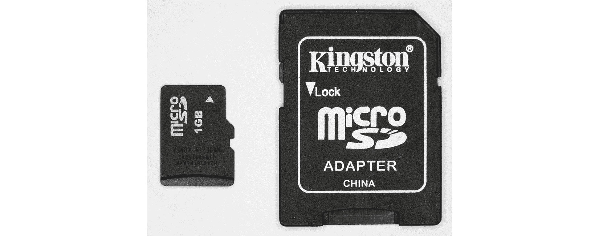

图 1.15 – MicroSD 到 SD 卡的适配器/转换器

*   用于视觉显示的 HDMI 监视器或 VGA 监视器。
*   除 RPi 4B，RPi Zero 和 RPi Zero W 外，所有 RPi 板型号均具有 HDMI 输出，并可使用 HDMI 公对公电缆直接连接到 HDMI 监视器：

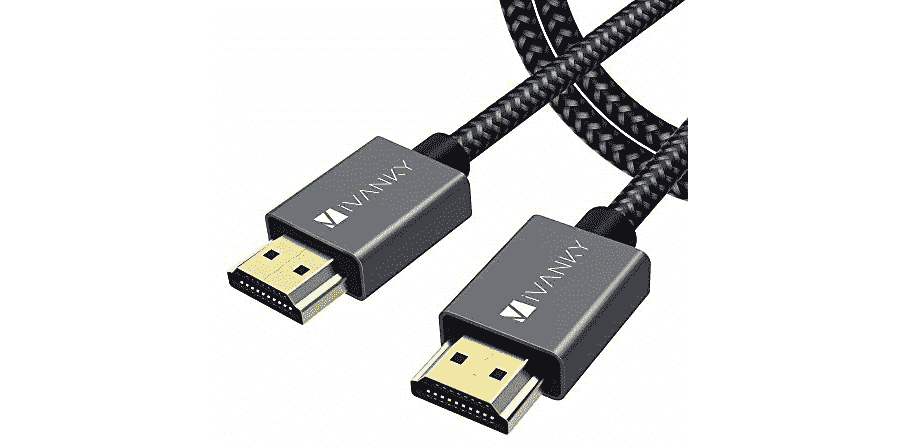

图 1.16 – HDMI 电缆

RPi 4B 具有微型 HDMI 输出。 因此，我们需要一个微型 HDMI 到 HDMI 转换器。 RPi Zero 和 RPi Zero W 都具有 mini-HDMI 输出。 因此，对于他们来说，我们需要一个 mini-HDMI 至 HDMI 转换器。 下图分别显示了 HDMI，mini-HDMI 和 micro-HDMI 端口：


图 1.17 – HDMI，mini-HDMI 和 micro-HDMI 端口

我们还需要将 mini-和 micro-HDMI 端插入 RPi 板，并将 HDMI 插入显示器。 如果您打算使用 VGA 显示器，那么根据板子型号的不同，我们将需要 HDMI / mini-HDMI / micro-HDMI 到 VGA 转换器。

这是 HDMI 到 VGA 转换器的照片：


图 1.18 – HDMI 转 VGA 转换器

以下是 mini-HDMI 到 VGA 转换器的照片：

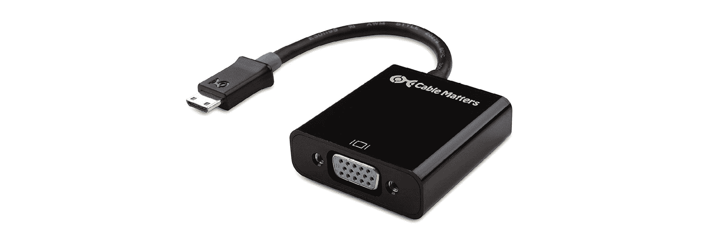

图 1.19 – Mini-HDMI 到 VGA 转换器

以下是微型 HDMI 到 VGA 转换器的照片：


图 1.20 – Micro-HDMI 转 VGA 转换器

我们需要 Windows 计算机和有线或无线 Internet 连接。

最后，我们需要一个 SD 卡读卡器，如下所示：

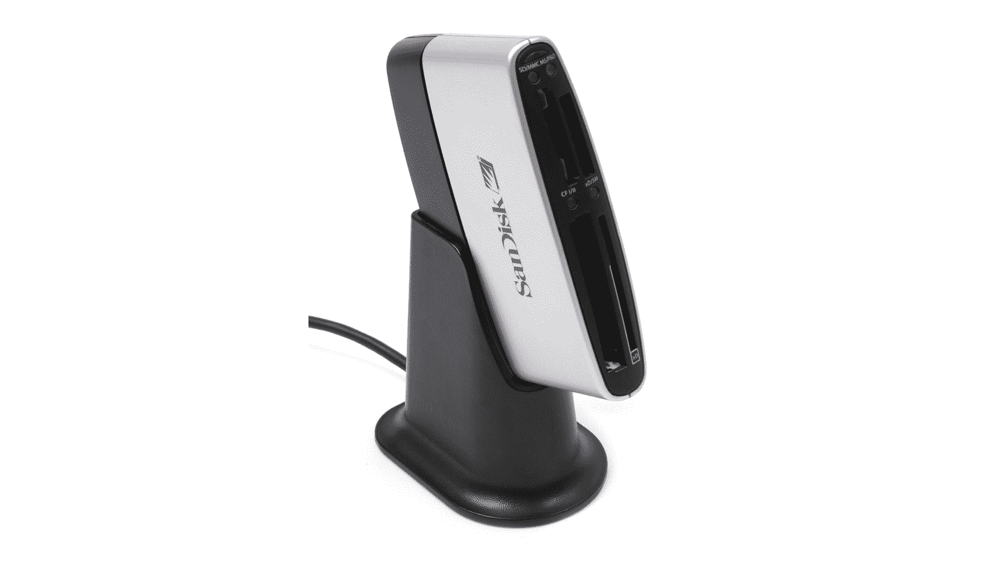

图 1.21 – SD 卡读卡器

许多笔记本电脑都内置了此功能（SD 卡读卡器）。 因此，在那种情况下，不需要单独的阅读器，因为我们可以使用内置阅读器。

在本章结束时，我们将需要更多的硬件组件。 如有需要，我们将进行讨论。 目前，我们可以继续进行。

## 下载必要的软件

首先，我们需要下载所有免费软件。 请按照以下说明下载所有必需的软件：

1.  我们需要 Raspbian OS 的最新映像文件。 可以从 Raspberry Pi Foundation 网站的[下载页面](https://www.raspberrypi.org/downloads/raspbian/)下载该文件。以下屏幕快照显示了可供下载的各种选项：

    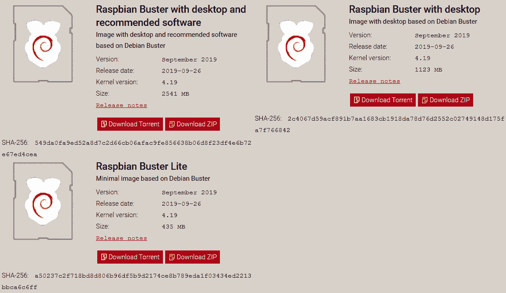

    图 1.22 – Raspbian 图像下载页面

2.  到您访问 URL 时，页面可能已经更新，但是下载选项通常将保持不变。 第一个选项是带有桌面和推荐的软件的 **Raspbian Buster**，最适合初学者。 第二个选项是带有桌面的 **Raspbian Buster**。 第三个选项是 **Raspbian Buster Lite**，它带有最低限度的软件。 在所有下载选项中，它的大小最小。
3. 我们可以直接下载 ZIP 文件，也可以下载图像的种子文件。 我建议下载种子文件。 一旦下载了**带有桌面和推荐软件的 Raspbian Buster** 的种子文件，我们可以从[这个页面](https://www.bittorrent.com/)下载种子文件。下载免费的经典版本并将其安装在 PC 上。 然后，使用 BitTorrent 打开种子文件，然后开始下载。 以下是完成下载的屏幕截图：

    

    图 1.23 – BitTorrent 应用程序窗口

4.  在屏幕底部，我们可以看到下载位置。 此外，我们可以右键单击完成的安装，然后单击“打开包含文件夹”选项，如下所示：

    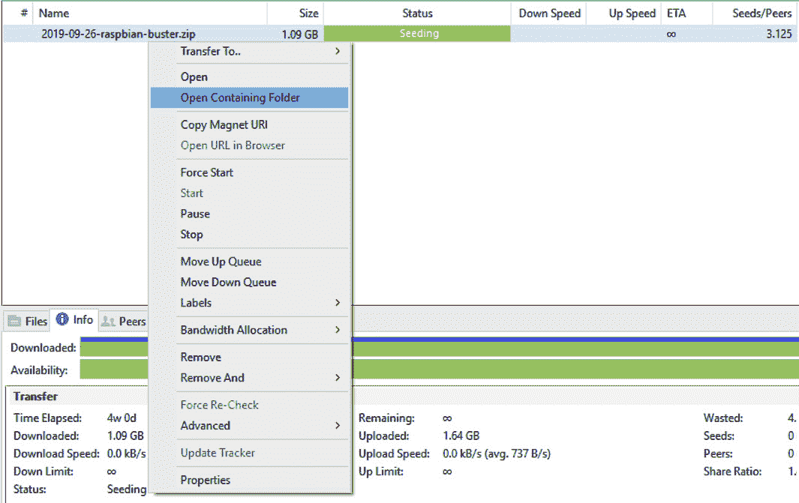

    图 1.24 –打开下载图像的位置

    这将打开包含 Raspbian OS 映像的 ZIP 文件的文件夹。

5.  我们需要用于解压缩文件的软件。 **7-Zip** 是免费的开源软件。 我们可以下载适当的可安装文件（32 位 x86 或 64 位 x64）并进行安装。 安装完成后，使用该软件打开 ZIP 文件。 以下是 7-Zip 的屏幕截图：

    

    图 1.25 – 7-Zip 应用程序窗口

    双击 ZIP 文件，然后在菜单中单击**提取**按钮。 这将提取文件。 提取的文件具有`img`扩展名。

6.  我们需要软件将此图像写入 microSD 卡，**Win32DiskImager** 是完成此任务的理想软件。 从[这个页面](http://sourceforge.net/projects/win32diskimager/files/latest/)下载。 运行安装文件并安装它。

## 手动准备 microSD 卡

在 microSD 卡的上安装 OS 的最好方法是手动进行操作。 这使我们能够手动准备 SD 卡，以便我们可以更轻松地访问`/boot/config.txt`配置文件，在某些情况下，在启动 RPi 之前必须对其进行修改。 我们将在后面详细讨论。 默认的 Raspbian 映像只有两个分区：**引导**和**系统**。 我建议至少选择一个 16 GB 的 Class 10 microSD 卡。 然后，请按照下列步骤操作：

1.  打开新的 microSD 卡的包装，然后将其插入读卡器中。 将读卡器插入 Windows 便携式计算机或计算机。 许多笔记本电脑和计算机都配有 SD 卡读卡器。 为此，请将 microSD 卡插入 microSD 至 SD 卡适配器，然后将适配器插入计算机或笔记本电脑的 SD 卡读取器的插槽。
2.  然后，新驱动器将出现在`Windows File Explorer`的左侧面板中。 右键单击驱动器，然后选择“格式”。 这是“格式”窗口的屏幕截图：

    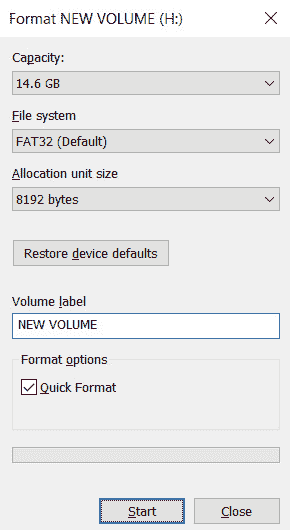

    图 1.26 –格式化 microSD 卡

3.  确保选中“快速格式化”复选框。 然后，点击“开始”按钮。 它将显示警告消息，如下所示：

    

    图 1.27 –确认对话框

4.  单击`OK`按钮以完成格式化。
5.  格式化完成后，我们需要将 Raspbian OS 映像文件写入 microSD 卡。 打开`Win32DiskImager`，然后选择 Raspbian OS 映像文件，如以下屏幕截图所示：

    

    图 1.28 – Win32 Disk Imager 应用程序窗口

6.  然后，单击“写入”按钮。 它将显示以下警告框。 只需单击“确定”按钮：

    

    图 1.29 –对话框确认将图像写入 microSD 卡

7.  将操作系统成功写入 SD 卡后，将显示以下消息框：

    

    图 1.30 –确认消息框

    这意味着图像已成功写入 microSD 卡。 现在我们可以用它来启动 RPi。

8.  现在，仅当您使用 VGA 监视器而不是 HDMI 监视器时，才需要执行此步骤。 使用 HDMI 监视器的读者可以放心地忽略此步骤。 可以使用 **Windows 文件浏览器**访问 microSD 卡的 BOOT 分区。 它具有`config.txt`文件。 双击并打开文件。 我们必须如下编辑`/boot/config.txt`文件中的设置，以在 VGA 监视器上正确显示：

    a）将`#disable_overscan = 1`更改为`disable_overscan = 1`。

    b）将`#hdmi_force_hotplug = 1`更改为`hdmi_force_hotplug = 1`。

    c）将`#hdmi_group = 1`更改为`hdmi_group = 2`。

    d）将`#hdmi_mode = 1`更改为`hdmi_mode = 16`。

    e）将`#hdmi_drive = 2`更改为`hdmi_drive = 2`。

    f）将`#config_hdmi_boost = 4`更改为`config_hdmi_boost = 4`。

    g）保存文件。

注释行（开头为`#`）被禁用。 我们必须通过取消注释来启用这些行。 这可以通过在这些注释的行的开头删除`#`来完成。

注意

如果您使用的是 Linux 或 macOS，则可以在[这个页面](https://www.raspberrypi.org/documentation/installation/installing-img/)中找到有关在这些操作系统上的 microSD 卡上安装 Raspbian 操作系统的说明。 ]。

## 首次启动 Raspberry Pi

让我们使用以下步骤通过 microSD 卡首次启动的 Pi：

1.  将 microSD 卡插入 Pi 的 microSD 卡插槽中。 RPi 1 Model A 和 RPi 1 Model B 没有 SD 卡插槽。 因此，对于这些主板型号，我们必须使用 microSD 到 SD 卡的转换器。
2.  将 Pi 连接到 HDMI 监视器。 如前所述，如果您有 VGA 监视器，请使用 HDMI / mini-HDMI / micro-HDMI 至 VGA 转换器连接它。
3.  连接 USB 鼠标和 USB 键盘。 建议您使用带鼠标垫的单个键盘。 对于 RPi Zero 和 RPi Zero W，您需要先将其连接到 USB OTG 电缆，然后再将 USB OTG 电缆连接到板上。
4.  将 RPi 板连接到适当的电源。 将显示器连接到电源。 我们需要确保此时关闭电源。
5.  确保一次验证所有连接。 然后，打开显示器的电源。 最后，打开 RPi 的电源。

现在，我们的 RPi 板将开始启动。 板上的绿色 LED 将开始闪烁。 恭喜你！ RPi 板是第一次启动。

注意

如果您的 HDMI 监视器没有显示信号，请关闭 RPi 的电源，然后将 microSD 卡`/boot/config.txt`中的`#hdmi_force_hotplug = 1`更改为`hdmi_force_hotplug = 1`。使用此更改的设置启动 RPi，HDMI 监视器将显示该信号。

RPi 启动后，将显示 Raspbian 桌面和引导式设置窗口，如下所示：

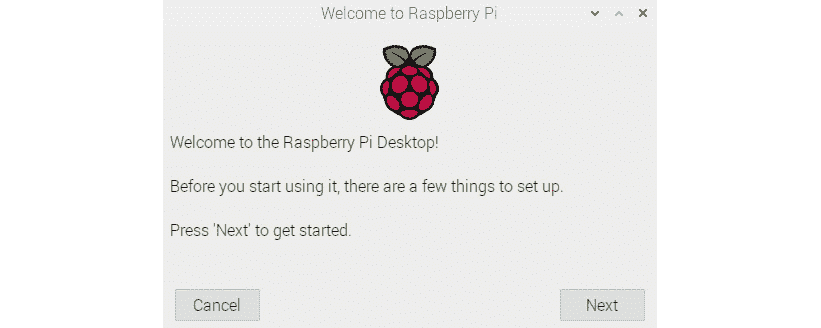

图 1.31 – Raspbian 上的 Welcome 窗口

单击**下一个**按钮，然后将显示以下窗口：

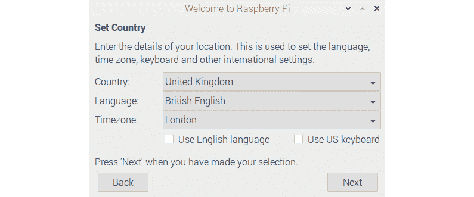

图 1.32 –设置国家/地区的窗口

在上一个窗口中，设置**国家/地区**和**语言**。 它将根据您选择的国家自动选择时区。 如果愿意，您也可以更改它。 单击**下一个**按钮，将出现以下窗口：


图 1.33 –设置新密码的窗口

您可以选择为默认的`pi`用户设置新密码。 如果将其保留为空白，则它将保留默认密码。 以下是出现的下一个窗口：


图 1.34 –设置屏幕的窗口

如果桌面视图的边缘上有黑色边框，请选中该复选框。 Raspbian 操作系统将在下次启动时对其进行纠正。 单击**下一个**按钮后，将出现以下窗口，但仅在板型号具有 Wi-Fi 的情况下：


图 1.35 – Wi-Fi 连接

选择您知道凭据的网络，然后单击 **Next** 按钮。 将出现以下窗口：


图 1.36 –在家里连接到 Wi-Fi

在此处输入您的 Wi-Fi 密码，然后在上单击**下一个**按钮。 将出现以下窗口：

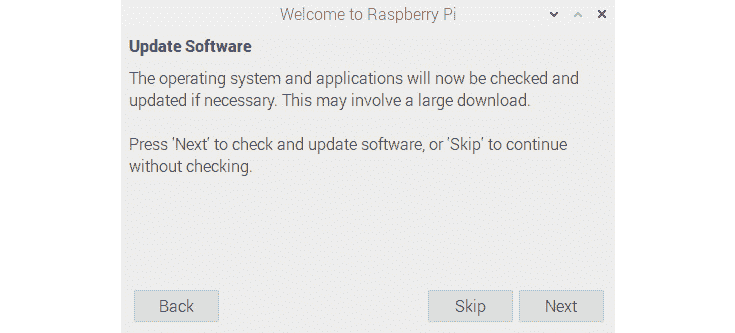

图 1.37 –更新软件

我们可以在此处更新 Raspbian 操作系统和已安装的软件。 我们将在本章的后半部分学习如何手动进行操作。 单击**跳过**或**下一个**按钮，将出现以下窗口：


图 1.38 –完成初始设置的确认

我们已经完成了大部分设置。 现在，在我们重新启动 RPi 之前，还有一些事情要做，因此请单击**下一个**按钮。

现在，在桌面的左上角，您应该看到一个 Raspberry 图标。 它是 Raspbian 的菜单，其功能类似于 Microsoft Windows 上的 Windows 徽标。 单击徽标，然后导航到**首选项 | Raspberry Pi 配置**：


图 1.39 – Raspbian 菜单中的 Raspberry Pi 配置

这是 **Raspberry Pi 配置**工具。 它将打开一个窗口，如下所示，我们可以更改 Raspberry Pi 板的设置：


图 1.40 –配置系统

前面的屏幕截图是**系统**选项卡。 截至目前，这里无需更改任何内容。 以下是**接口**选项卡：


图 1.41 –配置接口

启用摄像机，SSH 和 VNC。 以下是**性能**标签：

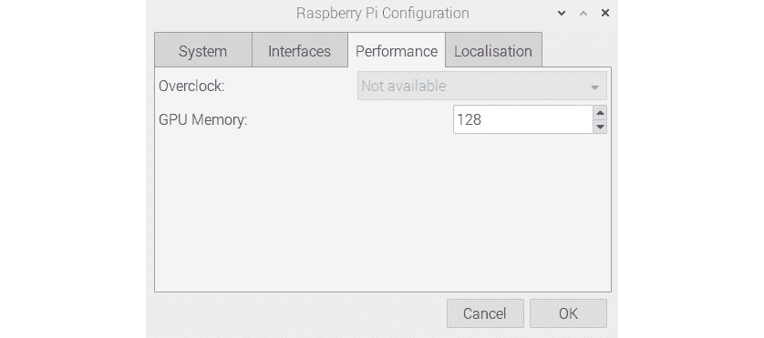

图 1.42 –内存和超频选项

此菜单有用于超频和 GPU 内存的选项。 对于 RPi 4B，禁用超频。 在下一章中，我们将学习如何对 RPi 4B 板进行超频。 **本地化**标签如下：


图 1.43-位置选项

您可能要根据居住地区更改这些设置。

一旦根据我们的选择更改了所有这些设置，我们就可以通过单击`Raspbian`菜单中的**关闭**按钮来重新启动 RPi 板：


图 1.44 –重新启动 Pi

在这里，我们找到选项来重新启动 RPi。 重新启动后，如果我们选择保留默认用户`pi`的原始密码，则在启动时将出现以下警告消息窗口：

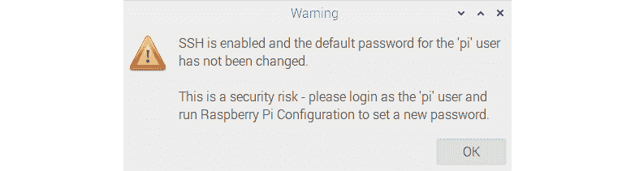

图 1.45 –如果未更改默认密码，则重启后的消息

只要我们选择保留默认密码，该密码就会在每次启动后继续出现。

## 将各种 RPi 板型号连接到互联网

我们可以将以太网电缆直接插入 RJ45 以太网端口 Pi 板。 这将自动检测连接并且连接到互联网。

注意

确保在 Wi-Fi 路由器，管理型交换机或 Internet 网关上启用了 **DHCP**（**动态主机配置协议**）。

PRi 1 A，PRi 1 A +，RPi 零，RPi 零 W 和 RPi 3 A +没有以太网端口。 但是，RPi Zero W 和 RPi 3 A +具有内置的 Wi-Fi。 对于其余型号，我们可以使用 USB Wi-Fi 加密狗：

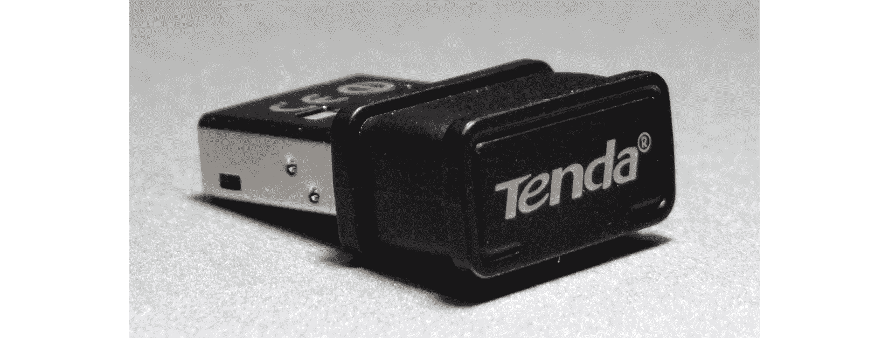

图 1.46 – USB Wi-Fi 适配器

将此 Wi-Fi 适配器插入 USB 端口。 如果 USB 端口不够，请使用有源 USB 集线器。 对于 Raspberry Pi Zero，我们需要使用其他 USB OTG 电缆，如前所述。

插入 USB Wi-Fi 适配器后，我们需要打开`lxterminal`。 这是命令行实用程序。 我们可以在 Raspbian 的任务栏中以及 Raspbian 菜单中的`Accessories`下找到一个黑色的小图标。 单击后，将出现以下窗口：

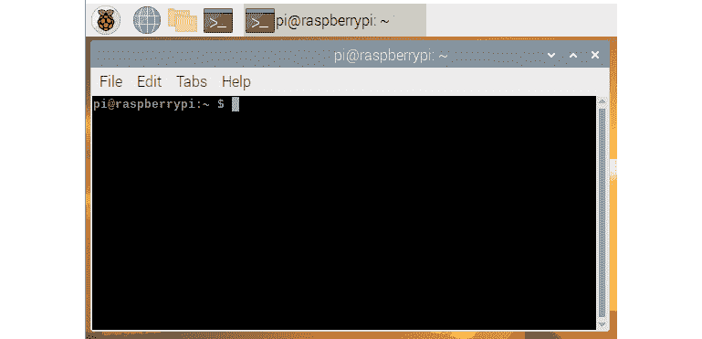

图 1.47 – Raspberry Pi LXterminal 窗口

我们可以在此处输入 Linux 命令。 输入它们后，按`Enter`执行命令。 我们已经打开了它，以便我们可以手动配置 Raspbian 的网络接口。 这很容易。 所有与网络有关的信息都存储在`/etc/network/interfaces`文件中。 要在插入 USB Wi-Fi 加密狗之后连接到 Wi-Fi，我们需要向该文件添加一些条目。 首先，通过执行以下命令来备份原始文件：

```py
mv /etc/network/interfaces /etc/network/interfaces.bkp
```

然后，我们可以通过运行以下命令从头创建**接口**文件：

```py
sudo nano /etc/network/interfaces
```

前面的命令将使用称为`nano`的纯文本编辑器打开网络接口的文件。 这是一个简单的所见即所得编辑器。 在此处输入以下行：

```py
source-directory /etc/network/interfaces.d
auto lo
iface lo inet loopback
auto wlan0
allow-hotplug wlan0
iface wlan0 inet dhcp
wpa-ssid "AshwinIon"
wpa-psk "internet1"
```

输入行后，按`Ctrl`+`X`，然后按`Y`。 在上述设置中，用您自己的 SSID 替换`AshwinIon`，并用密码替换`internet1`。 然后，在命令提示符下运行以下命令：

```py
sudo service networking restart
```

这将重新启动网络服务并连接到 Wi-Fi。 在任何情况下（以太网或 Wi-Fi），RPi 均分配有唯一的 IP 地址。 我们可以通过在`lxterminal`上运行`ifconfig`命令找到它。 命令的输出将在`inet`下列出 Ipv4 地址。

知道 RPi 的 IP 地址的另一种方法是检查 RPi 板连接到的路由器或受管交换机中的活动客户端表。 以下是路由器的活动客户端表的屏幕截图，我们可以在其中看到 RPi 的条目：


图 1.48 –家庭 Wi-Fi 路由器的活动客户端表

# 更新 RPi

**高级软件包工具**（**APT**）是 Debian，Ubuntu，Raspbian 及其衍生版本中的软件包管理实用程序。 APT 用于安装，升级和删除软件。 我们将学习如何使用它来更新 RPi 板上的操作系统和软件。

运行以下命令：

```py
sudo apt-get update
```

此命令从在线软件源存储库中同步软件包列表。 所有软件包的索引都会刷新。 这会将应用程序的所有存储库更新为所有最新更新列表。 在执行**升级**命令之前，必须先执行此命令。

然后，运行以下命令：

```py
sudo apt-get dist-upgrade –fix-missing -y
```

这将下载并安装所有软件包。 它还会删除过时的软件包。 根据互联网的速度，它需要一些时间。 最后，通过运行以下命令来更新固件：

```py
sudo rpi-update
```

这将更新固件。 此后，RPi 板将在所有方面保持最新。

最后，我们可以运行以下命令关闭 RPi：

```py
sudo shutdown -h now
```

然后以下命令重新启动它：

```py
sudo reboot
```

这将更新固件。 此后，RPi 板将在所有方面保持最新。

# 摘要

在本章中，我们学习了重要术语，例如计算机视觉，OpenCV，SBC 和 Raspberry Pi。 我们学习了如何在 Raspberry Pi 上设置 Raspbian 操作系统以及如何配置 Pi 来访问 Internet。 我们还学习了如何更新 Pi。

完成本章后，您可以继续在 Raspberry Pi 上设置 Raspbian OS。 此外，您可以使用 Wi-Fi 或以太网将 RPi 板连接到 Internet。 这将使您为即将到来的计算机视觉冒险做好准备。

在下一章中，您将学习如何远程访问 RPi，如何对其进行超频以及如何在 RPi 上安装适用于 Python 3 的 OpenCV 4。