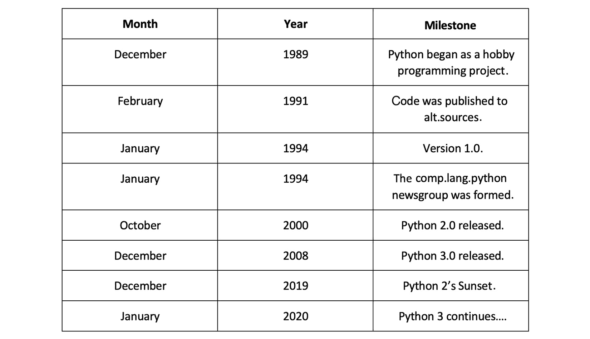
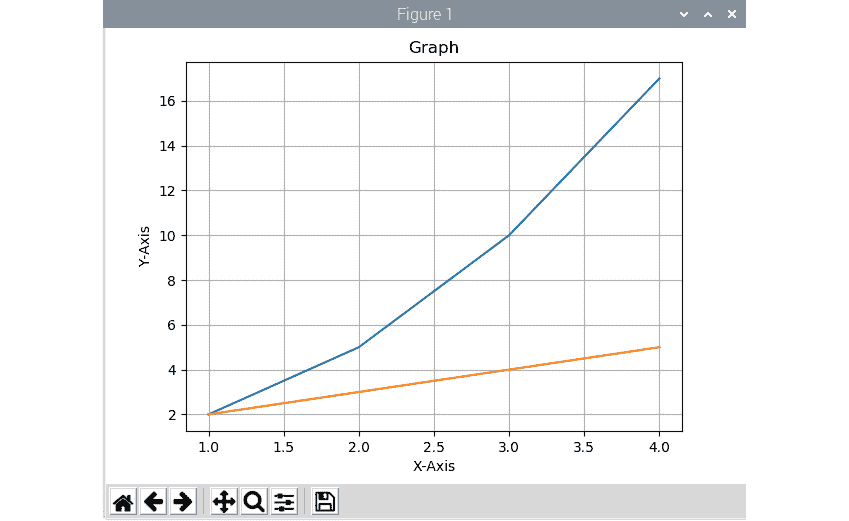
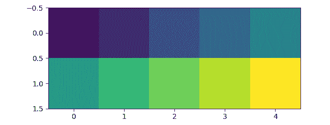
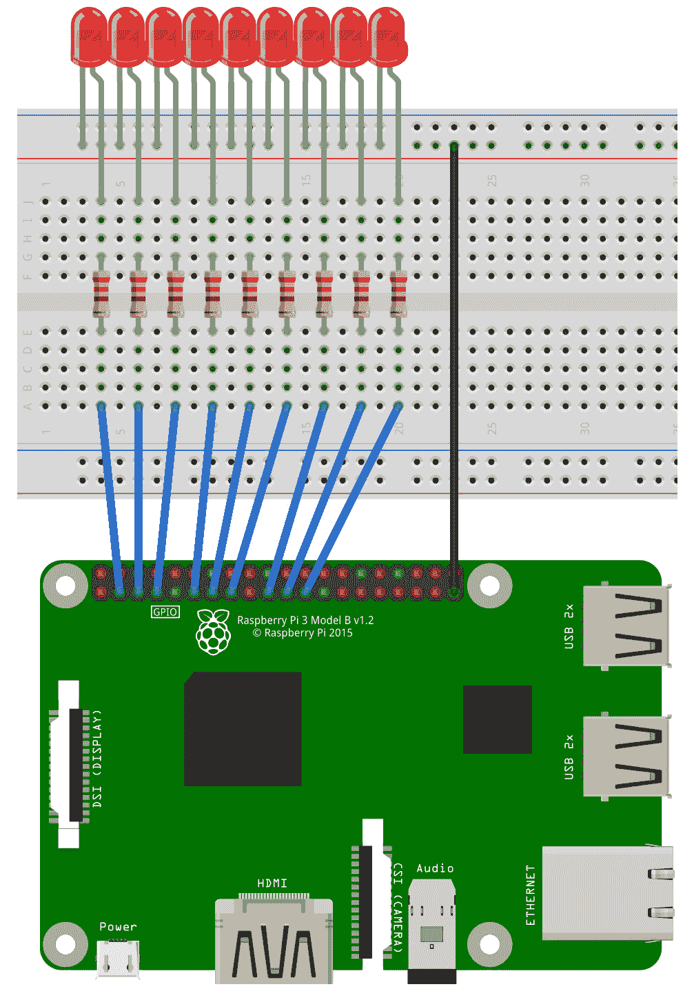
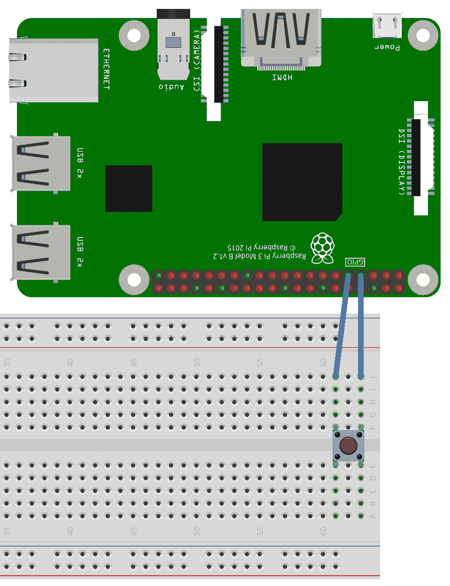
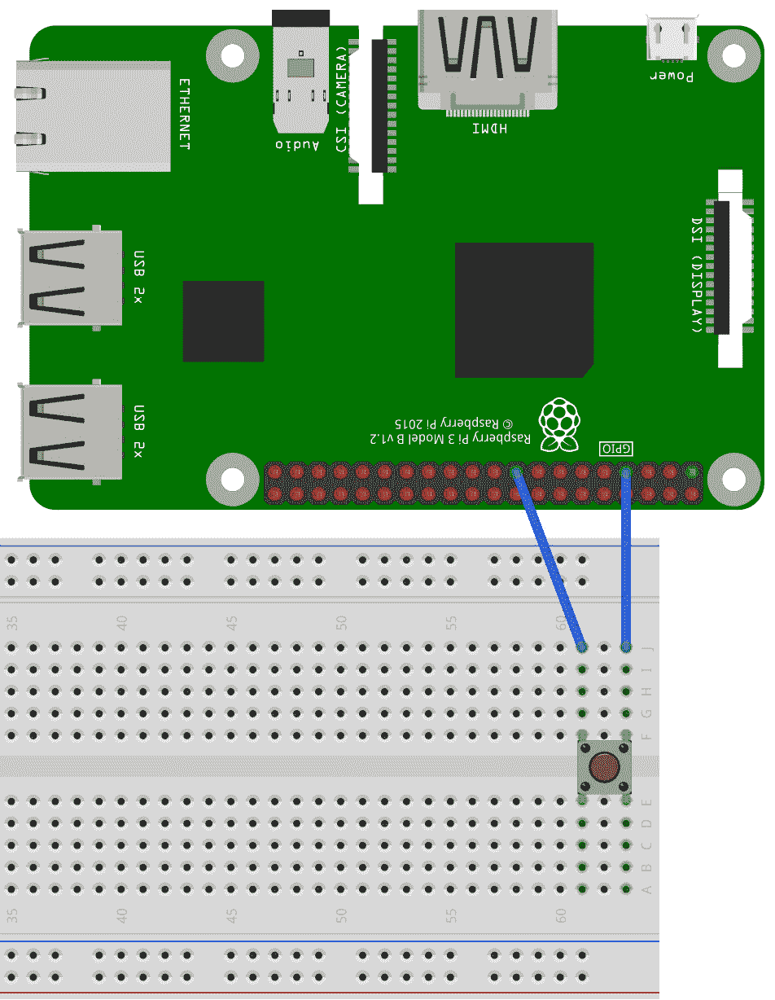
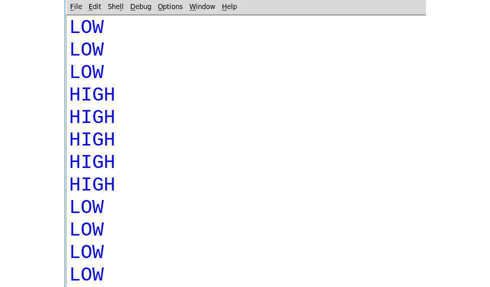

# 三、Python 编程简介

在上一章中，我们学习了如何远程访问 **Raspberry Pi**（RPi）板的命令提示符和桌面。 我们还安装了适用于 Python 3 的 OpenCV。最后，我们学习了如何对 RPi 超频并检查了 RPi 的各种散热器。

从本章上一章的结尾处继续，在本章中，我们将从研究 RPi 上的 Python 3 编程开始。 我们将简要介绍**科学 Python**（**SciPy**）生态系统及其中的所有库。 然后，我们将编写使用 NumPy **N 维数组**（`ndarray`）进行数值计算的基本程序。 我们还将学习如何使用 Matplotlib 可视化数据。 最后，我们将使用针对 RPi 的 Python **通用输入输出**（**GPIO**）库来探索 RPi 的硬件​​方面。

简而言之，我们将涵盖以下主题：

*   了解 Python 3
*   SciPy 生态系统
*   用 NumPy 和 Matplotlib 编程
*   RPi GPIO 编程

# 技术要求

可以在 [GitHub](https://github.com/PacktPublishing/raspberry-pi-computer-vision-programming/tree/master/Chapter03/programs) 上找到本章的代码文件。

观看以下视频，以查看[这个页面](https://bit.ly/37UVwmO)上的“正在执行的代码”。

# 了解 Python 3

Python 是一种高级的解释型通用编程语言。 它是由 Guido van Rossum 创建的，最初是一个个人爱好项目，但此后逐渐发展为今天的样子。 以下是 Python 编程语言开发中主要里程碑的时间表：



图 3.1 – Python 开发里程碑时间表

Guido van Rossum 在 Python 项目的整个生命周期中都获得了**仁慈的独裁者头衔**。 他于 2018 年 7 月卸任，自此成为 **Python 指导委员会**的成员。

您可以在其主页 [www.python.org](http://www.python.org) 上阅读有关 Python 的更多信息。

Python 编程语言有两个主要版本-Python 2 和 Python3。它们彼此之间大多不兼容。 如前面的时间线所示，Python 2 的日落发生在 2019 年 12 月 31 日。这意味着 Python 2 不再进一步开发。官方支持也不再存在。 正在进行积极开发并得到持续支持的唯一 Python 版本是 Python3。许多组织正在生产的许多代码（实际上是数十亿行代码）仍在 Python 2 中。因此，从 Python 2 移植到 Python 3 需要付出很大的努力。

## RPi 和 Raspberry Pi OS 上的 Python

在我们下载的 Raspberry Pi OS 映像上预装了 Python。 Raspberry Pi OS 映像随附 Python 的版本（Python 2 和 Python 3）。 我们将以的形式详细介绍 Python 3，并使用 Python 3 编写所有程序。

打开`lxterminal`或远程登录 RPi 并运行以下命令：

```py
python -V
```

这将产生以下输出：

```py
Python 2.7.16
```

`-V`选项返回 Python 解释器的版本。 因此，`python`命令引用 Python 2 解释器。 但是，我们需要 Python3。因此，请在命令提示符中运行以下命令：

```py
Python3 -V
```

这将产生以下输出：

```py
Python 3.7.3
```

这是 Python 3 解释器，在本书中的所有编程练习中都将使用它。 要在光盘上找到解释器的位置（在我们的情况下为我们的 microSD 卡），请运行以下命令：

```py
which python3
```

这将产生以下输出：

```py
/usr/bin/python3
```

这是 Python 3 解释器的可执行文件所在的位置。

## Raspberry Pi OS 上的 Python 3 IDE

在开始使用 Python 3 编程之前，我们将学习哪些**集成开发环境**（**IDE**）可用于用 Python 编写程序。 到目前为止，Raspberry Pi OS 带有两个 IDE。 可以通过 Raspbian 菜单中的**编程**选项访问，如下所示：


图 3.2 – Raspbian 菜单中的 Thonny 和 Geany Python IDE

第一个选项是 **Geany** IDE，它可以与许多编程和标记语言一起使用，包括 Python 2 和 Python 3。 。 的第二个选项是 **Thonny Python IDE**，它支持 Python 3 和 MicroPython 变体。

我个人更喜欢使用**集成开发和学习环境**（**IDLE**），它是由 Python 基金会开发和维护的。 您可以在[这个页面](https://docs.python.org/3/library/idle.html)上阅读有关它的更多信息。 较早版本的 Raspberry Pi OS 曾经带有 IDLE。 但是，它在最新版本的 Raspberry Pi OS 中不再存在。 相反，我们有 Geany 和 Thonny。 但是，我们可以使用以下命令下载 IDLE：

```py
sudo apt-get install idle3 -y
```

安装完成后，我们可以在 Raspbian 菜单下的**编程**菜单选项中找到它，如以下屏幕截图所示：


图 3.3 – Python 3 的 IDLE 选项

单击它以将其打开。 或者，我们可以使用以下命令从命令提示符启动它：

```py
idle
```

请注意，如果在命令调用 GUI 时我们已远程连接到 RPi 的命令提示符（使用 SSH 客户端，例如 PuTTY 或 Bitvise），则此命令将不起作用，并且会引发错误。 如果将视觉显示器直接连接到 RPi 或我们远程访问 RPi 桌面，则它将起作用。 这将调用一个新窗口，如下所示：


图 3.4 – IDLE 中的 Python 3 交互模式

这是 Python 3 解释器提示符或 Python 3 shell。 我们将在本章后面详细讨论这个概念。

现在，转到顶部菜单中的**文件 | 新文件**。 这将打开一个新的代码编辑器窗口，如下所示：


图 3.5 –一个新的空白 Python 程序

发生这种情况时，解释器窗口也将保持打开状态。 您可以关闭或将其最小化。 如果由于字体大小而导致难以在 IDLE 的解释器或代码编辑器中阅读文本，则可以转到**选项 | 从菜单配置 IDLE** 以设置文本的字体和大小。 配置窗口如下所示：


图 3.6 – IDLE 配置

让我们写一个习惯的 **HelloWorld 程序**。 在窗口中输入以下文本：

```py
print('Hello World!')
```

然后，从菜单中单击**运行模块**。 它将要求您保存它。 单击`OK`按钮，它将带您到**保存**对话框。 我更喜欢按章节将本书的代码保存在目录中，每个章节都有子目录。 您可以通过在`pi`用户的主目录中运行以下命令，通过创建目录结构：

```py
mkdir book
mkdir book/dataset
mkdir book/chapter01
```

我们可以像这样为每个章节创建一个单独的目录。 另外，需要一个单独的**数据集**目录来存储我们的数据。 创建指定的目录结构后，运行以下命令序列：

```py
cd book
tree
```

我们可以在`tree`命令的以下输出中看到目录结构：


图 3.7 –用于保存该书程序的目录结构

我们可以使用 IDLE 的**保存**对话框或 Raspberry Pi OS 的**文件管理器**应用程序来创建相同的目录结构。

创建与当前章节对应的目录后，将文件另存为`prog00.py`。 您只需要输入文件名即可； IDLE 将自动为文件分配`.py`扩展名。 然后，该文件将由 Python 3 解释器执行，并且输出将在解释器外壳中可见，如下所示：


图 3.8 –在 IDLE 中执行 Python 3 程序

我们也可以使用`nano`编辑器编写相同的代码。 唯一的区别是，保存时我们还需要提供扩展名。 我们可以导航到具有`prog00.py`文件的目录，然后运行以下命令将该文件提供给 Python 3 解释器：

```py
python3 prog00.py
```

Python 3 解释器将执行程序并打印输出，如下所示：


图 3.9 –在 LXTerminal 中执行 Python 3 程序

## 以交互模式使用 Python 3

我们已经看到如何使用 IDLE 和 Nano 编辑器编写 Python 3 程序。 我们还看到了如何使用 IDLE 和 Raspberry Pi OS 的命令提示符启动程序。 以这种方式运行 Python 3 程序称为脚本模式。

还有另一种模式-交互模式。 在交互模式下，我们启动 Python 解释器，它充当命令行解释器。 当我们输入并运行一条语句时，我们会立即得到口译员的反馈。 我们可以通过两种方式启动交互模式。 我们已经看到了第一种方法。 当我们启动 IDLE 时，它将打开解释器，我们可以使用它来运行 Python 3 语句。 另一种方法是在命令提示符中运行`python3`命令。 这将在命令提示符中调用 Python 3 解释器，如下所示：


图 3.10 –命令提示符下处于交互模式的 Python 3

在提示符下键入以下语句：

```py
>>> print('Hello World!')
```

然后，按`Enter`。 将执行，输出将显示在下一行。 这样，我们可以像这样执行单行语句和小的代码段。 本章将广泛使用交互模式。 从下一章开始，我们将使用脚本模式-也就是说，我们将程序保存在文件中，并从命令提示符或 IDLE 中启动它们。

## Python 3 编程的基础

让我们从开始学习 Python 3 编程的基础。 打开 Python 3 交互式提示。 输入以下语句：

```py
>>> pi = 3.14
>>> print(pi)
```

这将显示`pi`变量的值。 运行以下语句：

```py
>>> print(type(3.14))
```

显示以下输出：

```py
<class 'float'>
```

您可能已经注意到我们没有在此处声明变量的数据类型。 这是因为 Python 是一种**动态类型化的**编程语言。 我们还说该变量属于类类型。 这意味着它是一个对象，对于 Python 中的所有变量和其他构造均适用。 一切都是 Python 中的对象。 这使 Python 成为真正的面向对象的编程语言。 几乎所有东西都有属性和方法。

为了退出命令提示符，请按`Ctrl`+`D`或运行`exit()`语句。

让我们创建自己的类和该类的对象。 保存文件并将其命名为`prog01.py`，然后向其中添加以下代码：

```py
class Person:
    def __init__(self, name='', age=0):
        self.name = name
        self.age = age
    def show(self):
        print(self.name)
        print(self.age)
```

在前面的代码中，我们定义了`Person.__init__()`类是初始化函数，每当创建`Person`类的对象时，就会自动调用它。 `self`参数是对类的当前实例的引用，用于访问类定义内属于该类的变量。

让我们向`prog01.py`添加更多代码。 我们将创建一个类对象，如下所示：

```py
p1 = Person('Ashwin', 25)
p1.show()
```

我们创建了`p1`类，然后使用`show()`函数调用显示了对象的属性。 在这里，我们在创建类对象时将值分配给类成员变量。

让我们看看另一种创建对象并将值分配给成员变量的方法。 将以下代码添加到文件中：

```py
p2 = Person()
p2.name = 'Jane'
p2.age = 20
print(p2.name)
print(p2.age)
```

在前面的代码中，我们正在创建一个对象，并使用默认参数调用初始化函数。 然后，我们将这些值分配给类变量，并使用类对象直接访问它们。 运行程序并查看输出。

现在，打开 Python 3 解释器并运行以下语句：

```py
>>> import sys
>>> print(sys.platform)
```

这将返回当前操作系统（Linux）的名称。 第一条语句导入`sys`，这是一个 Python 标准库。 它随附在 Python 解释器中。 这意味着 Python 解释器带有大量的有用库。`sys.platform`返回当前操作系统名称字符串。

让我们尝试另一个示例。 在上一章中，我们安装了 OpenCV 库。 让我们现在再次导入。 我们已经从 Raspberry Pi OS 命令提示符直接对其进行了测试。 让我们尝试在交互模式下执行相同的操作：

```py
>>> import cv2
>>> print(cv2.__version__)
```

第一条语句将 OpenCV 库导入当前会话。 第二条语句返回一个字符串，其中包含已安装的 OpenCV 库的版本号。

Python 3 编程的基础知识涉及很多主题，但是很难涵盖所有主题。 此外，这样做超出了本书的范围。 但是，我们将使用本书中经常学习的主题。

在下一部分中，我们将探索 SciPy 生态系统库。

# SciPy 生态系统

SciPy 生态系统是库的集合，用于编程科学，数学和工程功能。 它具有以下库作为核心组件：

*   NumPy
*   SciPy
*   Matplotlib
*   IPython
*   SymPy
*   Pandas

在本书中，我们将使用除 SymPy 和 pandas 之外的所有库。 在本节中，我们将介绍 NumPy 和 Matplotlib 库。 在本书的后续章节中，我们将学习其他两个库的有用方面。

## NumPy 的基础

NumPy 是一个基本软件包，可用于使用 Python 进行数值计算。 它是线性代数的矩阵库。 NumPy `ndarray`也可以用作作为通用数据的有效多维容器。 也可以定义和使用任意数据类型。 NumPy 是 Python 编程语言的扩展。 它增加了对大型多维数组和矩阵的支持，以及可用于对这些数组进行操作的大型高级数学函数库。 在本书中，我们将使用 NumPy 数组表示图像并执行复杂的数学运算。 NumPy 带有许多用于所有这些操作的内置函数。 因此，我们不必担心基本的阵列操作。 我们可以直接关注计算机视觉的概念和代码。 所有 OpenCV 数组结构都与 NumPy 数组相互转换。 因此，无论您在 NumPy 中执行什么操作，都可以始终将 NumPy 与 OpenCV 结合使用。

本书中，我们将在 OpenCV 中大量使用 NumPy。 让我们从一些简单的示例程序开始，它们将演示 NumPy 的真正功能。

NumPy 已预装在 Raspberry Pi OS 上。 因此，我们不必单独安装它。

打开 Python 3 解释器，然后尝试以下示例。

### `ndarray`的创建

让我们来看看关于`ndarray`创建的一些示例。 本书经常使用`array()`方法。 有很多方法可以创建不同类型的数组。 在本书的中，我们将在需要时探讨这些方法。 请遵循以下命令来创建`ndarray`：

```py
>>> import numpy as np
>>> x=np.array([1,2,3])
>>> x
array([1, 2, 3])
>>> y=arange(10)
>>> y=np.arange(10)
>>> y
array([0, 1, 2, 3, 4, 5, 6, 7, 8, 9])
```

### `ndarray`的基本操作

现在将学习`linspace()`函数。 它采用三个参数-`start_num`，`end_num`和`count`。 这将创建一个具有等距点的数组，该数组从`start_num`开始，以`end_num`结尾。 您可以尝试以下示例：

```py
>>> y=np.arange(10)
>>> y
array([0, 1, 2, 3, 4, 5, 6, 7, 8, 9])
>>> a=np.array([1,3,6,9])
>>> a
array([1, 3, 6, 9])
>>> b=np.linspace(0,15,4)
>>> b
array([ 0.,  5., 10., 15.])
>>> c = a - b
>>> c
array([ 1., -2., -4., -6.])
```

以下是可以用来计算数组中每个元素的平方的代码：

```py
>>> a**2
array([ 1,  9, 36, 81], dtype=int32)
```

### 使用`ndarray`的线性代数

让我们探索一些与线性代数有关的示例。 您将学习如何使用`transpose()`，`inv()`，`solve()`和`dot()`函数， 在执行与线性代数有关的运算时很有用：

```py
>>> a = np.array([[1,2,3],[4,5,6],[7,8,9]])
>>> a.transpose()
array([[1, 4, 7],
       [2, 5, 8],
       [3, 6, 9]])
>>> np.linalg.inv(a)
array([[-4.50359963e+15,  9.00719925e+15, -4.50359963e+15],
       [ 9.00719925e+15, -1.80143985e+16,  9.00719925e+15],
       [-4.50359963e+15,  9.00719925e+15, -4.50359963e+15]])
>>> b = np.array([3, 2, 1])
>>> np.linalg.solve(a, b)
array([-9.66666667, 15.33333333, -6\.        ])
>>> c = np.random.rand(3, 3)
>>> c
array([[0.91827923, 0.75063499, 0.40049332],
       [0.09520566, 0.16718726, 0.6577751 ],
       [0.95343917, 0.50972786, 0.65649385]])
>>> np.dot(a, c)
array([[ 3.96900804,  2.61419309,  3.68552507],
       [ 9.86978019,  6.89684344,  8.82981189],
       [15.77055234, 11.17949379, 13.9740987 ]])
```

注意：

您可以在[这里](http://www.numpy.org)更详细地研究 NumPy。

## Matplotlib

Matplotlib 是一个用于 Python 的绘图库，它生成发布质量的图形。 它可以产生各种类型的可视化效果，例如绘图，三维可视化效果和图像。 了解 Matplotlib 的基础知识以与任何计算机视觉库（例如 OpenCV）一起使用非常重要。

Matplotlib 由 John D. Hunter 开发，并且由开源社区不断开发。 它是 SciPy 生态系统的组成部分。 SciPy 生态系统中的所有其他库都使用 Matplotlib 进行数据可视化。 `pyplot`是 Matplotlib 中的一个模块，它提供了类似于 MATLAB 的界面来可视化数据。

在开始使用 Matplotlib 进行编程之前，我们需要先安装它，因为它尚未预先安装在 Raspberry Pi OS 上。

我们可以使用`pip3`实用程序进行安装。 我们已经了解了安装 OpenCV 时如何使用此实用程序。 让我们更详细地看一下。`pip`表示 **PIP 安装软件包**或 **PIP 安装 Python**。 它是递归的首字母缩写（意味着首字母本身是首字母缩写的一部分）。 它是 Python 解释器随附的命令行实用程序，用于安装库。 `pip3`是此实用程序的 Python 3 版本。 它首先连接到 Python 程序包索引，它是 Python 库的存储库。 然后，它下载并安装我们需要的库。

注意：

您可以在[这个页面](https://pypi.org/project/pip/)和[这个页面](https://pypi.org/)阅读更多有关 Python 软件包索引的和`pip`的信息。

我们可以通过运行以下命令来安装 Matplotlib：

```py
pip3 install matplotlib
```

Matplotlib 是一个很大的库，并且具有许多必备库。 所有这些先决条件库都由`pip3`自动安装，然后安装了 Matplotlib。 这样做会花费一些时间，具体取决于您的互联网连接速度。

安装完成后，我们可以编写一些示例程序。 我们将在脚本模式下使用 Python 3，并使用 IDLE 或 Nano 编辑器来编写程序。 创建一个新文件`prog02.py`，并向其中添加以下代码：

```py
import matplotlib.pyplot as plt
import numpy as np
x = np.array([1, 2, 3, 4], dtype=np.uint8)
y = x**2 + 1
plt.plot(x, y)
plt.grid('on')
plt.show()
```

在前面的代码的第一行中，我们导入别名为`plt`的 Matplotlib 的`pyplot`模块。 然后，我们导入 NumPy。 我们使用`array()`函数调用，通过向其传递一个 8 位无符号整数列表来创建线性`ndarray`（`uint8`是指数据类型）。 然后，我们定义`y = x * 2 + 1`。`plot()`函数图将`y`对`x`绘制。 通过将`'on'`或`'off'`传递给`grid()`函数调用，可以打开或关闭网格。`show()`函数调用启动事件循环，查找所有当前活动的可视化对象，然后打开一个可视化窗口以显示图或其他可视化。 以下是输出：


图 3.11 – Matplotlib 可视化

如我们所见，这向我们展示了可视化。 网格在打开时可见。 我们还在底部有图像控件，可以在其中保存，缩放和执行可视化操作。 请注意，我们需要使用命令提示符上的 IDLE 或使用远程桌面直接在 RPi 上运行程序。 从远程 SSH 命令行运行该程序不会引发任何错误，但也不会显示任何输出。

将`prog02.py`代码文件另存为`prog03.py`。 在`plot()`函数调用之后以及`grid()`调用之前，添加以下行：

```py
y = x + 1
plt.plot(x, y)
plt.title('Graph')
plt.xlabel('X-Axis')
plt.ylabel('Y-Axis')
```

其余代码保持原样。 保存程序。 在这里，我们演示了在同一窗口中多个图的可视化。 我们还在图形中添加了标题和标签。 运行`prog03.py`文件，输出如下：



图 3.12 – Matplotlib 的多个图形

我们可以在`plt.show()`之前添加以下行，以将可视化文件保存在磁盘上：

```py
plt.savefig('test1.png', dpi=300, bbox_inches='tight')
```

这会将可视化文件保存在当前目录中，并将其命名为`test1.png`。

让我们继续进行更有趣的部分。 我们可以使用`imshow()`函数将`ndarray`可视化为图像。 让我们来看一个例子。 创建一个名为`prog04.py`的新文件，并向其中添加以下代码：

```py
import matplotlib.pyplot as plt
import numpy as np
x = np.array([[0, 1, 2, 3, 4],
              [5, 6, 7, 8, 9]], dtype = np.uint8 )
plt.imshow(x)
plt.show()
```

在前面的代码中，我们将创建一个二维数组（大小为`5x2`），并通过`imshow()`调用将其可视化为图像。 以下是输出：



图 3.13 –将数字可视化为图像

由于这是一幅图像，因此我们确实不需要网格和轴刻度。 我们可以在`plt.show()`之前的代码中添加以下两行以将其关闭：

```py
plt.axis('off')
plt.grid('off')
```

运行修改后的代码并观察输出。

图像已被渲染，我们称之为默认颜色图。 配色图是用于可视化的配色方案。 如果将`plt.imshow(x)`更改为`plt.imshow(x, cmap='gray')`，则输出如下：


图 3.14 –灰度模式下的图像

有很多颜色图。 我们甚至可以创建自己的自定义颜色图； 但是，对于计算机视觉算法的演示，由于现有的颜色图已足够，因此不需要。 如果您对我们可以使用的可用颜色图名称感到好奇，可以按以下方法查找它们。 以交互方式打开 Python 3 解释器，然后将`pyplot`模块导入 Matplotlib：

```py
>>> import matplotlib.pyplot as plt
```

`plt.colormaps()`列表具有所有颜色图的名称。 首先，我们检查有多少个颜色图，这很容易。 运行以下语句：

```py
>>> print(len(plt.colormaps()))
```

这将打印彩色图。 最后，运行以下语句以查看所有可用颜色图的列表：

```py
>>> print(plt.colormaps())
```

该列表相当长，我们将仅使用列表中的一些色图进行演示。 在`prog04.py`文件中，将`plt.imshow(x)`更改为`plt.imshow(x, cmap='Accent')`，以下内容将是输出：


图 3.14 –带有重音色图的图像

Matplotlib 的这些知识对于使用 OpenCV 和计算机视觉起步来说绰绰有余。

到目前为止，我们已经看到了一维和二维`ndarray`可视化的示例。 现在，让我们看看如何创建一个随机的三维`ndarray`以及如何对其进行可视化。 观察以下代码：

```py
import matplotlib.pyplot as plt
import numpy as np
x = np.random.rand(3, 3, 3)
plt.imshow(x)
plt.axis('off')
plt.grid('off')
plt.show()
```

在前面的代码中，我们使用`np.random.rand()`创建一个随机的三维数组。 我们只需要传递每个尺寸的大小即可。 在前面的示例中，我们正在创建尺寸为`3x3x3`的三维矩阵。 运行前面的代码，然后自己查看输出。 我们将在本书中使用的所有图像都表示为二维或三维`ndarray`。 一旦开始使用图像，这种数据可视化知识将非常有用。

# Python 3 RPi GPIO 编程

板载 GPIO 引脚是 RPi 和类似的单板计算机的主要独特销售点之一。 某些 RPi 板的早期型号具有 26 针。 最新型号有 40 个 GPIO 引脚。 我们可以通过在命令提示符上运行`pinout`命令来获取板上引脚的详细信息。 以下是我的 RPi 4B 板的命令输出：


图 3.16 –命令引出线的第 1 部分

在左上方，我们可以看到 GPIO 的 40 个引脚。 引脚号 1 在那里标记。 其上方的红色圆圈是 2 号引脚。与 1 号引脚相邻的引脚是 3 号引脚，依此类推。 输出的以下部分显示了所有引脚的编号：


图 3.17 –命令引出线的第 2 部分

从前面的输出中可以看到，我们有电源引脚（**3V3**，**5V** 和 **GND**）和数字 I/O 引脚，标记为 **GPIOxx**。

## 使用 GPIO 的 LED 编程

现在，我们将看到如何使用 GPIO 引脚作为输出引脚对 LED 进行编程。 首先，我们准备一个简单电路来使 LED 闪烁。

为此，我们需要跨接电缆，一个 LED 和一个 220 欧姆的电阻。 如下图所示准备电路：


图 3.18 – LED 电阻电路

正如我们在前面的电路图中所看到的，我们通过 220 欧姆电阻将 LED 的阳极连接到物理引脚 8，LED 的阴极连接到物理引脚 6，该引脚是**接地**（**GND**）引脚。

注意：

在本书中，您会发现许多类似的漂亮电路图。 我使用了名为 Fritzing 的开源软件来生成它们。 您可以通过[这个页面](https://fritzing.org/)访问 Fritzing 的主页。 Fritzing 文件的扩展名为`.fzz`。 这些文件是本书可下载代码包的一部分。

现在，让我们进入代码。 为此，我们需要安装 GPIO 库。 Raspberry Pi OS 的最新版本带有已安装的 GPIO 库。 但是，如果不存在，我们可以通过运行以下命令进行安装：

```py
sudo apt-get install python3-rpi.gpio -y
```

现在，在同一目录中创建一个新文件`prog05.py`，并向其中添加以下代码：

```py
import RPi.GPIO as GPIO
from time import sleep
GPIO.setwarnings(False)
GPIO.setmode(GPIO.BOARD)
GPIO.setup(8, GPIO.OUT, initial=GPIO.LOW)
while True:
    GPIO.output(8, GPIO.HIGH)
    sleep(1)
    GPIO.output(8, GPIO.LOW)
    sleep(1)
```

在前面的代码中，前两行导入所需的库。`setwarnings(False)`禁用所有警告，`setmode()`用于设置引脚寻址模式。 有两种模式，`GPIO.BOARD`和`GPIO.BCM`。 在`GPIO.BOARD`模式下，我们通过引脚的物理位置编号来引用它们。 在`GPIO.BCM`模式下，我们通过管脚 Broadcom SOC 通道号引用这些管脚。 我更喜欢`GPIO.BOARD`模式，因为易于通过引脚的物理位置号记住它们。`setup()`用于将每个 GPIO 引脚设置为输入或输出。

在前面的代码中，第一个参数是引脚号，第二个参数是模式，第三个参数是引脚的初始状态。`output()`用于向引脚发送`HIGH`或`LOW`信号。`sleep()`是从`time`库中导入的，它会产生给定秒数的延迟。 运行前面的程序，使 LED 闪烁。 为了终止程序，请按键盘上的`Ctrl + C`。

同样，我们可以为同一电路编写以下代码，以使 LED 闪烁以视觉方式传达**求救**（**SOS**）消息：

```py
import RPi.GPIO as GPIO
from time import sleep
GPIO.setwarnings(False)   # Ignore Warnings
GPIO.setmode(GPIO.BOARD)  # Use Physical Pin Numbering
GPIO.setup(8, GPIO.OUT, initial=GPIO.LOW)
def flash(led, duration):
    GPIO.output(led, GPIO.HIGH)
    sleep(duration)
    GPIO.output(led, GPIO.LOW)
    sleep(duration)
while True:
    flash(8, 0.2)
    flash(8, 0.2)
    flash(8, 0.2)
    sleep(0.3)
    flash(8, 0.5)
    flash(8, 0.5)
    flash(8, 0.5)

    flash(8, 0.2)
    flash(8, 0.2)
    flash(8, 0.2)
    sleep(1)
```

在前面的程序中，我们定义了一个自定义`flash()`函数，该函数接受引脚号和闪存的持续时间。 然后，在给定的持续时间内，将提供的引脚设置为`HIGH`，然后在给定的持续时间内将其引脚设置为`LOW`。 因此，在给定的时间内，连接到该引脚的 LED 交替点亮和熄灭。 当它以`. . . - - - . . .`（三点后接三点划线，后接三点）的模式发生时，即 SOS 的莫尔斯电码，被称为**遇险信号**。 对于每个`.`（点）字符，我们使 LED 闪烁 0.2 秒，对于`-`（破折号）字符，我们将其闪烁半秒。 我们已将所有这些都添加到之前的无限`while`循环中。 当我们运行程序时，它将开始闪烁 SOS 消息，直到通过按键盘上的`Ctrl + C`终止它为止。

让我们看看更多的 GPIO 和 Python 3 编程。 如下图所示准备电路：


图 3.19 –具有两个 LED 的电路图

正如我们在这里看到的，我们只需要通过 220 欧姆电阻将另一个 LED 的阳极连接到引脚 10，并将同一 LED 的阴极连接到 GND 引脚。 我们将使两个 LED 交替闪烁。 以下是此代码：

```py
import RPi.GPIO as GPIO
from time import sleep
GPIO.setwarnings(False)
GPIO.setmode(GPIO.BOARD)
GPIO.setup(8, GPIO.OUT, initial=GPIO.LOW)
GPIO.setup(10, GPIO.OUT, initial=GPIO.LOW)
while True:
    GPIO.output(8, GPIO.HIGH)
    GPIO.output(10, GPIO.LOW)
    sleep(1)

    GPIO.output(8, GPIO.LOW)
    GPIO.output(10, GPIO.HIGH)
    sleep(1)
```

您现在应该熟悉我们在前面的两个示例中讨论的上述代码中的所有功能。 该代码在执行后使 LED 交替闪烁 1 秒钟。

现在，有另一种方法来产生相同的输出。 看一下以下程序：

```py
import RPi.GPIO as GPIO
from time import sleep
GPIO.setwarnings(False)
GPIO.setmode(GPIO.BOARD)
GPIO.setup(8, GPIO.OUT, initial=GPIO.LOW)
GPIO.setup(10, GPIO.OUT, initial=GPIO.LOW)
counter = 0
while True:
    if counter % 2 == 0:
        led1 = 8
        led2 = 10
    else:
        led1 = 10
        led2 = 8
    GPIO.output(led1, GPIO.HIGH)
    GPIO.output(led2, GPIO.LOW)
    sleep(1)
    counter = counter + 1
```

在前面的程序中，如果使用 Python 3 中的语句，我们将使用稍微不同的逻辑来演示它的用法。我们有一个名为`counter`的变量，该变量设置为`0`开头。 在`while`循环中，我们检查`counter`的值是偶数还是奇数，并据此设置要打开和关闭哪个 LED。 在循环的末端，我们将`counter`递增`1`。 该程序的输出与早期的相同，可以通过按`Ctrl + C`来终止。

现在，让我们尝试许多 LED。 为此，我们将需要一块面包板。 如下图所示准备电路：



图 3.20 –追赶器电路图

对于编程，我们将尝试一种不同的方法。 我们将使用 Python 3 的`gpiozero`库。如果默认情况下未在 Raspbian 发行版中安装该库，则可以使用以下命令将其安装为：

```py
pip3 install gpiozero
```

在寻址引脚时，它使用 BCM 编号系统。 将以下代码保存在 Python 文件中，然后运行以查看漂亮的追赶效果：

```py
from gpiozero import LED
from time import sleep
led1 = LED(2)
led2 = LED(3)
led3 = LED(4)
led4 = LED(17)
led5 = LED(27)
led6 = LED(22)
led7 = LED(10)
led8 = LED(9)
led9 = LED(11)
sleeptime = 0.2
while True:
	led1.on()
	sleep(sleeptime)
	led1.off()
	led2.on()
	sleep(sleeptime)
	led2.off()
	led3.on()
	sleep(sleeptime)
	led3.off()
	led4.on()
	sleep(sleeptime)
	led4.off()
	led5.on()
	sleep(sleeptime)
	led5.off()
	led6.on()
	sleep(sleeptime)
	led6.off()
	led7.on()
	sleep(sleeptime)
	led7.off()
	led8.on()
	sleep(sleeptime)
	led8.off()
	led9.on()
	sleep(sleeptime)
	led9.off()
```

前面的所有代码都是不言自明的，现在您应该很容易理解。 在第一行中，我们导入了`LED`。 我们可以将 BCM 引脚号作为参数传递给它。 可以将分配给一个变量，然后该变量可以调用`on()`和`off()`功能分别打开和关闭与之关联的 LED。 我们还在`on()`和`off()`之间将`sleep()`称为。

## 使用 GPIO 的按钮编程

现在，我们将了解如何将按钮连接到具有内部上拉电阻的 RPi 板。 如下图所示准备电路：



图 3.21 –接口按钮图

在前面的电路中，我们将按钮的一端连接到引脚号 7，另一端连接到 GND。 将以下代码保存到 Python 文件中：

```py
from time import sleep
import RPi.GPIO as GPIO
GPIO.setmode(GPIO.BOARD)
GPIO.setwarnings(False)
button = 7
GPIO.setup(button, GPIO.IN, GPIO.PUD_UP)
while True:
    button_state = GPIO.input(button)
    if button_state == GPIO.HIGH:
        print ("HIGH")
    else:
        print ("LOW")
    sleep(0.5)
```

在前面的代码中，我们将引脚 7 初始化为输入引脚。 在`setup()`中，第二个参数决定 GPIO 引脚的模式（`IN`或`OUT`）。 第三个参数`GPIO.PUD_UP`决定是否将其连接到内部上拉电阻。 如果我们将按钮连接到内部上拉电阻，则在未按下按钮时，按钮所连接的 GPIO 引脚将设置为`HIGH`。 如果按下按钮，则将其设置为`LOW`。 `GPIO.input()`并返回按钮状态。 启动程序，如果按钮打开，输出将显示`HIGH`，如果按下按钮，输出将显示`LOW`。 以下是输出：


图 3.22 –按钮程序的输出

因此，这就是我们可以检测到按键按下的方式。 可以通过按`Ctrl + C`终止程序。

我们也可以尝试略有不同的电路和代码。 准备电路，如下所示：



图 3.23 –按钮的另一个电路

在前面的电路中，我们将按钮的一端连接到引脚 7，的另一端连接到 3V3 引脚。 不要将此端连接到 5V 引脚，因为当我们按下按钮时，它将连接到引脚 7，而 GPIO 引脚最多只能处理 3V3（3.3 V）。 将它们连接到 5V 电源会损坏引脚和电路板。 准备电路，并使用以下命令复制代码：

```py
cp prog06.py prog07.py
```

在新的`prog07.py`文件中，我们只需要对`setup()`函数调用进行一些小的更改，如下所示：

```py
GPIO.setup(button, GPIO.IN, GPIO.PUD_DOWN)
```

这会将按钮连接到内部下拉电阻。 当按钮打开时，与按钮相连的引脚保持设置为`LOW`；在按下按钮时，其引脚设置为`HIGH`。 运行程序，输出如下所示：：



图 3.24 –第二个按钮程序的输出

程序将在开始显示`LOW`。 如果按下按钮，它将变为`HIGH`。 可以通过按`Ctrl + C`终止程序。 这是检测按键的另一种方法。

# 总结

在本章中，我们学习了 Python 3 编程的基础。 我们还了解了 SciPy 生态系统，并尝试了 NumPy 和 Matplotlib 库。 最后，我们看到了如何将 RPi 的 GPIO 引脚与 LED 和按钮一起使用。

在下一章中，我们将开始使用 Python 3 和 OpenCV 编程。 我们还将尝试许多动手练习，以学习有关使用网络摄像头和 RPi 摄像头模块进行编程的知识。