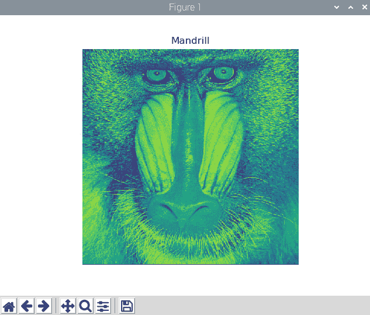
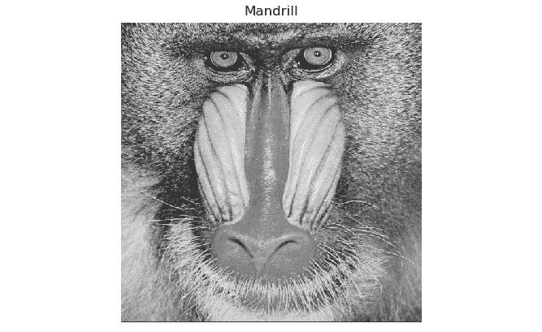
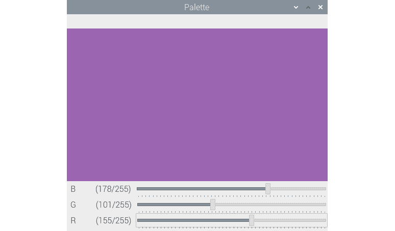
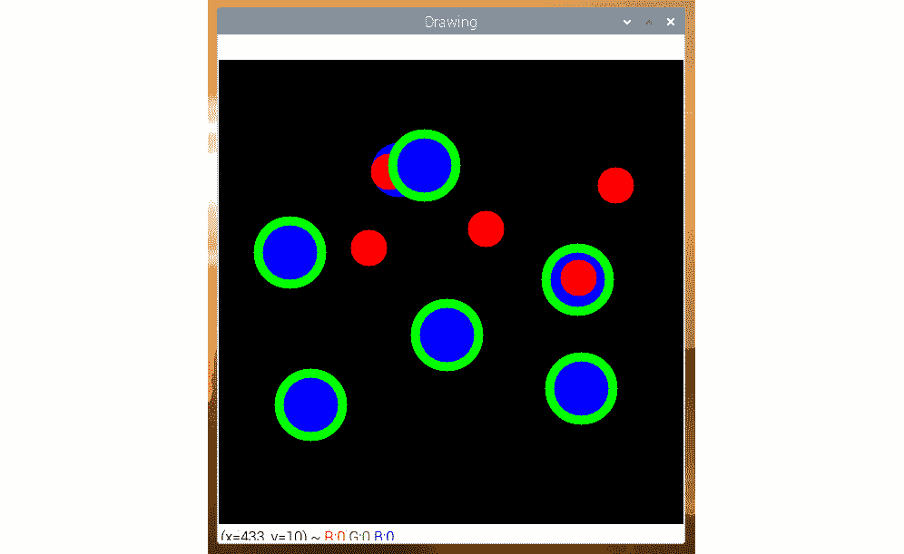
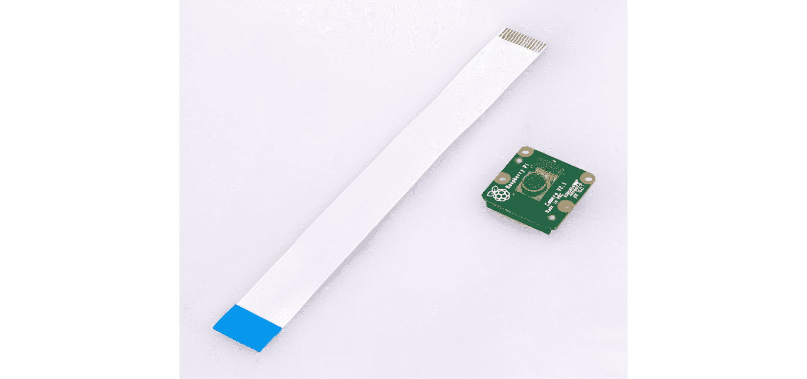

# 四、计算机视觉入门

在上一章中，我们学习了 Python 3，NumPy，Matplotlib 和**通用输入输出**（**GPIO**）编程的基础。 在本章中，我们将重点介绍图像和视频的获取。 本章有很多编码示例，我们将在整本书中使用。

在本章中，我们将介绍以下主题：

*   探索图像数据集
*   使用 OpenCV 处理图像
*   使用 Matplotlib 可视化图像
*   使用 OpenCV 和 NumPy 绘制几何形状
*   使用 GUI
*   事件处理和原始绘画应用
*   使用 USB 网络摄像头
*   Pi 相机模块

# 技术要求

可以在 [GitHub](https://github.com/PacktPublishing/raspberry-pi-computer-vision-programming/tree/master/Chapter04/programs) 上找到本章的代码文件。

观看以下视频，以查看[这个页面](https://bit.ly/3dtrA2t)上的“正在执行的代码”。

# 探索图像数据集

对于使用 Python 和 OpenCV 的计算机视觉程序，我们将需要示例图像。 我们可以在网上找到很多图片。 但是，其中许多图像均受版权保护。 大多数计算机视觉研究人员和专业人员都使用标准的图像数据集。 我们更喜欢一直使用以下图像数据集：

*   <http://sipi.usc.edu/database/>
*   <http://www.imageprocessingplace.com/root_files_V3/image_databases.htm>
*   <http://www.cvlab.cs.tsukuba.ac.jp/dataset/tsukubastereo.php>

下载这些数据集。 它们将以压缩的 **zip** 格式。 将它们解压缩到`~/book/dataset`目录中。 从本章开始，我们将编写许多需要图像的计算机视觉程序，并将满足所有需求使用这些数据集中的图像。 图像的另一种选择是使用网络摄像机和 RPi 摄像机模块来捕获图像，我们将在本章的后面部分中学习有关图像的信息。

# 使用 OpenCV 处理图像

在本节中，我们将学习使用 OpenCV API 和 Python 读取和存储图像。 本书中的所有程序都将使用 OpenCV 库。 可以使用以下 Python 3 语句导入它：

```py
import cv2
```

`cv2.imread()`函数从磁盘读取图像并将其存储在 NumPy `ndarray`中。 它接受两个参数。 第一个参数是磁盘上映像文件的名称。 该图像应该位于保存当前 Python 3 脚本的目录中，或者必须将图像文件的绝对路径作为参数传递给`cv2.imread()`函数。

第二个参数是一个标志，用于指定应读取图像的模式。 该标志可以具有以下值之一：

*   `cv2.IMREAD_GRAYSCALE`：这将以灰度模式从磁盘读取图像。 对应于该标志的数值是`0`。
*   `cv2.IMREAD_UNCHANGED`：这将从磁盘上按原样读取图像。 对应于该标志的数值是`-1`。
*   `cv2.IMREAD_COLOR`：这将以彩色模式读取图像，它是参数自变量的默认值。 对应于该标志的数值是`1`。 这是参数的默认值。

以下是在彩色模式下读取图像的代码：

```py
import cv2
img = cv2.imread('/home/pi/book/dataset/4.2.03.tiff', cv2.IMREAD_COLOR)
```

我们可以用以下标志重写最后一行：

```py
img = cv2.imread('/home/pi/book/dataset/4.2.03.tiff', 1)
```

前面的编写代码以读取带有数字标志的源图像的样式非常简单。 因此，我们将在整本书中使用它：

```py
cv2.imshow('Mandrill', img)
cv2.waitKey(0)
cv2.destroyWindow('Mandrill')
```

`cv2.imshow()`函数在屏幕上的窗口中显示图像。 它接受两个参数。 作为窗口名称的字符串是第一个参数，具有要显示图像的 NumPy `ndarray`变量是第二个变量。

`cv2.waitKey()`函数是用于绑定键盘事件的函数。 它接受一个参数，该参数是函数检测键盘的按键需要等待的毫秒数。 如果我们将其传递为`0`，则它将无限期地等待键盘上的某个按键按下。 它是 OpenCV 库中唯一可以处理键盘事件的函数。 我们必须在调用`cv2.imshow()`函数之后立即调用它。 如果我们不这样称呼，则不会在屏幕上显示图像的窗口，因为`cv2.waitKey()`是唯一获取和处理事件的函数。

`cv2.destroyWindow()`函数接受要销毁的窗口的名称作为参数。 当必须删除当前程序显示的所有窗口时，我们使用`cv2.destoyAllWindows()`函数来执行此操作。 本书将在几乎所有的 OpenCV 程序中使用这些函数。

我们还可以预先创建一个具有特定名称的窗口，然后在以后需要时在程序中将图像与该窗口关联。 建议在处理图像之前先创建一个窗口。 以下代码片段演示了这一点：

```py
cv2.namedWindow('Lena', cv2.WINDOW_AUTOSIZE)
cv2.imshow('Mandrill', img)
cv2.waitKey(0)
cv2.destroyWindow('Mandrill')
```

让我们将它们放在一起以获得以下脚本：

```py
import cv2
img = cv2.imread('/home/pi/book/dataset/4.2.03.tiff', 1)
cv2.imshow('Mandrill', img)
cv2.waitKey(0)
cv2.destroyWindow('Mandrill')
```

前面的代码导入图像，将其显示在屏幕上，然后等待键盘上的击键关闭图像窗口。 以下是上述代码输出的屏幕截图：


图 1：使用 OpenCV 读取和可视化彩色图像

`cv2.imwrite()`函数将 NumPy `ndarray`保存到磁盘上的特定路径。 第一个参数是字符串，它是我们用来保存图像的文件的名称，第二个参数是具有图像的 NumPy 数组的名称。 此外， `cv2.waitKey()`函数可以检测键盘上的特定按键。 让我们看一下两个函数的演示，如下所示：

```py
import cv2
img = cv2.imread('/home/pi/book/dataset/4.2.03.tiff', 1)
cv2.imshow('Mandrill', img)
keyPress = cv2.waitKey(0)
if keyPress == ord('q'):
    cv2.destroyWindow('Mandrill')
elif keyPress == ord('s'):
    cv2.imwrite('test.jpg', img)
    cv2.destroyWindow('Mandrill')
```

此处，`keyPress = cv2.waitKey(0)`行将键盘上的击键值保存在`keyPress`变量中。`ord()`函数接受单个字符，并返回一个整数，该整数表示字符的 Unicode（如果它是 Unicode 对象）。 基于`keyPress`变量，我们可以立即退出，也可以将映像保存到磁盘后退出。 例如，如果我们按`Esc`键，则`cv2.waitKey()`函数将返回`27`的值。

# 使用 Matplotlib 可视化图像

Matplotlib 是针对 Python 3 编程语言的非常强大的数据可视化库。 它还能够可视化图像。 它还提供了多种绘图选项，我们将在本书的后续章节中学习其许多功能。 让我们编写一个程序，该程序显示带有 Matplotlib 的图像，该图像使用 OpenCV `cv2.imread()`函数以灰度模式读取：

```py
import cv2
img = cv2.imread('/home/pi/book/dataset/4.2.03.tiff', 0)
import matplotlib.pyplot as plt
plt.imshow(img)
plt.title('Mandrill')
plt.axis('off')
plt.show()
```

注意

您可以从[这个页面](http://www.packtpub.com)上的帐户下载示例代码文件，以获取已购买的所有 Packt Publishing 图书。 如果您在其他地方购买了此书，则可以访问[这个页面](http://www.packtpub.com/support)并注册以将文件直接通过电子邮件发送给您。

在前面的示例中，我们以灰度模式读取图像，并使用 Matplotlib `plt.imshow()`函数显示该图像。 以下是上述程序的输出：



图 2：使用 Matplotlib 将 BGR 图像可视化为 RGB 图像

我知道图像看起来不自然。 这是因为我们在灰度模式下读取图像并使用默认的颜色图将其可视化。 在`plt.imshow()`中进行以下更改，我们将发现输出对我们而言更可口。 以下是输出：



图 3：可视化灰度图像

这全都与灰度图像有关。

`cv2.imread()`函数也可用于彩色图像。 它将它们读取并保存为**蓝色，绿色和红色**（BGR）像素的三维`ndarray`。

但是，Matplotlib `plt.imshow()`函数将 NumPy `ndarray`显示为 RGB 颜色空间中的图像。 如果我们使用 OpenCV 的默认 BGR 格式使用`cv2.imread()`函数读取图像，并使用`plt.imshow()`函数显示图像，则`plt.imshow()`函数会将的蓝色强度值视为红色的强度值，反之亦然。 这会使图像出现失真的颜色。 对在相应行中的先前代码进行以下更改，然后再次运行该程序：

```py
img = cv2.imread('/home/pi/book/dataset/4.2.03.tiff', 1)
plt.imshow(img)
```

进行更改并运行代码以查看颜色失真的彩色图像。 要解决此问题，我们必须将`cv2.imread()`函数在 BGR 颜色空间中读取的图像转换为 RGB 颜色空间，以便`plt.imshow()`函数将以对人眼和大脑有意义的方式进行渲染。 我们将使用`cv2.cvtColor()`函数来执行此任务，并且我们将在本书后面的部分中对此进行更详细的了解。

# 使用 OpenCV 和 NumPy 绘制几何形状

让我们学习如何使用 OpenCV 绘图函数绘制各种几何形状。 我们也将在此处使用 NumPy。

以下代码导入了此演示所需的所有必需库：

```py
import cv2
import numpy as np
```

以下代码创建全零的 RGB `ndarray`。 它是所有像素均为黑色的图像：

```py
image = np.zeros((200, 200, 3), np.uint8)
```

我们正在使用`np.zeros()`函数创建一个所有零元素的`ndarray`。

我们先画一条线，因为它是一个简单的几何形状。 在以下代码的帮助下，我们将绘制一条线，其坐标为`(0, 199)`和`(199, 0)`，颜色为红色（BGR 中的`(0, 0, 255)`），厚度为 2 个像素 ：

```py
cv2.line(image, (0, 199), (199, 0), (0, 0, 255), 2)
```

用于绘制的所有 OpenCV 函数具有以下公共参数：

*   `img`：这是我们需要绘制几何形状的图像。
*   `color`：作为`(B, G, R)`的元组传递，以表示每种颜色的强度值介于`0`之间的颜色 ]和`255`。
*   `thickness`：此参数的参数默认值为`1`。 对于所有几何上闭合的形状（例如椭圆，圆形和矩形），`-1`会使用指定为参数的颜色完全填充形状。
*   `lineType`: 它可以具有以下三个值之一：

   `8`：八行连接（这是此参数的参数的默认值）。

   `4`：四连接线。

   `cv2.LINE_AA`：这表示**抗锯齿**（通常与具有曲线（例如椭圆或圆形）的几何形状一起使用）。

以下代码行将帮助我们绘制一个矩形，该矩形的对角线顶点为`(20, 20)`和`(60, 60)`，蓝色为蓝色：

```py
cv2.rectangle(image, (20, 20), (60, 60), (255, 0, 0), 1)
```

下面的代码将帮助绘制一个圆，其中心位于`(80, 80)`，半径为 10 个像素，绿色为填充色：

```py
cv2.circle(image, (80, 80), 10, (0, 255, 0), -1)
```

以下代码行将帮助我们绘制不旋转的完整椭圆，以像素`(99, 99)`为中心的长轴和短轴的长度分别为 40 像素和 20 像素：

```py
cv2.ellipse(image, (99, 99), (40, 20), 0, 0, 360, (128, 128, 128), -1)
```

以下代码绘制了具有四个点的多边形。 定义如下：

```py
points = np.array([[100, 5], [125, 30], [175, 20], [185, 10]], np.int32)
points = points.reshape((-1, 1, 2))
cv2.polylines(image, [points], True, (255, 255, 0))
```

如果在`polylines()`函数的调用中将`False`传递为第三个参数的值，则它将所有点与线段连接在一起，并且不会绘制闭合形状。

我们还可以使用`cv2.putText()`函数在图像中打印文本。 以下代码将文本添加到图像的左下角`(80, 180)`，将`HERSHEY_DUPLEX`作为字体，并且大小为文字 1，文字颜色为粉红色：

```py
cv2.putText(image, 'Test', (80, 180), cv2.FONT_HERSHEY_DUPLEX, 1, (255, 0, 255))
```

`cv2.putText()`函数接受以下字体之一作为参数：

*   `FONT_HERSHEY_DUPLEX`
*   `FONT_HERSHEY_COMPLEX`
*   `FONT_HERSHEY_SIMPLEX`
*   `FONT_HERSHEY_PLAIN`
*   `FONT_HERSHEY_SCRIPT_SIMPLEX`
*   `FONT_HERSHEY_SCRIPT_COMPLEX`
*   `FONT_HERSHEY_TRIPLEX`
*   `FONT_HERSHEY_COMPLEX_SMALL`

使用以下熟悉的代码片段显示输出图像：

```py
cv2.imshow('Shapes', image)
cv2.waitKey(0)
cv2.destroyAllWindows()
```

前面代码的输出如下：


图 4：绘制几何形状

注意

如果几何形状的像素重叠，则这些像素将始终具有由最新几何函数分配的值。 例如，椭圆与上图中的线和圆重叠。

作为练习，更改传递给所有几何函数的参数值，然后再次运行代码以更好地理解功能。

# 使用 GUI

到目前为止，我们已经知道如何使用 OpenCV `cv2.namedWindow()`函数的调用来创建命名窗口。 现在将演示如何使用`cv2.CreateTrackbar()`函数创建跟踪栏，如何将其与命名窗口关联，以及如何使用这些跟踪栏选择颜色通道的值。 RGB 色彩空间。 让我们从下面的代码开始：

```py
import numpy as np
import cv2
def empty(z):
    pass
image = np.zeros((300, 512, 3), np.uint8)
cv2.namedWindow('Palette')
cv2.createTrackbar('B', 'Palette', 0, 255, empty)
cv2.createTrackbar('G', 'Palette', 0, 255, empty)
cv2.createTrackbar('R', 'Palette', 0, 255, empty)
while(True):
    cv2.imshow('Palette', image)
    if cv2.waitKey(1) == 27 :
        break
    blue = cv2.getTrackbarPos('B', 'Palette')
    green = cv2.getTrackbarPos('G', 'Palette')
    red = cv2.getTrackbarPos('R', 'Palette')
    image[:] = [blue, green, red]
cv2.destroyWindow('Palette')
```

在前面的代码中，我们首先创建一个图像，其中所有像素都涂成黑色，并创建一个名称为面板为的窗口。 `cv2.createTrackbar()`函数创建一个跟踪栏。 以下是此函数接受的参数列表：

*   `name`：轨迹栏的名称。
*   `window_name`：与跟踪栏关联的输出窗口的名称。
*   `value`：创建跟踪栏滑块时的初始值。
*   `count`：轨迹栏滑块的最大值（滑块的最小值始终为 0）。
*  `Onchange()`：当我们更改轨迹栏滑块的位置时，将调用此函数。

我们创建了一个函数并将其命名为`empty()`。 更改轨迹栏的滑块时，我们不打算执行任何活动。 我们只是将此函数的调用传递给`cv2.createTrackbar()`函数。 `cv2.getTrackbarPos()`函数的调用返回轨迹栏滑块的最新位置。 根据所有三个轨迹栏的滑块的位置，我们设置调色板的颜色。 当我们按下键盘上的`Esc`键时，应用关闭。 我们创建的应用应如下所示：



图 5：BGR 调色板

OpenCV 还提供了许多处理事件的功能。 接下来，我们将进行探讨。

# 事件处理和原始绘图应用

OpenCV 可以识别各种键盘和鼠标事件。 我们可以按照以下说明通过查看事件列表。 通过在命令提示符下运行`python3`命令以交互方式打开 Python 3 解释器，然后运行以下语句：

```py
>>> import cv2
>>> events = [i for i in dir(cv2) if 'EVENT' in i]
>>> print(events)
```

它将显示以下输出：

```py
['EVENT_FLAG_ALTKEY', 'EVENT_FLAG_CTRLKEY', 'EVENT_FLAG_LBUTTON', 'EVENT_FLAG_MBUTTON', 'EVENT_FLAG_RBUTTON', 'EVENT_FLAG_SHIFTKEY', 'EVENT_LBUTTONDBLCLK', 'EVENT_LBUTTONDOWN', 'EVENT_LBUTTONUP', 'EVENT_MBUTTONDBLCLK', 'EVENT_MBUTTONDOWN', 'EVENT_MBUTTONUP', 'EVENT_MOUSEHWHEEL', 'EVENT_MOUSEMOVE', 'EVENT_MOUSEWHEEL', 'EVENT_RBUTTONDBLCLK', 'EVENT_RBUTTONDOWN', 'EVENT_RBUTTONUP']
```

我们可以编写代码来处理其中的一些事件，并创建一个简单而原始的绘画应用。 让我们使用以下代码导入所需的库：

```py
import cv2
import numpy as np
```

创建一个黑色背景和一个命名窗口：

```py
windowName = 'Drawing'
img = np.zeros((512, 512, 3), np.uint8)
cv2.namedWindow(windowName)
```

定义一个自定义函数，称为`draw_circle()`：

```py
def draw_circle(event, x, y, flags, param):
    if event == cv2.EVENT_LBUTTONDBLCLK:
        cv2.circle(img, (x, y), 40, (0, 255, 0), -1)
    if event == cv2.EVENT_MBUTTONDOWN:
        cv2.circle(img, (x, y), 20, (0, 0, 255), -1)
    if event == cv2.EVENT_LBUTTONDOWN:
        cv2.circle(img, (x, y), 30, (255, 0, 0), -1)
```

在前面的定义中，我们正在使用鼠标事件上的各种属性绘制圆。 现在，让我们调用`setMouseCallback()`函数，并将窗口的名称和`draw_circle()`函数作为参数传递给它：

```py
cv2.setMouseCallback(windowName, draw_circle)
```

此调用将`draw_circle()`函数与给定窗口的鼠标事件绑定在一起。 最后，我们编写显示图像窗口的循环，并在按下`Esc`键时退出：

```py
while(True):
    cv2.imshow(windowName, img)
    if cv2.waitKey(20) == 27:
        break
cv2.destroyAllWindows()
```

运行整个代码，您将看到以下输出：



图 6：一个简单的绘画应用

当我们对左，中和下按钮的双击事件进行编程时，根据这些事件和光标的位置，您的输出将有所不同。

本书中我们将少量使用 OpenCV 中的绘图 API。 我们在本书中最常使用的功能与网络摄像头有关。 下一部分将专门介绍网络摄像头与 OpenCV 和 Raspberry Pi 的接口和使用。

# 使用 USB 网络摄像头

相机是图像传感器。 就是说，模拟相机和电影胶卷相机在胶片上记录图像。 数码相机具有用于捕获图像的数码传感器，它们以电子格式存储在各种类型的存储介质上。 数码相机的一个子集是 USB 网络摄像头。 顾名思义，这些网络摄像头可以通过 USB 连接到计算机，因此名称为 USB 网络摄像头。 在本节中，我们将详细了解 USB 网络摄像头与 Raspberry Pi 的接口以及如何使用 Shell 脚本，Python 3 和 OpenCV 进行编程。

注意

所有这些网络摄像头均可与 Raspberry Pi 板一起使用。 但是，一些网络摄像头可能有问题。 [这个 URL](https://elinux.org/RPi_USB_Webcams) 包含许多网络摄像头的列表以及有关兼容性的详细信息。

本书中的所有程序均已通过 RPi 4B 和 Logitech C310 网络摄像头进行了测试。 您可以在[这个页面](https://www.logitech.com/en-in/product/hd-webcam-c310)上查看其产品页面。

使用开发板上的 USB 端口将 USB 网络摄像头连接到 RPi，然后在终端中运行以下命令：

```py
lsusb
```

此命令的输出显示连接到 Linux 计算机的所有 USB 设备的列表。 以下是我的 RPi 板上显示的输出：

```py
pi@raspberrypi:~/book/chapter04 $ lsusb
Bus 002 Device 001: ID 1d6b:0003 Linux Foundation 3.0 root hub
Bus 001 Device 005: ID 046d:081b Logitech, Inc. Webcam C310
Bus 001 Device 004: ID 1c4f:0002 SiGma Micro Keyboard TRACER Gamma Ivory
Bus 001 Device 003: ID 046d:c077 Logitech, Inc. M105 Optical Mouse
Bus 001 Device 002: ID 2109:3431 VIA Labs, Inc. Hub
Bus 001 Device 001: ID 1d6b:0002 Linux Foundation 2.0 root hub
```

从前面的输出中可以看到，第二个条目对应于连接到 RPi 板的 USB 网络摄像头。 我们还可以看到 USB 鼠标和 USB 键盘连接到 RPi 板。

## 使用网络摄像头捕获图像

现在，让我们演示如何使用连接到 RPi 的 USB 网络摄像头捕获图像。 我们可以通过在终端上运行以下命令来安装`fswebcam`工具：

```py
sudo apt-get install fswebcam
```

安装后，我们可以运行以下命令以使用 USB 网络摄像头捕获照片：

```py
fswebcam -r 1280x960 --no-banner ~/book/chapter04/camtest.png
```

此命令使用连接到 RPi 的 USB 网络摄像头捕获分辨率为`1280 x 960`像素的图像。 传递给命令的命令行`--no-banner`参数禁用时间戳记的标题。 图像以文件名作为最后一个参数保存。 如果我们重复运行此命令，则捕获的新照片将被覆盖到同一文件中。 因此，下一次运行命令时，如果我们不想覆盖先前的文件，则必须将不同的文件名作为参数传递给命令。

注意

如果您想了解有关`fswebcam`（或与此相关的任何 Linux 命令）的更多信息，则可以在命令提示符下运行`man fswebcam`命令。

## 缩时摄影

用相机以固定间隔捕获照片，并以比其捕获时更高的帧频回放它们，这被称为**缩时摄影**。 例如，如果我们以每分钟一张照片的速度拍摄 10 小时的照片，那么我们将有 600 张照片。 如果我们将它们全部拼接成视频并以每秒 30 张照片的帧速率播放，我们将获得 20 秒的视频。 该视频是，也称为**间隔拍摄视频**。 我们可以将 RPi 板与 USB 网络摄像头配合使用。 我们已经学习了如何将 USB 网络摄像头与 RPi 板配合使用。 我们还了解了`fswebcam`工具的用法。 我们将编写一个脚本来捕获文件名中带有时间戳的图像。 然后，我们将该脚本添加到`crontab`中，以定期执行该脚本。 Cron 是针对类似 Unix 操作系统的作业计划。 它由名为`crontab`（Cron 表）的文件驱动。 它是 Unix 配置文件，用于指定要在特定时间或间隔运行的脚本或程序。

让我们创建一个名称为`timelapse.sh`的 Shell 脚本，并将其保存在磁盘上我们选择的位置。 我们必须将以下代码添加到脚本文件并保存：

```py
#!/bin/bash
DATE=$(date +"%Y-%m-%d_%H%M")
fswebcam -r 1280x960 --no-banner Image_$DATE.png 
```

通过运行以下命令，使脚本的模式可执行：

```py
chmod +x timelapse.sh
```

该脚本使用 USB 网络摄像头拍摄照片，然后将其保存到磁盘中的某个位置。 每次捕获的图像都有一个新的文件名，因为捕获图像时文件名带有时间戳。 我们必须手动执行一次此脚本，以确保它可以正常工作并且以`Image_<timestamp>.png`的文件名格式捕获图像。

检查脚本是否存在任何问题后，必须定期执行脚本以捕获时间间隔序列的图像。 为此，我们必须将其添加到`crontab`中。`crontab`中条目的语法如下：

```py
1 2 3 4 5 /location/command
```

让我们检查语法中术语的含义：

*   `1`：分钟的位置（范围为 0-59）
*   `2`：小时的位置（范围为 0-23）
*   `3`：日期的位置（范围为 0-31）
*   `4`：月份的位置（范围为 0 到 12，1 月份为 1）
*   `5`：星期的位置（范围为 0-7，星期日为 7 或 0）
*   `/location/command`：要计划的脚本或命令名称

因此，`crontab`每分钟运行一次`timelapse.sh`脚本的条目如下：

```py
* * * * * /home/pi/book/chapter04/timelapse.sh 2>&1
```

使用以下命令打开用户`pi`的`crontab`：

```py
crontab –e
```

这将打开`crontab`。 当我们第一次在 RPi 上执行此操作时，它将询问您选择哪个文本编辑器。 通过输入`1`选择`nano`选项。 将上一行作为条目添加到`crontab`中。 然后保存并退出。

一旦退出`crontab`，它将向我们显示以下消息：

```py
crontab: installing new crontab
```

一旦执行此操作，就可以开始设置游戏中时光倒流。 我们可以将`crontab`条目中的设置更改为我们选择的设置。 要每 5 分钟运行一次脚本，请使用以下命令：

```py
*/5 * * * * /home/pi/book/chapter04/timelapse.sh 2>&1
```

要每 2 小时运行一次脚本，请使用以下命令：

```py
* */2 * * * /home/pi/book/chapter04/timelapse.sh 2>&1
```

一旦捕获了所有用于延时拍摄的图像，我们就必须将它们编码为每秒 24、25、29 或 30 帧（**FPS**）的帧频的视频。 这些均为标准帧速率。 我更喜欢使用 30 FPS 对视频进行编码。 Raspberry Pi 是用于视频编辑的慢速计算机。 建议您将图像复制到速度更快的计算机上以对视频进行编码。 对于 Linux 计算机，我更喜欢使用命令行`mencoder`工具。 我们也可以使用其他工具或视频编辑工具来完成此任务。 以下是在 Raspberry Pi 或任何其他 Linux 计算机上使用`mencoder`创建延时视频的步骤：

1.  在命令提示符上使用以下命令安装 MEncoder：

    ```py
     sudo apt-get install mencoder -y
    ```

2.  发出以下命令，导航到输出目录：

    ```py
     cd /home/pi/book/chapter04
    ```

3.  使用以下命令创建在间隔拍摄序列中要使用的图像的列表：

    ```py
     ls Image_*.png > timelapse.txt
    ```

4.  最后，我们可以使用以下命令来创建漂亮的延时视频：

    ```py
    mencoder -nosound -ovc lavc -lavcopts vcodec=mpeg4:aspect=16/9:vbitrate=8000000 -vf scale=1280:960 -o timelapse.avi -mf type=jpeg:fps=30 mf://@timelapse.txt
    ```

此在我们正在运行命令的当前目录（也称为**当前工作目录**）的当前目录中创建带有`timelapse.avi`文件名的视频。 。 视频的帧频为 30 FPS。 很快，我们将学习如何播放此视频文件。

## 使用网络摄像头的录像

我们可以使用连接到 RPi 的 USB 网络摄像头，通过命令行`ffmpeg`工具录制实时视频。 我们可以使用以下命令安装`ffmpeg`工具：

```py
sudo apt-get install ffmpeg
```

我们可以使用以下命令来录制视频：

```py
ffmpeg -f video4linux2 -r 25 -s 544x288 -i /dev/video0 test.avi
```

我们可以通过按键盘上的`Ctrl + C`终止录制视频的操作。

我们可以使用命令行`omxplayer`工具播放视频。 它预装了 Raspbian 的最新版本，因此我们不必单独安装它。 要播放具有`timelapse.avi`文件名的文件，请使用命令提示符导航到视频文件的位置，然后运行以下命令：

```py
omxplayer timelapse.avi
```

我们甚至可以双击 Raspbian GUI 中的视频文件，以使用 VLC 媒体播放器进行播放。

## 使用 Python 和 OpenCV 和网络摄像头捕获图像

让我们学习如何使用 Python 3 和 OpenCV 通过连接到 RPi 的网络摄像头捕获图像：

```py
import cv2
import matplotlib.pyplot as plt
cap = cv2.VideoCapture(0)
if cap.isOpened():
    ret, frame = cap.read()
else:
    ret = False
print(ret)
print(type(frame))
cv2.imshow('Frame from Webcam', frame)
cv2.waitKey(0)
cap.release()
cv2.destroyAllWindows()
```

在先前的代码片段中， `cv2.VideoCapture()`函数创建一个对象，以使用连接到 RPi 的网络摄像头捕获视频。 它的参数可以是视频设备的索引或视频文件。 在这种情况下，我们正在传递视频设备的索引，即`0`。 如果我们有更多的摄像机连接到 RPi 板上，则可以根据选择的摄像机来传递适当的设备索引。 如果仅连接一台摄像机，则只需传递`0`即可。

通过运行以下命令，我们可以找出摄像机的数量以及与这些摄像机关联的设备索引：

```py
ls -l /dev/video*
```

`cap.read()`函数返回布尔值`ret`值和包含捕获的图像的 NumPy `ndarray`**帧**。  如果捕获图像的操作成功，则`ret`的布尔值将为`True`； 否则，它将具有布尔值`False`。 前面的代码使用`/dev/video0`标识的 USB 摄像机捕获图像，将其显示在屏幕上，然后最终将其保存为文件名`test.png`到磁盘。 `cap.release()`函数释放视频捕获设备。

## 使用 Python 和 OpenCV 和网络摄像头一起直播视频

我们可以对使用先前的代码，并对进行一些修改，以显示来自 USB 网络摄像头的实时视频流：

```py
import cv2
windowName = "Live Video Feed"
cv2.namedWindow(windowName)
cap = cv2.VideoCapture(0)
if cap.isOpened():
    ret, frame = cap.read()
else:
    ret = False
while ret:
    ret, frame = cap.read()
    cv2.imshow(windowName, frame)
    if cv2.waitKey(1) == 27:
        break
cv2.destroyAllWindows()
cap.release()
```

之前的代码显示了网络摄像头捕获的实时视频，直到我们按键盘上的`Esc`键。 前面的代码示例是使用连接到 RPi 板的 USB 网络摄像头捕获的实时视频的处理的所有代码示例的模板。

## 网络摄像头的分辨率

我们可以使用`cap.get()`读取网络摄像头的属性。 我们必须传递`3`以获得宽度，传递`4`以获得高度。 我们也可以用`cap.set()`设置属性。 以下代码演示了这一点：

```py
import cv2
windowName = "Live Video Feed"
cv2.namedWindow(windowName)
cap = cv2.VideoCapture(0)
print('Width : ' + str(cap.get(3)))
print('Height : ' + str(cap.get(4)))
cap.set(3, 5000)
cap.set(4, 5000)
print('Width : ' + str(cap.get(3)))
print('Height : ' + str(cap.get(4)))
if cap.isOpened():
    ret, frame = cap.read()
else:
    ret = False
while ret:
    ret, frame = cap.read()
    cv2.imshow(windowName, frame)
    if cv2.waitKey(1) == 27:
        break
cv2.destroyAllWindows()
cap.release()
```

在前面的代码中，我们将高度和宽度都设置为`5000`。 网络摄像头不支持此分辨率，因此高度和宽度都将设置为网络摄像头支持的最大分辨率。 运行前面的代码，并观察命令提示符中打印的输出。

## 网络摄像头的 FPS

我们可以检索我们正在使用的网络摄像头的 FPS，也可以自己计算实际的 FPS。 作为网络摄像头属性检索的 FPS 和计算出的 FPS 可能不同。 让我们检查一下。 导入所有必需的库：

```py
import time
import cv2
```

接下来，启动一个用于视频捕获的对象：

```py
cap = cv2.VideoCapture(0)
```

我们可以使用`cap.get()`获取相机分辨率，如下所示：

```py
fps = cap.get(cv2.CAP_PROP_FPS)
print("FPS with CAP_PROP_FPS : {0}".format(fps))
```

然后，我们将连续捕获 120 帧。 我们记录操作前后的时间，如下所示：

```py
num_frames = 120
print("Capturing {0} frames".format(num_frames))
start = time.time()
for i in range(0, num_frames):
    ret, frame = cap.read()
end = time.time()
```

然后，最后，我们计算捕获帧所需的实际时间，然后可以使用以下公式计算 FPS：

代码如下：

```py
seconds = end - start
print("Time taken : {0} seconds".format(seconds))
fps = num_frames / seconds
print("Actual FPS calculated : {0}".format(fps))
cap.release()
```

运行整个程序，输出应如下所示：

```py
FPS with CAP_PROP_FPS : 30.0
Capturing 120 frames
Time taken : 9.86509919166565 seconds
Actual FPS calculated : 12.164094619685105
```

由于硬件限制，我们通常永远不会从属性中获取 FPS。

## 保存网络摄像头视频

我们使用 OpenCV `cv2.VideoWriter()`函数将实时 USB 网络摄像头流保存到磁盘上的视频文件中。 以下代码演示了这一点：

```py
import cv2
windowName = "Live Video Feed"
cv2.namedWindow(windowName)
cap = cv2.VideoCapture(0)
filename = 'output.avi'
codec = cv2.VideoWriter_fourcc('W', 'M', 'V', '2')
framerate = 30
resolution = (640, 480)
Output = cv2.VideoWriter(filename, codec,
                         framerate, resolution)
if cap.isOpened():
    ret, frame = cap.read()
else:
    ret = False
while ret:
    ret, frame = cap.read()
    Output.write(frame)
    cv2.imshow(windowName, frame)
    if cv2.waitKey(1) == 27:
        break
cv2.destroyAllWindows()
cap.release()
```

在前面的代码中， `cv2.VideoWriter()`函数的调用接受的参数，其参数如下：

*   `filename`：这是要写入磁盘的视频文件的名称。
*   `fourcc`：此表示**四字符代码**。 为此，我们使用`cv2.VideoWriter_fourcc()`函数。 此函数接受四字符代码作为参数。 一些受支持的四字符代码格式是`WMV2`，`MJPG`，`H264`，`WMV1`，`DIVX`和`XVID`。 您可以在[这个页面](http://www.fourcc.org/codecs.php)上了解有关四字符代码的更多信息。
*   `framerate`：这是指要捕获的视频的 FPS。
*   `resolution`：这是捕获视频并将其保存在磁盘上时的像素分辨率。

上面的代码记录视频，直到按下键盘上的`Esc`键，然后使用`cv2.VideoWriter()`函数的参数中指定的文件名将其保存在磁盘上。 。

## 使用 OpenCV 播放视频

我们可以轻松使用 OpenCV 播放视频。 我们只需要将视频文件的名称传递给`VideoCapture()`函数即可代替网络摄像头的索引（在本例中为`0`）。 为了确定播放的 FPS，我们需要将适当的参数传递给`waitKey()`函数的调用。 假设我们要以 25 FPS 的速度播放视频，那么可以使用`1000/25 = 40`公式来计算要传递的参数。 我们知道`waitKey()`等待我们将作为参数传递给它的毫秒数。 并且，一秒具有 1,000 毫秒，因此是公式。 对于 30 FPS，这将是 33.3。 让我们看下面的代码：

```py
import cv2
windowName = "OpenCV Video Player"
cv2.namedWindow(windowName)
filename = 'output.avi'
cap = cv2.VideoCapture(filename)
while(cap.isOpened()):
    ret, frame = cap.read()
    if ret:
        cv2.imshow(windowName, frame)
        if cv2.waitKey(33) == 27:
            break
    else:
        break
cv2.destroyAllWindows()
cap.release()
```

前面的程序以 30 FPS 的帧速率播放视频文件，并在最后一帧之后或当我们按键盘上的`Esc`键时终止。 您可能想使用该程序，并尝试通过将参数的值更改为`cv2.waitKey()`函数的调用来更改输出帧速率。

在下一节中，我们将更详细地研究 Pi 相机模块。

# Pi 摄像头模块

网络摄像头使用 USB 端口与计算机连接。 这就是为什么我们可以在具有 USB 端口的任何计算机上使用它的原因。 Pi 相机模块（也称为 **Pi 相机板**的）是专门为 RPi 板制造的传感器。 Raspberry Pi 基金会和许多其他第三方制造商生产它们。 基本上，它们是带有专用图像传感器的 PCB（这就是为什么它们被称为 Pi 相机板）的原因。

Pi 相机板没有 USB 端口。 它通过**摄像机串行接口**（**CSI**）接口板连接到 Raspberry Pi。 由于使用 CSI 的专用连接，Pi 相机板的性能比 USB 网络摄像头要好得多。 我们可以将 Python 3 与连接到 RPi 的 Pi 摄像机模块一起使用，以编程方式捕获视频和静止图像。 除 Raspberry Pi 外，其他任何计算机都不能使用 Pi 相机板（以及少数支持单板相机连接的单板计算机）。

摄像头模块有两种类型：摄像头模块和 NoIR 模块。 摄像头模块非常适合白天和光线充足的场景。 NoIR 模块实质上是不带**红外**（**IR**）过滤器的相机模块。 在白天或光线充足的场景中，效果不佳。 但是，当与红外光一起使用时，它在低光或黑暗场景中非常有用。

您可以在[这个页面](https://www.raspberrypi.org/products/camera-module-v2/)和[产品页面](https://www.raspberrypi.org/products/pi-noir-camera-v2/) 上找到这两个模块的最新版本。这些相机板/模块已经出现了几代，即 V1 和 V2。 V1 的像素为 5 百万像素，不再生产。 V2 是最新的，并且具有 8 百万像素传感器。 您可以在[这个页面](https://www.raspberrypi.org/documentation/hardware/camera/)上了解它们之间的区别。

所有摄像机都带有可拆卸的色带，可通过**摄像机串行接口**（**CSI**）端口将其连接到 RPi 板上。 以下是摄像头模块和色带的照片：



图 7：Pi 摄像机板和 CSI 接口功能区

我们必须将蓝色端连接到 RPi 板的 CSI 端口，另一端连接到摄像头板。

RPi Zero 和 RPi Zero W 配备了较小的 CSI 端口。 有单独的功能区。 以下是这种丝带的照片：


图 8：迷你 CSI 功能区

以下是连接到 RPi Zero 板的 Pi NoIR 板的照片：


图 9：RPi 为零的 Pi NoIR

我已经提到 Pi Camera V1 不再生产。 您会在网上找到许多这些低价的 V1 模块（从 5 美元到 7 美元）。 此外，还有其他制造商生产与 RPi CSI 端口兼容的类似板。 它们也可以在线购买。

## 使用`raspistill`和`raspivid`工具捕获图像和视频

为了使用 RPi 的摄像头模块捕获静态照片和运动视频，我们需要使用命令行`raspistill`和`raspivid`工具。 要捕获图像，请运行以下命令：

```py
raspistill -o test.png
```

此命令使用`test.png`文件名捕获图像并将其保存在当前目录中。

要使用 RPi 摄像机模块捕获 20 秒的视频，请在命令提示符中运行以下命令：

```py
raspivid -o vid.h264 -t 20000
```

与`fswebcam`和`ffmpeg`工具不同，`raspistill`和`raspivid`工具不会向命令提示符写入任何内容。 因此，我们必须检查当前目录中是否有任何输出。 此外，在执行`raspistill`和`raspivid`工具之后，我们可以运行以下命令来检查这些命令是否已成功执行：

```py
echo $?
```

许多计算机和操作系统无法直接播放 H.264 格式的视频。 为此，我们需要将它们包装为流行且广泛支持的 **MP4** 格式。 为此，我们需要一个称为`MP4Box`的命令行工具。 我们可以通过在命令提示符上运行以下命令来安装它：

```py
sudo apt install -y gpac
```

现在，录制 H.264 视频：

```py
raspivid -t 30000 -w 640 -h 480 -fps 25 -b 1200000 -p 0,0,640,480 -o pivideo.h264
```

将其包装为 **MP4** 格式，然后删除原始文件（如果需要），如下所示：

```py
MP4Box -add pivideo.h264 pivideo.mp4
rm pivideo.h264
```

就像`fswebcam`工具一样，`raspistill`工具也可以用于捕获时间间隔序列。 在我们先前准备的`timelapse.sh`Shell 脚本中，用适当的`raspistill`命令替换调用`fswebcam`工具的行，以记录定时拍摄的照片序列。 然后，使用 RPi 或任何其他 Linux 计算机上的`mencoder`工具来创建一段精美的延时视频。

## 在 Python 3 中使用 picamera

`picamera`是 Python 包，可为 RPi 摄像机模块提供编程接口。 Raspbian 的最新版本已安装`picamera`。 如果尚未安装，则可以通过运行以下命令进行安装：

```py
pip3 install picamera
pip3 install "picamera[array]"
```

以下程序快速演示了`picamera`模块捕获图片的基本用法：

```py
from time import sleep
from picamera import PiCamera
camera = PiCamera()
camera.resolution = (1024, 768)
camera.start_preview()
sleep(2)
camera.capture('test.png')
```

我们在前两行中导入了`time`和`picamera`库。 调用`start_preview()`函数将开始预览要捕获的场景。 `sleep(5)`函数将等待 5 秒钟，然后`capture()`函数将照片捕获并将其保存到参数中指定的文件中。

`picamera`模块提供用于延时摄影的`capture_continuous()`函数。 让我们演示如何在以下程序中使用它：

```py
camera = PiCamera()
camera.start_preview()
sleep(2)
for filename in camera.capture_continuous('img{counter:03d}.png'):
        print('Captured %s' % filename)
        sleep(1)
```

在前面的代码中，`capture_continuous()`函数通过将 Pi 摄像机板连接到 RPi 来记录延时拍摄的照片。 这样，我们不必依赖`crontab`工具来连续调用该脚本，因为我们可以通过编程更好地控制它。

我们可以使用`start_recording()`，`wait_recording()`和`stop_recording()`函数来录制视频，如下所示：

```py
import picamera
camera = picamera.PiCamera()
camera.resolution = (320, 240)
camera.start_recording('my_video.h264')
camera.wait_recording(5)
camera.stop_recording()
```

我们可以向图像添加文本，如下所示：

```py
from time import sleep
from picamera import PiCamera
camera = PiCamera()
camera.resolution = (1024, 768)
camera.start_preview()
camera.annotate_text = 'Hello World!'
sleep(2)
camera.capture('test.png')
```

我们可以将图像存储在三维 NumPy 数组中，如下所示：

```py
import time, picamera
import numpy as np
with picamera.PiCamera() as camera:
        camera.resolution = (320, 240)
        camera.framerate = 24
        time.sleep(2)
        output = np.empty((240, 320, 3), dtype=np.uint8)
        camera.capture(output, 'rgb')
        print(type(output))
```

我们还可以将捕获的图像存储在与 OpenCV 图像格式（**BGR**）兼容的 NumPy 数组中：

```py
import time, picamera
import numpy as np
with picamera.PiCamera() as camera:
 camera.resolution = (320, 240)
 camera.framerate = 24
 time.sleep(2)
 image = np.empty((240 * 320 * 3, ), dtype=np.uint8)
 camera.capture(image, 'bgr')
 image = image.reshape((240, 320, 3))
 print(type(image))
```

这将以 OpenCV 首选的 **BGR** 格式存储图像。 我们可以使用`cv2.imshow()`函数显示此图像。

## 使用 RPi 相机模块和 Python 3 录制视频

我们已经学习了如何使用连接到 RPi 的 USB 网络摄像头以及 Python 3 和 OpenCV 的组合来录制视频。 我注意到，相同的代码也适用于 RPi 摄像机模块。 我们只需要将 RPi 摄像机模块连接到 RPi 并断开 USB 网络摄像头，即可使代码与 RPi 摄像机模块一起使用并使用该代码录制视频。 请继续尝试一下！

# 总结

在本章中，我们学习了如何处理图像和视频。 我们还学习了如何使用 USB 网络摄像头和 RPi 相机板捕获图像。 我们还学习了 GUI 的基础知识以及 OpenCV 提供的事件处理功能。 我们已经获得了有关 Shell 和 Python 3 编程的良好动手经验。 在本书中，我们将使用在这里学到的图像和视频采集与处理技术。

在下一章中，我们将学习图像处理的基础知识以及如何使用 NumPy 和 OpenCV.s 编写程序。