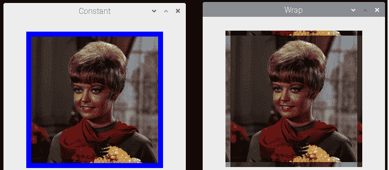
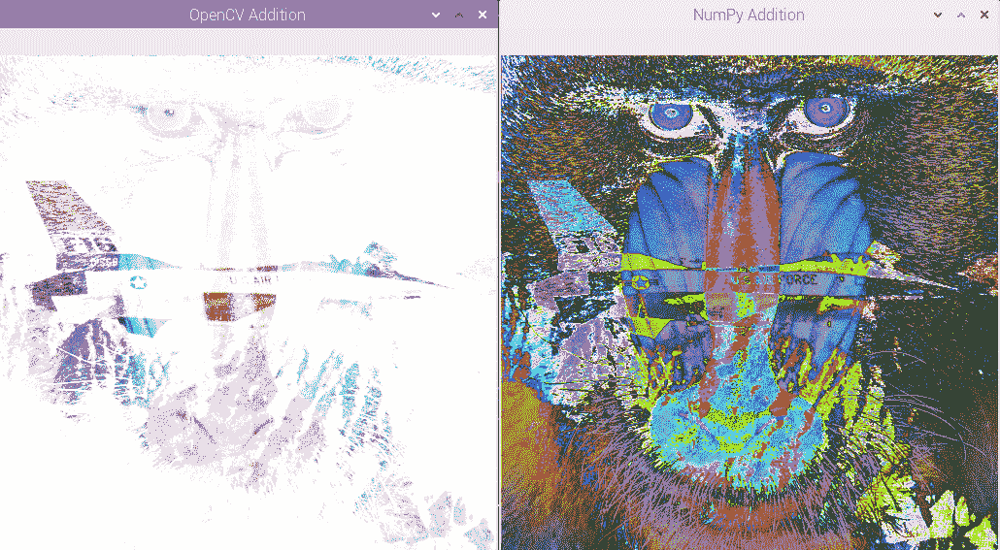
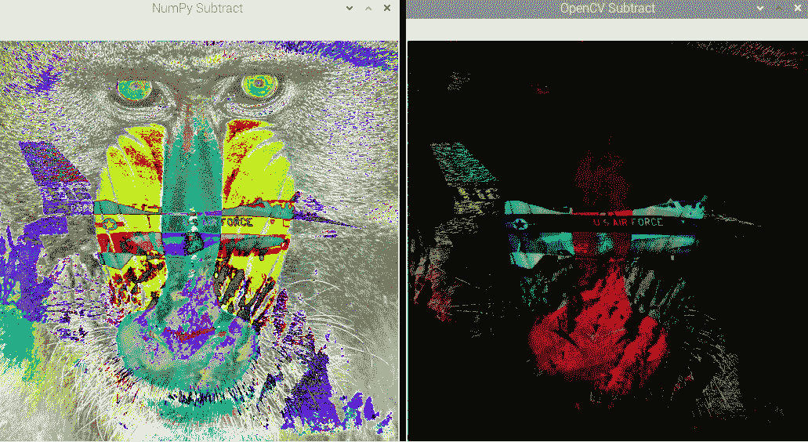
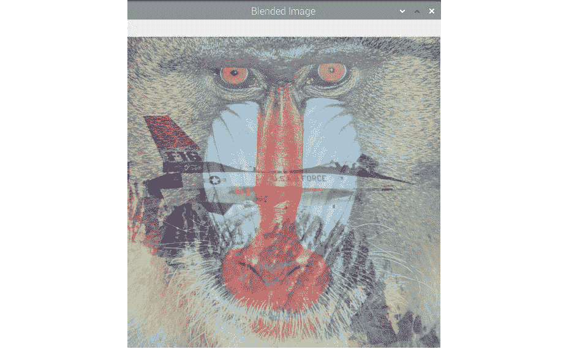

# 第 5 章：图像处理基础

在上一章中，我们了解并演示了用于图像处理和计算机视觉应用的捕获图像和视频的各种方法。 我们学习了如何广泛使用命令提示符和 Python 3 编程来读取图像以及与 USB 网络摄像头和 Raspberry Pi 摄像头模块进行接口。

在本章中，我们将研究如何使用 NumPy，OpenCV 和 **Matplotlib** 对图像执行基本的算术和逻辑运算。 我们还将详细了解不同的颜色通道和图像属性。

以下是本章将涵盖的主题列表：

*   检索图像属性
*   图像的基本操作
*   图像上的算术运算
*   融合和过渡图像
*   将图像与常数相乘
*   创建图像底片
*   图像上的按位逻辑运算

本章有许多使用 Python 3 编程的动手练习。 我们将使用许多概念，例如从磁盘读取图像并对其进行可视化，这是我们在本章中演示图像操作时在前几章中学到的。

# 技术要求

可以在 [GitHub](https://github.com/PacktPublishing/raspberry-pi-computer-vision-programming/tree/master/Chapter05/programs) 上找到本章的代码文件。

观看以下视频，以查看[这个页面](https://bit.ly/2V8vzev)上的“正在执行的代码”。

# 检索图像属性

我们可以使用 NumPy 检索和使用许多属性，例如图像的字节的数据类型，尺寸，形状和大小。 通过在命令提示符下运行`python3`命令来打开 Python 3 解释器。 然后，一个接一个地运行以下语句：

```py
>>> import cv2
>>> img = cv2.imread('/home/pi/book/dataset/4.1.01.tiff', 0)
>>> print(type(img))
```

以下是这些语句的输出：

```py
<class 'numpy.ndarray'>
```

前面的输出确认 OpenCV`imread()`函数读取图像并将其存储为 NumPy 的`ndarray`格式。 以下语句打印其读取的图像的尺寸：

```py
>>> print(img.ndim)
2
```

以灰度模式读取图像，这就是为什么它是二维图像。 它只有一个由灰度强度组成的通道。 现在，让我们看看它的形状：

```py
>>> print(img.shape)
(256, 256)
```

前面的语句以像素为单位打印高度和宽度。 让我们看看图像的大小：

```py
>>> print(img.size)
65536
```

如果我们也将图像的高度和宽度相乘，则会得到前面的数字。 让我们看看 NumPy`ndarray`的数据类型：

```py
>>> print(img.dtype)
uint8
```

这是 8 位无符号整数，用于存储像素的灰度强度值。 强度从`0`到`255`有所不同，这是 8 位无符号数据类型的限制。 每个像素消耗一些内存字节。 让我们看看如何找出它总共消耗了多少字节，如下所示：

```py
>>> print(img.nbytes)
65536
```

现在，让我们对彩色图像重复相同的练习。 为此，让我们在彩色模式下读取相同的图像：

```py
>>> img = cv2.imread('/home/pi/book/dataset/4.1.01.tiff', 1)
>>> print(type(img))
```

以下是此输出：

```py
<class 'numpy.ndarray'>
```

让我们检查尺寸数：

```py
>>> print(img.ndim)
3
```

我们已经以彩色模式读取了图像，它是三维 NumPy `ndarray`。 这两个维度之一表示高度和宽度，而其中一个维度表示颜色通道。 让我们现在检查形状：

```py
>>> print(img.shape)
(256, 256, 3)
```

前两个值代表像素的宽度和高度。 最后一个值代表通道数。 这些通道代表像素的蓝色，绿色和红色的强度值。 让我们看看图像的大小：

```py
>>> print(img.size)
196608
```

如果我们将先前输出中的所有三个数字相乘（`256`，`256`和`3`），我们将得到`19,6608`。`ndarray`的数据类型将相同（`uint8`）。 让我们确认一下：

```py
>>> print(img.dtype)
uint8
```

让我们看看图像在主内存中占据了多少字节：

```py
>>> print(img.nbytes)
196608
```

在下一节中，我们将学习有关图像的基本操作。

# 图像的基本操作

让我们执行的一些基本操作，例如拆分和合并彩色图像的通道以及向图像添加边框。 我们将以交互模式继续此演示。 让我们导入 OpenCV 并读取彩色图像，如下所示：

```py
>>> import cv2
>>> img = cv2.imread('/home/pi/book/dataset/4.1.01.tiff', 1)
```

对于任何图像，原点-`(0, 0)`像素-是左上角的像素。 通过运行以下语句，我们可以检索所有通道的强度值：

```py
>>> print(img[10, 10])
[34 38 44]
```

这些分别是像素（`10, 10`）的蓝色，绿色和红色通道的强度值。 如果只想访问单个通道的像素，请运行以下语句：

```py
>>> print(img[10, 10, 0])
34
```

前面的输出`34`是蓝色通道的强度。 同样，我们可以分别通过`img[10, 10, 0]`和`img[10, 10, 0]`访问绿色和红色通道。

## 将图像分成通道

让我们编写一个简单的程序，将图像分成其组成通道。 有多种方法可以做到这一点。 OpenCV 提供`split()`函数来执行此操作。 让我们看一下这个例子：

```py
>>> import cv2
>>> img = cv2.imread('/home/pi/book/dataset/4.1.01.tiff', 1)
>>> b, g, r = cv2.split(img)
```

上一个列表中的最后一条语句将彩色图像拆分为其组成通道。 我们还可以使用 NumPy`ndarray`索引，以一种更快的方法来分离通道，如下所示：

```py
>>> b = img[:, :, 0]
>>> g = img[:, :, 1]
>>> r = img[:, :, 2]
```

`split()`函数（从计算上来说）比以前的 NumPy 索引方法要昂贵一些。 我们还可以合并渠道，如下所示：

```py
>>> img1 = cv2.merge((b, g, r))
```

前面的代码合并所有组成通道以形成原始图像。 您可能还想创建一个 Python 3 脚本文件，向其中添加所有前面的代码，并使用`cv2.imshow()`函数可视化图像。

接下来，我们将学习如何为图像添加边框。

## 为图像添加边框

我们可以使用`copyMakeBorder()`函数在图像中添加边框。 它接受以下参数：

*   `src`：图像
*   `top`，`bottom`，`left`，`right`：以像素数表示的边框宽度
*   `borderType`: 边框的类型。 可以是以下类型之一：

    a）`cv2.BORDER_REFLECT`

    b）`cv2.BORDER_REFLECT_101`或`cv2.BORDER_DEFAULT`

    c）`cv2.BORDER_REPLICATE`

    d）`cv2.BORDER_WRAP`

    e）`cv2.BORDER_CONSTANT`：添加具有恒定颜色的边框。 边框颜色的值是以下参数。

*   `value`：边框类型为`cv2.BORDER_CONSTANT`时边框的颜色

让我们来看一些图像边框的例子。 考虑以下程序：

```py
import cv2
img = cv2.imread('/home/pi/book/dataset/4.1.01.tiff', 1)
b1 = cv2.copyMakeBorder(img, 10, 10, 10, 10, cv2.BORDER_WRAP)
b2 = cv2.copyMakeBorder(img, 10, 10, 10, 10, cv2.BORDER_CONSTANT, value=[255, 0, 0])
cv2.imshow('Wrap', b1)
cv2.imshow('Constant', b2)
cv2.waitKey(0)
cv2.destroyAllWindows()
```

前面代码的输出如下：



图 5.1 –边界演示

您可能要尝试其他一些边框选项。 下面的代码创建一个复制样式的边框：

```py
cv2.copyMakeBorder(img, 10, 10, 10, 10, cv2.BORDER_REPLICATE)
```

下面的代码创建一个不同的复制样式边框：

```py
cv2.copyMakeBorder(img, 10, 10, 10, 10, cv2.BORDER_REFLECT)
cv2.copyMakeBorder(img, 10, 10, 10, 10, cv2.BORDER_REFLECT_101)
```

这就是我们为图像创建各种类型的边框的方式。 在下一节中，我们将研究对图像执行算术运算。

# 对图像进行算术运算

我们知道图像只不过是 NumPy ndarrays ，我们可以对图像执行算术运算，就像我们可以对 ndarray 进行运算一样。 如果我们知道如何将数值或算术运算应用于矩阵，那么当这些运算的操作数是图像时，进行相同操作就不会有任何麻烦。 图像必须具有相同的大小，并且必须具有相同数量的通道，以便我们对它们执行算术运算，并且这些运算是在单个像素上执行的。 有许多算术运算，例如加法和减法。 首先是加法运算。 我们可以使用 OpenCV 中的 **NumPy 加法**或`add()`函数来添加两个图像，如下所示：

```py
import cv2
img1 = cv2.imread('/home/pi/book/dataset/4.2.03.tiff', 1)
img2 = cv2.imread('/home/pi/book/dataset/4.2.05.tiff', 1)
cv2.imshow('NumPy Addition', img1 + img2 )
cv2.imshow('OpenCV Addition', cv2.add(img1, img2))
cv2.waitKey(0)
cv2.destroyAllWindows()
```

以下是以上代码的输出：



图 5.2 –使用 OpenCV 和 NumPy 进行加法

我们可以清楚地看到出现在输出中的两个图像之间的差异。 原因是 OpenCV 的`add()`函数是饱和运算，而 NumPy 的加法运算符是模运算。 让我们详细了解这意味着什么。 以交互方式打开 Python 3 并运行以下语句：

```py
>>> import numpy as np
>>> import cv2
>>> a = np.array([240], np.uint8)
>>> b = np.array([20], np.uint8)
>>> a + b
array([4], dtype=uint8)
```

我们知道，`uint8`可以存储的最大值是`255`。 然后，将超出`255`的任何值除以`256`，余数存储在`uint8`数据类型中：

```py
>>> cv2.add(a, b)
array([[255]], dtype=uint8)
```

如您在前面的代码中所见，对于`cv2.add()`，它仅将`255`的值设置为`255` `uint8`数据类型。

同样，我们可以使用 NumPy 减法和`cv2.subtract()`计算减法。 以下是一个示例：

```py
import cv2
img1 = cv2.imread('/home/pi/book/dataset/4.2.03.tiff', 1)
img2 = cv2.imread('/home/pi/book/dataset/4.2.05.tiff', 1)
cv2.imshow('NumPy Subtract', img1 - img2)
cv2.imshow('OpenCV Subtract', cv2.subtract(img1, img2))
cv2.waitKey(0)
cv2.destroyAllWindows()
```

以上代码的结果如下：



图 5.3 –用 NumPy 和 OpenCV 减去

让我们尝试一个练习，以交互模式理解使用 NumPy 的减法运算和使用 OpenCV 的减法运算之间的区别，如下所示：

```py
>>> import cv2
>>> import numpy as np
>>> a = np.array([240], np.uint8)
>>> b = np.array([20], np.uint8)
>>> b - a
array([36], dtype=uint8)
```

我们知道`uint8`可以存储的最低编号是`0`。 如果数字为负，则 NumPy 将`uint8`数据类型添加为`256`：

```py
>>> cv2.subtract(b, a)
array([[0]], dtype=uint8)
```

如所示，在`cv2.subtract()`的情况下，对于`uint8`数据类型，负值仅四舍五入为`0`。

注意：

我们知道减法运算不是可交换的。 这意味着`a – b`在大多数情况下不等于`b – a`。 因此，如果两个图像的大小和类型都相同，则`cv2.subtract(img1, img2)`和`cv2.subtract(img2, img1)`会产生不同的结果。 但是，加法运算是可交换的。 因此，`cv2.add(img1, img2)`和`cv2.add(img2, img1)`总是产生相同的结果。

# 融合和过渡图像

`cv2.addWeighted()`函数计算我们将作为参数传递的两个图像的加权和。 这导致它们融合。 以下是演示此混合概念的一些代码：

```py
import cv2
img1 = cv2.imread('/home/pi/book/dataset/4.2.03.tiff', 1)
img2 = cv2.imread('/home/pi/book/dataset/4.2.05.tiff', 1)
cv2.imshow('Blended Image',
           cv2.addWeighted(img1, 0.5, img2, 0.5, 0))
cv2.waitKey(0)
cv2.destroyAllWindows()
```

在前面的代码中，我们将以下五个参数传递给 OpenCV `cv2.addWeighted()`函数：

*   `img1`：第一张图片
*   `alpha`：第一张图片的系数（在前面的示例中为`0.5`）
*   `img2`：第二张图片
*   `beta`：第二张图片的系数（在前面的示例中为`0.5`）
*   `gamma`：标量值（在前面的示例中为`0`）

OpenCV 使用以下公式来计算输出图像：

```py
输出图像 = (alpha * img1) + (beta * img2) + gamma
```

使用此公式计算输出图像的每个像素，以下是前面代码的输出：



图 5.4 –图像融合

我们可以使用相同的 OpenCV 功能来创建过渡效果（在电影和视频编辑软件中可以看到）。 下面的代码示例创建从一个图像到另一个图像的非常平滑的过渡：

```py
import cv2
import time
import numpy as np
img1 = cv2.imread('/home/pi/book/dataset/4.2.03.tiff', 1)
img2 = cv2.imread('/home/pi/book/dataset/4.2.05.tiff', 1)
for i in np.linspace(0, 1, 100):
    alpha = i
    beta = 1-alpha
    print('ALPHA =' + str(alpha) + ' BETA =' + str(beta))
    cv2.imshow('Image Transition',
    cv2.addWeighted(img1, alpha, img2, beta, 0))
    time.sleep(0.05)
    if cv2.waitKey(1) == 27 :
        break
cv2.destroyAllWindows()
```

前面代码的输出将创建过渡效果。

我们还可以使用跟踪栏创建一个不错的应用程序，如下所示：

```py
import cv2
import time
import numpy as np
def emptyFunction():
    pass
img1 = cv2.imread('/home/pi/book/dataset/4.2.03.tiff', 1)
img2 = cv2.imread('/home/pi/book/dataset/4.2.05.tiff', 1)
output = cv2.addWeighted(img1, 0.5, img2, 0.5, 0)
windowName = "Transition Demo"
cv2.namedWindow(windowName)
cv2.createTrackbar('Alpha', windowName, 0,
                   1000, emptyFunction)
while(True):
    cv2.imshow(windowName, output)
    if cv2.waitKey(1) == 27:
        break
    alpha = cv2.getTrackbarPos('Alpha', windowName) / 1000
    beta = 1 - alpha
    output = cv2.addWeighted(img1, alpha, img2, beta, 0)
    print(alpha, beta)
cv2.destroyAllWindows()
```

前面代码的输出创建了一个不错的过渡应用程序。 我们甚至可以在上拉配置中将两个按钮连接到 Raspberry Pi 的 GPIO，如下所示：


图 5.5 –带有按钮的电路

我们可以编写以下代码，以将按钮与图像转换功能集成在一起：

```py
import time
import RPi.GPIO as GPIO
import cv2
alpha = 0
img1 = cv2.imread('/home/pi/book/dataset/4.2.03.tiff', 1)
img2 = cv2.imread('/home/pi/book/dataset/4.2.05.tiff', 1)
GPIO.setmode(GPIO.BOARD)
GPIO.setwarnings(False)
button1 = 7
button2 = 11
GPIO.setup(button1, GPIO.IN, GPIO.PUD_UP)
GPIO.setup(button2, GPIO.IN, GPIO.PUD_UP)
while True:
    button1_state = GPIO.input(button1)
    if button1_state == GPIO.LOW and alpha < 1:
        alpha = alpha + 0.2
    button2_state = GPIO.input(button2)
    if button2_state == GPIO.LOW:
        if (alpha > 0):
            alpha = alpha - 0.2
    if (alpha < 0):
        alpha = 0
    beta = 1 - alpha
    output = cv2.addWeighted(img1, alpha, img2, beta, 0)
    cv2.imshow('Transition App', output)
    if cv2.waitKey(1) == 27:
        break
    time.sleep(0.5)
    print(alpha)
cv2.destroyAllWindows()
```

按下按钮，前面的代码将更改`alpha`变量的值和图像的混合比例。 运行前面的程序，然后按按钮查看操作。 在本书中，我们将使用前面的电路和程序作为许多程序的模板。

在下一节中，我们将了解如何将图像彼此和常数相乘。

# 将图像乘以一个常数

就像普通的矩阵或 NumPy ndarrays 一样，图像可以乘以一个常数并彼此相乘。 我们可以将图像乘以一个常数，如下所示：

```py
import cv2
img1 = cv2.imread('/home/pi/book/dataset/4.2.03.tiff', 1)
img2 = cv2.imread('/home/pi/book/dataset/4.2.05.tiff', 1)
cv2.imshow('Image1', img1 * 2)
cv2.waitKey(0)
cv2.destroyAllWindows()
```

在前面的代码中，表示图像的`ndarray`的每个元素都与`2`相乘。 运行前面的程序，然后查看输出。 我们还可以将图像彼此相乘，如下所示：

```py
cv2.imshow('Image1', img1 * 2)
```

结果可能看起来像噪音。

# 创建图像底片

就纯数学而言，当我们反转图像的颜色时，它将创建图像的负片。 可以通过从`255`中减去像素的颜色来计算此反转操作。 如果是彩色图像，我们反转所有平面的颜色。 对于灰度图像，我们可以通过从`255`中减去它来直接计算反演，如下所示：

```py
import cv2
img = cv2.imread('/home/pi/book/dataset/4.2.07.tiff', 0)
negative = abs(255 - img)
cv2.imshow('Grayscale', img)
cv2.imshow('Negative', negative)
cv2.waitKey(0)
cv2.destroyAllWindows()
```

以下是的输出：


图 5.6 –图像的底片

尝试查找彩色图像的底片，我们只需要在前面的程序中以彩色模式读取图像即可。

注意：

负片的负片将是原始灰度图像。 您可以自己计算一次，方法是再次为我们的彩色和灰度图像计算负片的负片。

# 对图像进行按位逻辑运算

OpenCV 库具有许多用于计算图像上按位逻辑运算的功能。 我们可以计算按位逻辑**和**，**或**，**异或**（**XOR**），而**不计算**（反转）操作。 演示这些功能如何工作的最佳方法是将其与二进制（黑白）图像一起使用：

```py
import cv2
import numpy as np
import matplotlib.pyplot as plt
a = [0, 255, 0]
img1 = np.array([a, a, a], dtype=np.uint8)
img2 = np.transpose(img1)
not_out = cv2.bitwise_not(img1 )
and_out = cv2.bitwise_and(img1, img2)
or_out = cv2.bitwise_or(img1, img2)
xor_out = cv2.bitwise_xor(img1, img2)
titles = ['Image 1', 'Image 2', 'Image 1 NOT', 'AND', 'OR', 'XOR']
images = [img1, img2, not_out, and_out, or_out, xor_out]
for i in range(6):
        plt.subplot(2, 3, i+1)
        plt.imshow(images[i], cmap='gray')
        plt.title(titles[i])
        plt.axis('off')
plt.show()
```

我们创建了自己的自定义二进制图片，以更好地演示按位逻辑**非**，**和**，**或**和**异或**操作的功能， 分别。 我们将使用 **Matplotlib** 库`plt.subplot()`函数来同时可视化多个图像。

在前面的示例中，我们创建了一个两行三列的网格，以显示原始输入图像和使用 OpenCV 函数的按位逻辑运算的计算输出。 每个图像显示在网格的一部分中。 第一个位置在左上角，第二个位置与左上角相邻，依此类推。 我们可以更改行并将其设置为`plt.subplot(3, 2, i + 1)`，以创建一个三行两列的网格。 本书稍后还将使用这种技术。 我们将使用它在单个输出窗口中并排显示图像。

我们也可以不循环使用`plt.subplot()`函数。 对于每个图像，我们必须在下面的语句集中编写。 我正在为一个图像编写代码块。 为其他图像写相同的内容：

```py
plt.subplot(2, 3, 1)
plt.imshow(img1, cmap='gray')
plt.title('Image 1')
plt.axis('off')
```

最后，我们使用`plt.show()`函数的调用在屏幕上显示所有内容。 我们使用这种技术来显示两个或三个图像。 如果我们有更多的图像，则可以使用循环技术在同一输出窗口中显示多个图像。 以下是我们的输出：


图 5.7 –图像上的逻辑操作

您可能想要为灰度和彩色图像上的按位逻辑操作实现代码。

注意：

通过使用 NumPy 的逻辑运算，我们也可以达到相同的结果。

# 摘要

在本章中，我们首先介绍使用 OpenCV 和 NumPy 进行图像处理。 我们了解了一些重要概念，例如图像通道，算术和逻辑运算以及图像的负片。 在此过程中，我们还学会了在 Python 3 和 NumPy 库中使用更多功能。 我们今天学习的按位逻辑运算在下一章中编写用于按颜色进行对象跟踪功能的程序时将非常有用。

在下一章中，我们将研究色彩空间，变换和阈值图像。