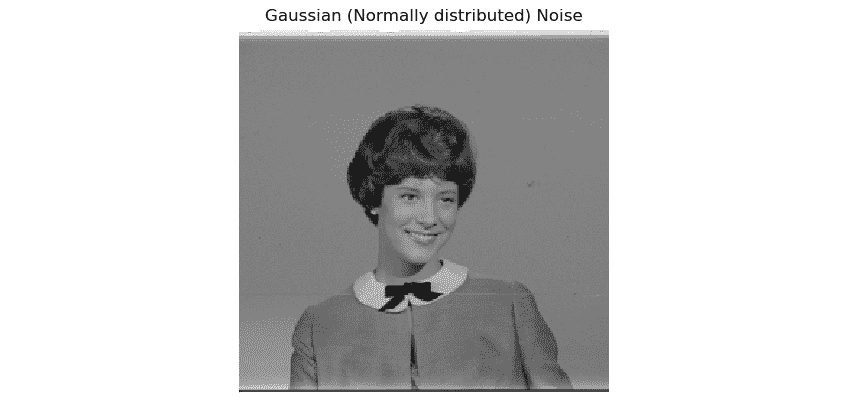
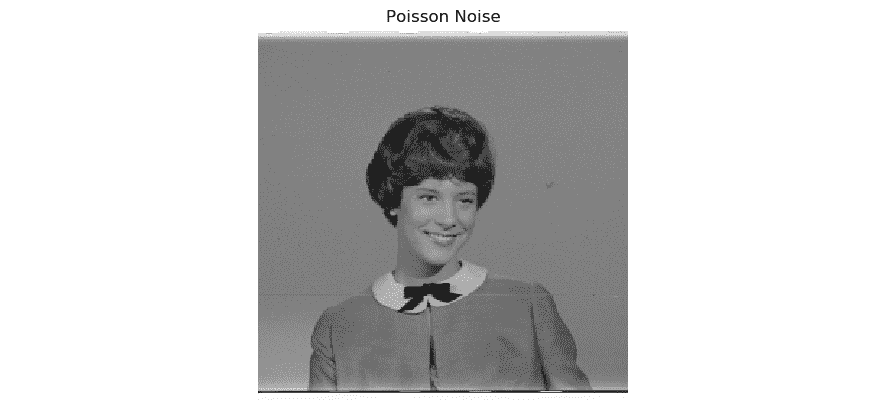
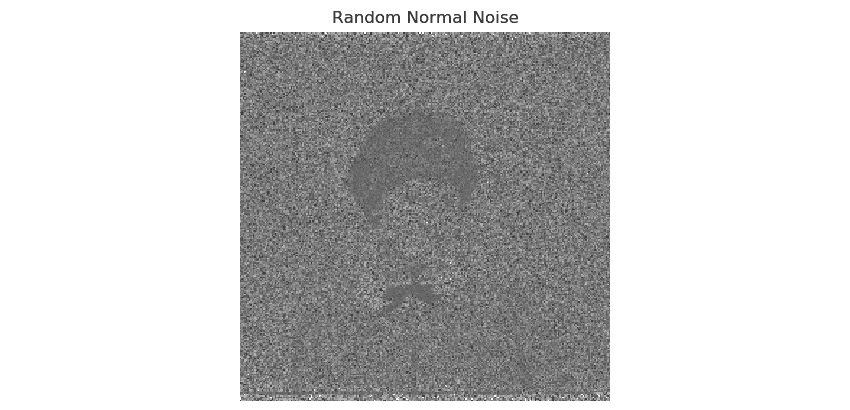
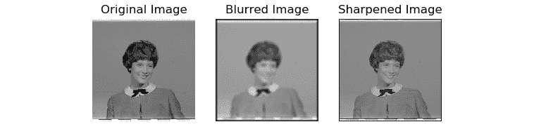

# 第 7 章：让我们发出一些声音

在上一章中，我们学习并演示了色彩空间的概念及其转换，数学变换和阈值运算。

在本章中，我们将学习和演示与噪声和滤波有关的概念。 整章致力于详细了解噪声的概念。 首先，我们将学习如何深度模拟各种类型的噪声模式。 然后，我们将学习并演示如何使用图像内核和卷积运算。 我们还将学习如何使用卷积运算来应用各种类型的过滤器。 最后，我们将学习低通过滤器的基础知识，并演示如何使用它们执行模糊和噪声消除操作。

我们还将使用 GPIO 进行演示。 在本章中，我们将介绍以下主题：

*   噪声
*   使用内核
*   使用 SciPy 中的信号处理模块进行 2D 卷积
*   使用 OpenCV 过滤和模糊

完成本章后，您将可以处理嘈杂的图像并减少其中的噪点。

# 技术要求

可以在 [GitHub](https://github.com/PacktPublishing/raspberry-pi-computer-vision-programming/tree/master/Chapter07/programs) 上找到本章的代码文件。

观看以下视频，以查看[这个页面](https://bit.ly/3i7iagG)上的“正在执行的代码”。

# 噪音

让我们详细了解噪声的概念。 在信号处理领域，噪声仅仅是与期望信号混合的任何不想要的信号。 当我们谈论图像或视频中的噪声时，可以将噪声定义为像素强度和颜色的不希望有的变化。 这种噪声可能来自多个来源。

一些示例包括相机镜头上的灰尘，胶卷中的颗粒（在模拟摄影和胶卷制作中很需要这种颗粒），CCD 传感器及其存储中的错误，发送和接收期间的错误以及扫描照片时的错误。 不需要非常高的噪声。 这是因为高噪声会减少有用和预期的信号，从而影响图像质量。

我们可以用以下公式数学表示信噪比：


注意：

较高的信噪比意味着有关信号和图像的更好的质量。

## 向图像引入噪点

如上一节所述，可能有多个噪声源。 我们还可以通过模拟各种类型的噪声将噪声引入数字图像。 在本节中，我们将学习如何模拟椒盐噪声，高斯噪声，泊松噪声和随机法线噪声。

### 椒盐声

在任何图像中随机引入白色（盐）像素和黑色（胡椒粉）像素称为**椒盐噪声**。 我们可以将其介绍给任何灰度图像，如下所示：

```py
import numpy as np
import cv2
import random
import matplotlib.pyplot as plt
img = cv2.imread('/home/pi/book/dataset/4.1.03.tiff', 0)
output = np.zeros(img.shape, np.uint8)
p = 0.05
for i in range (img.shape[0]):
    for j in range(img.shape[1]):
        r = random.random()
        if r < p/2:
            output[i][j] = 0
        elif r < p:
            output[i][j] = 255
        else:
            output[i][j] = img[i][j]
plt.imshow(output, cmap='gray')
plt.title('Salt and Pepper Sprinkled')
plt.axis('off')
plt.show()
```

在前面的代码中，噪声密度（由`p`表示）设置为`0.05`。 我们为每个像素生成一个随机数，如果它小于 **p / 2**，则将像素设置为黑色。 如果它介于 **p / 2** 和`p`之间，则将像素设置为白色。 否则，像素不会被修改。 由于我们使用`random.random()`函数生成噪声，因此每次执行程序时生成的噪声都是不同的。 引入了噪声的输出如下所示：


图 7.1 –盐和胡椒粉噪声

我们可以创建一个小型应用，使用实时网络摄像头 Feed 中的按钮来调整自定义引入的噪声。 现在，在上拉模式下将两个按钮连接到 RPi 的 7 和 11 GPIO 引脚，并编写以下程序：

```py
import RPi.GPIO as GPIO
import cv2
import numpy as np
import random
p = 0.00
cap = cv2.VideoCapture(0)
ret, frame = cap.read()
output = np.zeros(frame.shape, np.uint8)
GPIO.setmode(GPIO.BOARD)
GPIO.setwarnings(False)
button1 = 7
button2 = 11
GPIO.setup(button1, GPIO.IN, GPIO.PUD_UP)
GPIO.setup(button2, GPIO.IN, GPIO.PUD_UP)
```

在前面的代码中，我们正在初始化 RPi 的 GPIO，并且还将为 USB 网络摄像头创建对象。 现在，让我们编写逻辑来调整按下按钮时得到的噪声量：

```py
while True:
    ret, frame = cap.read()
    button1_state = GPIO.input(button1)
    if button1_state == GPIO.LOW and p <= 0.1:
        p = p + 0.01
    if p > 0.1:
        p = 0.1
    button2_state = GPIO.input(button2)
    if button2_state == GPIO.LOW and p > 0:
        p = p - 0.01
    if p < 0:
        p = 0
    for i in range (frame.shape[0]):
        for j in range(frame.shape[1]):
            r = random.random()
            if r < p/2:
                output[i][j] = 0, 0, 0
            elif r < p:
                output[i][j] = 255, 255, 255
            else:
                output[i][j] = frame[i][j]
    print(p)
    cv2.imshow('Salt and pepper Noise App', output)
    if cv2.waitKey(1) == 27:
        break
cap.release()
cv2.destroyAllWindows()
```

前面的程序在计算上很昂贵，因为我们正在连续计算噪声和输出图像。 如果您遇到低帧速率，请降低连接到 RPi 的 USB 网络摄像头的分辨率。 代码的输出将类似于上图所示。

### 高斯噪声

这种噪声以数学家*卡尔·弗里德里希·高斯*的名字命名，因为噪声的值呈正态分布（也称为**高斯分布**）。 我们可以模拟这种类型的噪声，如下所示：

```py
import numpy as np
import cv2
import matplotlib.pyplot as plt
img = cv2.imread('/home/pi/book/dataset/4.1.03.tiff', 0)
row, col = img.shape
img = img.astype(np.float32)
mean = 0
var = 0.1
sigma = var**0.5
gauss = np.random.normal(mean, sigma, (row, col))
gauss = gauss.reshape(row, col)
noisy = img + gauss
print(abs(noisy-img))
plt.imshow(noisy, cmap='gray')
plt.title('Gaussian (Normally distributed) Noise')
plt.axis('off')
plt.show()
```

前面的代码在灰度图像上分别模拟 0 和`1`的均值和方差的高斯噪声。 我们首先将图像从 **uint8** 转换为 **float32**，因为噪声点可能具有浮点值。 我们正在使用`np.random.normal()`函数来计算噪声的数据点。 请注意，它产生的噪声量取决于均值和方差的值。 对于我们使用的值，噪声对我们而言是不可感知的。 运行代码并查看输出。 将如下所示：



图 7.2 –高斯（正态分布）噪声

### 噪音鱼

根据泊松曲线分布的噪声称为**泊松噪声**。 也称为**散粒噪声**。 发生此现象是由于光中的粒子性质。 让我们看一些示例代码，其中我们将泊松噪声引入图像：

```py
import numpy as np
import cv2
import matplotlib.pyplot as plt
img = cv2.imread('/home/pi/book/dataset/4.1.03.tiff', 0)
img = img.astype(np.float32)
vals = len(np.unique(img))
vals = 2 ** np.ceil(np.log2(vals))
noisy = np.random.poisson(img * vals) / float(vals)
print(abs(noisy-img))
plt.imshow(noisy, cmap='gray')
plt.title('Poisson Noise')
plt.axis('off')
plt.show()
```

`np.random.poisson()`函数产生沿泊松曲线分布的随机数据点。 这些数据点将添加到图像中，以创建具有泊松噪声的噪点图像。 运行前面的代码并查看输出。 将如下所示：



图 7.3 –泊松噪声

### 随机正常噪声

我们已经看到了一个高斯正常噪声的例子。 我们还可以生成随机的正常噪声，如下所示：

```py
import numpy as np
import cv2
import matplotlib.pyplot as plt
img = cv2.imread('/home/pi/book/dataset/4.1.03.tiff', 0)
img = img.astype(np.float32)
row, col = img.shape
rand_noise = np.random.randn(row, col)
rand_noise = rand_noise.reshape(row, col)
noisy = img + img * rand_noise
print(abs(noisy-img))
plt.imshow(noisy, cmap='gray')
plt.title('Random Normal Noise')
plt.axis('off')
plt.show()
```

在前面的代码中，NumPy `np.random.randn()`函数创建随机噪声的数据点，然后将其添加到图像中。 这将产生带有随机噪声的图像。 运行前面的代码并查看输出。 将如下所示：



图 7.4 –泊松噪声

# 使用内核

现在，让我们学习有关内核的。 我们将学习如何使用内核进行信号和图像处理操作。 核是平方数值矩阵。 根据内核的大小和组件，如果将内核与图像进行卷积，则会得到模糊或锐化的输出。 内核用于各种图像处理操作。

让我们看一个用于平均的简单内核的示例。 可以用以下公式表示：


通过使用前面的公式，大小为 3x3 的平均内核可以表示为：


行数和列数的值始终为奇数且始终相同。 它们都是正方形矩阵。

我们可以使用下面的 NumPy 代码创建前面的内核：

```py
K = np.ones((3, 3), np.uint8)/9
```

现在，我们将学习如何使用前面的内核和其他内核来处理数据集中的样本图像。

# 使用 SciPy 中的信号处理模块进行 2D 卷积

现在，让我们看一下卷积的数学背景。 卷积就是在理解一个函数的形状如何受到另一个函数的影响。 计算它的过程和所得函数被称为卷积。 我们可以对 1D，2D 和多维数据进行卷积。 信号是多维实体。 图像是一种信号。 因此，我们可以将卷积应用于图像。

注意

您可以在[这个页面](http://www.songho.ca/dsp/convolution/convolution2d_example.html)上了解有关卷积的更多信息。

我们可以对具有各种内核的图像执行卷积运算以处理图像。 为此，我们将学习如何使用 SciPy 的**信号**模块。 让我们使用以下命令安装 SciPy 库：

```py
pip3 install scipy
```

我们可以对具有各种内核的图像执行卷积运算以处理图像。 对 2D 数据执行卷积的函数是`signal.convolve2d()`。 我们必须传递一个灰度图像和一个核作为参数，然后计算给定数据的卷积。 以下是一个示例：

```py
import scipy.signal
import numpy as np
import matplotlib.pyplot as plt
import cv2
img = cv2.imread('/home/pi/book/dataset/4.1.03.tiff', 0)
k1 = np.ones((7, 7), np.uint8)/49
blurred = scipy.signal.convolve2d(img, k1)
k2 = np.array([[0, -1, 0],
                   [-1, 25, -1],
                   [0, -1, 0]], dtype=np.int8)
sharpened = scipy.signal.convolve2d(img, k2)
plt.subplot(131)
plt.imshow(img, cmap='gray')
plt.title('Original Image')
plt.axis('off')
plt.subplot(132)
plt.imshow(blurred, cmap='gray')
plt.title('Blurred Image')
plt.axis('off')
plt.subplot(133)
plt.imshow(sharpened, cmap='gray')
plt.title('Sharpened Image')
plt.axis('off')
```

输出如下：



图 7.5 –使用内核执行操作

正如预期的那样，模糊内核产生了模糊的输出，锐化内核产生了锐化的图像。 您可能需要更改内核并观察图像上的效果。

# 使用 OpenCV 进行过滤和模糊处理

OpenCV 还具有许多过滤和卷积功能。 这些过滤功能为`cv2.filter2D()`， `cv2.boxFilter()`， `cv2.blur()`， `cv2.GaussianBlur()`， `cv2.medianBlur()`， `cv2.sepFilter2D()`和`cv2.BilateralFilter()`。 在本节中，我们将详细探讨所有这些功能。

## 二维卷积滤波

`cv2.filter2D()`函数与`scipy.signal.convolve2d()`函数一样，使内核与图像卷积，从而对图像应用线性过滤器。 `cv2.filter2D()`函数的优点是我们可以将其应用于具有两个以上维的数据。 我们也可以将其应用于彩色图像。

此函数接受输入图像，输出图像的深度（-1 表示输入和输出具有相同的深度），以及用于卷积运算的内核作为参数。 以下代码演示了此功能的用法：

```py
import cv2
import numpy as np
from matplotlib import pyplot as plt
img = cv2.imread('/home/pi/book/dataset/4.2.03.tiff', 1)
input = cv2.cvtColor(img, cv2.COLOR_BGR2RGB)
output = cv2.filter2D(input, -1, np.ones((15, 15), np.uint8)/225)
plt.subplot(121)
plt.imshow(input)
plt.title('Input')
plt.axis('off')
plt.subplot(122)
plt.imshow(output)
plt.title('Output')
plt.axis('off')
plt.show()
```

以下是输出：


图 7.6 –同一图像的过滤和模糊版本

注意：

[您可以在以下 URL 上找到有关卷积的交互式教程](http://micro.magnet.fsu.edu/primer/java/digitalimaging/processing/kernelmaskoperation/)

## 低通滤波

如前所述，低通过滤器允许低频分量通过它们。 边缘和噪声通常是高频分量。 这些被过滤掉。 因此，低通过滤器非常适合消除噪声，模糊和平滑图像。

OpenCV 库提供了用于执行低通滤波的现成函数。 我们不必从头开始编写程序即可应用低通过滤器。 这些函数具有用其定义编写的内核代码。 我们只需要将参数传递给函数，函数就会自动创建内核并将其应用于映像。

`cv2.boxFilter()`函数接受输入源图像 **ddepth** 以及内核大小作为参数，将内核应用于输入图像，然后返回模糊图像 作为输出。 最后一个参数是**规范化**，可以将其传递为 **True** 或 **False** 的布尔值。 这将决定输出是否被标准化。 如果通过 **True** 值进行归一化，则输出乘以 *1 /（行数*列数），*会创建归一化框式滤镜效果，如果通过 如果**值为**，则将输出乘以`1`，这将产生非标准化的框式滤镜效果。

下面的行向我们展示了标准化框式过滤器的示例：

```py
output = cv2.boxFilter(input, -1, (3, 3), normalize=True)
```

下面的行向我们展示了一个非规范化框过滤器的示例：

```py
output = cv2.boxFilter(input, -1, (3, 3), normalize=False)
```

`cv2.blur()`函数直接创建归一化框过滤器并将其应用于图像。 我们必须将源输入图像和内核的大小作为参数传递。 我们不必指定是否要标准化输出。 默认情况下，这将产生标准化输出。 以下两行产生相同的输出：

```py
output = cv2.blur(input, (3, 3))
output = cv2.boxFilter(input, -1, (3, 3), normalize=True)
```

OpenCV `cv2.GaussianBlur()`函数将高斯内核应用于输入图像。 我们必须将输入源图像和内核大小作为参数传递给此函数的调用。 第三个参数是 X 轴方向上的标准偏差。 我们为此传递了 0 作为参数。 此功能可以滤除图像中的所有高斯噪声。 以下是此代码示例：

```py
output = cv2.GaussianBlur(input, (3, 3), 0)
```

OpenCV `cv2.medianBlur()`函数应用中值过滤器并返回模糊图像。 该滤镜对于具有椒盐味类型的噪点的图像非常有效。 我们需要传递源输入图像和一个定义方阵大小的数字作为调用此函数的参数，如下所示：

```py
output = cv2.medianBlur(img, 3)
```

此函数计算内核成员所有值的中位数。 内核中心的值替换为中值的计算值。 这是滑动窗口类型的过滤器，其中内核矩阵的窗口在图像的矩阵上滑动，并且图像中与内核矩阵的中心重叠的像素通过卷积运算使用计算得到的值进行处理。 中位数。

`cv2.sepFilter2D()`函数将可分离的线性过滤器应用于图像。 以下是一个示例函数调用：

```py
output = cv2.sepFilter2D(img, ddepth=-1, kernelX=1, kernelY=1, delta=1)
```

在前面的函数调用中，我们具有以下内容：

*   **ddepth**：输出图像的深度（如果源图像和目标图像相同，则为 **-1**）
*   **kernelX**：用于过滤每行的系数
*   **kernelY**：用于过滤各列的系数
*   **增量**：添加到过滤结果中的常量值

作为本章的练习，您可能要在其中一个程序中使用`cv2.BilateralFilter()`函数来过滤图像。

# 摘要

在本章中，我们了解了噪声和低通滤波技术以及如何将其用于平滑图像。 如果我们希望从图像中消除各种类型的噪点，我们在本章中学习的技术将非常有用。 在编写用于实际应用程序（例如，使用 USB 网络摄像头实时检测运动）的程序时，将使用这些技术来消除，平滑和模糊噪声。

在下一章中，我们将研究高通滤波技术以及如何使用 OpenCV 提供的实现各种数学形态学运算符的各种功能来检测边缘。