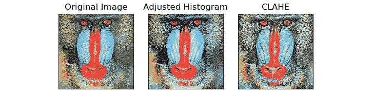
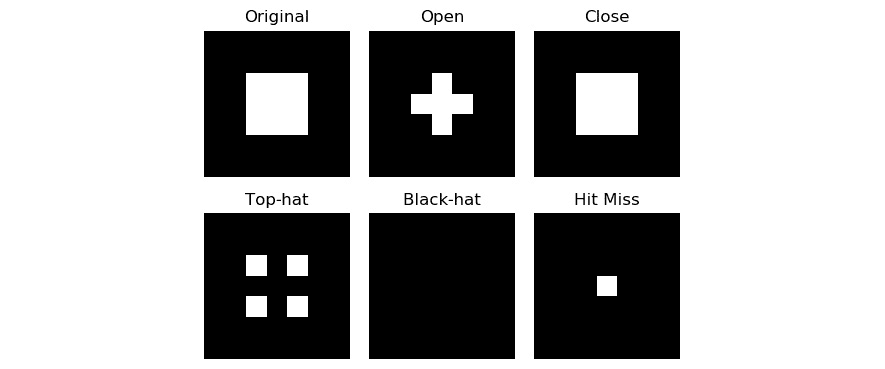

# 第 10 章：直方图，轮廓和形态转换

在上一章中，我们了解并演示了围绕图像处理和计算机视觉领域的基本和中级概念。

从本章开始，我们将学习并演示高级概念，这些概念将使我们为编写现实生活中的应用程序做好准备。 首先，我们将研究使用`ndarray`计算直方图的理论基础。 然后，我们将学习如何针对灰度和彩色图像通道进行计算。 我们还将学习如何计算和可视化轮廓。 最后，我们将详细了解各种数学形态学运算，并演示如何将其与各种结构元素结合使用。 我们将学习并演示以下主题：

*   计算和可视化直方图
*   可视化图像轮廓
*   将形态学变换应用于图像

完成本章后，您将可以轻松地使用本文中讨论的所有概念。 在为计算机视觉领域的实际应用编写代码时，这些概念非常有用。

# 技术要求

可以在 [GitHub](https://github.com/PacktPublishing/raspberry-pi-computer-vision-programming/tree/master/Chapter10/programs) 上找到本章的代码文件。

观看以下视频，以查看[这个页面](https://bit.ly/2NsLkZv)上的“正在执行的代码”。

# 计算和可视化直方图

直方图是数据分布的图形表示。 基本上，它是频率分布表的图形。 让我通过一个例子对此进行解释。 假设我们有一个数据集，例如（1、2、1、3、4、1、2、3、4、4、2、3、4）。 在这里，频率分布如下所示：


图 10.1 –频率分布

如果我们用绘制条形图，以便`x`轴表示元素，而`y`轴表示元素出现的频率，则 被称为**直方图**。 我们可以使用`np.histogram()`来计算直方图。 `plt.hist()`可以计算并直接绘制它。 让我们编写一些代码，这些代码将使用这两个函数来解释上表中的数据：

```py
import numpy as np
import matplotlib.pyplot as plt
a = np.array([1, 2, 1, 3, 4, 1, 2, 3, 4, 4, 2, 3, 4])
hist, bins = np.histogram(a)
print(hist)
print(bins)
plt.hist(a)
plt.show()
```

输出如下：


图 10.2 – ndarray 的直方图

灰色阴影或颜色色调的出现的图形表示称为图像的直方图。 在图像的直方图中，我们在 X 轴上具有灰色阴影或颜色色调的值。 Y 轴代表，对于灰度图像，这些灰色阴影出现的次数，对于彩色图像，代表颜色的色调。

灰色或彩色图像的强度值在 X 轴上始终介于 0 到 255 之间。 Y 轴显示像素数。 对于灰度图像，将为完整图像计算直方图，而对于彩色图像，我们将分别计算颜色通道的直方图。

对于彩色图像，我们可以计算通道方向的直方图。 以下程序将灰度图像的直方图可视化：

```py
import numpy as np
import matplotlib.pyplot as plt
import cv2
img = cv2.imread('/home/pi/book/dataset/boat.512.tiff', 0)
plt.subplots_adjust(hspace=0.25, wspace=0.25)
plt.subplot(1, 2, 1)
plt.imshow(img, cmap='gray')
plt.axis('off')
plt.title('Original Image')
plt.subplot(1, 2, 2)
hist, bins = np.histogram(img.ravel(),
                          bins=256,
                          range=(0, 255))
plt.bar(bins[:-1], hist)
plt.title('Histogram')
plt.show()
```

在前面的代码中，`plt.subplots_adjust(hspace = 0.25, wspace = 0.25)`函数调用调整了子图中的图像之间的水平和垂直空间。 我们正在使用`np.histogram()`来计算图像的直方图。 我们正在使用`ravel()`函数来使图像变平。

我们知道灰度的强度级别在 0 到 255 之间。因此，我们正在传递有关 bin 和 range 的相关参数。 最后，我们使用`plt.bar()`使用条形图绘制直方图。 以下是输出：


图 10.3 –灰度图像的直方图

我们甚至可以使用`plt.hist()`函数来计算相同的直方图。 只需将包含`np.histogram()`和`plt.bar()`的行替换为以下行：

```py
plt.hist(img.ravel(), bins=256, range=(0, 255))
```

输出如下：


图 10.4 –灰度图像的直方图

正如我们所看到的，两种方法都产生相同的输出。 我们可以为彩色图像的所有通道计算直方图，并使用`plt.hist()`显示它们，如下所示：

```py
import numpy as np
import matplotlib.pyplot as plt
import cv2
img = cv2.imread('/home/pi/book/dataset/house.tiff', 1)
b = img[:, :, 0]
g = img[:, :, 1]
r = img[:, :, 2]
plt.subplots_adjust(hspace=0.5, wspace=0.25)
plt.subplot(2, 2, 1)
plt.imshow(cv2.cvtColor(img, cv2.COLOR_BGR2RGB),
           cmap='gray')
plt.axis('off')
plt.title('Original Image')
plt.subplot(2, 2, 2)
plt.hist(r.ravel(), bins=256, range=(0, 255), color='r')
plt.title('Red Histogram')
plt.subplot(2, 2, 3)
plt.hist(g.ravel(), bins=256, range=(0, 255), color='g')
plt.title('Green Histogram')
plt.subplot(2, 2, 4)
plt.hist(b.ravel(), bins=256, range=(0, 255), color='b')
plt.title('Blue Histogram')
plt.show() 
```

输出为，如下所示：


图 10.5 –彩色图像的直方图

OpenCV 提供`cv2.calcHist()`函数，以分别计算和可视化彩色图像的直方图通道。 `cv2.calcHist()`函数接受图像数组，掩码，通道索引，范围和大小作为参数，以为彩色图像的单个通道计算直方图。 以下示例通过分别计算和可视化每个颜色通道的直方图来演示：

```py
import cv2
from matplotlib import pyplot as plt
img = cv2.imread('/home/pi/book/dataset/house.tiff', 1)
input=cv2.cvtColor(img, cv2.COLOR_RGB2BGR)
histr_RED = cv2.calcHist([input], [0], None, [256], [0, 255])
histr_GREEN = cv2.calcHist([input], [1], None, [256], [0, 255])
histr_BLUE = cv2.calcHist([input], [2], None, [256], [0, 255])
```

前面的代码为输入彩色图像的所有组成通道计算直方图。 现在，让我们用 **Matplotlib** 显示直方图，如下所示：

```py
plt.subplot(221)
plt.imshow(input)
plt.title('Original Image')
plt.axis('off')
plt.subplot(222)
plt.plot(histr_RED, color='r'),
plt.title('Red')
plt.xlim([0, 255])
plt.yticks([])
plt.subplot(223)
plt.plot(histr_GREEN, color='g')
plt.title('Green')
plt.xlim([0, 255])
plt.yticks([])
plt.subplot(224)
plt.plot(histr_BLUE, color='b')
plt.title('Blue')
plt.xlim([0, 255])
plt.yticks([])
plt.show()
```

前面的代码产生以下输出。 首先，它显示原始图像，然后将所有颜色通道的直方图可视化：


图 10.6 –彩色图像的直方图

在下一部分中，我们将学习并演示直方图均衡化。

## 直方图均衡

直方图均衡化是一种图像处理技术。 它用于改善图像的对比度。 它将散布到最频繁的强度值中。 这意味着图像的强度范围被拉长了。 此操作增加了较低对比度区域的对比度，从而增强了图像。 均衡直方图的方法有多种。 一种选择是，我们可以使用`cv2.equalizeHist()`函数来全局均衡图像的直方图。 我们可以使用的另一种方法称为**对比度受限的自适应直方图均衡**。 与整体直方图均衡化不同，它为图像的不同区域计算多个直方图。 这也称为局部直方图均衡：

1.  在下面的代码中，我们演示了如何均衡 RGB 图像各个通道的直方图，然后再次合并它们以获得对比度增强的输出彩色图像：

    ```py
    import cv2
    ```

    ```py
    import matplotlib.pyplot as plt
    ```

    ```py
    img = cv2.imread('/home/pi/book/dataset/4.2.03.tiff', 1)
    ```

    ```py
    img = cv2.cvtColor(img, cv2.COLOR_BGR2RGB)
    ```

    ```py
    R, G, B = cv2.split(img)
    ```

2.  让我们分别均衡图像的色彩通道，然后合并均衡通道以创建均衡图像：

    ```py
    output1_R = cv2.equalizeHist(R)
    ```

    ```py
    output1_G = cv2.equalizeHist(G)
    ```

    ```py
    output1_B = cv2.equalizeHist(B)
    ```

    ```py
    output1 = cv2.merge((output1_R,
    ```

    ```py
    output1_G, output1_B))
    ```

3.  现在，让我们使用 **CLAHE** 方法来均衡颜色通道，然后将它们合并以获得带有 **CLAHE** 的均衡图像：

    ```py
    clahe = cv2.createCLAHE(clipLimit=2.0,
    ```

    ```py
    tileGridSize=(8, 8))
    ```

    ```py
    output2_R = clahe.apply(R)
    ```

    ```py
    output2_G = clahe.apply(G)
    ```

    ```py
    output2_B = clahe.apply(B)
    ```

    ```py
    output2 = cv2.merge((output2_R, output2_G,
    ```

    ```py
    output2_B))
    ```

    ```py
    output = [img, output1, output2]
    ```

    ```py
    titles = ['Original Image',
    ```

    ```py
    'Adjusted Histogram', 'CLAHE']
    ```

    ```py
    for i in range(3):
    ```

    ```py
    plt.subplot(1, 3, i+1)
    ```

    ```py
    plt.imshow(output[i])
    ```

    ```py
    plt.title(titles[i])
    ```

    ```py
    plt.axis('off')
    ```

    ```py
    plt.show()
    ```

    两种方法的输出如下。 第一个是原始图像，第二个是直方图调整后的图像，第三个图像是使用 CLAHE 生成的直方图均衡图像：



图 10.7 –直方图均衡

在下一节中，我们将学习并演示如何可视化图像轮廓。

# 可视化图像轮廓

将沿边界连续分布的所有点的曲线与像素的颜色具有相同值的曲线称为轮廓。 等高线用于检测图像中的边界。 轮廓线也用于图像分割。 通常使用图像中的边缘来计算轮廓。 但是，轮廓是闭合曲线，这是它们与图像边缘的主要区别。 在从图像中提取轮廓之前，对图像应用阈值运算始终是一个好主意。 它将提高轮廓运算的计算精度。

`cv2.findContours()`函数用于计算图像中的轮廓。 该函数接受图像阵列，轮廓检索模式以及将轮廓逼近作为参数的方法。 然后，它返回图像中计算机轮廓的列表。 轮廓检索模式可以是以下任意一种：

*   `CV_RETR_CCOMP`
*   `CV_RETR_TREE`
*   `CV_RETR_EXTERNAL`
*   `CV_RETR_LIST`

轮廓近似的方法可以是以下任意一种：

*   `CV_CHAIN_APPROX_TC89_L1`
*   `CV_CHAIN_APPROX_TC89_KCOS`
*   `CV_CHAIN_APPROX_NONE`
*   `CV_CHAIN_APPROX_SIMPLE`

一旦使用`cv2.findContours()`函数计算了所有轮廓，就可以使用`cv2.drawContours()`函数将其轮廓化。 在第 4 章，“计算机视觉入门”中，我们已经学习并演示了可用于绘制线，圆和其他几何形状的功能。 `cv2.drawContours()`函数的工作方式相同。 此函数接受要显示轮廓的图像数组，使用`cv2.findContours()`函数检测到的轮廓列表，绘制轮廓的索引（我们必须通过`-1`作为该参数的自变量，以绘制图像中的所有轮廓），轮廓的颜色和厚度作为自变量。 以下程序计算并可视化图像中的所有轮廓：

```py
import cv2
import matplotlib.pyplot as plt
img = cv2.imread('/home/pi/book/dataset/4.2.07.tiff', 1)
img = cv2.cvtColor(img, cv2.COLOR_BGR2RGB)
gray = cv2.cvtColor(img, cv2.COLOR_BGR2GRAY)
ret, thresh = cv2.threshold(gray, 75, 255, 0)
contours, hierarchy = cv2.findContours(thresh, cv2.RETR_TREE,
                                      cv2.CHAIN_APPROX_SIMPLE)
cv2.drawContours(img, contours, -1, (0, 0, 255), 2)
original = cv2.imread('/home/pi/book/dataset/4.2.07.tiff', 1)
original = cv2.cvtColor(original, cv2.COLOR_BGR2RGB)
output = [original, img]
titles = ['Original', 'Contours']
for i in range(2):
    plt.subplot(1, 2, i+1)
    plt.imshow(output[i])
    plt.title(titles[i])
    plt.axis('off')
plt.show()
```

输出如下：


图 10.8 –彩色图像中的轮廓

为了进一步探索轮廓的概念并更好地理解轮廓，请编写一些程序，它们使用`cv2.findContours()`和`cv2.drawContours()`函数 方法，颜色和模式的不同组合。 然后，将所有输出图像相互比较。

# 对图像进行形态转换

形态运算本质上是数学运算，它们会改变图像的形状。 这些操作最好用二进制图像直观地演示。 我们可以应用形态学操作来消除图像中的许多不必要的信息，例如噪声。 形态学操作接受图像和内核作为输入。 我们将创建一个自定义的二进制图像作为二进制图像，因为这是视觉上展示形态学操作的最合适方法。

侵蚀的数学形态运算会收缩图像中的边界。 在二进制图像中，白色部分被视为前景，而黑色部分被视为背景。 腐蚀操作将所有像素设置在背景部分的边界上，从白到黑，从而有效缩小了白色区域。 形态膨胀与​​腐蚀操作正好相反。 它在前景边界附近添加了白色像素，因此可以有效地扩展图像中的白色前景。 任何形态学运算的强度取决于该运算中使用的内核的类型和大小以及对该图像执行该运算的次数。 形态梯度操作是膨胀操作和腐蚀操作之间的计算差。

让我们看一下实际中的一些形态运算。 现在，让我们导入所有必需的库：

```py
import numpy as np
import cv2
from matplotlib import pyplot as plt
Let us create a sample image,img = np.array([[0, 0, 0, 0, 0, 0, 0],
                [0, 0, 0, 0, 0, 0, 0],
                [0, 0, 255, 255, 255, 0, 0],
                [0, 0, 255, 255, 255, 0, 0],
                [0, 0, 255, 255, 255, 0, 0],
                [0, 0, 0, 0, 0, 0, 0],
                [0, 0, 0, 0, 0, 0, 0]], dtype=np.uint8)
```

让我们创建内核并计算形态运算：

```py
kernel = np.ones((3, 3), np.uint8)
erosion = cv2.erode(img, kernel, iterations = 1)
dilation = cv2.dilate(img, kernel, iterations = 1)
gradient = cv2.morphologyEx(img,
                            cv2.MORPH_GRADIENT,
                            kernel)
titles=['Original', 'Erosion',
        'Dilation', 'Gradient']
output=[img, erosion, dilation, gradient]
```

最后，让我们可视化计算的输出：

```py
for i in range(4):
    plt.subplot(2, 2, i+1)
    plt.imshow(output[i], cmap='gray')
    plt.title(titles[i])
    plt.axis('off')
plt.show()
```

先前代码的输出如下：


图 10.9 –形态运算

在前面的示例中，我们首先创建了一个自定义图像作为源或输入。 然后，我们创建了一个大小为 3x3 的内核，并将其应用于源图像以进行所有数学形态学运算。 OpenCV 提供`cv2.getStructuringElement()`函数，该函数在参数中返回给定形状和大小的自定义内核。 形状可以是`cv2.MORPH_CROSS`，`cv2.MORPH_RECT`或`cv2.MORPH_ELLIPSE`中的值之一。 另外，传递的大小必须是奇数正整数。 您可能需要打印并查看用于表示图像的矩阵中的值，以便了解数字的确切含义。 现在，让我们看一下各种结构元素：

1.  以交互方式打开 Python 3 并运行以下语句：

    ```py
    >>> import cv2	
    ```

    ```py
    >>> k = cv2.getStructuringElement(cv2.MORPH_RECT, (5, 5))
    ```

    ```py
    >>> k
    ```

    输出如下：

    ```py
    array([[1, 1, 1, 1, 1],
    ```

    ```py
    [1, 1, 1, 1, 1],
    ```

    ```py
    [1, 1, 1, 1, 1],
    ```

    ```py
    [1, 1, 1, 1, 1],
    ```

    ```py
    [1, 1, 1, 1, 1]], dtype=uint8)
    ```

2.  让我们看一个椭圆的结构元素：

    ```py
    >>> k = cv2.getStructuringElement(cv2.MORPH_ELLIPSE,(5, 5))
    ```

    ```py
    >>> k
    ```

    输出如下：

    ```py
    array([[0, 0, 1, 0, 0],
    ```

    ```py
    [1, 1, 1, 1, 1],
    ```

    ```py
    [1, 1, 1, 1, 1],
    ```

    ```py
    [1, 1, 1, 1, 1],
    ```

    ```py
    [0, 0, 1, 0, 0]], dtype=uint8)
    ```

3.  让我们看一个跨结构元素：

    ```py
    >>> k = cv2.getStructuringElement(cv2.MORPH_CROSS,(5, 5))
    ```

    ```py
    >>> k
    ```

    输出如下：

    ```py
    array([[0, 0, 1, 0, 0],
    ```

    ```py
           [0, 0, 1, 0, 0],
    ```

    ```py
           [1, 1, 1, 1, 1],
    ```

    ```py
           [0, 0, 1, 0, 0],
    ```

    ```py
           [0, 0, 1, 0, 0]], dtype=uint8)
    ```

    让我们通过使用自定义 3x3 交叉内核查看其余的形态学操作。

4.  让我们导入所有必需的库：

    ```py
    import numpy as np
    ```

    ```py
    import cv2
    ```

    ```py
    from matplotlib import pyplot as plt
    ```

5.  以下几行创建一个示例二进制图像：

    ```py
    img = np.array([[0, 0, 0, 0, 0, 0, 0],
    ```

    ```py
    [0, 0, 0, 0, 0, 0, 0],
    ```

    ```py
    [0, 0, 255, 255, 255, 0, 0],
    ```

    ```py
    [0, 0, 255, 255, 255, 0, 0],
    ```

    ```py
    [0, 0, 255, 255, 255, 0, 0],
    ```

    ```py
    [0, 0, 0, 0, 0, 0, 0],
    ```

    ```py
    [0, 0, 0, 0, 0, 0, 0]], dtype=np.uint8)
    ```

6.  现在让我们为结构元素创建矩阵：

    ```py
    kernel = cv2.getStructuringElement(cv2.MORPH_CROSS, (3, 3))
    ```

7.  现在，我们将数学形态学运算应用于样本二进制图像：

    ```py
    open = cv2.morphologyEx(img,
    ```

    ```py
    cv2.MORPH_OPEN,
    ```

    ```py
    kernel)
    ```

    ```py
    close = cv2.morphologyEx(img,
    ```

    ```py
    cv2.MORPH_CLOSE,
    ```

    ```py
    kernel)
    ```

    ```py
    tophat = cv2.morphologyEx(img,
    ```

    ```py
    cv2.MORPH_TOPHAT,
    ```

    ```py
    kernel)
    ```

    ```py
    blackhat = cv2.morphologyEx(img,
    ```

    ```py
    cv2.MORPH_BLACKHAT,
    ```

    ```py
    kernel)
    ```

    [

    ```py
    hitmiss = cv2.morphologyEx(img,
    ```

    ```py
    cv2.MORPH_HITMISS,
    ```

    ```py
    kernel)
    ```

8.  现在让我们可视化输入和输出：

    ```py
    titles=['Original', 'Open',
    ```

    ```py
    'Close', 'Top hat',
    ```

    ```py
    'Black hat', 'Hit Miss']
    ```

    ```py
    output=[img, open, close,
    ```

    ```py
    tophat, blackhat,
    ```

    ```py
    hitmiss]
    ```

    ```py
    for i in range(6):
    ```

    ```py
    plt.subplot(2, 3, i+1)
    ```

    ```py
    plt.imshow(output[i], cmap='gray')
    ```

    ```py
    plt.title(titles[i])
    ```

    ```py
    plt.axis('off')
    ```

    ```py
    plt.show()
    ```

    前面的代码的输出如下：



图 10.10 –更多形态学操作

让我们了解在此演示的操作的含义。 腐蚀后接着膨胀被称为开口。 扩张然后腐蚀被称为开放。 高顶礼帽从图像中提取小元素和细节。 高礼帽是输入图像和图像开头之间的差异。 黑帽是图像关闭与图像本身之间的区别。 最终，命中或丢失是一种检测二进制图像中给定配置或模式的操作。

# 摘要

在本章中，我们通常学习并演示了直方图的概念，并了解了如何从简单的一维数组创建简单的直方图。 然后，我们看到了如何可视化灰度和彩色图像的直方图。 我们还演示了如何使用图像轮廓。 最后，我们直观地演示了在数学形态学领域中执行的操作。 这些形态学操作对于现实生活中的应用将非常有用，我们将在第 11 章，“计算机视觉的现实应用*”中进行演示。

在下一章中，我们将通过构建真实的应用程序来演示在本章和前几章中学到的许多概念，例如运动检测器，带有绿屏的色度键以及静态图像中的条形码检测。 这将是激动人心且有趣的一章，它将总结我们迄今为止获得的所有知识。