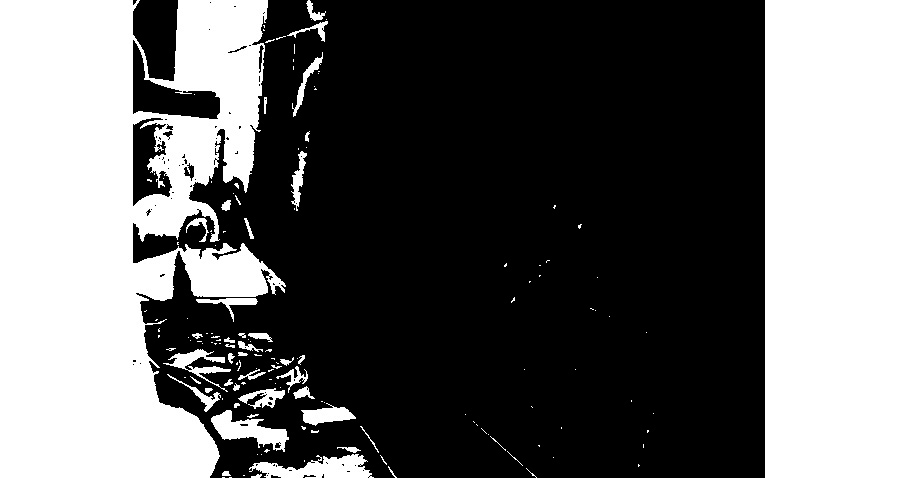
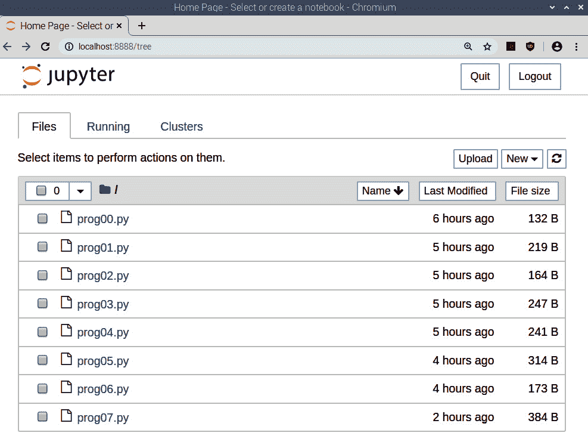
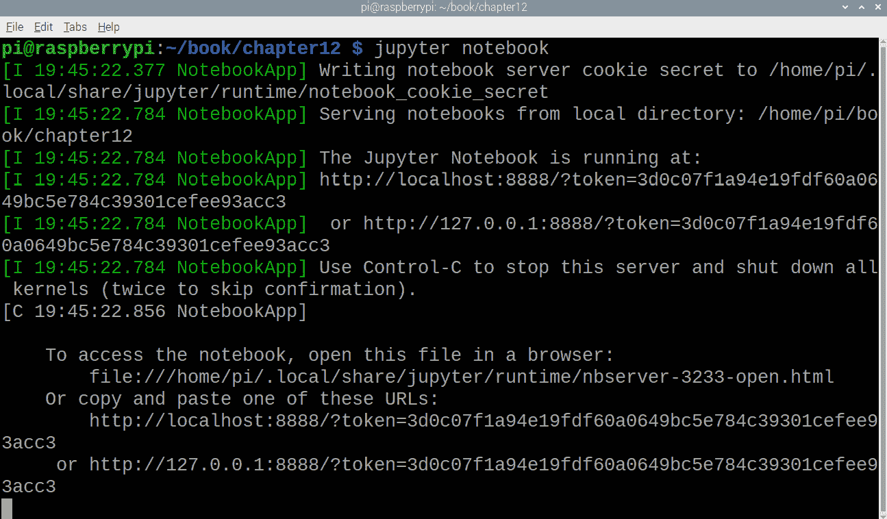
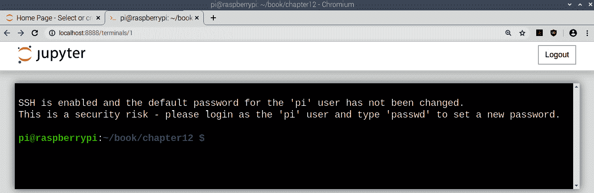
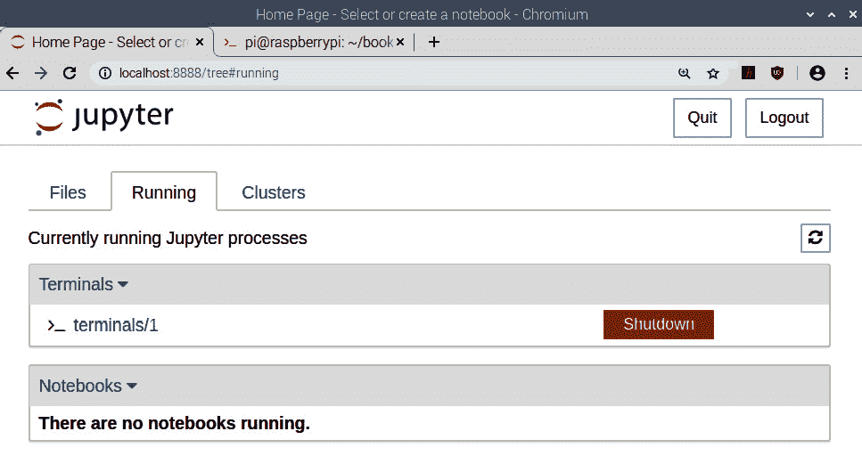
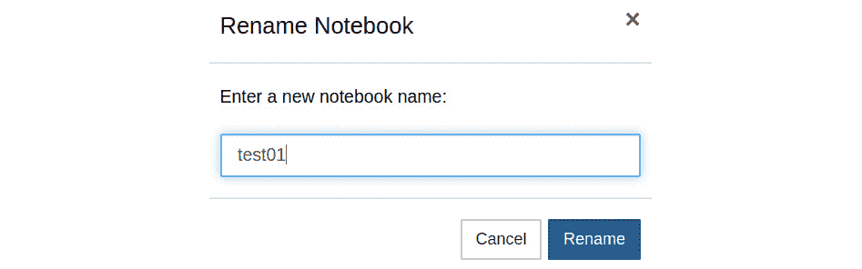
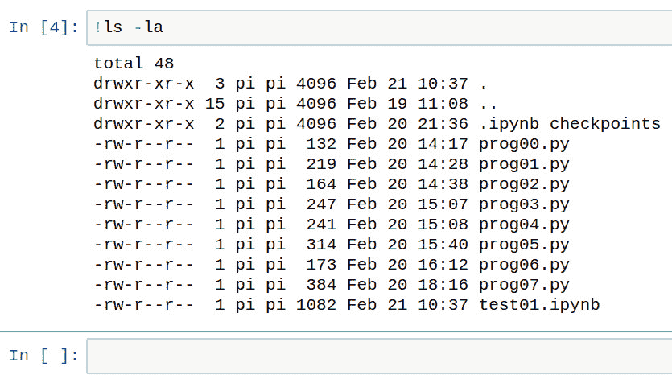

# 第 12 章：结合 Mahotas 和 Jupyter

在上一章中，我们了解了如何使用具有 OpenCV 和 Python 3 编程功能的 Raspberry Pi 在计算机视觉领域中实际应用程序的使用并进行了演示。

在本章中，我们将学习另一个计算机视觉库 Mahotas 的基础。 我们还将看一个 Jupyter 项目，并了解如何将 Jupyter 笔记本用于 Python 3 编程。 我们将在本章中学习的主题如下：

*   用 Mahotas 处理图像
*   结合 Mahotas 和 OpenCV
*   其他流行的图像处理库
*   探索适用于 Python 3 编程的 Jupyter 笔记本

遵循本章内容后，您将习惯于使用 Mahotas 进行图像处理。 您还可以使用 Jupyter 笔记本放心地运行 Python 3 程序。

# 技术要求

可以在 [GitHub](https://github.com/PacktPublishing/raspberry-pi-computer-vision-programming/tree/master/Chapter12/programs) 上找到本章的代码文件。

观看以下视频，以查看[这个页面](https://bit.ly/3fWRYDB)上的“正在执行的代码”。

# 使用 Mahotas 处理图像

Mahotas 是一个 Python 库，用于图像处理和与计算机视觉相关的任务。 它是由路易斯·佩德罗（Luis Pedro）开发的。

它实现了许多与计算机视觉相关的算法。 它已经用 C++ 实现，并且可以在 NumPy 数组上运行。 它还具有适用于 Python 3 的简洁接口。

Mahotas 当前具有 100 多种图像处理和计算机视觉功能，并且随着每个版本的增加，这一数字还在不断增长。 该项目正在积极开发中，每隔几个月就会发布一个新版本。 除了增加的功能之外，每个新版本都带来了性能上的改进。

注意：

您可以通过访问[这个页面](https://mahotas.readthedocs.io/en/latest/)了解有关 Mahotas 的更多信息。

我们可以使用以下命令在 Raspberry Pi 上安装`mahotas`：

```py
pip3 install mahotas
```

Mahotas 的组件将安装在`/home/pi/.local/bin`中。 我们可以将永久添加到`PATH`变量中，如下所示：

1.  通过运行以下命令，以编辑方式打开`~/.profile`文件：

    ```py
    nano ~/.profile
    ```

2.  将以下行添加到末尾：

    ```py
    PATH='$PATH:/home/pi/.local/bin'
    ```

3.  重新启动 Raspberry Pi：

    ```py
    sudo reboot
    ```

我们可以通过在命令提示符处运行以下命令来验证`mahotas`是否已成功安装：

```py
python3 -c 'import mahotas'
```

如果此命令没有返回错误，则说明安装成功。 现在，让我们看一下使用 Mahotas 创建一些程序。

## 读取图像和内置图像

Mahotas 具有许多内置图像。 让我们看看如何使用它们。 在下面的代码中查看：

```py
import matplotlib.pyplot as plt
import mahotas
photo = mahotas.demos.load('luispedro')
plt.imshow(photo)
plt.axis('off')
plt.show()
```

在前面的代码中， `mahotas.demos.load()`用于将内置图像加载到 NumPy 数组。 `luispedro`是该库作者的图像。 与 OpenCV 不同，Mahotas 以 RGB 格式读取和存储彩色图像。 我们还可以在灰度模式下加载和显示图像，如下所示：

```py
photo = mahotas.demos.load('luispedro', as_grey=True)
plt.imshow(photo, cmap='gray')
```

我们可以加载其他库图像，如下所示：

```py
photo = mahotas.demos.load('nuclear')
photo = mahotas.demos.load('lena')
photo = mahotas.demos.load('DepartmentStore')
```

我们还可以读取存储在磁盘上的图像，如下所示：

```py
photo= mahotas.imread('/home/pi/book/dataset/4.1.01.tiff')
```

此函数的工作方式与`cv2.imread()` OpenCV 函数相同。

## 对图像应用阈值

我们已经知道阈值化的基础知识。 我们可以通过使用`mahotas`中提供的函数对灰度图像进行阈值处理。 让我们演示大津的二值化：

```py
import matplotlib.pyplot as plt
import numpy as np
import mahotas
photo = mahotas.demos.load('luispedro', as_grey=True)
photo = photo.astype(np.uint8)
T_otsu = mahotas.otsu(photo)
plt.imshow(photo > T_otsu, cmap='gray')
plt.axis('off')
plt.show()
```

`mahotas.otsu()`函数接受灰度图像作为参数，并返回阈值。`photo > T_otsu`代码返回阈值图像。 以下是输出：


图 12.1 –大津的二值化

我们也可以使用 Riddler-Calvard 方法执行阈值化，如下所示：

```py
T_rc = mahotas.rc(photo)
plt.imshow(photo > T_rc, cmap='gray')
```

`mahotas.rc()`函数接受灰度图像作为参数，并返回阈值。 `photo > T_rc`代码返回阈值图像。 运行此命令并检查输出。 它将使用 Riddler-Calvard 方法向我们显示阈值图像。

## 距离变换

距离变换是一种形态学操作。 最好使用二进制（0 和 1）图像进行可视化。 它将二进制图像转换为灰度图像，以使点的灰度强度可视化其距图像边界的距离。 `mahotas.distance()`函数接收图像并计算距离变换。 让我们看一个例子：

```py
import matplotlib.pyplot as plt
import numpy as np
import mahotas
f = np.ones((256, 256), bool)
f[64:191, 64:191] = False
plt.subplot(121)
plt.imshow(f, cmap='gray')
plt.title('Original Image')
dmap = mahotas.distance(f)
plt.subplot(122)
plt.imshow(dmap, cmap='gray')
plt.title('Distance Transform')
plt.show()
```

这将创建一个正方形的自定义图像，在白色背景上填充有黑色。 然后，它计算距离变换并将其可视化。 这将产生以下输出：


图 12.2 –距离变换演示

## 色彩空间

我们可以将 RGB 图像转换为棕褐色，如下所示：

```py
import matplotlib.pyplot as plt
import mahotas
photo = mahotas.demos.load('luispedro')
photo = mahotas.colors.rgb2sepia(photo)
plt.imshow(photo)
plt.axis('off')
plt.show()
```

前面的代码从库中读取灰度图像，并使用`rgb2sepia()`函数的调用将其转换为具有棕褐色色彩空间的图像。 它接受图像作为参数并返回转换后的图像。 以下是，是先前程序的输出：


图 12.3 –棕褐色图像

在下一节中，我们将学习如何结合 Mahotas 和 OpenCV 的代码。

# 结合 Mahotas 和 OpenCV

像 OpenCV 一样，Mahotas 使用 NumPy 数组存储并处理图像。 我们还可以将 OpenCV 和 Mahotas 结合起来。 让我们来看一个这样的示例，如下所示：

```py
import cv2
import numpy as np
import mahotas as mh
cap = cv2.VideoCapture(0)
while True:
    ret, frame = cap.read()
    frame = cv2.cvtColor(frame, cv2.COLOR_BGR2GRAY)
    T_otsu = mh.otsu(frame)
    output = frame > T_otsu
    output = output.astype(np.uint8) * 255
    cv2.imshow('Output', output)
    if cv2.waitKey(1) == 27:
        break
cv2.destroyAllWindows()
cap.release()
```

在前面的程序中，我们将实时帧转换为灰度版本。 然后，我们应用了大津二进制化的 Mahotas 实现，将来自实时视频源的帧转换为布尔二进制图像。 我们需要将其转换为`np.uint8`类型，然后将其乘以`255`（所有形式均采用二进制 8 位的形式），以便将其与`cv2.imshow()`。 输出如下：



图 12.4 –输出窗口的屏幕截图

我们通常使用 OpenCV 功能从 USB 网络摄像头读取实时供稿。 然后，我们可以使用 Mahotas 或任何其他图像处理库中的函数来处理帧。 这样，我们可以合并来自两个不同图像处理库的代码。

在下一节中，我们将学习其他一些 Python 图像处理库的名称和 URL。

# 其他流行的图像处理库

Python 3 有许多第三方库。 这些库中许多都使用 NumPy 来处理图像。 让我们来看看可用库的列表：

*   [**Skimage**](https://scikit-image.org/)
*   [**SimplelTK**](http://www.simpleitk.org/)
*   [`scipy.ndimage`](https://docs.scipy.org/doc/scipy/reference/ndimage.html)

这些都是基于 NumPy 的图像处理库。 Python 图像库及其维护良好的分支 [**Pillow**](https://pillow.readthedocs.io/en/stable/) 是非基于 NumPy 的图像处理库。 它们还具有在 NumPy 和 PIL 图像格式之间转换图像的接口。

我们可以结合使用各种库的代码来创建具有所需功能的各种计算机视觉应用程序。

在下一部分中，我们将探索 Jupyter 笔记本。

# 探索适用于 Python 3 编程的 Jupyter 笔记本

Jupyter 笔记本是基于的基于 Web 的交互界面，其工作方式类似于 Python 3 的交互模式。Jupyter 笔记本具有 40 种编程语言，包括 Python 3，R，Scala 和 Julia。 它为编程提供了一个交互式环境，该环境也可以具有可视化，富文本，代码和其他组件。

Jupyter 是 IPython 项目的一个分支。 IPython 的所有与语言无关的部分已移至 Jupyter，而 Jupyter 的 Python 相关功能由 IPython 内核提供。 让我们看看如何在 Raspberry Pi 上安装 Jupyter：

1.  在命令提示符中逐一运行以下命令：

    ```py
    sudo pip3 uninstall ipykernel 
    ```

    先前的命令将卸载`ipykernel`实用程序的早期版本。

2.  以下命令将安装所有必需的库：

    ```py
    sudo pip3 install ipykernel==4.8.0 
    ```

    ```py
    sudo pip3 install jupyter 
    ```

    ```py
    sudo pip3 install prompt-toolkit==2.0.5
    ```

    这些命令将在 Raspberry Pi 上安装 Jupyter 和必需的组件。

要启动 Jupyter 笔记本，请登录 Raspberry Pi 的图形环境（直接或使用远程桌面），然后在`lxterminal`中运行以下命令：

```py
jupyter notebook
```

这将启动 Jupyter 笔记本服务器进程并打开具有 Jupyter 笔记本界面的 Web 浏览器窗口，如下所示：



图 12.5 –启动目录

上一个屏幕截图显示了运行命令以启动的目录的目录结构。 我在当前章节`/home/pi/book/chapter12`的代码目录中运行了它。 我们运行命令的 LXTerminal 窗口显示服务器日志，如下所示：



图 12.6 – Jupyter 笔记本服务器日志

现在，让我们将返回到运行 Jupyter 的浏览器窗口。 在浏览器窗口的右上角，我们有注销和退出的选项。 在其下方，我们可以看到**上传**按钮，**新建**下拉菜单以及刷新符号。

在右侧，我们可以看到三个标签。 正如我们已经看到的，第一个显示了在命令提示符中启动 Jupyter 的目录结构。 第二个选项卡显示当前正在运行的进程。

让我们探索右侧的**新建**下拉选项。 以下屏幕截图显示了此菜单下可用的选项：


图 12.7 –新建菜单下拉菜单

在**笔记本**部分下，我们可以看到 **Python 3** 的选项。 如果您有使用 Jupyter 的任何其他编程语言，那么这些语言也会在此处显示。 我们将很快进行探讨。 其他选项是**文本文件**，**文件夹**和**终端**。 **其它**下的前两个选项分别创建一个空白文件和一个空白目录。 单击**终端**，将在浏览器窗口的新选项卡中启动 LXTerminal，如以下屏幕截图所示：



图 12.8 –在 Web 浏览器选项卡中运行的命令提示符

如果我们单击原始选项卡（在浏览器选项卡中列为**主页**），然后在**运行**选项下进行检查，则可以看到对应于当前的终端窗口选项卡的一个条目，如以下屏幕截图所示：



图 12.9 – Jupyter 中正在运行的子流程的列表

如我们所见，有选项可以查看在此服务器下启动的当前笔记本和终端。 我们可以从这里关闭它们。 转到**文件**，然后在**新建**下拉菜单下，选择 **Python 3**。 这将在同一浏览器窗口的新选项卡下打开 Python 3 笔记本：


图 12.10 –新的 Jupyter 笔记本选项卡

我们可以看到笔记本的名称是`Untitled`。 我们可以单击名称，这将打开一个模式对话框，重命名笔记本，如下所示：



图 12.11 重命名笔记本

重命名笔记本。 之后，在**主页**主页中的**文件**下，我们可以看到`test01.ipynb`文件。 在这里，IPYNB 表示一个 IPython 笔记本。 您也可以在**运行**选项卡中看到一个条目。 在`/home/pi/book/chapter12/`目录中，我们可以找到`test01.ipynb`文件。 现在，让我们看看如何使用此文件进行 Python 3 编程。 再次在浏览器中切换到`test01`笔记本选项卡。 让我们详细研究界面：


图 12.12 – Jupyter 笔记本

在`In []:`文本之后，我们可以看到一个较长的文本区域。 我们可以在此处编写代码段。 确保从菜单的下拉菜单中选择了**代码**。 然后，将以下代码添加到文本区域：

```py
print('Hello World')
```

我们可以通过单击菜单栏中的**运行**按钮来运行它。 输出将被打印在此处，并且将出现一个新的文本区域。 光标将在此处自动设置：


图 12.13 –运行 HelloWorld 程序

关于此笔记本的最好的事情是我们可以编辑并重新执行较早的单元。 让我们尝试了解菜单中的图标：


图 12.14：菜单中的图标按钮

让我们从左到右。 第一个符号（软盘）将被保存。 `+`符号在当前突出显示的单元格之后添加一个文本区域单元格。 然后，我们有剪切，复制和粘贴选项。 上下箭头用于上下移动当前文本区域单元格。 然后，我们有**运行**并中断内核，重新启动内核，然后重新启动并运行整个笔记本按钮。 下拉框确定单元格的类型。 它具有以下四个选项：


图 12.15 –单元格类型

如果希望单元运行代码，则选择**代码**。 **Markdown** 是用于 RTF 的标记语言。 选择一个空白文本区域单元，并将其更改为 **Markdown** 类型。 然后，在单元格中输入`#Test`并执行它。 这将创建一个一级标题，如下所示：


图 12.16 – 1 级标题

我们可以将`##`用于第二级标题，将`###`用于三级标题，依此类推。

Jupyter 笔记本的主要功能之一是，我们甚至可以在笔记本中运行 OS 命令。 我们需要在命令前面加上`!`符号，然后将其作为**代码**在单元格中运行。 让我们看一下这个例子。 在笔记本中运行`!ls -la`命令，它将产生以下结果：



图 12.17 –在 Jupyter 笔记本中运行 OS 命令

我们也可以在笔记本中使用 **Matplotlib** 显示的可视化效果和图像。 为此，我们需要使用神奇的`%matplotlib`函数。 我们可以使用将 **Matplotlib** 的后端设置为 Jupyter 笔记本的**内联**后端，如下所示：

```py
%matplotlib inline
```

让我们看一下这个的简短演示：


图 12.18 –在 Jupyter 笔记本中显示图像

这就是我们可以在笔记本本身中显示可视化效果和图像的方式。

这是一个非常有用的概念。 我们可以在一个笔记本中使用富文本，操作系统命令，Python 代码和输出（包括可视化）。 我们甚至可以电子方式共享这些 **IPYNB** 笔记本文件。 就像 Python 3 一样，我们可以将 Jupyter 笔记本与许多语言一起使用，例如 Julia，R 和 Scala。 唯一的限制是我们不能在一个笔记本中混合使用多种编程语言的代码。

我要解释的最后一件事是如何清除输出。 单击**单元格**菜单。 它看起来如下：


图 12.19 –清除所有输出

在**当前输出**和**所有输出**下都具有**清除**选项。 这些分别清除当前单元格和整个笔记本的输出。

我建议您自己浏览菜单栏中的所有选项。

# 总结

在本章中，我们探讨了 Mahotas 的基础知识，它是一个基于 NumPy 的图像处理库。 我们研究了一些与图像处理相关的功能，并学习了如何结合 Mahotas 和 OpenCV 代码进行图像处理。 我们还了解了其他基于 NumPy 和非基于 NumPy 的图像处理库的名称。 您可以进一步探索这些库。

我们了解到的最后一个主题是 Jupyter 笔记本型原型和通过电子方式共享代码非常有用。 现在，许多计算机视觉和数据科学专业人员都将 Jupyter 笔记本用于其 Python 编程项目。

在本书的“附录”部分中，我解释了本章无法列出的所有主题。 这些主题对于将 Raspberry Pi 用于各种目的的任何人都将非常有用。