# 图像处理入门

顾名思义，图像处理可以简单地定义为在计算机中（通过代码）使用算法对图像进行处理（分析和操作）。它有几个不同的方面，如图像的存储、表示、信息提取、操作、增强、恢复和解释。在本章中，我们将对图像处理的所有这些不同方面进行基本介绍，并介绍使用 Python 库进行的实际图像处理。本书中的所有代码示例都将使用 Python 3。

我们将从定义什么是图像处理以及图像处理的应用程序开始。然后我们将了解。。。

# 什么是图像处理和一些应用

让我们首先定义什么是图像，它如何存储在计算机上，以及如何使用 Python 处理它。

# 什么是图像以及它是如何存储在计算机上的

从概念上讲，最简单形式的图像（**单通道**；例如，二值或单色、灰度或黑白图像）是二维函数*f（x，y）*，它将坐标对映射为整数/实数，与点的强度/颜色相关。每个点称为一个**像素**或**像素**（图片元素）。一幅图像也可以有多个通道（例如彩色 RGB 图像，其中颜色可以用三个通道红、绿、蓝表示）。对于彩色 RGB 图像，*（x，y）*坐标处的每个像素可以用三元组*（r<sub>x，y</sub>、g<sub>x，y</sub>、b<sub>表示 x，y</sub>*。

为了能够在计算机上处理它，一幅图像*f（x，y）*需要在空间和空间上进行数字化。。。

# 什么是图像处理？

**图像处理**是指在计算机上使用算法和代码对图像进行自动处理、操作、分析和解释。它在电视、摄影、机器人、遥感、医疗诊断和工业检测等科学技术的许多学科和领域都有应用。Facebook 和 Instagram 等社交网站是需要使用/创新许多图像处理算法来处理我们上传的图像的行业的典型例子。我们已经习惯于在日常生活中使用这些网站，每天上传大量图像。

在本书中，我们将使用一些 Python 包来处理图像。首先，我们将使用一组库来进行经典的图像处理：从提取图像数据开始，使用一些算法转换数据，使用库函数进行预处理、增强、恢复、表示（使用描述符）、分割、分类、检测和识别（对象）以进行分析、理解，并更好地解释数据。接下来，我们将使用另一组库来进行基于深度学习的图像处理，这是一种在过去几年中非常流行的技术。

# 图像处理的一些应用

图像处理的一些典型应用包括医学/生物学领域（例如，X 射线和 CT 扫描）、计算摄影（Photoshop）、指纹认证、人脸识别等。

# 图像处理流水线

以下步骤描述了图像处理管道中的基本步骤：

1.  **采集和存储****存储**：需要捕获图像（例如使用相机）并将其作为文件（例如 JPEG 文件）存储在某些设备（例如硬盘）上。

2.  **加载到内存并保存到磁盘**：图像需要从磁盘读取到内存并使用某些数据结构（例如，`numpy ndarray`）存储，并且数据结构需要在以后序列化到图像文件中，可能是在对图像运行一些算法之后。

3.  **操作、增强和恢复：**我们需要运行一些预处理算法来完成以下工作：

    *   在图像上运行一些转换（采样和操作；例如，灰度转换）
    *   增强图像质量（过滤；例如，去模糊）
    *   恢复图像不受噪声影响

4.  **分割**：为了提取感兴趣的对象，需要对图像进行分割。

5.  **信息提取/表示**：图像需要以某种替代形式表示；例如，以下选项之一：

    *   可以从图像中计算一些手工制作的特征描述符（例如，使用经典图像处理的 HOG 描述符）
    *   一些特征可以从图像中自动学习（例如，通过深度学习在神经网络的隐藏层中学习的权重和偏差值）
    *   将使用该替代表示法
        来表示图像

6.  图像理解/解释**：**此表示将用于通过以下内容更好地理解图像：
    *   图像分类（例如，图像是否包含人体对象）
    *   对象识别*（*例如*、*在带有边框的图像中查找汽车对象的位置）

下图描述了图像处理中的不同步骤：


下图表示我们将用于不同图像处理任务的不同模块：

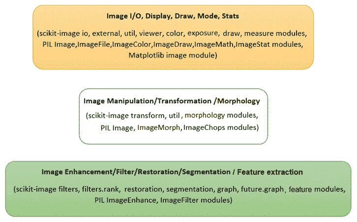

除这些库外，我们还将使用以下库：

*   `scipy.ndimage`和`opencv`用于不同的图像处理任务
*   `scikit-learn`用于经典机器学习
*   `tensorflow`和`keras`用于深度学习

# 在 Python 中设置不同的图像处理库

接下来的几段描述如何安装不同的图像处理库，并设置环境，以便编写代码，使用 Python 中的经典图像处理技术处理图像。在本书的最后几章中，当我们使用基于深度学习的方法时，我们需要使用不同的设置。

# 安装 pip

我们将使用`pip`*或`pip3`*工具*来安装库，因此如果尚未安装，我们需要先安装`pip`。如本文所述（[https://pip.pypa.io/en/stable/installing/#do-i-need-to-install-pip](https://pip.pypa.io/en/stable/installing/#do-i-need-to-install-pip)，`pip`已经安装，如果我们使用从 Python.org 下载的 Python 3>=3.4，或者如果我们在虚拟环境中工作（[） https://packaging.python.org/tutorials/installing-packages/#creating-使用`virtualenv`（](https://packaging.python.org/tutorials/installing-packages/#creating-and-using-virtual-environments)[创建的虚拟环境](https://packaging.python.org/key_projects/#virtualenv)）https://packaging.python.org/key_projects/#virtualenv 或`pyvenv`（[https://packaging.python.org/key_projects/#venv](https://packaging.python.org/key_projects/#venv) 。我们只需要确保升级`pip`（[https://pip.pypa.io/en/stable/installing/#upgrading-pip](https://pip.pypa.io/en/stable/installing/#upgrading-pip)。如何为不同的操作系统或平台安装`pip`可以在这里找到：[https://stackoverflow.com/questions/6587507/how-to-install-pip-with-python-3](https://stackoverflow.com/questions/6587507/how-to-install-pip-with-python-3) 。***

 ***# 在 Python 中安装一些图像处理库

在 Python 中，有许多库可用于图像处理。我们将要使用的是：NumPy、SciPy、scikit image、PIL（枕头）、OpenCV、scikit learn、SimpleITK 和 Matplotlib。

`matplotlib`库主要用于显示，而`numpy`将用于存储图像。`scikit-learn`库将用于建立用于图像处理的机器学习模型，`scipy`库将主要用于图像增强。`scikit-image`、`mahotas`和`opencv`库将用于不同的图像处理算法。

下面的代码块显示了我们将要使用的库是如何通过`pip`从 P。。。

# 安装 Anaconda 配线架

我们还建议下载并安装最新版本的 Anaconda 发行版；这将消除显式安装许多 Python 包的需要

More about installing Anaconda for different OSes can be found at [https://conda.io/docs/user-guide/install/index.html](https://conda.io/docs/user-guide/install/index.html).

# 安装 Jupyter 笔记本电脑

我们将使用**Jupyter**笔记本编写 Python 代码。因此，我们需要首先在 Python 提示符下安装带有`>>> pip install jupyter`的`jupyter`包，然后在浏览器中使用`>>> jupyter notebook`启动 Jupyter 笔记本应用程序。从那里，我们可以创建新的 Python 笔记本并选择内核。如果我们使用 Anaconda，我们不需要显式安装 Jupyter；最新的 Anaconda 发行版附带 Jupyter。

More about running Jupyter notebooks can be found at [http://jupyter-notebook-beginner-guide.readthedocs.io/en/latest/execute.html](http://jupyter-notebook-beginner-guide.readthedocs.io/en/latest/execute.html).

我们甚至可以在笔记本电脑单元中安装 Python 包；例如，我们可以使用`!pip install scipy`命令安装`scipy`。

For more information ...

# 使用 Python 进行图像 I/O 和显示

图像作为文件存储在磁盘上，因此从文件中读取和写入图像是磁盘 I/O 操作。这些可以通过使用不同库的多种方式来实现；其中一些在本节中显示。让我们首先导入所有必需的包：

```py
# for inline image display inside notebook
# % matplotlib inline 
import numpy as np
from PIL import Image, ImageFont, ImageDraw
from PIL.ImageChops import add, subtract, multiply, difference, screen
import PIL.ImageStat as stat
from skimage.io import imread, imsave, imshow, show, imread_collection, imshow_collection
from skimage import color, viewer, exposure, img_as_float, data
from skimage.transform import SimilarityTransform, warp, swirl
from skimage.util import invert, random_noise, montage
import matplotlib.image as mpimg
import matplotlib.pylab as plt
from scipy.ndimage import affine_transform, zoom
from scipy import misc

```

# 使用 PIL 读取、保存和显示图像

PIL 函数`open()`从`Image`对象中的磁盘读取图像，如下代码所示。图像作为`PIL.PngImagePlugin.PngImageFile`类的对象加载，我们可以使用宽度、高度和模式等属性来查找图像的大小（*宽度*x*高度*像素或图像分辨率）和模式：

```py
im = Image.open("../images/parrot.png") # read the image, provide the correct pathprint(im.width, im.height, im.mode, im.format, type(im))# 453 340 RGB PNG <class 'PIL.PngImagePlugin.PngImageFile'>im.show() # display the image 
```

以下是前面代码的输出：

下面的代码块显示了如何使用 PIL 函数`convert()`来转换。。。

# 提供磁盘上映像的正确路径

我们建议创建一个文件夹（子目录）来存储要用于处理的图像（例如，对于 Python 代码示例，我们使用了名为`images`的文件夹中存储的图像），然后提供文件夹的路径来访问图像，以避免`file not found`异常。

# 使用 Matplotlib 读取、保存和显示图像

下一个代码块显示如何使用`matplotlib.image`中的`imread()`函数读取浮点`numpy ndarray`中的图像。像素值表示为介于 0 和 1 之间的实值：

```py
im = mpimg.imread("../images/hill.png")  # read the image from disk as a numpy ndarrayprint(im.shape, im.dtype, type(im))      # this image contains an α channel, hence num_channels= 4# (960, 1280, 4) float32 <class 'numpy.ndarray'>plt.figure(figsize=(10,10))plt.imshow(im) # display the imageplt.axis('off')plt.show()
```

下图显示了前面代码的输出：

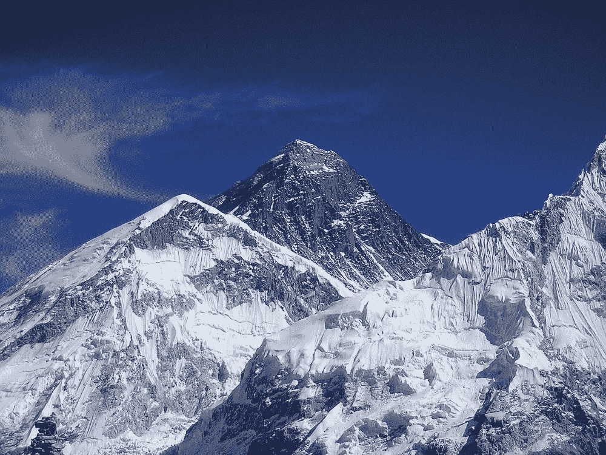

下一个代码段。。。

# 使用 Matplotlib imshow（）显示时进行插值

Matplotlib 的`imshow()`函数提供了许多不同类型的插值方法来绘制图像。当要打印的图像很小时，这些函数特别有用。让我们使用下图所示的小 50 x 50`lena`图像来查看使用不同插值方法绘制的效果：


下一个代码块演示了如何在`imshow()`中使用不同的插值方法：

```py
im = mpimg.imread("../images/lena_small.jpg") # read the image from disk as a numpy ndarray
methods = ['none', 'nearest', 'bilinear', 'bicubic', 'spline16', 'lanczos']
fig, axes = plt.subplots(nrows=2, ncols=3, figsize=(15, 30),
 subplot_kw={'xticks': [], 'yticks': []})
fig.subplots_adjust(hspace=0.05, wspace=0.05)
for ax, interp_method in zip(axes.flat, methods):
 ax.imshow(im, interpolation=interp_method)
 ax.set_title(str(interp_method), size=20)
plt.tight_layout()
plt.show()
```

下图显示了前面代码的输出：


# 使用 scikit 图像读取、保存和显示图像

下一个代码块使用`scikit-image`中的`imread()`函数读取`uint8`类型的`numpy ndarray`中的图像（8 位无符号整数）。因此，像素值将在 0 和 255 之间。然后使用`Image.color`模块的`hsv2rgb()`功能将彩色 RGB 图像转换为 HSV 图像（更改图像类型或模式，稍后讨论）。接下来，通过保持色调和值通道不变，将所有像素的饱和度（色度）更改为恒定值。然后使用`rgb2hsv()`功能将图像转换回 RGB 模式，以创建新图像，然后保存并显示：

```py
im = imread("../images/parrot.png") # read ...
```

# 使用 scikit image 的宇航员数据集

下面的代码块显示了如何使用`data`模块从`scikit-image`库的图像数据集中加载`astronaut`图像。该模块包含一些其他流行的数据集，如 cameraman，可以类似地加载：

```py
im = data.astronaut() 
imshow(im), show()
```

下图显示了前面代码的输出：

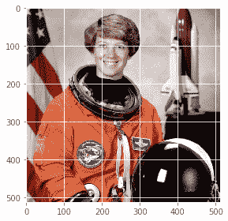

# 一次读取和显示多个图像

我们可以使用 scikit image`io`模块的`imread_collection()`功能将文件名中具有特定图案的所有图像加载到文件夹中，并与`imshow_collection()`功能同时显示。代码留给读者作为练习。

# 使用 scipy misc 读取、保存和显示图像

`scipy`的`misc`模块也可用于图像 I/O 和显示。以下各节演示如何使用`misc`模块功能。

# 使用 scipy.misc 的人脸数据集

下一个代码块展示了如何显示`misc`模块的`face`数据集：

```py
im = misc.face() # load the raccoon's face imagemisc.imsave('face.png', im) # uses the Image module (PIL)plt.imshow(im), plt.axis('off'), plt.show()
```

下图为前一代码的输出，显示`misc`模块的`face`画面：


我们可以使用`misc.imread()`从磁盘读取图像。下一个代码块显示了一个示例：

```py
im = misc.imread('../images/pepper.jpg')print(type(im), im.shape, im.dtype)# <class 'numpy.ndarray'> (225, 225, 3) uint8
```

在 SciPy 1.0.0 中，I/O 函数的`imread()`已被弃用，并将被删除。。。

# 处理不同的图像类型和文件格式，并执行基本的图像处理

在本节中，我们将讨论不同的图像处理函数（使用点变换和几何变换）以及如何处理不同类型的图像。让我们从这个开始

# 处理不同的图像类型和文件格式

图像可以以不同的文件格式和不同的模式（类型）保存。让我们讨论如何使用 Python 库处理不同文件格式和类型的图像

# 文件格式

图像文件可以是不同的格式。一些流行的格式包括 BMP（8 位、24 位、32 位）、PNG、JPG（JPEG）、GIF、PPM、PNM 和 TIFF。我们不需要担心图像文件的特定格式（以及元数据的存储方式）来从中提取数据。Python 图像处理库将读取图像并提取数据，以及其他一些对我们有用的信息（例如，图像大小、类型/模式和数据类型）。

# 从一种文件格式转换为另一种文件格式

使用 PIL，我们可以读取一种文件格式的图像并将其保存到另一种文件格式；例如，从 PNG 到 JPG*，*如下图所示：

```py
im = Image.open("../images/parrot.png")print(im.mode)  #  RGBim.save("../images/parrot.jpg")
```

但是如果 PNG 文件处于`RGBA`模式，我们需要先将其转换为`RGB`模式，然后再将其保存为 JPG，否则会出现错误。下一个代码块显示如何首先转换然后保存：

```py
im = Image.open("../images/hill.png")print(im.mode)# RGBAim.convert('RGB').save("../images/hill.jpg") # first convert to RGB mode
```

# 图像类型（模式）

图像可以是以下不同类型：

*   单通道图像每个像素由单个值表示：
    *   二进制（单色）图像（每个像素由单个 0-1 位表示）
    *   灰度图像（每个像素可以用 8 位表示，其值通常在 0-255 之间）
*   多通道图像每个像素由一组值表示：
    *   三通道图像；例如，以下各项：
        *   RGB 图像每个像素由三个元组（*r、g、b*值表示，表示每个像素的红色、绿色和蓝色通道颜色值。
        *   HSV 图像每个像素由三个元组（*h、s、v*值表示，分别表示*色调*（颜色）、*饱和度*（颜色与白色的混合程度）和*值*（亮度与黑色的混合程度）每个像素的通道颜色值。HSV 模型以类似于人眼感知颜色的方式描述颜色
    *   四通道图像；例如，RGBA 图像每个像素由三个元组（*r、g、b、α*值表示，最后一个通道表示透明度。

# 从一种图像模式转换为另一种图像模式

我们可以在读取图像本身的同时将 RGB 图像转换为灰度图像。下面的代码正是这样做的：

```py
im = imread("images/parrot.png", as_gray=True)print(im.shape)#(362L, 486L)
```

请注意，对于某些彩色图像，在转换为灰度时可能会丢失一些信息。以下代码显示了石原牌的示例，用于检测色盲。这次使用`color`模块的`rgb2gray()`功能，彩色和灰度图像并排显示。如下图所示，数字**8**在灰度版中几乎不可见：

```py
im = imread("../images/Ishihara.png")im_g = color.rgb2gray(im)plt.subplot(121), plt.imshow(im, ...
```

# 某些颜色空间（通道）

以下是图像的几个常用通道/颜色空间：RGB、HSV、XYZ、YUV、YIQ、YPbPr、YCbCr 和 YDbDr。我们可以使用仿射映射从一个颜色空间转到另一个颜色空间。以下矩阵表示从 RGB 到 YIQ 颜色空间的线性映射：

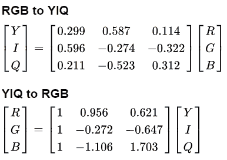

# 从一个颜色空间转换到另一个颜色空间

我们可以使用库函数从一个颜色空间转换到另一个颜色空间；例如，以下代码将 RGB 颜色空间转换为 HSV 颜色空间图像：

```py
im = imread("../images/parrot.png")im_hsv = color.rgb2hsv(im)plt.gray()plt.figure(figsize=(10,8))plt.subplot(221), plt.imshow(im_hsv[...,0]), plt.title('h', size=20), plt.axis('off')plt.subplot(222), plt.imshow(im_hsv[...,1]), plt.title('s', size=20), plt.axis('off')plt.subplot(223), plt.imshow(im_hsv[...,2]), plt.title('v', size=20), plt.axis('off')plt.subplot(224), plt.axis('off')plt.show()
```

下图显示了 h（*heu 或颜色：反射光的主波长*、s（*饱和度*或*色度*）和 v（*值*或*亮度/…*）

# 用于存储图像的数据结构

正如我们已经讨论过的，PIL 使用`Image`对象存储图像，而 scikit 图像使用`numpy ndarray`数据结构存储图像数据。下一节介绍如何在这两种数据结构之间进行转换。

# 转换图像数据结构

下面的代码块显示了如何将 PIL`Image`对象转换为`numpy ndarray`（由 scikit 图像使用）：

```py
im = Image.open('../images/flowers.png') # read image into an Image object with PILim = np.array(im) # create a numpy ndarray from the Image objectimshow(im) # use skimage imshow to display the imageplt.axis('off'), show()
```

下一个图显示了前面代码的输出，这是一个花的图像：


下面的代码块显示如何从`numpy ndarray`转换为`PIL Image`对象。运行时，代码显示与上图相同的输出：

```py
im = imread('../images/flowers.png') ...
```

# 基本图像处理

不同的 Python 库可用于基本的图像处理。几乎所有的库都将图像存储在`numpy ndarray`中（例如，用于灰度的二维阵列和用于 RGB 图像的三维阵列）。下图显示彩色`lena`图像的正*x*和*y*方向（原点为图像二维阵列的左上角）：

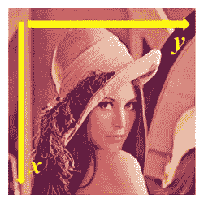

# 基于 numpy 阵列切片的图像处理

下一个代码块显示如何使用`numpy`阵列的切片和遮罩在`lena`图像上创建圆形遮罩：

```py
lena = mpimg.imread("../images/lena.jpg") # read the image from disk as a numpy ndarrayprint(lena[0, 40])# [180  76  83]# print(lena[10:13, 20:23,0:1]) # slicinglx, ly, _ = lena.shapeX, Y = np.ogrid[0:lx, 0:ly]mask = (X - lx / 2) ** 2 + (Y - ly / 2) ** 2 > lx * ly / 4lena[mask,:] = 0 # masksplt.figure(figsize=(10,10))plt.imshow(lena), plt.axis('off'), plt.show()
```

下图显示了代码的输出：


# 简单图像变形-使用交叉溶解的两幅图像的α-混合

下面的代码块显示了如何从一张人脸图像（*图像<sub>1</sub>*是梅西的脸）开始，然后使用两张图像`numpy ndarrays`的线性组合，以另一张图像（*图像<sub>2</sub>*是罗纳尔多的脸）结束，公式如下：


我们通过将*α*从 0 迭代增加到 1 来实现这一点：

```py
im1 = mpimg.imread("../images/messi.jpg") / 255 # scale RGB values in [0,1]
im2 = mpimg.imread("../images/ronaldo.jpg") / 255
i = 1
plt.figure(figsize=(18,15))
for alpha in np.linspace(0,1,20):
 plt.subplot(4,5,i)
 plt.imshow((1-alpha)*im1 + alpha*im2)
 plt.axis('off')
 i += 1
plt.subplots_adjust(wspace=0.05, hspace=0.05)
plt.show()
```

下一幅图显示了使用前一个代码创建的α混合图像序列，该代码将梅西的面部图像交叉分解为罗纳尔多的。从图中的中间图像序列可以看出，简单混合的人脸变形不是很平滑。在接下来的章节中，我们将看到更先进的图像变形技术：

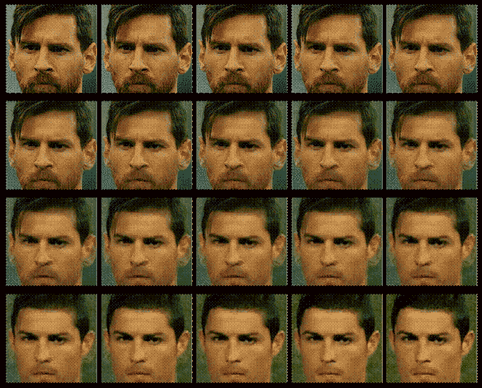

# 基于 PIL 的图像处理

PIL 为我们提供了许多操作图像的功能；例如，使用点变换更改像素值或对图像执行几何变换。让我们首先加载 parrot PNG 图像，如下代码所示：

```py
im = Image.open("../images/parrot.png")        # open the image, provide the correct pathprint(im.width, im.height, im.mode, im.format) # print image size, mode and format# 486 362 RGB PNG
```

接下来的几节将介绍如何使用 PIL 进行不同类型的图像处理。

# 裁剪图像

我们可以使用带有所需矩形参数的`crop()`函数从图像中裁剪相应区域，如下代码所示：

```py
im_c = im.crop((175,75,320,200)) # crop the rectangle given by (left, top, right, bottom) from the image
im_c.show()
```

下图显示了使用前面代码创建的裁剪图像：


# 调整图像大小

为了增加或减少图像的大小，我们可以使用`resize()`函数，该函数分别对图像进行内部上采样或下采样。这将在下一章详细讨论。

**调整到更大的图像**

让我们从一个 149 x 97 大小的小时钟图像开始，然后创建一个更大的图像。下面的代码片段显示了我们将从中开始的小时钟图像：

```py
im = Image.open("../images/clock.jpg")print(im.width, im.height)# 107 105im.show()
```

前面代码的输出，小时钟图像，如下所示：


下一行代码显示了如何使用`resize()`函数。。。

# 否定图像

我们可以使用`point()`函数用一个参数函数变换每个像素值。我们可以使用它对图像求反，如下一个代码块所示。像素值使用 1 字节无符号整数表示，这就是为什么从最大可能值中减去它将是每个像素上获得反转图像所需的精确点运算：

```py
im = Image.open("../images/parrot.png") 
im_t = im.point(lambda x: 255 - x)
im_t.show()
```

下图显示负片图像，即前一代码的输出：


# 将图像转换为灰度

我们可以使用带有`'L'`参数的`convert()`函数将 RGB 彩色图像转换为灰度图像，如下代码所示：

```py
im_g = im.convert('L')   # convert the RGB color image to a grayscale image
```

我们将在接下来的几个灰度变换中使用此图像。

# 一些灰度变换

在这里，我们探讨了几个变换，其中，使用一个函数，将输入图像的每个单个像素值转换为输出图像的相应像素值。功能`point()`可用于此。每个像素的值介于 0 和 255 之间（包括 0 和 255）。

**日志转换**

对数变换可用于有效压缩具有动态像素值范围的图像。以下代码使用点变换进行对数变换。可以看出，像素值的范围缩小，来自输入图像的较亮像素变暗，较暗像素变亮，从而缩小像素值的范围：

```py
im_g.point(lambda x: 255*np.log(1+x/255)).show()
```

下图显示了通过运行前一行代码生成的输出日志转换图像：


**幂律变换**

该变换用作图像的γ校正。下一行代码显示了如何使用`point()`函数进行幂律变换，其中γ=`0.6`：

`im_g.point(lambda x: 255*(x/255)**0.6).show()`

下图显示了通过运行前一行代码生成的输出幂律变换图像：


# 一些几何变换

在本节中，我们将讨论通过将适当的矩阵（通常用齐次坐标表示）与图像矩阵相乘来完成的另一组变换。这些变换会更改图像的几何方向，因此得名。

**反射图像**

我们可以使用`transpose()`功能来反映关于水平轴或垂直轴的图像：

```py
im.transpose(Image.FLIP_LEFT_RIGHT).show() # reflect about the vertical axis 
```

下图显示了通过运行前一行代码生成的输出图像：

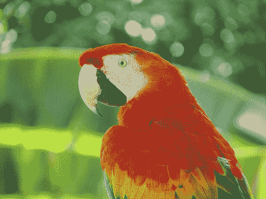

**旋转图像**

我们可以使用`rotate()`功能旋转。。。

# 更改图像的像素值

我们可以使用`putpixel()`功能更改图像中的像素值。接下来，让我们讨论使用函数向图像添加噪声的一个流行应用。

**向图像添加椒盐噪声**

我们可以从图像中随机选择几个像素，然后将这些像素值的一半设置为黑色，另一半设置为白色，从而在图像中添加一些**椒盐噪声**。下一个代码段显示了如何添加噪波：

```py
# choose 5000 random locations inside image
im1 = im.copy() # keep the original image, create a copy 
n = 5000
x, y = np.random.randint(0, im.width, n), np.random.randint(0, im.height, n)
for (x,y) in zip(x,y):
 im1.putpixel((x, y), ((0,0,0) if np.random.rand() < 0.5 else (255,255,255))) # salt-and-pepper noise
im1.show()
```

下图显示了通过运行前面的代码生成的输出噪声图像：


# 画图

我们可以从`PIL.ImageDraw`模块在图像上绘制线条或其他几何形状（例如，绘制椭圆的`ellipse()`函数），如下一个 Python 代码片段所示：

```py
im = Image.open("../images/parrot.png")draw = ImageDraw.Draw(im)draw.ellipse((125, 125, 200, 250), fill=(255,255,255,128))del drawim.show()
```

下图显示了通过运行前面的代码生成的输出图像：

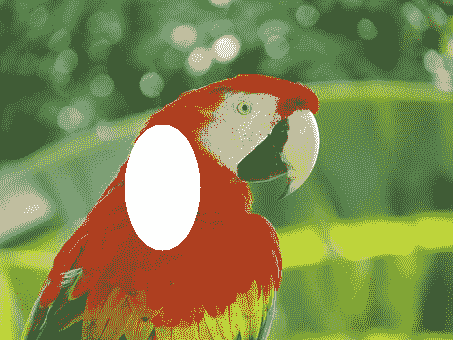

# 在图像上绘制文本

我们可以使用`PIL.ImageDraw`模块中的`text()`函数向图像添加文本，如下一个 Python 代码片段所示：

```py
draw = ImageDraw.Draw(im)
font = ImageFont.truetype("arial.ttf", 23) # use a truetype font
draw.text((10, 5), "Welcome to image processing with python", font=font)
del draw
im.show()
```

下图显示了通过运行前面的代码生成的输出图像：


# 创建缩略图

我们可以使用`thumbnail()`功能从图像中创建缩略图，如下所示：

```py
im_thumbnail = im.copy() # need to copy the original image firstim_thumbnail.thumbnail((100,100))# now paste the thumbnail on the image im.paste(im_thumbnail, (10,10))
im.save("../images/parrot_thumb.jpg")
im.show()
```

此图显示了通过运行前面的代码段生成的输出图像：


# 计算图像的基本统计信息

我们可以使用`stat`模块计算一幅图像的基本统计数据（不同通道像素值的平均值、中值、标准偏差等），如下所示：

```py
s = stat.Stat(im)
print(s.extrema) # maximum and minimum pixel values for each channel R, G, B
# [(4, 255), (0, 255), (0, 253)]
print(s.count)
# [154020, 154020, 154020]
print(s.mean)
# [125.41305674587716, 124.43517724970783, 68.38463186599142]
print(s.median)
# [117, 128, 63]
print(s.stddev)
# [47.56564506512579, 51.08397900881395, 39.067418896260094]
```

# 绘制图像 RGB 通道的像素值直方图

`histogram()`函数可用于计算每个通道像素的直方图（像素值与频率的表格），并返回串联输出（例如，对于 RGB 图像，输出包含*3 x 256=768*值）：

```py
pl = im.histogram()plt.bar(range(256), pl[:256], color='r', alpha=0.5)plt.bar(range(256), pl[256:2*256], color='g', alpha=0.4)plt.bar(range(256), pl[2*256:], color='b', alpha=0.3)plt.show()
```

下图显示了通过运行前面的代码绘制的 R、G 和 B 颜色直方图：

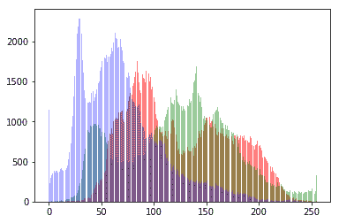

# 分离图像的 RGB 通道

我们可以使用`split()`功能分离多通道图像的通道，如下 RGB 图像代码所示：

```py
ch_r, ch_g, ch_b = im.split() # split the RGB image into 3 channels: R, G and B
# we shall use matplotlib to display the channels
plt.figure(figsize=(18,6))
plt.subplot(1,3,1); plt.imshow(ch_r, cmap=plt.cm.Reds); plt.axis('off')
plt.subplot(1,3,2); plt.imshow(ch_g, cmap=plt.cm.Greens); plt.axis('off')
plt.subplot(1,3,3); plt.imshow(ch_b, cmap=plt.cm.Blues); plt.axis('off')
plt.tight_layout()
plt.show() # show the R, G, B channels
```

下图显示了通过运行前面的代码为每个 R（红色）、G（绿色）和 B（蓝色）通道创建的三个输出图像：

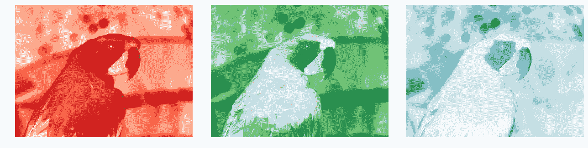

# 组合图像的多个通道

我们可以使用`merge()`功能组合多通道图像的通道，如下代码所示，其中通过分割鹦鹉 RGB 图像获得的彩色通道在交换红色和蓝色通道后合并：

```py
im = Image.merge('RGB', (ch_b, ch_g, ch_r)) # swap the red and blue channels obtained last time with split()im.show()
```

下图显示了通过运行前面的代码段合并 B、G 和 R 通道而创建的 RGB 输出图像：


# α-混合两幅图像

`blend()`函数可用于通过使用常数*α*插值两个给定图像（大小相同）来创建新图像。两个图像必须具有相同的大小和模式。输出图像如下所示：

*out=图像<sub>1</sub>*（1.0-α）+图像<sub>2</sub>*α*

如果*α*为 0.0，则返回第一个图像的副本。如果*α*为 1.0，则返回第二个图像的副本。下一个代码段显示了一个示例：

```py
im1 = Image.open("../images/parrot.png")
im2 = Image.open("../images/hill.png")
# 453 340 1280 960 RGB RGBA
im1 = im1.convert('RGBA') # two images have different modes, must be converted to the same mode
im2 = im2.resize((im1.width, im1.height), Image.BILINEAR) # two images have different sizes, must be converted to the same size
im = Image.blend(im1, im2, alpha=0.5).show()
```

下图显示了通过混合前两个图像生成的输出图像：


# 叠加两幅图像

通过将两个输入图像（大小相同）逐像素相乘，可以将一个图像叠加到另一个图像上。下一个代码段显示了一个示例：

```py
im1 = Image.open("../images/parrot.png")im2 = Image.open("../images/hill.png").convert('RGB').resize((im1.width, im1.height))multiply(im1, im2).show()
```

下图显示了通过运行前面的代码段叠加两个图像时生成的输出图像：

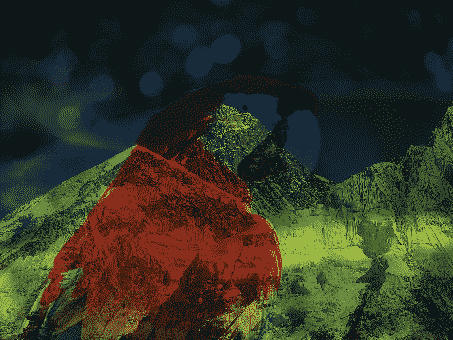

# 添加两个图像

下一个代码段显示了如何通过逐像素添加两个输入图像（大小相同）来生成图像：

```py
add(im1, im2).show()
```

下图显示了通过运行上一个代码段生成的输出图像：

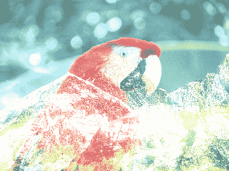

# 计算两幅图像之间的差异

以下代码返回图像之间逐像素差异的绝对值。图像差异可用于检测两个图像之间的变化。例如，下一个代码块显示了如何从 2018 年 FIFA 世界杯比赛的视频记录（来自 YouTube）的两个连续帧计算差分图像：

```py
from PIL.ImageChops import subtract, multiply, screen, difference, addim1 = Image.open("../images/goal1.png") # load two consecutive frame images from the videoim2 = Image.open("../images/goal2.png")im = difference(im1, im2)im.save("../images/goal_diff.png")plt.subplot(311)plt.imshow(im1)plt.axis('off')plt.subplot(312)plt.imshow(im2)plt.axis('off')plt.subplot(313) ...
```

# 减去两幅图像并叠加两幅图像负片

`subtract()`功能可用于首先减去两幅图像，然后将结果除以比例（默认为 1.0）并添加偏移量（默认为 0.0）。类似地，`screen()`功能可用于将两个反转图像叠加在彼此的顶部。

# 使用 scikit 图像进行图像处理

正如前面使用 PIL 库所做的，我们还可以使用`scikit-image`库函数进行图像处理。以下各节显示了一些示例。

# 使用 warp（）函数进行反向扭曲和几何变换

scikit image`transform`模块的`warp()`函数可用于图像几何变换的反向扭曲（在上一节中讨论），如以下示例所示。

**对图像**应用仿射变换

我们可以使用`SimilarityTransform()`函数计算转换矩阵，然后使用`warp()`函数进行转换，如下一个代码块所示：

```py
im = imread("../images/parrot.png")
tform = SimilarityTransform(scale=0.9, rotation=np.pi/4,translation=(im.shape[0]/2, -100))
warped = warp(im, tform)
import matplotlib.pyplot as plt
plt.imshow(warped), plt.axis('off'), plt.show()
```

下图显示了通过运行上一个代码段生成的输出图像：


# 应用漩涡变换

这是 scikit 图像文档中定义的非线性变换。下一个代码片段展示了如何使用`swirl()`函数实现转换，其中`strength`是函数的参数，表示`swirl`的数量，`radius`表示`swirl`的像素范围，`rotation`添加了旋转角度。将`radius`转化为`r`是为了确保转化衰减到≈千分之一≈ 规定半径内的 1/1000：

```py
im = imread("../images/parrot.png")swirled = swirl(im, rotation=0, strength=15, radius=200)plt.imshow(swirled)plt.axis('off')plt.show()
```

下一个图显示了通过运行前面的代码段通过漩涡变换生成的输出图像：

# 向图像中添加随机高斯噪声

我们可以使用`random_noise()`功能向图像添加不同类型的噪声。下一个代码示例显示了如何将具有不同方差的高斯噪声添加到图像中：

```py
im = img_as_float(imread("../images/parrot.png"))
plt.figure(figsize=(15,12))
sigmas = [0.1, 0.25, 0.5, 1]
for i in range(4): 
 noisy = random_noise(im, var=sigmas[i]**2)
 plt.subplot(2,2,i+1)
 plt.imshow(noisy)
 plt.axis('off')
 plt.title('Gaussian noise with sigma=' + str(sigmas[i]), size=20)
plt.tight_layout()
plt.show()
```

下一个图显示了通过运行前面的代码片段添加具有不同方差的高斯噪声生成的输出图像。可以看出，高斯噪声的标准偏差越大，输出图像的噪声越大：

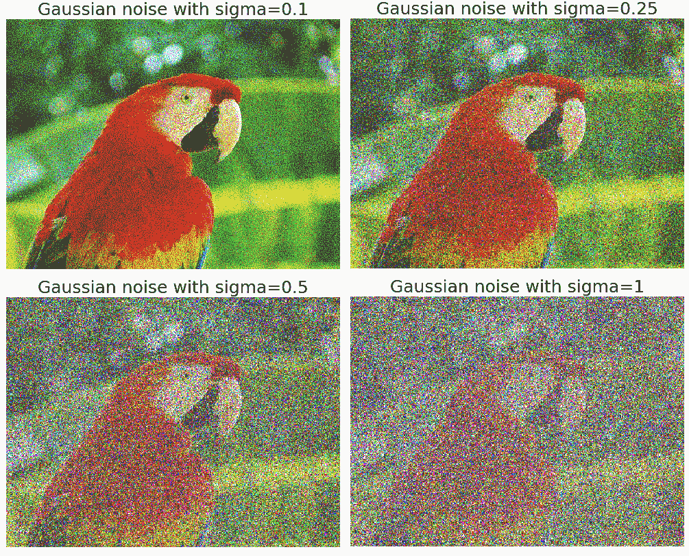

# 计算图像的累积分布函数

我们可以使用`cumulative_distribution()`函数计算给定图像的**累积分布函数**（**CDF**，我们将在图像增强一章中看到。现在，我们鼓励读者使用这个函数来计算 CDF。

# 用 Matplotlib 进行图像处理

我们可以使用`matplotlib`*库中的`pylab`模块进行图像处理。下一节将显示一个示例。*

 *# 为图像绘制轮廓线

图像的**轮廓线**是一条曲线，连接所有具有相同特定值的像素。以下代码块显示如何绘制爱因斯坦灰度图像的轮廓线和填充轮廓：

```py
im = rgb2gray(imread("../images/einstein.jpg")) # read the image from disk as a numpy ndarrayplt.figure(figsize=(20,8))plt.subplot(131), plt.imshow(im, cmap='gray'), plt.title('Original Image', size=20) plt.subplot(132), plt.contour(np.flipud(im), colors='k', levels=np.logspace(-15, 15, 100))plt.title('Image Contour Lines', size=20)plt.subplot(133), plt.title('Image Filled Contour', size=20), plt.contourf(np.flipud(im), cmap='inferno')plt.show()
```

下一个图显示了。。。

# 使用 scipy.misc 和 scipy.ndimage 模块进行图像处理

我们也可以使用`scipy`库中的`misc`和`ndimage`模块进行图像处理；这是留给读者的练习，让他们找到相关的功能并熟悉它们的用法。

# 总结

在本章中，我们首先提供了图像处理的基本介绍，以及关于我们试图在图像处理中解决的问题的基本概念。然后，我们讨论了图像处理的不同任务和步骤，以及 Python 中的主要图像处理库，我们将在本书中使用这些库进行编码。接下来，我们讨论了如何在 Python 中安装用于图像处理的不同库，以及如何导入它们并从模块中调用函数。我们还介绍了有关图像类型、文件格式和数据结构的基本概念，以使用不同的 Python 库存储图像数据。然后，我们讨论了如何使用不同的库在 Python 中执行图像 I/O 和显示。最后，我们讨论了如何。。。

# 问题

1.  使用`scikit-image`库的函数读取图像集合并将其显示为蒙太奇。
2.  使用`scipy ndimage`和`misc`模块的功能对图像进行缩放、裁剪、调整大小和应用仿射变换。
3.  创建 Gotham Instagram 过滤器的 Python 翻拍版（[https://github.com/lukexyz/CV-Instagram-Filters](https://github.com/lukexyz/CV-Instagram-Filters) （提示：使用 PIL`split()`、`merge()`和`numpy interp()`功能操作图像以创建通道插值（[https://www.youtube.com/watch?v=otLGDpBglEA &功能=播放器（嵌入](https://www.youtube.com/watch?v=otLGDpBglEA&feature=player_embedded)）。
4.  使用 scikit image 的`warp()`功能实现漩涡变换。注意，`swirl`变换也可以用以下等式表示：


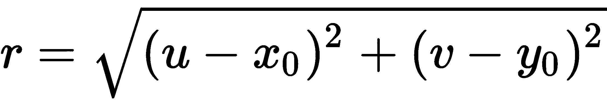


5.  执行以下给出的波形变换（提示：使用 scikit 图像的`warp()`：

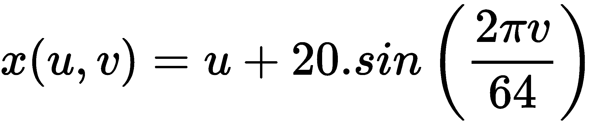


6.  使用 PIL 加载带有调色板的 RGB`.png`文件，并将其转换为灰度图像。此问题摘自此帖：[https://stackoverflow.com/questions/51676447/python-use-pil-to-load-png-file-gives-strange-results/51678271#51678271](https://stackoverflow.com/questions/51676447/python-use-pil-to-load-png-file-gives-strange-results/51678271#51678271) 。通过索引调色板，将以下 RGB 图像（来自`VOC2012`数据集）转换为灰度图像：

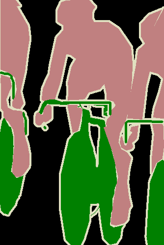

7.  为本章中使用的鹦鹉图像的每个颜色通道绘制 3D 图（提示：使用`mpl_toolkits.mplot3d`模块的`plot_surface()`功能和 NumPy 的`meshgrid()`功能）。

8.  使用 SCIKIT 图像的 To.T0.模块的莱娜 T1 来估计从源到目标图像的单应矩阵，并使用 AUT2 T2 函数嵌入在空白画布中的图像（如下所示）：

| **输入图像** | **输出图像** |
| 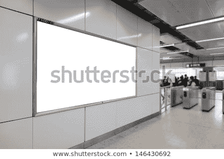 | 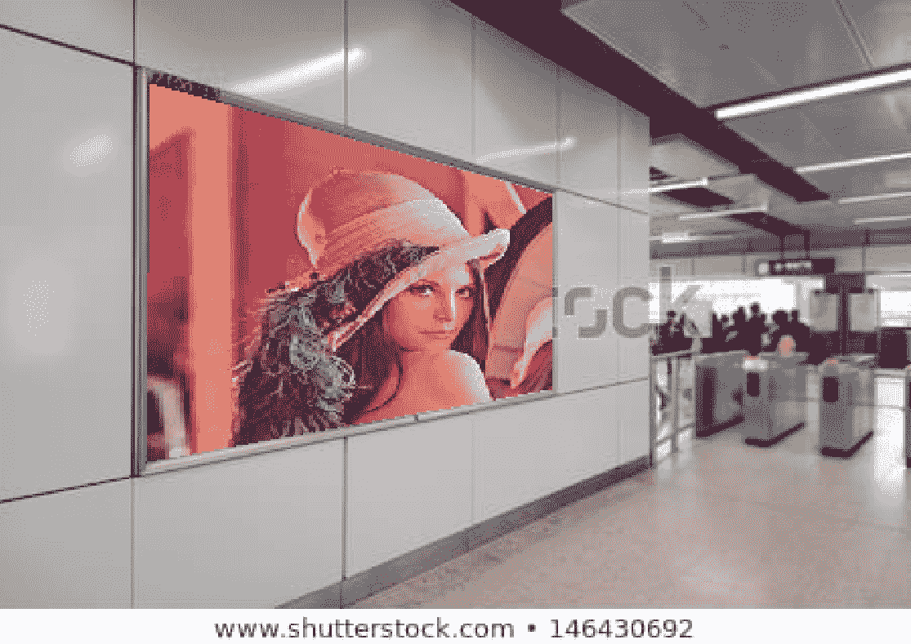 |

首先，试着自己解决问题。可在此处找到解决方案供您参考：[https://sandipanweb.wordpress.com/2018/07/30/some-image-processing-problems/](https://sandipanweb.wordpress.com/2018/07/30/some-image-processing-problems/) 。

# 进一步阅读

*   *数字图像处理*，Rafael C.Gonzalez 和 Richard E.Woods 关于图像处理概念的书
*   本课程的课堂讲稿/讲义（[https://web.stanford.edu/class/ee368/handouts.html 斯坦福大学的](https://web.stanford.edu/class/ee368/handouts.html)课程和本（[https://ocw.mit.edu/resources/res-2-006-girls-who-build-cameras-summer-2016/](https://ocw.mit.edu/resources/res-2-006-girls-who-build-cameras-summer-2016/) 麻省理工学院的一个
*   [http://scikit-image.org/docs/dev/api/skimage.html](http://scikit-image.org/docs/dev/api/skimage.html)
*   [https://pillow.readthedocs.io/en/3.1.x/reference/Image.html](https://pillow.readthedocs.io/en/3.1.x/reference/Image.html)
*   [https://docs.scipy.org/doc/scipy-1.1.0/reference/ndimage.html](https://docs.scipy.org/doc/scipy-1.1.0/reference/ndimage.html)
*   [https://matplotlib.org/gallery](https://matplotlib.org/gallery)
*   [http://members.cbio.mines-paristech.fr/~nvaroquaux/formations/scipy 课堂讲稿/advanced/image\u processing/index.html](http://members.cbio.mines-paristech.fr/~nvaroquaux/formations/scipy-lecture-notes/advanced/image_processing/index.html)

*   [http://www.scipy-lectures.org/](http://www.scipy-lectures.org/)
*   [https://web.cs.wpi.edu/~emmanuel/courses/cs545/S14/slides/讲师 09.pdf。。。](https://web.cs.wpi.edu/~emmanuel/courses/cs545/S14/slides/lecture09.pdf)****