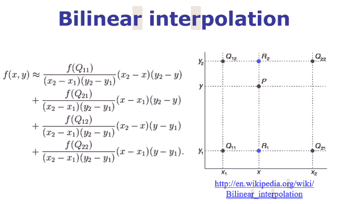
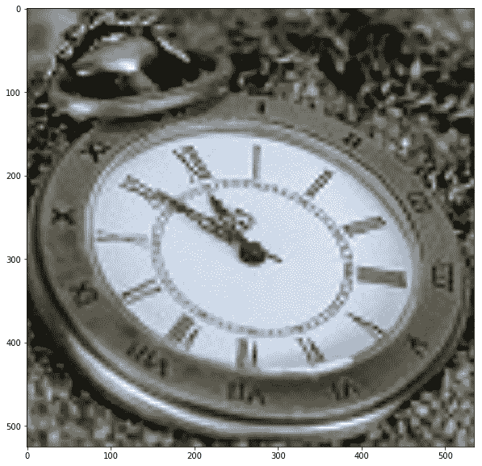
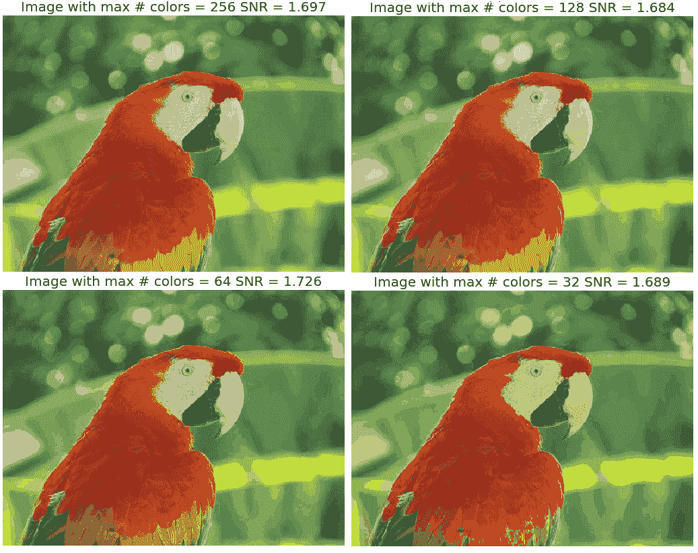
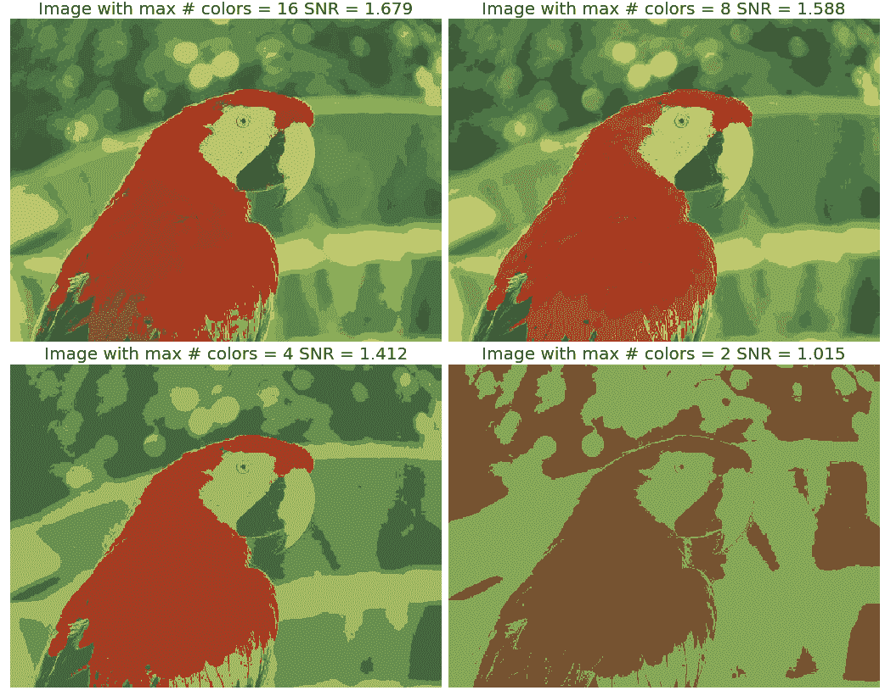
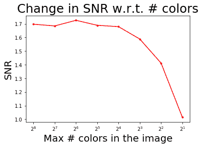
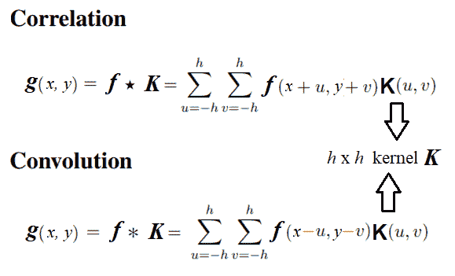
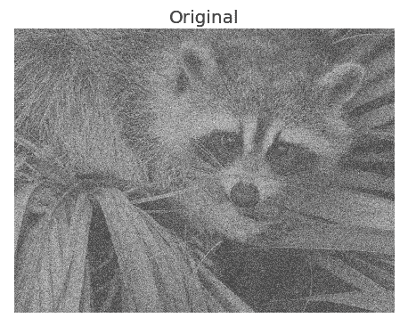
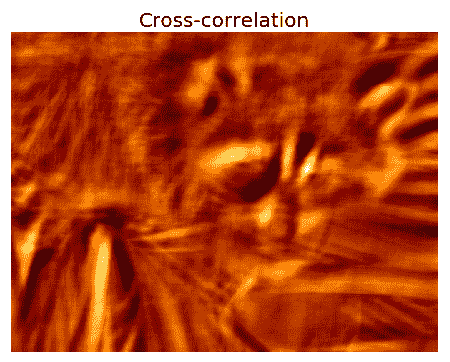

# 二、采样、傅里叶变换和卷积

在本章中，我们将讨论时域和频域中的二维信号。我们将首先讨论空间采样，这是一个用于调整图像大小的重要概念，以及采样中的挑战。我们将尝试使用 Python 库中的函数来解决这些问题。我们还将在图像中引入强度量化；强度量化意味着将使用多少位来存储图像中的像素，以及它对图像质量的影响。您肯定想了解可用于将图像从空间（时间）域转换为频域的**离散傅里叶变换**（**DFT**）。您将学习使用`numpy`和`scipy`函数使用**快速傅里叶变换**（**FFT**算法实现 DFT，并将能够在图像上应用此实现！

您还将有兴趣了解提高卷积速度的 2D 卷积。我们还将了解卷积定理的基本概念。我们将尝试用一个例子来澄清相关性和卷积之间由来已久的混淆。此外，我们将描述来自 SciPy 的一个示例，该示例将向您展示如何通过应用互相关来使用模板查找图像中特定图案的位置。

我们还将介绍一些过滤技术，并了解如何使用 Python 库实现它们。您将有兴趣看到我们使用这些过滤器对图像进行去噪后得到的结果。

我们将在本章中介绍的主题如下：

*   图像形成–采样和量化
*   离散傅里叶变换
*   理解卷积

# 图像形成–采样和量化

在本节中，我们将描述图像形成的两个重要概念，即采样和量化，并了解如何使用`PIL `和`scikit-image`库对采样和颜色进行量化来调整图像大小。我们将在这里使用实际操作的方法，我们将在看到这些概念实际应用的同时定义它们。准备好的

让我们从导入所有必需的包开始：

```py
% matplotlib inline # for inline image display inside notebookfrom PIL import Imagefrom skimage.io import imread, imshow, showimport scipy.fftpack as fpfrom scipy import ndimage, misc, signalfrom scipy.stats import signaltonoisefrom skimage import data, img_as_floatfrom skimage.color import rgb2grayfrom skimage.transform import ...
```

# 取样

采样是指选择/拒绝图像像素，这意味着它是一种空间操作。我们可以使用采样来增加或减小图像的大小，分别使用上采样和下采样。在接下来的几节中，我们将通过示例讨论不同的采样技术。

# 上采样

正如在[第 1 章](01.html)中简要讨论的，*开始图像处理*，为了增加图像的大小，我们需要对图像进行上采样。挑战在于，新的较大图像将具有一些像素，而这些像素在原始较小图像中没有相应的像素，我们需要猜测这些未知像素值。我们可以使用以下公式猜测未知像素的值：

*   聚合，例如，其最近的一个或多个已知像素邻域值的平均值
*   使用像素邻域进行双线性或三次插值的插值

基于最近邻的上采样可能会导致输出图像质量差。让我们编写代码来验证这一点：

```py
im = Image.open("../images/clock.jpg") # the original small ...
```

# 上采样和插值

为了提高上采样输出的图像质量，可以采用一些插值方法，如双线性插值或双三次插值。让我们看看如何。

**双线性插值**

让我们考虑一个灰度图像，它基本上是整数网格位置的像素值的二维矩阵。要在网格上的任意点*P*处插值像素值，可以使用线性插值的 2D 模拟：双线性插值。在这种情况下，对于每个可能的点*P*（我们要插值），四个相邻点（即*Q<sub>11</sub>*、*Q<sub>12</sub>*、*Q<sub>22</sub>*和*Q<sub>21</sub>*）这四个相邻点的强度值将被合并，以计算点 P 处的插值强度，如下图所示：



让我们使用 PIL`resize()`函数进行双线性插值：

```py
im1 = im.resize((im.width*5, im.height*5), Image.BILINEAR) # up-sample with bi-linear interpolation
pylab.figure(figsize=(10,10)), pylab.imshow(im1), pylab.show()
```

这是调整大小的图像。请注意，当双线性插值与上采样一起使用时，质量是如何提高的：


**双三次插值**

它是三次插值的扩展，用于在二维规则网格上插值数据点。插值曲面比通过双线性插值或最近邻插值获得的相应曲面更平滑。

双三次插值可以使用拉格朗日多项式、三次样条曲线或三次卷积算法来完成。PIL 在 4x4 环境中使用三次样条插值。

让我们使用 PIL`resize()`函数进行双三次插值：

```py
im.resize((im.width*10, im.height*10), Image.BICUBIC).show()  # bi-cubic interpolation
pylab.figure(figsize=(10,10)), pylab.imshow(im1), pylab.show()
```

看看当我们使用双三次插值时，调整大小的图像的质量是如何提高的：



# 下采样

为了减小图像的大小，我们需要对图像进行下采样。对于新的较小图像中的每个像素，原始较大图像中将有多个像素。我们可以通过执行以下操作来计算新图像中像素的值：

*   以系统的方式从较大的图像中删除一些像素（例如，如果我们希望图像的大小为原始图像的四分之一，则每隔一行和一列删除一个像素）
*   计算新像素值作为原始图像中对应的多个像素的聚合值

让我们使用`tajmahal.jpg`图像，并使用`resize()`函数将其调整为比输入图像小 25 倍的输出图像，同样来自 PIL 库：

```py
im = Image.open("../images/tajmahal.jpg") ...
```

# 下采样和抗锯齿

正如我们所看到的，下采样对于缩小图像不是很好，因为它会产生锯齿效果。例如，如果我们试图通过将宽度和高度减少 5 倍来调整原始图像的大小（向下采样），我们将得到如此不完整和糟糕的输出。

**抗混叠**

这里的问题是，输出图像中的单个像素对应于输入图像中的 25 个像素，但我们对单个像素的值进行采样。我们应该在输入图像的一个小区域上求平均值。这可以使用`ANTIALIAS`（高质量下采样过滤器）实现；这就是你可以做到的：

```py
im = im.resize((im.width//5, im.height//5), Image.ANTIALIAS)
pylab.figure(figsize=(15,10)), pylab.imshow(im), pylab.show()
```

使用带抗锯齿的 PIL 创建图像，与前一个图像相同，但质量更好（几乎没有任何伪影/锯齿效果）：


**抗混叠**通常在下采样之前通过平滑图像（通过使用低通滤波器（如高斯滤波器）对图像进行卷积）来完成

现在让我们使用 scikit image`transform`模块的`rescale()`抗混叠功能来克服另一个图像的混叠问题，即`umbc.png`图像：

```py
im = imread('../images/umbc.png')
im1 = im.copy()
pylab.figure(figsize=(20,15))
for i in range(4):
    pylab.subplot(2,2,i+1), pylab.imshow(im1, cmap='gray'), pylab.axis('off')
    pylab.title('image size = ' + str(im1.shape[1]) + 'x' + str(im1.shape[0]))
    im1 = rescale(im1, scale = 0.5, multichannel=True, anti_aliasing=False)
pylab.subplots_adjust(wspace=0.1, hspace=0.1)
pylab.show()
```

下一个屏幕截图显示了前面代码的输出。如图所示，图像被下采样以创建越来越小的输出。当不使用抗锯齿技术时，锯齿效果变得更加突出：


让我们更改代码行以使用抗锯齿：

```py
im1 = rescale(im1, scale = 0.5, multichannel=True, anti_aliasing=True)
```

这会产生质量更好的图像：


To learn more about interpolation and anti-aliasing, please visit my blog: [https://sandipanweb.wordpress.com/2018/01/21/recursive-graphics-bilinear-interpolation-and-image-transformation-in-Python/](https://sandipanweb.wordpress.com/2018/01/21/recursive-graphics-bilinear-interpolation-and-image-transformation-in-python/). 

# 量化

**量化**与图像的强度相关，可以通过每个像素使用的位数来定义。数字图像通常量化到 256 灰度级。这里，我们将看到，随着用于像素存储的比特数的减少，量化误差增加，导致人为边界或轮廓和像素化，并导致图像质量差。

# PIL 量子化

让我们使用 PIL`Image`模块的`convert()`函数进行颜色量化，`P `模式和颜色参数作为可能的最大颜色数。我们还将使用 SciPy`stats`模块的`signaltonoise()`函数来查找图像（`parrot.jpg`的**信噪比**（**信噪比**），其定义为图像阵列的标准偏差除以平均值：

```py
im = Image.open('../images/parrot.jpg')
pylab.figure(figsize=(20,30))
num_colors_list = [1 << n for n in range(8,0,-1)]
snr_list = []
i = 1
for num_colors in num_colors_list:
    im1 = im.convert('P', palette=Image.ADAPTIVE, colors=num_colors)
    pylab.subplot(4,2,i), pylab.imshow(im1), pylab.axis('off')
    snr_list.append(signaltonoise(im1, axis=None))
    pylab.title('Image with # colors = ' + str(num_colors) + ' SNR = ' +
    str(np.round(snr_list[i-1],3)), size=20)
    i += 1
pylab.subplots_adjust(wspace=0.2, hspace=0)
pylab.show()
```

这显示了当存储像素的位数减少时，图像质量如何随着颜色量化而降低：



框架二如下：



现在我们将绘制颜色量化对图像信噪比的影响，信噪比通常是衡量图像质量的指标，信噪比越高，质量越好：

```py
pylab.plot(num_colors_list, snr_list, 'r.-')
pylab.xlabel('# colors in the image')
pylab.ylabel('SNR')
pylab.title('Change in SNR w.r.t. # colors')
pylab.xscale('log', basex=2)
pylab.gca().invert_xaxis()
pylab.show()
```

可以看出，尽管颜色量化减小了图像大小（因为比特/像素的数量减少），但它也使图像质量变差，通过 SNR 测量：



# 离散傅里叶变换

傅里叶变换方法有着悠久的数学历史，我们不打算在这里讨论它（它可以在任何数字信号处理或数字图像处理理论书籍中找到）。就图像处理而言，我们将只关注 2D**离散傅里叶变换**（**DFT**），傅里叶变换方法背后的基本思想是，图像可以被认为是一个 2D 函数，*f，*，可以表示为正弦和余弦的加权和（傅里叶基本函数）沿二维方向。

我们可以使用 DFT 从图像中的一组灰度像素值（空间/时间域）转换为一组傅里叶系数（频域），并且它是离散的，因为空间和变换。。。

# 为什么我们需要 DFT？

首先，变换到频域可以更好地理解图像。我们将在接下来的几节中看到，频域中的低频对应于图像中信息的平均总体水平，而高频对应于边缘、噪声和更详细的信息。

通常，图像本质上是平滑的，这就是为什么大多数图像可以使用少量 DFT 系数表示，而所有剩余的更高系数几乎可以忽略不计/零。

这在图像压缩中非常有用，特别是对于傅里叶稀疏图像，其中重建图像只需要少数傅里叶系数，因此只能存储这些频率，而可以丢弃其他频率，从而实现高压缩（例如，在 JPEG 图像压缩算法中，使用了类似的变换，**离散余弦变换**（**DCT**）。此外，正如我们将在本章后面看到的，在频域中使用 DFT 进行滤波可能比在空间域中进行滤波快得多

# 计算 DFT 的快速傅里叶变换算法

**快速傅里叶变换**（**FFT**）是一种分治算法，用于递归计算 DFT，其速度（O（N.log<sub>2</sub>N）时间复杂度）比针对*nxn*图像的缓慢得多的 O（N2）*原始计算快得多。在 Python 中，`numpy`和`scipy`库都提供了使用 FFT 算法计算 2D DFT/IDFT 的函数。让我们看几个例子。*

 *# 带有 scipy.fftpack 模块的 FFT

我们将使用`scipy.fftpack`模块的`fft2()`*/*`ifft2()`函数，通过使用灰度图像`rhino.jpg`的 FFT 算法计算 DFT/IDFT：

```py
im = np.array(Image.open('../images/rhino.jpg').convert('L')) # we shall work with grayscale image
snr = signaltonoise(im, axis=None)
print('SNR for the original image = ' + str(snr))
# SNR for the original image = 2.023722773801701
# now call FFT and IFFT
freq = fp.fft2(im)
im1 = fp.ifft2(freq).real
snr = signaltonoise(im1, axis=None)
print('SNR for the image obtained after reconstruction = ' + str(snr))
# SNR for the image obtained after reconstruction = 2.0237227738013224
assert(np.allclose(im, im1)) # make sure the forward and inverse FFT are close to each other
pylab.figure(figsize=(20,10))
pylab.subplot(121), pylab.imshow(im, cmap='gray'), pylab.axis('off')
pylab.title('Original Image', size=20)
pylab.subplot(122), pylab.imshow(im1, cmap='gray'), pylab.axis('off')
pylab.title('Image obtained after reconstruction', size=20)
pylab.show()
```

以下是输出：


从内联输出的 SNR 值以及输入和重建图像的视觉差异可以看出，重建图像丢失了一些信息。如果我们使用获得的所有系数进行重建，则差异可以忽略不计

# 绘制频谱图

由于傅里叶系数是复数，我们可以直接观察震级。显示傅里叶变换的量级称为变换的**光谱。DFT 的值 F[0,0]称为**DC 系数。****

DC 系数太大，无法看到其他系数值，这就是为什么我们需要通过显示变换的对数来拉伸变换值。此外，为了便于显示，变换系数被移位（使用`fftshift()`），使得 DC 分量位于中心。对创造犀牛图像的傅里叶光谱感到兴奋吗？编码如下：

```py
# the quadrants are needed to be shifted around in order that the low spatial frequencies are in the center of the 2D fourier-transformed ...
```

# 带 numpy.FFT 模块的 FFT

可以使用`numpy.fft`模块的类似函数集计算图像的 DFT。我们将看到一些例子。

# 计算 DFT 的幅度和相位

我们将使用`house.png`图像作为输入，从而`fft2()`得到傅里叶系数的实部和虚部；之后，我们将计算幅值/频谱和相位，最后使用`ifft2()`重建图像：

```py
import numpy.fft as fpim1 = rgb2gray(imread('../images/house.png'))pylab.figure(figsize=(12,10))freq1 = fp.fft2(im1)im1_ = fp.ifft2(freq1).realpylab.subplot(2,2,1), pylab.imshow(im1, cmap='gray'), pylab.title('Original Image', size=20)pylab.subplot(2,2,2), pylab.imshow(20*np.log10( 0.01 + np.abs(fp.fftshift(freq1))), cmap='gray')pylab.title('FFT Spectrum Magnitude', size=20)pylab.subplot(2,2,3), pylab.imshow(np.angle(fp.fftshift(freq1)), cmap='gray')pylab.title('FFT ...
```

# 理解卷积

卷积是对两个图像进行操作的操作，一个是输入图像，另一个是掩码（也称为**内核**），作为输入图像上的过滤器，生成输出图像

卷积滤波用于修改图像的空间频率特性。它的工作原理是通过将所有相邻像素的加权值相加来确定中心像素的值，从而计算输出图像中像素的新值。输出图像中的像素值是通过在输入图像中遍历内核窗口来计算的，如下一个屏幕截图所示（对于有效模式的卷积；我们将在本章后面看到卷积模式）：


如您所见，内核窗口（由输入图像中的箭头标记）遍历图像，并在卷积后获得映射到输出图像上的值。

# 为什么要卷积图像？

卷积对输入图像应用通用滤波效果。这样做是为了在图像上使用适当的核实现各种效果，例如平滑、锐化和浮雕，以及在诸如边缘检测等操作中。

# SciPy 信号卷积的卷积

SciPy 信号模块的`convolve2d()`功能可用于相关。我们将使用这个函数对具有内核的图像应用卷积。

# 对灰度图像应用卷积

让我们首先使用卷积和拉普拉斯核从灰度`cameraman.jpg`图像中检测边缘，并使用`box`核模糊图像：

```py
im = rgb2gray(imread('../image s/cameraman.jpg')).astype(float)print(np.max(im))# 1.0print(im.shape)# (225, 225)blur_box_kernel = np.ones((3,3)) / 9edge_laplace_kernel = np.array([[0,1,0],[1,-4,1],[0,1,0]])im_blurred = signal.convolve2d(im, blur_box_kernel)im_edges = np.clip(signal.convolve2d(im, edge_laplace_kernel), 0, 1)fig, axes = pylab.subplots(ncols=3, sharex=True, sharey=True, figsize=(18, 6))axes[0].imshow(im, cmap=pylab.cm.gray)axes[0].set_title('Original Image', size=20)axes[1].imshow(im_blurred, cmap=pylab.cm.gray)axes[1].set_title('Box Blur', ...
```

# 卷积模式、焊盘值和边界条件

根据您想要对边缘像素执行的操作，有三个参数：`mode`、`boundary`和`fillvalue`，可以传递给 SciPy`convolve2d()`函数。在这里，我们将简要讨论`mode`论点：

*   `mode='full'`：默认模式，输出为输入的全离散线性卷积
*   `mode='valid'`：忽略边缘像素，只计算所有相邻像素（不需要零填充的像素）。输出图像大小小于所有内核的输入图像大小（1 x 1 除外）
*   `mode='same'`：输出图像与输入图像大小相同；它相对于`'full'`输出居中。

# 对彩色（RGB）图像应用卷积

使用`scipy.convolve2d()`，我们还可以锐化 RGB 图像。我们必须对每个图像通道分别应用卷积。

让我们使用带有`emboss`内核和 schar 边缘检测复合内核的`tajmahal.jpg`图像：

```py
im = misc.imread('../images/tajmahal.jpg')/255 # scale each pixel value in [0,1]print(np.max(im))print(im.shape)emboss_kernel = np.array([[-2,-1,0],[-1,1,1],[0,1,2]])edge_schar_kernel = np.array([[ -3-3j, 0-10j, +3 -3j], [-10+0j, 0+ 0j, +10+0j], [ -3+3j, 0+10j, +3 +3j]])im_embossed = np.ones(im.shape)im_edges = np.ones(im.shape)for i in range(3):    im_embossed[...,i] = np.clip(signal.convolve2d(im[...,i], emboss_kernel, mode='same', boundary="symm"),0,1)for i in range(3): ...
```

# 带 SciPy ndimage.COLVEL 的卷积

使用`scipy.ndimage.convolve()`，我们可以直接锐化 RGB 图像（我们不必对每个图像通道分别应用卷积）。

将`victoria_memorial.png`映像与`sharpen`内核和`emboss`内核一起使用：

```py
im = misc.imread('../images/victoria_memorial.png').astype(np.float) # read as float
print(np.max(im))
sharpen_kernel = np.array([0, -1, 0, -1, 5, -1, 0, -1, 0]).reshape((3, 3, 1))
emboss_kernel = np.array(np.array([[-2,-1,0],[-1,1,1],[0,1,2]])).reshape((3, 3, 1))
im_sharp = ndimage.convolve(im, sharpen_kernel, mode='nearest')
im_sharp = np.clip(im_sharp, 0, 255).astype(np.uint8) # clip (0 to 255) and convert to unsigned int
im_emboss = ndimage.convolve(im, emboss_kernel, mode='nearest')
im_emboss = np.clip(im_emboss, 0, 255).astype(np.uint8)
pylab.figure(figsize=(10,15))
pylab.subplot(311), pylab.imshow(im.astype(np.uint8)), pylab.axis('off')
pylab.title('Original Image', size=25)
pylab.subplot(312), pylab.imshow(im_sharp), pylab.axis('off')
pylab.title('Sharpened Image', size=25)
pylab.subplot(313), pylab.imshow(im_emboss), pylab.axis('off')
pylab.title('Embossed Image', size=25)
pylab.tight_layout()
pylab.show()
```

您将获得这些卷积图像：


锐化后的图像如下所示：


浮雕图像如下所示：


# 相关与卷积

相关性与卷积运算非常相似，因为它还获取一个输入图像和另一个内核，并通过计算像素邻域值与内核值的加权组合，通过输入遍历内核窗口，并生成输出图像。

唯一的区别是，与相关性不同，卷积在计算加权组合之前会翻转内核两次（相对于水平轴和垂直轴）。

下一个图表从数学上描述了图像上的相关性和卷积之间的差异：



SciPy 信号模块的`correlated2d() ...`

# 图像与模板互相关的模板匹配

在本例中，我们将使用眼睛模板图像的互相关（使用图像的内核进行互相关），眼睛在浣熊面部图像中的位置如下所示：

```py
face_image = misc.face(gray=True) - misc.face(gray=True).mean()
template_image = np.copy(face_image[300:365, 670:750]) # right eye
template_image -= template_image.mean()
face_image = face_image + np.random.randn(*face_image.shape) * 50 # add random noise
correlation = signal.correlate2d(face_image, template_image, boundary='symm', mode='same')
y, x = np.unravel_index(np.argmax(correlation), correlation.shape) # find the match
fig, (ax_original, ax_template, ax_correlation) = pylab.subplots(3, 1, figsize=(6, 15))
ax_original.imshow(face_image, cmap='gray')
ax_original.set_title('Original', size=20)
ax_original.set_axis_off()
ax_template.imshow(template_image, cmap='gray')
ax_template.set_title('Template', size=20)
ax_template.set_axis_off()
ax_correlation.imshow(correlation, cmap='afmhot')
ax_correlation.set_title('Cross-correlation', size=20)
ax_correlation.set_axis_off()
ax_original.plot(x, y, 'ro')
fig.show()
```

您已使用红点标记具有最大互相关值（与模板最佳匹配）的位置：



以下是模板：


应用互相关可获得以下输出：



从前面的图像可以看出，输入图像中浣熊的一只眼睛与眼睛模板图像的互相关度最高。

# 总结

我们讨论了一些主要与 2D DFT 及其在图像处理中的相关应用相关的重要概念，如频域滤波，并使用 scikit image`numpy.fft`、`scipy.fftpack`、`signal`和`ndimage`模块进行了大量示例。

希望您现在清楚采样和量化这两种重要的图像形成技术。我们已经看到了 2D DFT、FFT 算法的 Python 实现，以及图像去噪和恢复、DFT 在图像处理中的相关和卷积、卷积在滤波器设计中的应用以及相关在模板匹配中的应用。

您现在应该能够编写 Python 代码来执行。。。

# 问题

问题如下:

1.  使用高斯 LPF 实现下采样和消除混叠（提示：先应用高斯滤波器，然后每隔一行和一列进行滤波，将房屋灰度图像减少四次。在下采样之前，比较是否使用 LPF 进行预处理的输出图像）
2.  使用 FFT 对图像进行上采样：首先通过在每个交替位置填充零行/列，将`lena`灰度图像的大小增加一倍，然后使用 FFT，然后使用 LPF，然后使用 IFFT 获得输出图像。它为什么有效？
3.  尝试用彩色（RGB）图像应用傅里叶变换和图像重建。（提示：对每个通道分别应用 FFT）。
4.  用数学方法和 2D 核例子说明高斯核的傅里叶变换是另一个高斯核。

5.  使用`lena`图像和非对称 ripple 核生成具有相关和卷积的图像。显示输出图像不同。现在，翻转内核两次（颠倒和左右），并应用与翻转内核的相关性。输出图像是否与使用原始内核进行卷积获得的图像相同

# 进一步阅读

以下是各种来源的各种参考资料：

*   来自[的课堂讲稿 http://fy.chalmers.se/~romeo/RRY025/notes/E1.pdf](http://fy.chalmers.se/~romeo/RRY025/notes/E1.pdf)和[http://web.pdx.edu/~jduh/courses/Archive/geog481w07/Students/Ludwig_ImageConvolution.pdf](http://web.pdx.edu/~jduh/courses/Archive/geog481w07/Students/Ludwig_ImageConvolution.pdf)
*   这些幻灯片（[https://web.cs.wpi.edu/~emmanuel/courses/cs545/S14/slides/讲师 10.pdf](https://web.cs.wpi.edu/~emmanuel/courses/cs545/S14/slides/lecture10.pdf)作者：emmanuel Agu 教授
*   牛津大学讲座：[http://www.robots.ox.ac.uk/~az/touchts/ia/lect2.pdf](http://www.robots.ox.ac.uk/~az/lectures/ia/lect2.pdf)*