# 三、卷积与频域滤波

在本章中，我们将继续讨论二维卷积，并了解如何在频域中更快地进行卷积（使用卷积定理的基本概念）。我们将通过图像上的一个示例来了解相关和卷积**之间的基本区别。我们还将描述来自 SciPy 的一个示例，该示例将展示如何使用互相关在具有模板图像的图像中找到特定图案的位置。最后，我们将描述频域中的几种滤波技术（可以使用*、*核卷积实现，例如 box 核或 Gaussian 核），例如高通、低通、带通和带阻滤波器，以及如何通过示例使用 Python 库实现它们。我们将举例说明一些滤波器如何用于图像去噪（例如，`band-reject`或`notch`滤波器用于去除图像中的周期性噪声，或反向或维纳滤波器用于去除高斯/运动模糊核模糊的图像）。**

 **本章涉及的主题如下：

*   卷积定理与频域高斯模糊
*   频域滤波（使用 SciPy`ndimage`模块和`scikit-image`）

# 卷积定理与频域高斯模糊

在本节中，我们将看到更多使用 Python 模块（如`scipy signal`和`ndimage`）对图像进行卷积的应用。让我们从卷积定理开始，看看卷积运算如何在频域变得更容易。

# 卷积定理的应用

卷积定理表示**图像域中的**卷积**相当于频域中的简单乘法：**

 **

下图显示了傅里叶变换的应用：


下图显示了频域滤波的基本步骤。我们将原始图像 F*、*和内核（掩码或降级/增强函数）作为输入。首先，需要使用 DFT 将两个输入项转换为频域，然后应用卷积，根据卷积定理，卷积只是（元素）乘法。这将输出频域中的卷积图像，我们需要在其上应用 IDFT 以获得重建图像（原始图像上有一些退化或增强）：

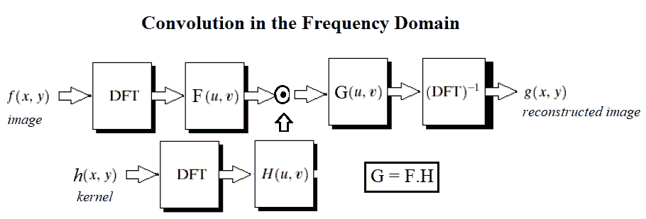

现在让我们在一些图像和一些 Python 库函数上看到定理的演示。我们需要像上一章一样导入所有必需的库。

# 基于 numpy-fft 的频域高斯模糊滤波器

以下代码块显示了如何使用卷积定理和`numpy fft`在频域中应用高斯滤波器（因为在频域中它只是乘法）：

```py
pylab.figure(figsize=(20,15))pylab.gray() # show the filtered result in grayscaleim = np.mean(imread('../images/lena.jpg'), axis=2)gauss_kernel = np.outer(signal.gaussian(im.shape[0], 5), signal.gaussian(im.shape[1], 5))freq = fp.fft2(im)assert(freq.shape == gauss_kernel.shape)freq_kernel = fp.fft2(fp.ifftshift(gauss_kernel))convolved = freq*freq_kernel # by the convolution theorem, simply multiply in the frequency domainim1 = fp.ifft2(convolved).realpylab.subplot(2,3,1), pylab.imshow(im), pylab.title('Original ...
```

# 频域中的高斯核

在本节中，我们将在二维和三维绘图中看到高斯核在频域中的样子。

**二维**中的高斯 LPF 核谱

下一个代码块显示如何使用`log`变换绘制二维高斯核的光谱：

```py
im = rgb2gray(imread('../images/lena.jpg'))
gauss_kernel = np.outer(signal.gaussian(im.shape[0], 1), signal.gaussian(im.shape[1], 1))
freq = fp.fft2(im)
freq_kernel = fp.fft2(fp.ifftshift(gauss_kernel))
pylab.imshow( (20*np.log10( 0.01 + fp.fftshift(freq_kernel))).real.astype(int), cmap='coolwarm') # 0.01 is added to keep the argument to log function always positive
pylab.colorbar()
pylab.show()
```

下面的屏幕截图显示了前面代码的输出，带有一个颜色条。由于高斯核是一个低通滤波器，其频谱对于中心频率具有更高的值（它允许更多的低频值），并且随着远离中心到更高频率值的移动而逐渐减小：


下一个屏幕截图显示了沿响应轴的三维高斯核的频谱，有对数标度和没有对数标度。可以看出，高斯核的 DFT 是另一个高斯核。三维绘图的 Python 代码留给读者作为练习（问题 3，带有提示）。

**3D**中的高斯 LPF 核谱

水平面表示频域中高斯核响应的频率平面和垂直轴，不带对数轴和带对数轴：


# 带 scipy 信号的频域高斯模糊滤波器

以下代码块显示了如何使用 SciPy 信号模块的`fftconvolve()`函数在频域中运行卷积（内部仅通过乘法和卷积定理）：

```py
im = np.mean(misc.imread('../images/mandrill.jpg'), axis=2) print(im.shape)# (224, 225)gauss_kernel = np.outer(signal.gaussian(11, 3), signal.gaussian(11, 3)) # 2D Gaussian kernel of size 11x11 with σ = 3im_blurred = signal.fftconvolve(im, gauss_kernel, mode='same')fig, (ax_original, ax_kernel, ax_blurred) = pylab.subplots(1, 3, figsize=(20,8))ax_original.imshow(im, cmap='gray')ax_original.set_title('Original', size=20)ax_original.set_axis_off()ax_kernel.imshow(gauss_kernel) ...
```

# 比较 SciPy convolve（）和 fftconvolve（）与高斯模糊内核的运行时

我们可以使用 Python`timeit`模块来比较图像域和频域卷积函数的运行时。由于频域卷积涉及单个矩阵乘法，而不是一系列滑动窗口算术计算，因此预计其速度会快得多。以下代码比较运行时：

```py
im = np.mean(misc.imread('../images/mandrill.jpg'), axis=2)
print(im.shape)
# (224, 225)
gauss_kernel = np.outer(signal.gaussian(11, 3), signal.gaussian(11, 3)) # 2D Gaussian kernel of size 11x11 with σ = 3
im_blurred1 = signal.convolve(im, gauss_kernel, mode="same")
im_blurred2 = signal.fftconvolve(im, gauss_kernel, mode='same')
def wrapper_convolve(func):
    def wrapped_convolve():
        return func(im, gauss_kernel, mode="same")
    return wrapped_convolve
wrapped_convolve = wrapper_convolve(signal.convolve)
wrapped_fftconvolve = wrapper_convolve(signal.fftconvolve)
times1 = timeit.repeat(wrapped_convolve, number=1, repeat=100)
times2 = timeit.repeat(wrapped_fftconvolve, number=1, repeat=100)
```

下面的代码块使用这两种功能显示原始的 Mandrill 图像和模糊图像：

```py
pylab.figure(figsize=(15,5))
pylab.gray()
pylab.subplot(131), pylab.imshow(im), pylab.title('Original Image',size=15), pylab.axis('off')
pylab.subplot(132), pylab.imshow(im_blurred1), pylab.title('convolve Output', size=15), pylab.axis('off')
pylab.subplot(133), pylab.imshow(im_blurred2), pylab.title('ffconvolve Output', size=15),pylab.axis('off')
```

下面的屏幕截图显示了前面代码的输出。正如所料，`convolve()`和`fftconvolve()`功能都会产生相同的模糊输出图像：

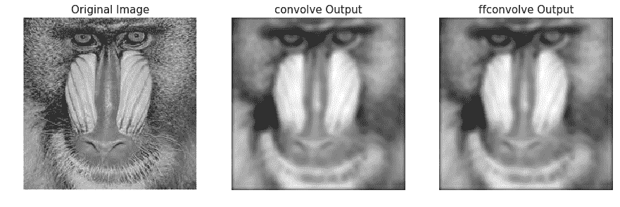

下面的代码可视化了运行时之间的差异。每个函数已在具有相同高斯核的相同输入图像上运行 100 次，然后绘制每个函数所用时间的箱线图：

```py
data = [times1, times2]
pylab.figure(figsize=(8,6))
box = pylab.boxplot(data, patch_artist=True) #notch=True,
colors = ['cyan', 'pink']
for patch, color in zip(box['boxes'], colors):
    patch.set_facecolor(color)
pylab.xticks(np.arange(3), ('', 'convolve', 'fftconvolve'), size=15)
pylab.yticks(fontsize=15)
pylab.xlabel('scipy.signal convolution methods', size=15)
pylab.ylabel('time taken to run', size = 15)
pylab.show()
```

下面的屏幕截图显示了前面代码的输出。可以看出，`fftconvolve()`平均运行速度更快：


# 频域滤波（HPF、LPF、BPF 和陷波滤波器）

如果我们记得在[第 1 章](01.html)中描述的图像处理管道中，*开始图像处理*，图像采集后的下一步是图像预处理。图像通常会因亮度和照明的随机变化而损坏，或者对比度较差，因此无法直接使用，需要增强。这是使用过滤器的地方。

# 什么是过滤器？

过滤是指变换像素强度值以显示某些图像特征，例如：

*   **增强**：此图像特征提高对比度
*   **平滑**：该图像特征去除噪声
*   **模板匹配**：该图像特征检测已知模式

滤波后的图像由离散卷积描述，滤波器由*n x n*离散卷积掩模描述。

# 高通滤波器（HPF）

该滤波器仅允许来自图像频域表示的高频（通过 DFT 获得），并阻止所有超出**截止**值的低频。图像用逆 DFT 重建，由于高频分量对应于边缘、细节、噪声等，HPFs 倾向于提取或增强它们。接下来的几节将演示如何使用`numpy`、`scipy`和`scikit-image`库中的不同函数来实现 HPF 以及 HPF 对图像的影响。

我们可以通过以下步骤在图像上实现 HPF：

1.  使用`scipy.fftpack fft2`执行 2D FFT，并获得图像的频域表示
2.  仅保留高频分量（去除。。。

# 信噪比随频率截止值的变化

下面的代码块显示了如何用 HPF 的截止频率（F）绘制**信噪比***（***信噪比***的变化：*

```py
pylab.plot(lbs, snrs_hp, 'b.-')
pylab.xlabel('Cutoff Frequency for HPF', size=20)
pylab.ylabel('SNR', size=20)
pylab.show()
```

以下屏幕截图显示了输出图像的 SNR 如何随 HPF 截止频率的增加而降低：


# 低通滤波器（LPF）

该滤波器仅允许来自图像频域表示的低频（使用 DFT 获得），并阻止所有超过截止值的高频。图像用逆 DFT 重建，由于高频分量对应于边缘、细节、噪声等，LPF 倾向于去除这些。接下来的几节将演示如何使用`numpy`、`scipy`和`scikit-image`库中的不同函数来实现 LPF 以及 LPF 对图像的影响。

# 带 scipy ndimage 和 numpy fft 的 LPF

`numpy fft`模块的`fft2()`功能也可用于对图像运行 FFT。scipy`ndimage`模块提供了一系列在频域中对图像应用 LPF 的功能。下一节将通过一个示例演示其中一个过滤器（即`fourier_gaussian()`。

# 傅里叶-高斯滤波器

来自 scipy`ndimage`模块的此函数实现多维高斯傅里叶滤波器。频率阵列与给定大小的高斯核的傅里叶变换相乘。

下一个代码块演示如何使用 LPF（**加权****平均**滤波器）模糊`lena`灰度图像：

```py
import numpy.fft as fpfig, (axes1, axes2) = pylab.subplots(1, 2, figsize=(20,10))pylab.gray() # show the result in grayscaleim = np.mean(imread('../images/lena.jpg'), axis=2)freq = fp.fft2(im)freq_gaussian = ndimage.fourier_gaussian(freq, sigma=4)im1 = fp.ifft2(freq_gaussian)axes1.imshow(im), axes1.axis('off'), axes2.imshow(im1.real) # the imaginary part is an artifactaxes2.axis('off')pylab.show()
```

以下是。。。

# 带 scipy fftpack 的 LPF

我们可以通过以下步骤在图像上实现 LPF：

1.  使用`scipy.fftpack fft2`执行 2D FFT，并获得图像的频域表示
2.  仅保留低频分量（去除高频分量）
3.  执行逆 FFT 以重建图像

下面的代码显示了实现 LPF 的 Python 代码。从下一个屏幕截图中可以看出，高频分量更多地对应于平均（平面）图像信息，随着我们去除越来越多的高频分量，图像的详细信息（例如，边缘）丢失。

例如，如果我们只保留第一个频率分量，而丢弃所有其他频率分量，在逆 FFT 后获得的结果图像中，我们几乎看不到犀牛，但随着我们保持越来越高的频率，它们在最终图像中变得突出：

```py
from scipy import fftpack
im = np.array(Image.open('../images/rhino.jpg').convert('L'))
# low pass filter
freq = fp.fft2(im)
(w, h) = freq.shape
half_w, half_h = int(w/2), int(h/2)
freq1 = np.copy(freq)
freq2 = fftpack.fftshift(freq1)
freq2_low = np.copy(freq2)
freq2_low[half_w-10:half_w+11,half_h-10:half_h+11] = 0 # block the lowfrequencies
freq2 -= freq2_low # select only the first 20x20 (low) frequencies, block the high frequencies
im1 = fp.ifft2(fftpack.ifftshift(freq2)).real
print(signaltonoise(im1, axis=None))
# 2.389151856495427
pylab.imshow(im1, cmap='gray'), pylab.axis('off')
pylab.show()
```

以下屏幕截图显示了上述代码的输出，即在输入 rhino 图像上应用 LPF 获得的总输出图像，没有更精细的细节：

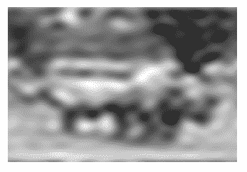

下面的代码块显示了如何在阻止高频后在对数域绘制图像的频谱；换句话说，仅允许低频：

```py
pylab.figure(figsize=(10,10))
pylab.imshow( (20*np.log10( 0.1 + freq2)).astype(int))
pylab.show()
```

以下屏幕截图显示了前面代码的输出，即在图像上应用 LPF 后获得的光谱：

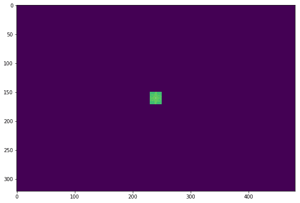

以下代码块显示了 LPF 在摄影师灰度图像上的应用，具有不同的频率截止值 F：

```py
im = np.array(Image.open('../images/cameraman.jpg').convert('L'))
freq = fp.fft2(im)
(w, h) = freq.shape
half_w, half_h = int(w/2), int(h/2)
snrs_lp = []
ubs = list(range(1,25))
pylab.figure(figsize=(12,20))
for u in ubs:
    freq1 = np.copy(freq)
    freq2 = fftpack.fftshift(freq1)
    freq2_low = np.copy(freq2)
    freq2_low[half_w-u:half_w+u+1,half_h-u:half_h+u+1] = 0
    freq2 -= freq2_low # select only the first 20x20 (low) frequencies
    im1 = fp.ifft2(fftpack.ifftshift(freq2)).real
    snrs_lp.append(signaltonoise(im1, axis=None))
    pylab.subplot(6,4,u), pylab.imshow(im1, cmap='gray'), pylab.axis('off')
    pylab.title('F = ' + str(u), size=20)
pylab.subplots_adjust(wspace=0.1, hspace=0)
pylab.show()
```

以下屏幕截图显示了随着截止频率**F**的增加，LPF 如何检测图像中越来越多的细节：

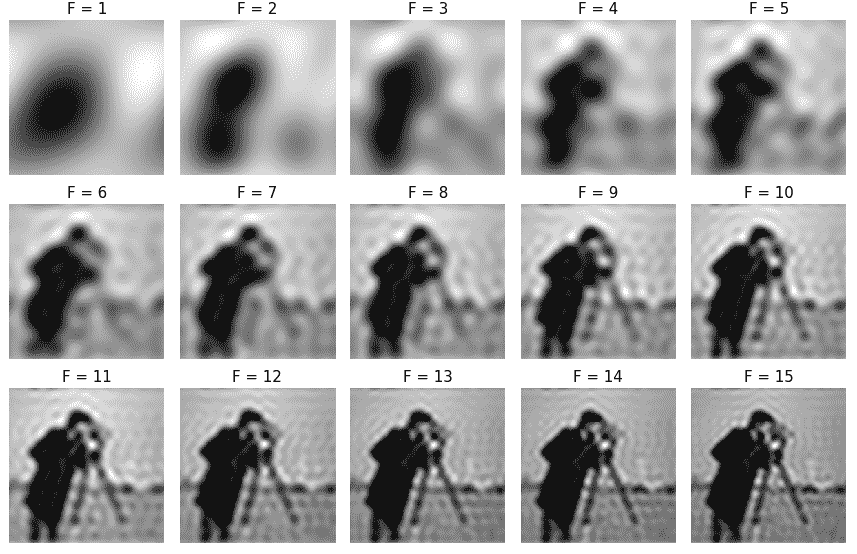


# 信噪比随截止频率的变化

下面的代码块显示了如何绘制 LPF 的截止频率（F）在**信噪比**（**信噪比**中的变化：

```py
snr = signaltonoise(im, axis=None)pylab.plot(ubs, snrs_lp, 'b.-')pylab.plot(range(25), [snr]*25, 'r-')pylab.xlabel('Cutoff Freqeuncy for LPF', size=20)pylab.ylabel('SNR', size=20)pylab.show()
```

下面的屏幕截图显示了输出图像的 SNR 如何随着 LPF 截止频率的增加而降低。红色水平线表示原始图像的 SNR，绘制用于比较：


# 带狗形滤波器（BPF）

高斯（**狗**内核的**差可以用作 BPF，允许某个频带内的频率，丢弃所有其他频率。下面的代码块显示了如何将 DoG 内核与`fftconvolve()`一起使用来实现 BPF：**

```py
from skimage import img_as_float
im = img_as_float(pylab.imread('../images/tigers.jpeg'))
pylab.figure(), pylab.imshow(im), pylab.axis('off'), pylab.show()
x = np.linspace(-10, 10, 15)
kernel_1d = np.exp(-0.005*x**2)
kernel_1d /= np.trapz(kernel_1d) # normalize the sum to 1
gauss_kernel1 = kernel_1d[:, np.newaxis] * kernel_1d[np.newaxis, :]
kernel_1d = np.exp(-5*x**2)
kernel_1d /= np.trapz(kernel_1d) # normalize the sum to 1
gauss_kernel2 = kernel_1d[:, np.newaxis] * kernel_1d[np.newaxis, :]
DoGKernel = gauss_kernel1[:, :, np.newaxis] - gauss_kernel2[:, :, np.newaxis]
im = signal.fftconvolve(im, DoGKernel, mode='same')
pylab.figure(), pylab.imshow(np.clip(im, 0, 1)), print(np.max(im)),
pylab.show()
```

以下屏幕截图显示了前面代码块的输出，即使用 BPF 获得的输出图像：


# 带阻（陷波）滤波器

该滤波器从图像的频域表示（使用 DFT 获得）中阻塞/拒绝一些选定的频率，因此得名。如下一节所述，它有助于从图像中去除**周期性噪声**。

# 使用陷波滤波器去除图像中的周期性噪声

在本例中，我们将首先向鹦鹉图像添加一些周期性（正弦）噪声，以创建一个有噪声的鹦鹉图像（这可能是由于**干扰**某些电信号造成的），然后使用以下代码块观察图像频域中噪声的影响：

```py
from scipy import fftpack
pylab.figure(figsize=(15,10))
im = np.mean(imread("../images/parrot.png"), axis=2) / 255
print(im.shape)
pylab.subplot(2,2,1), pylab.imshow(im, cmap='gray'), pylab.axis('off')
pylab.title('Original Image')
F1 = fftpack.fft2((im).astype(float))
F2 = fftpack.fftshift( F1 )
pylab.subplot(2,2,2), pylab.imshow( (20*np.log10( 0.1 + F2)).astype(int), cmap=pylab.cm.gray)
pylab.xticks(np.arange(0, im.shape[1], 25))
pylab.yticks(np.arange(0, im.shape[0], 25))
pylab.title('Original Image Spectrum')
# add periodic noise to the image
for n in range(im.shape[1]):
    im[:, n] += np.cos(0.1*np.pi*n)
pylab.subplot(2,2,3), pylab.imshow(im, cmap='gray'), pylab.axis('off')
pylab.title('Image after adding Sinusoidal Noise')
F1 = fftpack.fft2((im).astype(float)) # noisy spectrum
F2 = fftpack.fftshift( F1 )
pylab.subplot(2,2,4), pylab.imshow( (20*np.log10( 0.1 + F2)).astype(int), cmap=pylab.cm.gray)
pylab.xticks(np.arange(0, im.shape[1], 25))
pylab.yticks(np.arange(0, im.shape[0], 25))
pylab.title('Noisy Image Spectrum')
pylab.tight_layout()
pylab.show()
```

下面的屏幕截图显示了前面代码块的输出。可以看出，在 u=175 附近的频谱中，水平线上的周期性噪声变得更加突出：

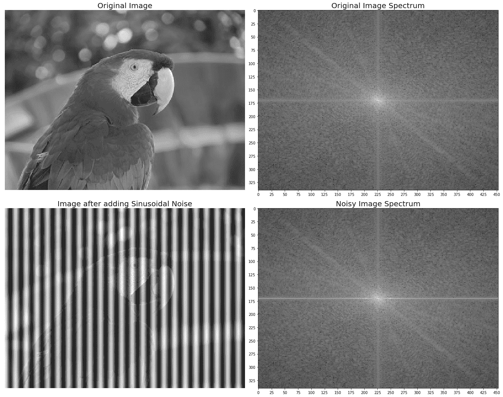

现在，让我们设计一个带阻/带阻（陷波）滤波器，通过在下一个代码块中将相应的频率分量设置为零来消除产生噪声的频率：

```py
F2[170:176,:220] = F2[170:176,230:] = 0 # eliminate the frequencies most likely responsible for noise (keep some low frequency components)
im1 = fftpack.ifft2(fftpack.ifftshift( F2 )).real
pylab.axis('off'), pylab.imshow(im1, cmap='gray'), pylab.show()
```

下面的屏幕截图显示了前面代码块的输出，即通过应用陷波滤波器恢复的图像。可以看出，原始图像看起来比恢复图像更清晰，因为来自原始图像的一些真实频率也被带阻滤波器与噪声一起拒绝：

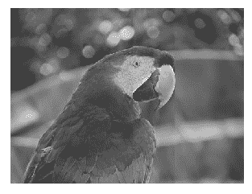

# 图像复原

在图像恢复中，对**退化**进行建模。这可以（很大程度上）消除降解的影响。挑战在于信息和噪音的丢失。下图显示了基本图像退化模型：

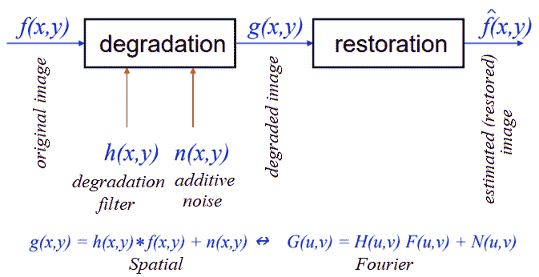

在接下来的几节中，我们将描述两种退化模型（即**逆**和维纳滤波器）。

# FFT 反褶积与反滤波

给定具有已知（假定）模糊核的模糊图像，典型的图像处理任务是恢复（至少是近似）原始图像。这个特殊的任务被称为**反褶积**。可以在频域中应用以实现这一点的简单滤波器之一是我们将在本节中讨论的逆滤波器。让我们首先使用以下代码使用高斯模糊对灰度`lena`图像进行模糊处理：

```py
im = 255*rgb2gray(imread('../images/lena.jpg'))
gauss_kernel = np.outer(signal.gaussian(im.shape[0], 3),
signal.gaussian(im.shape[1], 3))
freq = fp.fft2(im)
freq_kernel = fp.fft2(fp.ifftshift(gauss_kernel)) # this is our H
convolved = freq*freq_kernel # by convolution theorem
im_blur = fp.ifft2(convolved).real
im_blur = 255 * im_blur / np.max(im_blur) # normalize
```

现在我们可以对模糊图像使用逆滤波器（使用相同的`H`）来恢复原始图像。以下代码块演示了如何执行此操作：

```py
epsilon = 10**-6
freq = fp.fft2(im_blur)
freq_kernel = 1 / (epsilon + freq_kernel) # avoid division by zero
convolved = freq*freq_kernel
im_restored = fp.ifft2(convolved).real
im_restored = 255 * im_restored / np.max(im_restored)
print(np.max(im), np.max(im_restored))
pylab.figure(figsize=(10,10))
pylab.gray()
pylab.subplot(221), pylab.imshow(im), pylab.title('Original image'), pylab.axis('off')
pylab.subplot(222), pylab.imshow(im_blur), pylab.title('Blurred image'), pylab.axis('off')
pylab.subplot(223), pylab.imshow(im_restored), pylab.title('Restored image with inverse filter'), pylab.axis('off')
pylab.subplot(224), pylab.imshow(im_restored - im), pylab.title('Diff restored & original image'), pylab.axis('off')
pylab.show()
```

下面的屏幕截图显示了输出。可以看出，尽管逆滤波器对模糊图像进行去模糊处理，但仍存在一些信息损失：


以下屏幕截图分别以对数比例显示了逆核（HPF）、原始`lena`图像、高斯 LPF 模糊`lena`图像和恢复图像的频谱。Python 代码留给您作为练习（3）：

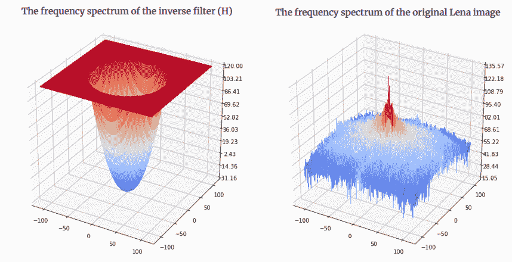


如果输入图像有噪声，则逆滤波器（HPF）性能较差，因为噪声在输出图像中也会增强（参见*问题*部分中的问题 4）。

类似地，我们可以使用逆滤波器对使用已知运动模糊核模糊的图像进行去模糊。代码保持不变；只有内核发生了更改，如下面的代码所示。请注意，我们需要创建一个大小等于原始图像大小的**零填充内核**，然后才能在频域中应用卷积（使用`np.pad()`；细节留给您作为练习）：

```py
kernel_size = 21 # a 21 x 21 motion blurred kernel
mblur_kernel = np.zeros((kernel_size, kernel_size))
mblur_kernel[int((kernel_size-1)/2), :] = np.ones(kernel_size)
mblur_kernel = mblur_kernel / kernel_size
# expand the kernel by padding zeros
```

以下屏幕截图显示了先前定义的运动模糊内核的频谱：

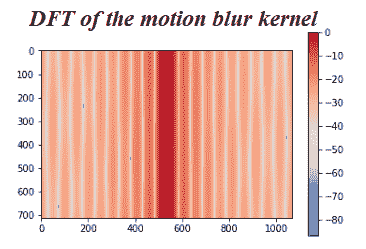

以下屏幕截图显示了带有运动模糊图像的反向过滤器的输出：

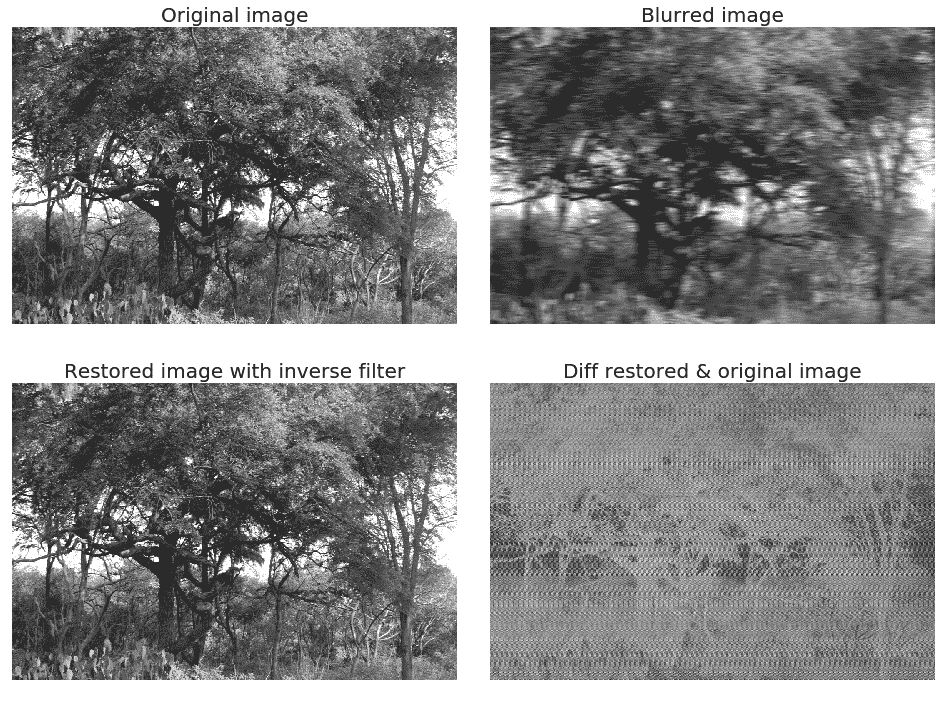

# 用维纳滤波器进行图像反褶积

在上一节中，我们已经看到了如何使用逆滤波器从模糊图像（具有已知模糊核）中获得（近似）原始图像。图像处理中的另一个重要任务是去除**损坏的**信号中的噪声。这也称为**图像恢复**。以下代码块显示了如何使用`scikit-image restoration`模块的**无监督维纳滤波器**进行图像去噪和反褶积：

```py
from skimage import color, data, restorationim = color.rgb2gray(imread('../images/elephant_g.jpg'))from scipy.signal import convolve2d as conv2n = 7psf = np.ones((n, n)) / n**2im1 = conv2(im, psf, 'same')im1 += 0.1 * astro.std() * np.random.standard_normal(im.shape) ...
```

# 基于 FFT 的图像去噪

下一个示例取自[http://www.scipy-lectures.org/intro/scipy/auto_examples/solutions/plot_fft_image_denoise.html](http://www.scipy-lectures.org/intro/scipy/auto_examples/solutions/plot_fft_image_denoise.html) 。这个例子演示了如何通过使用 LPF 和 FFT 对高频傅里叶元素进行分块，首先对图像进行去噪。让我们首先使用以下代码块显示有噪灰度图像：

```py
im = pylab.imread('../images/moonlanding.png').astype(float)
pylab.figure(figsize=(10,10))
pylab.imshow(im, pylab.cm.gray), pylab.axis('off'), pylab.title('Original image'), pylab.show()
```

以下屏幕截图显示了前面代码块的输出，即原始带噪图像：

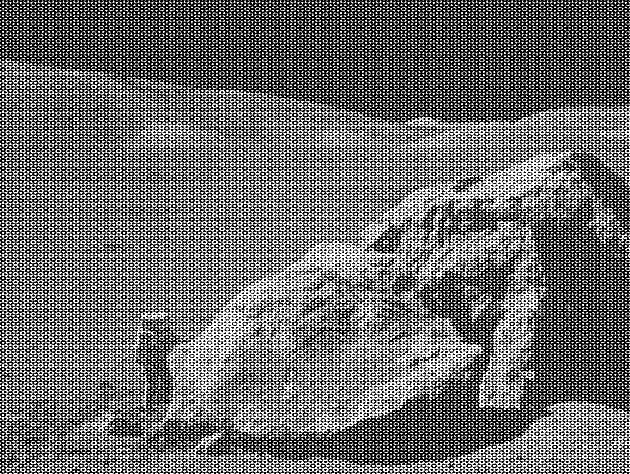

以下代码块显示噪声图像的频谱：

```py
from scipy import fftpack
from matplotlib.colors import LogNorm
im_fft = fftpack.fft2(im)
def plot_spectrum(im_fft):
    pylab.figure(figsize=(10,10))
    pylab.imshow(np.abs(im_fft), norm=LogNorm(vmin=5), cmap=pylab.cm.afmhot), pylab.colorbar()
pylab.figure(), plot_spectrum(fftpack.fftshift(im_fft))
pylab.title('Spectrum with Fourier transform', size=20)
```

以下屏幕截图显示了前面代码的输出，即原始噪声图像的傅里叶光谱：


# FFT 中的滤波器

以下代码块显示了如何拒绝一组高频并实现 LPF 以衰减图像中的噪声（对应于高频分量）：

```py
# Copy the original spectrum and truncate coefficients.# Define the fraction of coefficients (in each direction) to keep askeep_fraction = 0.1im_fft2 = im_fft.copy()# Set r and c to the number of rows and columns of the array.r, c = im_fft2.shape# Set all rows to zero with indices between r*keep_fraction and r*(1-keep_fraction)im_fft2[int(r*keep_fraction):int(r*(1-keep_fraction))] = 0# Similarly with the columnsim_fft2[:, int(c*keep_fraction):int(c*(1-keep_fraction))] = 0pylab.figure(), plot_spectrum(fftpack.fftshift(im_fft2)),pylab.title('Filtered Spectrum') ...
```

# 重建最终图像

以下代码块显示了如何使用 IFFT 从过滤的傅里叶系数重建图像：

```py
# Reconstruct the denoised image from the filtered spectrum, keep only the real part for display.
im_new = fp.ifft2(im_fft2).real
pylab.figure(figsize=(10,10)), pylab.imshow(im_new, pylab.cm.gray),
pylab.axis('off')
pylab.title('Reconstructed Image', size=20)
```

下面的屏幕截图显示了前面代码的输出，这是一个更清晰的输出图像，通过频域滤波从原始噪声图像中获得：

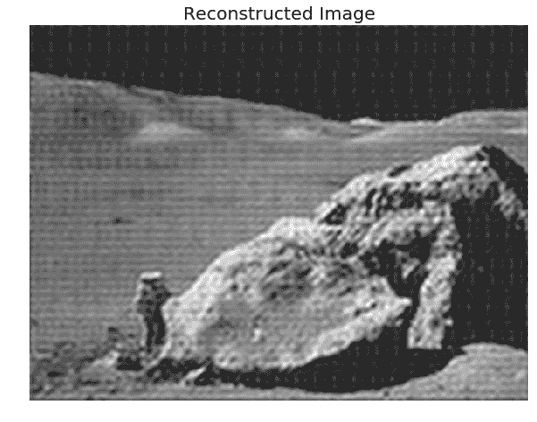

# 总结

在本章中，我们讨论了一些主要与二维卷积有关的重要概念及其在图像处理中的相关应用，如空域滤波。我们还讨论了几种不同的频域滤波技术，并用`scikit-image numpy fft`、`scipy`、`fftpack`、`signal`和`ndimage`模块的多个示例进行了说明。我们首先介绍卷积定理及其在频域滤波中的应用，各种频域滤波器，如 LPF、HPF 和陷波滤波器，最后介绍反卷积及其在设计图像恢复滤波器（如逆滤波器和维纳滤波器）中的应用。

完成本章后，读者应该能够编写 Python 代码。。。

# 问题

1.  使用`mpl_toolkits.mplot3d`模块在 3D 中绘制图像、高斯核和频域卷积后获得的图像的频谱（输出应类似于各部分所示的表面）。（提示：`np.meshgrid()`功能将在`surface`绘图中派上用场）。对反向过滤器也重复此练习。
2.  向`lena`图像添加一些随机噪声，用高斯核模糊图像，然后尝试使用逆滤波器恢复图像，如相应示例所示。发生了什么，为什么？
3.  使用 SciPy 信号的`fftconvolve()`函数在频域中对彩色图像应用高斯模糊。
4.  使用 SciPy 的`ndimage`模块的`fourier_uniform()`和`fourier_ellipsoid()`功能，分别在频域中的图像上应用具有长方体和椭球核*、*的 LPF。

# 进一步阅读

*   [https://www.cs.cornell.edu/courses/cs1114/2013sp/sections/S06_convolution.pdf](https://www.cs.cornell.edu/courses/cs1114/2013sp/sections/S06_convolution.pdf)
*   [http://www.aip.de/groups/soe/local/numres/bookcpdf/c13-3.pdf](http://www.aip.de/groups/soe/local/numres/bookcpdf/c13-3.pdf)
*   [http://www.cse.usf.edu/~r1k/MachineVisionBook/MachineVision.files/MachineVision_Chapter4.pdf](http://www.cse.usf.edu/~r1k/MachineVisionBook/MachineVision.files/MachineVision_Chapter4.pdf)
*   [https://web.stanford.edu/class/ee367/slides/lecture6.pdf](https://web.stanford.edu/class/ee367/slides/lecture6.pdf)
*   [https://pdfs.semanticscholar.org/presentation/50e8/fb095faf6ed51e03c85a2fcb7eb1ae1b1009.pdf](https://pdfs.semanticscholar.org/presentation/50e8/fb095faf6ed51e03c85a2fcb7eb1ae1b1009.pdf)
*   [http://www.robots.ox.ac.uk/~az/touchts/ia/lect2.pdf](http://www.robots.ox.ac.uk/~az/lectures/ia/lect2.pdf)*****