# 四、图像增强

在本章中，我们将讨论图像处理中一些最基本的工具，如均值/中值滤波和直方图均衡化，它们仍然是最强大的工具之一。图像增强的目的是提高图像质量或使特定特征显得更加突出。这些技术是更通用的技术，并且不假设退化过程的强模型（与图像恢复不同）。图像增强技术的一些例子是对比度拉伸、平滑和锐化。我们将使用 Python 库函数和`PIL`、`scikit-image`和`scipy ndimage`库描述这些技术的基本概念和实现。我们将熟悉简单且仍然流行的方法。

我们将从逐点强度变换开始，然后讨论对比度拉伸、阈值、半色调和抖动算法，以及相应的 Python 库函数。然后，我们将讨论不同的直方图处理技术，如直方图均衡化（其全局和自适应版本）和直方图匹配。然后，将描述几种图像去噪技术。首先，将描述一些线性平滑技术，例如平均滤波器和高斯滤波器，然后是相对较新的非线性噪声平滑技术，例如中值滤波、双边滤波和非局部均值滤波，以及如何在 Python 中实现它们。最后，将描述具有数学形态学的不同图像操作及其应用，以及实现。

本章涉及的主题如下：

*   逐点强度变换–像素变换
*   直方图处理、直方图均衡化、直方图匹配
*   线性噪声平滑（平均滤波器）
*   非线性噪声平滑（中值滤波器）

# 逐点强度变换–像素变换

如在[第 1 章](01.html)*开始图像处理*中所述，逐点强度变换操作将传递函数*T*应用于输入图像的每个像素*f（x，y）*，以在输出图像中生成对应的像素。变换可以表示为*g（x，y）=T（f（x，y））*或等效为*s=T（r）*，其中*r*是输入图像中像素的灰度，*s*是输出图像中相同像素的变换灰度。这是一种无内存操作，位置（*x*、*y*处的输出强度仅取决于同一点的输入强度。相同强度的像素得到相同的变换。这不会带来新的信息。。。

# 对数变换

当我们需要压缩或拉伸图像中一定范围的灰度时，对数变换非常有用；例如，为了显示傅里叶频谱（其中直流分量值远高于其他分量，因此如果没有对数变换，几乎总是看不到其他频率分量）。对数变换的点变换函数为一般形式，其中*c*为常数*。*

让我们实现输入图像颜色通道的直方图：

```py
def plot_image(image, title=''):
    pylab.title(title, size=20), pylab.imshow(image)
    pylab.axis('off') # comment this line if you want axis ticks

def plot_hist(r, g, b, title=''):
    r, g, b = img_as_ubyte(r), img_as_ubyte(g), img_as_ubyte(b)
    pylab.hist(np.array(r).ravel(), bins=256, range=(0, 256), color='r', alpha=0.5)
    pylab.hist(np.array(g).ravel(), bins=256, range=(0, 256), color='g', alpha=0.5)
    pylab.hist(np.array(b).ravel(), bins=256, range=(0, 256), color='b', alpha=0.5)
    pylab.xlabel('pixel value', size=20), pylab.ylabel('frequency', size=20)
    pylab.title(title, size=20)

im = Image.open("../images/parrot.png")
im_r, im_g, im_b = im.split()
pylab.style.use('ggplot')
pylab.figure(figsize=(15,5))
pylab.subplot(121), plot_image(im, 'original image')
pylab.subplot(122), plot_hist(im_r, im_g, im_b,'histogram for RGB channels')
pylab.show()
```

以下屏幕截图显示了应用对数变换前原始图像颜色通道直方图的输出：


现在，让我们使用 PIL 图像模块的`point()`功能应用对数变换，并对 RGB 图像不同颜色通道直方图的变换产生影响：

```py
im = im.point(lambda i: 255*np.log(1+i/255))
im_r, im_g, im_b = im.split()
pylab.style.use('ggplot')
pylab.figure(figsize=(15,5))
pylab.subplot(121), plot_image(im, 'image after log transform')
pylab.subplot(122), plot_hist(im_r, im_g, im_b, 'histogram of RGB channels log transform')
pylab.show()
```

输出显示了不同颜色通道的直方图压缩方式：

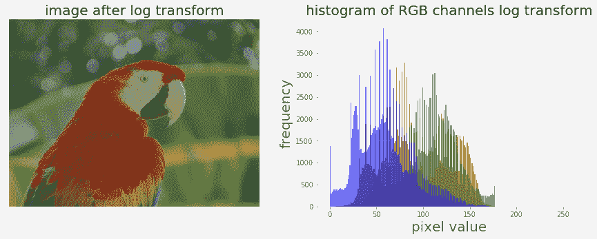

# 幂律变换

正如我们已经看到的，使用[第 1 章](01.html)中的 PIL`point()`函数，*开始图像处理*中的点变换（传递函数为一般形式，s=*T（r）=c.r<sup>γ</sup>*，其中*c*为常数）在灰度图像上进行，这次让我们对带有`scikit-image`的 RGB 彩色图像应用幂律变换，然后可视化变换对颜色通道直方图的影响：

```py
im = img_as_float(imread('../images/earthfromsky.jpg'))gamma = 5im1 = im**gammapylab.style.use('ggplot')pylab.figure(figsize=(15,5))pylab.subplot(121), plot_hist(im[...,0], im[...,1], im[...,2], 'histogram for RGB channels (input)')pylab.subplot(122), plot_hist(im1[...,0], im1[...,1], im1[...,2], 'histogram for RGB channels ...
```

# 对比拉伸

对比度拉伸操作将低对比度图像作为输入，并拉伸较窄的强度值范围以跨越期望的较宽值范围，以便输出高对比度输出图像，从而增强图像的对比度。它只是一个应用于图像像素值的线性缩放函数，因此图像增强没有那么剧烈（与其更复杂的对应直方图均衡化相比，稍后将进行描述）。以下屏幕截图显示了对比度拉伸的点变换功能：


从前面的屏幕截图可以看出，在可以执行拉伸之前，需要指定像素值上限和下限（图像将在其上被归一化）（例如，对于灰度图像，限制通常设置为 0 和 255，以便输出图像跨越可用像素值的整个范围）。我们需要从原始图像的 CDF 中找到一个合适的值*m*。对比度拉伸变换通过使原始图像中的值*m*以下的级别变暗（换言之，将值拉伸到下限），并使值*m*之前的级别变亮（将值拉伸到上限），从而产生比原始图像更高的对比度在原始图像中。以下各节介绍如何使用 PIL 库实现对比度拉伸。

# 使用 PIL 作为点操作

让我们首先加载一个彩色 RGB 图像，并将其跨颜色通道分割，以可视化不同颜色通道的像素值直方图：

```py
im = Image.open('../images/cheetah.png')im_r, im_g, im_b, _ = im.split()pylab.style.use('ggplot')pylab.figure(figsize=(15,5))pylab.subplot(121)plot_image(im)pylab.subplot(122)plot_hist(im_r, im_g, im_b)pylab.show()
```

下面的屏幕截图显示了上一个代码块的输出。可以看出，输入的猎豹图像是低对比度图像，因为颜色通道直方图集中在特定的值范围内（右偏），而不是分布在所有可能的像素值上：

对比度拉伸操作拉伸过度集中的灰度。。。

# 使用 PIL 图像增强模块

`ImageEnhance`模块也可用于对比度拉伸。下面的代码块显示了如何使用来自对比度对象的`enhance()`方法来增强相同输入图像的对比度：

```py
contrast = ImageEnhance.Contrast(im)
im1 = np.reshape(np.array(contrast.enhance(2).getdata()).astype(np.uint8), (im.height, im.width, 4)) 
pylab.style.use('ggplot')
pylab.figure(figsize=(15,5))
pylab.subplot(121), plot_image(im1)
pylab.subplot(122), plot_hist(im1[...,0], im1[...,1], im1[...,2]), pylab.yscale('log',basey=10)
pylab.show()
```

下面显示了代码的输出。可以看出，输入图像的对比度增强，颜色通道直方图向端点拉伸：

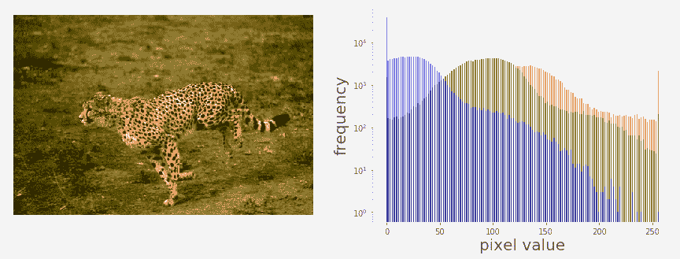

# 阈值

这是一个点操作，通过将低于某个阈值的所有像素变为零，将高于该阈值的所有像素变为一，从灰度图像创建二值图像，如以下屏幕截图所示：


如果*g（x，y）*是*f（x，y）*在某个全局阈值*T*下的阈值版本，则可以应用以下内容：

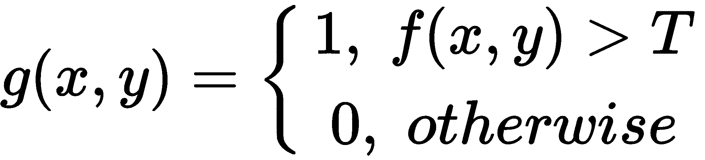

为什么我们需要一个二进制图像？有几个原因，例如，我们可能对将图像分为前景和背景感兴趣；该图像将使用黑白打印机打印（以及所有。。。

# 有固定的门槛

下面的代码块显示了如何使用 PIL`point()`功能对固定阈值进行阈值化：

```py
im = Image.open('../images/swans.jpg').convert('L')
pylab.hist(np.array(im).ravel(), bins=256, range=(0, 256), color='g')
pylab.xlabel('Pixel values'), pylab.ylabel('Frequency'),
pylab.title('Histogram of pixel values')
pylab.show()
pylab.figure(figsize=(12,18))
pylab.gray()
pylab.subplot(221), plot_image(im, 'original image'), pylab.axis('off')
th = [0, 50, 100, 150, 200]
for i in range(2, 5):
    im1 = im.point(lambda x: x > th[i])
    pylab.subplot(2,2,i), plot_image(im1, 'binary image with threshold=' + str(th[i]))
pylab.show()
```

下面的屏幕截图显示了前面代码的输出。首先，我们可以从以下方面看到输入图像中像素值的分布：

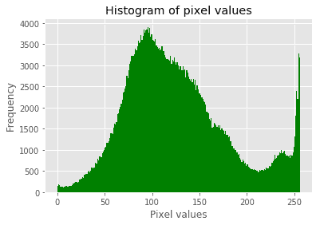

此外，从下面可以看出，使用不同灰度阈值获得的二值图像未正确着色，导致被称为**假轮廓*的伪像：*

 *

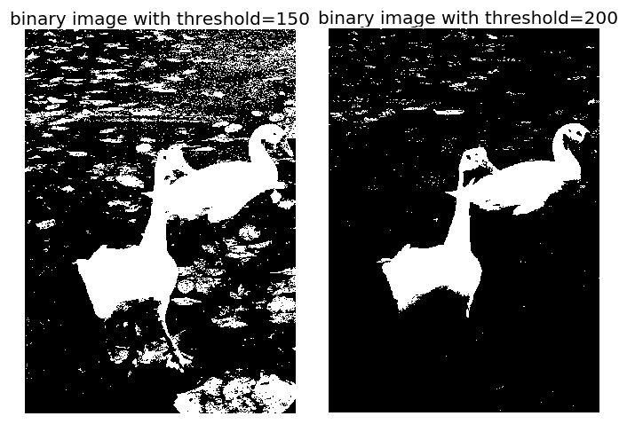

在讨论图像分割时，我们将在[第 6 章](06.html)、*形态学图像处理*中详细讨论几种不同的阈值算法。

# 半色调

在阈值化（二进制量化）中减少假轮廓伪影的一种方法是在量化之前向输入图像添加均匀分布的白噪声。具体地说，对于灰度图像的每个输入像素，*f（x，y）*，我们添加一个独立的均匀[-128128]随机数，然后进行阈值化。这种技术被称为半色调。以下代码块显示了一个实现：

```py
im = Image.open('../images/swans.jpg').convert('L')im = Image.fromarray(np.clip(im + np.random.randint(-128, 128, (im.height, im.width)), 0, 255).astype(np.uint8))pylab.figure(figsize=(12,18))pylab.subplot(221), plot_image(im, 'original image (with noise)')th = [0, 50, 100, 150, 200]for i in range(2, 5): im1 = im.point(lambda ...
```

# 具有误差扩散的 Floyd-Steinberg 抖动

同样，为了防止大规模模式（例如假轮廓），使用有意应用的噪声形式来随机化量化误差。这个过程被称为**抖动**。Floyd Steinberg 算法使用误差扩散技术实现抖动，换句话说，它将像素的剩余量化误差推（加）到相邻像素上，稍后处理。它根据以下屏幕截图中所示的分布将量化误差展开，作为相邻像素的映射：


在先前的截图中，当前像素用星（*）表示，空白像素表示先前扫描的像素。该算法从左到右、从上到下扫描图像。每次量化误差分布在相邻像素（尚未被扫描）之间时，它依次量化像素值，而不影响已经被量化的像素。因此，如果已向下舍入多个像素，则更可能通过算法向上舍入后续像素，从而使平均量化误差接近于零。

以下屏幕截图显示了算法伪代码：

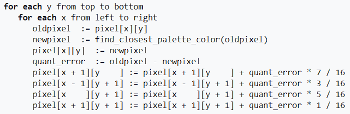

下面的屏幕截图显示了使用前面伪代码的 Python 实现获得的输出二进制图像；与之前的半色调方法相比，它在获得的二值图像质量方面有了显著的改进：


代码留作练习。

# 直方图处理–直方图均衡化和匹配

直方图处理技术为改变图像中像素值的动态范围提供了更好的方法，从而使其强度直方图具有所需的形状。正如我们所看到的，对比度拉伸操作的图像增强受到限制，因为它只能应用线性缩放函数。

通过使用非线性（非单调）传递函数将输入像素强度映射到输出像素强度，直方图处理技术可以更强大。在本节中，我们将使用`scikit-image`库的曝光模块演示两种技术的实现，即直方图均衡化和直方图匹配。。。

# 基于 scikit 图像的对比度拉伸和直方图均衡化

直方图均衡化使用单调和非线性映射，该映射重新分配输入图像中的像素强度值，使得输出图像具有均匀的强度分布（平坦直方图），从而增强图像的对比度。下面的屏幕截图描述了直方图均衡化的转换函数：

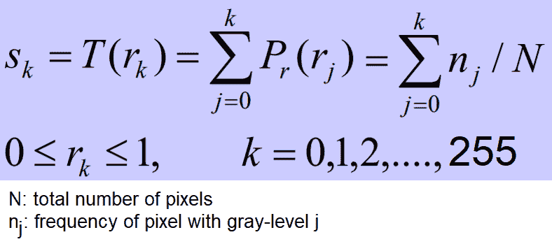

下面的代码块显示了如何使用曝光模块的`equalize_hist()`功能对 scikit 图像*进行直方图均衡化。*直方图均衡化实现有两种不同的风格：一种是对整个图像进行全局操作，另一种是局部（自适应）操作，通过将图像划分为块并在每个块上运行直方图均衡化来完成：

```py
img = rgb2gray(imread('../images/earthfromsky.jpg'))
# histogram equalization
img_eq = exposure.equalize_hist(img)
# adaptive histogram equalization
img_adapteq = exposure.equalize_adapthist(img, clip_limit=0.03)
pylab.gray()
images = [img, img_eq, img_adapteq]
titles = ['original input (earth from sky)', 'after histogram equalization', 'after adaptive histogram equalization']
for i in range(3):
    pylab.figure(figsize=(20,10)), plot_image(images[i], titles[i])
pylab.figure(figsize=(15,5))
for i in range(3):
    pylab.subplot(1,3,i+1), pylab.hist(images[i].ravel(), color='g'), pylab.title(titles[i], size=15)
pylab.show()
```

下面的屏幕截图显示了上一个代码块的输出。可以看出，直方图均衡化后，输出图像的直方图变得几乎均匀（以*x*轴表示像素值，以*y*轴表示对应的频率），尽管自适应直方图均衡化比全局直方图均衡化更清楚地揭示了图像的细节：


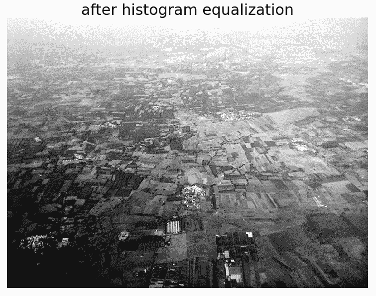

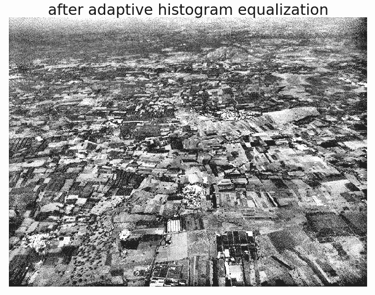

以下屏幕截图显示了局部（近似均匀）与自适应（拉伸和分段均匀）直方图均衡化的像素分布变化情况：

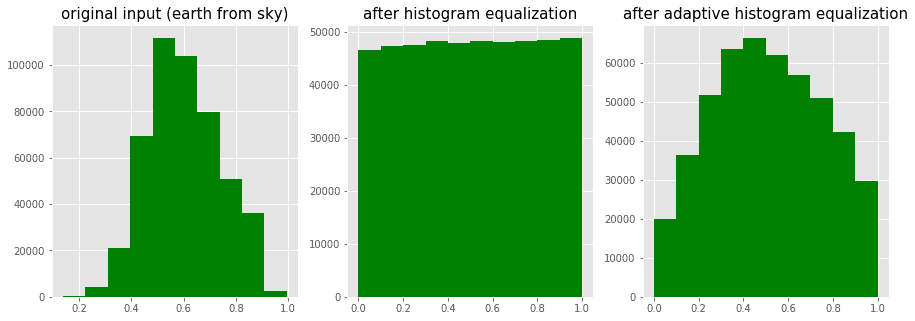

以下代码块将使用两种不同的直方图处理技术（即对比度拉伸和直方图均衡化）获得的图像增强与`scikit-image`进行比较：

```py
import matplotlib
matplotlib.rcParams['font.size'] = 8
def plot_image_and_hist(image, axes, bins=256):
    image = img_as_float(image)
    axes_image, axes_hist = axes
    axes_cdf = axes_hist.twinx()
    axes_image.imshow(image, cmap=pylab.cm.gray)
    axes_image.set_axis_off()
    axes_hist.hist(image.ravel(), bins=bins, histtype='step', color='black')
    axes_hist.set_xlim(0, 1)
    axes_hist.set_xlabel('Pixel intensity', size=15)
    axes_hist.ticklabel_format(axis='y', style='scientific', scilimits=(0, 0))
    axes_hist.set_yticks([])
    image_cdf, bins = exposure.cumulative_distribution(image, bins)
    axes_cdf.plot(bins, image_cdf, 'r')
    axes_cdf.set_yticks([])
    return axes_image, axes_hist, axes_cdf

im = io.imread('../images/beans_g.png')
# contrast stretching
im_rescale = exposure.rescale_intensity(im, in_range=(0, 100), out_range=(0, 255))
im_eq = exposure.equalize_hist(im) # histogram equalization
im_adapteq = exposure.equalize_adapthist(im, clip_limit=0.03) # adaptive histogram equalization

fig = pylab.figure(figsize=(15, 7))
axes = np.zeros((2, 4), dtype = np.object)
axes[0, 0] = fig.add_subplot(2, 4, 1)
for i in range(1, 4):
    axes[0, i] = fig.add_subplot(2, 4, 1+i, sharex=axes[0,0], sharey=axes[0,0])
for i in range(0, 4):
    axes[1, i] = fig.add_subplot(2, 4, 5+i)
axes_image, axes_hist, axes_cdf = plot_image_and_hist(im, axes[:, 0])
axes_image.set_title('Low contrast image', size=20)
y_min, y_max = axes_hist.get_ylim()
axes_hist.set_ylabel('Number of pixels', size=20)
axes_hist.set_yticks(np.linspace(0, y_max, 5))
axes_image, axes_hist, axes_cdf = plot_image_and_hist(im_rescale, axes[:,1])
axes_image.set_title('Contrast stretching', size=20)
axes_image, axes_hist, axes_cdf = plot_image_and_hist(im_eq, axes[:, 2])
axes_image.set_title('Histogram equalization', size=20)
axes_image, axes_hist, axes_cdf = plot_image_and_hist(im_adapteq, axes[:,3])
axes_image.set_title('Adaptive equalization', size=20)
axes_cdf.set_ylabel('Fraction of total intensity', size=20)
axes_cdf.set_yticks(np.linspace(0, 1, 5))
fig.tight_layout()
pylab.show()
```

下面的屏幕截图显示了前面代码的输出。可以看出，自适应直方图均衡化在使输出图像的细节更清晰方面提供了比直方图均衡化更好的结果：

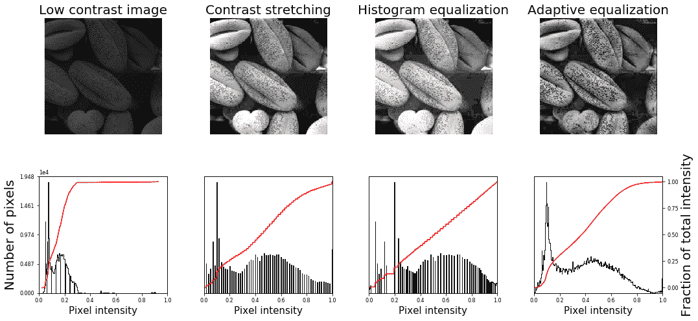

使用低对比度彩色 cheetah 输入图像，前面的代码生成以下输出：

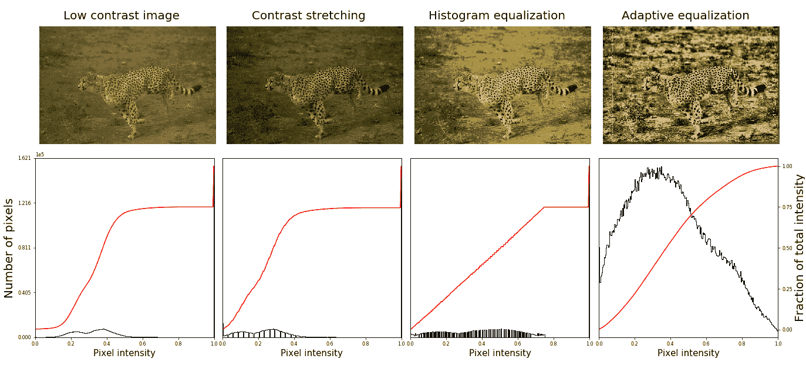

# 直方图匹配

直方图匹配是一个过程，其中图像的直方图与另一参考（模板）图像的直方图相匹配。算法如下：

1.  将为每个图像计算累积直方图，如以下屏幕截图所示。
2.  对于任意给定的像素值*x**<sub>i</sub>*【待调整】在输入图像中，我们需要通过匹配输入图像的直方图和模板图像的直方图，在输出图像中找到对应的像素值*x**<sub>j</sub>*。
3.  *x**<sub>i</sub>*像素值具有由*G（x**<sub>i</sub>**给出的累积直方图值。找到一个像素值*x**<sub>j</sub>*，使得参考图像中的累积分布值，即*H（x**<sub>j</sub>**）*等于【T28 G（x<sub>i</sub>。*
**   将输入数据值*x**i*替换为*x*<sub>j</sub>：*

 *# RGB 图像的直方图匹配

对于每个颜色通道，可以独立进行匹配，以获得如下输出：


**输出图像**

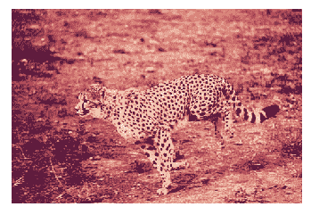

实现这一点的 Python 代码留给读者作为练习（问题部分的问题 1）。

# 线性噪声平滑

线性（空间）滤波是一种具有（邻域中）像素值加权和的函数。它是对图像的线性操作，可用于模糊/降噪。在预处理步骤中使用模糊；例如，删除小的（不相关的）细节。几种常用的线性滤波器是盒滤波器和高斯滤波器。滤波器是用一个小的（例如，3 x 3）内核（mask）实现的，通过在输入图像上滑动 mask 并将滤波器函数应用于输入图像中的每个可能像素来重新计算像素值（与遮罩对应的输入图像的中心像素值被像素值的加权和替换，并带有来自遮罩的权重）。。。

# PIL 光整

以下各节说明如何使用 PIL`ImageFilter`模块的功能进行线性噪声平滑；换句话说，使用线性滤波器进行噪声平滑。

# 使用 ImageFilter.BLUR 进行平滑

以下显示了如何使用 PIL`ImageFilter`模块的滤波功能应用模糊来消除噪声图像。输入图像上的噪声级别会发生变化，以查看其对模糊过滤器的影响。本例的输入图像使用流行的 mandrill（狒狒）图像；图像受知识共享许可证（[的保护 https://creativecommons.org/licenses/by-sa/2.0/](https://creativecommons.org/licenses/by-sa/2.0/) ），可在[找到 https://www.flickr.com/photos/uhuru1701/2249220078](https://www.flickr.com/photos/uhuru1701/2249220078) 并在 SIPI 图像数据库中：[http://sipi.usc.edu/database/database.php?volume=misc &图像=10#顶部](http://sipi.usc.edu/database/database.php?volume=misc&image=10#top)：

```py
i = 1pylab.figure(figsize=(10,25))for prop_noise in np.linspace(0.05,0.3,3):    im = Image.open('../images/mandrill.jpg') # choose 5000 random locations inside ...
```

# 使用框模糊核进行平均平滑

下面的代码块显示了如何使用 PIL`ImageFilter.Kernel()`函数和大小为 3 x 3 和 5 x 5 的框模糊核（平均滤波器）平滑带噪图像：

```py
im = Image.open('../images/mandrill_spnoise_0.1.jpg')
pylab.figure(figsize=(20,7))
pylab.subplot(1,3,1), pylab.imshow(im), pylab.title('Original Image', size=30), pylab.axis('off')
for n in [3,5]:
    box_blur_kernel = np.reshape(np.ones(n*n),(n,n)) / (n*n)
    im1 = im.filter(ImageFilter.Kernel((n,n), box_blur_kernel.flatten()))
    pylab.subplot(1,3,(2 if n==3 else 3))
    plot_image(im1, 'Blurred with kernel size = ' + str(n) + 'x' + str(n))
pylab.suptitle('PIL Mean Filter (Box Blur) with different Kernel size',
size=30)
pylab.show()
```

下面的屏幕截图显示了前面代码的输出。可以看出，输出图像是通过将较大尺寸的框模糊核与平滑的噪声图像卷积而获得的：

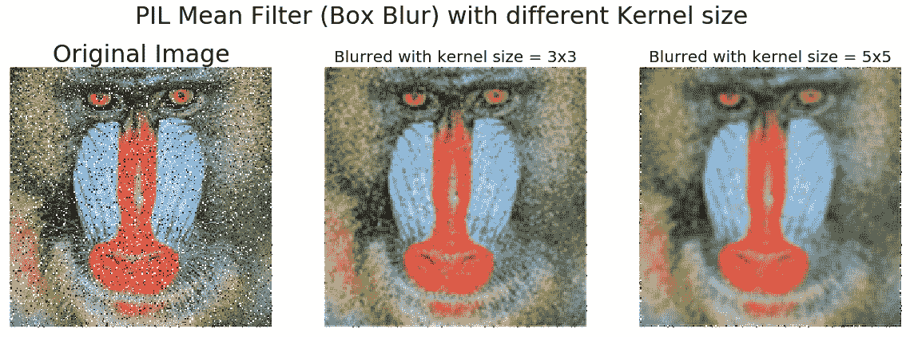

# 高斯模糊滤波器的平滑

高斯模糊滤波器也是一种线性滤波器，但与简单平均滤波器不同，它采用内核窗口内像素的加权平均值来平滑像素（对应于相邻像素的权重随相邻像素到像素的距离呈指数下降）。以下代码显示了如何使用 PIL`ImageFilter.GaussianBlur()`来平滑具有不同内核半径参数值的噪声较大的图像：

```py
im = Image.open('../images/mandrill_spnoise_0.2.jpg')pylab.figure(figsize=(20,6))i = 1for radius in range(1, 4):    im1 = im.filter(ImageFilter.GaussianBlur(radius))    pylab.subplot(1,3,i), plot_image(im1, 'radius = ' +    str(round(radius,2)))    i += 1pylab.suptitle('PIL ...
```

# 使用 SciPy ndimage 比较盒核和高斯核的平滑

我们也可以使用 SciPy 的`ndimage`模块函数将线性滤波器应用于平滑图像。下面的代码片段演示了将线性滤波器应用于因脉冲（椒盐）噪声而退化的顶钻图像的结果：

```py
from scipy import misc, ndimage
import matplotlib.pylab as pylab
im = misc.imread('../images/mandrill_spnoise_0.1.jpg')
k = 7 # 7x7 kernel
im_box = ndimage.uniform_filter(im, size=(k,k,1))
s = 2 # sigma value
t = (((k - 1)/2)-0.5)/s # truncate parameter value for a kxk gaussian kernel with sigma s
im_gaussian = ndimage.gaussian_filter(im, sigma=(s,s,0), truncate=t)
fig = pylab.figure(figsize=(30,10))
pylab.subplot(131), plot_image(im, 'original image')
pylab.subplot(132), plot_image(im_box, 'with the box filter')
pylab.subplot(133), plot_image(im_gaussian, 'with the gaussian filter')
pylab.show()
```

下面的屏幕截图显示了前面代码的输出。可以看出，与σ=2 的相同大小的高斯滤波器相比，相同内核大小的盒滤波器对输出图像的模糊程度更高：

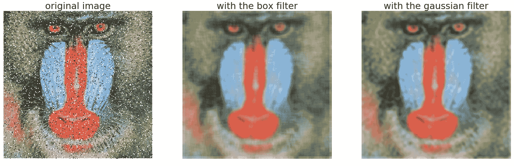

# 非线性噪声平滑

非线性（空间）滤波器也作用于邻域，通过像线性滤波器一样在图像上滑动内核（掩码）来实现。然而，滤波操作是有条件地基于邻域中像素的值，并且它们通常不以乘积和的方式显式地使用系数。例如，可以使用非线性滤波器有效地降低噪声，其基本功能是计算滤波器所在邻域中的中值灰度值。该滤波器是非线性滤波器，因为中值计算是非线性运算。中值滤波器非常流行，因为对于某些类型的随机噪声（例如，脉冲噪声），它们。。。

# PIL 光整

PIL`ImageFilter`模块提供一组用于图像非线性去噪的功能。在本节中，我们将用示例演示其中的一些。

# 使用中值滤波器

中值滤波器用相邻像素值的中值替换每个像素。此过滤器非常适合去除椒盐噪声，尽管它可以去除图像中的小细节。我们需要对邻域强度进行排名，然后选择中间值。中值滤波对统计异常值具有弹性，模糊程度较低，且易于实现。下面的代码块显示了如何使用 PIL`ImageFilter`模块的`MedianFilter()`函数，在添加不同级别的噪声和用于中值滤波器的不同大小的内核窗口的情况下，从带噪的山楂图像中去除椒盐噪声：

```py
i = 1pylab.figure(figsize=(25,35))for prop_noise in np.linspace(0.05,0.3,3): ...
```

# 使用最大和最小过滤器

下面的代码显示了如何使用`MaxFilter()`去除图像中的椒盐噪声，然后使用`MinFilter()`去除图像中的椒盐噪声：

```py
im = Image.open('../images/mandrill_spnoise_0.1.jpg')
pylab.subplot(1,3,1)
plot_image(im, 'Original Image with 10% added noise')
im1 = im.filter(ImageFilter.MaxFilter(size=sz)) 
pylab.subplot(1,3,2), plot_image(im1, 'Output (Max Filter size=' + str(sz) + ')') 
im1 = im1.filter(ImageFilter.MinFilter(size=sz)) 
pylab.subplot(1,3,3), plot_image(im1, 'Output (Min Filter size=' + str(sz) + ')', size=15) 
pylab.show()
```

下面的屏幕截图显示了上一个代码块的输出。可以看出，最大和最小滤波器分别在去除噪声图像中的椒盐噪声方面有一定的效果：

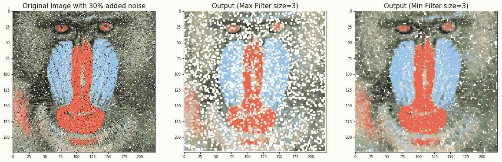

# 使用 scikit 图像平滑（去噪）

`scikit-image`库还在恢复模块中提供了一组非线性滤波器。在以下部分中，我们将讨论两个非常有用的过滤器，即双边和非局部均值过滤器。

# 使用双边滤波器

双边滤波器是一种边缘保持平滑滤波器。对于该过滤器，中心像素被设置为其某些相邻像素值的加权平均值，只有亮度与中心像素大致相似的像素。在本节中，我们将了解如何使用`scikit-image`包的双边滤波器实现对图像进行去噪。首先，让我们从以下灰度级山脉图像创建一个带噪图像：


下面的代码块演示如何使用 numpy`random_noise()`函数：

```py
im = color.rgb2gray(img_as_float(io.imread('../images/mountain.png')))
sigma = 0.155
noisy = random_noise(im, var=sigma**2)
pylab.imshow(noisy)
```

下面的屏幕截图显示了通过使用前面的代码将随机噪声添加到原始图像中而创建的噪声图像：

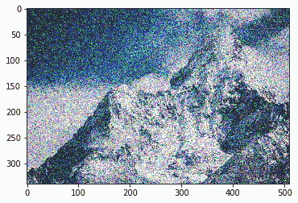

下面的代码块演示了如何使用双边滤波器对先前的噪声图像进行去噪，参数*σ*<sub>*颜色*</sub>和*σ<sub>空间</sub>*的值不同：

```py
pylab.figure(figsize=(20,15))
i = 1
for sigma_sp in [5, 10, 20]:
    for sigma_col in [0.1, 0.25, 5]:
        pylab.subplot(3,3,i)
        pylab.imshow(denoise_bilateral(noisy, sigma_color=sigma_col,
        sigma_spatial=sigma_sp, multichannel=False))
        pylab.title(r'$\sigma_r=$' + str(sigma_col) + r', $\sigma_s=$' + str(sigma_sp), size=20)
        i += 1
pylab.show()
```

下面的屏幕截图显示了前面代码的输出。可以看出，如果标准偏差更高，图像会变得更模糊，但噪声更小。执行上一个代码块需要几分钟，因为在 RGB 图像上的实现速度更慢：

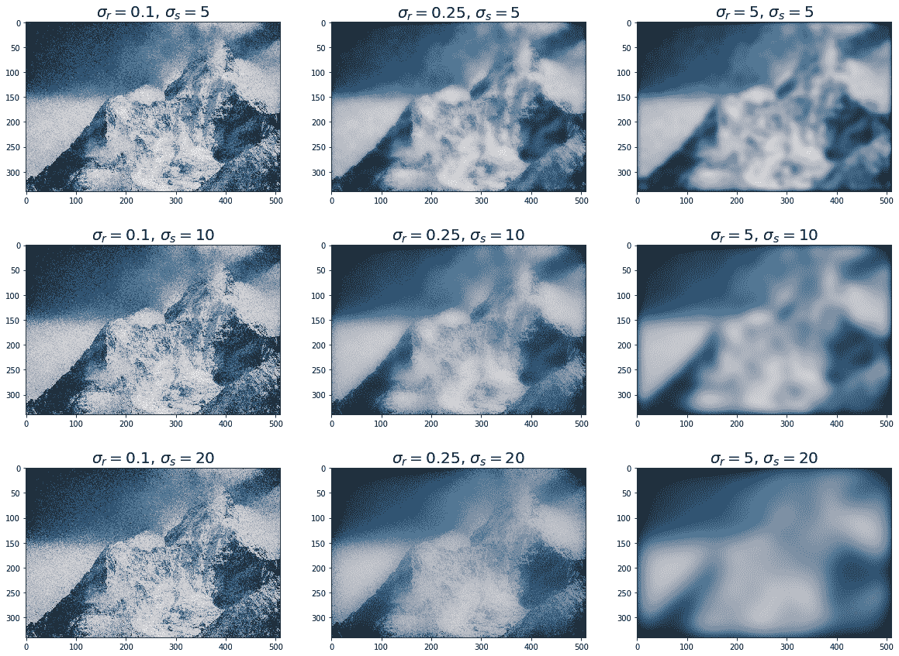

# 使用非本地手段

非局部平均是一种保留纹理的非线性去噪算法。在该算法中，对于任何给定像素，仅使用与感兴趣像素具有相似局部邻居的相邻像素的值的加权平均值来设置给定像素的值。换句话说，将以其他像素为中心的小面片与以感兴趣像素为中心的面片进行比较。在本节中，我们将通过使用非局部均值滤波器对带噪鹦鹉图像进行去噪来演示该算法。函数的`h`参数控制面片权重的衰减，作为面片之间距离的函数。如果`h`较大，则允许不同面片之间更平滑。下面的代码块显示。。。

# 使用 scipy ndimage 进行平滑

scipy`ndimage`模块提供一个名为`percentile_filter()`的函数，它是中值滤波器的通用版本。以下代码块演示如何使用此筛选器：

```py
lena = misc.imread('../images/lena.jpg')
# add salt-and-pepper noise to the input image
noise = np.random.random(lena.shape)
lena[noise > 0.9] = 255
lena[noise < 0.1] = 0
plot_image(lena, 'noisy image')
pylab.show()
fig = pylab.figure(figsize=(20,15))
i = 1
for p in range(25, 100, 25):
    for k in range(5, 25, 5):
        pylab.subplot(3,4,i)
        filtered = ndimage.percentile_filter(lena, percentile=p, size=(k,k,1))
        plot_image(filtered, str(p) + ' percentile, ' + str(k) + 'x' + str(k) + ' kernel')
        i += 1
pylab.show()
```

下面的屏幕截图显示了前面代码的输出。可以看出，在所有百分位滤波器中，具有较小内核大小的中值滤波器（对应于第 50 个<sup>第</sup>百分位）能够最好地去除椒盐噪声，同时丢失图像中尽可能少的细节：


# 总结

在本章中，我们讨论了不同的图像增强方法，从点变换（例如，对比度拉伸和阈值）开始，然后是基于直方图处理的技术（例如，直方图均衡化和直方图匹配），然后是基于线性（例如，均值和高斯）的图像去噪技术和非线性（例如，中值、双边和非局部均值）滤波器。

到本章结束时，读者应该能够为点变换（例如，负片、幂律变换和对比度拉伸）、基于直方图的图像增强（例如，直方图均衡化/匹配）和图像去噪（例如，均值/中值滤波器）编写 Python 代码。。。

# 问题

1.  实现彩色 RGB 图像的直方图匹配。
2.  使用`skimage.filters.rank`中的`equalize()`函数实现局部直方图均衡化，并将其与具有灰度图像的`skimage.exposure`中的全局直方图均衡化进行比较。
3.  使用此处描述的算法[实现 Floyd Steinberg 误差扩散抖动 https://en.wikipedia.org/wiki/Floyd%E2%80%93Steinberg_dithering](https://en.wikipedia.org/wiki/Floyd%E2%80%93Steinberg_dithering) 并将灰度图像转换为二值图像。
4.  使用 PIL 中的`ModeFilter()`对图像进行线性平滑。什么时候有用？
5.  显示一幅图像，该图像可以从几个噪声图像中恢复，这些图像是通过简单地取噪声图像的平均值，将随机高斯噪声添加到原始图像中获得的。中位数也有用吗？

# 进一步阅读

*   [http://paulbourke.net/miscellaneous/equalisation/](http://paulbourke.net/miscellaneous/equalisation/)
*   [https://pdfs.semanticscholar.org/presentation/3fb7/fa0fca1bab83d523d882e98efa0f5769ec64.pdf](https://pdfs.semanticscholar.org/presentation/3fb7/fa0fca1bab83d523d882e98efa0f5769ec64.pdf)
*   [https://www.comp.nus.edu.sg/~cs4243/doc/SciPy%20reference.pdf](https://www.comp.nus.edu.sg/~cs4243/doc/SciPy%20reference.pdf)
*   [https://en.wikipedia.org/wiki/Floyd%E2%80%93Steinberg_dithering](https://en.wikipedia.org/wiki/Floyd%E2%80%93Steinberg_dithering)
*   [https://en.wikipedia.org/wiki/Floyd%E2%80%93Steinberg_dithering](https://en.wikipedia.org/wiki/Floyd%E2%80%93Steinberg_dithering)**