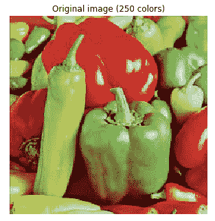
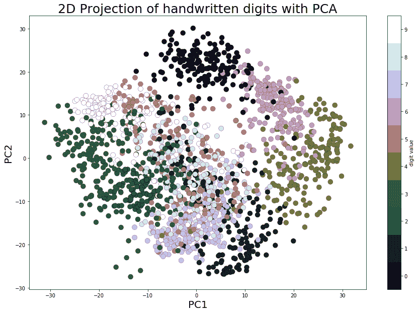
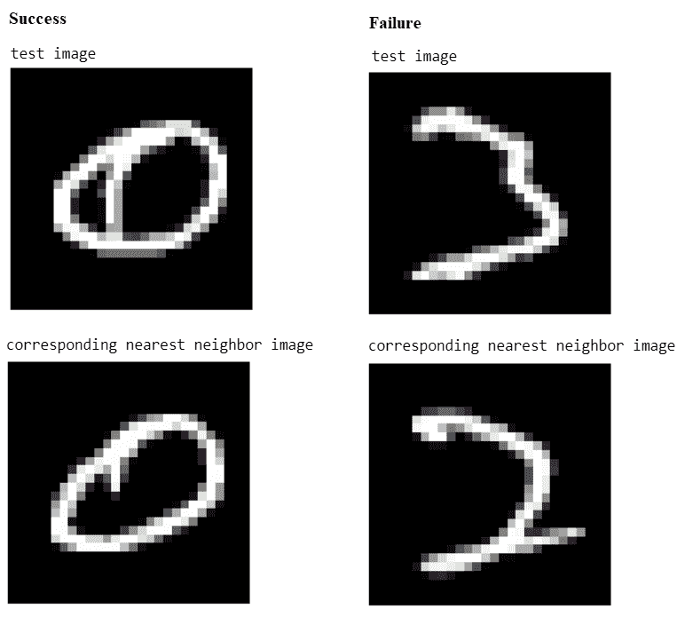
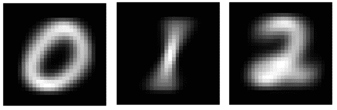
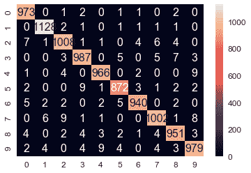
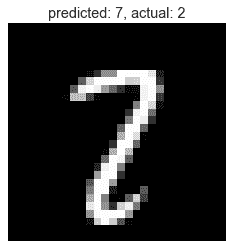
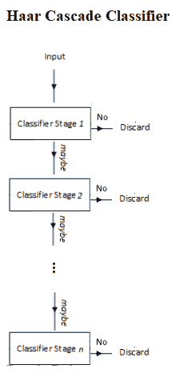

# 图像处理中的经典机器学习方法

在本章中，我们将讨论机器学习技术在图像处理中的应用。我们将定义机器学习，并学习机器学习的两种算法，有监督和无监督。然后，我们将继续讨论一些流行的无监督机器学习技术的应用，如聚类，以及图像分割等问题。

我们还将研究监督机器学习技术在图像分类和目标检测等问题上的应用。我们将使用一个非常流行的库 scikit learn，以及 scikit image 和 Python OpenCV（cv2）来实现用于图像处理的机器学习算法。这

# 有监督与无监督学习

机器学习算法主要有两种类型：

*   **监督学习**：在这种类型的学习中，我们会得到一个带有正确标签的输入数据集，我们需要学习输入和输出之间的关系（作为函数）。手写数字分类问题是监督（分类）问题的一个例子。
*   **无监督学习**：在这种类型的学习中，我们几乎不知道或根本不知道我们的输出应该是什么样子。我们可以从不一定知道变量影响的数据中得出结构。在图像处理技术中，聚类就是一个例子，在这种技术中，我们不知道哪个像素属于哪个片段。

一个计算机程序据说是从经验中学习的，*E*，关于一些任务，*T*和一些性能度量，*P*，如果它在*T*上的性能，如*P*所测量的，随着经验的增加而提高，*E*。

例如，假设我们得到一组手写数字图像及其标签（数字从零到九），我们需要编写一个 Python 程序，学习图像和标签之间的关联（如经验*E*），然后自动标记一组新的手写数字图像。

在这种情况下，任务*T*是将标签分配给图像（即，对数字图像进行分类或识别）。正确识别的新图像集的比例将是性能*P*（准确度）。是节目的一部分。在这种情况下，该计划可以说是一个学习计划。

在本章中，我们将描述一些可以使用机器学习算法（无监督或有监督）解决的图像处理问题。我们将从学习两种无监督机器学习技术在解决图像处理问题中的应用开始。

# 无监督机器学习–聚类、PCA 和特征脸

在本节中，我们将讨论几种流行的机器学习算法及其在图像处理中的应用。让我们从两个聚类算法及其在颜色量化和图像分割中的应用开始。我们将使用 scikit 学习库的实现来实现这些集群算法。

# 基于颜色量化的 K-均值聚类图像分割

在本节中，我们将演示如何对 pepper 图像执行像素级**矢量量化**（**VQ**），将显示图像所需的颜色数量从 250 种唯一颜色减少到 4 种颜色，同时保持整体外观质量。在本例中，像素在三维空间中表示，k-均值用于查找四个颜色簇。

在图像处理文献中，码本是从 k-means（聚类中心）获得的，称为**调色板**。在调色板中，使用单个字节，最多可以寻址 256 种颜色，而 RGB 编码需要每个像素 3 个字节。GIF 文件格式使用这样的调色板。为了进行比较，我们还将看到使用随机码本（随机拾取的颜色）的量化图像。

让我们使用 k-means 聚类来分割图像，首先让我们加载所需的库和输入图像：

```py
import numpy as np
import matplotlib.pyplot as plt
from sklearn.cluster import KMeans
from sklearn.metrics import pairwise_distances_argmin
from skimage.io import imread
from sklearn.utils import shuffle
from skimage import img_as_float
from time import time

pepper = imread("../images/pepper.jpg")

# Display the original image
plt.figure(1), plt.clf()
ax = plt.axes([0, 0, 1, 1])
plt.axis('off'), plt.title('Original image (%d colors)' %(len(np.unique(pepper)))), plt.imshow(pepper)
```

使用的原始输入*胡椒*图像如下：



现在，让我们用 k-均值聚类法分割图像：

```py
n_colors = 64

# Convert to floats instead of the default 8 bits integer coding. Dividing by
# 255 is important so that plt.imshow behaves works well on float data (need to
# be in the range [0-1])
pepper = np.array(pepper, dtype=np.float64) / 255

# Load Image and transform to a 2D numpy array.
w, h, d = original_shape = tuple(pepper.shape)
assert d == 3
image_array = np.reshape(pepper, (w * h, d))

def recreate_image(codebook, labels, w, h):
    """Recreate the (compressed) image from the code book & labels"""
    d = codebook.shape[1]
    image = np.zeros((w, h, d))
    label_idx = 0
    for i in range(w):
        for j in range(h):
            image[i][j] = codebook[labels[label_idx]]
            label_idx += 1
    return image

# Display all results, alongside original image
plt.figure(1)
plt.clf()
ax = plt.axes([0, 0, 1, 1])
plt.axis('off')
plt.title('Original image (96,615 colors)')
plt.imshow(pepper)

plt.figure(2, figsize=(10,10))
plt.clf()
i = 1
for k in [64, 32, 16, 4]:
    t0 = time()
    plt.subplot(2,2,i)
    plt.axis('off')
    image_array_sample = shuffle(image_array, random_state=0)[:1000]
    kmeans = KMeans(n_clusters=k, random_state=0).fit(image_array_sample)
    print("done in %0.3fs." % (time() - t0))
    # Get labels for all points
    print("Predicting color indices on the full image (k-means)")
    t0 = time()
    labels = kmeans.predict(image_array)
    print("done in %0.3fs." % (time() - t0))
    plt.title('Quantized image (' + str(k) + ' colors, K-Means)')
    plt.imshow(recreate_image(kmeans.cluster_centers_, labels, w, h))
    i += 1
plt.show()

plt.figure(3, figsize=(10,10))
plt.clf()
i = 1
for k in [64, 32, 16, 4]:
    t0 = time()
    plt.subplot(2,2,i)
    plt.axis('off')
    codebook_random = shuffle(image_array, random_state=0)[:k + 1]
    print("Predicting color indices on the full image (random)")
    t0 = time()
    labels_random = pairwise_distances_argmin(codebook_random,
                                              image_array,
                                              axis=0)
    print("done in %0.3fs." % (time() - t0)) 
    plt.title('Quantized image (' + str(k) + ' colors, Random)')
    plt.imshow(recreate_image(codebook_random, labels_random, w, h))
    i += 1
plt.show()
```

下图显示了上述代码的输出。可以看出，就保留的图像质量而言，k-means 聚类在颜色量化方面总是比使用随机码本做得更好：


# 用于图像分割的谱聚类方法

在本节中，我们将演示如何将光谱聚类技术用于图像分割。在这些设置中，光谱聚类方法解决了称为归一化图切割的问题。图像被视为连通像素的图，光谱聚类算法相当于选择定义区域的图切割，同时最小化沿切割的梯度与区域体积的比率。`SpectralClustering()`从 scikit 学习集群模块将用于将图像分割为前景和背景。

将结果与使用 k-均值聚类获得的二进制分割进行比较，如以下代码所示：

```py
from sklearn import cluster ...
```

# PCA 与特征脸

**主成分分析**（**PCA**是一种统计/无监督机器学习技术，它使用正交变换将一组可能相关变量的观测值转换为一组称为主成分的线性不相关变量值，从而找到数据集中（沿主成分）的最大方差方向。

这可以用于（线性）降维（大多数时候只有少数主要主成分捕获数据集中几乎所有的方差）和具有多个维度的数据集的可视化（2D）。PCA 的一个应用是特征面，以找到一组可以（理论上）表示任何面（作为这些特征面的线性组合）的面。

# 基于 PCA 的降维与可视化

在本节中，我们将使用 scikit learn 的 digits 数据集，该数据集包含 1797 幅手写数字图像（每幅 8 x 8 像素）。每行表示数据矩阵中的一个图像。让我们首先使用以下代码块加载并显示数据集中的前 25 位数字：

```py
import numpy as npimport matplotlib.pylab as plt from sklearn.datasets import load_digits from sklearn.preprocessing import StandardScalerfrom sklearn.decomposition import PCAfrom sklearn.pipeline import Pipelinedigits = load_digits() #print(digits.keys())print(digits.data.shape)j = 1np.random.seed(1)fig = plt.figure(figsize=(3,3)) fig.subplots_adjust(left=0, right=1, bottom=0, top=1, hspace=0.05, wspace=0.05) for i ...
```

# 二维投影与可视化

从加载的数据集可以看出，它是一个 64 维数据集。现在，让我们使用 scikit learn 的`PCA()`函数找到该数据集的两个主要组成部分，并沿着这两个维度投影数据集，然后使用 Matplotlib 散点绘制投影数据，每个数据点代表一个图像（一个数字），数字标签由唯一的颜色表示，使用以下代码块：

```py
pca_digits=PCA(2)
digits.data_proj = pca_digits.fit_transform(digits.data) 
print(np.sum(pca_digits.explained_variance_ratio_))
# 0.28509364823696987
plt.figure(figsize=(15,10))
plt.scatter(digits.data_proj[:, 0], digits.data_proj[:, 1], lw=0.25, c=digits.target, edgecolor='k', s=100, cmap=plt.cm.get_cmap('cubehelix', 10))
plt.xlabel('PC1', size=20), plt.ylabel('PC2', size=20), plt.title('2D Projection of handwritten digits with PCA', size=25)
plt.colorbar(ticks=range(10), label='digit value')
plt.clim(-0.5, 9.5)
```

下面的屏幕截图显示了输出。可以看出，即使在沿 PCs 的 2D 投影中，数字也有些分离（尽管有一些重叠），相同的数字值出现在集群附近：



# PCA 特征脸

让我们首先从 scikit learn 加载 olivetti 人脸数据集；它包含 400 张人脸图像，每张图像的尺寸为 64 x 64 像素。

以下代码块显示了数据集中的几个随机面：

```py
from sklearn.datasets import fetch_olivetti_faces faces = fetch_olivetti_faces().dataprint(faces.shape) # there are 400 faces each of them is of 64x64=4096 pixelsfig = plt.figure(figsize=(5,5)) fig.subplots_adjust(left=0, right=1, bottom=0, top=1, hspace=0.05, wspace=0.05) # plot 25 random facesj = 1np.random.seed(0)for i in np.random.choice(range(faces.shape[0]), 25):     ax = fig.add_subplot(5, 5, j, xticks=[], yticks=[])     ax.imshow(np.reshape(faces[i,:],(64,64)), cmap=plt.cm.bone, interpolation='nearest')     j += 1plt.show() ...
```

# 特征脸

鉴于 PCA 的特性，计算出的 PC 相互正交，每个 PC 包含 4096 个像素，并且可以重塑为 64 x 64 图像。这些主分量称为特征面（因为它们也是特征向量）。

可以看出，它们表示面的某些属性。以下代码块显示一些计算出的特征面：

```py
fig = plt.figure(figsize=(5,2)) 
fig.subplots_adjust(left=0, right=1, bottom=0, top=1, hspace=0.05, wspace=0.05) 
# plot the first 10 eigenfaces
for i in range(10): 
    ax = fig.add_subplot(2, 5, i+1, xticks=[], yticks=[]) 
    ax.imshow(np.reshape(pipeline.named_steps['pca'].components_[i,:], (64,64)), cmap=plt.cm.bone, interpolation='nearest')
```

以下屏幕截图显示了前 10 个特征面上前面代码块的输出：


# 重建

下面的代码块演示了如何将每个面近似表示为仅 64 个主要特征面的线性组合。scikit learn 的`inverse_transform()`函数用于返回原始空间，但仅使用这 64 个主要特征面，丢弃所有其他特征面：

```py
# face reconstructionfaces_inv_proj = pipeline.named_steps['pca'].inverse_transform(faces_proj) #reshaping as 400 images of 64x64 dimension fig = plt.figure(figsize=(5,5)) fig.subplots_adjust(left=0, right=1, bottom=0, top=1, hspace=0.05, wspace=0.05) # plot the faces, each image is 64 by 64 dimension but 8x8 pixels j = 1np.random.seed(0)for i in np.random.choice(range(faces.shape[0]), 25):
```

```py
 ax = fig.add_subplot(5, ...
```

# 特征分解

每个面可以表示为 64 个特征面的线性组合。对于不同的人脸图像，每个特征脸将具有不同的权重（载荷）。下面的屏幕截图显示了如何用特征面表示人脸，并显示了前几个相应的权重。代码留给读者作为练习：


# 监督机器学习-图像分类

在本节中，我们将讨论图像分类问题。我们将使用的输入数据集是 MNIST（[http://yann.lecun.com/exdb/mnist/](http://yann.lecun.com/exdb/mnist/) ），这是机器学习中的经典数据集，由手写数字的 28 x 28 灰度图像组成。

原始训练数据集包含 60000 个示例（手写数字图像和标签用于训练机器学习模型），测试数据集包含 10000 个示例（手写数字图像和标签作为基本事实，用于测试学习模型的准确性）。给定一组手写数字和图像及其标签（0-9），目标将是学习一个机器学习模型，该模型可以。。。

# 下载 MNIST（手写数字）数据集

让我们从下载 MNIST 数据集开始。以下 Python 代码向您展示了如何下载培训和测试数据集：

```py
# Function that downloads a specified MNIST data file from Yann Le Cun's website
def download(filename, source='http://yann.lecun.com/exdb/mnist/'):
    print("Downloading %s" % filename)
    urlretrieve(source + filename, filename)

# Invokes download() if necessary, then reads in images
def load_mnist_images(filename):
    if not os.path.exists(filename):
        download(filename)
    with gzip.open(filename, 'rb') as f:
        data = np.frombuffer(f.read(), np.uint8, offset=16)
    data = data.reshape(-1,784)
    return data

def load_mnist_labels(filename):
    if not os.path.exists(filename):
        download(filename)
    with gzip.open(filename, 'rb') as f:
        data = np.frombuffer(f.read(), np.uint8, offset=8)
    return data

## Load the training set
train_data = load_mnist_images('train-images-idx3-ubyte.gz')
train_labels = load_mnist_labels('train-labels-idx1-ubyte.gz')
## Load the testing set
test_data = load_mnist_images('t10k-images-idx3-ubyte.gz')
```

```py
test_labels = load_mnist_labels('t10k-labels-idx1-ubyte.gz')

print(train_data.shape)
# (60000, 784)         ## 60k 28x28 handwritten digits
print(test_data.shape)
# (10000, 784)         ## 10k 2bx28 handwritten digits
```

# 可视化数据集

每个数据点存储为 784 维向量。要可视化数据点，我们首先需要将其重塑为 28 x 28 的图像。以下代码段显示了如何显示测试数据集中的几个手写数字：

```py
## Define a function that displays a digit given its vector representationdef show_digit(x, label): pylab.axis('off') pylab.imshow(x.reshape((28,28)), cmap=pylab.cm.gray) pylab.title('Label ' + str(label)) pylab.figure(figsize=(10,10))for i in range(25): pylab.subplot(5, 5, i+1) show_digit(test_data[i,], test_labels[i])pylab.tight_layout()pylab.show()
```

下面的屏幕截图显示了来自测试数据集的前 25 个手写数字以及它们的基本事实（true）标签。kNN 分类器。。。

# 训练 kNN、高斯贝叶斯和 SVM 模型对 MNIST 进行分类

我们将使用 scikit 学习库函数实现以下分类器集：

*   K 近邻
*   高斯贝叶斯分类器（生成模型）
*   **支持向量机**（**SVM**分类器

让我们从 k-最近邻分类器开始

# k-最近邻（KNN）分类器

在本节中，我们将构建一个分类器，用于获取手写数字的图像，并使用一种称为**最近邻分类器**的特别简单的策略输出标签（0-9）。预测看不见的测试数字图像的想法非常简单。首先，我们需要从训练数据集中找到最接近该测试图像的*k*实例。接下来，我们需要简单地使用多数投票来计算测试图像的标签，即，来自 k 个最近训练数据点的大多数数据点所具有的标签将被分配给测试图像（任意断开连接）。

# 欧氏距离的平方

要计算数据集中的最近邻，我们首先需要能够计算数据点之间的距离。自然距离函数是欧几里得距离；对于两个向量*x，y∈ R<sup>d</sup>*，其欧氏距离定义如下：


通常，我们忽略平方根，只计算平方欧氏距离。为了进行最近邻计算，这两个向量是等价的：对于三个向量 x，y，z∈ R<sup>d</sup>我们有∥x−Y∥  ≤  ∥x−Z∥ 当且仅当∥x−Y∥ <sup>2</sup>≤ ∥x−Z∥ <sup>2</sup>。现在我们只需要计算平方欧几里德距离

# 计算最近邻

k-最近邻的简单实现将扫描每个测试图像的每个训练图像。以这种方式执行最近邻分类将需要完全通过训练集才能对单个点进行分类。如果*R<sup>d</sup>*中有*N*个训练点，这需要*O（Nd）*时间，这将非常缓慢。幸运的是，如果我们愿意花一些时间预处理训练集，有更快的方法来执行最近邻查找。scikit 学习库快速实现了两种有用的最近邻数据结构：ball 树和 k-d 树。下面的代码演示如何在训练时创建 ball 树数据结构，然后将其用于。。。

# 评估分类器的性能

接下来，我们需要在测试数据集上评估分类器的性能。以下代码段显示了如何执行此操作：

```py
# evaluate the classifier
t_accuracy = sum(test_predictions == test_labels) / float(len(test_labels))
t_accuracy
# 0.96909999999999996

import pandas as pd
import seaborn as sn
from sklearn import metrics

cm = metrics.confusion_matrix(test_labels,test_predictions)
df_cm = pd.DataFrame(cm, range(10), range(10))
sn.set(font_scale=1.2)#for label size
sn.heatmap(df_cm, annot=True,annot_kws={"size": 16}, fmt="g") 
```

以下屏幕截图显示了分类的混淆矩阵；我们可以看到有一些错误分类的测试图像，训练数据集的总体准确率为 96.9%：


以下屏幕截图显示：

*   **成功案例**：*1-NN 预测标签=真标签=0*
*   **故障案例**：*1-NN 预测标签=2，真标签=3*



找到预测的成功和失败案例的代码留给读者作为练习。

# 贝叶斯分类器（高斯生成模型）

正如我们在上一节中所看到的，1-NN 分类器在 MNIST 手写数字数据集上产生了 3.09%的测试错误率。在本节中，我们将构建一个高斯生成模型，该模型几乎同样有效，同时速度更快，结构更紧凑。同样，我们需要首先加载 MNIST 训练和测试数据集，就像上次一样。接下来，让我们将高斯生成模型拟合到训练数据集。

# 培训生成模型-计算高斯参数的最大似然估计

下面的代码块定义了一个函数`fit_generative_model()`，该函数接受一个训练集（`x`数据和`y`标签）作为输入，并将高斯生成模型拟合到它。它为每个标签返回此生成模型的以下参数，*j=0,1，…，9*，我们有以下内容：

*   *π<sub>j</sub>*：标签的频率（即之前的频率）
*   *μ<sub>j</sub>*：784 维平均向量
*   *∑ <sub>j</sub>*：784 x 784 协方差矩阵

这意味着*π*是 10 x 1，*μ*是 10 x 784，*∑* 是一个 10 x 784 x 784 矩阵。参数的**最大似然估计**（**MLE**为经验估计，如下图所示：


经验协方差很可能是奇异的（或接近奇异的），这意味着我们无法用它们进行计算。因此，对这些矩阵进行正则化非常重要。这样做的标准方法是将*c*I*添加到它们中，其中*c*是某个常数，*I*是 784 维单位矩阵（换句话说，我们计算经验协方差，然后将它们的对角项增加某个常数*c*

这种修改保证为任何*c>0*产生非奇异协方差矩阵，无论多么小。现在，*c*成为（正则化）参数，通过适当设置，我们可以提高模型的性能。我们应该选择一个好的值*c*。重要的是，这需要单独使用训练集来完成，将训练集的一部分作为验证集或使用某种交叉验证，我们将此作为练习留给读者完成。特别是，`display_char()`函数将用于可视化前三位的高斯平均值：

```py
def display_char(image):
    plt.imshow(np.reshape(image, (28,28)), cmap=plt.cm.gray)
    plt.axis('off')
    plt.show()

def fit_generative_model(x,y):
    k = 10 # labels 0,1,...,k-1
    d = (x.shape)[1] # number of features
    mu = np.zeros((k,d))
    sigma = np.zeros((k,d,d))
    pi = np.zeros(k)
    c = 3500 #10000 #1000 #100 #10 #0.1 #1e9
    for label in range(k):
        indices = (y == label)
        pi[label] = sum(indices) / float(len(y))
        mu[label] = np.mean(x[indices,:], axis=0)
        sigma[label] = np.cov(x[indices,:], rowvar=0, bias=1) + c*np.eye(d)
    return mu, sigma, pi

mu, sigma, pi = fit_generative_model(train_data, train_labels)
display_char(mu[0])
display_char(mu[1])
display_char(mu[2])
```

以下屏幕截图显示了前面代码块的输出以及前三位的平均值 MLE：



# 计算后验概率对试验数据和模型评估进行预测

为了预测新图像的标签*x*，我们需要找到标签*j*，其后验概率*Pr（y=j|x）*最大。可使用贝叶斯规则计算，如下所示：


下面的代码块显示了如何使用生成模型预测测试数据集的标签，以及如何计算模型在测试数据集上产生的错误数。可以看出，测试数据集的精度为 95.6%，略低于 1-NN 分类器：

```py
# Compute log Pr(label|image) for each [test image,label] pair.k = 10score ...
```

# 分类器

在本节中，我们将使用 MNIST 训练数据集训练（多类）SVM 分类器，然后使用它从 MNIST 测试数据集预测图像的标签。

SVM 是一种非常复杂的二元分类器，它使用二次规划来最大化分离超平面之间的边界。利用 1-vs-all 或 1-vs-1 技术，将二元 SVM 分类器扩展到处理多类分类问题。我们将使用 scikit learn 的实现`SVC()`，使用多项式核（2 次）拟合（训练）训练数据集的软边界（核化）SVM 分类器，然后使用`score()`函数预测测试图像的标签。

下面的代码显示了如何使用 MNIST 数据集训练、预测和评估 SVM 分类器。可以看出，使用该分类器在测试数据集上获得的准确度已增加到 98%：

```py
from sklearn.svm import SVC
clf = SVC(C=1, kernel='poly', degree=2)
clf.fit(train_data,train_labels)
print(clf.score(test_data,test_labels))
# 0.9806
test_predictions = clf.predict(test_data)
cm = metrics.confusion_matrix(test_labels,test_predictions)
df_cm = pd.DataFrame(cm, range(10), range(10))
sn.set(font_scale=1.2)
sn.heatmap(df_cm, annot=True,annot_kws={"size": 16}, fmt="g")
```

以下屏幕截图显示了分类混淆矩阵的输出：



接下来，让我们找到一个 SVM 分类器预测了错误标签的测试图像（与地面真实值标签不同）。

以下代码查找此类图像，并将其与预测和真实标签一起显示：

```py
wrong_indices = test_predictions != test_labels
wrong_digits, wrong_preds, correct_labs = test_data[wrong_indices], test_predictions[wrong_indices], test_labels[wrong_indices] 
print(len(wrong_pred))
# 194
pylab.title('predicted: ' + str(wrong_preds[1]) + ', actual: ' + str(correct_labs[1]))
display_char(wrong_digits[1])
```

下面的屏幕截图显示了输出。可以看出，测试图像具有真实标签 2，但图像看起来更像 7，因此 SVM 预测为 7：



# 监督机器学习-目标检测

到目前为止，我们已经演示了如何使用分类模型对图像进行分类，例如，使用二进制分类来确定图像是否包含手写数字 1。在下一节中，我们将看到如何使用有监督的机器学习模型，不仅检查对象是否在图像中，而且还可以找到对象在图像中的位置（例如，根据边界框，即对象所在的矩形）。

# 基于 Haar-like 特征的人脸检测和 AdaBoost-Viola-Jones 级联分类器

正如我们在[第 7 章](07.html)*提取图像特征和描述符*（在类似 Haar 的特征提取上下文中）中简要讨论的，Viola Jones 的目标检测技术可用于图像中的人脸检测。它是一种经典的机器学习方法，其中，通过使用从图像中提取的手工制作的类 Haar 特征，使用正图像和负图像的训练集训练级联函数。

Viola-Jones 算法通常使用基本面片大小（例如，24 x 24 像素），它在图像上来回滑动，并计算大量类似 Haar 的特征（24 x 24 面片的 160000 个可能特征，尽管通过适当选择 6000 个特征子集，它们已达到 95%的准确率）；这些功能是可以提取的，但要在每个补丁上运行 6000 个功能需要付出很大的努力。因此，一旦确定并组装了这些特性，就会构建一些快速拒绝器。这是基于这样的想法，即在一张完整的图像中，我们检查的大多数可能位置都不会包含人脸，因此，总体而言，快速拒绝比在其上投入太多更快。如果该位置不包含面，我们将丢弃它并继续，然后再进行更多的计算检查。这是 Viola Jones 实现其性能的另一个技巧，如下图所示：



不是在一个窗口上应用所有 6000 个特征，而是通过使用 AdaBoost 集成分类器将特征分组到弱分类器的不同阶段（以执行特征级联性能的自适应增强），并且这些弱分类器在级联中逐个运行。如果正在考虑的修补程序窗口在任何阶段失败，则该窗口将被拒绝。通过所有阶段的修补程序被视为有效检测

Haar-like 功能的一个很好的优点是计算速度非常快（由于积分图像技术），这导致了 Viola-Jones 性能的最后一个方面。基本面片本身可以缩放，最终级联中的特征可以非常快速地评估，以搜索不同大小的对象，而无需图像金字塔。综合起来，Viola-Jones 培训工作流程如下图所示：


该算法速度惊人，但存在明显的精度限制

# 基于类 Haar 特征描述子的人脸分类

Viola Jones 使用类似 Haar 的特征描述符实现了第一个实时人脸检测器。以下示例取自 scikit 图像的示例，该示例演示了提取、选择和分类类 Haar 特征，以检测人脸与非人脸。显然，这是一个二值分类问题。

用于特征选择和分类的 scikit 学习库。虽然人脸检测的原始实现使用 AdaBoost 集成分类器，但在本例中，将使用不同的集成分类器 random forest，主要用于查找对分类有用的重要 Haar-like 特征

为了提取哈尔式的。。。

# 用随机森林集成分类器寻找人脸分类中最重要的类 Haar 特征

训练一个随机森林分类器，以选择最显著的特征进行人脸分类。这个想法是检查哪些特征是树集合最常用的。通过在后续步骤中仅使用最显著的特征，可以提高计算速度，同时保持准确性。以下代码片段显示了如何计算分类器的特征重要性，并显示了前 25 个最重要的 Haar-like 特征：

```py
# For speed, only extract the two first types of features
feature_types = ['type-2-x', 'type-2-y']
# Build a computation graph using dask. This allows using multiple CPUs for
# the computation step
X = delayed(extract_feature_image(img, feature_types)
 for img in images)
# Compute the result using the "processes" dask backend
t_start = time()
X = np.array(X.compute(scheduler='processes'))
time_full_feature_comp = time() - t_start
y = np.array([1] * 100 + [0] * 100)
X_train, X_test, y_train, y_test = train_test_split(X, y, train_size=150, random_state=0, stratify=y)
print(time_full_feature_comp)
# 104.87986302375793
print(X.shape, X_train.shape)
# (200, 101088) (150, 101088)

from sklearn.metrics import roc_curve, auc, roc_auc_score
# Extract all possible features to be able to select the most salient.
feature_coord, feature_type = \
        haar_like_feature_coord(width=images.shape[2], height=images.shape[1],
                                feature_type=feature_types)

# Train a random forest classifier and check performance
clf = RandomForestClassifier(n_estimators=1000, max_depth=None,
                             max_features=100, n_jobs=-1, random_state=0)
t_start = time()
clf.fit(X_train, y_train)
time_full_train = time() - t_start
print(time_full_train)
# 1.6583366394042969
auc_full_features = roc_auc_score(y_test, clf.predict_proba(X_test)[:, 1])
print(auc_full_features)
# 1.0

# Sort features in order of importance, plot six most significant
idx_sorted = np.argsort(clf.feature_importances_)[::-1]

fig, axes = pylab.subplots(5, 5, figsize=(10,10))
for idx, ax in enumerate(axes.ravel()):
 image = images[1]
 image = draw_haar_like_feature(image, 0, 0, images.shape[2], images.shape[1],
                               [feature_coord[idx_sorted[idx]]])
 ax.imshow(image), ax.set_xticks([]), ax.set_yticks([])
fig.suptitle('The most important features', size=30)
```

下面的屏幕截图显示了前面代码块的输出—用于人脸检测的前 25 个最重要的 Haar-like 特征：


通过仅保留少数最重要的特征（约占所有特征的 3%），可以保留大部分（约 70%）的特征重要性，并且通过仅使用这些特征训练`RandomForest`分类器，我们应该能够保持验证数据集的准确性（我们通过使用所有特征训练分类器获得），但特征提取和分类器训练所需的时间要小得多。代码留给读者作为练习。

# 基于 HOG 特征的 SVM 目标检测

如[第 7 章](07.html)*提取图像特征和描述符*中所述，定向梯度的**直方图**（**HOG**是一种用于各种计算机视觉和图像处理应用中的特征描述符，用于目标检测。Navneet Dalal 和 Bill Triggs 首次将 HOG 描述符与 SVM 分类器一起用于行人检测。HOG 描述符的使用在检测人、动物、人脸和文本等方面尤其成功。例如，可以考虑对象检测系统来生成描述输入图像中对象特征的 HOG 描述符

我们已经描述了如何从…计算 HOG 描述符。。。

# 养猪

SVM 训练器选择最佳超平面，以从训练集中分离正示例和负示例。将这些块描述符串联起来，转换为 SVM 训练器的输入格式，并适当标记为正或负。训练器通常输出一组支持向量，即，训练集中最能描述超平面的示例。超平面是区分正例和负例的学习决策边界。SVM 模型随后使用这些支持向量对测试图像中的 HOG 描述符块进行分类，以检测对象的存在/不存在。

# 用支持向量机模型进行分类

这种 HOG 计算传统上是通过在测试图像帧上重复步进 64 像素宽×128 像素高的窗口并计算 HOG 描述符来执行的。由于 HOG 计算不包含固有的比例感，并且对象可以在图像中的多个比例下出现，因此 HOG 计算将在比例金字塔的每个级别上进行阶梯式重复。缩放棱锥体中每个级别之间的缩放因子通常在 1.05 和 1.2 之间，并且图像会反复缩放，直到缩放的源帧无法再容纳完整的 HOG 窗口。如果 SVM 分类器预测任何尺度下的对象检测，则返回相应的边界框。这个

# 用 HOG-SVM 计算包围盒

在本节中，我们将演示如何使用`python-opencv`库函数使用 HOG-SVM 检测图像中的人物。下面的代码显示了如何从图像计算 HOG 描述符，并使用描述符输入预训练的 SVM 分类器（使用 cv2 的`HOGDescriptor_getDefaultPeopleDetector()`），该分类器将使用`python-opencv`中的`detectMultiScale()`函数从多个尺度的图像块中预测人员的存在或不存在：

```py
import numpy as np
import cv2
import matplotlib.pylab as pylab
img = cv2.imread("../images/me16.jpg")
# create HOG descriptor using default people (pedestrian) detector
hog = cv2.HOGDescriptor()
hog.setSVMDetector(cv2.HOGDescriptor_getDefaultPeopleDetector())
# run detection, using a spatial stride of 4 pixels (horizontal and vertical), a scale stride of 1.02, and # zero grouping of rectangles (to demonstrate that HOG will detect at potentially multiple places in the 
# scale pyramid)
(foundBoundingBoxes, weights) = hog.detectMultiScale(img, winStride=(4, 4), padding=(8, 8), scale=1.02, finalThreshold=0)
print(len(foundBoundingBoxes)) # number of boundingboxes
# 357
# copy the original image to draw bounding boxes on it for now, as we'll use it again later
imgWithRawBboxes = img.copy()
for (hx, hy, hw, hh) in foundBoundingBoxes:
   cv2.rectangle(imgWithRawBboxes, (hx, hy), (hx + hw, hy + hh), (0, 0, 255), 1)
pylab.figure(figsize=(20, 12))
imgWithRawBboxes = cv2.cvtColor(imgWithRawBboxes, cv2.COLOR_BGR2RGB)
pylab.imshow(imgWithRawBboxes, aspect='auto'), pylab.axis('off'), pylab.show()
```

以下屏幕截图显示了输出、图像以及边界框（红色矩形）指示的不同比例的检测对象：


前面的屏幕截图说明了 HOG 的一些有趣特性和问题，我们可以在前面的屏幕截图中看到，有许多无关的检测（总共 357 个），需要使用非最大抑制将它们融合在一起。此外，我们还可能看到一些误报。

# 非最大值抑制

接下来，需要调用非最大抑制函数，以避免在多次和多次缩放时检测到同一对象。下面的代码块显示了如何使用`cv2`库函数实现它：

```py
from imutils.object_detection import non_max_suppression# convert our bounding boxes from format (x1, y1, w, h) to (x1, y1, x2, y2)rects = np.array([[x, y, x + w, y + h] for (x, y, w, h) in foundBoundingBoxes])# run non-max suppression on these based on an overlay op 65%nmsBoundingBoxes = non_max_suppression(rects, probs=None, overlapThresh=0.65)print(len(rects), len(nmsBoundingBoxes))# 357 1# draw the final bounding boxesfor (x1, y1, x2, y2) in nmsBoundingBoxes: cv2.rectangle(img, (x1, y1), (x2, y2), (0, 255, 0), ...
```

# 总结

在本章中，我们讨论了一些经典的机器学习技术及其在解决图像处理问题中的应用。我们从无监督机器学习算法开始，如聚类和主成分分析。我们使用 scikit learn 演示了 k-means 和谱聚类算法，并向您展示了如何将它们用于矢量量化和分割。接下来，我们了解了 PCA 如何用于高维数据集（如 scikit 学习手写数字图像数据集）的降维和可视化。此外，还说明了 PCA 如何使用 scikit 学习人脸数据集实现特征脸。

然后，我们讨论了几种有监督机器学习分类模型，如 kNN、高斯贝叶斯生成模型和 SVM，以解决手写数字数据集的分类等问题。最后，我们讨论了两种用于图像中目标检测的经典机器学习技术，即 Viola-Jones 的 AdaBoost 级联分类器，用于人脸检测（并使用随机森林分类器查找最重要的特征）和用于行人检测的 HOG-SVM。

在下一章中，我们将开始讨论深度学习技术在图像处理方面的最新进展。

# 问题

1.  使用 k 均值聚类对图像进行阈值化（使用`number of clusters=2`），并将结果与大津的结果进行比较。
2.  使用 scikit learn 的`cluster.MeanShift()`和`mixture.GaussianMixture()`函数，分别使用 mean shift 和 GMM-EM 聚类方法对图像进行分割，这是另外两种流行的聚类算法。
3.  使用 Isomap（从`sklearn.manifold`开始）进行非线性降维，并可视化二维投影。它是否比 PCA 的线性降维更好？用 TSNE 重复练习（再次从`sklearn.manifold`开始）。
4.  编写一个 Python 程序来显示几个主要特征面的加权线性组合确实近似于一个面。
5.  表明特征脸也可以用于原始人脸检测（和识别）。。。

# 进一步阅读

*   Viola、Paul 和 Michael J.Jones，*鲁棒实时人脸检测。国际计算机视觉杂志*：[http://www.merl.com/publications/docs/TR2004-043.pdf](http://www.merl.com/publications/docs/TR2004-043.pdf)
*   Navneet Dalal 和 Bill Triggs，*人体检测方向梯度直方图*：[https://lear.inrialpes.fr/people/triggs/pubs/Dalal-cvpr05.pdf](https://lear.inrialpes.fr/people/triggs/pubs/Dalal-cvpr05.pdf)