# 图像处理中的深度学习-图像分类

在本章中，我们将通过深入学习讨论图像处理的最新进展。我们将首先区分经典和深度学习技术，然后是关于**卷积神经网络**（**CNN**）的概念部分，这是一种对图像处理特别有用的深度神经网络体系结构。然后，我们将继续讨论使用两个图像数据集的图像分类问题，以及如何使用 TensorFlow 和 Keras 这两个非常流行的深度学习库来实现它。此外，我们还将了解如何训练深层 CNN 架构并将其用于预测。

本章涉及的主题如下：

*   图像处理中的深度学习

# 图像处理中的深度学习

**机器学习**（**ML**的主要目标是**泛化**；也就是说，我们在一个训练数据集上训练一个算法，我们希望该算法在一个看不见的数据集上以高性能（精确性）工作。为了解决复杂的图像处理任务（如图像分类），我们拥有的训练数据越多，我们可能期望学习到的 ML 模型具有更好的泛化能力，前提是我们考虑过拟合（例如，正则化）。但是，使用传统的 ML 技术，不仅需要大量的训练数据，而且学习（泛化方面的改进）往往会在某一点停止。此外，传统的 ML 算法通常需要大量的领域专业知识和人工干预，并且它们只能够完成它们的设计目的。这就是深度学习模式非常有希望的地方。

# 什么是深度学习？

深度学习的一些广为人知和被广泛接受的定义如下：

*   它是 ML 的子集。
*   它使用多层（非线性）处理单元级联，称为**人工神经网络（ANN）**，以及受大脑（神经元）结构和功能启发的算法。每个连续层使用前一层的输出作为输入。
*   它使用人工神经网络进行特征提取和转换，处理数据，发现模式，并开发抽象。
*   它可以是有监督的（例如，分类）或无监督的（例如，模式分析）。
*   它使用梯度下降算法来学习对应于不同抽象级别的多个表示级别，以及。。。

# 经典与深度学习

*   **手工与自动特征提取**：为了解决传统 ML 技术的图像处理问题，最重要的预处理步骤是手工特征（如 HOG 和 SIFT）提取，以降低图像的复杂性，并使模式更加可见，以便学习算法工作。深度学习算法的最大优点是，它们试图以增量方式从训练图像中学习低级和高级特征。这样就不需要在提取或工程中使用手工制作的功能。
*   **分部分与端到端解决方案**：传统的 ML 技术通过分解问题、先解决不同部分，然后将结果聚合到一起给出输出来解决问题陈述，而深度学习技术使用端到端方法解决问题。例如，在对象检测问题中，经典的 ML 算法（如 SVM）需要一个边界框对象检测算法，该算法将首先识别所有可能的对象，这些对象需要将 HOG 作为 ML 算法的输入，以便识别正确的对象。但一种深度学习方法，如 YOLO 网络，将图像作为输入，并提供对象的位置和名称作为输出。显然是端到端的，不是吗？
*   **训练时间和先进的硬件**：与传统的 ML 算法不同，深度学习算法由于参数数量庞大、数据集相对庞大，训练时间较长。因此，我们应该始终在高端硬件（如 GPU）上训练深度学习模型，并记住合理的训练时间，因为时间是有效训练模型的一个非常重要的方面。

*   **适应性和可转移性**：**经典的 ML 技术非常有限，而深度学习技术可以应用于广泛的应用和各个领域。其中很大一部分用于转移学习，这使我们能够在同一领域内为不同的应用程序使用预先训练的深度网络。例如，在这里，在图像处理中，预训练的图像分类网络通常用作特征提取前端来检测对象和分割网络。**

 **现在，让我们以图解方式（猫和狗的图像）在图像分类中使用 ML 和深度学习模型时，看看它们之间的区别。

传统 ML 将具有特征提取和分类器，以解决任何问题：


通过深入学习，您可以看到我们讨论过的隐藏层和行动中的决策：

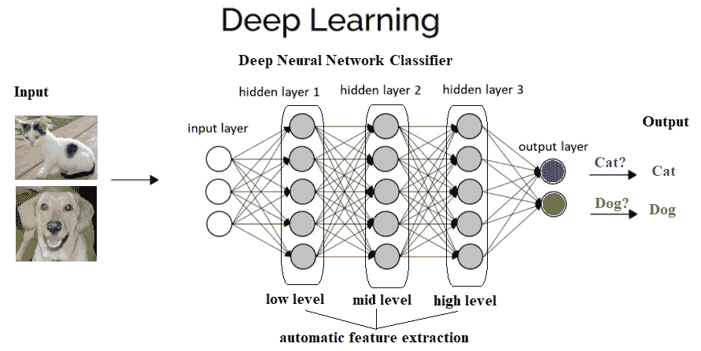

# 为什么要深入学习？

如前所述，如果您有更多的数据，那么最好的选择是深度网络，该网络在数据充足的情况下性能更好。很多时候，使用的数据越多，结果就越准确。经典的最大似然法需要一组复杂的最大似然算法，更多的数据只会影响其准确性。然后需要采用复杂的方法来弥补精度较低的缺陷。此外，即使学习受到影响，当添加更多的训练数据来训练模型时，学习也几乎在某个时间点停止。

这是如何以图形方式描述的：

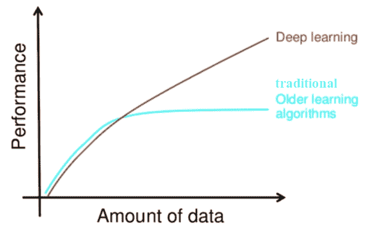

# CNNs

**CNN**是深度神经网络，主要用于输入图像。CNN 学习传统算法中手工设计的滤波器（特征）。这种独立于先验知识和人类在特征设计中的努力是一个主要优势。它们还通过共享权重体系结构减少了需要学习的参数数量，并具有平移不变性特征。在下一小节中，我们将讨论 CNN 的总体架构及其工作原理。

# Conv 或池或 FC 层–CNN 体系结构及其工作原理

下一个屏幕截图显示了 CNN 的典型架构。它包括一个或多个卷积层，然后是非线性 ReLU 激活层、池层，最后是一个（或多个）完全连接的（**FC**）层，然后是 FC softmax 层，例如，在设计用于解决图像分类问题的 CNN 的情况下。

网络中可能存在多个层卷积 ReLU 池序列，使神经网络更深入，有助于解决复杂的图像处理任务，如下图所示：

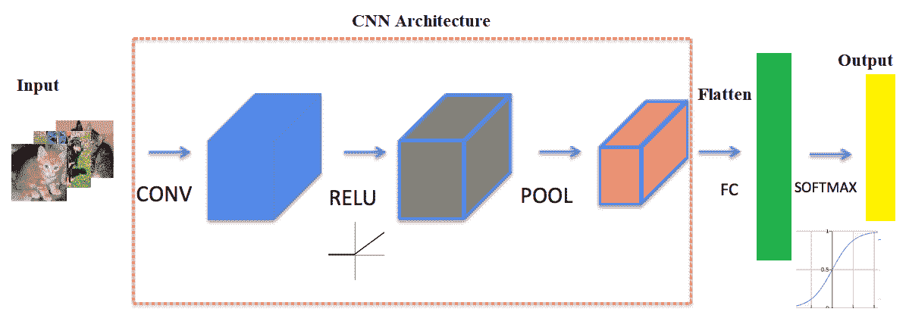

下面几节将介绍。。。

# 卷积层

CNN 的主要组成部分是卷积层。卷积层由一组卷积滤波器（内核）组成，我们已经在[第 2 章](02.html)、*采样、傅里叶变换和卷积*中详细讨论了这些滤波器。使用卷积滤波器对输入图像进行卷积，以生成特征映射。左侧是卷积层的输入；例如，输入图像。右边是卷积滤波器，也称为**内核**。通常，卷积运算是通过在输入上滑动该滤波器来执行的。在每个位置，元素矩阵乘法的和进入特征映射。卷积层由其宽度、高度（过滤器的大小为宽度 x 高度）和深度（过滤器数量）表示。**步长**指定卷积过滤器在每一步移动的量（默认值为 1）。**填充**是指环绕输入的零层（通常用于保持输入和输出图像大小相同，也称为**相同填充**。以下屏幕截图显示了如何在 RGB 图像上应用 3 x 3 x 3 卷积滤波器，第一个使用有效填充，第二个使用两个大小为**步长=填充=1**的此类滤波器进行计算：

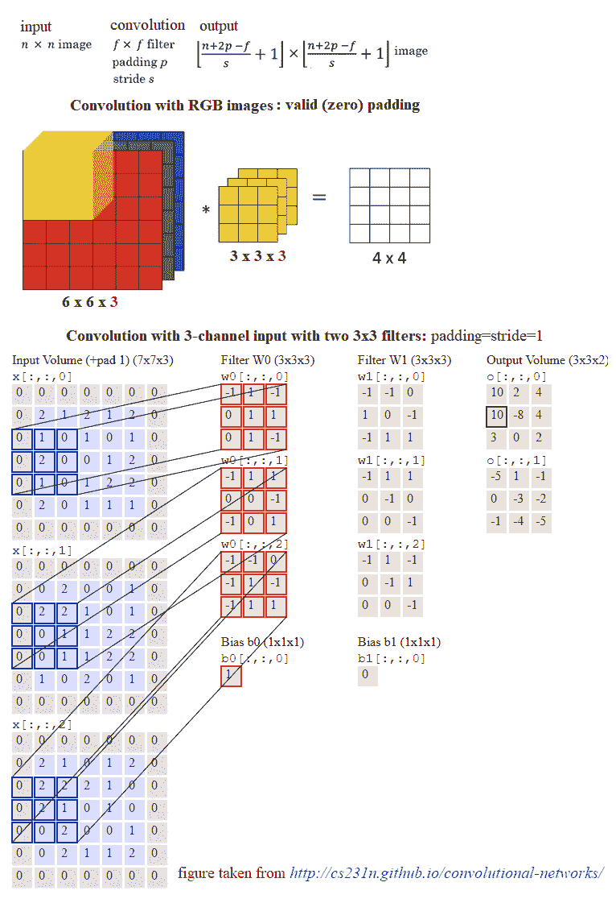

# 池层

在卷积运算之后，通常执行池运算以减少维数和要学习的参数的数量，这缩短了训练时间，需要更少的数据进行训练，并防止过度拟合。池层独立地对每个特征地图进行下采样，减少高度和宽度，但保持深度不变。最常见的池类型是**最大池**，它只取池窗口中的最大值。与卷积运算相反，池没有参数。它将窗口滑动到其输入上，只需获取窗口中的最大值。与卷积类似，可以指定池的窗口大小和步长。

# 非线性-ReLU 层

任何一种神经网络要想强大，都需要包含非线性。因此，卷积运算的结果通过非线性激活函数传递。ReLU 激活通常用于实现非线性（以及用 sigmoid 激活解决消失梯度问题）。因此，最终特征图中的值实际上不是和，而是应用于它们的`relu`函数。

# FC 层

在卷积层和池层之后，通常会添加两个 FC 层来封装 CNN 架构。卷积层和池层的输出都是 3D 卷，但 FC 层需要 1D 数字向量。因此，最终池层的输出需要展平为一个向量，这将成为 FC 层的输入。展平就是简单地将三维体积的数字排列成一维向量。

# 辍学者

**Dropout**是深度神经网络最流行的正则化技术。Dropout 用于防止过度拟合，通常用于在看不见的数据集上提高深度学习任务的性能（准确性）。在训练期间，在每次迭代中，一个神经元以某种概率暂时丢失或禁用，*p*。这意味着在当前迭代中，该神经元的所有输入和输出都将被禁用。这个超参数*p*被称为**退出率**，它通常是一个 0.5 左右的数字，对应于 50%的神经元退出。

# 基于 TensorFlow 或 Keras 的图像分类

在本节中，我们将重新讨论手写数字分类问题（使用 MNIST 数据集），但这次是使用深层神经网络。我们将使用两个非常流行的深度学习库来解决这个问题，即 TensorFlow 和 Keras。**TensorFlow**（**TF**）是深度学习模型生产中使用的最著名的库。它有一个非常大和令人敬畏的社区。然而，TensorFlow 并不是那么容易使用。另一方面，Keras 是基于 TensorFlow 构建的高级 API。与 TF 相比，它更加用户友好且易于使用，尽管它对低级结构的控制较少。低级库提供了更大的灵活性。因此*TF 可以调整得更多，因为。。。*

 *# TF 分类

首先，我们将从一个非常简单的深层神经网络开始，该网络只包含一个 FC 隐藏层（具有 ReLU 激活）和一个 softmax FC 层，没有卷积层。下一个屏幕截图显示了网络颠倒。输入是一个扁平图像，包含隐藏层中的 28 x 28 个节点和 1024 个节点，以及 10 个输出节点，对应于要分类的每个数字：


现在，让我们用 TF 实现深度学习图像分类。首先，我们需要加载`mnist`数据集，并将训练图像分为两部分，第一部分是较大的（我们使用 50k 图像）进行训练，第二部分（10k 图像）用于验证。让我们重新格式化标签，用一个热编码的二进制向量表示图像类。然后需要初始化`tensorflow`图以及变量、常量和占位符张量。使用小批量**随机梯度下降**（**SGD**优化器）作为学习算法，批量大小为 256，在两个权重层（超参数值为λ1=λ2=1）上使用 L2 正则化器最小化 softmax 交叉熵 logit 损失函数。最后，TensorFlow`session`对象将运行 6k 步（小批量），并运行前向/反向传播以更新学习的模型（权重），随后在验证数据集上对模型进行评估。可以看出，最终批次完成后获得的精度为`96.5%`：

```py
%matplotlib inline
import numpy as np
# import data
from keras.datasets import mnist
import tensorflow as tf

# load data
(X_train, y_train), (X_test, y_test) = mnist.load_data()
np.random.seed(0)
train_indices = np.random.choice(60000, 50000, replace=False)
valid_indices = [i for i in range(60000) if i not in train_indices]
X_valid, y_valid = X_train[valid_indices,:,:], y_train[valid_indices]
X_train, y_train = X_train[train_indices,:,:], y_train[train_indices]
print(X_train.shape, X_valid.shape, X_test.shape)
# (50000, 28, 28) (10000, 28, 28) (10000, 28, 28)
image_size = 28
num_labels = 10

def reformat(dataset, labels):
 dataset = dataset.reshape((-1, image_size * image_size)).astype(np.float32)
 # one hot encoding: Map 1 to [0.0, 1.0, 0.0 ...], 2 to [0.0, 0.0, 1.0 ...] 
 labels = (np.arange(num_labels) == labels[:,None]).astype(np.float32)
 return dataset, labels

X_train, y_train = reformat(X_train, y_train)
X_valid, y_valid = reformat(X_valid, y_valid)
X_test, y_test = reformat(X_test, y_test)
print('Training set', X_train.shape, X_train.shape)
print('Validation set', X_valid.shape, X_valid.shape)
print('Test set', X_test.shape, X_test.shape)
# Training set (50000, 784) (50000, 784) # Validation set (10000, 784) (10000, 784) # Test set (10000, 784) (10000, 784)

def accuracy(predictions, labels):
 return (100.0 * np.sum(np.argmax(predictions, 1) == np.argmax(labels, 1)) / predictions.shape[0])

batch_size = 256 
num_hidden_units = 1024
lambda1 = 0.1 
lambda2 = 0.1 

graph = tf.Graph()
with graph.as_default():

 # Input data. For the training data, we use a placeholder that will be fed
 # at run time with a training minibatch.
 tf_train_dataset = tf.placeholder(tf.float32,
 shape=(batch_size, image_size * image_size))
 tf_train_labels = tf.placeholder(tf.float32, shape=(batch_size, num_labels))
 tf_valid_dataset = tf.constant(X_valid)
 tf_test_dataset = tf.constant(X_test)

 # Variables.
 weights1 = tf.Variable(tf.truncated_normal([image_size * image_size, num_hidden_units]))
 biases1 = tf.Variable(tf.zeros([num_hidden_units]))

 # connect inputs to every hidden unit. Add bias
 layer_1_outputs = tf.nn.relu(tf.matmul(tf_train_dataset, weights1) + biases1)

 weights2 = tf.Variable(tf.truncated_normal([num_hidden_units, num_labels]))
 biases2 = tf.Variable(tf.zeros([num_labels])) 

 # Training computation.
 logits = tf.matmul(layer_1_outputs, weights2) + biases2
 loss = tf.reduce_mean(tf.nn.softmax_cross_entropy_with_logits(labels=tf_train_labels, logits=logits) + \
 lambda1*tf.nn.l2_loss(weights1) + lambda2*tf.nn.l2_loss(weights2)) 

 # Optimizer.
 optimizer = tf.train.GradientDescentOptimizer(0.008).minimize(loss)

 # Predictions for the training, validation, and test data.
 train_prediction = tf.nn.softmax(logits)
 layer_1_outputs = tf.nn.relu(tf.matmul(tf_valid_dataset, weights1) + biases1)
 valid_prediction = tf.nn.softmax(tf.matmul(layer_1_outputs, weights2) + biases2)
 layer_1_outputs = tf.nn.relu(tf.matmul(tf_test_dataset, weights1) + biases1)
 test_prediction = tf.nn.softmax(tf.matmul(layer_1_outputs, weights2) + biases2) 

num_steps = 6001

ll = []
atr = []
av = []

import matplotlib.pylab as pylab

with tf.Session(graph=graph) as session:
 #tf.global_variables_initializer().run()
 session.run(tf.initialize_all_variables())
 print("Initialized")
 for step in range(num_steps):
 # Pick an offset within the training data, which has been randomized.
 # Note: we could use better randomization across epochs.
 offset = (step * batch_size) % (y_train.shape[0] - batch_size)
 # Generate a minibatch.
 batch_data = X_train[offset:(offset + batch_size), :]
 batch_labels = y_train[offset:(offset + batch_size), :]
 # Prepare a dictionary telling the session where to feed the minibatch.
 # The key of the dictionary is the placeholder node of the graph to be fed,
 # and the value is the numpy array to feed to it.
 feed_dict = {tf_train_dataset : batch_data, tf_train_labels : batch_labels}
 _, l, predictions = session.run([optimizer, loss, train_prediction], feed_dict=feed_dict)
 if (step % 500 == 0):
 ll.append(l)
 a = accuracy(predictions, batch_labels)
 atr.append(a)
 print("Minibatch loss at step %d: %f" % (step, l))
 print("Minibatch accuracy: %.1f%%" % a)
 a = accuracy(valid_prediction.eval(), y_valid)
 av.append(a)
 print("Validation accuracy: %.1f%%" % a) 
 print("Test accuracy: %.1f%%" % accuracy(test_prediction.eval(), y_test))

# Initialized
# Minibatch loss at step 0: 92091.781250
# Minibatch accuracy: 9.0%
# Validation accuracy: 21.6%
# 
# Minibatch loss at step 500: 35599.835938
# Minibatch accuracy: 50.4%
# Validation accuracy: 47.4%
# 
# Minibatch loss at step 1000: 15989.455078
# Minibatch accuracy: 46.5%
# Validation accuracy: 47.5%
# 
# Minibatch loss at step 1500: 7182.631836
# Minibatch accuracy: 59.0%
# Validation accuracy: 54.7%
# 
# Minibatch loss at step 2000: 3226.800781
# Minibatch accuracy: 68.4%
# Validation accuracy: 66.0%
# 
# Minibatch loss at step 2500: 1449.654785
# Minibatch accuracy: 79.3%
# Validation accuracy: 77.7%
# 
# Minibatch loss at step 3000: 651.267456
# Minibatch accuracy: 89.8%
# Validation accuracy: 87.7%
# 
# Minibatch loss at step 3500: 292.560272
# Minibatch accuracy: 94.5%
# Validation accuracy: 91.3%
# 
# Minibatch loss at step 4000: 131.462219
# Minibatch accuracy: 95.3%
# Validation accuracy: 93.7%
# 
# Minibatch loss at step 4500: 59.149700
# Minibatch accuracy: 95.3%
# Validation accuracy: 94.3%
# 
# Minibatch loss at step 5000: 26.656094
# Minibatch accuracy: 94.9%
# Validation accuracy: 95.5%
# 
# Minibatch loss at step 5500: 12.033947
# Minibatch accuracy: 97.3%
# Validation accuracy: 97.0%
# 
# Minibatch loss at step 6000: 5.521026
# Minibatch accuracy: 97.3%
# Validation accuracy: 96.6%
# 
# Test accuracy: 96.5%
```

让我们使用以下代码块来可视化每个步骤的第 1 层权重：

```py
images = weights1.eval()
pylab.figure(figsize=(18,18))
indices = np.random.choice(num_hidden_units, 225)
for j in range(225):
   pylab.subplot(15,15,j+1)
   pylab.imshow(np.reshape(images[:,indices[j]], (image_size,image_size)), cmap='gray')
   pylab.xticks([],[]), pylab.yticks([],[])
   pylab.subtitle('SGD after Step ' + str(step) + ' with lambda1=lambda2=' + str(lambda1))
pylab.show()
```

前面显示了经过 4000 个步骤后为网络 FC 层 1 中的`225`（随机选择）隐藏节点学习的权重。观察权重已从模型训练的输入图像中学习到一些特征：


下面的代码片段在不同的步骤中绘制了`training accuracy`和`validation accuracy`：

```py
pylab.figure(figsize=(8,12))
pylab.subplot(211) 
pylab.plot(range(0,3001,500), atr, '.-', label='training accuracy')
pylab.plot(range(0,3001,500), av, '.-', label='validation accuracy')
pylab.xlabel('GD steps'), pylab.ylabel('Accuracy'), pylab.legend(loc='lower right')
pylab.subplot(212) 
pylab.plot(range(0,3001,500), ll, '.-')
pylab.xlabel('GD steps'), pylab.ylabel('Softmax Loss')
pylab.show()
```

下一个屏幕截图显示上一个代码块的输出；观察到准确度总体上持续增加，但最终几乎保持不变，这意味着学习不再发生：

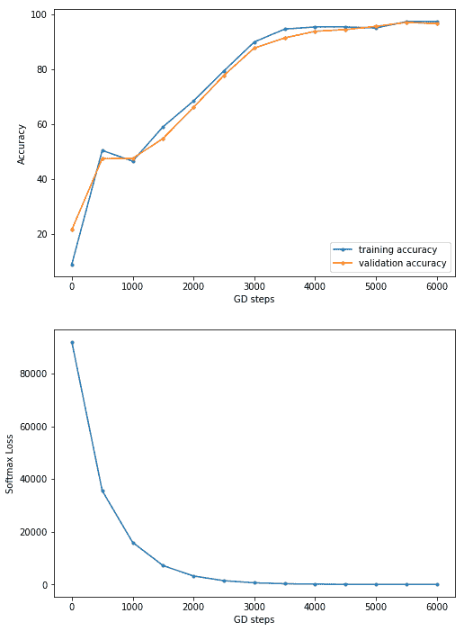

# 使用含 Keras 的致密 FC 层进行分类

让我们用 Keras 实现手写数字分类，同样只使用密集的 FC 层。这一次，我们将使用一个隐藏层和一个退出层。下一个代码块显示了如何使用`keras.models Sequential()`函数用几行代码实现分类器。我们可以简单地将层顺序添加到模型中。引入了两个隐藏层，每个层都有 200 个节点，中间有一个辍学，辍学率为 15%。这次，让我们使用**Adam**优化器（它使用**动量**来加速 SGD）。让我们用 10`epochs`（一次通过整个输入数据集）将模型拟合到训练数据集上。正如我们所看到的，随着。。。

# 网络可视化

让我们想象一下我们用 Keras 设计的神经网络的架构。以下代码片段将允许我们在图像中保存模型（网络）体系结构：

```py
# pip install pydot_ng ## install pydot_ng if not already installed
import pydot_ng as pydot
from keras.utils import plot_model
plot_model(model, to_file='../images/model.png')
```

以下屏幕截图显示了前一个代码块（神经网络体系结构）的输出：

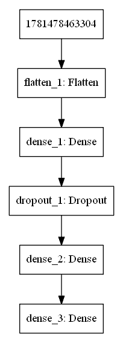

# 可视化中间层中的权重

现在，让我们可视化在中间层中学习的权重。以下 Python 代码可视化了在第一个密集层上为前 200 个隐藏单元学习的权重：

```py
from keras.models import Modelimport matplotlib.pylab as pylabimport numpy as npW = model.get_layer('dense_1').get_weights()print(W[0].shape)print(W[1].shape)fig = pylab.figure(figsize=(20,20))fig.subplots_adjust(left=0, right=1, bottom=0, top=0.95, hspace=0.05, wspace=0.05) pylab.gray()for i in range(200):    pylab.subplot(15, 14, i+1), pylab.imshow(np.reshape(W[0][:, i], (28,28))), pylab.axis('off')pylab.suptitle('Dense_1 Weights (200 hidden units)', size=20)pylab.show()
```

这将导致以下输出：。。。

# CNN 使用 Keras 进行分类

现在，让我们用 Keras 实现一个 CNN。我们需要引入卷积层、池层和平坦层。下一小节将再次展示如何实现和使用 CNN 进行 MNIST 分类。正如我们将看到的那样，测试数据集的准确性提高了。

# 分类 MNIST

这一次，让我们介绍一个 5 x 5 的卷积层，其中有 64 个带有 ReLU 激活的过滤器，然后是一个 2 x 2 max 池层，步幅为 2。这需要紧跟一个扁平层，然后是一个包含 100 个节点的单个隐藏密集层，然后是输出 softmax 密集层。可以看出，在对模型进行了 10 个时期的训练后，测试数据集上的精度增加到了`98.77%`：

```py
import kerasfrom keras.models import Sequentialfrom keras.layers import Densefrom keras.utils import to_categoricalfrom keras.layers.convolutional import Conv2D # to add convolutional layersfrom keras.layers.convolutional import MaxPooling2D # to add pooling layersfrom keras.layers import Flatten # to flatten data for fully ...
```

# 可视化中间层

现在，让我们可视化图像特征映射（64 个特征和 64 个过滤器），使用以下代码块，通过卷积层学习两幅图像：

```py
from keras.models import Model
import matplotlib.pylab as pylab
import numpy as np
intermediate_layer_model = Model(inputs=model.input, outputs=model.get_layer('conv2d_1').output)
intermediate_output = intermediate_layer_model.predict(X_train)
print(model.input.shape, intermediate_output.shape)
fig = pylab.figure(figsize=(15,15))
fig.subplots_adjust(left=0, right=1, bottom=0, top=1, hspace=0.05, wspace=0.05) 
pylab.gray()
i = 1 
for c in range(64):
    pylab.subplot(8, 8, c+1), pylab.imshow(intermediate_output[i,:,:,c]), pylab.axis('off')
pylab.show()
```

以下屏幕截图显示了卷积层从训练数据集中学习的标签为 0 的手写数字图像的特征图：

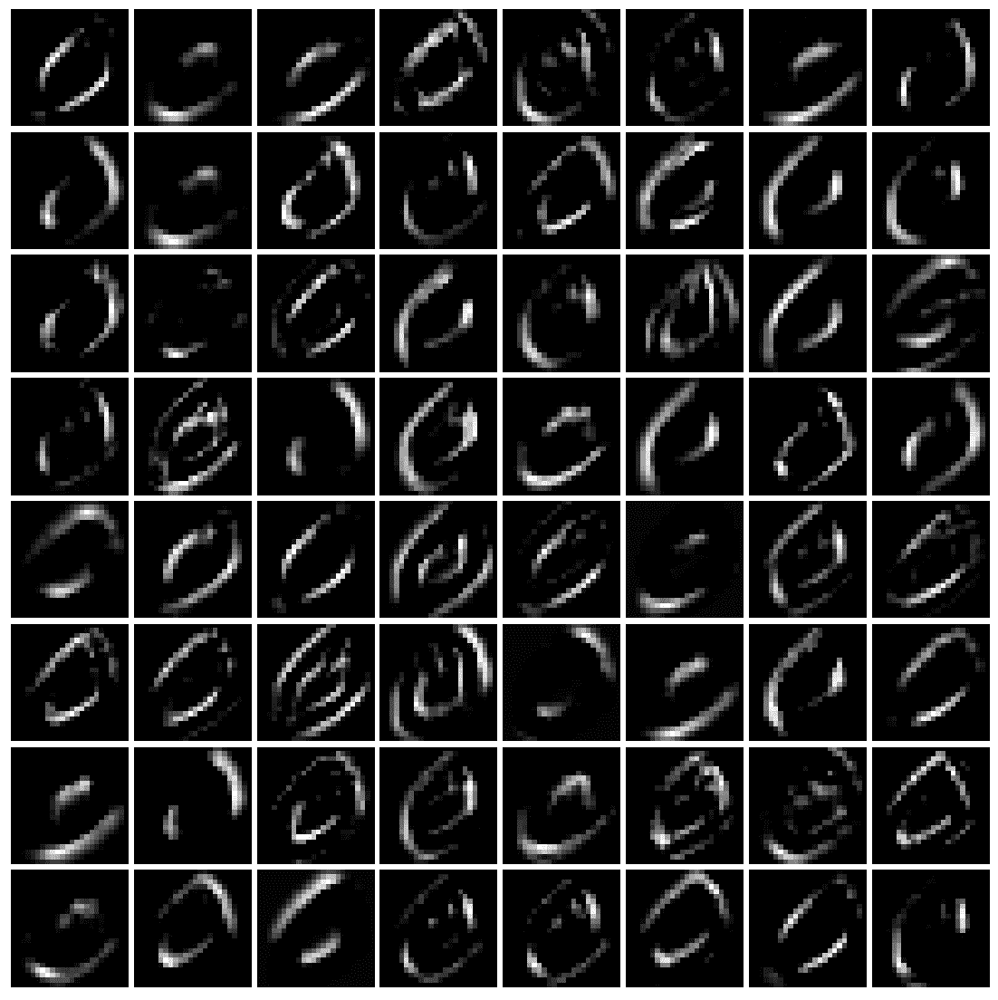

通过将图像的索引从训练数据集更改为 2 并再次运行前面的代码，我们得到以下输出：

```py
i = 2
```

以下屏幕截图显示了卷积层从 MNIST 训练数据集中学习的标签为 4 的手写数字图像的特征图：

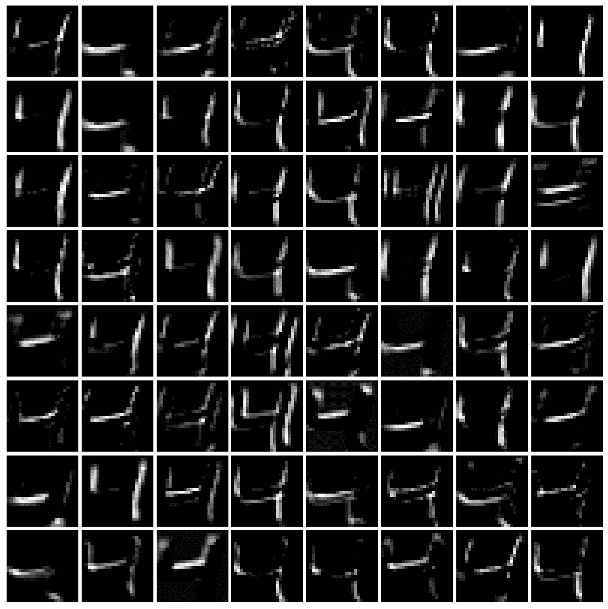

# 一些流行的深度 CNN

在本节中，让我们讨论用于图像分类的流行深度 CNN（例如，VGG-18/19、ResNet 和 InceptionNet）。下面的屏幕截图显示了单作物精度（**top-1 精度**：CNN 预测的正确标签具有最高概率的次数）在提交给 ImageNet 挑战赛的最相关的参赛作品中，从最左边的**AlexNet**（Krizhevsky 等人，2012），到表现最好的**Inception-v4**（Szegedy 等人，2016）：

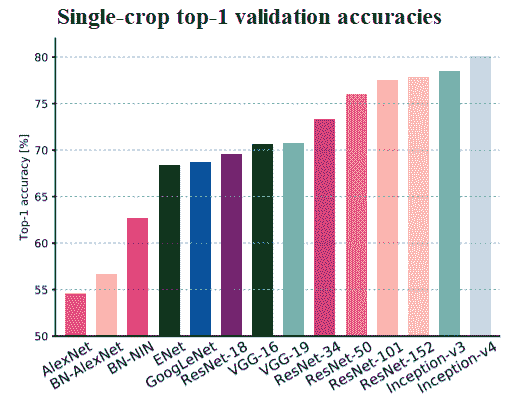

此外，我们还将使用 Keras 训练 VGG-16 CNN，将猫图像与狗图像进行分类。

# VGG-16/19

下面的屏幕截图显示了一个名为 VGG-16/19 的流行 CNN 的架构。关于 VGG-16 网络，值得注意的是，它不需要太多的超参数，而是让你使用一个简单得多的网络，你只需要使用 3 x 3 的卷积层，步长为 1，并且总是使用相同的填充，使所有最大池层的步长为 2 x 2。这是一个非常深入的网络。

该网络共有约 1.38 亿个参数，如下图所示：

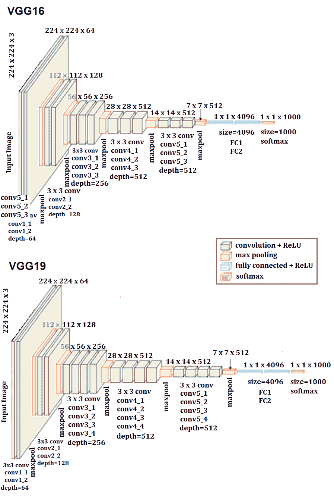

# 在 Keras 中用 VGG-16 对猫/狗图像进行分类

在本节中，让我们使用 Keras VGG-16 实现对 Kaggle*狗与猫***比赛中的猫和狗图像进行分类。让我们下载培训和测试图像数据集（[https://www.kaggle.com/c/dogs-vs-cats](https://www.kaggle.com/c/dogs-vs-cats) 首先。然后，让我们在训练图像上从头开始训练 VGG-16 网络**

 **# 训练阶段

下面的代码块显示了如何在训练数据集上拟合模型。让我们使用来自训练数据集的 20k 图像来训练 VGG-16 模型，并使用 5k 图像作为验证数据集在训练时评估模型。`weights=None`参数值必须传递给`VGG16()`函数，以确保网络从头开始训练。注意，如果不在 GPU 上运行，这将花费很长时间，因此建议使用 GPU

For installing TensorFlow with a GPU, refer to this article: [https://medium.com/@raza.shahzad/setting-up-tensorflow-gpu-keras-in-conda-on-windows-10-75d4fd498198](https://medium.com/@raza.shahzad/setting-up-tensorflow-gpu-keras-in-conda-on-windows-10-75d4fd498198).

对于 20 个时代，验证数据集的精度为`78.38%.`，我们可以调整超参数以进一步提高模型的精度，这留给读者作为练习：

```py
import os 
import numpy as np 
import cv2 
from random import shuffle 
from tqdm import tqdm # percentage bar for tasks. 

# download the cats/dogs images compressed train and test datasets from here: https://www.kaggle.com/c/dogs-vs-cats/data
# unzip the train.zip images under the train folder and test.zip images under the test folder
train = './train' 
test = './test'
lr = 1e-6 # learning rate
image_size = 50 # all the images will be resized to squaure images with this dimension

model_name = 'cats_dogs-{}-{}.model'.format(lr, 'conv2') 
```

```py
def label_image(image):
    word_label = image.split('.')[-3]
    if word_label == 'cat': return 0
    elif word_label == 'dog': return 1

def create_training_data():
    training_data = []
    for image in tqdm(os.listdir(train)):
        path = os.path.join(train, image)
        label = label_image(image)
        image = cv2.imread(path)
        image = cv2.resize(image, (image_size, image_size))
        training_data.append([np.array(image),np.array(label)])
    shuffle(training_data)
    np.save('train_data.npy', training_data)
    return training_data

train_data = create_training_data()
# 100%|████████████████████████████████████████████████████████████████████████████████████████| 1100/1100 [00:00<00:00, 1133.86it/s]

train = train_data[:-5000] # 20k images for training
valid = train_data[-5000:] # 5k images for validation
X_train = np.array([i[0] for i in train]).reshape(-1,image_size,image_size,3)
y_train = [i[1] for i in train]
y_train = to_categorical(y_train)
print(X_train.shape, y_train.shape)

X_valid = np.array([i[0] for i in valid]).reshape(-1,image_size,image_size,3)
y_valid = [i[1] for i in valid]
y_valid = to_categorical(y_valid) # to one-hot encoding

num_classes = y_valid.shape[1] # number of categories

model = VGG16(weights=None, input_shape=(image_size,image_size,3), classes=num_classes) # train VGG16 model from scratch
model.compile(Adam(lr=lr), "categorical_crossentropy", metrics=["accuracy"]) # "adam"
model.summary()
```

```py
# fit the model, it's going take a long time if not run on GPU
model.fit(X_train, y_train, validation_data=(X_valid, y_valid), epochs=20, batch_size=256, verbose=2)
# evaluate the model
scores = model.evaluate(X_valid, y_valid, verbose=0)
print("Accuracy: {} \n Error: {}".format(scores[1], 100-scores[1]*100))
# _______________________________________________________________
#Layer (type)                 Output Shape              Param 
# =================================================================
# input_5 (InputLayer)         (None, 50, 50, 3)         0         
# _________________________________________________________________
# block1_conv1 (Conv2D)        (None, 50, 50, 64)        1792      
# _________________________________________________________________
# block1_conv2 (Conv2D)        (None, 50, 50, 64)        36928     
# _________________________________________________________________
# block1_pool (MaxPooling2D)   (None, 25, 25, 64)        0         
# _________________________________________________________________
# block2_conv1 (Conv2D)        (None, 25, 25, 128)       73856     
# _________________________________________________________________
# block2_conv2 (Conv2D)        (None, 25, 25, 128)       147584    
# _________________________________________________________________
# block2_pool (MaxPooling2D)   (None, 12, 12, 128)       0         
# _________________________________________________________________
# block3_conv1 (Conv2D)        (None, 12, 12, 256)       295168    
# _________________________________________________________________
# block3_conv2 (Conv2D)        (None, 12, 12, 256)       590080    
# _________________________________________________________________
# block3_conv3 (Conv2D)        (None, 12, 12, 256)       590080    
# _________________________________________________________________
# block3_pool (MaxPooling2D)   (None, 6, 6, 256)         0         
# _________________________________________________________________
# block4_conv1 (Conv2D)        (None, 6, 6, 512)         1180160   
# _________________________________________________________________
# block4_conv2 (Conv2D)        (None, 6, 6, 512)         2359808   
# _________________________________________________________________
# block4_conv3 (Conv2D)        (None, 6, 6, 512)         2359808   
# _________________________________________________________________
# block4_pool (MaxPooling2D)   (None, 3, 3, 512)         0         
# _________________________________________________________________
# block5_conv1 (Conv2D)        (None, 3, 3, 512)         2359808   
# _________________________________________________________________
# block5_conv2 (Conv2D)        (None, 3, 3, 512)         2359808   
# _________________________________________________________________
# block5_conv3 (Conv2D)        (None, 3, 3, 512)         2359808   
# _________________________________________________________________
# block5_pool (MaxPooling2D)   (None, 1, 1, 512)         0         
# _________________________________________________________________
# flatten (Flatten)            (None, 512)               0         
# ________________________________________________________________ *# fc1 (Dense)                  (None, 4096)              2101248* # _______________________________________________________________ *# fc2 (Dense)                  (None, 4096)              16781312* # ________________________________________________________________
# predictions (Dense)          (None, 2)                 8194      
# =================================================================
# Total params: 33,605,442
# Trainable params: 33,605,442
# Non-trainable params: 0
# _________________________________________________________________
# Train on 20000 samples, validate on 5000 samples
# Epoch 1/10
# - 92s - loss: 0.6878 - acc: 0.5472 - val_loss: 0.6744 - val_acc: 0.5750
# Epoch 2/20
# - 51s - loss: 0.6529 - acc: 0.6291 - val_loss: 0.6324 - val_acc: 0.6534
# Epoch 3/20
# - 51s - loss: 0.6123 - acc: 0.6649 - val_loss: 0.6249 - val_acc: 0.6472
# Epoch 4/20
# - 51s - loss: 0.5919 - acc: 0.6842 - val_loss: 0.5902 - val_acc: 0.6828
# Epoch 5/20
# - 51s - loss: 0.5709 - acc: 0.6992 - val_loss: 0.5687 - val_acc: 0.7054
# Epoch 6/20
# - 51s - loss: 0.5564 - acc: 0.7159 - val_loss: 0.5620 - val_acc: 0.7142
# Epoch 7/20
# - 51s - loss: 0.5539 - acc: 0.7137 - val_loss: 0.5698 - val_acc: 0.6976
# Epoch 8/20
# - 51s - loss: 0.5275 - acc: 0.7371 - val_loss: 0.5402 - val_acc: 0.7298
# Epoch 9/20
# - 51s - loss: 0.5072 - acc: 0.7536 - val_loss: 0.5240 - val_acc: 0.7444
# Epoch 10/20
# - 51s - loss: 0.4880 - acc: 0.7647 - val_loss: 0.5127 - val_acc: 0.7544
# Epoch 11/20
# - 51s - loss: 0.4659 - acc: 0.7814 - val_loss: 0.5594 - val_acc: 0.7164
# Epoch 12/20
# - 51s - loss: 0.4584 - acc: 0.7813 - val_loss: 0.5689 - val_acc: 0.7124
# Epoch 13/20
# - 51s - loss: 0.4410 - acc: 0.7952 - val_loss: 0.4863 - val_acc: 0.7704
# Epoch 14/20
# - 51s - loss: 0.4295 - acc: 0.8022 - val_loss: 0.5073 - val_acc: 0.7596
# Epoch 15/20
# - 51s - loss: 0.4175 - acc: 0.8084 - val_loss: 0.4854 - val_acc: 0.7688
# Epoch 16/20
# - 51s - loss: 0.3914 - acc: 0.8259 - val_loss: 0.4743 - val_acc: 0.7794
# Epoch 17/20
# - 51s - loss: 0.3852 - acc: 0.8286 - val_loss: 0.4721 - val_acc: 0.7810
# Epoch 18/20
# - 51s - loss: 0.3692 - acc: 0.8364 - val_loss: 0.6765 - val_acc: 0.6826
# Epoch 19/20
# - 51s - loss: 0.3752 - acc: 0.8332 - val_loss: 0.4805 - val_acc: 0.7760
# Epoch 20/20
# - 51s - loss: 0.3360 - acc: 0.8586 - val_loss: 0.4711 - val_acc: 0.7838
# Accuracy: 0.7838
# Error: 21.61999999999999
```

下一个代码块使用第一个块的第二个卷积层中的前 64 个过滤器，可视化为狗图像学习的特征：

```py
intermediate_layer_model = Model(inputs=model.input, outputs=model.get_layer('block1_conv2').output)
intermediate_output = intermediate_layer_model.predict(X_train)
fig = pylab.figure(figsize=(10,10))
fig.subplots_adjust(left=0, right=1, bottom=0, top=1, hspace=0.05, wspace=0.05) 
pylab.gray()
i = 3
for c in range(64):
    pylab.subplot(8, 8, c+1), pylab.imshow(intermediate_output[i,:,:,c]), pylab.axis('off')
pylab.show()
```

以下屏幕截图显示了前面代码的输出，即为模型的狗图像学习的特征图：

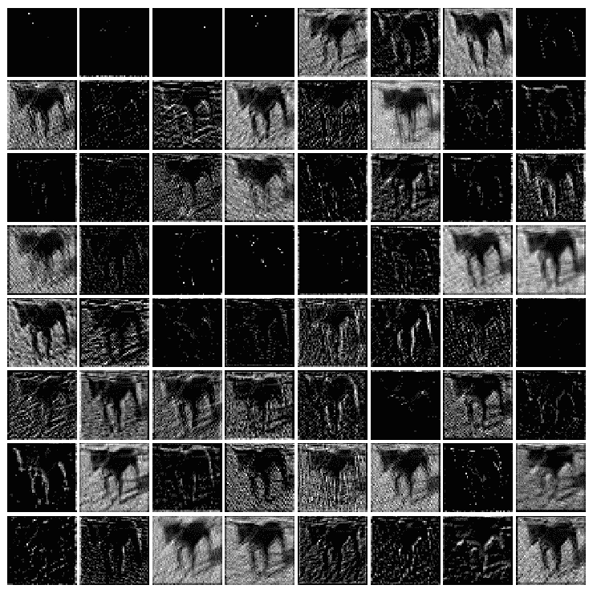

通过更改前一代码段中的单行，我们可以可视化在第二个块的第二个卷积层中使用前 64 个过滤器为同一个狗图像学习的特征：

```py
intermediate_layer_model = Model(inputs=model.input, outputs=model.get_layer('block2_conv2').output)
```

以下屏幕截图显示了之前代码的输出，即为模型的同一狗图像学习的特征图：


# 测试（预测）阶段

下一个代码块显示了如何使用所学的 VGG-16 模型，从`test`图像数据集中预测图像是狗还是猫的概率：

```py
test_data = process_test_data()len(test_data)X_test = np.array([i for i in test_data]).reshape(-1,IMG_SIZE,IMG_SIZE,3)probs = model.predict(X_test)probs = np.round(probs,2)pylab.figure(figsize=(20,20))for i in range(100):    pylab.subplot(10,10,i+1), pylab.imshow(X_test[i,:,:,::-1]), pylab.axis('off')    pylab.title("{}, prob={:0.2f}".format('cat' if probs[i][1] < 0.5 else 'dog', max(probs[i][0],probs[i][1])))pylab.show()
```

下一个屏幕截图显示了类预测的前 100 个测试图像以及预测概率。。。

# 接收网

在 CNN 分类器的发展中，初始网络是一个非常重要的里程碑。在 inception 网络出现之前，CNN 通常只将卷积层堆叠到最大深度，以获得更好的性能。Inception 网络使用复杂的技术和技巧来满足速度和准确性方面的性能要求

《盗梦空间》网络不断发展，并导致了网络的几个新版本的诞生。一些流行的版本是-Inception-v1、v2、v3、v4 和 Inception-ResNet。由于图像中的显著部分和信息位置可能存在巨大变化，因此为卷积运算选择正确的核大小变得非常困难。对于分布更为全局的信息，宜使用较大的核；对于分布更为局部的信息，宜使用较小的核。深层神经网络存在过度拟合和消失梯度问题。天真地堆叠大型卷积运算将招致大量费用。

inception 网络通过添加在同一级别上运行的多个大小的过滤器，解决了前面的所有问题。这导致网络变得更广而不是更深。下一个屏幕截图显示了具有降维功能的 inception 模块。它使用三种不同大小的过滤器（1 x 1、3 x 3 和 5 x 5）和额外的最大池对输入执行卷积。输出被级联并发送到下一个初始模块。为了降低成本，通过在 3 x 3 和 5 x 5 卷积之前添加额外的 1 x 1 卷积来限制输入通道的数量。利用降维初始模块，建立了神经网络结构。这就是众所周知的**谷歌网**（**初始版本 v1**。该体系结构如下图所示，GoogleNet 有九个这样的初始模块线性堆叠。它有 22 层（27 层，包括池层），在上一个初始模块结束时使用全局平均池：

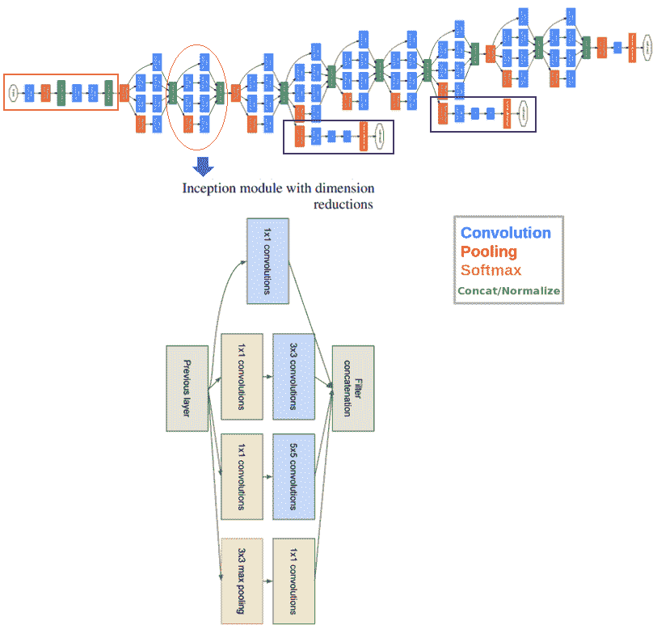

在撰写本文时，已经引入了几个版本的 inception net（V2、3 和 4），它们是对以前体系结构的扩展。Keras 提供了 Inception-v3 模型，可以从头开始训练，也可以使用预训练版本（通过在 ImageNet 上训练获得权重）。

# ResNet

简单地堆叠层并不一定会增加网络深度。由于**消失梯度问题**，它们很难训练。这是一个梯度反向传播到前一层的问题，如果这种情况反复发生，梯度可能会变得无限小。因此，随着我们的深入，性能会受到严重影响

**ResNet**代表**剩余网络**，它在网络中引入了快捷方式，我们称之为身份快捷连接。快捷连接遵循其名称，并跳过一个或多个层，从而防止堆叠层降低性能。堆叠的标识层除了简单地堆叠标识映射之外，什么都不做。。。

# 总结

本章介绍了深度学习模型在图像处理方面的最新进展。我们首先讨论了深度学习的基本概念，它与传统的 ML 有什么不同，以及我们为什么需要它。然后，CNN 被介绍为深度神经网络，专门用于解决复杂的图像处理和计算机视觉任务。讨论了具有卷积层、池层和 FC 层的 CNN 体系结构。接下来，我们介绍了 TensorFlow 和 Keras，这是 Python 中两个流行的深度学习库。我们展示了如何使用 CNN 提高 MNIST 数据集上手写数字分类的测试精度，然后仅使用 FC 层。最后，我们讨论了一些流行的网络，如 VGG-16/19、GoogleNet 和 ResNet。Kera 的 VGG-16 模型在 Kaggle 的狗对猫比赛图像上进行了训练，我们展示了它如何以相当高的精度在验证图像数据集上执行。

在下一章中，我们将讨论如何使用深度学习模型解决更复杂的图像处理任务（例如，对象检测、分割和样式转换），以及如何使用转换学习来节省培训时间。

# 问题

1.  对于使用带有 Keras 的 FC 层对`mnist`数据集进行分类，编写 Python 代码片段以可视化输出层（神经网络所看到的）。
2.  对于仅使用带有 FC 层的神经网络和带有 Keras 的 CNN 对`mnist`数据集进行分类，我们在训练模型时直接使用测试数据集对模型进行评估。从训练图像中留出几千个图像，创建一个验证数据集，并在剩余的图像上训练模型。在培训时使用验证数据集评估模型。在培训结束时，使用所学的模型预测测试数据集的标签，并评估模型的准确性。它增加了吗？

3.  使用 VGG-16/19、Resnet-50 和 Inception。。。

# 进一步阅读

*   [https://arxiv.org/pdf/1409.4842v1.pdf](https://arxiv.org/pdf/1409.4842v1.pdf)
*   [http://cs231n.github.io/convolutional-networks/](http://cs231n.github.io/convolutional-networks/)
*   [https://arxiv.org/abs/1512.03385.pdf](https://arxiv.org/abs/1512.03385)
*   [https://arxiv.org/pdf/1605.07678.pdf](https://arxiv.org/pdf/1605.07678.pdf)
*   [https://www.cs.toronto.edu/~frossard/post/vgg16/](https://www.cs.toronto.edu/~frossard/post/vgg16/)
*   [https://pythonprogramming.net/convolutional-neural-network-kats-vs-dogs-machine-learning-tutorial/](https://pythonprogramming.net/convolutional-neural-network-kats-vs-dogs-machine-learning-tutorial/)*****