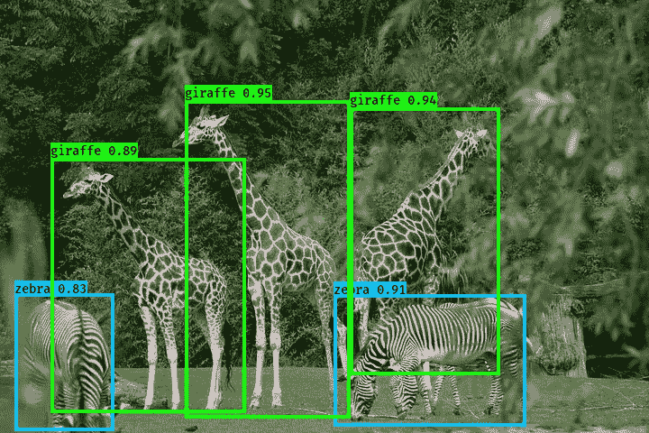
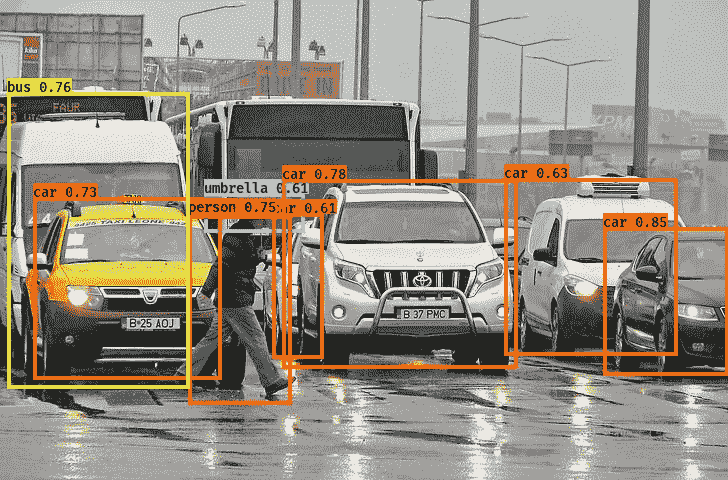
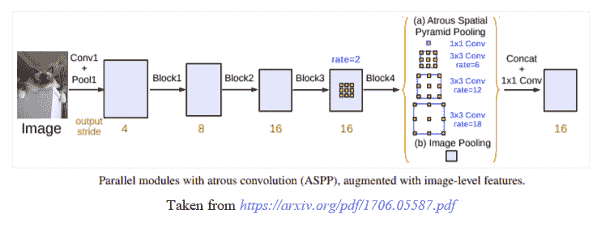
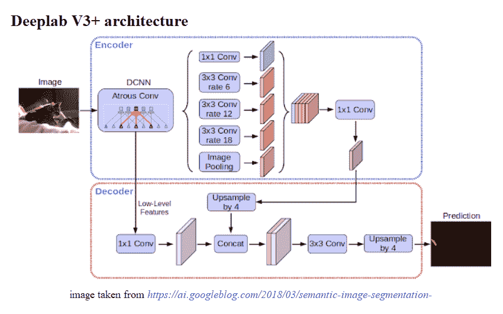
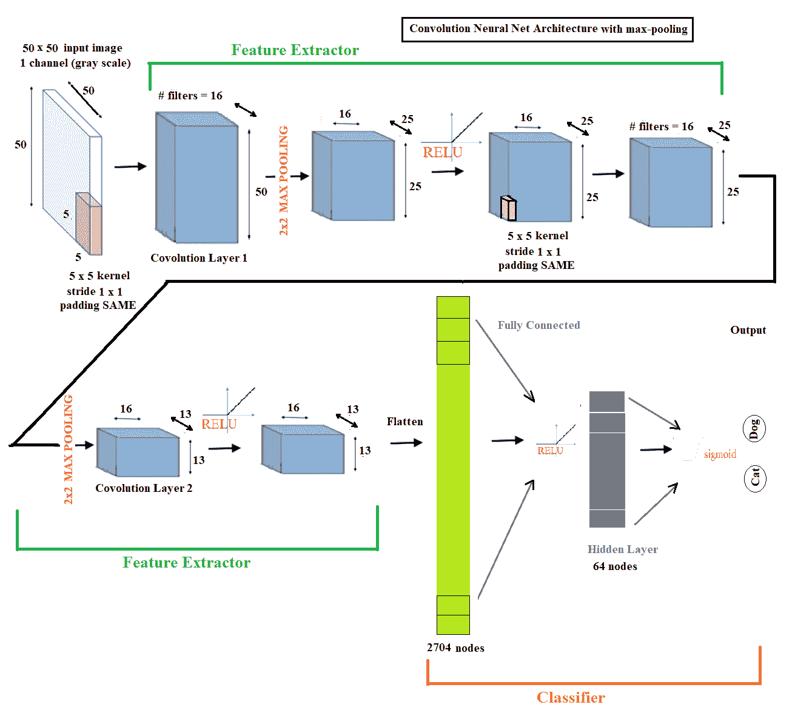
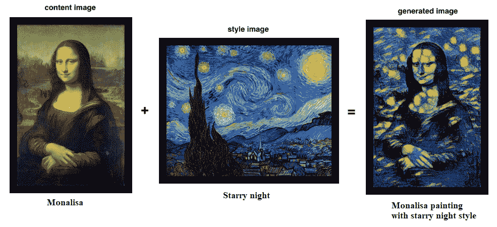
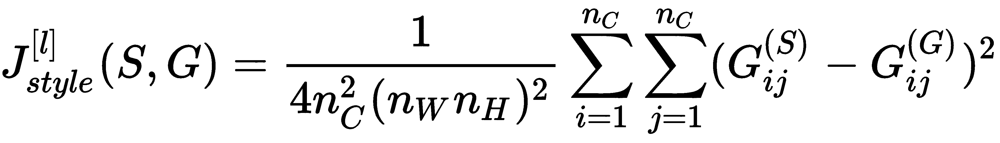
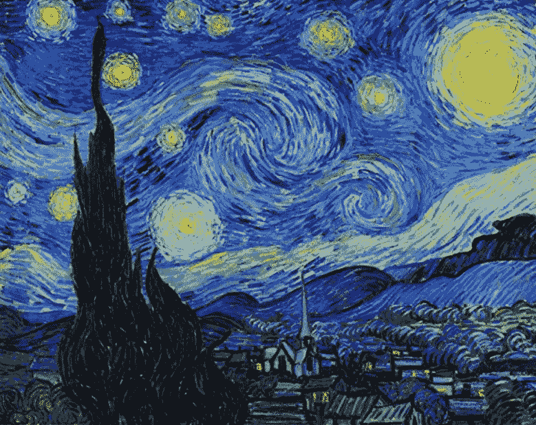
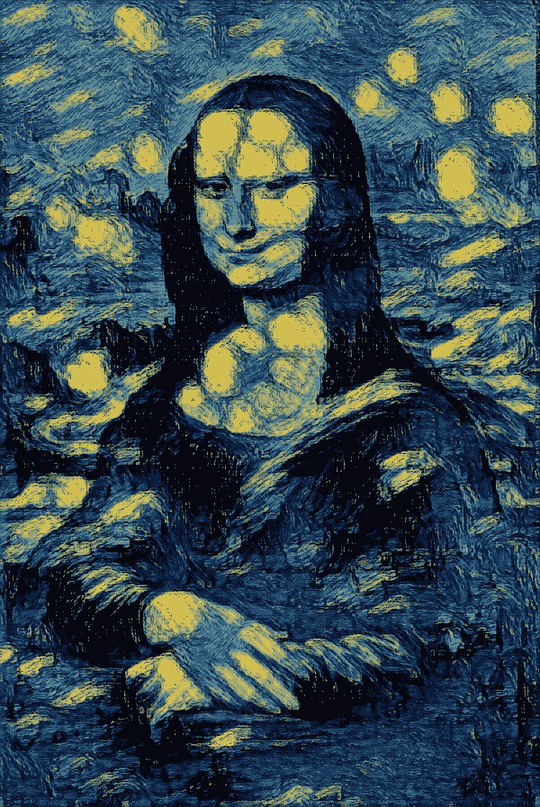

# 深入学习图像处理-目标检测等

在本章中，我们将继续讨论图像处理与深度学习的最新进展。我们将特别处理一些问题，并将尝试使用深度 CNN 的深度学习来解决这些问题

我们将研究目标检测问题，了解涉及的基本概念，然后研究如何编写代码来解决目标建议和**问题，您只需查看 Keras 中的**（**YOLO**）v2 预训练深度神经网络。您将获得有助于培训 YOLO net 的资源。

准备好学习迁移学习，并使用`DeepLab`库解决深度分段问题。您将学习指定哪个。。。

# 介绍 YOLO v2

YOLO 是一种非常流行且完全传统的用于检测图像的算法。与其他算法相比，该算法具有非常高的准确率，并且能够实时运行。顾名思义，这种算法只会在图像上查看一次。这意味着该算法只需要一个正向传播过程就可以做出准确的预测

在本节中，我们将使用**完全卷积网络**（**FCN**）深度学习模型检测图像中的对象。给定包含一些对象（例如动物、汽车等）的图像，目标是使用预先训练的 YOLO*模型和边界框检测这些图像中的对象。*

 *许多想法来自于两份原始的 YOLO 论文，可在[上找到 https://arxiv.org/abs/1506.02640](https://arxiv.org/abs/1506.02640) 和[https://arxiv.org/abs/1612.08242](https://arxiv.org/abs/1612.08242) 。但在深入研究 YOLO 模型之前，让我们先了解一些先决条件的基本概念。

# 图像分类定位与目标检测

让我们首先了解有关分类、定位、检测*、*和目标检测问题的概念，如何将它们转化为有监督的机器学习问题，然后，如何使用深度卷积神经网络解决它们。

请参阅下图：


我们可以推断如下：

*   在图像分类问题中，通常图像中有一个（大的）中心对象，我们必须通过为图像指定正确的标签来识别该对象
*   图像分类与定位的目的是找到一个物体在图像中的位置。。。

# 利用 CNNs 提出和检测目标

从定位到检测，我们可以分两步进行，如下面的屏幕截图所示：首先使用紧密裁剪的小图像训练卷积神经网络进行图像分类，然后使用不同窗口大小（从小到大）的滑动窗口使用 convnet 对该窗口内的测试图像进行分类，并在整个图像中按顺序运行窗口，但计算速度太慢。

然而，如下图所示，通过使用 1×1 滤波器替换完全连接的层，滑动窗口的卷积实现使得能够在所有可能的滑动窗口内并行地同时对图像子集进行分类，从而使其在计算上更加高效。

# 使用 YOLO v2

卷积滑动窗口虽然计算效率更高，但仍然存在精确检测边界框的问题，因为框与滑动窗口不对齐，并且对象形状也往往不同。YOLO 算法通过将训练图像划分为网格并将对象指定给网格（当且仅当对象的中心位于网格内时），克服了这一限制。这样，可以将训练图像中的每个对象精确地指定给一个栅格，然后通过相对于栅格的坐标表示相应的边界框

在测试图像中，多个相邻栅格可能认为某个对象实际上属于它们。为了解决这个问题，**交叉口。。。**

# 使用预先训练的 YOLO 模型进行目标检测

以下是您必须遵循的步骤，以便能够使用经过预培训的模型：

1.  克隆此存储库：转到[https://github.com/allanzelener/YAD2K/](https://github.com/allanzelener/YAD2K/) ，右键点击克隆或下载，选择下载`ZIP`的路径。然后将压缩文件解压缩到`*YAD2K-master*`文件夹。

2.  从[下载重量和 cfg 文件 https://pjreddie.com/darknet/yolo/](https://pjreddie.com/darknet/yolo/) 点击页面上红色框标记的黄色链接：


3.  将下载的`yolov2.cfg`和`yolov2.weights`文件保存在`YAD2K-master`文件夹中。

4.  进入` YAD2K-master`文件夹，打开命令提示符（需要安装 Python3 并在 path 中），然后运行以下命令：

```py
python yad2k.py yolov2.cfg yolov2.weights yolo/yolo.h5
```

如果执行成功，将在`YAD2K-master/model_data`文件夹*、*中创建两个文件，即`yolo.h5`和`yolo.anchors`*。* 

5.  现在转到要从中运行代码的文件夹。在此处创建一个名为`yolo`的文件夹，并将`YAD2K-master/model_data`文件夹中的四个文件（`coco_classes`、`pascal_classes`、`yolo.h5`、`yolo.anchors`复制到您创建的`yolo`文件夹中。
6.  将`yad2k`文件夹从`YAD2K-master`文件夹复制到当前路径。现在，您当前的路径应该有两个文件夹`yad2k`和`yolo`
7.  在当前路径中创建一个名为`images`的新文件夹，并将输入图像放在此处。
8.  在当前路径中创建另一个名为`output`的新空文件夹。YOLO 模型将在此处保存输出图像（检测到对象）。
9.  在当前路径中创建一个`.py`脚本，复制粘贴以下代码并运行（或从当前路径的 Jupyter 笔记本单元运行）

10.  在运行代码之前，请仔细检查文件夹结构是否完全如以下屏幕截图所示，以及是否存在所需的文件：


让我们首先加载所有必需的库，如此代码块所示：

```py
# for jupyter notebook uncomment the following line of code
#% matplotlib inline
import os
import matplotlib.pylab as pylab
import scipy.io
import scipy.misc
import numpy as np
from PIL import Image
from keras import backend as K
from keras.models import load_model
# The following functions from the yad2k library will be used
# Note: it assumed that you have the yad2k folder in your current path, otherwise it will not work!
from yad2k.models.keras_yolo import yolo_head, yolo_eval
import colorsys
import imghdr
import random
from PIL import Image, ImageDraw, ImageFont
```

现在实现几个函数来读取`classes`和`anchor`文件，生成方框的颜色，并缩放 YOLO 预测的方框：

```py
def read_classes(classes_path):

    with open(classes_path) as f:
        class_names = f.readlines()
    class_names = [c.strip() for c in class_names]
    return class_names

def read_anchors(anchors_path):

    with open(anchors_path) as f:
        anchors = f.readline()
        anchors = [float(x) for x in anchors.split(',')]
        anchors = np.array(anchors).reshape(-1, 2)
    return anchors

def generate_colors(class_names):

    hsv_tuples = [(x / len(class_names), 1., 1.) for x in range(len(class_names))]
    colors = list(map(lambda x: colorsys.hsv_to_rgb(*x), hsv_tuples))
    colors = list(map(lambda x: (int(x[0] * 255), int(x[1] * 255), int(x[2] * 255)), colors))
    random.seed(10101) # Fixed seed for consistent colors across runs.
    random.shuffle(colors) # Shuffle colors to decorrelate adjacent classes.
    random.seed(None) # Reset seed to default.
    return colors

def scale_boxes(boxes, image_shape):

    """ scales the predicted boxes in order to be drawable on the image"""
    height = image_shape[0]
    width = image_shape[1]
    image_dims = K.stack([height, width, height, width])
    image_dims = K.reshape(image_dims, [1, 4])
    boxes = boxes * image_dims
    return boxes
```

在下面的代码片段中，我们将实现两个函数来预处理图像，并绘制从 YOLO 获得的框来检测图像中存在的对象：

```py
def preprocess_image(img_path, model_image_size):

    image_type = imghdr.what(img_path)
    image = Image.open(img_path)
    resized_image = image.resize(tuple(reversed(model_image_size)), Image.BICUBIC)
    image_data = np.array(resized_image, dtype='float32')
    image_data /= 255.
    image_data = np.expand_dims(image_data, 0) # Add batch dimension.
    return image, image_data

def draw_boxes(image, out_scores, out_boxes, out_classes, class_names, colors):    

    font = ImageFont.truetype(font='font/FiraMono-Medium.otf',size=np.floor(3e-2 * image.size[1] + 0.5).astype('int32'))
    thickness = (image.size[0] + image.size[1]) // 300

    for i, c in reversed(list(enumerate(out_classes))):
        predicted_class = class_names[c]
        box = out_boxes[i]
        score = out_scores[i]
        label = '{} {:.2f}'.format(predicted_class, score)
        draw = ImageDraw.Draw(image)
        label_size = draw.textsize(label, font)
        top, left, bottom, right = box
        top = max(0, np.floor(top + 0.5).astype('int32'))
        left = max(0, np.floor(left + 0.5).astype('int32'))
        bottom = min(image.size[1], np.floor(bottom + 0.5).astype('int32'))
        right = min(image.size[0], np.floor(right + 0.5).astype('int32'))
        print(label, (left, top), (right, bottom))
        if top - label_size[1] >= 0:
            text_origin = np.array([left, top - label_size[1]])
        else:
            text_origin = np.array([left, top + 1])
        # My kingdom for a good redistributable image drawing library.
        for i in range(thickness):
            draw.rectangle([left + i, top + i, right - i, bottom - i], outline=colors[c])
        draw.rectangle([tuple(text_origin), tuple(text_origin + label_size)], fill=colors[c])
        draw.text(text_origin, label, fill=(0, 0, 0), font=font)
        del draw
```

现在，让我们使用函数加载输入图像、类文件和锚点，然后加载 YOLO 预训练模型，并使用下一个代码块打印模型摘要：

```py
# provide the name of the image that you saved in the images folder to be fed through the network
input_image_name = "giraffe_zebra.jpg"
input_image = Image.open("images/" + input_image_name)
width, height = input_image.size
width = np.array(width, dtype=float)
height = np.array(height, dtype=float)
image_shape = (height, width)
#Loading the classes and the anchor boxes that are copied to the yolo folder
class_names = read_classes("yolo/coco_classes.txt")
anchors = read_anchors("yolo/yolo_anchors.txt")
#Load the pretrained model 
yolo_model = load_model("yolo/yolo.h5")
#Print the summery of the model
yolo_model.summary()
#__________________________________________________________________________________________________
#Layer (type) Output Shape Param # Connected to 
#==================================================================================================
#input_1 (InputLayer) (None, 608, 608, 3) 0 
#__________________________________________________________________________________________________
#conv2d_1 (Conv2D) (None, 608, 608, 32) 864 input_1[0][0] 
#__________________________________________________________________________________________________
#batch_normalization_1 (BatchNor (None, 608, 608, 32) 128 conv2d_1[0][0] 
#__________________________________________________________________________________________________
#leaky_re_lu_1 (LeakyReLU) (None, 608, 608, 32) 0 batch_normalization_1[0][0] 
#__________________________________________________________________________________________________
#max_pooling2d_1 (MaxPooling2D) (None, 304, 304, 32) 0 leaky_re_lu_1[0][0] 
#__________________________________________________________________________________________________
#conv2d_2 (Conv2D) (None, 304, 304, 64) 18432 max_pooling2d_1[0][0] 
#__________________________________________________________________________________________________
#batch_normalization_2 (BatchNor (None, 304, 304, 64) 256 conv2d_2[0][0] 
#__________________________________________________________________________________________________
#leaky_re_lu_2 (LeakyReLU) (None, 304, 304, 64) 0 batch_normalization_2[0][0] 
#__________________________________________________________________________________________________
#max_pooling2d_2 (MaxPooling2D) (None, 152, 152, 64) 0 leaky_re_lu_2[0][0] 
#__________________________________________________________________________________________________
#... ... ...
#__________________________________________________________________________________________________
#concatenate_1 (Concatenate) (None, 19, 19, 1280) 0 space_to_depth_x2[0][0] 
# leaky_re_lu_20[0][0] 
#________________________________________________________________________________________________ 
#batch_normalization_22 (BatchNo (None, 19, 19, 1024) 4096 conv2d_22[0][0] 
#__________________________________________________________________________________________________
#leaky_re_lu_22 (LeakyReLU) (None, 19, 19, 1024) 0 batch_normalization_22[0][0] 
#__________________________________________________________________________________________________
#conv2d_23 (Conv2D) (None, 19, 19, 425) 435625 leaky_re_lu_22[0][0] 
#==================================================================================================
#Total params: 50,983,561
#Trainable params: 50,962,889
#Non-trainable params: 20,672
__________________________________________________________________________________________________
```

最后，下一个代码块从 YOLO 预测输出中提取边界框，并在找到的具有正确标签、分数和颜色的对象周围绘制边界框：

```py
# convert final layer features to bounding box parameters
yolo_outputs = yolo_head(yolo_model.output, anchors, len(class_names))
#Now yolo_eval function selects the best boxes using filtering and non-max suppression techniques.
# If you want to dive in more to see how this works, refer keras_yolo.py file in yad2k/models
boxes, scores, classes = yolo_eval(yolo_outputs, image_shape)
# Initiate a session
sess = K.get_session()
#Preprocess the input image before feeding into the convolutional network
image, image_data = preprocess_image("images/" + input_image_name, model_image_size = (608, 608))
#Run the session
out_scores, out_boxes, out_classes = sess.run([scores, boxes, classes],feed_dict={yolo_model.input:image_data,K.learning_phase(): 0})
#Print the results
print('Found {} boxes for {}'.format(len(out_boxes), input_image_name))
#Found 5 boxes for giraffe_zebra.jpg
#zebra 0.83 (16, 325) (126, 477)
#giraffe 0.89 (56, 175) (272, 457)
#zebra 0.91 (370, 326) (583, 472)
#giraffe 0.94 (388, 119) (554, 415)
#giraffe 0.95 (205, 111) (388, 463)
#Produce the colors for the bounding boxes
colors = generate_colors(class_names)
#Draw the bounding boxes
draw_boxes(image, out_scores, out_boxes, out_classes, class_names, colors)
#Apply the predicted bounding boxes to the image and save it
image.save(os.path.join("output", input_image_name), quality=90)
output_image = scipy.misc.imread(os.path.join("output", input_image_name))
pylab.imshow(output_image)
pylab.axis('off')
pylab.show()
```

下图显示了通过运行上述代码获得的输出。用 YOLO 模型预测了标有边框的对象，长颈鹿和斑马。每个边界框上方的数字是来自 YOLO 模型的概率分数*：*

 *

同样，让我们尝试使用以下照片作为输入：


我们将检测以下对象（汽车、公共汽车、人、伞）：



# 基于 deeplabv3 的深度语义切分+

在本节中，我们将讨论如何使用深度学习 FCN 对图像执行语义分割。在深入了解更多细节之前，让我们先了解一下基本概念。

# 语义分割

语义分割是指在像素级理解图像；也就是说，当我们想要为图像中的每个像素分配一个对象类*（*一个语义标签*）*时。这是从粗略推理到精细推理过程中的一个自然步骤。它通过密集的预测来实现细粒度的推断，为每个像素推断标签，以便每个像素都用其封闭对象或区域的类别来标记。

# 深海实验室 V3+

DeepLab 提出了一种用于控制信号抽取和学习多尺度上下文特征的体系结构。DeepLab 使用在 ImageNet 数据集上预先训练的 ResNet-50 模型作为其主要特征提取器网络。然而，它为多尺度特征学习提出了一个新的残差块，如下图所示。最后一个 ResNet 块使用 atrus 卷积代替常规卷积。此外，每个卷积（在这个新块中）使用不同的膨胀率来捕获多尺度上下文。此外，在这个新块的顶部，它使用**萎缩的空间金字塔池***（***ASPP***。ASPP 使用不同速率的扩张卷积来尝试对任意尺度的区域进行分类。。。*

 *# DeepLab v3 体系结构

图中显示了具有阿托斯卷积的并行模块：



使用 DeepLab-v3+，DeepLab-v3 模型通过添加一个简单但有效的解码器模块来扩展，以细化分割结果，特别是沿着对象边界。将深度可分离卷积应用于 Atrus 空间金字塔池和解码器模块，从而形成更快、更强的用于语义分割的编解码网络。架构如下图所示：



# 使用 DeepLab V3+模型进行语义分段必须遵循的步骤

以下是使用模型分割图像必须遵循的步骤：

1.  首先，从[克隆或下载存储库 https://github.com/bonlime/keras-deeplab-v3-plus](https://github.com/bonlime/keras-deeplab-v3-plus) 。
2.  解压缩下载到` keras-deeplab-v3-plus-master`文件夹的`ZIP`文件。
3.  导航到`keras-deeplab-v3-plus-master`文件夹*；*以下代码需要从目录内部运行。

在运行以下代码块之前，请创建一个输入文件夹和一个空输出文件夹。将要分割的图像保存在输入文件夹中。以下代码块显示如何使用 Python 中的 Deeplabv3+进行语义分割：

```py
#os.chdir('keras-deeplab-v3-plus-master') # go ...
```

# 迁移学习——它是什么，何时使用

迁移学习是一种深度学习策略，通过将从解决一个问题中获得的知识应用于一个不同但相关的问题，从而重用这些知识。例如，假设我们有三种类型的花，即玫瑰、向日葵和郁金香。我们可以使用标准的预训练模型，如 VGG16/19、ResNet50 或 InceptionV3 模型（在 ImageNet 上预训练，有 1000 个输出类，可在[中找到）https://gist.github.com/yrevar/942d3a0ac09ec9e5eb3a](https://gist.github.com/yrevar/942d3a0ac09ec9e5eb3a) 对花卉图像进行分类，但是我们的模型无法正确识别它们，因为这些花的类别不是由模型学习的。换句话说，它们是模型不知道的类。

下图显示了预先训练过的 VGG16 模型如何错误地对花卉图像进行分类（代码留给读者作为练习）：


# 基于 Keras 的迁移学习

对许多综合图像分类问题进行预训练模型的训练。卷积层充当特征提取器，**完全连接的***（***FC***层充当分类器*、*，如下图所示，在使用 conv 网络进行猫狗图像分类的情况下：*

 *

由于标准模型（如 VGG-16/19）相当大，并且在许多图像上进行了训练，因此它们能够为不同的类学习许多不同的特征。我们可以简单地将卷积层重用为特征提取器，以学习低级和高级图像特征，并只训练 FC 层权重。。。

# 使用预先训练的 torch 模型进行 cv2 神经风格转换

在本节中，我们将讨论如何使用深度学习来实现**神经风格转移***（***NST***。你会惊讶于我们可以用它生成的艺术图像。在深入研究深度学习模型的更多细节之前，让我们先讨论一些基本概念。*

 *# 理解 NST 算法

2015 年，Gatys*等人*在一篇关于该主题的论文中首次揭示了 NST 算法。这个技巧包含了很多乐趣！我相信您会喜欢实现这一点，并会对您将创建的输出感到惊讶。

它尝试根据以下参数合并两个图像：

*   内容图像（C）
*   样式图像

NST 算法使用这些参数创建第三个生成的图像（G）。**生成的图像 G 将图像 C 的内容与图像 S 的样式相结合。**

 **下面是我们实际将要做的一个例子：



惊讶我希望你喜欢蒙娜丽莎的滤镜。。。

# 利用迁移学习实现 NST

与深度学习中的大多数算法不同，NST 优化了代价函数以获得像素值。NST 实现通常使用预先训练的卷积网络。

这只是一个简单的想法，即使用一个在一项任务上训练过的网络，并将其用于一项全新的任务。

以下是三个分量损耗函数：

*   内容丢失
*   样式丢失
*   总变化损失

每个分量单独计算，然后组合成一个元损失函数。通过最小化元损失函数，我们将依次联合优化内容、样式和总变化损失。

# 确保 NST 内容丢失

我们现在完全知道，卷积网络的顶层检测图像的低级特征，而深层检测图像的高级特征。但是中间层呢？他们持有内容。由于我们希望*生成的*图像 G 具有与输入类似的内容，即我们的内容图像 C，因此我们将在它们之间使用一些激活层来表示图像的内容

如果我们自己选择网络的中间层，我们将获得更视觉愉悦的输出，这意味着它既不太浅，也不太深。

*内容丢失*或*特征重构丢失*（我们希望最小化）可以表示为：

这里，n<sub>W</sub>、n<sub>H</sub>和 n<sub>C</sub>是……的宽度、高度和数量。。。

# 计算样式成本

我们首先需要通过从展开的过滤器矩阵计算点积矩阵来计算样式，或 Gram 矩阵。

隐藏层*a*的样式丢失可以表示为：



我们希望最小化图像 S 和 G 的 Gram 矩阵之间的距离。整体加权*样式损失*（我们希望最小化）表示为：


这里，λ表示不同层的权重。记住以下几点：

*   图像的样式可以使用隐藏的**层激活的 Gram 矩阵来表示。然而，我们从多个不同的层中结合这种表示，得到了更好的结果。这与内容表示不同，内容表示通常只使用一个隐藏层就足够了。**
***   最小化样式成本将导致图像 G 遵循图像 S 的样式。**

 **# 计算总损失

最小化样式和内容成本的成本函数如下所示：


有时，为了鼓励输出图像*G*中的空间平滑度，还向 RHS 凸组合添加了总变化正则化器 TV（G）。

然而，在本节中，我们将不使用迁移学习。如果您感兴趣，您可以按照进一步阅读和参考资料部分提供的链接进行操作。取而代之的是，我们将使用一个预先训练好的火炬模型（火炬是另一个深度学习图书馆），具有特定的图像风格，即梵高的星夜画。

# 使用 Python 和 OpenCV 进行神经风格转换

我们先从[下载经过预培训的火炬模型 https://github.com/DmitryUlyanov/online-neural-doodle/blob/master/pretrained/starry_night.t7](https://github.com/DmitryUlyanov/online-neural-doodle/blob/master/pretrained/starry_night.t7) 并将其保存在当前文件夹中（我们计划从中运行以下代码）。在当前路径上创建一个名为`output`的文件夹，保存模型生成的图像。

下一个代码块演示如何对输入的*内容*图像执行 NST（带星夜样式）。首先，使用`cv2.dnn.readNetFromTorch()`功能加载预先训练好的模型。

接下来，通过从 RGB 通道中减去平均值，使用`cv2.dnn.blobFromImage()`函数从图像中创建一个 4 维水滴。最后，执行前向传递以获得输出图像（即 NST 算法的结果）：

```py
import cv2
import matplotlib.pyplot as pylab
import imutils
import time

model = 'neural-style-transfer/models/eccv16/starry_night.t7' # assumes   
                     the pre-trained torch file is in the current path
print("loading style transfer model...")
net = cv2.dnn.readNetFromTorch(model)

image = cv2.imread('../images/monalisa.jpg') # the content image path
image = imutils.resize(image, width=600)
(h, w) = image.shape[:2]
b, g, r = np.mean(image[...,0]), np.mean(image[...,1]), 
          np.mean(image[...,2])

# construct a blob from the image, set the input, and then perform a
# forward pass of the network
blob = cv2.dnn.blobFromImage(image, 1.0, (w, h), (b, g, r), swapRB=False, crop=False)
net.setInput(blob)
start = time.time()
output = net.forward()
end = time.time()

# reshape the output tensor, add back in the mean subtraction, and
# then swap the channel ordering
output = output.reshape((3, output.shape[2], output.shape[3]))
output[0] += b
output[1] += g
output[2] += r
#output /= 255.0
output = output.transpose(1, 2, 0)

# show information on how long inference took
print("neural style transfer took {:.4f} seconds".format(end - start))

#pylab.imshow(output / 255.0)
#pylab.show()
# show the images
cv2.imwrite('output/styled.jpg', output)
```

以下是蒙娜丽莎的输入内容图像：


以下是输入式图像，梵高的《星夜》：



以下是由深度学习模型生成的输出图像，其中星夜图像的样式被传输到蒙娜丽莎的内容输入图像上：



# 总结

在本章中，我们讨论了一些高级深度学习应用程序，以解决一些复杂的图像处理问题。我们从图像分类的基本概念开始，包括定位和目标检测。然后，我们演示了如何使用流行的 YOLO v2 FCN 预训练模型检测图像中的对象并在其周围绘制框。接下来，我们讨论了语义分割的基本概念，然后演示了如何使用 DeepLab v3+（及其体系结构摘要）对图像执行语义分割。然后，我们定义了迁移学习，并解释了它在深度学习中的作用，以及在 Keras 中使用预先训练的 VGG16 对花卉进行分类的迁移学习演示。。。

# 问题

1.  使用预先训练的快速 RCNN 和 MobileNet 模型进行实时目标检测。
2.  我们使用一个 YOLO v2 预训练模型来实现目标检测。尝试使用 YOLO v3 预先训练的模型来实现对象检测。
3.  什么是微调，它与迁移学习有何不同？举例说明。
4.  我们只针对迁移学习对 VGG16 的 FC 层进行了培训。使用 VGG19、Resnet50 和 Inception V3 模型代替 Keras。准确度提高了吗？
5.  对于使用 Keras 的迁移学习，我们使用 500 张图像进行训练，50 张图像用于验证每个花卉类，非标准的 91:9 训练与验证数据集比率。将其更改为标准 80:20 验证它对验证数据集中的准确性有多大影响？
6.  请点击此链接[https://cs.stanford.edu/people/jcjohns/papers/eccv16/JohnsonECCV16.pdf](https://sandipanweb.wordpress.com/2018/01/02/deep-learning-art-neural-style-transfer-an-implementation-with-tensorflow-in-python/) ，并实现 NST 算法，使用转移学习将图像样式（星夜除外）转移到输入内容图像。

# 进一步阅读

*   [http://www.deeplearning.ai](http://www.deeplearning.ai)
*   [http://www.learnopencv.com](http://www.learnopencv.com)
*   [http://pyimagesearch.com](http://pyimagesearch.com)
*   [https://arxiv.org/abs/1506.02640](https://arxiv.org/abs/1506.02640)
*   [https://arxiv.org/abs/1612.08242](https://arxiv.org/abs/1612.08242)
*   [https://pjreddie.com/darknet/yolo/](https://pjreddie.com/darknet/yolo/)
*   [https://arxiv.org/pdf/1506.02640.pdf](https://arxiv.org/pdf/1506.02640.pdf)
*   [https://sandipanweb.wordpress.com/2018/03/11/autonomous-driving-car-detection-with-yolo-in-python/](https://sandipanweb.wordpress.com/2018/03/11/autonomous-driving-car-detection-with-yolo-in-python/)
*   [https://arxiv.org/abs/1706.05587](https://arxiv.org/abs/1706.05587)
*   [https://arxiv.org/pdf/1802.02611.pdf](https://arxiv.org/pdf/1802.02611.pdf)
*   [https://arxiv.org/pdf/1508.06576.pdf](https://arxiv.org/pdf/1508.06576.pdf)
*   [https://cs.stanford.edu/people/jcjohns/papers/eccv16/JohnsonECCV16.pdf](https://cs.stanford.edu/people/jcjohns/papers/eccv16/JohnsonECCV16.pdf)
*   [https://sandipanweb.wordpress.com/2018/01/02/deep-learning-art-neural-style-transfer-an-implementation-with-tensorflow-in-python/](https://sandipanweb.wordpress.com/2018/01/02/deep-learning-art-neural-style-transfer-an-implementation-with-tensorflow-in-python/)*********